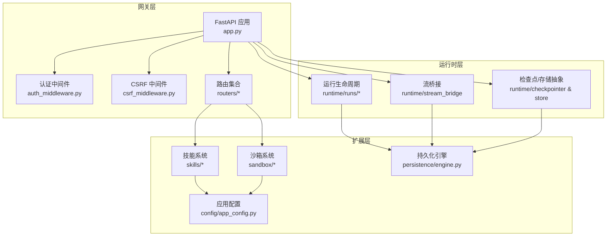
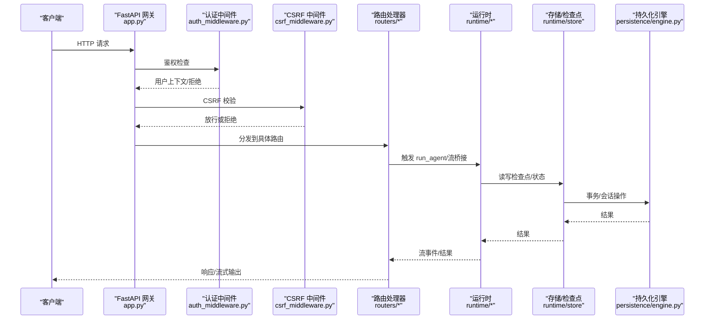
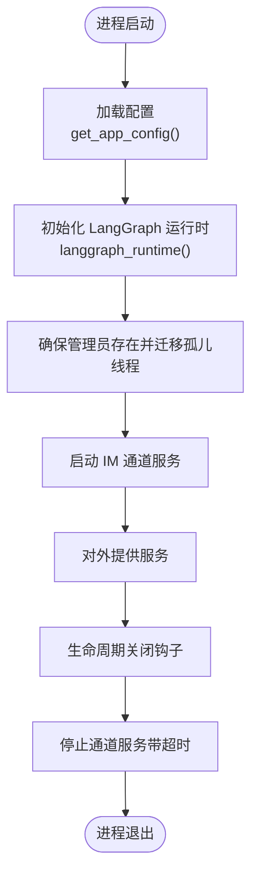
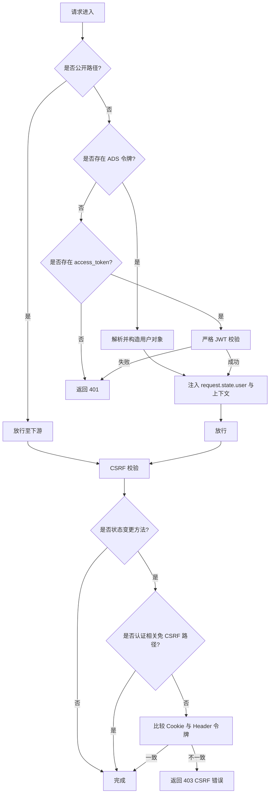
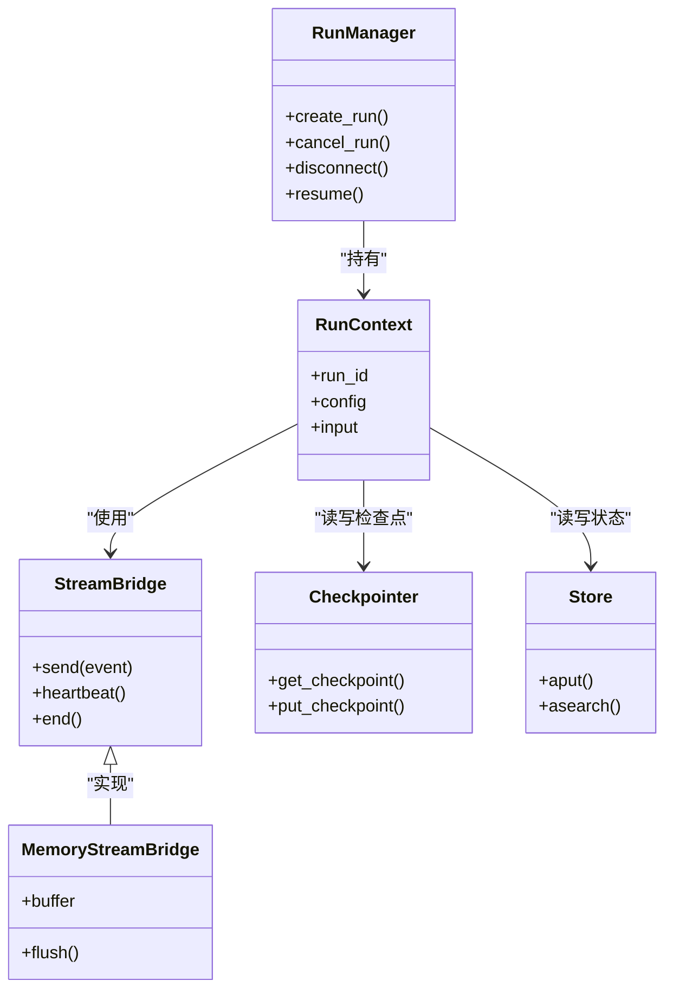
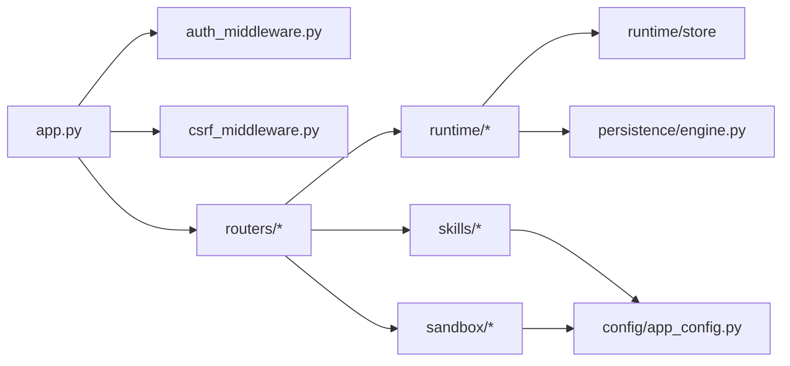

# 后端系统

<cite>
**本文引用的文件**
- [backend/app/gateway/app.py](file://backend/app/gateway/app.py)
- [backend/app/gateway/__init__.py](file://backend/app/gateway/__init__.py)
- [backend/app/gateway/auth_middleware.py](file://backend/app/gateway/auth_middleware.py)
- [backend/app/gateway/csrf_middleware.py](file://backend/app/gateway/csrf_middleware.py)
- [backend/app/gateway/routers/agents.py](file://backend/app/gateway/routers/agents.py)
- [backend/app/gateway/routers/memory.py](file://backend/app/gateway/routers/memory.py)
- [backend/app/gateway/routers/skills.py](file://backend/app/gateway/routers/skills.py)
- [backend/packages/harness/deerflow/runtime/__init__.py](file://backend/packages/harness/deerflow/runtime/__init__.py)
- [backend/packages/harness/deerflow/runtime/runs/__init__.py](file://backend/packages/harness/deerflow/runtime/runs/__init__.py)
- [backend/packages/harness/deerflow/runtime/store/__init__.py](file://backend/packages/harness/deerflow/runtime/store/__init__.py)
- [backend/packages/harness/deerflow/sandbox/__init__.py](file://backend/packages/harness/deerflow/sandbox/__init__.py)
- [backend/packages/harness/deerflow/skills/__init__.py](file://backend/packages/harness/deerflow/skills/__init__.py)
- [backend/packages/harness/deerflow/persistence/engine.py](file://backend/packages/harness/deerflow/persistence/engine.py)
- [backend/packages/harness/deerflow/config/app_config.py](file://backend/packages/harness/deerflow/config/app_config.py)
- [backend/packages/harness/deerflow/config/runtime_paths.py](file://backend/packages/harness/deerflow/config/runtime_paths.py)
</cite>

## 目录
1. [简介](#简介)
2. [项目结构](#项目结构)
3. [核心组件](#核心组件)
4. [架构总览](#架构总览)
5. [详细组件分析](#详细组件分析)
6. [依赖分析](#依赖分析)
7. [性能考虑](#性能考虑)
8. [故障排查指南](#故障排查指南)
9. [结论](#结论)
10. [附录](#附录)

## 简介
本文件面向 DeerFlow 后端系统的开发者与运维人员，系统性梳理基于 FastAPI 的应用网关架构、模块化路由系统、中间件设计与生命周期管理；深入解析智能体运行时（LangGraph 集成）、子智能体管理、内存管理的设计与实现；阐述沙箱执行系统、技能系统架构、认证授权机制与数据持久化设计，并提供接口规范、配置项与集成方式说明，辅以性能优化建议、错误处理策略与调试技巧。

## 项目结构
后端采用“网关 + 运行时 + 扩展”三层组织：
- 网关层：FastAPI 应用、中间件、路由集合，负责入口控制、文档开关、扩展注入与统一挂载。
- 运行时层：LangGraph 兼容的运行生命周期、流桥接、检查点与存储抽象，支撑 runs 生命周期与事件流。
- 扩展层：技能、沙箱、安全扫描、MCP、工具组等可插拔能力，通过配置与运行时路径进行装配。

图表来源
- [backend/app/gateway/app.py:229-418](file://backend/app/gateway/app.py#L229-L418)
- [backend/app/gateway/auth_middleware.py:53-160](file://backend/app/gateway/auth_middleware.py#L53-L160)
- [backend/app/gateway/csrf_middleware.py:175-238](file://backend/app/gateway/csrf_middleware.py#L175-L238)
- [backend/packages/harness/deerflow/runtime/runs/__init__.py:1-17](file://backend/packages/harness/deerflow/runtime/runs/__init__.py#L1-L17)
- [backend/packages/harness/deerflow/runtime/store/__init__.py:1-32](file://backend/packages/harness/deerflow/runtime/store/__init__.py#L1-L32)
- [backend/packages/harness/deerflow/skills/__init__.py:1-18](file://backend/packages/harness/deerflow/skills/__init__.py#L1-L18)
- [backend/packages/harness/deerflow/sandbox/__init__.py:1-9](file://backend/packages/harness/deerflow/sandbox/__init__.py#L1-L9)
- [backend/packages/harness/deerflow/persistence/engine.py:1-200](file://backend/packages/harness/deerflow/persistence/engine.py#L1-L200)
- [backend/packages/harness/deerflow/config/app_config.py:85-460](file://backend/packages/harness/deerflow/config/app_config.py#L85-L460)

章节来源
- [backend/app/gateway/app.py:229-418](file://backend/app/gateway/app.py#L229-L418)
- [backend/app/gateway/__init__.py:1-5](file://backend/app/gateway/__init__.py#L1-L5)

## 核心组件
- 应用网关与生命周期
  - FastAPI 应用创建、文档开关、OpenAPI Tags、健康检查端点。
  - 生命周期钩子：启动加载配置、初始化 LangGraph 运行时、通道服务启动、关闭时清理。
- 中间件体系
  - 认证中间件：严格鉴权、用户上下文注入、失败即闭合的安全策略。
  - CSRF 中间件：双提交 Cookie 模式、跨站来源校验、会话建立时设置 CSRF Cookie。
- 路由系统
  - 模块化挂载：models、mcp、memory、skills、artifacts、uploads、threads、agents、suggestions、channels、assistants-compat、auth、feedback、thread-runs、runs。
- 运行时与 LangGraph 集成
  - 运行生命周期管理、流桥接、检查点与存储抽象，支持长连接事件流与断连恢复。
- 技能系统
  - 技能安装/卸载/启用禁用、自定义技能编辑、历史回滚、安全扫描与权限控制。
- 沙箱系统
  - 提供 Sandbox 与 SandboxProvider 接口，支持本地/远程沙箱后端。
- 认证授权
  - 基于 Cookie/JWT 的会话认证，内部令牌校验，公开路径白名单，细粒度权限在装饰器中实现。
- 数据持久化
  - 异步 SQLAlchemy 引擎生命周期、自动建表、PostgreSQL 自动建库、SQLite WAL/外键开启、内存后端兼容。

章节来源
- [backend/app/gateway/app.py:169-227](file://backend/app/gateway/app.py#L169-L227)
- [backend/app/gateway/auth_middleware.py:53-160](file://backend/app/gateway/auth_middleware.py#L53-L160)
- [backend/app/gateway/csrf_middleware.py:175-238](file://backend/app/gateway/csrf_middleware.py#L175-L238)
- [backend/packages/harness/deerflow/runtime/__init__.py:1-47](file://backend/packages/harness/deerflow/runtime/__init__.py#L1-L47)
- [backend/packages/harness/deerflow/skills/__init__.py:1-18](file://backend/packages/harness/deerflow/skills/__init__.py#L1-L18)
- [backend/packages/harness/deerflow/sandbox/__init__.py:1-9](file://backend/packages/harness/deerflow/sandbox/__init__.py#L1-L9)
- [backend/packages/harness/deerflow/persistence/engine.py:57-200](file://backend/packages/harness/deerflow/persistence/engine.py#L57-L200)

## 架构总览
下图展示从请求进入网关到运行时与存储的交互路径，以及扩展注入流程。

图表来源
- [backend/app/gateway/app.py:322-418](file://backend/app/gateway/app.py#L322-L418)
- [backend/app/gateway/auth_middleware.py:76-160](file://backend/app/gateway/auth_middleware.py#L76-L160)
- [backend/app/gateway/csrf_middleware.py:181-229](file://backend/app/gateway/csrf_middleware.py#L181-L229)
- [backend/packages/harness/deerflow/runtime/runs/__init__.py:1-17](file://backend/packages/harness/deerflow/runtime/runs/__init__.py#L1-L17)
- [backend/packages/harness/deerflow/runtime/store/__init__.py:1-32](file://backend/packages/harness/deerflow/runtime/store/__init__.py#L1-L32)
- [backend/packages/harness/deerflow/persistence/engine.py:168-200](file://backend/packages/harness/deerflow/persistence/engine.py#L168-L200)

## 详细组件分析

### 应用网关与生命周期
- 创建与配置
  - 文档开关、OpenAPI Tags、健康检查端点。
  - 扩展注入：通过 boot_all_extensions 注入数据采集、广告认证、环境设置、主题守卫等扩展。
- 生命周期
  - 启动：加载配置、初始化 LangGraph 运行时、通道服务启动。
  - 关闭：通道服务停止（带超时保护）。
- 首次引导与迁移
  - 若无管理员账户，打印初始化令牌提示；存在管理员后迁移 LangGraph 存储中的孤儿线程元数据。

图表来源
- [backend/app/gateway/app.py:169-227](file://backend/app/gateway/app.py#L169-L227)

章节来源
- [backend/app/gateway/app.py:229-418](file://backend/app/gateway/app.py#L229-L418)

### 中间件设计
- 认证中间件
  - 公开路径白名单（健康/文档/开放 API）。
  - ADS/JWT 解析与过期校验、内部令牌校验、用户上下文注入。
  - 失败即闭合：非公开路径必须通过严格鉴权。
- CSRF 中间件
  - 双提交 Cookie 模式，仅对状态变更方法生效。
  - 跨站来源校验：允许同源或显式配置的 CORS 来源；首次登录/注册免 CSRF。
  - 登录成功响应中设置 CSRF Cookie。

图表来源
- [backend/app/gateway/auth_middleware.py:46-160](file://backend/app/gateway/auth_middleware.py#L46-L160)
- [backend/app/gateway/csrf_middleware.py:32-229](file://backend/app/gateway/csrf_middleware.py#L32-L229)

章节来源
- [backend/app/gateway/auth_middleware.py:53-160](file://backend/app/gateway/auth_middleware.py#L53-L160)
- [backend/app/gateway/csrf_middleware.py:175-238](file://backend/app/gateway/csrf_middleware.py#L175-L238)

### 模块化路由系统
- 路由挂载清单
  - 模型：/api/models
  - MCP：/api/mcp
  - 内存：/api/memory
  - 技能：/api/skills
  - 工件：/api/threads/{thread_id}/artifacts
  - 上传：/api/threads/{thread_id}/uploads
  - 线程：/api/threads/{thread_id}
  - 自定义代理：/api/agents
  - 建议：/api/threads/{thread_id}/suggestions
  - 通道：/api/channels
  - 兼容助手：/api/assistants-compat
  - 认证：/api/v1/auth
  - 反馈：/api/threads/{thread_id}/runs/{run_id}/feedback
  - 线程运行：/api/threads/{thread_id}/runs
  - 无状态运行：/api/runs
- 典型路由示例
  - 自定义代理：创建/更新/删除、名称检查、用户全局档案。
  - 内存：查询/重载/清空、事实增删改、导入导出、配置与状态查询。
  - 技能：列出、安装、启用/禁用、自定义技能编辑/删除/历史/回滚。

章节来源
- [backend/app/gateway/app.py:358-403](file://backend/app/gateway/app.py#L358-L403)
- [backend/app/gateway/routers/agents.py:106-447](file://backend/app/gateway/routers/agents.py#L106-L447)
- [backend/app/gateway/routers/memory.py:110-357](file://backend/app/gateway/routers/memory.py#L110-L357)
- [backend/app/gateway/routers/skills.py:88-353](file://backend/app/gateway/routers/skills.py#L88-L353)

### 智能体运行时系统（LangGraph 集成）
- 运行生命周期
  - RunManager：创建/取消/恢复/断连处理。
  - RunContext：运行上下文封装。
  - run_agent：LangGraph 平台兼容的运行入口。
- 流桥接
  - StreamBridge：事件流桥接，支持心跳与结束哨兵。
  - MemoryStreamBridge：内存桥接实现。
- 检查点与存储
  - checkpointer：检查点提供者上下文切换。
  - store：异步/同步存储提供者，支持运行时生命周期内复用。

图表来源
- [backend/packages/harness/deerflow/runtime/runs/__init__.py:1-17](file://backend/packages/harness/deerflow/runtime/runs/__init__.py#L1-L17)
- [backend/packages/harness/deerflow/runtime/store/__init__.py:1-32](file://backend/packages/harness/deerflow/runtime/store/__init__.py#L1-L32)
- [backend/packages/harness/deerflow/runtime/__init__.py:1-47](file://backend/packages/harness/deerflow/runtime/__init__.py#L1-L47)

章节来源
- [backend/packages/harness/deerflow/runtime/__init__.py:1-47](file://backend/packages/harness/deerflow/runtime/__init__.py#L1-L47)
- [backend/packages/harness/deerflow/runtime/runs/__init__.py:1-17](file://backend/packages/harness/deerflow/runtime/runs/__init__.py#L1-L17)
- [backend/packages/harness/deerflow/runtime/store/__init__.py:1-32](file://backend/packages/harness/deerflow/runtime/store/__init__.py#L1-L32)

### 内存管理系统
- 数据模型
  - 用户上下文（工作/个人/心头事）、历史上下文（近月/早期/长期背景）、事实列表（含置信度、来源、错误记录）。
- 功能接口
  - 查询/重载/清空、新增/删除/部分更新事实、导入/导出、查询配置与状态。
- 配置项
  - 开关、存储路径、去抖间隔、最大事实数、置信度阈值、注入开关与最大注入 token 数。

章节来源
- [backend/app/gateway/routers/memory.py:21-357](file://backend/app/gateway/routers/memory.py#L21-L357)

### 技能系统架构
- 能力边界
  - 列表、详情、启用/禁用、安装（从 .skill 归档）、自定义技能编辑/删除/历史/回滚。
  - 安全扫描：内容扫描与阻断，历史记录包含扫描决策与原因。
- 依赖与存储
  - 使用技能存储抽象与应用配置，安装后刷新系统提示缓存。

章节来源
- [backend/app/gateway/routers/skills.py:88-353](file://backend/app/gateway/routers/skills.py#L88-L353)
- [backend/packages/harness/deerflow/skills/__init__.py:1-18](file://backend/packages/harness/deerflow/skills/__init__.py#L1-L18)

### 沙箱执行系统
- 组件
  - Sandbox：沙箱抽象。
  - SandboxProvider：提供者接口与获取函数。
- 用途
  - 在运行时或工具调用链中隔离执行外部命令与脚本，结合安全扫描与审计中间件。

章节来源
- [backend/packages/harness/deerflow/sandbox/__init__.py:1-9](file://backend/packages/harness/deerflow/sandbox/__init__.py#L1-L9)

### 认证授权机制
- 会话与鉴权
  - Cookie access_token 作为会话凭证；严格 JWT 校验；内部令牌用于网关内部调用。
- 公开路径
  - 健康检查、文档、开放 API 与特定认证路径免鉴权。
- 权限控制
  - 中间件负责认证，细粒度权限在装饰器中实现（如 owner_check）。

章节来源
- [backend/app/gateway/auth_middleware.py:24-71](file://backend/app/gateway/auth_middleware.py#L24-L71)
- [backend/app/gateway/auth_middleware.py:112-160](file://backend/app/gateway/auth_middleware.py#L112-L160)

### 数据持久化设计
- 引擎生命周期
  - 初始化：根据后端类型（memory/sqlite/postgres）创建异步引擎与会话工厂。
  - 自动建表：开发阶段自动创建，生产建议使用迁移工具。
  - 关闭：释放连接池。
- PostgreSQL 特性
  - 缺库自动创建、连接池预热、JSON 序列化器。
- SQLite 特性
  - WAL 模式、同步级别、外键开启、连接级 PRAGMA 注册。

章节来源
- [backend/packages/harness/deerflow/persistence/engine.py:57-200](file://backend/packages/harness/deerflow/persistence/engine.py#L57-L200)

### 配置系统与运行时路径
- 应用配置
  - 多源定位 config.yaml，环境变量替换，版本校验与升级提示，运行时单例缓存与热重载。
  - 统一数据库默认值、扩展配置合并。
- 运行时路径
  - 项目根、运行时家目录、相对路径解析、现有项目文件查找。

章节来源
- [backend/packages/harness/deerflow/config/app_config.py:85-460](file://backend/packages/harness/deerflow/config/app_config.py#L85-L460)
- [backend/packages/harness/deerflow/config/runtime_paths.py:7-42](file://backend/packages/harness/deerflow/config/runtime_paths.py#L7-L42)

## 依赖分析
- 组件耦合
  - 网关对运行时与存储的依赖通过上下文注入与依赖工厂解耦。
  - 路由层通过依赖注入获取配置与运行时实例，降低耦合度。
- 外部依赖
  - FastAPI、Starlette、SQLAlchemy Async、Pydantic。
- 循环依赖规避
  - 运行时与存储提供 reset_* 函数以在配置变化时重建实例。

图表来源
- [backend/app/gateway/app.py:322-418](file://backend/app/gateway/app.py#L322-L418)
- [backend/app/gateway/auth_middleware.py:19-22](file://backend/app/gateway/auth_middleware.py#L19-L22)
- [backend/app/gateway/csrf_middleware.py:12-15](file://backend/app/gateway/csrf_middleware.py#L12-L15)
- [backend/packages/harness/deerflow/runtime/store/__init__.py:21-22](file://backend/packages/harness/deerflow/runtime/store/__init__.py#L21-L22)
- [backend/packages/harness/deerflow/persistence/engine.py:16-16](file://backend/packages/harness/deerflow/persistence/engine.py#L16-L16)
- [backend/packages/harness/deerflow/config/app_config.py:12-34](file://backend/packages/harness/deerflow/config/app_config.py#L12-L34)

## 性能考虑
- 异步与并发
  - 使用 SQLAlchemy AsyncEngine 与异步会话工厂，避免阻塞 IO。
  - 连接池参数（PostgreSQL）与 WAL 模式（SQLite）提升并发读写性能。
- 运行时流式
  - StreamBridge 心跳与断连恢复减少长连接中断影响。
- 缓存与懒加载
  - 配置热重载与运行时单例缓存，避免重复解析与初始化。
- I/O 优化
  - 文件系统操作（技能安装/编辑）尽量批量与原子化，失败回滚。

## 故障排查指南
- 启动失败
  - 配置加载异常：检查 config.yaml 路径与格式，确认环境变量替换。
  - 数据库未就绪：PostgreSQL 缺库自动创建失败或权限不足；SQLite 目录不可写。
- 认证/CSRF
  - 401：缺少 access_token 或令牌无效/过期；确认 Cookie 设置与 JWT 生成。
  - 403 CSRF：缺失或不匹配的 X-CSRF-Token，或跨站来源不在允许列表。
- 运行时
  - 运行创建/取消异常：检查 RunManager 与检查点提供者状态。
  - 流中断：确认断连模式与心跳策略。
- 技能
  - 安装/编辑被阻断：查看安全扫描决策与原因，修正内容后重试。
- 内存
  - 导入/导出失败：检查存储路径权限与 JSON 结构合法性。

章节来源
- [backend/packages/harness/deerflow/persistence/engine.py:150-164](file://backend/packages/harness/deerflow/persistence/engine.py#L150-L164)
- [backend/app/gateway/auth_middleware.py:144-148](file://backend/app/gateway/auth_middleware.py#L144-L148)
- [backend/app/gateway/csrf_middleware.py:197-212](file://backend/app/gateway/csrf_middleware.py#L197-L212)
- [backend/app/gateway/routers/skills.py:115-126](file://backend/app/gateway/routers/skills.py#L115-L126)

## 结论
DeerFlow 后端以 FastAPI 网关为核心，通过严格的中间件与模块化路由实现安全与可扩展的入口控制；运行时层提供 LangGraph 兼容的生命周期与流桥接，结合检查点与存储抽象，满足复杂对话与工具调用场景；技能与沙箱系统在安全边界内提供强大的扩展能力；配置与持久化设计兼顾开发体验与生产稳定性。整体架构清晰、职责分离明确，便于演进与维护。

## 附录
- 接口规范与集成要点
  - 网关：健康检查 /health；文档开关受配置控制；扩展通过 boot_all_extensions 注入。
  - 认证：Cookie access_token + JWT；内部令牌头名常量；公开路径白名单。
  - CSRF：双提交 Cookie；状态变更方法强制校验；认证免 CSRF。
  - 运行时：RunManager/StreamBridge/Checkpointer/Store；断连恢复与心跳。
  - 技能：安装/启用/编辑/删除/历史/回滚；安全扫描与缓存刷新。
  - 内存：事实 CRUD、导入导出、配置查询。
  - 持久化：异步引擎、自动建表、PostgreSQL 自动建库、SQLite WAL。
- 配置项参考
  - AppConfig：日志级别、模型/工具/技能/沙箱/内存/标题/摘要/记忆/代理 API/ACP/子智能体/守卫/电路/循环检测/安全终止/数据库/运行事件/检查点/流桥接。
  - 运行时路径：项目根、运行时家目录、路径解析、现有项目文件查找。

章节来源
- [backend/app/gateway/app.py:404-412](file://backend/app/gateway/app.py#L404-L412)
- [backend/app/gateway/auth_middleware.py:112-115](file://backend/app/gateway/auth_middleware.py#L112-L115)
- [backend/packages/harness/deerflow/config/app_config.py:85-114](file://backend/packages/harness/deerflow/config/app_config.py#L85-L114)
- [backend/packages/harness/deerflow/config/runtime_paths.py:19-32](file://backend/packages/harness/deerflow/config/runtime_paths.py#L19-L32)