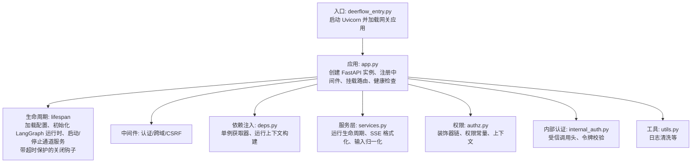
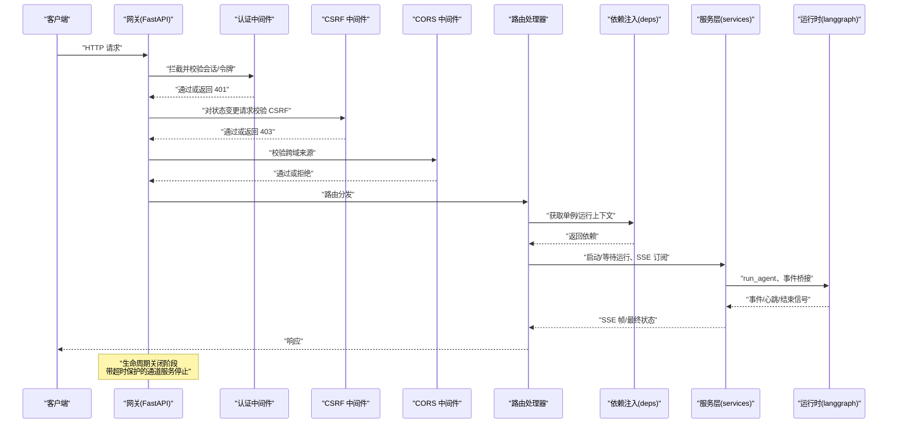
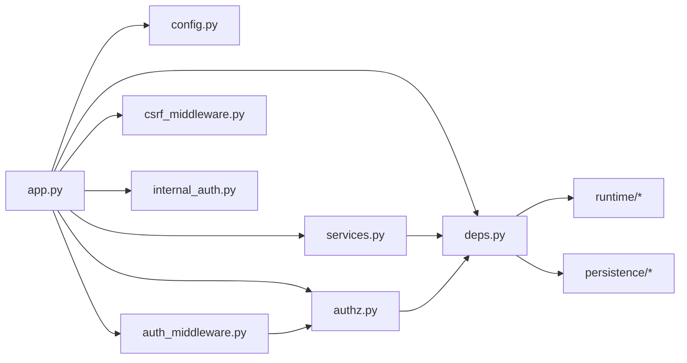

# 应用网关架构

<cite>
**本文引用的文件**
- [backend/app/gateway/app.py](file://backend/app/gateway/app.py)
- [backend/app/gateway/config.py](file://backend/app/gateway/config.py)
- [backend/app/gateway/auth_middleware.py](file://backend/app/gateway/auth_middleware.py)
- [backend/app/gateway/csrf_middleware.py](file://backend/app/gateway/csrf_middleware.py)
- [backend/app/gateway/deps.py](file://backend/app/gateway/deps.py)
- [backend/app/gateway/services.py](file://backend/app/gateway/services.py)
- [backend/app/gateway/internal_auth.py](file://backend/app/gateway/internal_auth.py)
- [backend/app/gateway/authz.py](file://backend/app/gateway/authz.py)
- [backend/app/gateway/utils.py](file://backend/app/gateway/utils.py)
- [backend/app/gateway/__init__.py](file://backend/app/gateway/__init__.py)
- [backend/deerflow_entry.py](file://backend/deerflow_entry.py)
- [backend/tests/test_gateway_lifespan_shutdown.py](file://backend/tests/test_gateway_lifespan_shutdown.py)
</cite>

## 目录
1. [简介](#简介)
2. [项目结构](#项目结构)
3. [核心组件](#核心组件)
4. [架构总览](#架构总览)
5. [详细组件分析](#详细组件分析)
6. [依赖分析](#依赖分析)
7. [性能考虑](#性能考虑)
8. [故障排查指南](#故障排查指南)
9. [结论](#结论)
10. [附录：扩展与最佳实践](#附录扩展与最佳实践)

## 简介
本文件面向 DeerFlow 应用网关（FastAPI）的架构与实现，系统性阐述基于 FastAPI 的应用入口设计、生命周期管理、配置系统与初始化流程；详解应用实例创建、中间件注册机制、依赖注入系统与全局异常处理；并提供可操作的扩展指引与性能优化建议，帮助开发者快速理解并安全地扩展网关能力。

**更新** 新增生命周期关闭钩子机制，防止工作线程挂起和解决uvicorn重载下的死锁问题。

## 项目结构
网关位于 backend/app/gateway 目录，采用"入口 + 生命周期 + 中间件 + 路由 + 服务层 + 依赖注入"的分层组织方式。入口文件负责创建与配置 FastAPI 实例，并在 lifespan 中完成运行时引擎与通道服务的启动/停止；中间件层提供认证、跨域与 CSRF 保护；依赖注入层集中管理单例对象与请求级访问器；服务层封装运行生命周期与事件流消费逻辑；工具与权限模块提供通用能力与授权控制。

**图表来源**
- [backend/deerflow_entry.py:170-184](file://backend/deerflow_entry.py#L170-L184)
- [backend/app/gateway/app.py:229-418](file://backend/app/gateway/app.py#L229-L418)
- [backend/app/gateway/deps.py:96-181](file://backend/app/gateway/deps.py#L96-L181)
- [backend/app/gateway/services.py:265-453](file://backend/app/gateway/services.py#L265-L453)

**章节来源**
- [backend/app/gateway/app.py:229-418](file://backend/app/gateway/app.py#L229-L418)
- [backend/app/gateway/deps.py:96-181](file://backend/app/gateway/deps.py#L96-L181)
- [backend/deerflow_entry.py:170-184](file://backend/deerflow_entry.py#L170-L184)

## 核心组件
- 应用入口与生命周期
  - 入口函数创建 FastAPI 实例，按需启用 OpenAPI 文档端点；在 lifespan 中加载配置、初始化 LangGraph 运行时、启动通道服务，并在关闭阶段进行受限超时的清理。
  - **新增** 生命周期关闭钩子：通过 `_SHUTDOWN_HOOK_TIMEOUT_SECONDS` 常量限制关闭阶段的执行时间，防止工作线程挂起和uvicorn重载死锁。
- 中间件体系
  - 认证中间件：严格拦截非公开路径，支持本地 JWT 与内部令牌，失败即刻返回 401。
  - CSRF 中间件：双提交 Cookie 模式，对状态变更请求进行防护，允许特定认证路径豁免。
  - CORS 中间件：基于环境变量白名单统一来源校验，确保与 CSRF 来源一致。
- 依赖注入与运行上下文
  - 通过 app.state 注册持久化引擎、检查点、存储、事件存储、运行管理器等单例；提供请求级 getter 与运行上下文构建器，区分热重载字段与冻结配置。
- 服务层与运行生命周期
  - 封装 SSE 帧格式化、输入消息归一化、运行配置合并、断连策略、等待完成与取消语义。
- 权限与内部认证
  - 权限装饰器链实现资源级细粒度授权；内部认证提供受信调用头与默认用户上下文。

**章节来源**
- [backend/app/gateway/app.py:169-227](file://backend/app/gateway/app.py#L169-L227)
- [backend/app/gateway/auth_middleware.py:53-160](file://backend/app/gateway/auth_middleware.py#L53-L160)
- [backend/app/gateway/csrf_middleware.py:175-238](file://backend/app/gateway/csrf_middleware.py#L175-L238)
- [backend/app/gateway/deps.py:96-240](file://backend/app/gateway/deps.py#L96-L240)
- [backend/app/gateway/services.py:265-453](file://backend/app/gateway/services.py#L265-L453)
- [backend/app/gateway/authz.py:147-303](file://backend/app/gateway/authz.py#L147-L303)
- [backend/app/gateway/internal_auth.py:15-38](file://backend/app/gateway/internal_auth.py#L15-L38)

## 架构总览
下图展示了从请求进入网关到运行生命周期结束的关键交互路径，包括中间件拦截、依赖解析、运行上下文构建与事件订阅。

**图表来源**
- [backend/app/gateway/app.py:322-413](file://backend/app/gateway/app.py#L322-L413)
- [backend/app/gateway/auth_middleware.py:76-160](file://backend/app/gateway/auth_middleware.py#L76-L160)
- [backend/app/gateway/csrf_middleware.py:181-229](file://backend/app/gateway.csrf_middleware.py#L181-L229)
- [backend/app/gateway/deps.py:201-240](file://backend/app/gateway/deps.py#L201-L240)
- [backend/app/gateway/services.py:265-453](file://backend/app/gateway/services.py#L265-L453)

## 详细组件分析

### 应用入口与生命周期（app.py）
- 应用创建
  - 支持按配置开关 OpenAPI 文档端点；设置标签与描述，便于文档生成与调试。
- 生命周期（lifespan）
  - 启动阶段：加载应用配置、应用日志级别、初始化 LangGraph 运行时（流桥、检查点、存储、运行/事件存储、运行管理器），随后执行管理员引导与孤线程迁移。
  - **新增** 关闭阶段：在限定时间内优雅停止通道服务，避免进程卡死。使用 `_SHUTDOWN_HOOK_TIMEOUT_SECONDS` 常量限制关闭超时时间，防止工作线程挂起和uvicorn重载死锁。
- 中间件注册
  - 认证中间件（Fail-closed 安全网）、CSRF 双提交 Cookie、CORS 白名单来源校验。
- 路由挂载
  - 按 API 分类挂载多个子路由，覆盖模型、MCP、内存、技能、制品、上传、线程、代理、建议、通道、兼容接口、认证、反馈、运行等。
- 健康检查
  - 提供 /health 端点返回健康状态。

**章节来源**
- [backend/app/gateway/app.py:229-418](file://backend/app/gateway/app.py#L229-L418)
- [backend/app/gateway/app.py:169-227](file://backend/app/gateway/app.py#L169-L227)

### 生命周期关闭钩子机制
**新增** 为了解决uvicorn重载下的死锁问题和防止工作线程挂起，网关实现了带超时保护的生命周期关闭钩子机制。

- 超时常量定义
  - `_SHUTDOWN_HOOK_TIMEOUT_SECONDS = 5.0`：每个生命周期关闭钩子的最大执行时间为5秒。
- 关闭钩子实现
  - 在 lifespan 上下文的 `yield` 之后执行，确保在应用关闭时进行资源清理。
  - 使用 `asyncio.wait_for()` 包装 `stop_channel_service()` 调用，设置超时保护。
  - 超时处理：超过时限时记录警告日志并继续退出，避免阻塞uvicorn工作进程。
  - 异常处理：捕获并记录停止服务过程中的异常，但不影响应用正常退出。
- 死锁预防
  - 通过超时机制防止恶意或故障的服务停止操作导致工作线程永久挂起。
  - 确保uvicorn重载 supervisor能够正常向被卡住的工作进程发送信号。
- 测试保障
  - 提供专门的回归测试，验证当通道服务停止操作挂起时，生命周期关闭仍然能够在指定时间内完成。

**章节来源**
- [backend/app/gateway/app.py:50-54](file://backend/app/gateway/app.py#L50-L54)
- [backend/app/gateway/app.py:301-316](file://backend/app/gateway/app.py#L301-L316)
- [backend/tests/test_gateway_lifespan_shutdown.py:1-69](file://backend/tests/test_gateway_lifespan_shutdown.py#L1-L69)

### 配置系统（config.py）
- 网关配置模型
  - 包含监听地址、端口、是否启用文档等字段，支持从环境变量读取默认值。
- 获取配置
  - 单例缓存，首次加载后复用，避免重复解析。

**章节来源**
- [backend/app/gateway/config.py:6-27](file://backend/app/gateway/config.py#L6-L27)

### 认证中间件（auth_middleware.py）
- 公开路径豁免
  - 健康检查与文档端点无需认证。
- 两阶段校验
  - 会话 Cookie 存在性检查；严格 JWT 解析与用户存在性验证，失败返回 401。
- ADS 临时认证
  - 对特定 Cookie 进行 JWT 结构解析与过期判断，若有效则构造用户上下文，绕过常规鉴权流程。
- 用户上下文
  - 在请求状态与运行时上下文中写入当前用户，便于下游仓库层的拥有者过滤。

**章节来源**
- [backend/app/gateway/auth_middleware.py:24-160](file://backend/app/gateway/auth_middleware.py#L24-L160)

### CSRF 中间件（csrf_middleware.py）
- 规则
  - 对 POST/PUT/DELETE/PATCH 等状态变更请求进行 CSRF 校验；GET/HEAD/OPTIONS/TRACE 免检。
  - 特定认证端点首次调用免 CSRF（防止首次登录无令牌）。
- 来源校验
  - 仅允许同源或显式配置的 CORS 来源；通过 Forwarded/代理头解析真实来源。
- 双提交 Cookie
  - 登录成功后设置 CSRF Cookie，前端需携带 X-CSRF-Token 头匹配。

**章节来源**
- [backend/app/gateway/csrf_middleware.py:32-238](file://backend/app/gateway/csrf_middleware.py#L32-L238)

### 依赖注入与运行上下文（deps.py）
- 单例注册
  - 在 lifespan 中通过异步上下文栈创建并注入：流桥、检查点、存储、运行/事件存储、运行管理器、线程元数据存储等。
- 请求级访问器
  - 提供 get_* 方法，缺失时返回 503；get_store 可能为空（未配置）。
- 运行上下文
  - 组合运行基础设施与"热重载"配置，确保事件存储与启动时配置配对，避免配置分裂。
- 认证辅助
  - 缓存本地提供者与仓库，避免重复实例化；提供从请求解析当前用户的工具。

**章节来源**
- [backend/app/gateway/deps.py:96-240](file://backend/app/gateway/deps.py#L96-L240)

### 服务层与运行生命周期（services.py）
- SSE 帧格式化
  - 严格遵循 LangGraph 平台事件帧格式，支持事件 ID。
- 输入归一化
  - 将平台输入转换为 LangChain 消息列表，保留附件与角色信息，错误以 400 返回。
- 运行配置合并
  - 将 whitelisted 上下文键同时写入 configurable 与 context，兼容不同版本 LangGraph。
- 断连策略
  - 支持取消或继续两种模式；断连时根据策略取消后台任务。
- 等待完成
  - 通过事件桥订阅直到 END_SENTINEL，正确处理心跳与断连。

**章节来源**
- [backend/app/gateway/services.py:265-453](file://backend/app/gateway/services.py#L265-L453)

### 权限与装饰器（authz.py）
- 权限常量
  - 定义 threads 与 runs 的读写删与创建/取消等权限。
- 装饰器链
  - require_auth：强制认证，设置 AuthContext；require_permission：资源级权限与拥有者检查。
- 上下文
  - AuthContext 提供 is_authenticated、has_permission、require_user 等便捷方法。

**章节来源**
- [backend/app/gateway/authz.py:147-303](file://backend/app/gateway/authz.py#L147-L303)

### 内部认证（internal_auth.py）
- 受信调用头
  - X-DeerFlow-Internal-Token；支持从环境变量注入或随机生成。
- 校验与用户
  - 提供 is_valid_internal_auth_token 与 get_internal_user，用于内部通道等受信场景。

**章节来源**
- [backend/app/gateway/internal_auth.py:15-38](file://backend/app/gateway/internal_auth.py#L15-L38)

### 工具与实用函数（utils.py）
- 日志清洗
  - 去除换行、回车与空字符，防止日志注入。

**章节来源**
- [backend/app/gateway/utils.py:4-7](file://backend/app/gateway/utils.py#L4-L7)

### 入口脚本（deerflow_entry.py）
- PyInstaller 冻结打包
  - 显式导入所有动态加载模块路径，确保打包完整。
- 启动网关
  - 通过 uvicorn 运行 app，支持环境变量覆盖主机与端口。

**章节来源**
- [backend/deerflow_entry.py:170-184](file://backend/deerflow_entry.py#L170-L184)

## 依赖分析
- 组件耦合
  - app.py 作为中枢，依赖中间件、配置、依赖注入与路由集合；deps.py 依赖运行时与持久化模块；services.py 依赖 deps 与运行时；authz.py 依赖 deps 与认证模块；internal_auth.py 与 auth_middleware.py 协作实现内部信任链。
- 外部依赖
  - FastAPI、Starlette、LangGraph、SQLAlchemy、uvicorn 等。
- 循环依赖规避
  - 通过延迟导入与运行时解析避免循环引用；依赖注入 getter 在请求边界内解析，减少模块级耦合。

**图表来源**
- [backend/app/gateway/app.py:322-413](file://backend/app/gateway/app.py#L322-L413)
- [backend/app/gateway/deps.py:96-181](file://backend/app/gateway/deps.py#L96-L181)
- [backend/app/gateway/services.py:265-453](file://backend/app/gateway/services.py#L265-L453)
- [backend/app/gateway/authz.py:147-303](file://backend/app/gateway/authz.py#L147-L303)
- [backend/app/gateway/auth_middleware.py:76-160](file://backend/app/gateway/auth_middleware.py#L76-L160)
- [backend/app/gateway/internal_auth.py:15-38](file://backend/app/gateway/internal_auth.py#L15-L38)

## 性能考虑
- 生命周期与资源管理
  - 使用 lifespan 精准控制引擎与连接的生命周期，避免重复初始化；关闭阶段使用超时保护，防止卡死。
  - **新增** 超时保护机制确保即使某些服务停止操作挂起，也不会影响整体应用的优雅退出。
- 异步与并发
  - 事件桥订阅与运行任务均采用异步模式；合理设置断连策略，避免长时间阻塞。
- 配置热重载边界
  - 运行时配置冻结于启动快照，请求级配置通过 get_config 动态解析，平衡一致性与灵活性。
- 中间件顺序
  - 认证与 CSRF 优先于业务路由，降低后续处理成本；CORS 与 CSRF 共享来源白名单，减少重复计算。
- 日志与安全
  - 清洗日志参数，避免注入；严格断言来源与令牌，减少无效请求对后端的压力。
- **新增** 死锁预防
  - 通过超时机制防止工作线程挂起，确保uvicorn重载过程中的稳定性。
  - 测试覆盖验证关闭钩子的边界行为，保证在极端情况下的可靠性。

## 故障排查指南
- 启动失败
  - 检查配置加载与日志级别设置；确认数据库引擎初始化与 LangGraph 运行时组件可用。
- 认证失败
  - 确认 Cookie 与 JWT 有效性；检查 ADS 临时认证 Cookie 结构与过期时间；核对内部令牌头。
- CSRF 拒绝
  - 确认登录后设置了 CSRF Cookie；请求头 X-CSRF-Token 与 Cookie 匹配；来源符合 CORS 白名单。
- 权限不足
  - 检查装饰器链顺序与资源/动作权限；必要时开启拥有者检查并确保线程元数据存在。
- 运行中断
  - 查看断连策略与心跳订阅；确认事件桥与运行管理器状态；必要时取消并重试。
- **新增** 关闭阶段问题
  - 如果应用退出缓慢或uvicorn重载时出现死锁，检查通道服务的停止逻辑。
  - 查看是否有服务在停止过程中挂起，超时保护应该会在5秒后强制退出。
  - 检查日志中的警告信息，确认关闭钩子的超时行为是否按预期工作。

**章节来源**
- [backend/app/gateway/app.py:169-227](file://backend/app/gateway/app.py#L169-L227)
- [backend/app/gateway/auth_middleware.py:116-160](file://backend/app/gateway/auth_middleware.py#L116-L160)
- [backend/app/gateway/csrf_middleware.py:181-229](file://backend/app/gateway/csrf_middleware.py#L181-L229)
- [backend/app/gateway/authz.py:238-303](file://backend/app/gateway/authz.py#L238-L303)
- [backend/app/gateway/services.py:373-453](file://backend/app/gateway/services.py#L373-L453)

## 结论
该网关以 FastAPI 为核心，结合严格的中间件安全策略、清晰的依赖注入与运行时上下文、完善的生命周期管理与服务层抽象，形成了高可用、可扩展且易于维护的应用入口。**新增的生命周期关闭钩子机制进一步增强了系统的稳定性，通过超时保护防止工作线程挂起和uvicorn重载死锁问题，确保应用在各种异常情况下都能优雅退出。**通过明确的扩展点与最佳实践，开发者可在保证安全与一致性的前提下，灵活地增强网关功能。

## 附录：扩展与最佳实践
- 扩展中间件
  - 在 app.py 中新增中间件注册位置，注意与认证/CSRF/CORS 的顺序配合，避免破坏安全边界。
  - 示例参考路径：[backend/app/gateway/app.py:339-357](file://backend/app/gateway/app.py#L339-L357)
- 自定义路由
  - 在 routers 下新增模块并挂载到 app.py 的 include_router 调用处，保持命名规范与标签一致。
  - 示例参考路径：[backend/app/gateway/app.py:358-403](file://backend/app/gateway/app.py#L358-L403)
- 依赖注入扩展
  - 在 deps.py 中新增 getter 或在 lifespan 中注入新单例，确保请求边界内可访问。
  - 示例参考路径：[backend/app/gateway/deps.py:201-240](file://backend/app/gateway/deps.py#L201-L240)
- 全局异常处理
  - 在中间件或路由层捕获并规范化错误响应，避免泄露敏感信息；必要时记录结构化日志。
  - 示例参考路径：[backend/app/gateway/auth_middleware.py:144-148](file://backend/app/gateway/auth_middleware.py#L144-L148)
- 性能优化建议
  - 合理设置断连策略与心跳间隔；避免在请求处理中执行阻塞 IO；利用事件桥的异步特性提升吞吐。
  - 示例参考路径：[backend/app/gateway/services.py:373-453](file://backend/app/gateway/services.py#L373-L453)
- **新增** 生命周期关闭钩子扩展
  - 如需扩展其他关闭阶段的清理逻辑，确保使用超时保护包装可能阻塞的操作。
  - 参考现有实现：[backend/app/gateway/app.py:301-316](file://backend/app/gateway/app.py#L301-L316)
  - 测试验证：[backend/tests/test_gateway_lifespan_shutdown.py:59-69](file://backend/tests/test_gateway_lifespan_shutdown.py#L59-L69)