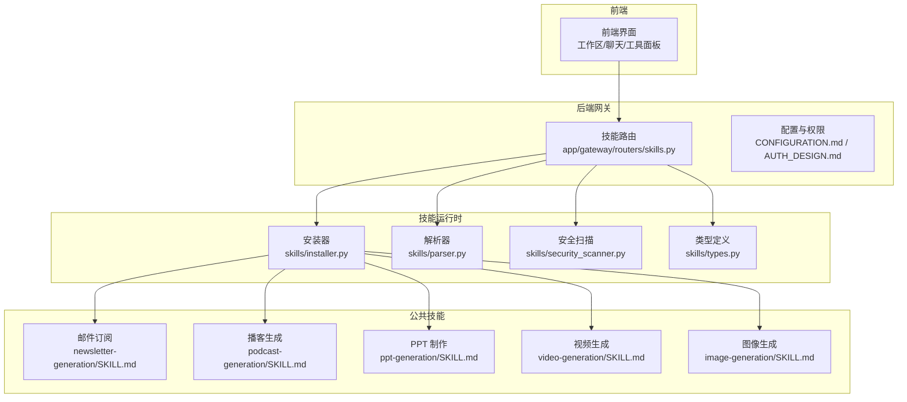
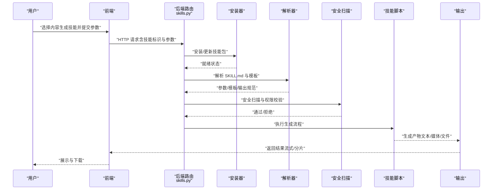
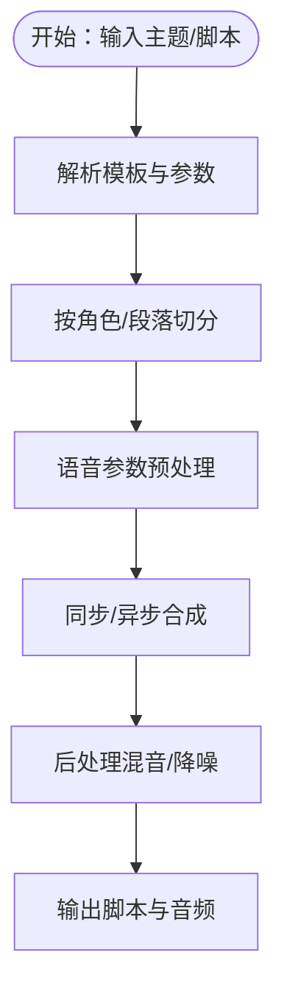
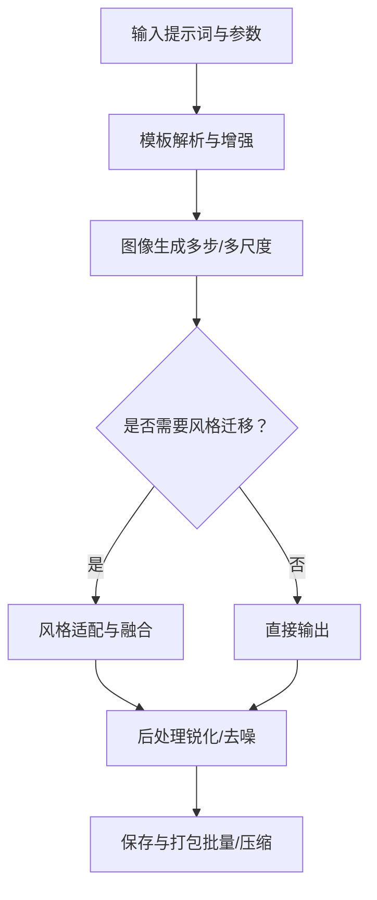
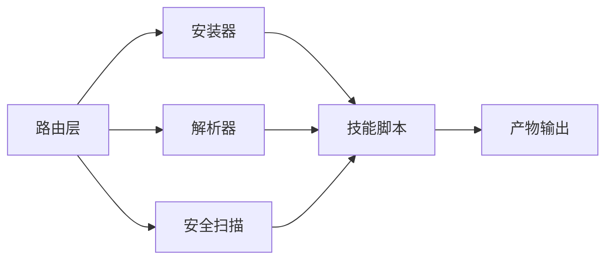

# 内容生成技能

<cite>
**本文引用的文件**
- [newsletter-generation/SKILL.md](file://skills/public/newsletter-generation/SKILL.md)
- [podcast-generation/SKILL.md](file://skills/public/podcast-generation/SKILL.md)
- [ppt-generation/SKILL.md](file://skills/public/ppt-generation/SKILL.md)
- [video-generation/SKILL.md](file://skills/public/video-generation/SKILL.md)
- [image-generation/SKILL.md](file://skills/public/image-generation/SKILL.md)
- [image-generation/scripts/generate.py](file://skills/public/image-generation/scripts/generate.py)
- [podcast-generation/scripts/generate.py](file://skills/public/podcast-generation/scripts/generate.py)
- [ppt-generation/scripts/generate.py](file://skills/public/ppt-generation/scripts/generate.py)
- [video-generation/scripts/generate.py](file://skills/public/video-generation/scripts/generate.py)
- [backend/app/gateway/routers/skills.py](file://backend/app/gateway/routers/skills.py)
- [backend/packages/harness/deerflow/skills/types.py](file://backend/packages/harness/deerflow/skills/types.py)
- [backend/packages/harness/deerflow/skills/parser.py](file://backend/packages/harness/deerflow/skills/parser.py)
- [backend/packages/harness/deerflow/skills/installer.py](file://backend/packages/harness/deerflow/skills/installer.py)
- [backend/packages/harness/deerflow/skills/security_scanner.py](file://backend/packages/harness/deerflow/skills/security_scanner.py)
- [backend/packages/harness/deerflow/skills/tool_policy.py](file://backend/packages/harness/deerflow/skills/tool_policy.py)
- [backend/docs/API.md](file://backend/docs/API.md)
- [backend/docs/CONFIGURATION.md](file://backend/docs/CONFIGURATION.md)
- [backend/docs/MEMORY_SETTINGS_REVIEW.md](file://backend/docs/MEMORY_SETTINGS_REVIEW.md)
- [backend/docs/AUTH_DESIGN.md](file://backend/docs/AUTH_DESIGN.md)
- [backend/docs/GUARDRAILS.md](file://backend/docs/GUARDRAILS.md)
- [backend/docs/TITLE_GENERATION_IMPLEMENTATION.md](file://backend/docs/TITLE_GENERATION_IMPLEMENTATION.md)
- [backend/docs/MEMORY_IMPROVEMENTS.md](file://backend/docs/MEMORY_IMPROVEMENTS.md)
- [backend/docs/STREAMING.md](file://backend/docs/STREAMING.md)
- [backend/docs/FILE_UPLOAD.md](file://backend/docs/FILE_UPLOAD.md)
- [backend/docs/MCP_SERVER.md](file://backend/docs/MCP_SERVER.md)
- [backend/docs/SETUP.md](file://backend/docs/SETUP.md)
- [backend/docs/AUTO_TITLE_GENERATION.md](file://backend/docs/AUTO_TITLE_GENERATION.md)
- [backend/docs/TASK_TOOL_IMPROVEMENTS.md](file://backend/docs/TASK_TOOL_IMPROVEMENTS.md)
- [backend/docs/PLAN_MODE_USAGE.md](file://backend/docs/PLAN_MODE_USAGE.md)
- [backend/docs/PATH_EXAMPLES.md](file://backend/docs/PATH_EXAMPLES.md)
- [backend/docs/RFC_CREATE_DEERFLOW_AGENT.md](file://backend/docs/RFC_CREATE_DEERFLOW_AGENT.md)
- [backend/docs/RFC_EXTRACT_SHARED_MODULES.md](file://backend/docs/RFC_EXTRACT_SHARED_MODULES.md)
- [backend/docs/RFC_GREP_GLOB_TOOLS.md](file://backend/docs/RFC_GREP_GLOB_TOOLS.md)
- [backend/docs/TODO.md](file://backend/docs/TODO.md)
- [backend/docs/CHANGELONG/code_change_summary/README.md](file://backend/docs/changelog/code_change_summary/README.md)
- [backend/docs/CHANGELONG/code_change_summary/backend.md](file://backend/docs/changelog/code_change_summary/backend.md)
- [backend/docs/CHANGELONG/code_change_summary/config.md](file://backend/docs/changelog/code_change_summary/config.md)
- [backend/docs/CHANGELONG/code_change_summary/docker.md](file://backend/docs/changelog/code_change_summary/docker.md)
- [backend/docs/CHANGELONG/code_change_summary/frontend.md](file://backend/docs/changelog/code_change_summary/frontend.md)
- [backend/docs/CHANGELONG/code_change_summary/skills.md](file://backend/docs/changelog/code_change_summary/skills.md)
- [backend/docs/operations/BUILD_AND_DEPLOY.md](file://backend/docs/operations/BUILD_AND_DEPLOY.md)
- [backend/docs/operations/DEPLOYMENT_KNOWN_ISSUES.md](file://backend/docs/operations/DEPLOYMENT_KNOWN_ISSUES.md)
- [backend/docs/operations/HERMES_AGENT_DEPLOY.md](file://backend/docs/operations/HERMES_AGENT_DEPLOY.md)
- [backend/docs/operations/USE_GUIDE.md](file://backend/docs/operations/USE_GUIDE.md)
- [backend/docs/methodology/零侵入扩展方法论.md](file://backend/docs/methodology/零侵入扩展方法论.md)
- [backend/docs/patches/README.md](file://backend/docs/patches/README.md)
- [backend/docs/patches/backend.md](file://backend/docs/patches/backend.md)
- [backend/docs/patches/config.md](file://backend/docs/patches/config.md)
- [backend/docs/patches/docker.md](file://backend/docs/patches/docker.md)
- [backend/docs/patches/frontend.md](file://backend/docs/patches/frontend.md)
- [backend/docs/patches/skills.md](file://backend/docs/patches/skills.md)
- [backend/docs/plans/2026-04-01-langfuse-tracing.md](file://backend/docs/plans/2026-04-01-langfuse-tracing.md)
- [backend/docs/plans/deerflow模型蒸馏私有化-数据量硬件与效果深度分析.md](file://backend/docs/plans/deerflow模型蒸馏私有化-数据量硬件与效果深度分析.md)
- [backend/docs/plans/deerflow模型蒸馏私有化可行性分析方案.md](file://backend/docs/plans/deerflow模型蒸馏私有化可行性分析方案.md)
- [backend/docs/plans/deerflow蒸馏数据采集体系设计.md](file://backend/docs/plans/deerflow蒸馏数据采集体系设计.md)
- [backend/docs/pr-evidence/README.md](file://backend/docs/pr-evidence/README.md)
- [backend/docs/skills/README.md](file://backend/docs/skills/README.md)
- [backend/docs/channels/README.md](file://backend/docs/channels/README.md)
- [backend/docs/config/NETWORK_CONFIG_CHANGES.md](file://backend/docs/config/NETWORK_CONFIG_CHANGES.md)
- [backend/docs/mcp/README.md](file://backend/docs/mcp/README.md)
- [backend/docs/mcp/ADS-MCP对接DeerFlow整合指南-实测版.md](file://backend/docs/mcp/ADS-MCP对接DeerFlow整合指南-实测版.md)
- [backend/docs/mcp/DeepRAG_MCP对接DeerFlow整合指南.md](file://backend/docs/mcp/DeepRAG_MCP对接DeerFlow整合指南.md)
- [backend/docs/mcp/RAGFLOW_MCP_INTEGRATION.md](file://backend/docs/mcp/RAGFLOW_MCP_INTEGRATION.md)
- [backend/docs/README.md](file://backend/docs/README.md)
- [backend/README.md](file://backend/README.md)
- [frontend/README.md](file://frontend/README.md)
- [docs/README.md](file://docs/README.md)
- [deer-flow/README.md](file://README.md)
</cite>

## 目录
1. [简介](#简介)
2. [项目结构](#项目结构)
3. [核心组件](#核心组件)
4. [架构总览](#架构总览)
5. [详细组件分析](#详细组件分析)
6. [依赖关系分析](#依赖关系分析)
7. [性能考量](#性能考量)
8. [故障排查指南](#故障排查指南)
9. [结论](#结论)
10. [附录](#附录)

## 简介
本文件面向 DeerFlow 的内容生成类技能，系统性梳理邮件订阅、播客生成、PPT 制作、视频生成与图像生成五大能力的实现方式、模板系统、参数配置与输出格式，并提供可操作的使用示例、质量控制方法与最佳实践。读者无需深入代码即可理解如何在 DeerFlow 中高效地调用与扩展这些技能。

## 项目结构
内容生成技能位于 skills/public 下，每个技能以独立目录呈现，包含技能描述文件（SKILL.md）、脚本（scripts/）与模板（templates/）。后端通过网关路由与技能运行时进行交互，技能安装、解析与安全策略由后端统一管理。

图示来源
- [backend/app/gateway/routers/skills.py](file://backend/app/gateway/routers/skills.py)
- [backend/packages/harness/deerflow/skills/installer.py](file://backend/packages/harness/deerflow/skills/installer.py)
- [backend/packages/harness/deerflow/skills/parser.py](file://backend/packages/harness/deerflow/skills/parser.py)
- [backend/packages/harness/deerflow/skills/security_scanner.py](file://backend/packages/harness/deerflow/skills/security_scanner.py)
- [backend/packages/harness/deerflow/skills/types.py](file://backend/packages/harness/deerflow/skills/types.py)
- [skills/public/newsletter-generation/SKILL.md](file://skills/public/newsletter-generation/SKILL.md)
- [skills/public/podcast-generation/SKILL.md](file://skills/public/podcast-generation/SKILL.md)
- [skills/public/ppt-generation/SKILL.md](file://skills/public/ppt-generation/SKILL.md)
- [skills/public/video-generation/SKILL.md](file://skills/public/video-generation/SKILL.md)
- [skills/public/image-generation/SKILL.md](file://skills/public/image-generation/SKILL.md)

章节来源
- [backend/app/gateway/routers/skills.py](file://backend/app/gateway/routers/skills.py)
- [backend/docs/API.md](file://backend/docs/API.md)
- [backend/docs/CONFIGURATION.md](file://backend/docs/CONFIGURATION.md)
- [backend/docs/AUTH_DESIGN.md](file://backend/docs/AUTH_DESIGN.md)

## 核心组件
- 技能路由与入口：后端网关负责接收前端请求，转发到技能安装器与解析器，执行安全扫描与权限校验，最终调用对应技能脚本。
- 安装器：负责从本地或远程仓库拉取技能包，解析元数据与依赖，准备运行环境。
- 解析器：解析 SKILL.md 与脚本，构建技能的输入参数、模板与输出规范。
- 安全扫描与策略：对技能脚本与模板进行安全扫描，限制危险操作；结合工具策略与权限矩阵控制执行范围。
- 类型系统：统一技能的参数、输出与事件类型，确保前后端一致性。

章节来源
- [backend/packages/harness/deerflow/skills/installer.py](file://backend/packages/harness/deerflow/skills/installer.py)
- [backend/packages/harness/deerflow/skills/parser.py](file://backend/packages/harness/deerflow/skills/parser.py)
- [backend/packages/harness/deerflow/skills/security_scanner.py](file://backend/packages/harness/deerflow/skills/security_scanner.py)
- [backend/packages/harness/deerflow/skills/tool_policy.py](file://backend/packages/harness/deerflow/skills/tool_policy.py)
- [backend/packages/harness/deerflow/skills/types.py](file://backend/packages/harness/deerflow/skills/types.py)

## 架构总览
下图展示一次典型的内容生成调用链：前端发起请求 → 后端路由 → 安装/解析 → 安全校验 → 调用具体技能脚本 → 输出结果。

图示来源
- [backend/app/gateway/routers/skills.py](file://backend/app/gateway/routers/skills.py)
- [backend/packages/harness/deerflow/skills/installer.py](file://backend/packages/harness/deerflow/skills/installer.py)
- [backend/packages/harness/deerflow/skills/parser.py](file://backend/packages/harness/deerflow/skills/parser.py)
- [backend/packages/harness/deerflow/skills/security_scanner.py](file://backend/packages/harness/deerflow/skills/security_scanner.py)
- [backend/docs/STREAMING.md](file://backend/docs/STREAMING.md)
- [backend/docs/FILE_UPLOAD.md](file://backend/docs/FILE_UPLOAD.md)

## 详细组件分析

### 邮件订阅生成（newsletter-generation）
- 功能特性
  - 基于主题与关键词自动抓取/聚合内容，生成可订阅的新闻简报。
  - 支持多来源聚合、去重与摘要抽取，便于后续邮件分发。
- 模板系统
  - 使用 SKILL.md 描述生成目标、受众与风格；支持自定义模板占位符。
  - 可通过 templates/ 扩展不同风格的邮件正文模板。
- 参数配置
  - 关键词/主题、时间窗口、来源渠道、语言偏好、排版风格等。
- 输出格式
  - 文本摘要、HTML 正文、Markdown 备选；可导出为邮件附件或链接。
- 使用示例
  - 示例路径：[newsletter-generation/SKILL.md](file://skills/public/newsletter-generation/SKILL.md)
- 适用场景
  - 产品周报、行业动态、研究综述、内部通讯等。
- 性能考虑
  - 并行抓取与缓存去重，避免重复计算；合理设置时间窗口减少无效检索。
- 质量控制
  - 引入去噪与摘要评分；对重复内容进行阈值过滤。

章节来源
- [skills/public/newsletter-generation/SKILL.md](file://skills/public/newsletter-generation/SKILL.md)

### 播客生成（podcast-generation）
- 功能特性
  - 将长文本内容转为口语化播客脚本，支持多角色对话与背景音乐提示。
- 模板系统
  - templates/ 提供讲解型模板，可替换角色名称、语气与节奏。
- 参数配置
  - 主题、角色数量、语速、音效风格、背景音乐开关等。
- 输出格式
  - 文本脚本（含分镜与音效标注）、音频文件（外部合成服务集成）。
- 使用示例
  - 示例路径：[podcast-generation/SKILL.md](file://skills/public/podcast-generation/SKILL.md)
  - 脚本路径：[podcast-generation/scripts/generate.py](file://skills/public/podcast-generation/scripts/generate.py)
- 适用场景
  - 教育课程、知识分享、播客节目策划。
- 性能考虑
  - 分段生成与缓存中间结果；音效与语音合成异步处理。
- 质量控制
  - 角色一致性校验、停顿与情感标注的合理性检查。

图示来源
- [podcast-generation/SKILL.md](file://skills/public/podcast-generation/SKILL.md)
- [podcast-generation/scripts/generate.py](file://skills/public/podcast-generation/scripts/generate.py)

章节来源
- [skills/public/podcast-generation/SKILL.md](file://skills/public/podcast-generation/SKILL.md)
- [podcast-generation/scripts/generate.py](file://skills/public/podcast-generation/scripts/generate.py)

### PPT 制作（ppt-generation）
- 功能特性
  - 将文本内容转换为结构化演示文稿，支持主题风格与布局模板。
- 模板系统
  - templates/ 存放不同风格的 PPT 结构模板；可自定义标题、正文、图表区域。
- 参数配置
  - 主题风格、幻灯片数量上限、图表类型、图片来源、字体与配色。
- 输出格式
  - PPTX 文件、PDF 导出、HTML 预览。
- 使用示例
  - 示例路径：[ppt-generation/SKILL.md](file://skills/public/ppt-generation/SKILL.md)
  - 脚本路径：[ppt-generation/scripts/generate.py](file://skills/public/ppt-generation/scripts/generate.py)
- 适用场景
  - 商务汇报、学术报告、培训课件。
- 性能考虑
  - 图表与图片生成并发化；大文件分块上传与断点续传。
- 质量控制
  - 内容密度与视觉平衡检查；图表可读性评分。

章节来源
- [skills/public/ppt-generation/SKILL.md](file://skills/public/ppt-generation/SKILL.md)
- [ppt-generation/scripts/generate.py](file://skills/public/ppt-generation/scripts/generate.py)

### 视频生成（video-generation）
- 功能特性
  - 将脚本与素材合成为短视频，支持字幕、转场与背景音乐。
- 模板系统
  - templates/ 定义视频结构与分镜；可配置镜头切换与特效。
- 参数配置
  - 时长、分辨率、帧率、字幕样式、转场效果、音源与音量。
- 输出格式
  - MP4/AVI 等常见视频格式；可输出多分辨率版本。
- 使用示例
  - 示例路径：[video-generation/SKILL.md](file://skills/public/video-generation/SKILL.md)
  - 脚本路径：[video-generation/scripts/generate.py](file://skills/public/video-generation/scripts/generate.py)
- 适用场景
  - 社交平台短视频、产品演示、教学视频。
- 性能考虑
  - GPU 加速与多任务队列；分片渲染与增量合成。
- 质量控制
  - 时序一致性与画面稳定性检测；音频与画面同步校验。

章节来源
- [skills/public/video-generation/SKILL.md](file://skills/public/video-generation/SKILL.md)
- [video-generation/scripts/generate.py](file://skills/public/video-generation/scripts/generate.py)

### 图像生成（image-generation）
- 功能特性
  - 基于文本描述生成图像，支持风格迁移与多尺寸输出。
- 模板系统
  - templates/ 提供提示词模板与风格约束；可组合构图、色彩与细节要求。
- 参数配置
  - 提示词、风格标签、尺寸、采样步数、CFG 比例、种子值。
- 输出格式
  - PNG/JPEG/WebP 等；支持批量导出与压缩。
- 使用示例
  - 示例路径：[image-generation/SKILL.md](file://skills/public/image-generation/SKILL.md)
  - 脚本路径：[image-generation/scripts/generate.py](file://skills/public/image-generation/scripts/generate.py)
- 适用场景
  - 海报设计、图标生成、插画创作、封面制作。
- 性能考虑
  - 异步队列与资源池复用；显存占用与批大小权衡。
- 质量控制
  - 语义一致性评分与视觉保真度评估。

图示来源
- [image-generation/SKILL.md](file://skills/public/image-generation/SKILL.md)
- [image-generation/scripts/generate.py](file://skills/public/image-generation/scripts/generate.py)

章节来源
- [skills/public/image-generation/SKILL.md](file://skills/public/image-generation/SKILL.md)
- [image-generation/scripts/generate.py](file://skills/public/image-generation/scripts/generate.py)

## 依赖关系分析
- 组件耦合
  - 路由层仅负责编排，不直接执行业务逻辑，降低耦合度。
  - 安装器与解析器解耦，便于独立演进与测试。
  - 安全扫描作为横切关注点，贯穿安装与执行阶段。
- 外部依赖
  - 媒体生成依赖外部推理服务或本地模型；需配置访问凭据与网络策略。
  - 文件上传与存储依赖后端文件服务；注意带宽与并发限制。
- 接口契约
  - 技能脚本遵循统一的输入/输出约定，便于扩展与替换。

图示来源
- [backend/app/gateway/routers/skills.py](file://backend/app/gateway/routers/skills.py)
- [backend/packages/harness/deerflow/skills/installer.py](file://backend/packages/harness/deerflow/skills/installer.py)
- [backend/packages/harness/deerflow/skills/parser.py](file://backend/packages/harness/deerflow/skills/parser.py)
- [backend/packages/harness/deerflow/skills/security_scanner.py](file://backend/packages/harness/deerflow/skills/security_scanner.py)

章节来源
- [backend/docs/API.md](file://backend/docs/API.md)
- [backend/docs/FILE_UPLOAD.md](file://backend/docs/FILE_UPLOAD.md)
- [backend/docs/MCP_SERVER.md](file://backend/docs/MCP_SERVER.md)

## 性能考量
- 并行与流水线
  - 对耗时步骤（抓取、生成、合成）采用并行与分片，提升吞吐。
- 缓存与复用
  - 对重复输入与中间结果建立缓存，减少重复计算。
- 资源调度
  - GPU/CPU/IO 资源池化与优先级调度，避免拥塞。
- 流式输出
  - 采用流式传输与增量反馈，改善用户体验。
- 存储与网络
  - 大文件分块上传与断点续传；CDN 加速与就近存储。

章节来源
- [backend/docs/STREAMING.md](file://backend/docs/STREAMING.md)
- [backend/docs/FILE_UPLOAD.md](file://backend/docs/FILE_UPLOAD.md)
- [backend/docs/MEMORY_IMPROVEMENTS.md](file://backend/docs/MEMORY_IMPROVEMENTS.md)
- [backend/docs/MEMORY_SETTINGS_REVIEW.md](file://backend/docs/MEMORY_SETTINGS_REVIEW.md)

## 故障排查指南
- 安装失败
  - 检查网络连通性与仓库权限；查看安装日志定位依赖缺失。
- 解析错误
  - 确认 SKILL.md 语法正确；模板路径与变量名匹配。
- 安全拦截
  - 查看安全扫描报告，移除高危指令或越权操作。
- 权限不足
  - 核对工具策略与用户角色；必要时申请白名单或升级权限。
- 生成异常
  - 检查输入参数边界与资源配额；观察中间产物是否异常。
- 输出问题
  - 核对后端文件服务状态与存储配额；确认客户端下载权限。

章节来源
- [backend/packages/harness/deerflow/skills/installer.py](file://backend/packages/harness/deerflow/skills/installer.py)
- [backend/packages/harness/deerflow/skills/parser.py](file://backend/packages/harness/deerflow/skills/parser.py)
- [backend/packages/harness/deerflow/skills/security_scanner.py](file://backend/packages/harness/deerflow/skills/security_scanner.py)
- [backend/packages/harness/deerflow/skills/tool_policy.py](file://backend/packages/harness/deerflow/skills/tool_policy.py)
- [backend/docs/GUARDRAILS.md](file://backend/docs/GUARDRAILS.md)
- [backend/docs/AUTH_DESIGN.md](file://backend/docs/AUTH_DESIGN.md)

## 结论
DeerFlow 的内容生成技能通过标准化的安装、解析、安全与执行流程，实现了邮件订阅、播客、PPT、视频与图像的自动化生产。依托模板系统与参数化配置，用户可在不修改核心代码的前提下快速定制内容风格与质量标准。配合性能优化与质量控制机制，可在保证稳定性的同时提升产出效率与一致性。

## 附录
- 最佳实践
  - 明确内容目标与受众，选择合适模板与参数组合。
  - 对关键节点增加质量门禁（去重、摘要评分、一致性校验）。
  - 使用缓存与并行策略提升吞吐，避免超配额与资源争用。
- 参考文档
  - 后端 API 与配置：[API.md](file://backend/docs/API.md)、[CONFIGURATION.md](file://backend/docs/CONFIGURATION.md)
  - 安全与权限：[GUARDRAILS.md](file://backend/docs/GUARDRAILS.md)、[AUTH_DESIGN.md](file://backend/docs/AUTH_DESIGN.md)
  - 流式与文件：[STREAMING.md](file://backend/docs/STREAMING.md)、[FILE_UPLOAD.md](file://backend/docs/FILE_UPLOAD.md)
  - MCP 与扩展：[MCP_SERVER.md](file://backend/docs/MCP_SERVER.md)、[零侵入扩展方法论.md](file://backend/docs/methodology/零侵入扩展方法论.md)