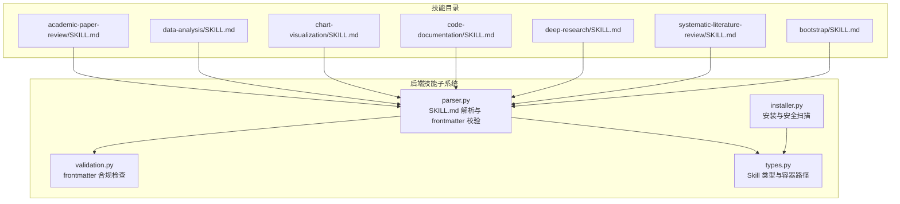
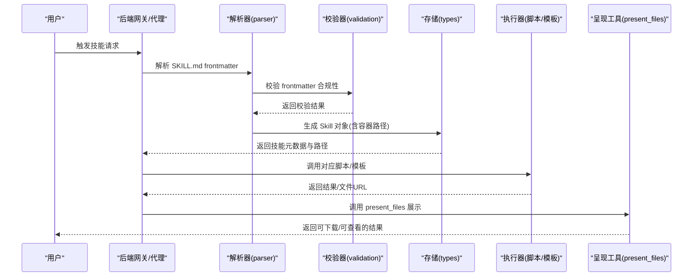
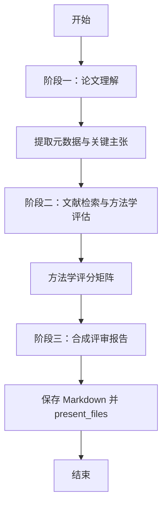
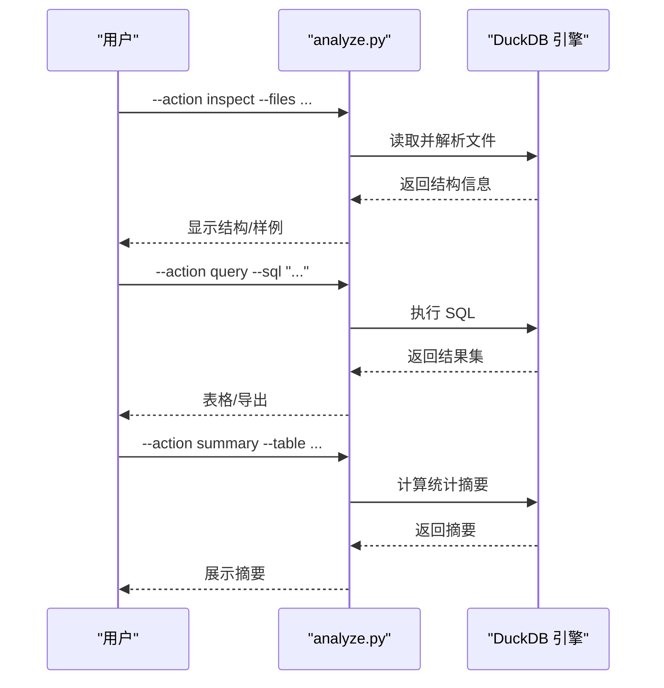
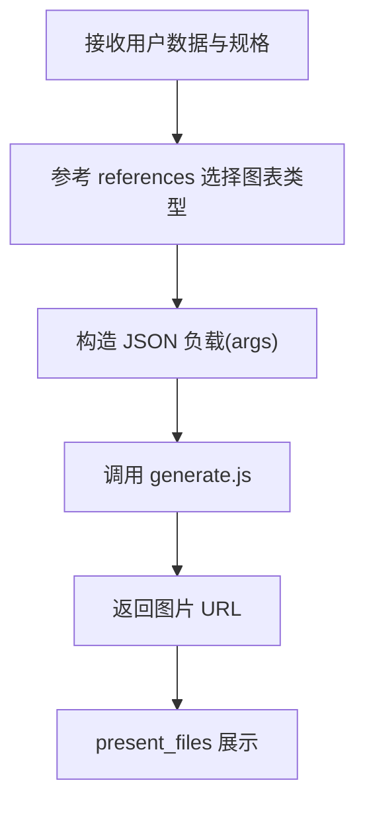
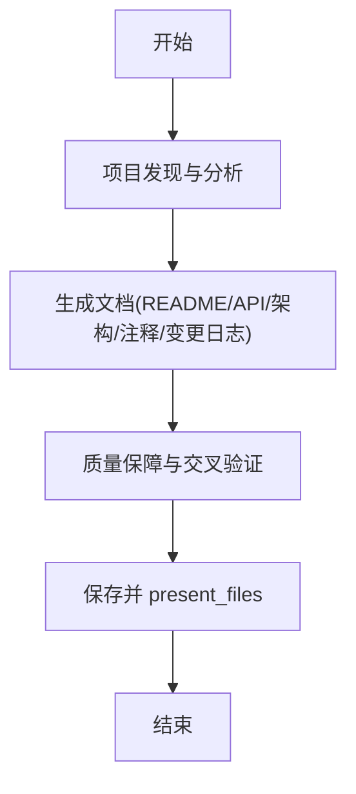
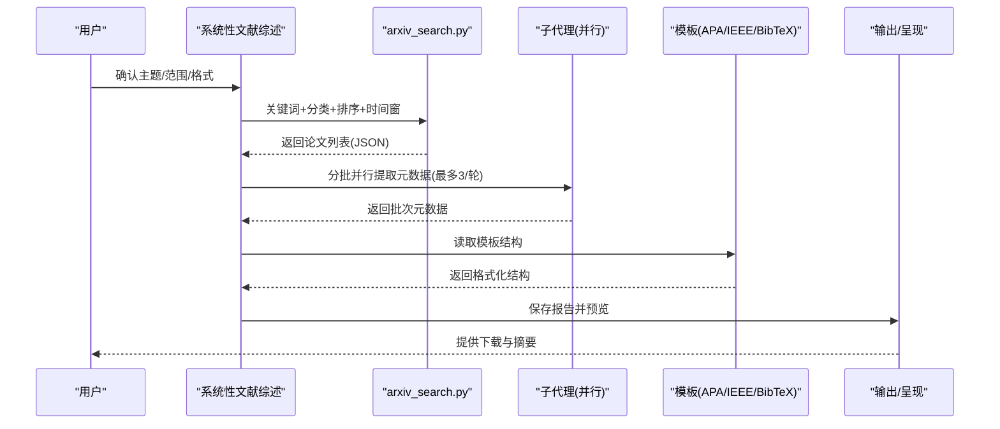
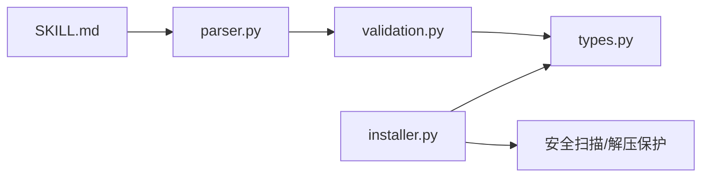

# 内置技能库

<cite>
**本文引用的文件**   
- [academic-paper-review/SKILL.md](file://skills/public/academic-paper-review/SKILL.md)
- [data-analysis/SKILL.md](file://skills/public/data-analysis/SKILL.md)
- [chart-visualization/SKILL.md](file://skills/public/chart-visualization/SKILL.md)
- [code-documentation/SKILL.md](file://skills/public/code-documentation/SKILL.md)
- [deep-research/SKILL.md](file://skills/public/deep-research/SKILL.md)
- [systematic-literature-review/SKILL.md](file://skills/public/systematic-literature-review/SKILL.md)
- [bootstrap/SKILL.md](file://skills/public/bootstrap/SKILL.md)
- [skills/types.py](file://backend/packages/harness/deerflow/skills/types.py)
- [skills/parser.py](file://backend/packages/harness/deerflow/skills/parser.py)
- [skills/validation.py](file://backend/packages/harness/deerflow/skills/validation.py)
- [skills/installer.py](file://backend/packages/harness/deerflow/skills/installer.py)
- [chart-visualization/scripts/generate.js](file://skills/public/chart-visualization/scripts/generate.js)
- [data-analysis/scripts/analyze.py](file://skills/public/data-analysis/scripts/analyze.py)
- [systematic-literature-review/scripts/arxiv_search.py](file://skills/public/systematic-literature-review/scripts/arxiv_search.py)
</cite>

## 目录
1. [简介](#简介)
2. [项目结构](#项目结构)
3. [核心组件](#核心组件)
4. [架构总览](#架构总览)
5. [详细组件分析](#详细组件分析)
6. [依赖关系分析](#依赖关系分析)
7. [性能考量](#性能考量)
8. [故障排查指南](#故障排查指南)
9. [结论](#结论)
10. [附录](#附录)

## 简介
本文件为 DeerFlow 内置技能库的权威技术文档，聚焦以下核心技能：学术论文评审、数据分析、图表可视化、代码文档生成、系统性文献综述与深度研究、以及引导式“Bootstrap”个性化设置。文档从系统架构、组件关系、数据流与处理逻辑、集成点与安全策略、性能特征与优化建议、到使用示例与最佳实践进行全栈解析，并提供技能选择指南、性能对比分析与自定义扩展方法。

## 项目结构
内置技能以“公共技能（public）”形式组织在 skills/public 下，每个技能由一个 SKILL.md 描述其元数据、能力边界、工作流与使用方式；同时配套脚本或模板目录用于执行具体任务。后端通过 harness 的技能子系统负责技能解析、校验、安装与权限控制，确保安全与一致性。

**图示来源**
- [skills/types.py:19-69](file://backend/packages/harness/deerflow/skills/types.py#L19-L69)
- [skills/parser.py:35-111](file://backend/packages/harness/deerflow/skills/parser.py#L35-L111)
- [skills/validation.py:18-94](file://backend/packages/harness/deerflow/skills/validation.py#L18-L94)
- [skills/installer.py:1-207](file://backend/packages/harness/deerflow/skills/installer.py#L1-L207)

**章节来源**
- [skills/types.py:1-69](file://backend/packages/harness/deerflow/skills/types.py#L1-L69)
- [skills/parser.py:1-111](file://backend/packages/harness/deerflow/skills/parser.py#L1-L111)
- [skills/validation.py:1-94](file://backend/packages/harness/deerflow/skills/validation.py#L1-L94)
- [skills/installer.py:1-207](file://backend/packages/harness/deerflow/skills/installer.py#L1-L207)

## 核心组件
- 技能类型与容器路径：Skill 类承载技能元数据与容器内路径映射，支持 PUBLIC/CUSTOM 分类与工具白名单字段。
- SKILL.md 解析器：从 SKILL.md 提取 YAML frontmatter，标准化名称与描述，解析可选 allowed-tools 列表。
- 前言校验器：限定允许的 frontmatter 字段，强制命名规范与长度限制，禁止危险字符，校验 allowed-tools 结构。
- 安装器：安全解压技能归档，检测绝对路径、目录穿越与符号链接，限制总大小，扫描文本与脚本内容，确保仅允许可读资源进入沙箱。

**章节来源**
- [skills/types.py:19-69](file://backend/packages/harness/deerflow/skills/types.py#L19-L69)
- [skills/parser.py:35-111](file://backend/packages/harness/deerflow/skills/parser.py#L35-L111)
- [skills/validation.py:18-94](file://backend/packages/harness/deerflow/skills/validation.py#L18-L94)
- [skills/installer.py:33-195](file://backend/packages/harness/deerflow/skills/installer.py#L33-L195)

## 架构总览
下图展示技能生命周期：用户触发 → 后端解析与校验 → 容器内路径定位 → 调用对应脚本/模板 → 输出结果与呈现工具。

**图示来源**
- [skills/parser.py:35-111](file://backend/packages/harness/deerflow/skills/parser.py#L35-L111)
- [skills/validation.py:18-94](file://backend/packages/harness/deerflow/skills/validation.py#L18-L94)
- [skills/types.py:34-65](file://backend/packages/harness/deerflow/skills/types.py#L34-L65)

## 详细组件分析

### 学术论文评审（academic-paper-review）
- 功能特性
  - 支持从 PDF/URL 获取论文，按会议/期刊/预印本标准流程进行结构化评审。
  - 框架覆盖摘要、优势、劣势、方法学评估、贡献度评价、文献定位、建设性建议。
  - 提供评审原则、伦理标准、常见陷阱与质量清单，保证客观与可操作性。
- 使用场景
  - 会议审稿前准备、期刊投稿准备、研究方向判断、跨领域文献对比。
- 工作流
  - 阶段一：元数据提取与深度阅读（摘要/引言/相关工作/方法/实验/讨论/结论）。
  - 阶段二：文献检索与上下文定位，方法学评分矩阵（正确性、新颖性、可复现性、实验设计、统计严谨性、可扩展性）。
  - 阶段三：合成评审报告（执行摘要、贡献总结、优势/劣势、方法学评估、问题清单、小问题、文献定位、推荐意见与总体评估等级）。
- 输出与集成
  - 输出 Markdown 文件至沙箱 outputs 目录并通过 present_files 提交。
- 最佳实践
  - 多轮检索与交叉验证，避免仅依赖摘要；区分重大缺陷与可修复问题；对未发表工作保密。

**图示来源**
- [academic-paper-review/SKILL.md:36-290](file://skills/public/academic-paper-review/SKILL.md#L36-L290)

**章节来源**
- [academic-paper-review/SKILL.md:1-290](file://skills/public/academic-paper-review/SKILL.md#L1-L290)

### 数据分析（data-analysis）
- 功能特性
  - 基于 DuckDB 的 SQL 化数据分析，支持 Excel/CSV 多表、统计摘要、SQL 查询、结果导出（CSV/JSON/Markdown）。
  - 自动缓存已加载数据，提升多查询场景效率。
- 使用场景
  - 销售/财务/运营数据探索、跨文件关联分析、趋势与聚合洞察。
- 工作流
  - 步骤一：理解需求（文件位置、目标、输出格式）。
  - 步骤二：inspect 获取结构（列名、类型、非空计数、行数、样例）。
  - 步骤三：query 执行 SQL，summary 生成统计摘要，可导出结果。
- 参数与命名规则
  - 参数：--files（必填）、--action（inspect/query/summary）、--sql/--table/--output-file。
  - 表命名：Excel 按 sheet 名，CSV 以文件名为表名；特殊字符自动清理，必要时使用双引号。
- 示例流程
  - 上传多表 Excel，先 inspect，再按需执行 top 产品收入查询、月度趋势汇总与统计摘要，最后导出 CSV。

**图示来源**
- [data-analysis/SKILL.md:21-249](file://skills/public/data-analysis/SKILL.md#L21-L249)
- [data-analysis/scripts/analyze.py](file://skills/public/data-analysis/scripts/analyze.py)

**章节来源**
- [data-analysis/SKILL.md:1-249](file://skills/public/data-analysis/SKILL.md#L1-L249)

### 图表可视化（chart-visualization）
- 功能特性
  - 基于 26 种图表类型的智能选择，参数抽取与图像生成。
  - Node.js 运行时要求（>=18），通过 generate.js 接收 JSON 负载并返回图片 URL。
- 使用场景
  - 时间序列趋势、对比分析、部分-整体、关系与流向、地图、层级树、雷达/漏斗/水形/词云/箱线图/网络图等。
- 工作流
  - 1）根据数据特征选择图表类型；2）从 references 读取参数规范；3）调用 scripts/generate.js；4）返回图片 URL 与 args 规范。
- 输出与集成
  - 通过 present_files 提供可访问的图片链接。

**图示来源**
- [chart-visualization/SKILL.md:1-73](file://skills/public/chart-visualization/SKILL.md#L1-L73)
- [chart-visualization/scripts/generate.js](file://skills/public/chart-visualization/scripts/generate.js)

**章节来源**
- [chart-visualization/SKILL.md:1-73](file://skills/public/chart-visualization/SKILL.md#L1-L73)

### 代码文档（code-documentation）
- 功能特性
  - 自动生成 README/API 参考/架构文档/开发者指南/变更日志/内联注释，适配多语言风格（JSDoc/docstring/GoDoc 等）。
  - 依据项目规模与复杂度，匹配输出范围与结构。
- 使用场景
  - 新仓库初始化、API 文档生成、架构说明、贡献指南、迁移与变更记录。
- 工作流
  - 阶段一：项目发现与结构分析（语言/框架/构建系统/包管理/入口/现有文档）。
  - 阶段二：生成文档（README/API/架构/内联注释/变更日志）。
  - 阶段三：质量保障（完整性/准确性/一致性/新鲜度/交叉引用）。
- 输出与集成
  - 保存至 outputs 目录并通过 present_files 提交。

**图示来源**
- [code-documentation/SKILL.md:36-416](file://skills/public/code-documentation/SKILL.md#L36-L416)

**章节来源**
- [code-documentation/SKILL.md:1-416](file://skills/public/code-documentation/SKILL.md#L1-L416)

### 深度研究（deep-research）
- 功能特性
  - 系统化网络研究方法，避免单次搜索的浅层性，强调多角度、多来源、多形态信息收集与验证。
- 使用场景
  - 任何需要真实世界信息、案例、专家观点与趋势预测的内容生成前置研究。
- 方法论
  - 阶段一：广度探索（初始调查、识别维度、地图化视角）。
  - 阶段二：深潜（精确关键词、多变体搜索、全文抓取与引用追踪）。
  - 阶段三：多样性与验证（事实/案例/专家/趋势/比较/挑战/批评）。
  - 阶段四：合成检查（是否达到充分研究标准）。
- 输出
  - 全面理解、具体事实、真实案例、权威观点、当前趋势与背景。

**章节来源**
- [deep-research/SKILL.md:1-199](file://skills/public/deep-research/SKILL.md#L1-L199)

### 系统性文献综述（systematic-literature-review）
- 功能特性
  - 面向主题的系统性文献综述，批量从 arXiv 检索、并行提取元数据、主题归纳与引用格式化（APA/IEEE/BibTeX）。
- 使用场景
  - 多篇论文的横向比较、研究趋势分析、注释型综述、时间窗口内的主题演化。
- 工作流
  - 阶段一：计划（主题、范围、时间窗、引用格式、输出位置）。
  - 阶段二：arXiv 搜索（关键词、分类、排序策略、时间约束）。
  - 阶段三：并行元数据提取（最多 3 个子代理/轮，每批约 5 篇）。
  - 阶段四：合成与格式化（主题、趋同/分歧/缺口、引用格式）。
  - 阶段五：保存与预览（短摘要/主题列表/文件指针）。
- 注意事项
  - 仅 arXiv；上限 50 篇；需要启用子代理；严格遵循模板结构。

**图示来源**
- [systematic-literature-review/SKILL.md:30-236](file://skills/public/systematic-literature-review/SKILL.md#L30-L236)
- [systematic-literature-review/scripts/arxiv_search.py](file://skills/public/systematic-literature-review/scripts/arxiv_search.py)

**章节来源**
- [systematic-literature-review/SKILL.md:1-236](file://skills/public/systematic-literature-review/SKILL.md#L1-L236)

### 引导式个性化（bootstrap）
- 功能特性
  - 通过 5–8 轮对话，提取用户身份、需求与期望，生成个性化 SOUL.md，并调用 setup_agent 完成代理初始化。
- 使用场景
  - 首次使用、身份设定、个性定制、关系框架建立。
- 工作流
  - 阶段一：语言与第一印象；阶段二：你是谁、痛点、关系框架、AI 名称；阶段三：个性与沟通风格、自主度、诚实度偏好；阶段四：愿景、失败哲学、边界。
  - 生成后调用 setup_agent，确认成功。

**章节来源**
- [bootstrap/SKILL.md:1-95](file://skills/public/bootstrap/SKILL.md#L1-L95)

## 依赖关系分析
- 技能元数据与容器路径
  - Skill 类提供相对路径与容器路径映射，便于在沙箱中定位 SKILL.md 与脚本资源。
- 解析与校验
  - parser 负责 frontmatter 解析与 allowed-tools 校验；validation 限定字段与命名规范；二者共同保证技能描述的合法性与一致性。
- 安装与安全
  - installer 在安装阶段执行 zip 成员安全检查、symlink 跳过、目录穿越防护、总大小限制与内容扫描，确保仅允许受控资源进入沙箱。

**图示来源**
- [skills/parser.py:35-111](file://backend/packages/harness/deerflow/skills/parser.py#L35-L111)
- [skills/validation.py:18-94](file://backend/packages/harness/deerflow/skills/validation.py#L18-L94)
- [skills/types.py:19-69](file://backend/packages/harness/deerflow/skills/types.py#L19-L69)
- [skills/installer.py:81-195](file://backend/packages/harness/deerflow/skills/installer.py#L81-L195)

**章节来源**
- [skills/types.py:1-69](file://backend/packages/harness/deerflow/skills/types.py#L1-L69)
- [skills/parser.py:1-111](file://backend/packages/harness/deerflow/skills/parser.py#L1-L111)
- [skills/validation.py:1-94](file://backend/packages/harness/deerflow/skills/validation.py#L1-L94)
- [skills/installer.py:1-207](file://backend/packages/harness/deerflow/skills/installer.py#L1-L207)

## 性能考量
- 数据分析（DuckDB）
  - 缓存机制显著降低重复查询成本；大文件处理无需全部内存加载；建议在多步查询场景中优先 inspect → query → summary 的顺序，减少 IO 与解析开销。
- 图表可视化（Node.js）
  - 选择合适的图表类型可减少渲染复杂度；参数最小化与模板复用有助于缩短生成时间。
- 系统性文献综述（arXiv + 子代理）
  - 并行度限制（每轮最多 3 个子代理）与批次大小（约 5 篇/批）平衡吞吐与令牌消耗；合理设置最大数量（≤50）避免合成质量下降。
- 安全扫描与安装
  - 安装器对 zip 总大小进行上限控制，防止压缩炸弹；扫描仅针对允许的文本与脚本文件，降低误报与漏检风险。

[本节为通用性能指导，不直接分析具体文件，故无“章节来源”]

## 故障排查指南
- frontmatter 不合规
  - 现象：校验失败，提示缺少必需字段、命名不合法、描述过长或包含非法字符。
  - 处理：对照 allowed-frontmatter-keys 与命名规范修正；确保 name/description 非空且符合 hyphen-case。
- allowed-tools 格式错误
  - 现象：值必须为字符串列表，不可为空项或非字符串。
  - 处理：统一为纯字符串列表，去除空白与空项。
- 安装失败（zip 安全/大小）
  - 现象：路径包含绝对路径/目录穿越/符号链接；或总大小超限。
  - 处理：修正归档结构，移除危险成员；压缩归档体积。
- 安装被安全扫描阻断
  - 现象：扫描器决策为 block/warn 或可执行文件未获允许。
  - 处理：检查内容合法性与用途；仅保留受控脚本与模板。

**章节来源**
- [skills/validation.py:18-94](file://backend/packages/harness/deerflow/skills/validation.py#L18-L94)
- [skills/installer.py:33-195](file://backend/packages/harness/deerflow/skills/installer.py#L33-L195)

## 结论
DeerFlow 内置技能库以“结构化工作流 + 可靠解析与安全安装”为核心，覆盖学术评审、数据分析、可视化、代码文档、系统性综述与个性化引导等关键场景。通过明确的输入输出约定、严格的合规校验与安全扫描、以及可扩展的脚本与模板机制，既能满足高价值任务的自动化，也为二次开发与自定义提供了清晰边界与最佳实践。

[本节为总结性内容，不直接分析具体文件，故无“章节来源”]

## 附录

### 技能选择指南
- 单篇论文评审：使用 academic-paper-review。
- 多篇论文综述/比较：使用 systematic-literature-review。
- 需要全面背景信息：先用 deep-research，再进行内容生成。
- 数据驱动洞察：使用 data-analysis。
- 将数据转为图表：使用 chart-visualization。
- 生成/完善代码文档：使用 code-documentation。
- 初始化个性化 AI：使用 bootstrap。

[本节为概念性指导，不直接分析具体文件，故无“章节来源”]

### 性能对比分析（概览）
- 数据分析：适合大规模结构化数据，缓存与 SQL 并行查询显著降低延迟。
- 图表可视化：Node.js 轻量运行，图表类型选择影响生成时延与渲染复杂度。
- 系统性文献综述：受限于 arXiv 速率与子代理并发度，建议分主题拆分与合理上限控制。
- 深度研究：搜索与抓取成本较高，建议在内容生成前先行完成。

[本节为通用对比分析，不直接分析具体文件，故无“章节来源”]

### 自定义扩展方法
- 新增技能
  - 创建 skills/public/<skill-name>/SKILL.md，遵循 frontmatter 字段与命名规范；如需脚本/模板，置于 scripts/ 或 references/ 等受控目录。
  - 使用 skills/installer.py 的安装流程，确保 zip 安全与内容扫描通过。
- 修改既有技能
  - 保持 SKILL.md frontmatter 合规；调整脚本时注意权限与沙箱可见性；更新模板/参数规范并在 references 中同步。
- 最佳实践
  - 以“最小可用”为起点，逐步迭代；在 present_files 前提供简明预览；对大输出采用导出与链接方式。

**章节来源**
- [skills/installer.py:81-195](file://backend/packages/harness/deerflow/skills/installer.py#L81-L195)
- [skills/validation.py:14-16](file://backend/packages/harness/deerflow/skills/validation.py#L14-L16)