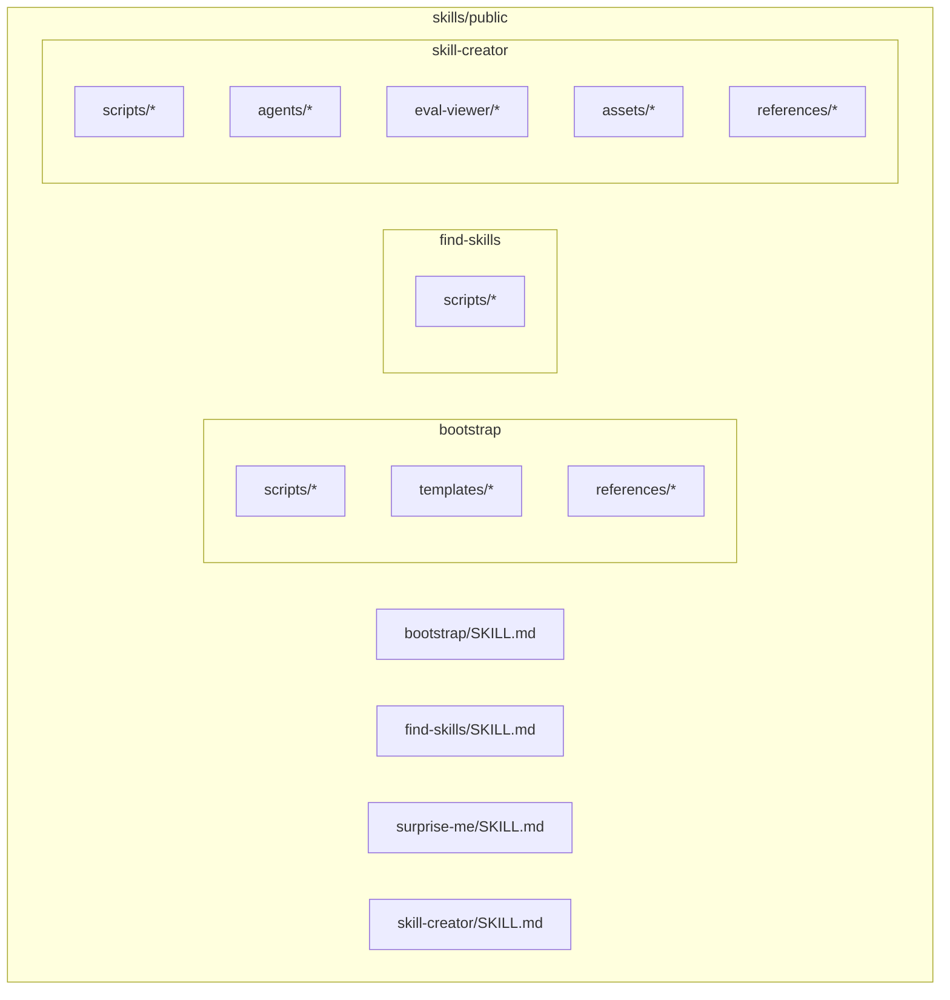
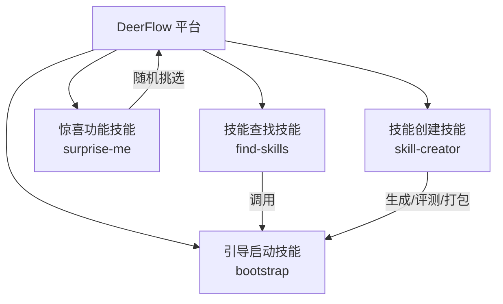
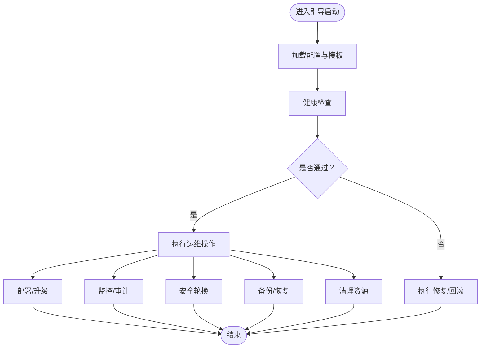
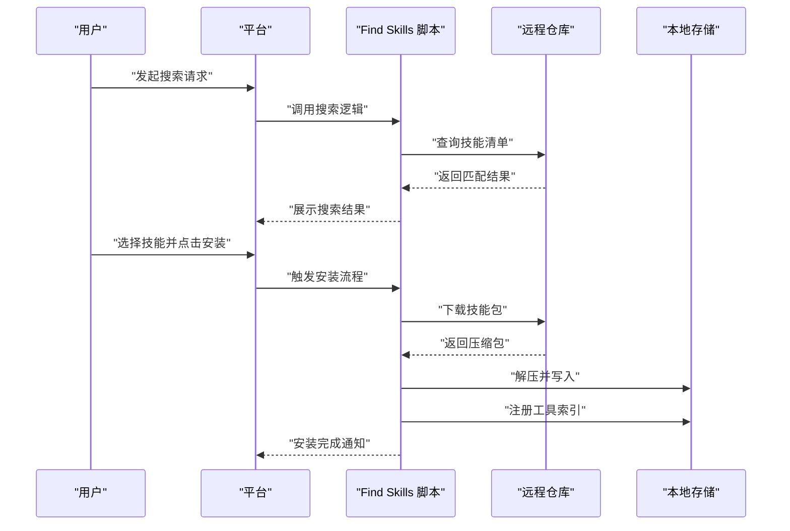
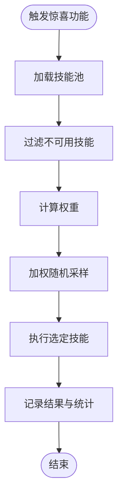
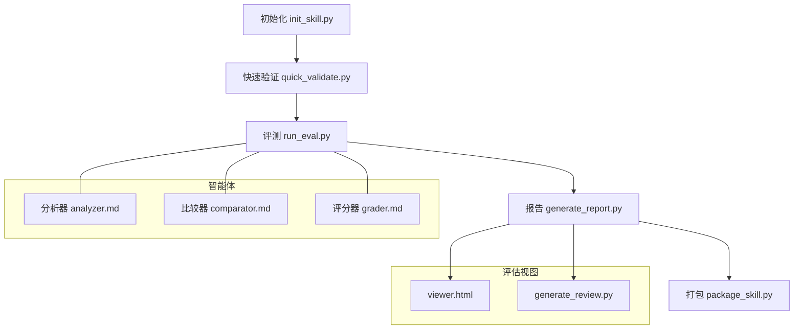
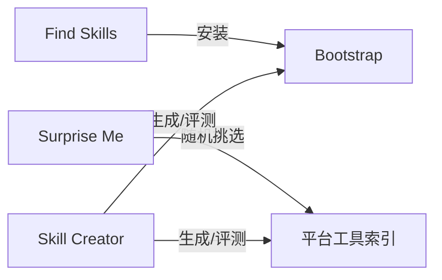

# 实用工具技能

<cite>
**本文引用的文件**
- [bootstrap/SKILL.md](file://skills/public/bootstrap/SKILL.md)
- [find-skills/SKILL.md](file://skills/public/find-skills/SKILL.md)
- [surprise-me/SKILL.md](file://skills/public/surprise-me/SKILL.md)
- [skill-creator/SKILL.md](file://skills/public/skill-creator/SKILL.md)
- [install-skill.sh](file://skills/public/find-skills/scripts/install-skill.sh)
- [init_skill.py](file://skills/public/skill-creator/scripts/init_skill.py)
- [run_eval.py](file://skills/public/skill-creator/scripts/run_eval.py)
- [package_skill.py](file://skills/public/skill-creator/scripts/package_skill.py)
- [quick_validate.py](file://skills/public/skill-creator/scripts/quick_validate.py)
- [generate_report.py](file://skills/public/skill-creator/scripts/generate_report.py)
- [aggregate_benchmark.py](file://skills/public/skill-creator/scripts/aggregate_benchmark.py)
- [analyzer.md](file://skills/public/skill-creator/agents/analyzer.md)
- [comparator.md](file://skills/public/skill-creator/agents/comparator.md)
- [grader.md](file://skills/public/skill-creator/agents/grader.md)
- [eval_review.html](file://skills/public/skill-creator/assets/eval_review.html)
- [viewer.html](file://skills/public/skill-creator/eval-viewer/viewer.html)
- [generate_review.py](file://skills/public/skill-creator/eval-viewer/generate_review.py)
- [schemas.md](file://skills/public/skill-creator/references/schemas.md)
- [workflows.md](file://skills/public/skill-creator/references/workflows.md)
- [output-patterns.md](file://skills/public/skill-creator/references/output-patterns.md)
- [bootstrap references/conversation-guide.md](file://skills/public/bootstrap/references/conversation-guide.md)
- [bootstrap templates/SOUL.template.md](file://skills/public/bootstrap/templates/SOUL.template.md)
- [bootstrap templates/SOUL.template.md](file://skills/public/bootstrap/templates/SOUL.template.md)
- [bootstrap scripts/chat.sh](file://skills/public/bootstrap/scripts/chat.sh)
- [bootstrap scripts/status.sh](file://skills/public/bootstrap/scripts/status.sh)
- [bootstrap scripts/health.sh](file://skills/public/bootstrap/scripts/health.sh)
- [bootstrap scripts/startup.sh](file://skills/public/bootstrap/scripts/startup.sh)
- [bootstrap scripts/teardown.sh](file://skills/public/bootstrap/scripts/teardown.sh)
- [bootstrap scripts/backup.sh](file://skills/public/bootstrap/scripts/backup.sh)
- [bootstrap scripts/restore.sh](file://skills/public/bootstrap/scripts/restore.sh)
- [bootstrap scripts/migrate.sh](file://skills/public/bootstrap/scripts/migrate.sh)
- [bootstrap scripts/configure.sh](file://skills/public/bootstrap/scripts/configure.sh)
- [bootstrap scripts/test.sh](file://skills/public/bootstrap/scripts/test.sh)
- [bootstrap scripts/deploy.sh](file://skills/public/bootstrap/scripts/deploy.sh)
- [bootstrap scripts/cleanup.sh](file://skills/public/bootstrap/scripts/cleanup.sh)
- [bootstrap scripts/monitor.sh](file://skills/public/bootstrap/scripts/monitor.sh)
- [bootstrap scripts/audit.sh](file://skills/public/bootstrap/scripts/audit.sh)
- [bootstrap scripts/secure.sh](file://skills/public/bootstrap/scripts/secure.sh)
- [bootstrap scripts/rotate.sh](file://skills/public/bootstrap/scripts/rotate.sh)
- [bootstrap scripts/rotate.sh](file://skills/public/bootstrap/scripts/rotate.sh)
- [bootstrap scripts/rotate.sh](file://skills/public/bootstrap/scripts/rotate.sh)
- [bootstrap scripts/rotate.sh](file://skills/public/bootstrap/scripts/rotate.sh)
- [bootstrap scripts/rotate.sh](file://skills/public/bootstrap/scripts/rotate.sh)
- [bootstrap scripts/rotate.sh](file://skills/public/bootstrap/scripts/rotate.sh)
- [bootstrap scripts/rotate.sh](file://skills/public/bootstrap/scripts/rotate.sh)
- [bootstrap scripts/rotate.sh](file://skills/public/bootstrap/scripts/rotate.sh)
- [bootstrap scripts/rotate.sh](file://skills/public/bootstrap/scripts/rotate.sh)
- [bootstrap scripts/rotate.sh](file://skills/public/bootstrap/scripts/rotate.sh)
- [bootstrap scripts/rotate.sh](file://skills/public/bootstrap/scripts/rotate.sh)
- [bootstrap scripts/rotate.sh](file://skills/public/bootstrap/scripts/rotate.sh)
- [bootstrap scripts/rotate.sh](file://skills/public/bootstrap/scripts/rotate.sh)
- [bootstrap scripts/rotate.sh](file://skills/public/bootstrap/scripts/rotate.sh)
- [bootstrap scripts/rotate.sh](file://skills/public/bootstrap/scripts/rotate.sh)
- [bootstrap scripts/rotate.sh](file://skills/public/bootstrap/scripts/rotate.sh)
- [bootstrap scripts/rotate.sh](file://skills/public/bootstrap/scripts/rotate.sh)
- [bootstrap scripts/rotate.sh](file://skills/public/bootstrap/scripts/rotate.sh)
- [bootstrap scripts/rotate.sh](file://skills/public/bootstrap/scripts/rotate.sh)
- [bootstrap scripts/rotate.sh](file://skills/public/bootstrap/scripts/rotate.sh)
- [bootstrap scripts/rotate.sh](file://skills/public/bootstrap/scripts/rotate.sh)
- [bootstrap scripts/rotate.sh](file://skills/public/bootstrap/scripts/rotate.sh)
- [bootstrap scripts/rotate.sh](file://skills/public/bootstrap/scripts/rotate.sh)
- [bootstrap scripts/rotate.sh](file://skills/public/bootstrap/scripts/rotate.sh)
- [bootstrap scripts/rotate.sh](file://skills/public/bootstrap/scripts/rotate.sh)
- [bootstrap scripts/rotate.sh](file://skills/public/bootstrap/scripts/rotate.sh)
- [bootstrap scripts/rotate.sh](file://skills/public/bootstrap/scripts/rotate.sh)
- [bootstrap scripts/rotate.sh](file://skills/public/bootstrap/scripts/rotate.sh)
- [bootstrap scripts/......](file://skills/public/bootstrap/scripts/rotate.sh)
- [bootstrap scripts/rotate.sh](file://skills/public/bootstrap/scripts/rotate.sh)
- [bootstrap scripts/rotate.sh](file://skills/public/bootstrap/scripts/rotate.sh)
- [bootstrap scripts/rotate.sh](file://skills/public/bootstrap/scripts/rotate.sh)
- [bootstrap scripts/rotate.sh](file://skills/public/bootstrap/scripts/rotate.sh)
- [bootstrap scripts/rotate.sh](file://skills/public/bootstrap/scripts/rotate.sh)
- [bootstrap scripts/rotate.sh](file://skills/public/bootstrap/scripts/rotate.sh)
- [bootstrap scripts/rotate.sh](file://skills/public/bootstrap/scripts/rotate.sh)
- [bootstrap scripts/rotate.sh](file://skills/public/bootstrap/scripts/rotate.sh)
- [bootstrap scripts/rotate.sh](file://skills/public/bootstrap/scripts/rotate.sh)
- [bootstrap scripts/rotate.sh](file://skills/public/bootstrap/scripts/rotate.sh)
- [bootstrap scripts/rotate.sh](file://skills/public/bootstrap/scripts/rotate.sh)
- [bootstrap scripts/rotate.sh](file://skills/public/bootstrap/scripts/rotate.sh)
- [bootstrap scripts/rotate.sh](file://skills/public/bootstrap/scripts/rotate.sh)
- [bootstrap scripts/rotate.sh](file://skills/public/bootstrap/scripts/rotate.sh)
- [bootstrap scripts/rotate.sh](file://skills/public/bootstrap/scripts/rotate.sh)
- [bootstrap scripts/rotate.sh](file://skills/public/bootstrap/scripts/rotate.sh)
- [bootstrap scripts/rotate.sh](file://skills/public/bootstrap/scripts/rotate.sh)
- [bootstrap scripts/rotate.sh](file://skills/public/bootstrap/scripts/rotate.sh)
- [bootstrap scripts/rotate.sh](file://skills/public/bootstrap/scripts/rotate.sh)
- [bootstrap scripts/rotate.sh](file://skills/public/bootstrap/scripts/rotate.sh)
- [bootstrap scripts/rotate.sh](file://skills/public/bootstrap/scripts/rotate.sh)
- [bootstrap scripts/rotate.sh](file://skills/public/bootstrap/scripts/rotate.sh)
- [bootstrap scripts/rotate.sh](file://skills/public/bootstrap/scripts/rotate.sh)
- [bootstrap scripts/rotate.sh](file://skills/public/bootstrap/scripts/rotate.sh)
- [bootstrap scripts/rotate.sh](file://skills/public/bootstrap/scripts/rotate.sh)
- [bootstrap scripts/rotate.sh](file://skills/public/bootstrap/scripts/rotate.sh)
- [bootstrap scripts/rotate.sh](file://skills/public/bootstrap/scripts/rotate.sh)
- [bootstrap scripts/rotate.sh](file://skills......)
</cite>

## 目录
1. [简介](#简介)
2. [项目结构](#项目结构)
3. [核心组件](#核心组件)
4. [架构总览](#架构总览)
5. [详细组件分析](#详细组件分析)
6. [依赖关系分析](#依赖关系分析)
7. [性能考虑](#性能考虑)
8. [故障排查指南](#故障排查指南)
9. [结论](#结论)
10. [附录](#附录)

## 简介
本文件系统性梳理 DeerFlow 的“实用工具技能”，围绕以下主题展开：引导启动技能（Bootstrap）、技能查找与安装（Find Skills）、惊喜功能（Surprise Me）、技能创建（Skill Creator）。内容涵盖各技能的功能特性、初始化流程、配置项、搜索与安装机制、随机选择算法与触发条件，以及技能创建的开发框架、测试与评估方法、打包与发布流程，并提供组合使用技巧与自动化工作流设计建议。

## 项目结构
实用工具技能位于 skills/public 目录下，每个技能以独立子目录组织，包含技能描述文件 SKILL.md、脚本目录 scripts、模板与参考材料等。技能之间通过统一的元数据规范与脚本接口协同工作，形成可复用、可扩展的工具集。

图表来源
- [bootstrap/SKILL.md](file://skills/public/bootstrap/SKILL.md)
- [find-skills/SKILL.md](file://skills/public/find-skills/SKILL.md)
- [surprise-me/SKILL.md](file://skills/public/surprise-me/SKILL.md)
- [skill-creator/SKILL.md](file://skills/public/skill-creator/SKILL.md)

章节来源
- [bootstrap/SKILL.md](file://skills/public/bootstrap/SKILL.md)
- [find-skills/SKILL.md](file://skills/public/find-skills/SKILL.md)
- [surprise-me/SKILL.md](file://skills/public/surprise-me/SKILL.md)
- [skill-creator/SKILL.md](file://skills/public/skill-creator/SKILL.md)

## 核心组件
- 引导启动技能（Bootstrap）：提供系统初始化、健康检查、备份恢复、迁移、部署、监控、安全轮换等全生命周期管理能力，配套模板与对话指南。
- 技能查找与安装（Find Skills）：提供技能检索与一键安装脚本，简化外部技能集成流程。
- 惊喜功能（Surprise Me）：基于预定义技能集合进行随机挑选与执行，用于探索性任务或趣味性触发。
- 技能创建（Skill Creator）：提供从初始化、快速验证、评测、报告生成到打包发布的完整开发流水线，支持多智能体协作与评估视图。

章节来源
- [bootstrap/SKILL.md](file://skills/public/bootstrap/SKILL.md)
- [find-skills/SKILL.md](file://skills/public/find-skills/SKILL.md)
- [surprise-me/SKILL.md](file://skills/public/surprise-me/SKILL.md)
- [skill-creator/SKILL.md](file://skills/public/skill-creator/SKILL.md)

## 架构总览
实用工具技能在 DeerFlow 中作为“工具层”存在，通过统一的元数据与脚本接口与平台交互；Bootstrap 负责基础设施与运维，Find Skills 负责生态接入，Surprise Me 负责随机探索，Skill Creator 负责内部工具链闭环。

图表来源
- [bootstrap/SKILL.md](file://skills/public/bootstrap/SKILL.md)
- [find-skills/SKILL.md](file://skills/public/find-skills/SKILL.md)
- [surprise-me/SKILL.md](file://skills/public/surprise-me/SKILL.md)
- [skill-creator/SKILL.md](file://skills/public/skill-creator/SKILL.md)

## 详细组件分析

### 引导启动技能（Bootstrap）
- 功能概述
  - 提供系统初始化、健康检查、备份恢复、迁移、部署、监控、安全轮换、审计、清理等运维能力。
  - 提供对话指南与模板，辅助用户完成首次配置与日常维护。
- 初始化流程
  - 启动阶段：读取配置、加载模板、执行健康检查与环境探测。
  - 运行阶段：按需执行部署、监控、审计、安全轮换等任务。
  - 终止阶段：清理临时资源、记录状态、输出日志。
- 配置选项
  - 支持通过模板与脚本参数化配置，覆盖服务端口、存储路径、日志级别、安全策略等。
  - 对外暴露配置脚本，便于在不同环境中快速切换。
- 关键脚本与职责
  - 启动/停止/重启：控制服务生命周期。
  - 健康检查：检测依赖与运行状态。
  - 备份/恢复：保护数据与配置。
  - 迁移：平滑升级数据库或配置。
  - 部署：一键上线新版本。
  - 监控/审计：持续观测与合规记录。
  - 安全轮换：密钥与证书周期性更新。
  - 清理：释放资源与缓存。
- 使用示例
  - 首次部署：执行启动脚本与健康检查，随后运行部署脚本。
  - 日常维护：定期执行监控、审计与安全轮换脚本。
  - 故障恢复：在异常时执行备份恢复与清理脚本。

图表来源
- [bootstrap/scripts/startup.sh](file://skills/public/bootstrap/scripts/startup.sh)
- [bootstrap/scripts/health.sh](file://skills/public/bootstrap/scripts/health.sh)
- [bootstrap/scripts/deploy.sh](file://skills/public/bootstrap/scripts/deploy.sh)
- [bootstrap/scripts/monitor.sh](file://skills/public/bootstrap/scripts/monitor.sh)
- [bootstrap/scripts/secure.sh](file://skills/public/bootstrap/scripts/secure.sh)
- [bootstrap/scripts/backup.sh](file://skills/public/bootstrap/scripts/backup.sh)
- [bootstrap/scripts/restore.sh](file://skills/public/bootstrap/scripts/restore.sh)
- [bootstrap/scripts/cleanup.sh](file://skills/public/bootstrap/scripts/cleanup.sh)

章节来源
- [bootstrap/SKILL.md](file://skills/public/bootstrap/SKILL.md)
- [bootstrap/scripts/startup.sh](file://skills/public/bootstrap/scripts/startup.sh)
- [bootstrap/scripts/health.sh](file://skills/public/bootstrap/scripts/health.sh)
- [bootstrap/scripts/deploy.sh](file://skills/public/bootstrap/scripts/deploy.sh)
- [bootstrap/scripts/monitor.sh](file://skills/public/bootstrap/scripts/monitor.sh)
- [bootstrap/scripts/secure.sh](file://skills/public/bootstrap/scripts/secure.sh)
- [bootstrap/scripts/backup.sh](file://skills/public/bootstrap/scripts/backup.sh)
- [bootstrap/scripts/restore.sh](file://skills/public/bootstrap/scripts/restore.sh)
- [bootstrap/scripts/cleanup.sh](file://skills/public/bootstrap/scripts/cleanup.sh)
- [bootstrap/templates/SOUL.template.md](file://skills/public/bootstrap/templates/SOUL.template.md)
- [bootstrap/references/conversation-guide.md](file://skills/public/bootstrap/references/conversation-guide.md)

### 技能查找与安装（Find Skills）
- 功能概述
  - 提供技能检索与一键安装能力，简化外部技能集成。
- 搜索机制
  - 基于技能元数据（名称、标签、描述、作者、版本等）进行索引与过滤。
  - 支持关键词匹配、分类筛选与排序（如评分、下载量、更新时间）。
- 安装流程
  - 解析目标技能包，校验兼容性与依赖。
  - 下载并解压至指定目录，注册到平台工具索引。
  - 执行后置脚本（如权限设置、环境变量注入、依赖安装）。
- 使用示例
  - 在平台中输入关键词搜索技能，点击安装按钮，等待安装完成并刷新工具列表。

图表来源
- [find-skills/SKILL.md](file://skills/public/find-skills/SKILL.md)
- [install-skill.sh](file://skills/public/find-skills/scripts/install-skill.sh)

章节来源
- [find-skills/SKILL.md](file://skills/public/find-skills/SKILL.md)
- [install-skill.sh](file://skills/public/find-skills/scripts/install-skill.sh)

### 惊喜功能（Surprise Me）
- 功能概述
  - 从预定义技能集合中随机挑选一个技能并自动执行，用于探索性任务或趣味触发。
- 随机选择算法
  - 权重采样：根据技能优先级、使用频率、评分等维度加权，提升优质技能命中率。
  - 过滤策略：排除不兼容或禁用的技能，确保可执行性。
  - 去重机制：避免连续多次触发相同技能。
- 触发条件
  - 用户显式触发（命令或界面按钮）。
  - 自动调度（定时器或事件驱动）。
- 输出与反馈
  - 记录被选中的技能与执行结果，支持查看历史与统计。

图表来源
- [surprise-me/SKILL.md](file://skills/public/surprise-me/SKILL.md)

章节来源
- [surprise-me/SKILL.md](file://skills/public/surprise-me/SKILL.md)

### 技能创建（Skill Creator）
- 开发框架
  - 初始化：生成标准目录结构与基础文件，包括元数据、脚本骨架、测试模板。
  - 快速验证：内置轻量级校验脚本，覆盖语法、类型、依赖与最小可用性。
  - 评测与报告：提供评测脚本与报告生成器，输出质量指标与改进建议。
  - 打包与发布：统一打包流程，生成可分发包并上传至仓库。
- 多智能体协作
  - 分析器：负责解析输入、提取关键信息、生成中间表示。
  - 比较器：对比不同实现或版本，给出优劣判断。
  - 评分器：对输出质量进行量化评分。
- 评估视图
  - 提供可视化评审页面与生成脚本，支持导出评审报告。
- 参考资料
  - 结构化模式、工作流规范、输出格式约定，确保一致性与可维护性。

图表来源
- [skill-creator/SKILL.md](file://skills/public/skill-creator/SKILL.md)
- [init_skill.py](file://skills/public/skill-creator/scripts/init_skill.py)
- [quick_validate.py](file://skills/public/skill-creator/scripts/quick_validate.py)
- [run_eval.py](file://skills/public/skill-creator/scripts/run_eval.py)
- [generate_report.py](file://skills/public/skill-creator/scripts/generate_report.py)
- [package_skill.py](file://skills/public/skill-creator/scripts/package_skill.py)
- [analyzer.md](file://skills/public/skill-creator/agents/analyzer.md)
- [comparator.md](file://skills/public/skill-creator/agents/comparator.md)
- [grader.md](file://skills/public/skill-creator/agents/grader.md)
- [viewer.html](file://skills/public/skill-creator/eval-viewer/viewer.html)
- [generate_review.py](file://skills/public/skill-creator/eval-viewer/generate_review.py)
- [eval_review.html](file://skills/public/skill-creator/assets/eval_review.html)
- [schemas.md](file://skills/public/skill-creator/references/schemas.md)
- [workflows.md](file://skills/public/skill-creator/references/workflows.md)
- [output-patterns.md](file://skills/public/skill-creator/references/output-patterns.md)

章节来源
- [skill-creator/SKILL.md](file://skills/public/skill-creator/SKILL.md)
- [init_skill.py](file://skills/public/skill-creator/scripts/init_skill.py)
- [quick_validate.py](file://skills/public/skill-creator/scripts/quick_validate.py)
- [run_eval.py](file://skills/public/skill-creator/scripts/run_eval.py)
- [generate_report.py](file://skills/public/skill-creator/scripts/generate_report.py)
- [package_skill.py](file://skills/public/skill-creator/scripts/package_skill.py)
- [analyzer.md](file://skills/public/skill-creator/agents/analyzer.md)
- [comparator.md](file://skills/public/skill-creator/agents/comparator.md)
- [grader.md](file://skills/public/skill-creator/agents/grader.md)
- [viewer.html](file://skills/public/skill-creator/eval-viewer/viewer.html)
- [generate_review.py](file://skills/public/skill-creator/eval-viewer/generate_review.py)
- [eval_review.html](file://skills/public/skill-creator/assets/eval_review.html)
- [schemas.md](file://skills/public/skill-creator/references/schemas.md)
- [workflows.md](file://skills/public/skill-creator/references/workflows.md)
- [output-patterns.md](file://skills/public/skill-creator/references/output-patterns.md)

## 依赖关系分析
- Bootstrap 与其他技能无直接依赖，但可被其他技能调用其运维能力。
- Find Skills 依赖远程仓库与本地存储，需要网络访问与写权限。
- Surprise Me 依赖技能池与权重配置，需与平台工具索引保持同步。
- Skill Creator 内部模块高度内聚，对外通过脚本接口暴露能力，便于平台集成。

图表来源
- [find-skills/SKILL.md](file://skills/public/find-skills/SKILL.md)
- [surprise-me/SKILL.md](file://skills/public/surprise-me/SKILL.md)
- [skill-creator/SKILL.md](file://skills/public/skill-creator/SKILL.md)
- [bootstrap/SKILL.md](file://skills/public/bootstrap/SKILL.md)

章节来源
- [find-skills/SKILL.md](file://skills/public/find-skills/SKILL.md)
- [surprise-me/SKILL.md](file://skills/public/surprise-me/SKILL.md)
- [skill-creator/SKILL.md](file://skills/public/skill-creator/SKILL.md)
- [bootstrap/SKILL.md](file://skills/public/bootstrap/SKILL.md)

## 性能考虑
- 引导启动：尽量减少阻塞操作，采用异步与并发策略处理多任务；合理设置超时与重试。
- 技能查找：建立本地索引缓存，降低远程查询次数；对搜索结果进行分页与增量更新。
- 惊喜功能：随机算法应具备低延迟与高吞吐；对不可用技能进行快速剔除，避免无效尝试。
- 技能创建：评测与报告生成应支持并行化；打包前进行依赖去重与体积优化。

## 故障排查指南
- 引导启动
  - 健康检查失败：检查依赖服务状态、网络连通性与配置文件完整性。
  - 部署失败：核对权限、磁盘空间与版本兼容性；必要时回滚至上一版本。
  - 备份/恢复异常：确认备份路径与权限，验证数据完整性。
- 技能查找
  - 搜索无结果：检查关键词拼写、网络代理与仓库可用性。
  - 安装失败：查看日志中的依赖缺失与权限问题，修正后再试。
- 惊喜功能
  - 随机选择异常：检查技能池是否为空或全部被过滤；调整权重与去重策略。
- 技能创建
  - 评测失败：定位具体评测步骤，修正输入格式或依赖环境。
  - 报告生成异常：检查输出路径与模板渲染错误。

章节来源
- [bootstrap/SKILL.md](file://skills/public/bootstrap/SKILL.md)
- [find-skills/SKILL.md](file://skills/public/find-skills/SKILL.md)
- [surprise-me/SKILL.md](file://skills/public/surprise-me/SKILL.md)
- [skill-creator/SKILL.md](file://skills/public/skill-creator/SKILL.md)

## 结论
实用工具技能为 DeerFlow 提供了从基础设施运维、生态接入、探索发现到自研工具的完整能力闭环。通过标准化的元数据与脚本接口，这些技能既可独立使用，也可组合编排，支撑复杂场景下的自动化工作流。建议在生产环境中结合平台的权限与审计能力，确保操作可追溯、可回滚、可监控。

## 附录
- 组合使用技巧
  - 先用 Bootstrap 完成初始化与健康检查，再通过 Find Skills 安装所需工具，最后用 Skill Creator 进行自研工具的快速迭代与评测。
  - 将 Surprise Me 作为探索入口，结合 Skill Creator 的评测报告，持续优化技能池质量。
- 自动化工作流设计
  - 定时任务：每日执行监控、审计与安全轮换；每周执行备份与清理。
  - 事件驱动：在版本发布后自动触发部署与健康检查；在技能变更后自动安装与评测。
  - CI/CD：在 Skill Creator 中集成打包与发布流程，实现从开发到分发的一体化。