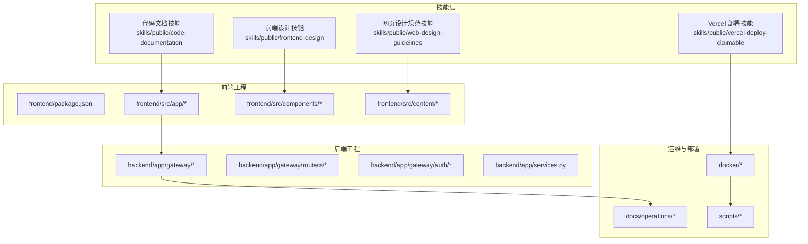
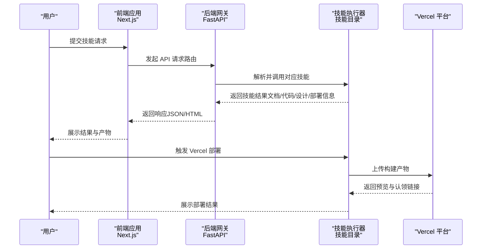
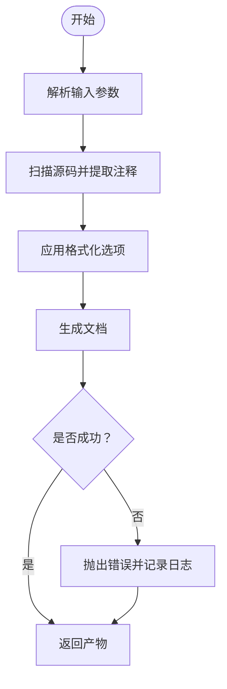
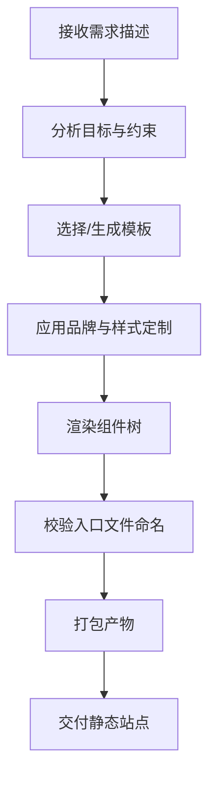
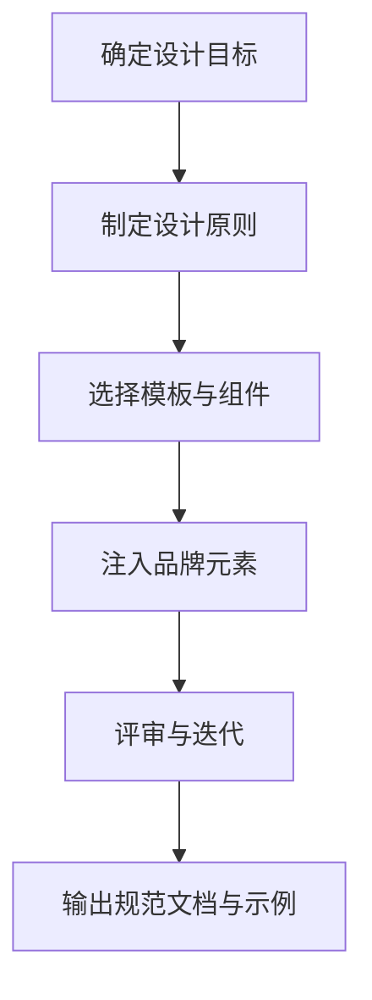
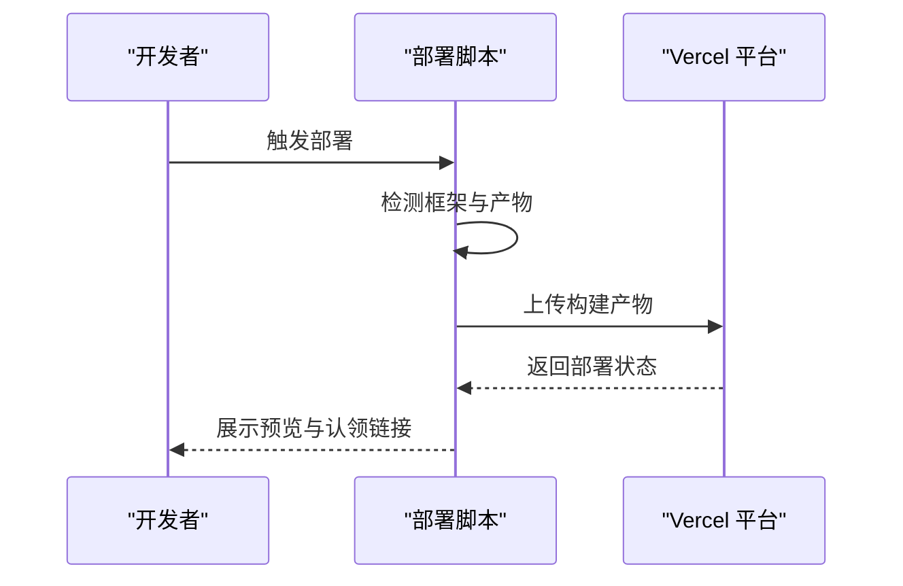

# 开发工具技能

<cite>
**本文引用的文件**
- [skills/public/code-documentation/SKILL.md](file://skills/public/code-documentation/SKILL.md)
- [skills/public/frontend-design/SKILL.md](file://skills/public/frontend-design/SKILL.md)
- [skills/public/frontend-design/LICENSE.txt](file://skills/public/frontend-design/LICENSE.txt)
- [skills/public/web-design-guidelines/SKILL.md](file://skills/public/web-design-guidelines/SKILL.md)
- [skills/public/vercel-deploy-claimable/SKILL.md](file://skills/public/vercel-deploy-claimable/SKILL.md)
- [frontend/src/app/mock/api/skills/route.ts](file://frontend/src/app/mock/api/skills/route.ts)
- [scripts/deploy.sh](file://scripts/deploy.sh)
- [scripts/docker.sh](file://scripts/docker.sh)
- [scripts/serve.sh](file://scripts/serve.sh)
- [frontend/README.md](file://frontend/README.md)
- [backend/README.md](file://backend/README.md)
- [docs/operations/BUILD_AND_DEPLOY.md](file://docs/operations/BUILD_AND_DEPLOY.md)
- [docs/operations/USE_GUIDE.md](file://docs/operations/USE_GUIDE.md)
- [docs/operations/DEPLOYMENT_KNOWN_ISSUES.md](file://docs/operations/DEPLOYMENT_KNOWN_ISSUES.md)
- [docker/docker-compose.yaml](file://docker/docker-compose.yaml)
- [docker/nginx/nginx.conf](file://docker/nginx/nginx.conf)
- [docker/provisioner/Dockerfile](file://docker/provisioner/Dockerfile)
- [frontend/package.json](file://frontend/package.json)
- [backend/pyproject.toml](file://backend/pyproject.toml)
- [frontend/.github/workflows](file://frontend/.github/workflows)
- [backend/.github/workflows](file://backend/.github/workflows)
</cite>

## 目录
1. [简介](#简介)
2. [项目结构](#项目结构)
3. [核心技能](#核心技能)
4. [架构总览](#架构总览)
5. [详细组件分析](#详细组件分析)
6. [依赖关系分析](#依赖关系分析)
7. [性能考虑](#性能考虑)
8. [故障排除指南](#故障排除指南)
9. [结论](#结论)
10. [附录](#附录)

## 简介
本技术文档聚焦 DeerFlow 的“开发工具技能”，围绕以下能力展开：代码文档生成、前端设计、网页设计规范以及 Vercel 部署。文档旨在帮助开发者快速理解各技能的职责边界、输入输出约定、实现要点与最佳实践，并提供可复用的流程图与架构图以辅助团队协作与效率提升。

## 项目结构
- 技能目录位于 skills/public 下，每个技能以独立子目录呈现，包含技能说明文件（SKILL.md）与可选的脚本/模板资源。
- 前端工程位于 frontend/，采用 Next.js 框架，提供页面、组件、国际化内容与构建配置。
- 后端工程位于 backend/，包含网关、认证、路由、服务层与测试等模块。
- 运维与部署相关文档位于 docs/operations/，脚本位于 scripts/，容器化配置位于 docker/。

图表来源
- [skills/public/code-documentation/SKILL.md](file://skills/public/code-documentation/SKILL.md)
- [skills/public/frontend-design/SKILL.md](file://skills/public/frontend-design/SKILL.md)
- [skills/public/web-design-guidelines/SKILL.md](file://skills/public/web-design-guidelines/SKILL.md)
- [skills/public/vercel-deploy-claimable/SKILL.md](file://skills/public/vercel-deploy-claimable/SKILL.md)
- [frontend/package.json](file://frontend/package.json)
- [backend/app/gateway/routers/skills.py](file://backend/app/gateway/routers/skills.py)
- [docs/operations/BUILD_AND_DEPLOY.md](file://docs/operations/BUILD_AND_DEPLOY.md)
- [docker/docker-compose.yaml](file://docker/docker-compose.yaml)

章节来源
- [frontend/README.md](file://frontend/README.md)
- [backend/README.md](file://backend/README.md)

## 核心技能
本节概述四个与开发工具密切相关的技能：代码文档生成、前端设计、网页设计规范、Vercel 部署。每个技能均定义了明确的输入要求、输出约定与执行流程。

- 代码文档生成技能
  - 职责：面向代码库生成高质量文档，支持注释提取与格式化选项。
  - 输入：源码路径、语言偏好、输出格式（如 Markdown/HTML）、可选过滤规则。
  - 输出：结构化的文档文件或制品链接。
  - 关键参考：[skills/public/code-documentation/SKILL.md](file://skills/public/code-documentation/SKILL.md)

- 前端设计技能
  - 职责：生成具有高设计质量的前端界面，避免通用“AI 呆板”风格；强制入口文件命名为 index.html。
  - 输入：需求描述（组件/页面/应用）、目标受众、技术约束。
  - 输出：可直接部署的静态产物（含 index.html）。
  - 关键参考：[skills/public/frontend-design/SKILL.md](file://skills/public/frontend-design/SKILL.md)，[skills/public/frontend-design/LICENSE.txt](file://skills/public/frontend-design/LICENSE.txt)

- 网页设计规范技能
  - 职责：提供统一的设计原则与模板系统，指导页面布局、配色、字体与交互一致性。
  - 输入：设计目标、品牌规范、平台特性。
  - 输出：设计规范文档与可复用模板。
  - 关键参考：[skills/public/web-design-guidelines/SKILL.md](file://skills/public/web-design-guidelines/SKILL.md)

- Vercel 部署技能
  - 职责：自动检测框架并完成部署，支持静态 HTML 项目与多框架场景；提供预览与认领链接。
  - 输入：项目根目录、环境变量、网络权限。
  - 输出：部署成功提示、预览 URL 与认领 URL。
  - 关键参考：[skills/public/vercel-deploy-claimable/SKILL.md](file://skills/public/vercel-deploy-claimable/SKILL.md)

章节来源
- [skills/public/code-documentation/SKILL.md](file://skills/public/code-documentation/SKILL.md)
- [skills/public/frontend-design/SKILL.md](file://skills/public/frontend-design/SKILL.md)
- [skills/public/frontend-design/LICENSE.txt](file://skills/public/frontend-design/LICENSE.txt)
- [skills/public/web-design-guidelines/SKILL.md](file://skills/public/web-design-guidelines/SKILL.md)
- [skills/public/vercel-deploy-claimable/SKILL.md](file://skills/public/vercel-deploy-claimable/SKILL.md)

## 架构总览
下图展示了从用户请求到最终产物交付的整体流程，涵盖技能调用、前端渲染、后端网关与部署流水线。

图表来源
- [frontend/src/app/mock/api/skills/route.ts](file://frontend/src/app/mock/api/skills/route.ts)
- [backend/app/gateway/routers/skills.py](file://backend/app/gateway/routers/skills.py)
- [skills/public/vercel-deploy-claimable/SKILL.md](file://skills/public/vercel-deploy-claimable/SKILL.md)

## 详细组件分析

### 代码文档生成技能
- 设计原则
  - 可配置性：支持多种输出格式与过滤策略，便于适配不同项目。
  - 可追溯性：保留源码位置映射与版本信息，便于回溯与审计。
- 处理流程
  - 解析输入参数（路径、语言、格式、过滤规则）。
  - 扫描源码并提取注释与元信息。
  - 应用格式化选项（标题层级、列表样式、代码块高亮）。
  - 生成文档并返回制品链接或本地文件路径。
- 错误处理
  - 文件不可读、编码异常、格式不支持时返回明确错误信息。
- 性能考量
  - 对大型仓库采用增量扫描与缓存机制，减少重复计算。

章节来源
- [skills/public/code-documentation/SKILL.md](file://skills/public/code-documentation/SKILL.md)

### 前端设计技能
- 设计原则
  - 高质量与可生产性：避免通用“AI 呆板”风格，强调细节与创意。
  - 兼容性与可部署性：强制入口文件名为 index.html，确保标准托管兼容。
- 模板系统与定制
  - 使用组件化模板，支持主题切换、布局变体与品牌定制。
  - 提供样式变量与断点配置，便于在不同设备上保持一致体验。
- 输出约定
  - 生成完整静态站点，包含入口页面、样式与脚本资源。
  - 支持多语言内容与国际化路由。

章节来源
- [skills/public/frontend-design/SKILL.md](file://skills/public/frontend-design/SKILL.md)
- [skills/public/frontend-design/LICENSE.txt](file://skills/public/frontend-design/LICENSE.txt)

### 网页设计规范技能
- 设计原则
  - 一致性：统一的排版、色彩与交互模式。
  - 可访问性：遵循 WCAG 指南，保障不同用户群体的可用性。
  - 可扩展性：通过变量与模块化设计，支持未来迭代。
- 模板系统
  - 提供页面骨架、组件库与示例页面，降低重复工作。
  - 支持暗色模式、响应式断点与无障碍标签。
- 定制方法
  - 通过配置文件覆盖默认值，或引入自定义主题包。

章节来源
- [skills/public/web-design-guidelines/SKILL.md](file://skills/public/web-design-guidelines/SKILL.md)

### Vercel 部署技能
- 自动框架检测
  - 依据 package.json 自动识别前端/后端框架，支持主流生态。
  - 对无 package.json 的静态 HTML 项目进行特殊处理（重命名单文件）。
- 部署流程
  - 上传构建产物至 Vercel。
  - 生成预览 URL 与认领 URL，便于查看与转移所有权。
- 故障排除
  - 网络出口限制（常见于特定平台）：提供允许域名的操作指引。

图表来源
- [skills/public/vercel-deploy-claimable/SKILL.md](file://skills/public/vercel-deploy-claimable/SKILL.md)

章节来源
- [skills/public/vercel-deploy-claimable/SKILL.md](file://skills/public/vercel-deploy-claimable/SKILL.md)

## 依赖关系分析
- 前端与后端耦合
  - 前端通过网关路由与后端交互，技能结果经由 API 返回给前端展示。
  - 技能目录中的脚本与模板可被前端与后端共享使用。
- 运维与部署依赖
  - 部署脚本依赖容器编排与 Nginx 配置，确保服务稳定运行。
  - 文档与脚本共同构成部署与发布流程的支撑材料。

图表来源
- [frontend/src/app/mock/api/skills/route.ts](file://frontend/src/app/mock/api/skills/route.ts)
- [backend/app/gateway/routers/skills.py](file://backend/app/gateway/routers/skills.py)
- [docs/operations/BUILD_AND_DEPLOY.md](file://docs/operations/BUILD_AND_DEPLOY.md)
- [scripts/deploy.sh](file://scripts/deploy.sh)
- [docker/docker-compose.yaml](file://docker/docker-compose.yaml)
- [docker/nginx/nginx.conf](file://docker/nginx/nginx.conf)

章节来源
- [frontend/src/app/mock/api/skills/route.ts](file://frontend/src/app/mock/api/skills/route.ts)
- [backend/app/gateway/routers/skills.py](file://backend/app/gateway/routers/skills.py)
- [docs/operations/BUILD_AND_DEPLOY.md](file://docs/operations/BUILD_AND_DEPLOY.md)
- [scripts/deploy.sh](file://scripts/deploy.sh)
- [docker/docker-compose.yaml](file://docker/docker-compose.yaml)
- [docker/nginx/nginx.conf](file://docker/nginx/nginx.conf)

## 性能考虑
- 代码文档生成
  - 使用增量扫描与缓存，避免对未变更文件重复处理。
  - 并行化注释提取与格式化步骤，缩短整体耗时。
- 前端设计
  - 组件按需加载与懒加载策略，减少首屏体积。
  - 样式与脚本分块打包，结合 CDN 加速。
- 部署流程
  - 利用容器镜像缓存与多阶段构建，减少重复下载与编译时间。
  - 在 CI 中启用工件缓存与并行作业，提升吞吐量。

## 故障排除指南
- Vercel 部署失败（网络出口限制）
  - 操作指引：在平台设置中允许 Vercel 相关域名后重试。
  - 参考：[skills/public/vercel-deploy-claimable/SKILL.md](file://skills/public/vercel-deploy-claimable/SKILL.md)
- 静态 HTML 项目入口文件问题
  - 确保存在 index.html 或按规则重命名单文件。
  - 参考：[skills/public/vercel-deploy-claimable/SKILL.md](file://skills/public/vercel-deploy-claimable/SKILL.md)
- 前端设计产物命名不符
  - 强制使用 index.html 作为入口文件，否则无法兼容标准托管。
  - 参考：[skills/public/frontend-design/SKILL.md](file://skills/public/frontend-design/SKILL.md)
- 代码文档生成异常
  - 检查源码路径与编码，确认格式化选项合法。
  - 参考：[skills/public/code-documentation/SKILL.md](file://skills/public/code-documentation/SKILL.md)

章节来源
- [skills/public/vercel-deploy-claimable/SKILL.md](file://skills/public/vercel-deploy-claimable/SKILL.md)
- [skills/public/frontend-design/SKILL.md](file://skills/public/frontend-design/SKILL.md)
- [skills/public/code-documentation/SKILL.md](file://skills/public/code-documentation/SKILL.md)

## 结论
本文系统梳理了 DeerFlow 的开发工具技能：代码文档生成、前端设计、网页设计规范与 Vercel 部署。通过明确的输入输出约定、流程图与架构图，团队可以更高效地协作与交付高质量产物。建议在实际落地中结合项目现状选择合适技能组合，并持续优化自动化流程与质量门禁。

## 附录
- 快速参考
  - 技能清单与启用状态可通过前端 Mock API 获取。
    - 参考：[frontend/src/app/mock/api/skills/route.ts](file://frontend/src/app/mock/api/skills/route.ts)
  - 部署与使用指南
    - 参考：[docs/operations/BUILD_AND_DEPLOY.md](file://docs/operations/BUILD_AND_DEPLOY.md)，[docs/operations/USE_GUIDE.md](file://docs/operations/USE_GUIDE.md)，[docs/operations/DEPLOYMENT_KNOWN_ISSUES.md](file://docs/operations/DEPLOYMENT_KNOWN_ISSUES.md)
  - 容器化与服务编排
    - 参考：[docker/docker-compose.yaml](file://docker/docker-compose.yaml)，[docker/nginx/nginx.conf](file://docker/nginx/nginx.conf)，[docker/provisioner/Dockerfile](file://docker/provisioner/Dockerfile)
  - 本地开发与脚本
    - 参考：[scripts/deploy.sh](file://scripts/deploy.sh)，[scripts/docker.sh](file://scripts/docker.sh)，[scripts/serve.sh](file://scripts/serve.sh)
  - 工程配置
    - 参考：[frontend/package.json](file://frontend/package.json)，[backend/pyproject.toml](file://backend/pyproject.toml)