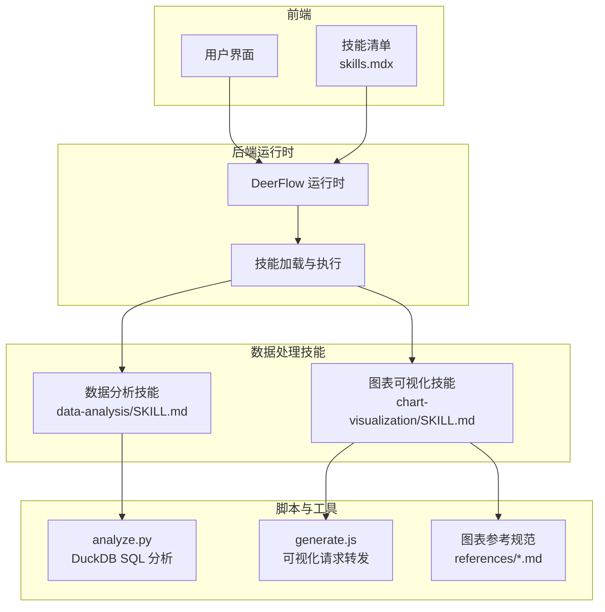
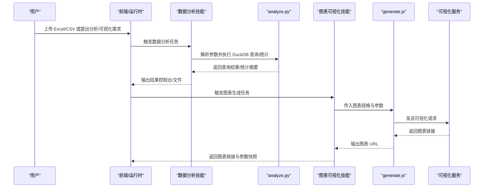
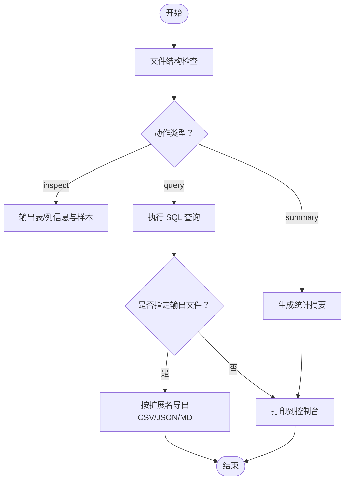
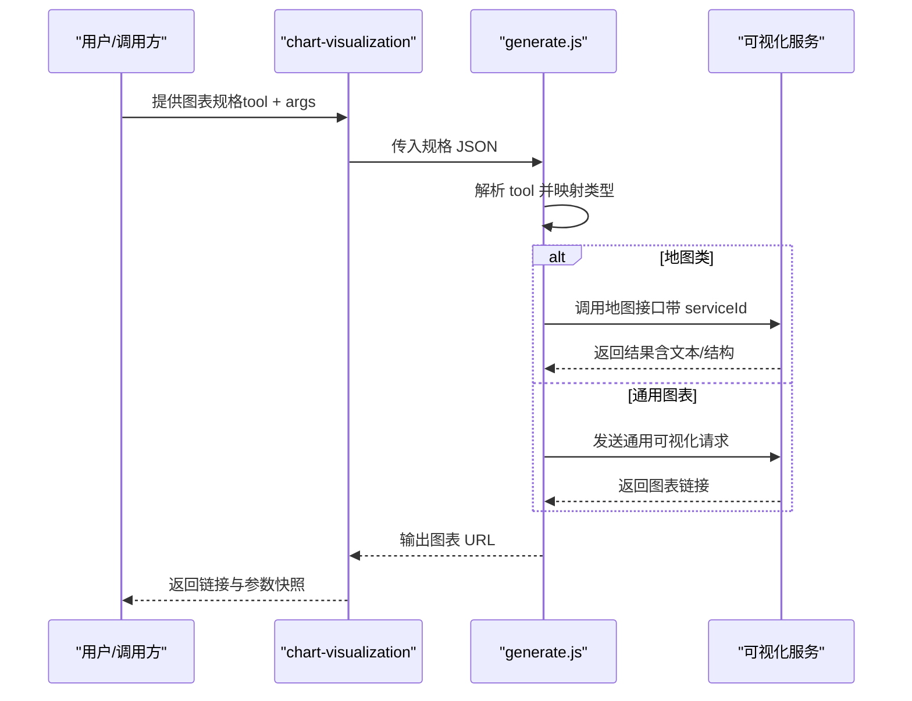
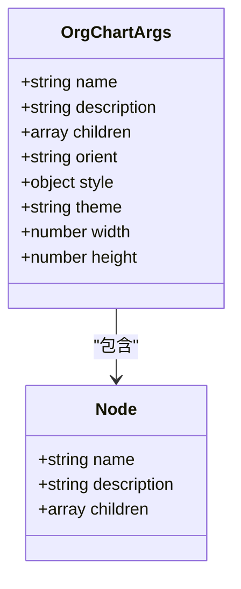
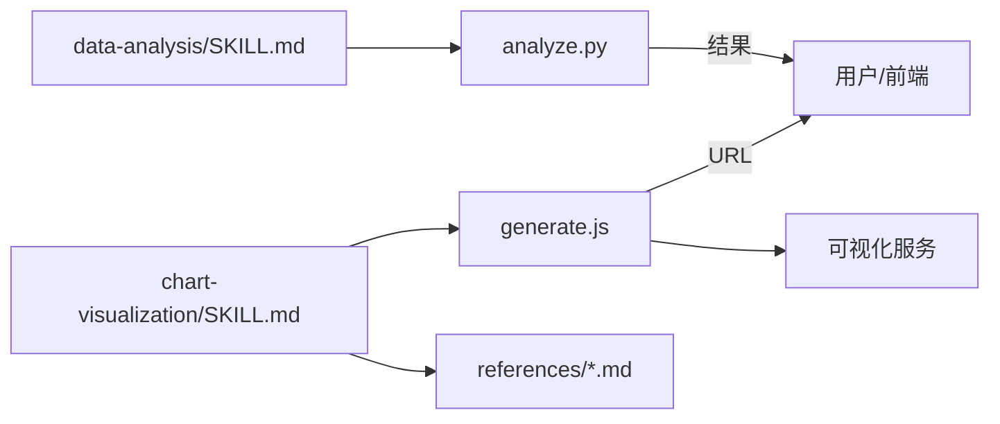

# 数据处理技能

<cite>
**本文引用的文件**
- [skills/public/data-analysis/SKILL.md](file://skills/public/data-analysis/SKILL.md)
- [skills/public/data-analysis/scripts/analyze.py](file://skills/public/data-analysis/scripts/analyze.py)
- [skills/public/chart-visualization/SKILL.md](file://skills/public/chart-visualization/SKILL.md)
- [skills/public/chart-visualization/scripts/generate.js](file://skills/public/chart-visualization/scripts/generate.js)
- [skills/public/chart-visualization/references/generate_organization_chart.md](file://skills/public/chart-visualization/references/generate_organization_chart.md)
- [frontend/src/content/en/harness/skills.mdx](file://frontend/src/content/en/harness/skills.mdx)
</cite>

## 目录
1. [简介](#简介)
2. [项目结构](#项目结构)
3. [核心组件](#核心组件)
4. [架构总览](#架构总览)
5. [详细组件分析](#详细组件分析)
6. [依赖分析](#依赖分析)
7. [性能考虑](#性能考虑)
8. [故障排查指南](#故障排查指南)
9. [结论](#结论)
10. [附录](#附录)

## 简介
本技术文档聚焦于 DeerFlow 的“数据处理技能”，涵盖两类核心能力：
- 数据分析技能：基于 DuckDB 对用户上传的 Excel/CSV 文件进行结构化探索、SQL 查询、统计摘要与结果导出。
- 图表可视化技能：根据数据特征智能选择合适的图表类型，解析参数并调用可视化服务生成图表链接。

文档将从系统架构、组件关系、数据流、处理逻辑、集成点、错误处理与性能优化等方面进行深入说明，并提供使用示例、配置项与常见问题解决方案，帮助开发者与使用者高效落地数据洞察与可视化需求。

## 项目结构
围绕数据处理技能的关键目录与文件如下：
- 数据分析技能
  - 技能说明：skills/public/data-analysis/SKILL.md
  - 核心脚本：skills/public/data-analysis/scripts/analyze.py
- 图表可视化技能
  - 技能说明：skills/public/chart-visualization/SKILL.md
  - 可视化脚本：skills/public/chart-visualization/scripts/generate.js
  - 图表参考规范：skills/public/chart-visualization/references/*.md
- 前端技能清单
  - 技能概览：frontend/src/content/en/harness/skills.mdx

**图表来源**
- [skills/public/data-analysis/SKILL.md:1-100](file://skills/public/data-analysis/SKILL.md#L1-L100)
- [skills/public/chart-visualization/SKILL.md:1-73](file://skills/public/chart-visualization/SKILL.md#L1-L73)
- [skills/public/data-analysis/scripts/analyze.py:410-477](file://skills/public/data-analysis/scripts/analyze.py#L410-L477)
- [skills/public/chart-visualization/scripts/generate.js:1-173](file://skills/public/chart-visualization/scripts/generate.js#L1-L173)
- [frontend/src/content/en/harness/skills.mdx:47-58](file://frontend/src/content/en/harness/skills.mdx#L47-L58)

**章节来源**
- [skills/public/data-analysis/SKILL.md:1-100](file://skills/public/data-analysis/SKILL.md#L1-L100)
- [skills/public/chart-visualization/SKILL.md:1-73](file://skills/public/chart-visualization/SKILL.md#L1-L73)
- [frontend/src/content/en/harness/skills.mdx:47-58](file://frontend/src/content/en/harness/skills.mdx#L47-L58)

## 核心组件
- 数据分析技能（data-analysis）
  - 能力：文件结构检查、SQL 查询、统计摘要、多工作表支持、结果导出（CSV/JSON/Markdown）。
  - 执行引擎：DuckDB（列式分析引擎）。
  - 入口脚本：analyze.py。
- 图表可视化技能（chart-visualization）
  - 能力：26 种图表类型的智能选择、参数提取、可视化服务调用、返回图表链接。
  - 执行脚本：generate.js。
  - 参数规范：各图表类型参考文件位于 references/ 目录。

**章节来源**
- [skills/public/data-analysis/SKILL.md:10-20](file://skills/public/data-analysis/SKILL.md#L10-L20)
- [skills/public/chart-visualization/SKILL.md:10-42](file://skills/public/chart-visualization/SKILL.md#L10-L42)
- [skills/public/chart-visualization/scripts/generate.js:1-32](file://skills/public/chart-visualization/scripts/generate.js#L1-L32)

## 架构总览
数据处理技能的整体交互流程如下：

**图表来源**
- [skills/public/data-analysis/SKILL.md:21-100](file://skills/public/data-analysis/SKILL.md#L21-L100)
- [skills/public/chart-visualization/SKILL.md:12-66](file://skills/public/chart-visualization/SKILL.md#L12-L66)
- [skills/public/chart-visualization/scripts/generate.js:45-95](file://skills/public/chart-visualization/scripts/generate.js#L45-L95)

## 详细组件分析

### 数据分析技能（data-analysis）
- 处理流程
  - 文件结构检查：识别 Excel 工作表或 CSV 列名、类型、行数与样本数据。
  - SQL 查询：支持任意 SQL，用于过滤、聚合、连接与排序。
  - 统计摘要：对数值列计算计数、均值、标准差、分位数、极值与空值；对字符串列计算唯一值、众数与前 N 高频值。
  - 结果导出：自动根据输出文件扩展名选择 CSV/JSON/Markdown 格式。
- 关键实现要点
  - DuckDB 列式引擎：适合大规模结构化数据的快速分析。
  - 参数驱动：通过命令行参数控制文件路径、动作（inspect/query/summary）、SQL 与输出文件。
  - 错误处理：对统计计算异常进行捕获并提示，保证流程稳健性。

**图表来源**
- [skills/public/data-analysis/SKILL.md:32-100](file://skills/public/data-analysis/SKILL.md#L32-L100)
- [skills/public/data-analysis/scripts/analyze.py:410-477](file://skills/public/data-analysis/scripts/analyze.py#L410-L477)

**章节来源**
- [skills/public/data-analysis/SKILL.md:10-100](file://skills/public/data-analysis/SKILL.md#L10-L100)
- [skills/public/data-analysis/scripts/analyze.py:410-477](file://skills/public/data-analysis/scripts/analyze.py#L410-L477)

### 图表可视化技能（chart-visualization）
- 能力与图表类型
  - 智能选择：依据数据特征（时间序列、比较、部分-整体、关系/流向、地图、层级树、专用图表）自动匹配最合适的生成器。
  - 生成器映射：generate.js 内置 26 种图表类型的映射，统一转换为可视化服务所需的类型标识。
  - 参数提取：每个图表类型的具体参数由 references/ 下的对应文件定义，如组织架构图、网络图、思维导图等。
- 执行流程
  - 解析规格：支持传入单个或数组形式的规格对象，逐条处理。
  - 地图类特殊处理：district/path/pin 地图走独立接口，返回文本内容或结构化结果。
  - 通用图表：调用可视化服务接口，返回图表链接。
  - 输出：控制台输出图表 URL，便于前端展示与回传给用户。

**图表来源**
- [skills/public/chart-visualization/SKILL.md:16-66](file://skills/public/chart-visualization/SKILL.md#L16-L66)
- [skills/public/chart-visualization/scripts/generate.js:62-95](file://skills/public/chart-visualization/scripts/generate.js#L62-L95)

**章节来源**
- [skills/public/chart-visualization/SKILL.md:12-66](file://skills/public/chart-visualization/SKILL.md#L12-L66)
- [skills/public/chart-visualization/scripts/generate.js:1-173](file://skills/public/chart-visualization/scripts/generate.js#L1-L173)

### 图表类型与参数规范（以组织架构图为例）
- 组织架构图（generate_organization_chart）
  - 输入字段
    - 必填：data（节点需包含 name；children 支持嵌套，建议最大深度 3）
    - 可选：orient（方向）、style.texture（纹理风格）、theme（主题）、width/height（尺寸）
  - 使用建议：节点命名建议使用岗位/角色，description 描述职责或人数；大型组织可拆分为多个子图或按部门分批展示。
  - 返回：图表 URL，并在元信息中保留规格以便后续迭代。

**图表来源**
- [skills/public/chart-visualization/references/generate_organization_chart.md:1-21](file://skills/public/chart-visualization/references/generate_organization_chart.md#L1-L21)

**章节来源**
- [skills/public/chart-visualization/references/generate_organization_chart.md:1-21](file://skills/public/chart-visualization/references/generate_organization_chart.md#L1-L21)

## 依赖分析
- 组件耦合
  - 数据分析技能与可视化技能彼此独立，通过前端/运行时编排协作完成“分析—可视化”闭环。
  - 图表可视化技能依赖 generate.js 与可视化服务；不同图表类型依赖 references/ 中的参数规范。
- 外部依赖
  - DuckDB：数据分析技能的核心引擎。
  - 可视化服务：图表生成的实际执行者（通过 generate.js 转发请求）。
- 接口契约
  - generate.js 通过环境变量控制可视化服务地址与服务标识，确保部署灵活性。
  - 规格对象包含 tool 与 args 字段，tool 映射到具体图表类型，args 符合对应图表的参数规范。

**图表来源**
- [skills/public/data-analysis/SKILL.md:1-100](file://skills/public/data-analysis/SKILL.md#L1-L100)
- [skills/public/chart-visualization/SKILL.md:1-73](file://skills/public/chart-visualization/SKILL.md#L1-L73)
- [skills/public/chart-visualization/scripts/generate.js:34-43](file://skills/public/chart-visualization/scripts/generate.js#L34-L43)

**章节来源**
- [skills/public/chart-visualization/scripts/generate.js:34-43](file://skills/public/chart-visualization/scripts/generate.js#L34-L43)

## 性能考虑
- 数据分析技能
  - DuckDB 列式存储与向量化计算适合大规模结构化数据的快速分析，建议优先使用 SQL 过滤与聚合减少内存压力。
  - 导出大结果集时建议使用 CSV/JSON 流式写入策略，避免一次性加载至内存。
- 图表可视化技能
  - generate.js 对地图类与通用类采用差异化处理，减少不必要的序列化开销。
  - 合理设置图表宽高与节点数量，避免超大数据导致渲染失败或响应缓慢。
  - 通过环境变量配置可视化服务地址，确保网络稳定与低延迟。

[本节为通用性能建议，不直接分析特定文件，故无“章节来源”]

## 故障排查指南
- 数据分析技能
  - SQL 执行报错：检查表名/列名大小写与转义，确认目标表存在且列类型符合预期。
  - 统计计算异常：关注空值与异常值处理，必要时先清洗数据再统计。
  - 导出格式问题：确认输出文件扩展名正确，系统据此自动选择导出格式。
- 图表可视化技能
  - 工具名未知：确认 tool 名称与 generate.js 中的映射一致。
  - 请求失败：检查可视化服务地址与服务标识（环境变量）配置，查看返回的错误信息定位问题。
  - 地图类输出为空：确认输入参数与服务端返回结构，必要时切换为文本内容或结构化结果处理。

**章节来源**
- [skills/public/data-analysis/SKILL.md:88-100](file://skills/public/data-analysis/SKILL.md#L88-L100)
- [skills/public/chart-visualization/SKILL.md:36-66](file://skills/public/chart-visualization/SKILL.md#L36-L66)
- [skills/public/chart-visualization/scripts/generate.js:97-163](file://skills/public/chart-visualization/scripts/generate.js#L97-L163)

## 结论
DeerFlow 的数据处理技能通过“数据分析 + 图表可视化”的组合，为用户提供从结构化数据探索到直观可视化的完整链路。数据分析技能依托 DuckDB 实现高性能 SQL 分析与统计摘要，图表可视化技能通过统一的规格与参数规范，覆盖多种图表类型并稳定输出链接。配合合理的参数配置与性能优化策略，可满足多样化的业务场景与交付要求。

[本节为总结性内容，不直接分析特定文件，故无“章节来源”]

## 附录

### 使用示例与最佳实践
- 数据分析技能
  - 文件检查：使用 inspect 动作获取表/列信息与样本数据。
  - SQL 查询：针对业务问题构造查询，结合 group by/aggregate/order by 获取洞察。
  - 统计摘要：对关键指标进行分布与集中趋势分析。
  - 结果导出：将查询结果导出为 CSV/JSON/Markdown，便于进一步处理或报告生成。
- 图表可视化技能
  - 智能选择：根据数据特征选择合适图表类型（时间序列、比较、部分-整体、关系/流向、地图、层级树、专用图表）。
  - 参数提取：对照 references/ 下的规范准备 args，确保 data、title、theme、style 等字段齐全。
  - 执行生成：通过 generate.js 传入规格 JSON，获取图表链接并返回给用户。

**章节来源**
- [skills/public/data-analysis/SKILL.md:21-100](file://skills/public/data-analysis/SKILL.md#L21-L100)
- [skills/public/chart-visualization/SKILL.md:12-66](file://skills/public/chart-visualization/SKILL.md#L12-L66)

### 技能清单与入口
- 前端技能清单中明确列出“data-analysis”与“chart-visualization”两项技能，便于在界面中引导用户选择。

**章节来源**
- [frontend/src/content/en/harness/skills.mdx:47-58](file://frontend/src/content/en/harness/skills.mdx#L47-L58)