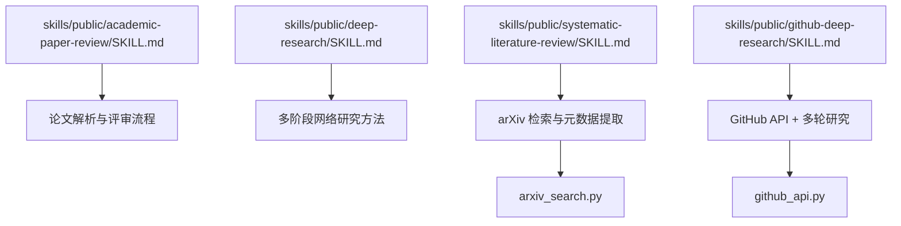
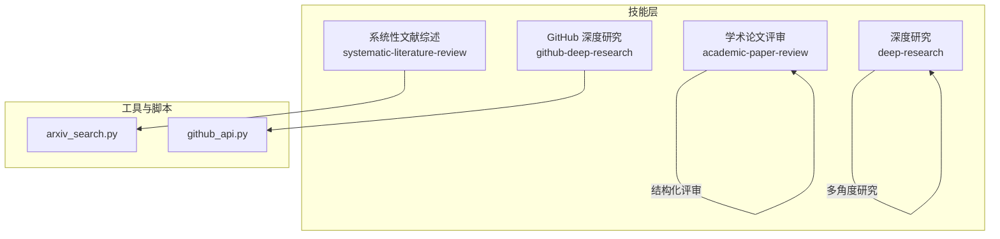
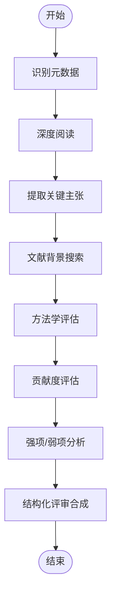
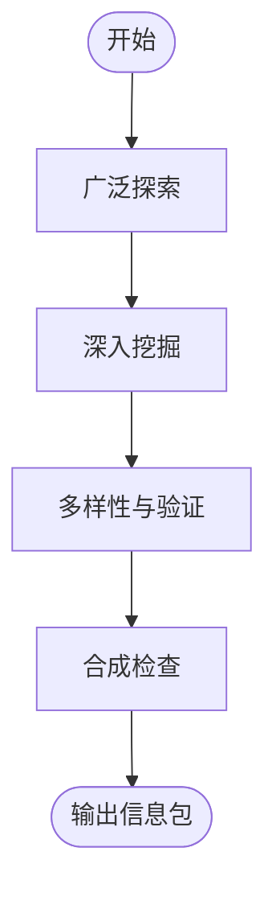
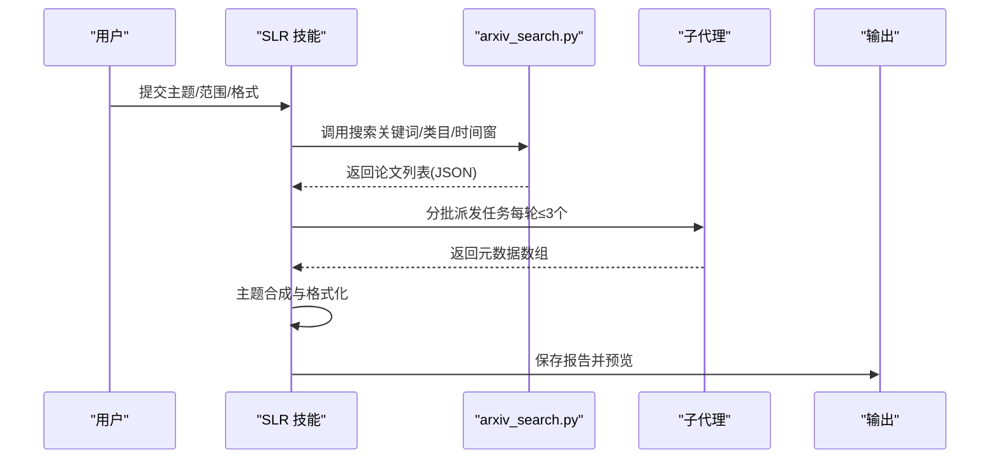
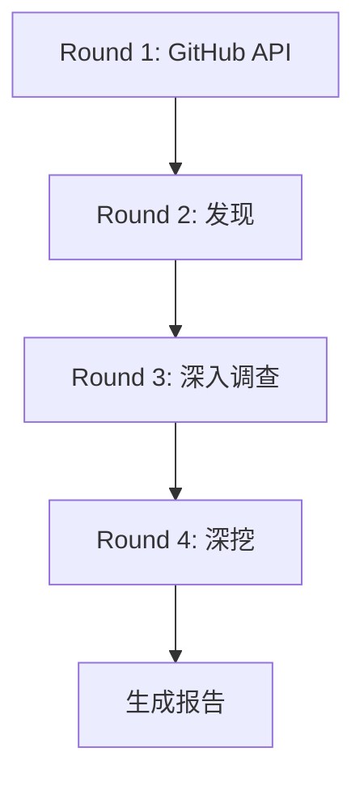
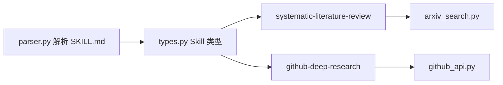

# 研究分析技能

<cite>
**本文引用的文件**
- [academic-paper-review/SKILL.md](file://skills/public/academic-paper-review/SKILL.md)
- [deep-research/SKILL.md](file://skills/public/deep-research/SKILL.md)
- [systematic-literature-review/SKILL.md](file://skills/public/systematic-literature-review/SKILL.md)
- [github-deep-research/SKILL.md](file://skills/public/github-deep-research/SKILL.md)
- [arxiv_search.py](file://skills/public/systematic-literature-review/scripts/arxiv_search.py)
- [github_api.py](file://skills/public/github-deep-research/scripts/github_api.py)
- [types.py](file://backend/packages/harness/deerflow/skills/types.py)
- [parser.py](file://backend/packages/harness/deerflow/skills/parser.py)
</cite>

## 目录
1. [简介](#简介)
2. [项目结构](#项目结构)
3. [核心组件](#核心组件)
4. [架构总览](#架构总览)
5. [详细组件分析](#详细组件分析)
6. [依赖关系分析](#依赖关系分析)
7. [性能考量](#性能考量)
8. [故障排查指南](#故障排查指南)
9. [结论](#结论)
10. [附录](#附录)

## 简介
本文件面向 DeerFlow 平台的研究分析技能，系统梳理并对比以下四项关键能力：
- 学术论文评审（academic-paper-review）：对单篇论文进行结构化同行评审，覆盖摘要、优势、劣势、方法学评估、贡献度评价、文献定位与可执行建议。
- 深度研究（deep-research）：面向任意主题的系统化网络研究方法，强调多角度、多层次、多来源的信息收集与验证。
- 系统性文献综述（systematic-literature-review，简称 SLR）：在 arXiv 上检索并系统合成多篇论文，形成结构化综述报告，支持 APA/IEEE/BibTeX 格式。
- GitHub 深度研究（github-deep-research）：围绕开源项目的多轮研究，结合 GitHub API、网络搜索与抓取，生成包含时间线、架构图与指标对比的综合报告。

本文件将从输入参数、处理流程、输出结构、应用场景、最佳实践到差异与选型策略进行全面说明，并辅以可视化图示帮助理解。

## 项目结构
研究分析技能位于 skills/public 下的独立子目录中，每项技能均通过 SKILL.md 提供规范化的使用说明与工作流。系统性文献综述与 GitHub 深度研究分别内置了专用脚本（arxiv_search.py、github_api.py），用于与外部服务交互。

**图表来源**
- [academic-paper-review/SKILL.md:1-290](file://skills/public/academic-paper-review/SKILL.md#L1-L290)
- [deep-research/SKILL.md:1-199](file://skills/public/deep-research/SKILL.md#L1-L199)
- [systematic-literature-review/SKILL.md:1-236](file://skills/public/systematic-literature-review/SKILL.md#L1-L236)
- [github-deep-research/SKILL.md:1-167](file://skills/public/github-deep-research/SKILL.md#L1-L167)
- [arxiv_search.py:1-307](file://skills/public/systematic-literature-review/scripts/arxiv_search.py#L1-L307)
- [github_api.py:1-332](file://skills/public/github-deep-research/scripts/github_api.py#L1-L332)

**章节来源**
- [academic-paper-review/SKILL.md:1-290](file://skills/public/academic-paper-review/SKILL.md#L1-L290)
- [deep-research/SKILL.md:1-199](file://skills/public/deep-research/SKILL.md#L1-L199)
- [systematic-literature-review/SKILL.md:1-236](file://skills/public/systematic-literature-review/SKILL.md#L1-L236)
- [github-deep-research/SKILL.md:1-167](file://skills/public/github-deep-research/SKILL.md#L1-L167)

## 核心组件
- 学术论文评审（academic-paper-review）
  - 输入：论文 URL、PDF 文件上传、或“review/analyze/critique/summarize”类请求
  - 流程：元数据识别 → 深度阅读 → 关键主张提取 → 文献背景搜索 → 方法学评估 → 贡献度评价 → 强项/弱项分析 → 结构化评审合成
  - 输出：Markdown 完整评审报告，含元数据、摘要、贡献要点、强项、弱项、方法学评分、问题清单、小瑕疵、文献定位、推荐意见与总体评估等级
  - 应用：会议/期刊审稿前准备、快速 triage、教学与指导
- 深度研究（deep-research）
  - 输入：概念/技术/主题的深度理解需求、内容生成前置研究请求
  - 流程：广泛探索 → 深入挖掘 → 多样性与验证 → 合成检查
  - 输出：具备事实、案例、专家观点、趋势与挑战的综合信息包，支撑高质量内容创作
  - 应用：PPT/UI 设计、文章/报告/文档撰写、视频/多媒体内容制作
- 系统性文献综述（systematic-literature-review）
  - 输入：主题词、数量上限（≤50）、时间窗口、arXiv 类目、引用格式（APA/IEEE/BibTeX）、输出位置
  - 流程：规划 → arXiv 搜索 → 并行元数据抽取（子代理）→ 主题合成与格式化 → 保存与呈现
  - 输出：结构化综述报告（含执行摘要、主题、逐文注释、参考文献），并提供文件预览
  - 应用：领域综述、研究趋势分析、开题报告、课程论文
- GitHub 深度研究（github-deep-research）
  - 输入：GitHub 仓库 URL 或开源项目名称
  - 流程：Round 1（GitHub API）→ Round 2（发现）→ Round 3（深入调查）→ Round 4（深挖）
  - 输出：包含元数据块、执行摘要、时间线、关键分析章节、指标与比较、优劣势、来源、置信度评估与方法论的 Markdown 报告
  - 应用：竞品分析、技术路线回溯、社区影响力评估、项目健康度诊断

**章节来源**
- [academic-paper-review/SKILL.md:1-290](file://skills/public/academic-paper-review/SKILL.md#L1-L290)
- [deep-research/SKILL.md:1-199](file://skills/public/deep-research/SKILL.md#L1-L199)
- [systematic-literature-review/SKILL.md:1-236](file://skills/public/systematic-literature-review/SKILL.md#L1-L236)
- [github-deep-research/SKILL.md:1-167](file://skills/public/github-deep-research/SKILL.md#L1-L167)

## 架构总览
下图展示了四项研究分析技能在系统中的角色与协作关系：它们各自遵循明确的工作流，部分技能（如 SLR、GitHub 深度研究）通过内置脚本访问外部服务，其余技能侧重于信息组织与结构化输出。

**图表来源**
- [academic-paper-review/SKILL.md:1-290](file://skills/public/academic-paper-review/SKILL.md#L1-L290)
- [deep-research/SKILL.md:1-199](file://skills/public/deep-research/SKILL.md#L1-L199)
- [systematic-literature-review/SKILL.md:1-236](file://skills/public/systematic-literature-review/SKILL.md#L1-L236)
- [github-deep-research/SKILL.md:1-167](file://skills/public/github-deep-research/SKILL.md#L1-L167)
- [arxiv_search.py:1-307](file://skills/public/systematic-literature-review/scripts/arxiv_search.py#L1-L307)
- [github_api.py:1-332](file://skills/public/github-deep-research/scripts/github_api.py#L1-L332)

## 详细组件分析

### 学术论文评审（academic-paper-review）
- 输入参数
  - 论文来源：URL（arXiv、DOI、会议/期刊链接）、PDF 文件上传
  - 用户意图触发：review/analyze/critique/assess/summarize 等
- 处理流程
  - 元数据识别：标题、作者、单位、发表/提交状态、年份、领域、论文类型
  - 深度阅读：摘要与引言、相关工作、方法学、实验与结果、讨论与局限、结论
  - 关键主张提取：明确列出主要主张、证据强度与依据
  - 文献背景搜索：基于主题与技术点的检索与抓取，定位工作在领域中的位置
  - 方法学评估：声音性、新颖性、可复现性、实验设计、统计严谨性、可扩展性
  - 贡献度评估：地标级、显著、中等、边缘、低于阈值
  - 强项/弱项分析：具体观察、出处引用、影响说明
  - 评审合成：按模板输出完整评审
- 输出结构
  - 元数据块、执行摘要、贡献要点、强项、弱项、方法学评分表、作者提问清单、小瑕疵、文献定位、推荐意见、总体评估与置信度
- 应用场景
  - 会议/期刊审稿前准备、快速 triage、教学与指导、投稿准备
- 最佳实践
  - 始终基于论文本身证据进行判断，避免“应然”而非“实然”的批评
  - 保持客观与尊重，区分重大缺陷与可修复问题
  - 对不可复现/未验证内容如实披露局限
  - 与深度研究配合，先广后深，再回到单篇评审

**图表来源**
- [academic-paper-review/SKILL.md:36-290](file://skills/public/academic-paper-review/SKILL.md#L36-L290)

**章节来源**
- [academic-paper-review/SKILL.md:1-290](file://skills/public/academic-paper-review/SKILL.md#L1-L290)

### 深度研究（deep-research）
- 输入参数
  - 研究问题：what/is/explain/comparison/research 等
  - 内容生成前置：PPT/UI/文章/报告/视频等需要真实世界信息的任务
- 处理流程
  - 广泛探索：初始调查 → 识别维度 → 地图绘制
  - 深入挖掘：精确关键词 → 多种表述 → 全文抓取 → 追踪参考文献
  - 多样性与验证：事实与数据、案例与实例、专家观点、趋势与预测、比较与替代、挑战与批评
  - 合成检查：是否从至少3-5个角度研究、是否已读权威全文、信息是否最新且权威
- 输出
  - 综合信息包：关键事实、统计数据、真实案例、专家观点、当前趋势与相关背景
- 最佳实践
  - 使用具体上下文与权威来源提示词
  - 时间限定要精确（日/周/月/年），避免过时信息
  - 多轮迭代：先广后深，逐步收敛

**图表来源**
- [deep-research/SKILL.md:33-199](file://skills/public/deep-research/SKILL.md#L33-L199)

**章节来源**
- [deep-research/SKILL.md:1-199](file://skills/public/deep-research/SKILL.md#L1-L199)

### 系统性文献综述（systematic-literature-review，SLR）
- 输入参数
  - 主题词、数量上限（≤50）、时间窗口、arXiv 类目、引用格式（APA/IEEE/BibTeX）、输出位置
- 处理流程
  - 规划：确认主题、范围、格式、输出位置
  - arXiv 搜索：内置脚本调用，支持 relevance 排序与日期范围过滤
  - 并行元数据抽取：通过 task 工具分批派发子代理，限制并发（每轮最多3个），保证合成质量
  - 主题合成与格式化：跨论文主题识别、趋同与分歧、缺口分析；按模板格式化引用
  - 保存与呈现：生成报告文件并提供简要预览
- 输出
  - 执行摘要、主题列表、逐文注释、参考文献、方法论章节
- 最佳实践
  - 查询短而精，用类目缩小范围，避免过度宽泛导致零结果
  - 严格遵守并发限制与轮次策略，失败批次不影响整体
  - 若 arXiv 结果为空，建议放宽主题或移除类目过滤

**图表来源**
- [systematic-literature-review/SKILL.md:30-236](file://skills/public/systematic-literature-review/SKILL.md#L30-L236)
- [arxiv_search.py:1-307](file://skills/public/systematic-literature-review/scripts/arxiv_search.py#L1-L307)

**章节来源**
- [systematic-literature-review/SKILL.md:1-236](file://skills/public/systematic-literature-review/SKILL.md#L1-L236)
- [arxiv_search.py:1-307](file://skills/public/systematic-literature-review/scripts/arxiv_search.py#L1-L307)

### GitHub 深度研究（github-deep-research）
- 输入参数
  - GitHub 仓库 URL 或开源项目名称
- 处理流程
  - Round 1：GitHub API（summary/info/readme/tree/languages/contributors/commits/issues/prs/releases）
  - Round 2：通用搜索（概览、关键术语、官网/仓库、主要玩家/竞争者）
  - Round 3：深入调查（技术架构、关键事件时间线、社区情绪、抓取有价值 URL）
  - Round 4：深挖（提交历史、议题/拉取请求演进、贡献者活跃度）
- 输出
  - 元数据块、执行摘要、时间线、关键分析章节、指标与比较、优劣势、来源、置信度评估、方法论
- 最佳实践
  - 优先官方来源（仓库/文档/公司博客），交叉验证
  - 用提交/PR 的日期更可靠，标注内联引用
  - 区分事实与观点，明确标注推测

**图表来源**
- [github-deep-research/SKILL.md:10-167](file://skills/public/github-deep-research/SKILL.md#L10-L167)
- [github_api.py:1-332](file://skills/public/github-deep-research/scripts/github_api.py#L1-L332)

**章节来源**
- [github-deep-research/SKILL.md:1-167](file://skills/public/github-deep-research/SKILL.md#L1-L167)
- [github_api.py:1-332](file://skills/public/github-deep-research/scripts/github_api.py#L1-L332)

## 依赖关系分析
- 技能元数据与加载
  - 技能通过 SKILL.md 的 YAML Front Matter 描述元数据（名称、描述、许可证、允许工具等），由解析器读取并构建 Skill 对象
  - Skill 类型定义了技能路径计算、容器内路径映射等，便于在运行时挂载与调用
- 外部脚本依赖
  - SLR 依赖 arxiv_search.py 完成 arXiv 检索与元数据解析
  - GitHub 深度研究依赖 github_api.py 完成仓库信息、树形结构、语言分布、提交与议题等数据获取
- 工具与并发控制
  - SLR 在元数据抽取阶段要求启用子代理（subagent），并通过 task 工具进行并发调度，限制每轮最多3个子代理，确保合成质量与稳定性

**图表来源**
- [parser.py:1-111](file://backend/packages/harness/deerflow/skills/parser.py#L1-L111)
- [types.py:1-69](file://backend/packages/harness/deerflow/skills/types.py#L1-L69)
- [arxiv_search.py:1-307](file://skills/public/systematic-literature-review/scripts/arxiv_search.py#L1-L307)
- [github_api.py:1-332](file://skills/public/github-deep-research/scripts/github_api.py#L1-L332)

**章节来源**
- [parser.py:1-111](file://backend/packages/harness/deerflow/skills/parser.py#L1-L111)
- [types.py:1-69](file://backend/packages/harness/deerflow/skills/types.py#L1-L69)

## 性能考量
- SLR 并行抽取
  - 每轮最多3个子代理，批次大小约5篇，避免主上下文 Token 消耗过高，提升合成质量
  - 若某批次失败，记录并跳过，不影响其他批次，提高鲁棒性
- GitHub API
  - 支持可选的个人访问令牌以提升速率限制；脚本包含 requests 回退至 urllib 的兼容实现
- 深度研究
  - 强调迭代与多轮搜索，避免一次性浅层检索；合理的时间限定与查询策略有助于减少无效结果
- 输出与存储
  - SLR 仅在最终阶段保存报告文件，中间结果不落盘，降低 I/O 开销

[本节为通用性能建议，无需特定文件引用]

## 故障排查指南
- SLR 搜索无结果
  - 现象：arXiv 返回空集
  - 排查：缩短主题词、移除过于宽泛的限定、调整类目或时间窗
  - 参考：查询短而精、relevance 排序优先、避免将字段名塞入查询字符串
- 子代理抽取失败
  - 现象：task 返回失败/超时
  - 排查：检查并发轮次与批次分配、确认子代理可用性、记录受影响批次并继续后续批次
- GitHub API 404/权限不足
  - 现象：无法获取仓库信息或文件内容
  - 排查：确认仓库公开性、设置 GITHUB_TOKEN、检查分支名称（默认 main/master）
- 输出格式异常
  - 现象：报告缺少主题或注释
  - 排查：确认 arXiv 结果数量足够、子代理返回 JSON 前缀清理正确、模板选择与格式一致

**章节来源**
- [systematic-literature-review/SKILL.md:45-90](file://skills/public/systematic-literature-review/SKILL.md#L45-L90)
- [github-deep-research/SKILL.md:30-74](file://skills/public/github-deep-research/SKILL.md#L30-L74)

## 结论
四项研究分析技能覆盖了从单篇论文评审到系统性文献综述、从通用网络研究到开源项目深度分析的完整谱系。它们在输入方式、处理流程与输出形态上各有侧重，既可独立使用，也可组合应用（如先深度研究再学术论文评审，或先 SLR 再撰写综述报告）。通过遵循各技能的查询策略、并发控制与最佳实践，可以显著提升研究质量与效率。

[本节为总结性内容，无需特定文件引用]

## 附录

### 使用示例与最佳实践速查
- 学术论文评审
  - 示例：提供 arXiv 链接或 PDF，要求 peer review-style 评估
  - 最佳实践：先深度研究领域背景，再聚焦单篇评审；明确方法学评分与可执行建议
- 深度研究
  - 示例：AI 在医疗中的应用，要求多角度、权威来源、最新趋势
  - 最佳实践：使用具体上下文与权威来源提示词；时间限定精确到日/周/月/年
- 系统性文献综述
  - 示例：最近的 Transformer 注意力变体，20篇，APA 格式
  - 最佳实践：查询短而精，类目缩小范围；严格遵守并发与轮次策略
- GitHub 深度研究
  - 示例：某开源项目竞品分析，要求时间线与架构图
  - 最佳实践：优先官方来源，交叉验证；标注内联引用，区分事实与观点

### 适用场景选择指南
- 单篇论文评审：当用户手头已有具体论文 URL/PDF，目标是结构化 peer review
- 深度研究：当用户需要理解一个概念/技术/主题的全貌，或为内容创作做前置研究
- 系统性文献综述：当用户需要跨多篇论文的主题合成、趋势分析或撰写综述
- GitHub 深度研究：当用户需要对开源项目进行综合性分析，包含时间线、架构与社区洞察

[本节为概念性内容，无需特定文件引用]