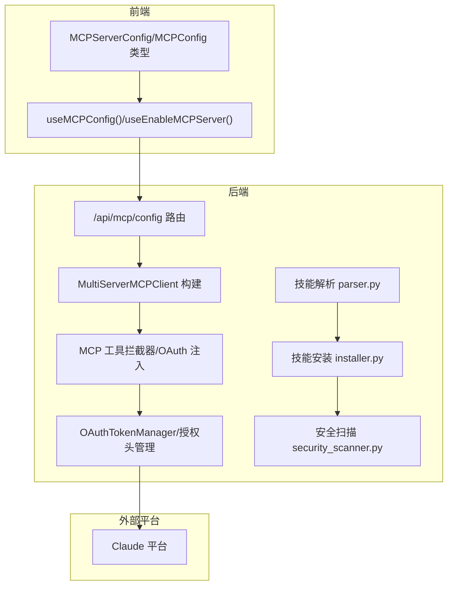
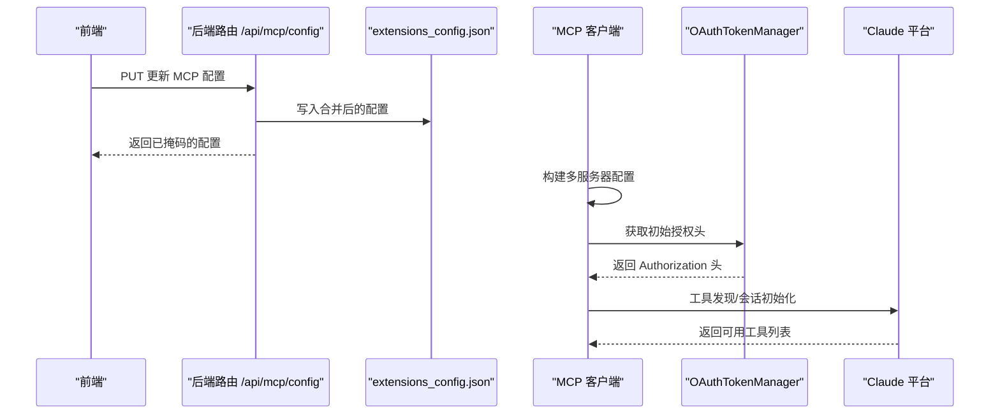
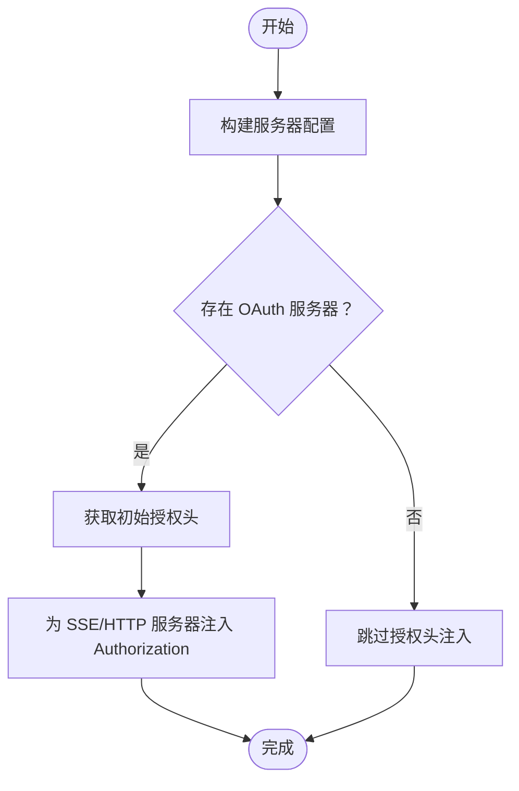
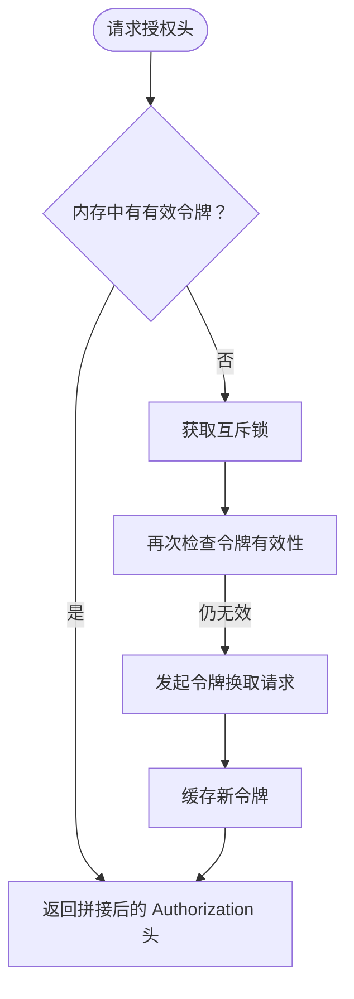
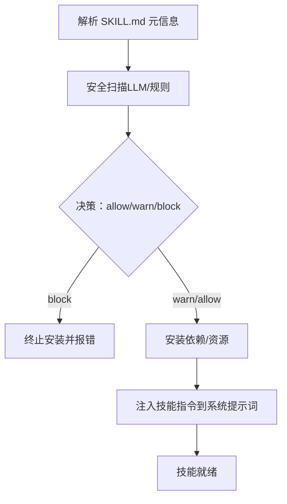
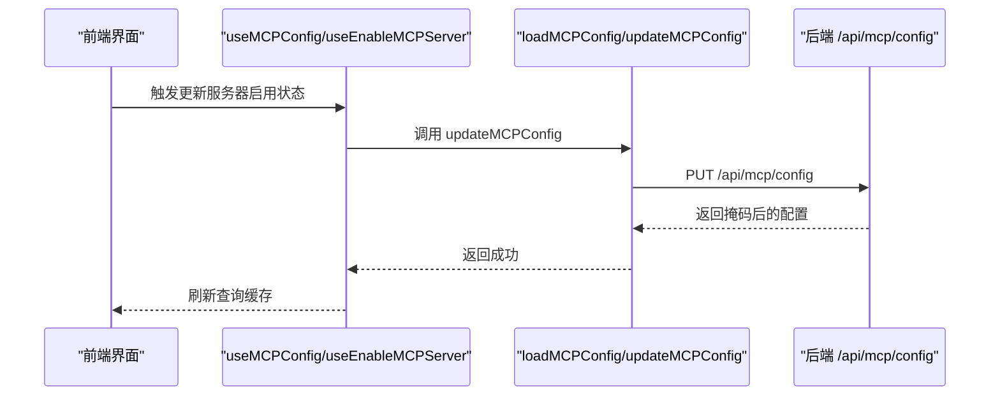
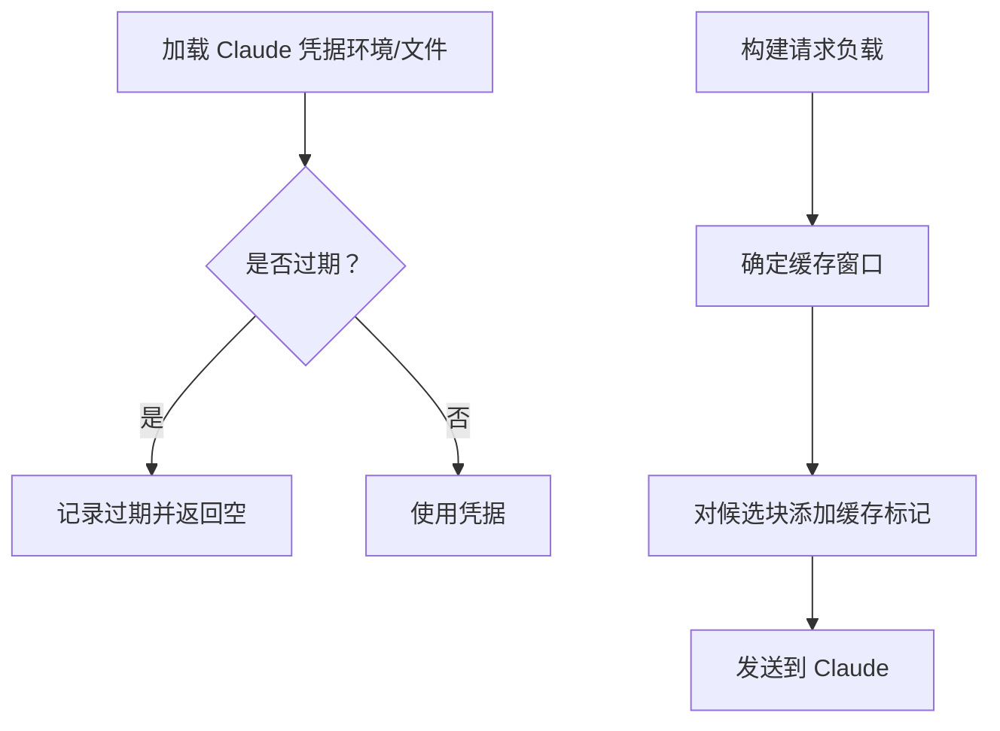
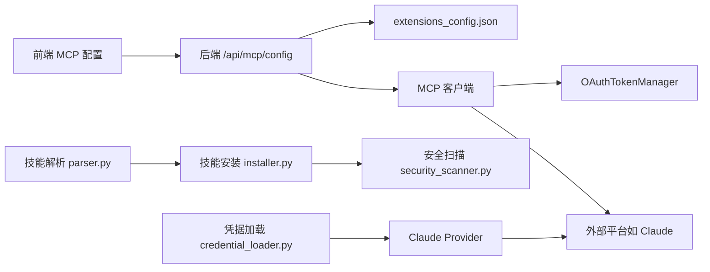

# 集成技能

<cite>
**本文引用的文件**
- [backend/CLAUDE.md](file://backend/CLAUDE.md)
- [skills/public/claude-to-deerflow/SKILL.md](file://skills/public/claude-to-deerflow/SKILL.md)
- [skills/public/claude-to-deerflow/scripts/chat.sh](file://skills/public/claude-to-deerflow/scripts/chat.sh)
- [skills/public/claude-to-deerflow/scripts/status.sh](file://skills/public/claude-to-deerflow/scripts/status.sh)
- [backend/packages/harness/deerflow/mcp/client.py](file://backend/packages/harness/deerflow/mcp/client.py)
- [backend/packages/harness/deerflow/mcp/oauth.py](file://backend/packages/harness/deerflow/mcp/oauth.py)
- [backend/packages/harness/deerflow/mcp/tools.py](file://backend/packages/harness/deerflow/mcp/tools.py)
- [backend/app/gateway/routers/mcp.py](file://backend/app/gateway/routers/mcp.py)
- [backend/packages/harness/deerflow/skills/parser.py](file://backend/packages/harness/deerflow/skills/parser.py)
- [backend/packages/harness/deerflow/skills/installer.py](file://backend/packages/harness/deerflow/skills/installer.py)
- [backend/packages/harness/deerflow/skills/security_scanner.py](file://backend/packages/harness/deerflow/skills/security_scanner.py)
- [backend/packages/harness/deerflow/models/credential_loader.py](file://backend/packages/harness/deerflow/models/credential_loader.py)
- [backend/packages/harness/deerflow/models/claude_provider.py](file://backend/packages/harness/deerflow/models/claude_provider.py)
- [frontend/src/core/mcp/api.ts](file://frontend/src/core/mcp/api.ts)
- [frontend/src/core/mcp/hooks.ts](file://frontend/src/core/mcp/hooks.ts)
- [frontend/src/core/mcp/types.ts](file://frontend/src/core/mcp/types.ts)
- [frontend/src/content/en/harness/skills.mdx](file://frontend/src/content/en/harness/skills.mdx)
- [backend/tests/test_mcp_oauth.py](file://backend/tests/test_mcp_oauth.py)
- [backend/tests/test_skills_parser.py](file://backend/tests/test_skills_parser.py)
- [backend/tests/test_skills_custom_router.py](file://backend/tests/test_skills_custom_router.py)
- [backend/tests/test_tool_error_handling_middleware.py](file://backend/tests/test_tool_error_handling_middleware.py)
</cite>

## 目录
1. [简介](#简介)
2. [项目结构](#项目结构)
3. [核心组件](#核心组件)
4. [架构总览](#架构总览)
5. [详细组件分析](#详细组件分析)
6. [依赖关系分析](#依赖关系分析)
7. [性能考量](#性能考量)
8. [故障排除指南](#故障排除指南)
9. [结论](#结论)
10. [附录](#附录)

## 简介
本技术文档聚焦于 DeerFlow 集成技能中的“Claude 到 DeerFlow”能力，系统阐述其如何作为 MCP（Model Context Protocol）工具链的一部分，实现与 Claude 平台的连接与数据交换，并提供从安装、配置到运行时安全与错误处理的完整指南。文档同时覆盖前端配置入口、后端路由与客户端工具的协作流程，以及与其它平台的兼容性与迁移注意事项。

## 项目结构
围绕“Claude 到 DeerFlow”的集成，涉及以下关键目录与文件：
- 技能目录：skills/public/claude-to-deerflow，包含技能元数据与脚本
- 后端 MCP 客户端与 OAuth 管理：packages/harness/deerflow/mcp/*
- 后端 MCP 路由：app/gateway/routers/mcp.py
- 技能解析与安装管线：packages/harness/deerflow/skills/*
- 前端 MCP 配置接口：frontend/src/core/mcp/*
- 测试用例：backend/tests/*（OAuth、技能解析、工具错误处理等）

图表来源
- [frontend/src/core/mcp/api.ts:1-20](file://frontend/src/core/mcp/api.ts#L1-L20)
- [frontend/src/core/mcp/hooks.ts:1-44](file://frontend/src/core/mcp/hooks.ts#L1-L44)
- [frontend/src/core/mcp/types.ts:1-8](file://frontend/src/core/mcp/types.ts#L1-L8)
- [backend/app/gateway/routers/mcp.py:239-288](file://backend/app/gateway/routers/mcp.py#L239-L288)
- [backend/packages/harness/deerflow/mcp/client.py:45-68](file://backend/packages/harness/deerflow/mcp/client.py#L45-L68)
- [backend/packages/harness/deerflow/mcp/tools.py:197-218](file://backend/packages/harness/deerflow/mcp/tools.py#L197-L218)
- [backend/packages/harness/deerflow/mcp/oauth.py:44-150](file://backend/packages/harness/deerflow/mcp/oauth.py#L44-L150)
- [backend/packages/harness/deerflow/skills/parser.py:44-84](file://backend/packages/harness/deerflow/skills/parser.py#L44-L84)
- [backend/packages/harness/deerflow/skills/installer.py:160-184](file://backend/packages/harness/deerflow/skills/installer.py#L160-L184)
- [backend/packages/harness/deerflow/skills/security_scanner.py:82-109](file://backend/packages/harness/deerflow/skills/security_scanner.py#L82-L109)

章节来源
- [backend/CLAUDE.md:18-278](file://backend/CLAUDE.md#L18-L278)

## 核心组件
- MCP 多服务器客户端与工具注入：负责根据扩展配置构建多服务器连接，并在初始化阶段注入 OAuth 授权头，确保后续工具调用具备认证上下文。
- OAuth 令牌管理：统一管理各 MCP 服务器的 OAuth 凭据，支持并发刷新、过期检测与缓存，避免重复请求与未授权访问。
- 技能系统：从 SKILL.md 解析元信息，执行安全扫描与依赖安装，最终将技能指令注入到代理提示词中，形成可调用的工作流。
- 前端 MCP 配置：通过 /api/mcp/config 获取与更新 MCP 服务器配置，支持启用/禁用服务器并持久化到 extensions_config.json。

章节来源
- [backend/packages/harness/deerflow/mcp/client.py:45-68](file://backend/packages/harness/deerflow/mcp/client.py#L45-L68)
- [backend/packages/harness/deerflow/mcp/oauth.py:44-150](file://backend/packages/harness/deerflow/mcp/oauth.py#L44-L150)
- [backend/packages/harness/deerflow/mcp/tools.py:197-218](file://backend/packages/harness/deerflow/mcp/tools.py#L197-L218)
- [backend/packages/harness/deerflow/skills/parser.py:44-84](file://backend/packages/harness/deerflow/skills/parser.py#L44-L84)
- [backend/packages/harness/deerflow/skills/installer.py:160-184](file://backend/packages/harness/deerflow/skills/installer.py#L160-L184)
- [backend/packages/harness/deerflow/skills/security_scanner.py:82-109](file://backend/packages/harness/deerflow/skills/security_scanner.py#L82-L109)
- [frontend/src/core/mcp/api.ts:1-20](file://frontend/src/core/mcp/api.ts#L1-L20)
- [frontend/src/core/mcp/hooks.ts:1-44](file://frontend/src/core/mcp/hooks.ts#L1-L44)
- [frontend/src/core/mcp/types.ts:1-8](file://frontend/src/core/mcp/types.ts#L1-L8)

## 架构总览
下图展示“Claude 到 DeerFlow”集成的关键交互路径：前端通过 API 更新 MCP 配置，后端路由写回配置文件并重载；MCP 客户端按配置建立连接并在工具发现与会话初始化阶段注入 OAuth 授权头；Claude 平台作为外部服务接收请求并返回结果。

图表来源
- [backend/app/gateway/routers/mcp.py:239-288](file://backend/app/gateway/routers/mcp.py#L239-L288)
- [backend/packages/harness/deerflow/mcp/client.py:45-68](file://backend/packages/harness/deerflow/mcp/client.py#L45-L68)
- [backend/packages/harness/deerflow/mcp/oauth.py:44-150](file://backend/packages/harness/deerflow/mcp/oauth.py#L44-L150)
- [backend/packages/harness/deerflow/mcp/tools.py:197-218](file://backend/packages/harness/deerflow/mcp/tools.py#L197-L218)

## 详细组件分析

### 组件 A：MCP 客户端与工具注入
- 功能要点
  - 依据扩展配置生成多服务器参数，记录日志并捕获异常。
  - 在工具发现与会话初始化阶段，从 OAuth 管理器获取授权头并注入到 HTTP 头部中。
- 关键行为
  - 对 SSE/HTTP 传输类型自动注入 Authorization 头，保证后续工具调用具备认证。
  - 若无 OAuth 服务器则跳过注入，保持向后兼容。

图表来源
- [backend/packages/harness/deerflow/mcp/client.py:45-68](file://backend/packages/harness/deerflow/mcp/client.py#L45-L68)
- [backend/packages/harness/deerflow/mcp/tools.py:197-218](file://backend/packages/harness/deerflow/mcp/tools.py#L197-L218)
- [backend/packages/harness/deerflow/mcp/oauth.py:44-150](file://backend/packages/harness/deerflow/mcp/oauth.py#L44-L150)

章节来源
- [backend/packages/harness/deerflow/mcp/client.py:45-68](file://backend/packages/harness/deerflow/mcp/client.py#L45-L68)
- [backend/packages/harness/deerflow/mcp/tools.py:197-218](file://backend/packages/harness/deerflow/mcp/tools.py#L197-L218)
- [backend/packages/harness/deerflow/mcp/oauth.py:44-150](file://backend/packages/harness/deerflow/mcp/oauth.py#L44-L150)

### 组件 B：OAuth 令牌管理
- 功能要点
  - 支持并发获取与刷新令牌，内置过期判断与刷新偏移时间控制。
  - 提供一次性注入初始授权头的能力，用于工具发现与会话初始化。
- 关键行为
  - 使用锁保护并发刷新，避免重复请求。
  - 过期判定基于当前时间与配置的刷新偏移秒数比较。

图表来源
- [backend/packages/harness/deerflow/mcp/oauth.py:44-150](file://backend/packages/harness/deerflow/mcp/oauth.py#L44-L150)

章节来源
- [backend/packages/harness/deerflow/mcp/oauth.py:44-150](file://backend/packages/harness/deerflow/mcp/oauth.py#L44-L150)
- [backend/tests/test_mcp_oauth.py:1-191](file://backend/tests/test_mcp_oauth.py#L1-L191)

### 组件 C：技能系统（解析、安装、安全扫描）
- 功能要点
  - 解析 SKILL.md 中的 YAML front-matter，提取名称、描述、分类等元信息。
  - 安装阶段对文本与脚本内容进行安全扫描，拒绝不合规或不可信内容。
  - 将技能指令注入代理系统提示词，使代理在对话期间可调用该技能工作流。
- 关键行为
  - 安全扫描失败时抛出异常，阻止加载；允许 warn/allow 但 block 必须终止。
  - 支持对归档技能包进行批量扫描与安装。

图表来源
- [backend/packages/harness/deerflow/skills/parser.py:44-84](file://backend/packages/harness/deerflow/skills/parser.py#L44-L84)
- [backend/packages/harness/deerflow/skills/installer.py:160-184](file://backend/packages/harness/deerflow/skills/installer.py#L160-L184)
- [backend/packages/harness/deerflow/skills/security_scanner.py:82-109](file://backend/packages/harness/deerflow/skills/security_scanner.py#L82-L109)
- [frontend/src/content/en/harness/skills.mdx:82-110](file://frontend/src/content/en/harness/skills.mdx#L82-L110)

章节来源
- [backend/packages/harness/deerflow/skills/parser.py:44-84](file://backend/packages/harness/deerflow/skills/parser.py#L44-L84)
- [backend/packages/harness/deerflow/skills/installer.py:160-184](file://backend/packages/harness/deerflow/skills/installer.py#L160-L184)
- [backend/packages/harness/deerflow/skills/security_scanner.py:82-109](file://backend/packages/harness/deerflow/skills/security_scanner.py#L82-L109)
- [frontend/src/content/en/harness/skills.mdx:82-110](file://frontend/src/content/en/harness/skills.mdx#L82-L110)
- [backend/tests/test_skills_parser.py:36-61](file://backend/tests/test_skills_parser.py#L36-L61)
- [backend/tests/test_skills_custom_router.py:69-87](file://backend/tests/test_skills_custom_router.py#L69-L87)

### 组件 D：前端 MCP 配置与更新
- 功能要点
  - 提供加载与更新 MCP 配置的 API 封装，支持启用/禁用服务器。
  - 使用 React Query 管理查询状态与缓存失效。
- 关键行为
  - PUT 请求将变更写入后端路由，后端保存至 extensions_config.json 并重载全局配置。

图表来源
- [frontend/src/core/mcp/api.ts:1-20](file://frontend/src/core/mcp/api.ts#L1-L20)
- [frontend/src/core/mcp/hooks.ts:1-44](file://frontend/src/core/mcp/hooks.ts#L1-L44)
- [frontend/src/core/mcp/types.ts:1-8](file://frontend/src/core/mcp/types.ts#L1-L8)
- [backend/app/gateway/routers/mcp.py:239-288](file://backend/app/gateway/routers/mcp.py#L239-L288)

章节来源
- [frontend/src/core/mcp/api.ts:1-20](file://frontend/src/core/mcp/api.ts#L1-L20)
- [frontend/src/core/mcp/hooks.ts:1-44](file://frontend/src/core/mcp/hooks.ts#L1-L44)
- [frontend/src/core/mcp/types.ts:1-8](file://frontend/src/core/mcp/types.ts#L1-L8)
- [backend/app/gateway/routers/mcp.py:239-288](file://backend/app/gateway/routers/mcp.py#L239-L288)

### 组件 E：Claude 凭据加载与提示缓存
- 功能要点
  - 从环境变量或本地凭据文件加载 Claude Code OAuth 凭据，支持过期检测与警告。
  - Claude Provider 对系统消息与最近消息块应用提示缓存标记，提升成本与延迟效率。
- 关键行为
  - 加载顺序优先级明确，支持直接令牌与文件描述符两种方式。
  - 缓存窗口基于最近消息数量与工具定义，仅对候选块添加缓存控制。

图表来源
- [backend/packages/harness/deerflow/models/credential_loader.py:135-174](file://backend/packages/harness/deerflow/models/credential_loader.py#L135-L174)
- [backend/packages/harness/deerflow/models/claude_provider.py:223-248](file://backend/packages/harness/deerflow/models/claude_provider.py#L223-L248)

章节来源
- [backend/packages/harness/deerflow/models/credential_loader.py:135-174](file://backend/packages/harness/deerflow/models/credential_loader.py#L135-L174)
- [backend/packages/harness/deerflow/models/claude_provider.py:223-248](file://backend/packages/harness/deerflow/models/claude_provider.py#L223-L248)

## 依赖关系分析
- 前端依赖后端提供的 MCP 配置 API，后端路由负责持久化与重载。
- MCP 客户端依赖 OAuth 管理器以获得授权头，再与外部平台通信。
- 技能系统依赖解析器、安装器与安全扫描器，形成闭环的安全加载链路。
- Claude 凭据加载与提示缓存分别服务于外部平台接入与成本优化。

图表来源
- [frontend/src/core/mcp/api.ts:1-20](file://frontend/src/core/mcp/api.ts#L1-L20)
- [backend/app/gateway/routers/mcp.py:239-288](file://backend/app/gateway/routers/mcp.py#L239-L288)
- [backend/packages/harness/deerflow/mcp/client.py:45-68](file://backend/packages/harness/deerflow/mcp/client.py#L45-L68)
- [backend/packages/harness/deerflow/mcp/oauth.py:44-150](file://backend/packages/harness/deerflow/mcp/oauth.py#L44-L150)
- [backend/packages/harness/deerflow/skills/parser.py:44-84](file://backend/packages/harness/deerflow/skills/parser.py#L44-L84)
- [backend/packages/harness/deerflow/skills/installer.py:160-184](file://backend/packages/harness/deerflow/skills/installer.py#L160-L184)
- [backend/packages/harness/deerflow/skills/security_scanner.py:82-109](file://backend/packages/harness/deerflow/skills/security_scanner.py#L82-L109)
- [backend/packages/harness/deerflow/models/credential_loader.py:135-174](file://backend/packages/harness/deerflow/models/credential_loader.py#L135-L174)
- [backend/packages/harness/deerflow/models/claude_provider.py:223-248](file://backend/packages/harness/deerflow/models/claude_provider.py#L223-L248)

## 性能考量
- OAuth 刷新去重：通过互斥锁与过期阈值减少重复请求，降低外部平台限流风险。
- 提示缓存：仅对最近候选块添加缓存标记，避免超限并降低 token 成本。
- 技能扫描：在安装阶段集中执行，避免运行时重复扫描带来的开销。
- 前端缓存：React Query 自动缓存配置读取，减少不必要的网络往返。

## 故障排除指南
- OAuth 授权失败
  - 检查 OAuth 配置与令牌换取 URL 是否正确，确认 grant_type、client_id、client_secret 等参数。
  - 查看并发刷新是否被阻塞（锁竞争），必要时调整刷新偏移秒数。
- 工具调用异常
  - 使用工具错误处理中间件捕获异常并返回标准化的工具消息，便于前端展示与定位。
  - 若出现超时或网络中断，确认外部平台可用性与网络连通性。
- 技能安装被阻断
  - 安全扫描返回 block 时，需修正内容或联系管理员进行人工复核。
  - 确认技能归档完整性与权限设置，避免因文件缺失导致安装失败。
- 前端配置未生效
  - 确认 /api/mcp/config 的 PUT 请求返回成功，并触发查询缓存失效。
  - 检查 extensions_config.json 是否被正确写入且无语法错误。

章节来源
- [backend/tests/test_mcp_oauth.py:1-191](file://backend/tests/test_mcp_oauth.py#L1-L191)
- [backend/tests/test_tool_error_handling_middleware.py:163-208](file://backend/tests/test_tool_error_handling_middleware.py#L163-L208)
- [backend/packages/harness/deerflow/skills/security_scanner.py:82-109](file://backend/packages/harness/deerflow/skills/security_scanner.py#L82-L109)
- [backend/app/gateway/routers/mcp.py:239-288](file://backend/app/gateway/routers/mcp.py#L239-L288)

## 结论
“Claude 到 DeerFlow”集成通过 MCP 工具链实现了与 Claude 平台的稳定连接，结合 OAuth 自动刷新、技能系统的安全加载与前端配置入口，形成了从安装、配置到运行的完整闭环。遵循本文的安全与错误处理策略，可在保障稳定性的同时最大化性能收益。

## 附录

### 集成配置指南（步骤与要点）
- 设置 API 密钥与凭据
  - 通过环境变量或本地凭据文件加载 Claude Code OAuth 凭据，确保未过期。
  - 若使用 MCP 服务器，配置对应的 OAuth 参数（令牌 URL、grant_type、client_id、client_secret）。
- 数据格式与同步
  - MCP 工具发现与会话初始化阶段自动注入 Authorization 头，无需手动拼接。
  - 技能安装与更新通过后端路由写入 extensions_config.json 并重载，前端即时生效。
- 安全与错误处理
  - OAuth 刷新采用并发安全策略；工具调用异常统一包装为工具消息。
  - 技能安装前执行安全扫描，block 决策将终止安装并记录原因。
- 兼容性与迁移
  - 保持 MCP 服务器配置字段与现有约定一致；迁移时注意保留 $VAR 占位符与顶层键。
  - 技能元信息遵循 SKILL.md front-matter 规范，确保解析与注入正常。

章节来源
- [backend/packages/harness/deerflow/models/credential_loader.py:135-174](file://backend/packages/harness/deerflow/models/credential_loader.py#L135-L174)
- [backend/packages/harness/deerflow/mcp/oauth.py:44-150](file://backend/packages/harness/deerflow/mcp/oauth.py#L44-L150)
- [backend/packages/harness/deerflow/mcp/tools.py:197-218](file://backend/packages/harness/deerflow/mcp/tools.py#L197-L218)
- [backend/app/gateway/routers/mcp.py:239-288](file://backend/app/gateway/routers/mcp.py#L239-L288)
- [backend/packages/harness/deerflow/skills/security_scanner.py:82-109](file://backend/packages/harness/deerflow/skills/security_scanner.py#L82-L109)
- [frontend/src/content/en/harness/skills.mdx:82-110](file://frontend/src/content/en/harness/skills.mdx#L82-L110)