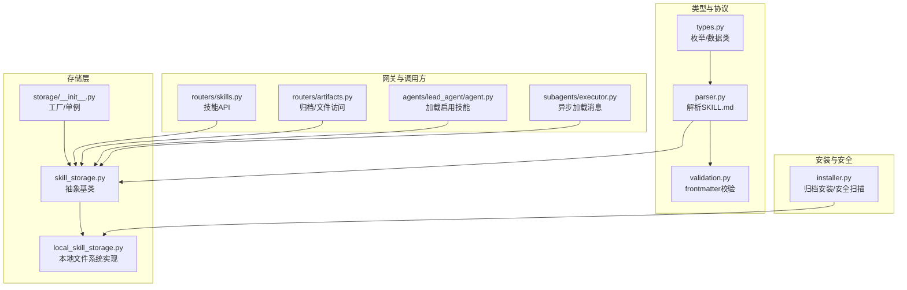
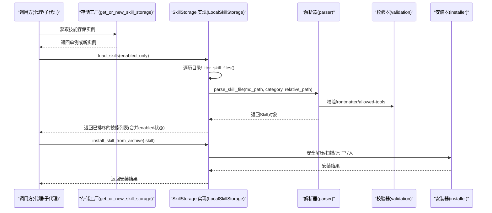
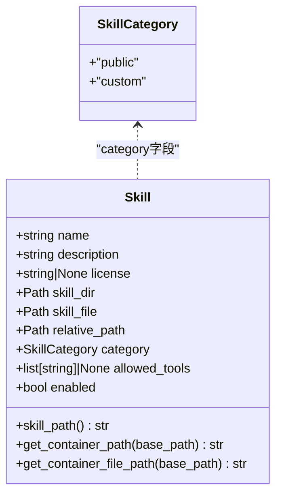
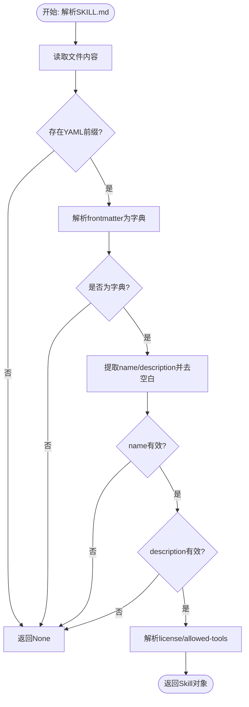
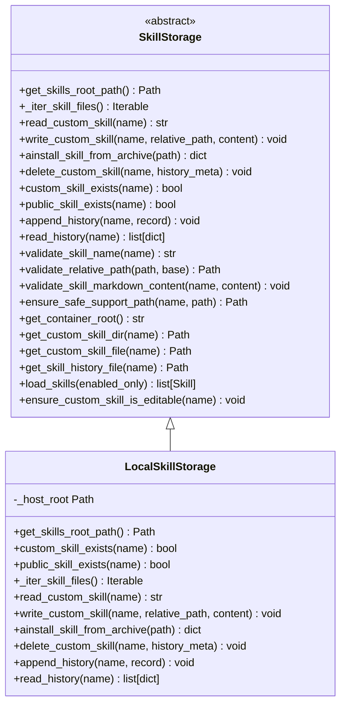
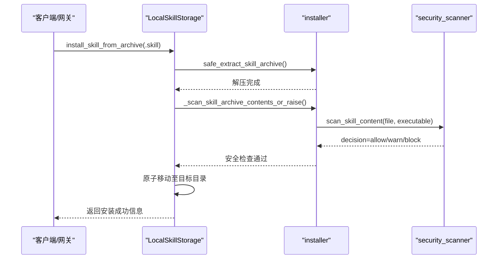
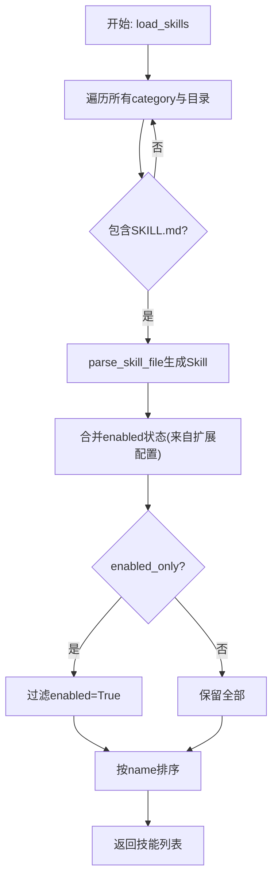
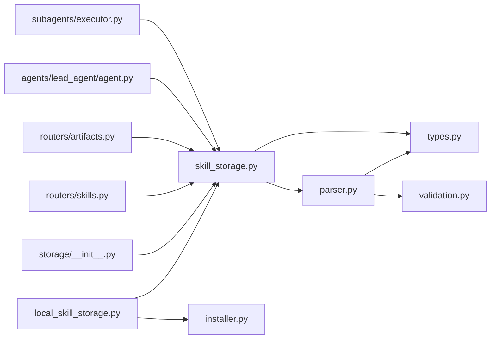

# 技能加载机制

<cite>
**本文引用的文件**
- [backend/packages/harness/deerflow/skills/__init__.py](file://backend/packages/harness/deerflow/skills/__init__.py)
- [backend/packages/harness/deerflow/skills/types.py](file://backend/packages/harness/deerflow/skills/types.py)
- [backend/packages/harness/deerflow/skills/parser.py](file://backend/packages/harness/deerflow/skills/parser.py)
- [backend/packages/harness/deerflow/skills/validation.py](file://backend/packages/harness/deerflow/skills/validation.py)
- [backend/packages/harness/deerflow/skills/storage/__init__.py](file://backend/packages/harness/deerflow/skills/storage/__init__.py)
- [backend/packages/harness/deerflow/skills/storage/skill_storage.py](file://backend/packages/harness/deerflow/skills/storage/skill_storage.py)
- [backend/packages/harness/deerflow/skills/storage/local_skill_storage.py](file://backend/packages/harness/deerflow/skills/storage/local_skill_storage.py)
- [backend/packages/harness/deerflow/skills/installer.py](file://backend/packages/harness/deerflow/skills/installer.py)
- [backend/app/gateway/routers/skills.py](file://backend/app/gateway/routers/skills.py)
- [backend/app/gateway/routers/artifacts.py](file://backend/app/gateway/routers/artifacts.py)
- [backend/packages/harness/deerflow/agents/lead_agent/agent.py](file://backend/packages/harness/deerflow/agents/lead_agent/agent.py)
- [backend/packages/harness/deerflow/subagents/executor.py](file://backend/packages/harness/deerflow/subagents/executor.py)
- [backend/tests/blocking_io/test_skills_load.py](file://backend/tests/blocking_io/test_skills_load.py)
</cite>

## 目录
1. [引言](#引言)
2. [项目结构](#项目结构)
3. [核心组件](#核心组件)
4. [架构总览](#架构总览)
5. [详细组件分析](#详细组件分析)
6. [依赖分析](#依赖分析)
7. [性能考虑](#性能考虑)
8. [故障排查指南](#故障排查指南)
9. [结论](#结论)
10. [附录：自定义技能存储后端实现指引](#附录自定义技能存储后端实现指引)

## 引言
本文件面向 DeerFlow 的“技能加载机制”，系统性阐述技能存储架构、本地存储实现、技能发现与解析流程、元数据提取与校验、技能注册与启用策略，并提供可扩展的自定义存储后端（如 SQLite、文件系统、远程存储）实现思路。同时给出缓存策略、加载性能优化建议以及错误处理机制，帮助开发者在不破坏现有协议的前提下安全地扩展与集成。

## 项目结构
技能加载相关代码主要位于后端 harness 包下的 skills 子模块，围绕以下层次组织：
- 类型与常量：定义技能枚举、数据结构与文件名常量
- 解析与校验：从 SKILL.md 提取元数据、校验 frontmatter 合法性
- 存储抽象与实现：抽象基类定义统一接口，本地文件系统实现具体 IO
- 安装器：从 .skill 归档安装技能，执行安全扫描与原子写入
- 网关路由：对外暴露技能管理与内容访问接口
- 调用方：代理与子代理在运行时按需加载技能

图表来源
- [backend/packages/harness/deerflow/skills/types.py:1-69](file://backend/packages/harness/deerflow/skills/types.py#L1-L69)
- [backend/packages/harness/deerflow/skills/parser.py:1-111](file://backend/packages/harness/deerflow/skills/parser.py#L1-L111)
- [backend/packages/harness/deerflow/skills/validation.py:1-94](file://backend/packages/harness/deerflow/skills/validation.py#L1-L94)
- [backend/packages/harness/deerflow/skills/storage/skill_storage.py:1-255](file://backend/packages/harness/deerflow/skills/storage/skill_storage.py#L1-L255)
- [backend/packages/harness/deerflow/skills/storage/local_skill_storage.py:1-198](file://backend/packages/harness/deerflow/skills/storage/local_skill_storage.py#L1-L198)
- [backend/packages/harness/deerflow/skills/storage/__init__.py:1-84](file://backend/packages/harness/deerflow/skills/storage/__init__.py#L1-L84)
- [backend/packages/harness/deerflow/skills/installer.py:1-207](file://backend/packages/harness/deerflow/skills/installer.py#L1-L207)
- [backend/app/gateway/routers/skills.py:61-66](file://backend/app/gateway/routers/skills.py#L61-L66)
- [backend/app/gateway/routers/artifacts.py:70-143](file://backend/app/gateway/routers/artifacts.py#L70-L143)
- [backend/packages/harness/deerflow/agents/lead_agent/agent.py:363-363](file://backend/packages/harness/deerflow/agents/lead_agent/agent.py#L363-L363)
- [backend/packages/harness/deerflow/subagents/executor.py:343-374](file://backend/packages/harness/deerflow/subagents/executor.py#L343-L374)

章节来源
- [backend/packages/harness/deerflow/skills/__init__.py:1-18](file://backend/packages/harness/deerflow/skills/__init__.py#L1-L18)

## 核心组件
- 技能类型与分类：通过枚举区分内置与自定义技能，使用数据类承载元数据与容器路径映射
- 解析器：从 SKILL.md 中抽取 YAML frontmatter，校验必填字段与命名规范，支持可选的 allowed-tools 列表
- 校验器：对 frontmatter 字段进行更严格的合法性检查，确保名称、描述、长度与格式符合约束
- 存储抽象：定义统一的技能发现、读写、安装、删除、历史记录等操作接口
- 本地存储实现：基于文件系统的具体实现，遵循 skills/public 与 skills/custom 目录布局
- 安装器：负责 .skill 归档的安全解压、内容扫描、原子移动与权限设置
- 工厂与单例：根据配置动态解析并返回技能存储实例，支持进程级单例与按请求覆盖

章节来源
- [backend/packages/harness/deerflow/skills/types.py:8-69](file://backend/packages/harness/deerflow/skills/types.py#L8-L69)
- [backend/packages/harness/deerflow/skills/parser.py:35-111](file://backend/packages/harness/deerflow/skills/parser.py#L35-L111)
- [backend/packages/harness/deerflow/skills/validation.py:18-94](file://backend/packages/harness/deerflow/skills/validation.py#L18-L94)
- [backend/packages/harness/deerflow/skills/storage/skill_storage.py:18-255](file://backend/packages/harness/deerflow/skills/storage/skill_storage.py#L18-L255)
- [backend/packages/harness/deerflow/skills/storage/local_skill_storage.py:25-198](file://backend/packages/harness/deerflow/skills/storage/local_skill_storage.py#L25-L198)
- [backend/packages/harness/deerflow/skills/installer.py:25-207](file://backend/packages/harness/deerflow/skills/installer.py#L25-L207)
- [backend/packages/harness/deerflow/skills/storage/__init__.py:15-84](file://backend/packages/harness/deerflow/skills/storage/__init__.py#L15-L84)

## 架构总览
技能加载采用“抽象接口 + 具体实现 + 协议校验 + 安全扫描”的分层设计。调用方通过统一的 SkillStorage 接口发现、读取、安装与管理技能；解析器与校验器保证元数据一致性与安全性；安装器在写入前进行严格的安全扫描与归档校验；工厂负责按配置选择后端并复用单例以降低开销。

图表来源
- [backend/packages/harness/deerflow/skills/storage/__init__.py:15-84](file://backend/packages/harness/deerflow/skills/storage/__init__.py#L15-L84)
- [backend/packages/harness/deerflow/skills/storage/skill_storage.py:212-246](file://backend/packages/harness/deerflow/skills/storage/skill_storage.py#L212-L246)
- [backend/packages/harness/deerflow/skills/parser.py:35-111](file://backend/packages/harness/deerflow/skills/parser.py#L35-L111)
- [backend/packages/harness/deerflow/skills/validation.py:18-94](file://backend/packages/harness/deerflow/skills/validation.py#L18-L94)
- [backend/packages/harness/deerflow/skills/installer.py:96-157](file://backend/packages/harness/deerflow/skills/installer.py#L96-L157)

## 详细组件分析

### 组件一：技能类型与协议
- SkillCategory：区分 public 与 custom 两类来源
- Skill 数据类：封装 name/description/license/allowed_tools/relative_path/category/enabled 等字段，并提供容器内路径计算
- 常量 SKILL_MD_FILE：统一文件名约定

图表来源
- [backend/packages/harness/deerflow/skills/types.py:8-69](file://backend/packages/harness/deerflow/skills/types.py#L8-L69)

章节来源
- [backend/packages/harness/deerflow/skills/types.py:1-69](file://backend/packages/harness/deerflow/skills/types.py#L1-L69)

### 组件二：技能解析与元数据提取
- parse_skill_file：读取 SKILL.md，抽取 YAML frontmatter，校验 name/description 必填项，标准化空白字符，解析可选的 allowed-tools
- parse_allowed_tools：校验 allowed-tools 是否为字符串列表且非空条目合法
- validation 模块：对 frontmatter 进行更全面的合法性检查（键名白名单、长度限制、命名规范等）

图表来源
- [backend/packages/harness/deerflow/skills/parser.py:35-111](file://backend/packages/harness/deerflow/skills/parser.py#L35-L111)
- [backend/packages/harness/deerflow/skills/validation.py:18-94](file://backend/packages/harness/deerflow/skills/validation.py#L18-L94)

章节来源
- [backend/packages/harness/deerflow/skills/parser.py:12-111](file://backend/packages/harness/deerflow/skills/parser.py#L12-L111)
- [backend/packages/harness/deerflow/skills/validation.py:14-94](file://backend/packages/harness/deerflow/skills/validation.py#L14-L94)

### 组件三：存储抽象与本地实现
- SkillStorage 抽象类：
  - 静态工具：校验技能名、相对路径、SKILL.md 内容一致性、支持文件路径安全校验
  - 抽象方法：宿主根路径、遍历技能文件、读写自定义技能、安装归档、删除、历史记录
  - 模板方法：load_skills 合并 enabled 状态、过滤与排序
- LocalSkillStorage 本地实现：
  - 目录布局：skills/public 与 skills/custom
  - 发现逻辑：递归遍历 category 目录，仅匹配包含 SKILL.md 的目录
  - 安全写入：临时文件 + replace 原子替换，写后设置沙箱可读权限
  - 安装流程：校验 .skill 扩展名与 ZIP 合法性，安全解压，扫描，原子移动到目标目录
  - 历史记录：JSONL 追加时间戳与元信息

图表来源
- [backend/packages/harness/deerflow/skills/storage/skill_storage.py:18-255](file://backend/packages/harness/deerflow/skills/storage/skill_storage.py#L18-L255)
- [backend/packages/harness/deerflow/skills/storage/local_skill_storage.py:25-198](file://backend/packages/harness/deerflow/skills/storage/local_skill_storage.py#L25-L198)

章节来源
- [backend/packages/harness/deerflow/skills/storage/skill_storage.py:18-255](file://backend/packages/harness/deerflow/skills/storage/skill_storage.py#L18-L255)
- [backend/packages/harness/deerflow/skills/storage/local_skill_storage.py:25-198](file://backend/packages/harness/deerflow/skills/storage/local_skill_storage.py#L25-L198)

### 组件四：技能安装与安全扫描
- 安全解压：拒绝绝对路径、目录穿越、符号链接；限制总解压大小
- 内容扫描：对 SKILL.md 与脚本/提示输入类支持文件进行扫描，阻断高风险内容
- 原子写入：使用临时目录与移动操作，失败回滚
- 错误处理：针对重复安装、权限只读、归档非法等情况抛出明确异常

图表来源
- [backend/packages/harness/deerflow/skills/storage/local_skill_storage.py:96-157](file://backend/packages/harness/deerflow/skills/storage/local_skill_storage.py#L96-L157)
- [backend/packages/harness/deerflow/skills/installer.py:81-195](file://backend/packages/harness/deerflow/skills/installer.py#L81-L195)

章节来源
- [backend/packages/harness/deerflow/skills/installer.py:25-207](file://backend/packages/harness/deerflow/skills/installer.py#L25-L207)

### 组件五：技能发现与注册流程
- 发现：遍历 skills/public 与 skills/custom 下所有包含 SKILL.md 的目录
- 解析：对每个 SKILL.md 调用解析器生成 Skill 对象
- 启用：从扩展配置读取启用状态，合并到 Skill.enabled
- 排序：按名称排序输出
- 调用方：代理与子代理在运行时按需加载技能，支持仅启用技能过滤

图表来源
- [backend/packages/harness/deerflow/skills/storage/skill_storage.py:212-246](file://backend/packages/harness/deerflow/skills/storage/skill_storage.py#L212-L246)
- [backend/packages/harness/deerflow/agents/lead_agent/agent.py:363-363](file://backend/packages/harness/deerflow/agents/lead_agent/agent.py#L363-L363)
- [backend/packages/harness/deerflow/subagents/executor.py:343-374](file://backend/packages/harness/deerflow/subagents/executor.py#L343-L374)

章节来源
- [backend/packages/harness/deerflow/skills/storage/skill_storage.py:212-246](file://backend/packages/harness/deerflow/skills/storage/skill_storage.py#L212-L246)
- [backend/packages/harness/deerflow/agents/lead_agent/agent.py:363-363](file://backend/packages/harness/deerflow/agents/lead_agent/agent.py#L363-L363)
- [backend/packages/harness/deerflow/subagents/executor.py:343-374](file://backend/packages/harness/deerflow/subagents/executor.py#L343-L374)

## 依赖分析
- 组件耦合
  - SkillStorage 与 LocalSkillStorage：继承关系，后者实现具体 IO
  - Parser 与 Validation：被 SkillStorage 的模板方法调用，形成“协议校验”闭环
  - Installer：被 LocalSkillStorage 的安装流程调用，负责安全与原子写入
  - 调用方：agents 与 subagents 通过 SkillStorage 接口间接依赖解析与校验
- 外部依赖
  - 文件系统：本地存储依赖宿主路径与权限
  - ZIP 解压：安装流程依赖标准库 zip 支持
  - YAML 解析：frontmatter 解析依赖
- 循环依赖
  - 未见循环导入；各模块职责清晰，接口边界明确

图表来源
- [backend/packages/harness/deerflow/skills/parser.py:1-111](file://backend/packages/harness/deerflow/skills/parser.py#L1-L111)
- [backend/packages/harness/deerflow/skills/validation.py:1-94](file://backend/packages/harness/deerflow/skills/validation.py#L1-L94)
- [backend/packages/harness/deerflow/skills/storage/skill_storage.py:1-255](file://backend/packages/harness/deerflow/skills/storage/skill_storage.py#L1-L255)
- [backend/packages/harness/deerflow/skills/storage/local_skill_storage.py:1-198](file://backend/packages/harness/deerflow/skills/storage/local_skill_storage.py#L1-L198)
- [backend/packages/harness/deerflow/skills/storage/__init__.py:1-84](file://backend/packages/harness/deerflow/skills/storage/__init__.py#L1-L84)
- [backend/packages/harness/deerflow/skills/installer.py:1-207](file://backend/packages/harness/deerflow/skills/installer.py#L1-L207)
- [backend/app/gateway/routers/skills.py:61-66](file://backend/app/gateway/routers/skills.py#L61-L66)
- [backend/app/gateway/routers/artifacts.py:70-143](file://backend/app/gateway/routers/artifacts.py#L70-L143)
- [backend/packages/harness/deerflow/agents/lead_agent/agent.py:363-363](file://backend/packages/harness/deerflow/agents/lead_agent/agent.py#L363-L363)
- [backend/packages/harness/deerflow/subagents/executor.py:343-374](file://backend/packages/harness/deerflow/subagents/executor.py#L343-L374)

章节来源
- [backend/packages/harness/deerflow/skills/storage/skill_storage.py:1-255](file://backend/packages/harness/deerflow/skills/storage/skill_storage.py#L1-L255)
- [backend/packages/harness/deerflow/skills/storage/local_skill_storage.py:1-198](file://backend/packages/harness/deerflow/skills/storage/local_skill_storage.py#L1-L198)
- [backend/packages/harness/deerflow/skills/installer.py:1-207](file://backend/packages/harness/deerflow/skills/installer.py#L1-L207)

## 性能考虑
- I/O 优化
  - 使用单例存储实例避免重复解析配置与重建连接
  - 本地存储采用 os.walk 并按目录名排序，减少不必要的文件系统查询
- 解析与校验
  - frontmatter 解析与正则匹配在小规模 SKILL.md 上开销极低
  - 将 enabled 状态合并放在内存中进行，避免频繁磁盘读取
- 并发与阻塞
  - 安装流程为同步包装异步，测试用例验证在事件循环中通过线程池执行不会阻塞
- 缓存策略
  - 可在应用层对 load_skills 结果进行短期缓存（如进程内 LRU），结合扩展配置变更触发失效
  - 对于频繁访问的自定义技能内容，可在上层网关或运行时缓存最近修改版本

章节来源
- [backend/packages/harness/deerflow/skills/storage/__init__.py:15-84](file://backend/packages/harness/deerflow/skills/storage/__init__.py#L15-L84)
- [backend/tests/blocking_io/test_skills_load.py:81-81](file://backend/tests/blocking_io/test_skills_load.py#L81-L81)

## 故障排查指南
- 常见问题与定位
  - SKILL.md 缺失或格式错误：解析器会返回 None 或日志报错，确认文件存在且 frontmatter 正确
  - frontmatter 不合法：校验器会报告具体键值问题，修正键名或格式
  - 安装失败
    - 归档非法：扩展名或 ZIP 格式不正确
    - 内容扫描阻断：检查脚本/提示输入文件是否包含高风险内容
    - 目标已存在：重复安装同一技能名
    - 权限只读：历史记录写入失败但继续删除流程
- 日志与告警
  - 解析与校验阶段的日志用于快速定位问题
  - 安装阶段对跳过符号链接与警告性决策进行记录
- 修复建议
  - 优先修正 SKILL.md frontmatter 与命名规范
  - 清理冲突的同名技能或调整安装路径
  - 在只读环境中忽略历史写入失败但仍允许删除

章节来源
- [backend/packages/harness/deerflow/skills/parser.py:108-111](file://backend/packages/harness/deerflow/skills/parser.py#L108-L111)
- [backend/packages/harness/deerflow/skills/validation.py:18-94](file://backend/packages/harness/deerflow/skills/validation.py#L18-L94)
- [backend/packages/harness/deerflow/skills/installer.py:25-207](file://backend/packages/harness/deerflow/skills/installer.py#L25-L207)
- [backend/packages/harness/deerflow/skills/storage/local_skill_storage.py:159-177](file://backend/packages/harness/deerflow/skills/storage/local_skill_storage.py#L159-L177)

## 结论
DeerFlow 的技能加载机制以协议驱动为核心，通过抽象存储接口与严格的解析/校验/安全扫描流程，实现了可扩展、可审计、可维护的技能生态。本地文件系统实现满足大多数场景，而抽象层也为未来接入 SQLite、远程存储等提供了清晰的扩展点。配合合理的缓存与并发策略，可在保证安全性的前提下获得良好的性能表现。

## 附录：自定义技能存储后端实现指引
以下为实现自定义存储后端的步骤与注意事项，便于扩展 SQLite、远程存储等场景：

- 必须实现的抽象方法（参考 SkillStorage）
  - get_skills_root_path：返回宿主根路径
  - _iter_skill_files：遍历所有技能文件，返回 (category, category_root, md_path)
  - read_custom_skill/write_custom_skill/delete_custom_skill：读写与删除自定义技能
  - install_skill_from_archive：从 .skill 归档安装，需执行安全扫描与原子写入
  - append_history/read_history：历史记录的追加与读取
  - custom_skill_exists/public_skill_exists：存在性判断
- 关键校验与安全
  - 使用 validate_skill_name/validate_relative_path/ensure_safe_support_path 确保路径安全
  - 使用 validate_skill_markdown_content 对 SKILL.md 内容进行最小化校验
  - 安装流程必须包含安全扫描与原子写入，失败回滚
- 容器路径映射
  - 使用 get_container_root/get_custom_skill_dir 等辅助方法生成容器内路径
- 单例与工厂
  - 通过 storage/__init__.py 的工厂函数按配置解析类并复用单例，避免重复初始化
- 示例参考
  - 本地实现参考：[backend/packages/harness/deerflow/skills/storage/local_skill_storage.py:25-198](file://backend/packages/harness/deerflow/skills/storage/local_skill_storage.py#L25-L198)
  - 抽象接口参考：[backend/packages/harness/deerflow/skills/storage/skill_storage.py:18-255](file://backend/packages/harness/deerflow/skills/storage/skill_storage.py#L18-L255)
  - 安装流程参考：[backend/packages/harness/deerflow/skills/installer.py:81-195](file://backend/packages/harness/deerflow/skills/installer.py#L81-L195)

章节来源
- [backend/packages/harness/deerflow/skills/storage/skill_storage.py:105-175](file://backend/packages/harness/deerflow/skills/storage/skill_storage.py#L105-L175)
- [backend/packages/harness/deerflow/skills/storage/local_skill_storage.py:25-198](file://backend/packages/harness/deerflow/skills/storage/local_skill_storage.py#L25-L198)
- [backend/packages/harness/deerflow/skills/installer.py:81-195](file://backend/packages/harness/deerflow/skills/installer.py#L81-L195)
- [backend/packages/harness/deerflow/skills/storage/__init__.py:15-84](file://backend/packages/harness/deerflow/skills/storage/__init__.py#L15-L84)