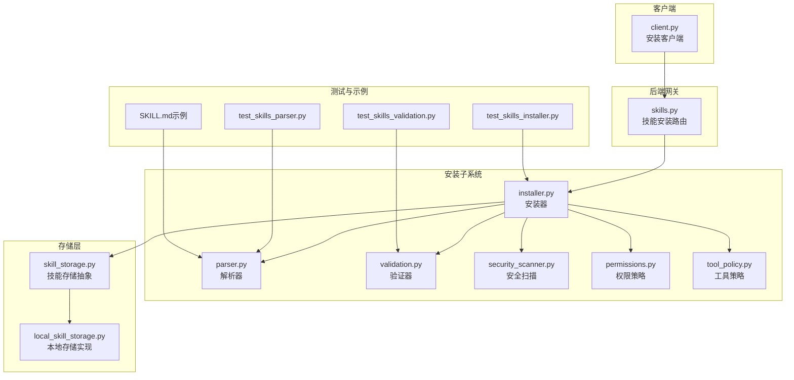
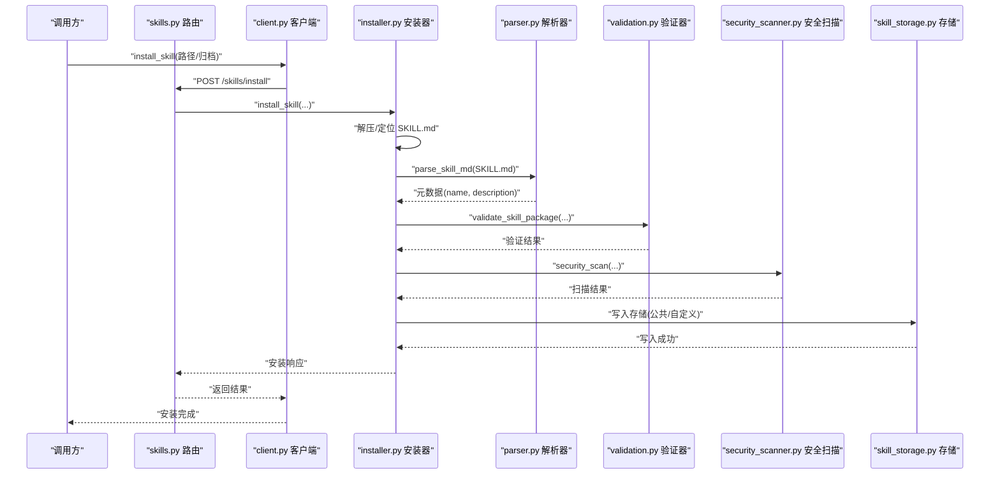
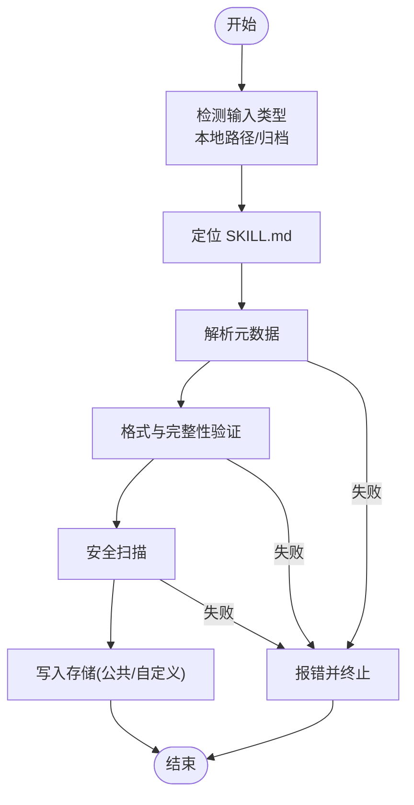
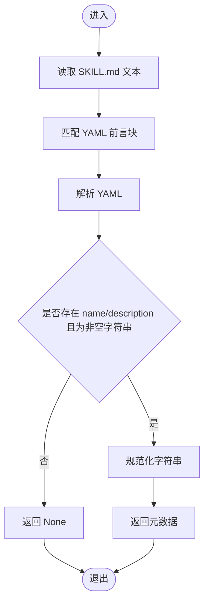
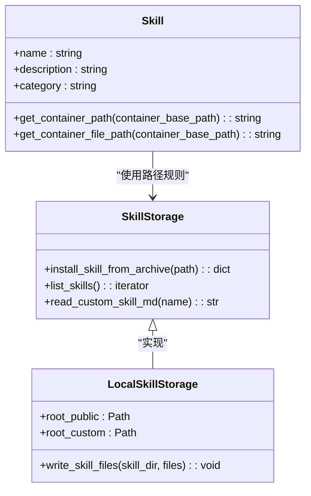
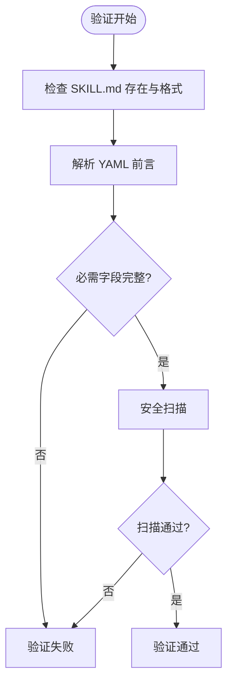
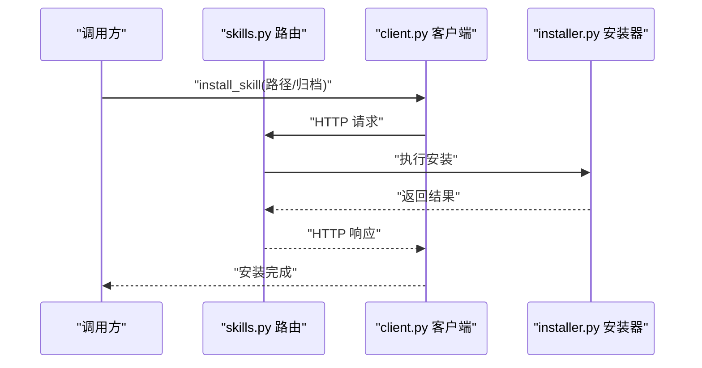
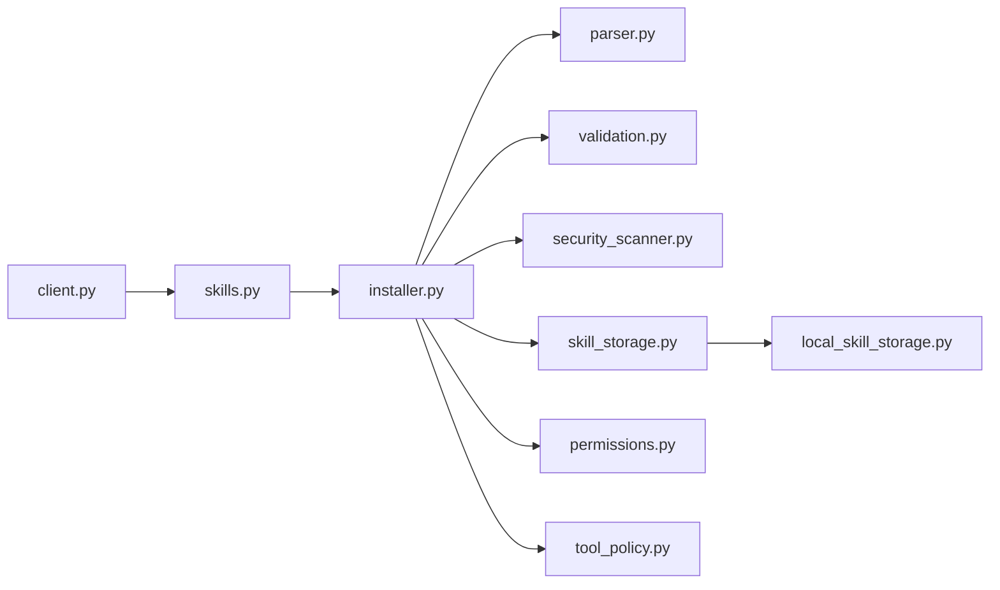

# 技能安装系统

<cite>
**本文引用的文件**
- [skills.py](file://backend/app/gateway/routers/skills.py)
- [installer.py](file://backend/packages/harness/deerflow/skills/installer.py)
- [parser.py](file://backend/packages/harness/deerflow/skills/parser.py)
- [types.py](file://backend/packages/harness/deerflow/skills/types.py)
- [validation.py](file://backend/packages/harness/deerflow/skills/validation.py)
- [security_scanner.py](file://backend/packages/harness/deerflow/skills/security_scanner.py)
- [permissions.py](file://backend/packages/harness/deerflow/skills/permissions.py)
- [tool_policy.py](file://backend/packages/harness/deerflow/skills/tool_policy.py)
- [skill_storage.py](file://backend/packages/harness/deerflow/skills/storage/skill_storage.py)
- [local_skill_storage.py](file://backend/packages/harness/deerflow/skills/storage/local_skill_storage.py)
- [client.py](file://backend/packages/harness/deerflow/client.py)
- [test_skills_installer.py](file://backend/tests/test_skills_installer.py)
- [test_skills_validation.py](file://backend/tests/test_skills_validation.py)
- [test_skills_parser.py](file://backend/tests/test_skills_parser.py)
- [SKILL.md（示例）](file://skills/public/skill-creator/SKILL.md)
</cite>

## 目录
1. [简介](#简介)
2. [项目结构](#项目结构)
3. [核心组件](#核心组件)
4. [架构总览](#架构总览)
5. [详细组件分析](#详细组件分析)
6. [依赖分析](#依赖分析)
7. [性能考虑](#性能考虑)
8. [故障排除指南](#故障排除指南)
9. [结论](#结论)
10. [附录](#附录)

## 简介
本技术文档围绕 DeerFlow 的“技能安装系统”展开，系统性阐述技能安装流程、解析机制与验证策略；明确技能包格式规范、依赖关系处理与版本兼容性检查；提供本地安装、远程仓库安装与批量安装的操作指引；并给出安装失败的故障排除、依赖冲突解决与安装进度监控的实践建议。

## 项目结构
技能安装系统主要由后端网关路由、安装器、解析器、存储层、权限与安全策略等模块组成，并通过客户端接口对外提供安装能力。前端与测试用例作为使用与验证场景存在。

**图表来源**
- [skills.py](file://backend/app/gateway/routers/skills.py)
- [installer.py](file://backend/packages/harness/deerflow/skills/installer.py)
- [parser.py](file://backend/packages/harness/deerflow/skills/parser.py)
- [validation.py](file://backend/packages/harness/deerflow/skills/validation.py)
- [security_scanner.py](file://backend/packages/harness/deerflow/skills/security_scanner.py)
- [permissions.py](file://backend/packages/harness/deerflow/skills/permissions.py)
- [tool_policy.py](file://backend/packages/harness/deerflow/skills/tool_policy.py)
- [skill_storage.py](file://backend/packages/harness/deerflow/skills/storage/skill_storage.py)
- [local_skill_storage.py](file://backend/packages/harness/deerflow/skills/storage/local_skill_storage.py)
- [client.py](file://backend/packages/harness/deerflow/client.py)
- [test_skills_installer.py](file://backend/tests/test_skills_installer.py)
- [test_skills_validation.py](file://backend/tests/test_skills_validation.py)
- [test_skills_parser.py](file://backend/tests/test_skills_parser.py)
- [SKILL.md（示例）](file://skills/public/skill-creator/SKILL.md)

**章节来源**
- [skills.py](file://backend/app/gateway/routers/skills.py)
- [installer.py](file://backend/packages/harness/deerflow/skills/installer.py)
- [parser.py](file://backend/packages/harness/deerflow/skills/parser.py)
- [validation.py](file://backend/packages/harness/deerflow/skills/validation.py)
- [security_scanner.py](file://backend/packages/harness/deerflow/skills/security_scanner.py)
- [permissions.py](file://backend/packages/harness/deerflow/skills/permissions.py)
- [tool_policy.py](file://backend/packages/harness/deerflow/skills/tool_policy.py)
- [skill_storage.py](file://backend/packages/harness/deerflow/skills/storage/skill_storage.py)
- [local_skill_storage.py](file://backend/packages/harness/deerflow/skills/storage/local_skill_storage.py)
- [client.py](file://backend/packages/harness/deerflow/client.py)
- [test_skills_installer.py](file://backend/tests/test_skills_installer.py)
- [test_skills_validation.py](file://backend/tests/test_skills_validation.py)
- [test_skills_parser.py](file://backend/tests/test_skills_parser.py)
- [SKILL.md（示例）](file://skills/public/skill-creator/SKILL.md)

## 核心组件
- 安装器：负责从本地或归档源解压、校验、写入存储，并触发解析与安全扫描。
- 解析器：从 SKILL.md 提取 YAML 前言元数据（名称、描述等），并进行基础合法性校验。
- 存储层：定义技能目录布局与路径计算规则，支持公共与自定义两类技能根目录。
- 验证器：对技能包进行完整性与格式验证，确保必需字段存在且符合要求。
- 安全扫描：阻止危险内容与不合规结构（如嵌套 SKILL.md）。
- 权限与工具策略：控制技能可访问范围与可用工具集合。
- 网关路由与客户端：对外暴露安装接口，供上层调用。

**章节来源**
- [installer.py](file://backend/packages/harness/deerflow/skills/installer.py)
- [parser.py](file://backend/packages/harness/deerflow/skills/parser.py)
- [skill_storage.py](file://backend/packages/harness/deerflow/skills/storage/skill_storage.py)
- [local_skill_storage.py](file://backend/packages/harness/deerflow/skills/storage/local_skill_storage.py)
- [validation.py](file://backend/packages/harness/deerflow/skills/validation.py)
- [security_scanner.py](file://backend/packages/harness/deerflow/skills/security_scanner.py)
- [permissions.py](file://backend/packages/harness/deerflow/skills/permissions.py)
- [tool_policy.py](file://backend/packages/harness/deerflow/skills/tool_policy.py)
- [skills.py](file://backend/app/gateway/routers/skills.py)
- [client.py](file://backend/packages/harness/deerflow/client.py)

## 架构总览
下图展示从请求到安装完成的关键交互路径，涵盖路由、安装器、解析、验证、安全扫描与存储写入。

**图表来源**
- [skills.py](file://backend/app/gateway/routers/skills.py)
- [client.py](file://backend/packages/harness/deerflow/client.py)
- [installer.py](file://backend/packages/harness/deerflow/skills/installer.py)
- [parser.py](file://backend/packages/harness/deerflow/skills/parser.py)
- [validation.py](file://backend/packages/harness/deerflow/skills/validation.py)
- [security_scanner.py](file://backend/packages/harness/deerflow/skills/security_scanner.py)
- [skill_storage.py](file://backend/packages/harness/deerflow/skills/storage/skill_storage.py)

## 详细组件分析

### 安装器（installer.py）
职责与流程要点：
- 接收本地路径或归档路径，定位 SKILL.md 并执行安装。
- 在写入前进行解析、验证与安全扫描，失败则中止。
- 将技能写入公共或自定义存储根目录，遵循容器/主机路径映射规则。
- 对嵌套 SKILL.md 进行严格限制，防止路径穿越与重复入口。

**图表来源**
- [installer.py](file://backend/packages/harness/deerflow/skills/installer.py)
- [parser.py](file://backend/packages/harness/deerflow/skills/parser.py)
- [validation.py](file://backend/packages/harness/deerflow/skills/validation.py)
- [security_scanner.py](file://backend/packages/harness/deerflow/skills/security_scanner.py)
- [skill_storage.py](file://backend/packages/harness/deerflow/skills/storage/skill_storage.py)

**章节来源**
- [installer.py](file://backend/packages/harness/deerflow/skills/installer.py)

### 解析器（parser.py）
职责与流程要点：
- 从 SKILL.md 中提取 YAML 前言块，解析为字典。
- 校验必需字段（name、description）的存在与类型。
- 规范化字符串（去除首尾空白），确保非空。
- 返回合法的技能元数据对象或空值。

**图表来源**
- [parser.py](file://backend/packages/harness/deerflow/skills/parser.py)

**章节来源**
- [parser.py](file://backend/packages/harness/deerflow/skills/parser.py)

### 存储层（skill_storage.py 与 local_skill_storage.py）
职责与流程要点：
- 定义技能目录布局与路径计算规则，支持容器内挂载路径映射。
- 公共与自定义两类根目录，分别对应不同安装位置。
- 提供遍历、读取与安装写入能力，保证路径一致性与隔离性。

**图表来源**
- [types.py](file://backend/packages/harness/deerflow/skills/types.py)
- [skill_storage.py](file://backend/packages/harness/deerflow/skills/storage/skill_storage.py)
- [local_skill_storage.py](file://backend/packages/harness/deerflow/skills/storage/local_skill_storage.py)

**章节来源**
- [types.py](file://backend/packages/harness/deerflow/skills/types.py)
- [skill_storage.py](file://backend/packages/harness/deerflow/skills/storage/skill_storage.py)
- [local_skill_storage.py](file://backend/packages/harness/deerflow/skills/storage/local_skill_storage.py)

### 验证器与安全扫描（validation.py 与 security_scanner.py）
职责与流程要点：
- 验证器：检查 SKILL.md 是否存在、是否包含有效 YAML 前言、必需字段是否齐全。
- 安全扫描：禁止嵌套 SKILL.md、异常路径结构与潜在危险内容，避免运行时风险。

**图表来源**
- [validation.py](file://backend/packages/harness/deerflow/skills/validation.py)
- [security_scanner.py](file://backend/packages/harness/deerflow/skills/security_scanner.py)

**章节来源**
- [validation.py](file://backend/packages/harness/deerflow/skills/validation.py)
- [security_scanner.py](file://backend/packages/harness/deerflow/skills/security_scanner.py)

### 权限与工具策略（permissions.py 与 tool_policy.py）
职责与流程要点：
- 权限策略：控制技能可见性与可调用范围，结合用户上下文与角色进行授权判定。
- 工具策略：限定技能可使用的工具集，避免越权或滥用高危工具。

**章节来源**
- [permissions.py](file://backend/packages/harness/deerflow/skills/permissions.py)
- [tool_policy.py](file://backend/packages/harness/deerflow/skills/tool_policy.py)

### 网关路由与客户端（skills.py 与 client.py）
职责与流程要点：
- 网关路由：接收安装请求，封装参数并调用安装器，返回标准化响应。
- 客户端：提供 install_skill 方法，便于上层应用或脚本发起安装。

**图表来源**
- [skills.py](file://backend/app/gateway/routers/skills.py)
- [client.py](file://backend/packages/harness/deerflow/client.py)
- [installer.py](file://backend/packages/harness/deerflow/skills/installer.py)

**章节来源**
- [skills.py](file://backend/app/gateway/routers/skills.py)
- [client.py](file://backend/packages/harness/deerflow/client.py)

## 依赖分析
- 组件耦合：安装器依赖解析器、验证器与安全扫描器；存储层被安装器写入；权限与工具策略贯穿安装前后。
- 外部依赖：YAML 解析、文件系统读写、容器路径映射。
- 潜在循环依赖：当前模块间以单向依赖为主，未见明显循环。

**图表来源**
- [installer.py](file://backend/packages/harness/deerflow/skills/installer.py)
- [parser.py](file://backend/packages/harness/deerflow/skills/parser.py)
- [validation.py](file://backend/packages/harness/deerflow/skills/validation.py)
- [security_scanner.py](file://backend/packages/harness/deerflow/skills/security_scanner.py)
- [skill_storage.py](file://backend/packages/harness/deerflow/skills/storage/skill_storage.py)
- [local_skill_storage.py](file://backend/packages/harness/deerflow/skills/storage/local_skill_storage.py)
- [permissions.py](file://backend/packages/harness/deerflow/skills/permissions.py)
- [tool_policy.py](file://backend/packages/harness/deerflow/skills/tool_policy.py)
- [skills.py](file://backend/app/gateway/routers/skills.py)
- [client.py](file://backend/packages/harness/deerflow/client.py)

**章节来源**
- [installer.py](file://backend/packages/harness/deerflow/skills/installer.py)
- [parser.py](file://backend/packages/harness/deerflow/skills/parser.py)
- [validation.py](file://backend/packages/harness/deerflow/skills/validation.py)
- [security_scanner.py](file://backend/packages/harness/deerflow/skills/security_scanner.py)
- [skill_storage.py](file://backend/packages/harness/deerflow/skills/storage/skill_storage.py)
- [local_skill_storage.py](file://backend/packages/harness/deerflow/skills/storage/local_skill_storage.py)
- [permissions.py](file://backend/packages/harness/deerflow/skills/permissions.py)
- [tool_policy.py](file://backend/packages/harness/deerflow/skills/tool_policy.py)
- [skills.py](file://backend/app/gateway/routers/skills.py)
- [client.py](file://backend/packages/harness/deerflow/client.py)

## 性能考虑
- I/O 吞吐：归档解压与文件写入为 I/O 密集型，建议使用异步写入与流式处理减少内存占用。
- 扫描开销：安全扫描与 YAML 解析成本可控，但应避免重复扫描；缓存解析结果可提升批量安装效率。
- 并发安装：在权限与存储锁保护下，允许多个技能并发安装，但需注意磁盘空间与锁竞争。
- 路径计算：容器路径映射与目录遍历应尽量避免深层递归，减少系统调用次数。

## 故障排除指南
常见问题与对策：
- 缺失 SKILL.md 或前言块
  - 现象：安装失败，提示未找到或缺少前言。
  - 处理：确保技能根目录包含有效的 SKILL.md，并按规范编写 YAML 前言。
  - 参考测试用例：[test_skills_validation.py](file://backend/tests/test_skills_validation.py)
- YAML 格式错误
  - 现象：解析失败，日志记录 YAML 错误。
  - 处理：修正 YAML 语法，确保键值对正确缩进与类型。
  - 参考测试用例：[test_skills_validation.py](file://backend/tests/test_skills_validation.py)
- 必需字段缺失
  - 现象：name 或 description 为空或类型不符导致验证失败。
  - 处理：补齐字段并保持字符串类型与非空。
  - 参考测试用例：[test_skills_validation.py](file://backend/tests/test_skills_validation.py)
- 嵌套 SKILL.md
  - 现象：安全扫描拒绝安装，提示不允许嵌套 SKILL.md。
  - 处理：移除嵌套文件，保持技能根目录仅有一份 SKILL.md。
  - 参考实现：[installer.py](file://backend/packages/harness/deerflow/skills/installer.py)
- 权限不足或工具受限
  - 现象：技能可安装但无法执行。
  - 处理：调整权限策略与工具策略配置，确保技能具备所需工具与访问范围。
  - 参考策略：[permissions.py](file://backend/packages/harness/deerflow/skills/permissions.py)、[tool_policy.py](file://backend/packages/harness/deerflow/skills/tool_policy.py)
- 存储写入失败
  - 现象：磁盘空间不足或权限错误。
  - 处理：检查存储根目录权限与剩余空间，必要时清理或扩容。
  - 参考存储：[skill_storage.py](file://backend/packages/harness/deerflow/skills/storage/skill_storage.py)、[local_skill_storage.py](file://backend/packages/harness/deerflow/skills/storage/local_skill_storage.py)

**章节来源**
- [test_skills_validation.py](file://backend/tests/test_skills_validation.py)
- [installer.py](file://backend/packages/harness/deerflow/skills/installer.py)
- [permissions.py](file://backend/packages/harness/deerflow/skills/permissions.py)
- [tool_policy.py](file://backend/packages/harness/deerflow/skills/tool_policy.py)
- [skill_storage.py](file://backend/packages/harness/deerflow/skills/storage/skill_storage.py)
- [local_skill_storage.py](file://backend/packages/harness/deerflow/skills/storage/local_skill_storage.py)

## 结论
DeerFlow 技能安装系统以“先解析、再验证、后扫描、最后写入”的流水线为核心，结合严格的路径与安全策略，保障了安装过程的可靠性与安全性。通过公共/自定义双存储根目录与容器路径映射，系统实现了灵活的部署与隔离。配合权限与工具策略，可进一步细化访问控制与工具使用边界。建议在生产环境中启用异步安装、缓存解析结果与并发控制，以获得更佳的吞吐与稳定性。

## 附录

### 技能包格式规范
- 必需文件
  - SKILL.md：位于技能根目录，包含 YAML 前言块与正文。
- 前言块字段
  - name：技能标识符（字符串，非空）。
  - description：触发条件与功能描述（字符串，非空）。
  - compatibility：可选，声明所需工具或依赖。
- 目录结构建议
  - 支持 scripts/、references/、assets/ 等资源目录，按需组织。
- 示例参考
  - [SKILL.md（示例）](file://skills/public/skill-creator/SKILL.md)

**章节来源**
- [SKILL.md（示例）](file://skills/public/skill-creator/SKILL.md)

### 依赖关系处理与版本兼容性检查
- 依赖声明：compatibility 字段用于声明工具或外部依赖。
- 版本策略：建议采用语义化版本管理，安装前进行工具版本兼容性检查。
- 冲突处理：当多个技能声明相同工具的不同版本时，优先选择更高版本或由策略统一收敛。

**章节来源**
- [tool_policy.py](file://backend/packages/harness/deerflow/skills/tool_policy.py)

### 安装示例

- 从本地文件安装
  - 步骤：准备技能包（含 SKILL.md），调用客户端 install_skill 指定本地路径，后端路由接收请求并交由安装器处理。
  - 参考接口：[client.py](file://backend/packages/harness/deerflow/client.py)、[skills.py](file://backend/app/gateway/routers/skills.py)、[installer.py](file://backend/packages/harness/deerflow/skills/installer.py)

- 从远程仓库安装
  - 步骤：拉取归档（如 .zip/.tar.gz），上传至服务端临时目录，调用安装接口传入归档路径，安装器解压并安装。
  - 参考接口：[skills.py](file://backend/app/gateway/routers/skills.py)、[installer.py](file://backend/packages/harness/deerflow/skills/installer.py)、[skill_storage.py](file://backend/packages/harness/deerflow/skills/storage/skill_storage.py)

- 批量安装
  - 步骤：遍历多个归档或本地目录，逐个调用安装接口；在权限与存储锁保护下并发执行，注意磁盘与锁竞争。
  - 参考接口：[skills.py](file://backend/app/gateway/routers/skills.py)、[installer.py](file://backend/packages/harness/deerflow/skills/installer.py)

### 安装进度监控机制
- 建议在网关路由层引入安装任务队列与状态查询接口，返回进度百分比与当前阶段（解析/验证/扫描/写入）。
- 对于大体积归档，可在写入阶段分块上报进度。
- 使用异步任务与事件通知，避免阻塞主请求线程。

**章节来源**
- [skills.py](file://backend/app/gateway/routers/skills.py)
- [installer.py](file://backend/packages/harness/deerflow/skills/installer.py)