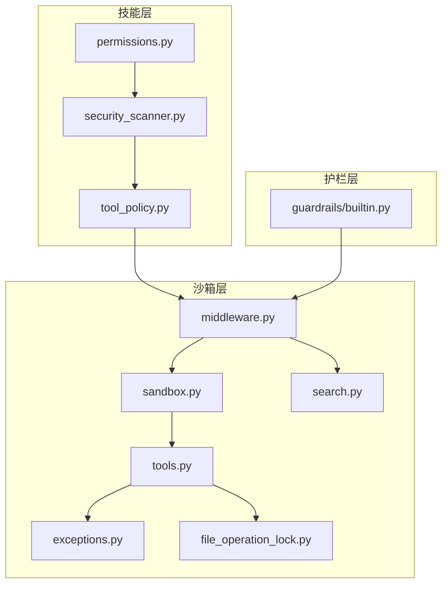
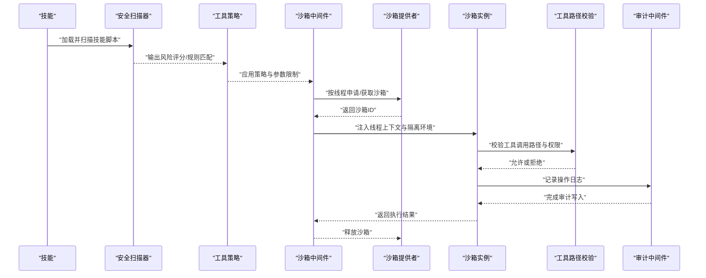
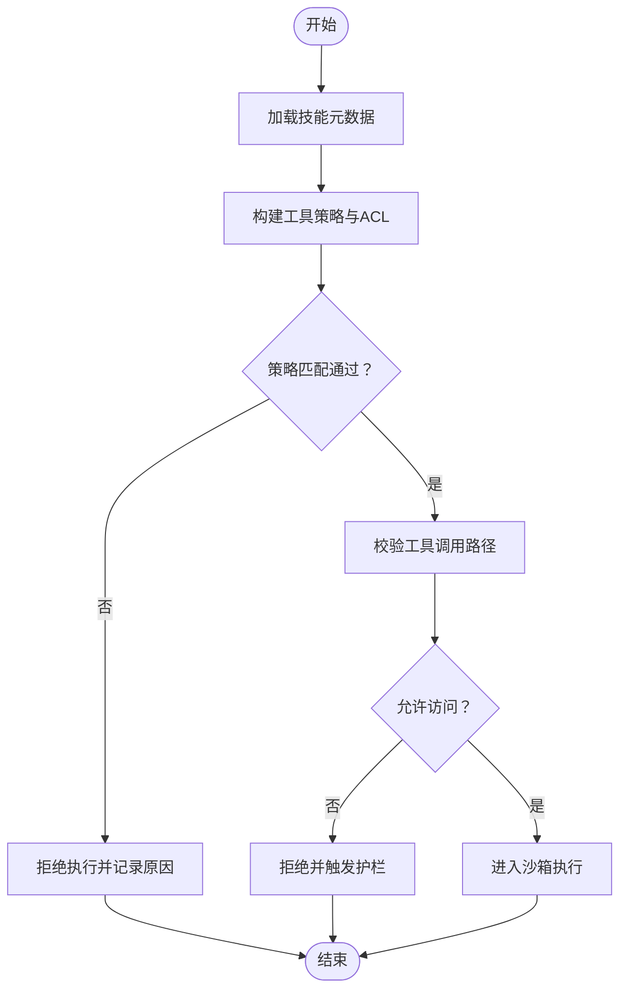
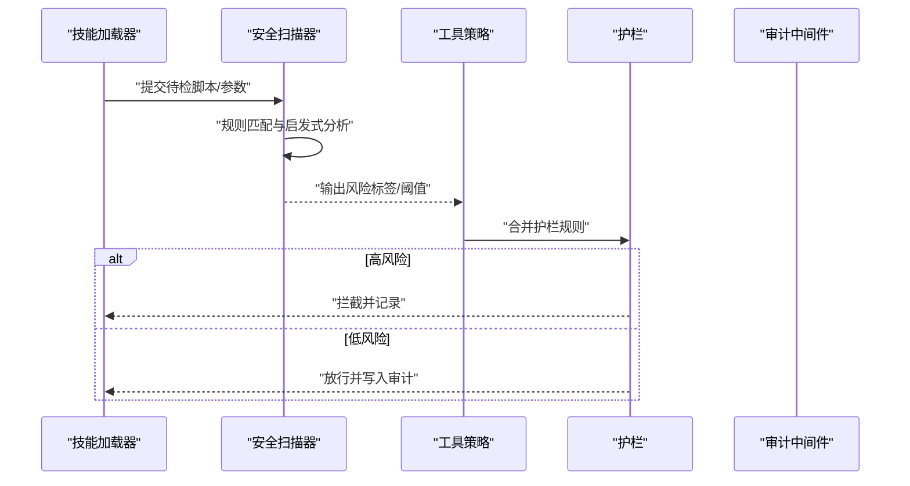
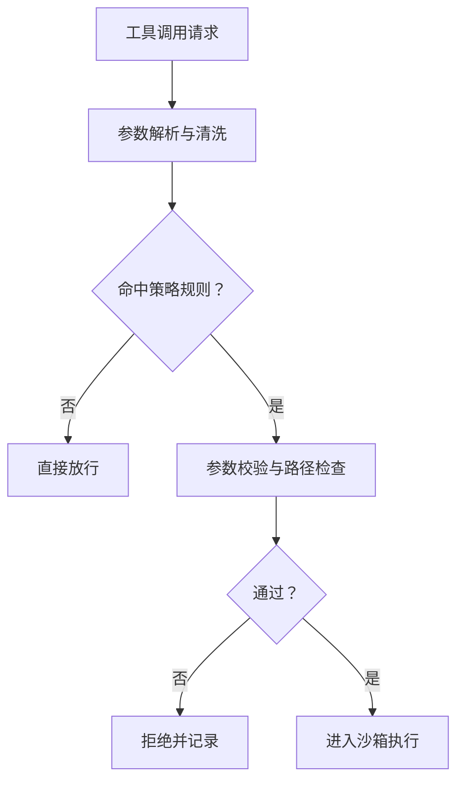
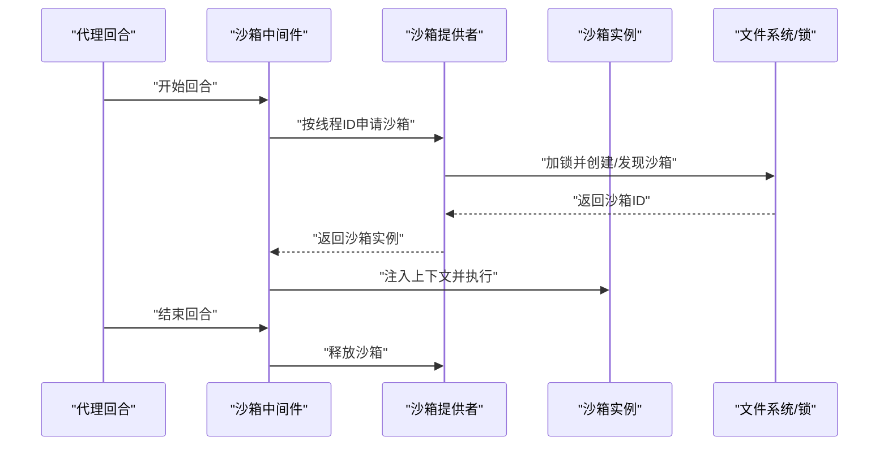
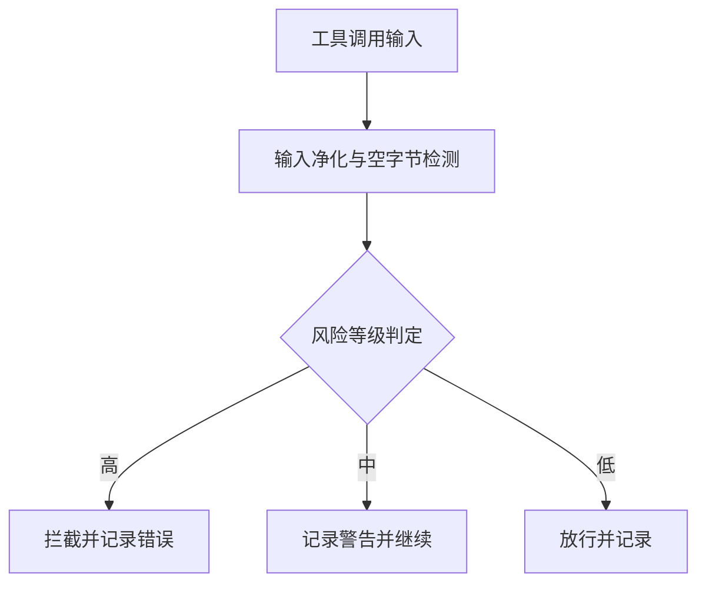
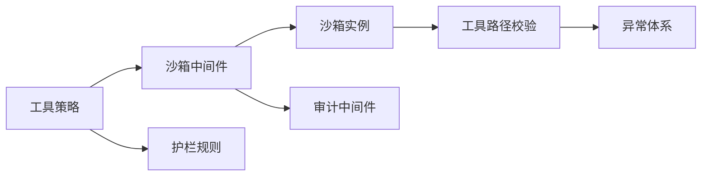

# 技能权限与安全

<cite>
**本文引用的文件**
- [backend/packages/harness/deerflow/skills/permissions.py](file://backend/packages/harness/deerflow/skills/permissions.py)
- [backend/packages/harness/deerflow/skills/security_scanner.py](file://backend/packages/harness/deerflow/skills/security_scanner.py)
- [backend/packages/harness/deerflow/skills/tool_policy.py](file://backend/packages/harness/deerflow/skills/tool_policy.py)
- [backend/packages/harness/deerflow/sandbox/sandbox.py](file://backend/packages/harness/deerflow/sandbox/sandbox.py)
- [backend/packages/harness/deerflow/sandbox/middleware.py](file://backend/packages/harness/deerflow/sandbox/middleware.py)
- [backend/packages/harness/deerflow/sandbox/tools.py](file://backend/packages/harness/deerflow/sandbox/tools.py)
- [backend/packages/harness/deerflow/sandbox/exceptions.py](file://backend/packages/harness/deerflow/sandbox/exceptions.py)
- [backend/packages/harness/deerflow/sandbox/file_operation_lock.py](file://backend/packages/harness/deerflow/sandbox/file_operation_lock.py)
- [backend/packages/harness/deerflow/sandbox/search.py](file://backend/packages/harness/deerflow/sandbox/search.py)
- [backend/packages/harness/deerflow/guardrails/builtin.py](file://backend/packages/harness/deerflow/guardrails/builtin.py)
- [backend/docs/GUARDRAILS.md](file://backend/docs/GUARDRAILS.md)
- [scripts/doctor.py](file://scripts/doctor.py)
- [frontend/src/content/en/harness/sandbox.mdx](file://frontend/src/content/en/harness/sandbox.mdx)
- [backend/tests/test_sandbox_audit_middleware.py](file://backend/tests/test_sandbox_audit_middleware.py)
- [backend/tests/test_sandbox_middleware.py](file://backend/tests/test_sandbox_middleware.py)
- [backend/tests/test_local_sandbox_virtual_path_contract.py](file://backend/tests/test_local_sandbox_virtual_path_contract.py)
- [backend/tests/test_security_scanner.py](file://backend/tests/test_security_scanner.py)
- [backend/tests/test_skill_permissions.py](file://backend/tests/test_skill_permissions.py)
</cite>

## 目录
1. [引言](#引言)
2. [项目结构](#项目结构)
3. [核心组件](#核心组件)
4. [架构总览](#架构总览)
5. [组件详解](#组件详解)
6. [依赖关系分析](#依赖关系分析)
7. [性能考量](#性能考量)
8. [故障排查指南](#故障排查指南)
9. [结论](#结论)
10. [附录](#附录)

## 引言
本技术文档聚焦 DeerFlow 的“技能权限与安全”子系统，系统性阐述技能权限模型、安全扫描机制与工具策略管理，明确权限级别定义、访问控制清单（ACL）与沙箱隔离策略，并给出安全扫描示例（恶意代码检测、网络访问监控、文件系统权限控制）、安全策略配置指南、违规行为检测与安全事件响应流程。文档面向后端工程师与平台运维人员，兼顾可操作性与可追溯性。

## 项目结构
围绕“技能权限与安全”，后端核心位于 deer-flow/backend/packages/harness/deerflow 下，涉及以下模块：
- skills：技能解析、权限声明与安全扫描
- sandbox：沙箱提供者、中间件、工具路径校验、异常与锁
- guardrails：内置护栏（内容安全与合规）
- tests：覆盖安全中间件、沙箱、权限与扫描的测试用例
- scripts：诊断脚本，含沙箱模式检查

图表来源
- [backend/packages/harness/deerflow/skills/permissions.py](file://backend/packages/harness/deerflow/skills/permissions.py)
- [backend/packages/harness/deerflow/skills/security_scanner.py](file://backend/packages/harness/deerflow/skills/security_scanner.py)
- [backend/packages/harness/deerflow/skills/tool_policy.py](file://backend/packages/harness/deerflow/skills/tool_policy.py)
- [backend/packages/harness/deerflow/sandbox/sandbox.py](file://backend/packages/harness/deerflow/sandbox/sandbox.py)
- [backend/packages/harness/deerflow/sandbox/middleware.py](file://backend/packages/harness/deerflow/sandbox/middleware.py)
- [backend/packages/harness/deerflow/sandbox/tools.py](file://backend/packages/harness/deerflow/sandbox/tools.py)
- [backend/packages/harness/deerflow/sandbox/exceptions.py](file://backend/packages/harness/deerflow/sandbox/exceptions.py)
- [backend/packages/harness/deerflow/sandbox/file_operation_lock.py](file://backend/packages/harness/deerflow/sandbox/file_operation_lock.py)
- [backend/packages/harness/deerflow/sandbox/search.py](file://backend/packages/harness/deerflow/sandbox/search.py)
- [backend/packages/harness/deerflow/guardrails/builtin.py](file://backend/packages/harness/deerflow/guardrails/builtin.py)

章节来源
- [backend/packages/harness/deerflow/skills/permissions.py](file://backend/packages/harness/deerflow/skills/permissions.py)
- [backend/packages/harness/deerflow/skills/security_scanner.py](file://backend/packages/harness/deerflow/skills/security_scanner.py)
- [backend/packages/harness/deerflow/skills/tool_policy.py](file://backend/packages/harness/deerflow/skills/tool_policy.py)
- [backend/packages/harness/deerflow/sandbox/sandbox.py](file://backend/packages/harness/deerflow/sandbox/sandbox.py)
- [backend/packages/harness/deerflow/sandbox/middleware.py](file://backend/packages/harness/deerflow/sandbox/middleware.py)
- [backend/packages/harness/deerflow/sandbox/tools.py](file://backend/packages/harness/deerflow/sandbox/tools.py)
- [backend/packages/harness/deerflow/sandbox/exceptions.py](file://backend/packages/harness/deerflow/sandbox/exceptions.py)
- [backend/packages/harness/deerflow/sandbox/file_operation_lock.py](file://backend/packages/harness/deerflow/sandbox/file_operation_lock.py)
- [backend/packages/harness/deerflow/sandbox/search.py](file://backend/packages/harness/deerflow/sandbox/search.py)
- [backend/packages/harness/deerflow/guardrails/builtin.py](file://backend/packages/harness/deerflow/guardrails/builtin.py)

## 核心组件
- 技能权限模型：基于技能元数据与工具声明，定义最小授权集合与执行边界
- 安全扫描机制：对技能脚本与工具调用进行静态/动态扫描，识别高风险行为
- 工具策略管理：通过策略规则限制工具调用范围与参数，结合护栏与沙箱实现强约束
- 沙箱隔离策略：本地/容器两种模式，提供进程与文件系统隔离；审计中间件记录操作轨迹

章节来源
- [backend/packages/harness/deerflow/skills/permissions.py](file://backend/packages/harness/deerflow/skills/permissions.py)
- [backend/packages/harness/deerflow/skills/security_scanner.py](file://backend/packages/harness/deerflow/skills/security_scanner.py)
- [backend/packages/harness/deerflow/skills/tool_policy.py](file://backend/packages/harness/deerflow/skills/tool_policy.py)
- [backend/packages/harness/deerflow/sandbox/middleware.py](file://backend/packages/harness/deerflow/sandbox/middleware.py)
- [backend/packages/harness/deerflow/sandbox/tools.py](file://backend/packages/harness/deerflow/sandbox/tools.py)

## 架构总览
下图展示从技能加载到工具调用、再到沙箱执行与审计的完整链路。

图表来源
- [backend/packages/harness/deerflow/skills/security_scanner.py](file://backend/packages/harness/deerflow/skills/security_scanner.py)
- [backend/packages/harness/deerflow/skills/tool_policy.py](file://backend/packages/harness/deerflow/skills/tool_policy.py)
- [backend/packages/harness/deerflow/sandbox/middleware.py](file://backend/packages/harness/deerflow/sandbox/middleware.py)
- [backend/packages/harness/deerflow/sandbox/sandbox.py](file://backend/packages/harness/deerflow/sandbox/sandbox.py)
- [backend/packages/harness/deerflow/sandbox/tools.py](file://backend/packages/harness/deerflow/sandbox/tools.py)
- [backend/packages/harness/deerflow/sandbox/middleware.py](file://backend/packages/harness/deerflow/sandbox/middleware.py)

## 组件详解

### 技能权限模型
- 权限声明与最小授权
  - 技能元数据中声明所需工具与访问范围，系统据此生成最小授权集合
  - 工具策略在运行时对工具调用参数与路径进行二次校验
- 访问控制清单（ACL）
  - 路径白名单：仅允许虚拟路径前缀、技能目录、ACP 工作区或显式挂载点
  - 只读约束：技能与 ACP 工作区默认只读，防止意外修改
- 线程隔离
  - 每个会话线程拥有独立沙箱实例，避免跨线程状态泄漏

图表来源
- [backend/packages/harness/deerflow/skills/permissions.py](file://backend/packages/harness/deerflow/skills/permissions.py)
- [backend/packages/harness/deerflow/skills/tool_policy.py](file://backend/packages/harness/deerflow/skills/tool_policy.py)
- [backend/packages/harness/deerflow/sandbox/tools.py](file://backend/packages/harness/deerflow/sandbox/tools.py)

章节来源
- [backend/packages/harness/deerflow/skills/permissions.py](file://backend/packages/harness/deerflow/skills/permissions.py)
- [backend/packages/harness/deerflow/skills/tool_policy.py](file://backend/packages/harness/deerflow/skills/tool_policy.py)
- [backend/packages/harness/deerflow/sandbox/tools.py](file://backend/packages/harness/deerflow/sandbox/tools.py)
- [backend/tests/test_skill_permissions.py](file://backend/tests/test_skill_permissions.py)

### 安全扫描机制
- 扫描对象
  - 技能脚本与工具调用参数，识别高危命令、路径遍历、敏感 API 调用等
- 扫描策略
  - 基于规则库与启发式检测，结合护栏规则进行综合评估
- 违规处置
  - 拦截高风险调用，记录审计日志，必要时终止会话

图表来源
- [backend/packages/harness/deerflow/skills/security_scanner.py](file://backend/packages/harness/deerflow/skills/security_scanner.py)
- [backend/packages/harness/deerflow/guardrails/builtin.py](file://backend/packages/harness/deerflow/guardrails/builtin.py)
- [backend/packages/harness/deerflow/sandbox/middleware.py](file://backend/packages/harness/deerflow/sandbox/middleware.py)

章节来源
- [backend/packages/harness/deerflow/skills/security_scanner.py](file://backend/packages/harness/deerflow/skills/security_scanner.py)
- [backend/packages/harness/deerflow/guardrails/builtin.py](file://backend/packages/harness/deerflow/guardrails/builtin.py)
- [backend/tests/test_security_scanner.py](file://backend/tests/test_security_scanner.py)

### 工具策略管理
- 策略维度
  - 路径白名单、只读挂载、参数白名单/黑名单、超时与资源配额
- 执行流程
  - 在工具调用前进行策略匹配与参数净化，失败则拒绝并记录
- 与护栏协同
  - 护栏负责语义与合规层面的判断，策略负责技术边界与资源约束

图表来源
- [backend/packages/harness/deerflow/skills/tool_policy.py](file://backend/packages/harness/deerflow/skills/tool_policy.py)
- [backend/packages/harness/deerflow/sandbox/tools.py](file://backend/packages/harness/deerflow/sandbox/tools.py)

章节来源
- [backend/packages/harness/deerflow/skills/tool_policy.py](file://backend/packages/harness/deerflow/skills/tool_policy.py)
- [backend/packages/harness/deerflow/sandbox/tools.py](file://backend/packages/harness/deerflow/sandbox/tools.py)

### 沙箱隔离策略
- 模式选择
  - 本地沙箱：适合开发与受限场景，支持禁用宿主 Bash 以降低风险
  - 容器沙箱：提供更强隔离，支持按线程分配独立 Pod
- 中间件生命周期
  - 在代理回合开始时按线程申请沙箱，在回合结束后释放
- 路径与权限
  - 严格限制工具调用路径，禁止路径穿越，强制只读访问非用户数据区域
- 文件锁与并发
  - 使用跨进程文件锁保证同一线程在多进程下的沙箱创建一致性

图表来源
- [backend/packages/harness/deerflow/sandbox/middleware.py](file://backend/packages/harness/deerflow/sandbox/middleware.py)
- [backend/packages/harness/deerflow/sandbox/sandbox.py](file://backend/packages/harness/deerflow/sandbox/sandbox.py)
- [backend/packages/harness/deerflow/sandbox/file_operation_lock.py](file://backend/packages/harness/deerflow/sandbox/file_operation_lock.py)

章节来源
- [backend/packages/harness/deerflow/sandbox/middleware.py](file://backend/packages/harness/deerflow/sandbox/middleware.py)
- [backend/packages/harness/deerflow/sandbox/sandbox.py](file://backend/packages/harness/deerflow/sandbox/sandbox.py)
- [backend/packages/harness/deerflow/sandbox/tools.py](file://backend/packages/harness/deerflow/sandbox/tools.py)
- [backend/packages/harness/deerflow/sandbox/file_operation_lock.py](file://backend/packages/harness/deerflow/sandbox/file_operation_lock.py)
- [backend/tests/test_sandbox_middleware.py](file://backend/tests/test_sandbox_middleware.py)
- [backend/tests/test_local_sandbox_virtual_path_contract.py](file://backend/tests/test_local_sandbox_virtual_path_contract.py)
- [frontend/src/content/en/harness/sandbox.mdx](file://frontend/src/content/en/harness/sandbox.mdx)

### 审计与护栏
- 审计中间件
  - 对工具调用进行输入净化与风险判定，记录高风险/中风险操作
  - 阻断高危命令，同时保留可审计证据
- 护栏规则
  - 内置护栏提供敏感词过滤、主题合规与内容安全判断
- 诊断与配置
  - 诊断脚本检查沙箱配置与容器运行时可用性，提示风险项与修复建议

图表来源
- [backend/packages/harness/deerflow/sandbox/middleware.py](file://backend/packages/harness/deerflow/sandbox/middleware.py)
- [backend/packages/harness/deerflow/guardrails/builtin.py](file://backend/packages/harness/deerflow/guardrails/builtin.py)
- [backend/docs/GUARDRAILS.md](file://backend/docs/GUARDRAILS.md)
- [scripts/doctor.py](file://scripts/doctor.py)

章节来源
- [backend/tests/test_sandbox_audit_middleware.py](file://backend/tests/test_sandbox_audit_middleware.py)
- [backend/packages/harness/deerflow/guardrails/builtin.py](file://backend/packages/harness/deerflow/guardrails/builtin.py)
- [backend/docs/GUARDRAILS.md](file://backend/docs/GUARDRAILS.md)
- [scripts/doctor.py](file://scripts/doctor.py)

## 依赖关系分析
- 组件耦合
  - 工具策略依赖沙箱路径校验与护栏规则，共同构成“技术边界+语义合规”的双保险
  - 沙箱中间件贯穿生命周期，向上游提供隔离能力，向下游提供审计入口
- 外部依赖
  - 容器沙箱依赖容器运行时与供应器；本地沙箱依赖文件系统与锁机制
- 循环依赖
  - 当前模块采用单向依赖：策略→中间件→沙箱→工具校验，未见循环

图表来源
- [backend/packages/harness/deerflow/skills/tool_policy.py](file://backend/packages/harness/deerflow/skills/tool_policy.py)
- [backend/packages/harness/deerflow/sandbox/middleware.py](file://backend/packages/harness/deerflow/sandbox/middleware.py)
- [backend/packages/harness/deerflow/sandbox/sandbox.py](file://backend/packages/harness/deerflow/sandbox/sandbox.py)
- [backend/packages/harness/deerflow/sandbox/tools.py](file://backend/packages/harness/deerflow/sandbox/tools.py)
- [backend/packages/harness/deerflow/sandbox/exceptions.py](file://backend/packages/harness/deerflow/sandbox/exceptions.py)
- [backend/packages/harness/deerflow/guardrails/builtin.py](file://backend/packages/harness/deerflow/guardrails/builtin.py)

章节来源
- [backend/packages/harness/deerflow/skills/tool_policy.py](file://backend/packages/harness/deerflow/skills/tool_policy.py)
- [backend/packages/harness/deerflow/sandbox/middleware.py](file://backend/packages/harness/deerflow/sandbox/middleware.py)
- [backend/packages/harness/deerflow/sandbox/tools.py](file://backend/packages/harness/deerflow/sandbox/tools.py)
- [backend/packages/harness/deerflow/sandbox/exceptions.py](file://backend/packages/harness/deerflow/sandbox/exceptions.py)
- [backend/packages/harness/deerflow/guardrails/builtin.py](file://backend/packages/harness/deerflow/guardrails/builtin.py)

## 性能考量
- 沙箱创建与释放
  - 使用跨进程文件锁串行化创建，避免容器名冲突；建议在高并发场景启用容器沙箱以提升隔离与吞吐
- 路径校验与策略匹配
  - 将路径白名单与只读挂载缓存至内存，减少重复计算
- 审计开销
  - 审计日志应异步落盘，避免阻塞工具调用主路径
- 诊断与预检
  - 启动阶段通过诊断脚本检查容器运行时与配置，提前暴露潜在性能瓶颈

## 故障排查指南
- 沙箱模式检查
  - 使用诊断脚本检查沙箱配置与容器运行时可用性，关注“主机 Bash 启用”“容器运行时可用”等告警
- 沙箱中间件问题
  - 若回合结束未释放沙箱，检查中间件 after/aafter 流程是否被重写导致遗漏释放
- 路径与权限错误
  - 出现路径穿越或越权访问，优先检查工具路径校验逻辑与自定义挂载配置
- 审计拦截
  - 高风险命令被拦截时，查看审计中间件记录的具体命令与风险标签，结合护栏规则定位原因

章节来源
- [scripts/doctor.py](file://scripts/doctor.py)
- [backend/tests/test_sandbox_middleware.py](file://backend/tests/test_sandbox_middleware.py)
- [backend/tests/test_sandbox_audit_middleware.py](file://backend/tests/test_sandbox_audit_middleware.py)
- [backend/packages/harness/deerflow/sandbox/tools.py](file://backend/packages/harness/deerflow/sandbox/tools.py)
- [backend/packages/harness/deerflow/sandbox/exceptions.py](file://backend/packages/harness/deerflow/sandbox/exceptions.py)

## 结论
DeerFlow 的技能权限与安全体系通过“策略+护栏+沙箱+审计”的组合拳，实现了从最小授权到强隔离再到可观测性的闭环。建议在生产环境优先采用容器沙箱与严格的工具策略，并配合护栏规则与审计日志，持续优化风险阈值与响应流程。

## 附录

### 安全扫描示例（概念性）
- 恶意代码检测
  - 规则：识别危险函数调用、可疑编码模式、硬编码凭据
  - 处置：拦截并记录，必要时终止回合
- 网络访问监控
  - 规则：禁止出站直连、限制域名白名单
  - 处置：阻断高风险连接，记录目标地址与协议
- 文件系统权限控制
  - 规则：禁止路径穿越、限制写入范围、强制只读
  - 处置：拒绝写入操作，记录违规路径

### 安全策略配置指南（要点）
- 沙箱模式
  - 开发/受限：本地沙箱，禁用宿主 Bash
  - 生产：容器沙箱，启用按线程隔离
- 工具策略
  - 明确路径白名单与只读挂载
  - 参数白名单/黑名单与超时限制
- 护栏规则
  - 敏感词与主题合规，结合业务场景调整阈值
- 审计与告警
  - 高/中风险分级记录，建立自动化告警与处置流程