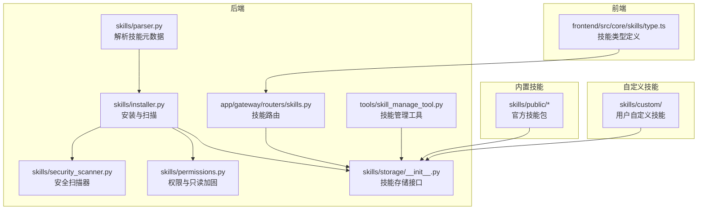
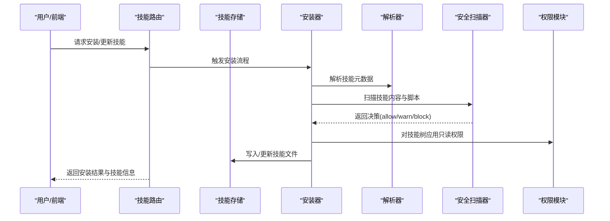
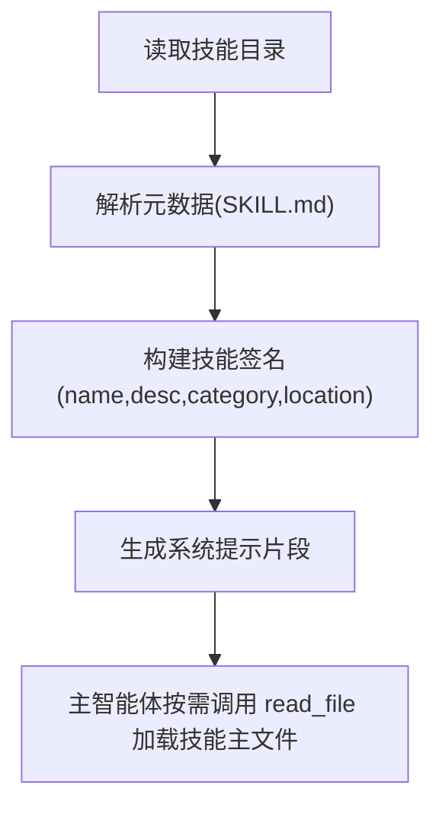
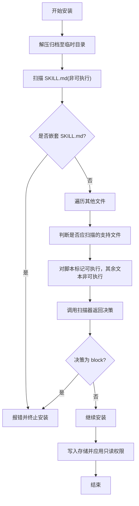
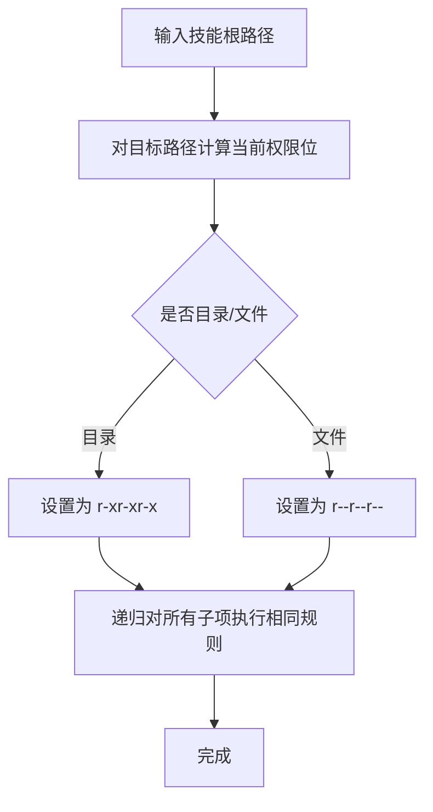
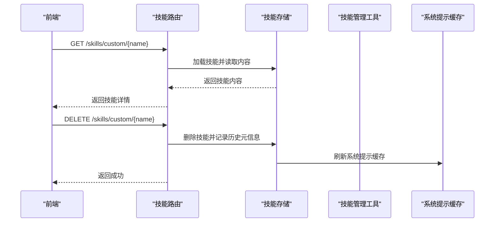
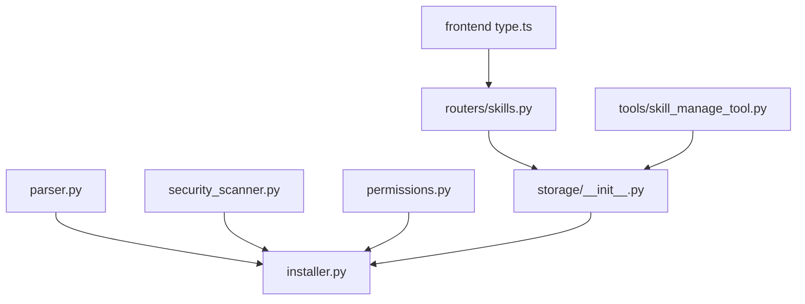

# 技能管理系统

<cite>
**本文引用的文件**
- [backend/packages/harness/deerflow/skills/installer.py](file://backend/packages/harness/deerflow/skills/installer.py)
- [backend/packages/harness/deerflow/skills/security_scanner.py](file://backend/packages/harness/deerflow/skills/security_scanner.py)
- [backend/packages/harness/deerflow/skills/permissions.py](file://backend/packages/harness/deerflow/skills/permissions.py)
- [backend/packages/harness/deerflow/skills/parser.py](file://backend/packages/harness/deerflow/skills/parser.py)
- [backend/packages/harness/deerflow/skills/types.py](file://backend/packages/harness/deerflow/skills/types.py)
- [backend/packages/harness/deerflow/skills/storage/__init__.py](file://backend/packages/harness/deerflow/skills/storage/__init__.py)
- [backend/app/gateway/routers/skills.py](file://backend/app/gateway/routers/skills.py)
- [backend/packages/harness/deerflow/tools/skill_manage_tool.py](file://backend/packages/harness/deerflow/tools/skill_manage_tool.py)
- [backend/tests/test_skills_installer.py](file://backend/tests/test_skills_installer.py)
- [backend/tests/test_skills_custom_router.py](file://backend/tests/test_skills_custom_router.py)
- [backend/packages/harness/deerflow/agents/lead_agent/prompt.py](file://backend/packages/harness/deerflow/agents/lead_agent/prompt.py)
- [frontend/src/core/skills/type.ts](file://frontend/src/core/skills/type.ts)
- [skills/public/bootstrap/SKILL.md](file://skills/public/bootstrap/SKILL.md)
- [skills/public/chart-visualization/SKILL.md](file://skills/public/chart-visualization/SKILL.md)
- [skills/public/github-deep-research/SKILL.md](file://skills/public/github-deep-research/SKILL.md)
- [skills/public/skill-creator/SKILL.md](file://skills/public/skill-creator/SKILL.md)
- [skills/public/systematic-literature-review/SKILL.md](file://skills/public/systematic-literature-review/SKILL.md)
- [skills/public/video-generation/SKILL.md](file://skills/public/video-generation/SKILL.md)
- [skills/public/web-design-guidelines/SKILL.md](file://skills/public/web-design-guidelines/SKILL.md)
- [skills/public/deep-research/SKILL.md](file://skills/public/deep-research/SKILL.md)
- [skills/public/find-skills/SKILL.md](file://skills/public/find-skills/SKILL.md)
- [skills/public/podcast-generation/SKILL.md](file://skills/public/podcast-generation/SKILL.md)
- [skills/public/newsletter-generation/SKILL.md](file://skills/public/newsletter-generation/SKILL.md)
- [skills/public/image-generation/SKILL.md](file://skills/public/image-generation/SKILL.md)
- [skills/public/data-analysis/SKILL.md](file://skills/public/data-analysis/SKILL.md)
- [skills/public/code-documentation/SKILL.md](file://skills/public/code-documentation/SKILL.md)
- [skills/public/academic-paper-review/SKILL.md](file://skills/public/academic-paper-review/SKILL.md)
- [skills/public/consulting-analysis/SKILL.md](file://skills/public/consulting-analysis/SKILL.md)
- [skills/public/surprise-me/SKILL.md](file://skills/public/surprise-me/SKILL.md)
- [skills/public/claude-to-deerflow/SKILL.md](file://skills/public/claude-to-deerflow/SKILL.md)
- [skills/public/vercel-deploy-claimable/SKILL.md](file://skills/public/vercel-deploy-claimable/SKILL.md)
- [skills/public/frontend-design/SKILL.md](file://skills/public/frontend-design/SKILL.md)
- [skills/public/ppt-generation/SKILL.md](file://skills/public/ppt-generation/SKILL.md)
- [skills/custom/](file://skills/custom/)
</cite>

## 目录
1. [简介](#简介)
2. [项目结构](#项目结构)
3. [核心组件](#核心组件)
4. [架构总览](#架构总览)
5. [详细组件分析](#详细组件分析)
6. [依赖关系分析](#依赖关系分析)
7. [性能考虑](#性能考虑)
8. [故障排除指南](#故障排除指南)
9. [结论](#结论)
10. [附录](#附录)

## 简介
本技术文档面向 DeerFlow 技能管理系统，系统性阐述技能加载机制、动态安装流程、权限管理与版本控制策略；详解内置技能库、自定义技能开发与分发机制；提供可操作的开发示例与部署模式，涵盖创建新技能、配置技能参数、实现技能安全扫描；并给出性能监控与故障排除建议。

## 项目结构
技能系统由后端 Harness 模块提供核心能力（解析、安装、扫描、权限、存储），前端负责展示与交互，skills 目录提供内置技能资源，测试用例覆盖安装与安全扫描行为。

**图表来源**
- [backend/packages/harness/deerflow/skills/parser.py](file://backend/packages/harness/deerflow/skills/parser.py)
- [backend/packages/harness/deerflow/skills/installer.py](file://backend/packages/harness/deerflow/skills/installer.py)
- [backend/packages/harness/deerflow/skills/security_scanner.py](file://backend/packages/harness/deerflow/skills/security_scanner.py)
- [backend/packages/harness/deerflow/skills/permissions.py](file://backend/packages/harness/deerflow/skills/permissions.py)
- [backend/packages/harness/deerflow/skills/storage/__init__.py](file://backend/packages/harness/deerflow/skills/storage/__init__.py)
- [backend/app/gateway/routers/skills.py](file://backend/app/gateway/routers/skills.py)
- [backend/packages/harness/deerflow/tools/skill_manage_tool.py](file://backend/packages/harness/deerflow/tools/skill_manage_tool.py)
- [frontend/src/core/skills/type.ts](file://frontend/src/core/skills/type.ts)
- [skills/public/](file://skills/public/)
- [skills/custom/](file://skills/custom/)

**章节来源**
- [backend/packages/harness/deerflow/skills/parser.py](file://backend/packages/harness/deerflow/skills/parser.py)
- [backend/packages/harness/deerflow/skills/installer.py](file://backend/packages/harness/deerflow/skills/installer.py)
- [backend/packages/harness/deerflow/skills/security_scanner.py](file://backend/packages/harness/deerflow/skills/security_scanner.py)
- [backend/packages/harness/deerflow/skills/permissions.py](file://backend/packages/harness/deerflow/skills/permissions.py)
- [backend/packages/harness/deerflow/skills/storage/__init__.py](file://backend/packages/harness/deerflow/skills/storage/__init__.py)
- [backend/app/gateway/routers/skills.py](file://backend/app/gateway/routers/skills.py)
- [backend/packages/harness/deerflow/tools/skill_manage_tool.py](file://backend/packages/harness/deerflow/tools/skill_manage_tool.py)
- [frontend/src/core/skills/type.ts](file://frontend/src/core/skills/type.ts)
- [skills/public/](file://skills/public/)
- [skills/custom/](file://skills/custom/)

## 核心组件
- 解析器：从技能目录中提取元数据（名称、描述、分类、位置等），用于系统提示与可用技能列表生成。
- 安装器：负责从归档或本地源安装技能，执行内容扫描与权限加固，并写入存储。
- 安全扫描器：对文本与脚本进行扫描，返回允许/警告/阻止决策及原因。
- 权限模块：将技能树设置为沙箱只读，防止运行时被篡改。
- 存储接口：抽象技能存储（本地/远程），支持启用状态、路径映射与持久化。
- 路由与工具：提供技能查询、删除、管理等 API 与工具函数，刷新系统提示缓存。

**章节来源**
- [backend/packages/harness/deerflow/skills/parser.py](file://backend/packages/harness/deerflow/skills/parser.py)
- [backend/packages/harness/deerflow/skills/installer.py](file://backend/packages/harness/deerflow/skills/installer.py)
- [backend/packages/harness/deerflow/skills/security_scanner.py](file://backend/packages/harness/deerflow/skills/security_scanner.py)
- [backend/packages/harness/deerflow/skills/permissions.py](file://backend/packages/harness/deerflow/skills/permissions.py)
- [backend/packages/harness/deerflow/skills/storage/__init__.py](file://backend/packages/harness/deerflow/skills/storage/__init__.py)
- [backend/app/gateway/routers/skills.py](file://backend/app/gateway/routers/skills.py)
- [backend/packages/harness/deerflow/tools/skill_manage_tool.py](file://backend/packages/harness/deerflow/tools/skill_manage_tool.py)

## 架构总览
技能系统采用“解析—安装—扫描—权限加固—存储—路由/工具”的流水线式处理，结合前端类型定义与内置/自定义技能目录，形成完整的技能生命周期闭环。

**图表来源**
- [backend/app/gateway/routers/skills.py](file://backend/app/gateway/routers/skills.py)
- [backend/packages/harness/deerflow/skills/installer.py](file://backend/packages/harness/deerflow/skills/installer.py)
- [backend/packages/harness/deerflow/skills/parser.py](file://backend/packages/harness/deerflow/skills/parser.py)
- [backend/packages/harness/deerflow/skills/security_scanner.py](file://backend/packages/harness/deerflow/skills/security_scanner.py)
- [backend/packages/harness/deerflow/skills/permissions.py](file://backend/packages/harness/deerflow/skills/permissions.py)
- [backend/packages/harness/deerflow/skills/storage/__init__.py](file://backend/packages/harness/deerflow/skills/storage/__init__.py)

## 详细组件分析

### 技能解析与系统提示集成
- 解析器从技能目录读取元数据，构建技能签名，供系统提示使用。
- 主智能体提示中包含“渐进式加载”模式，指导在匹配到技能时按路径读取主文件并按需加载引用资源。

**图表来源**
- [backend/packages/harness/deerflow/skills/parser.py](file://backend/packages/harness/deerflow/skills/parser.py)
- [backend/packages/harness/deerflow/agents/lead_agent/prompt.py](file://backend/packages/harness/deerflow/agents/lead_agent/prompt.py)

**章节来源**
- [backend/packages/harness/deerflow/skills/parser.py](file://backend/packages/harness/deerflow/skills/parser.py)
- [backend/packages/harness/deerflow/agents/lead_agent/prompt.py](file://backend/packages/harness/deerflow/agents/lead_agent/prompt.py)

### 动态安装与安全扫描
- 安装器对技能归档进行逐文件扫描，禁止嵌套 SKILL.md，拒绝非允许的可执行文件，阻断高风险内容。
- 测试覆盖了扫描前置、警告阻止安装、脚本警告阻止安装等场景。

**图表来源**
- [backend/packages/harness/deerflow/skills/installer.py](file://backend/packages/harness/deerflow/skills/installer.py)
- [backend/packages/harness/deerflow/skills/security_scanner.py](file://backend/packages/harness/deerflow/skills/security_scanner.py)
- [backend/tests/test_skills_installer.py](file://backend/tests/test_skills_installer.py)

**章节来源**
- [backend/packages/harness/deerflow/skills/installer.py](file://backend/packages/harness/deerflow/skills/installer.py)
- [backend/packages/harness/deerflow/skills/security_scanner.py](file://backend/packages/harness/deerflow/skills/security_scanner.py)
- [backend/tests/test_skills_installer.py](file://backend/tests/test_skills_installer.py)

### 权限管理与沙箱只读
- 权限模块将技能树路径设置为只读，移除组与其他用户的写权限，确保运行时安全。
- 支持对已写入路径进行增量只读加固，保证子路径一致性。

**图表来源**
- [backend/packages/harness/deerflow/skills/permissions.py](file://backend/packages/harness/deerflow/skills/permissions.py)

**章节来源**
- [backend/packages/harness/deerflow/skills/permissions.py](file://backend/packages/harness/deerflow/skills/permissions.py)

### 自定义技能开发与管理
- 前端定义技能类型，包含名称、描述、分类、许可证与启用状态。
- 后端提供技能管理工具，支持创建、编辑、补丁替换、写入/删除支持文件等操作。
- 路由提供自定义技能的查询与删除接口，删除时记录历史元信息并刷新系统提示缓存。

**图表来源**
- [frontend/src/core/skills/type.ts](file://frontend/src/core/skills/type.ts)
- [backend/app/gateway/routers/skills.py](file://backend/app/gateway/routers/skills.py)
- [backend/packages/harness/deerflow/tools/skill_manage_tool.py](file://backend/packages/harness/deerflow/tools/skill_manage_tool.py)

**章节来源**
- [frontend/src/core/skills/type.ts](file://frontend/src/core/skills/type.ts)
- [backend/app/gateway/routers/skills.py](file://backend/app/gateway/routers/skills.py)
- [backend/packages/harness/deerflow/tools/skill_manage_tool.py](file://backend/packages/harness/deerflow/tools/skill_manage_tool.py)

### 内置技能库与分发
- 内置技能位于 skills/public 下，每个技能以独立目录形式提供元数据文件与配套资源。
- 分发机制通过安装器与存储接口实现，支持从归档安装与本地目录加载。

**图表来源**
- [skills/public/bootstrap/SKILL.md](file://skills/public/bootstrap/SKILL.md)
- [skills/public/chart-visualization/SKILL.md](file://skills/public/chart-visualization/SKILL.md)
- [skills/public/github-deep-research/SKILL.md](file://skills/public/github-deep-research/SKILL.md)
- [skills/public/skill-creator/SKILL.md](file://skills/public/skill-creator/SKILL.md)
- [skills/public/systematic-literature-review/SKILL.md](file://skills/public/systematic-literature-review/SKILL.md)
- [skills/public/video-generation/SKILL.md](file://skills/public/video-generation/SKILL.md)
- [skills/public/web-design-guidelines/SKILL.md](file://skills/public/web-design-guidelines/SKILL.md)
- [backend/packages/harness/deerflow/skills/installer.py](file://backend/packages/harness/deerflow/skills/installer.py)
- [backend/packages/harness/deerflow/skills/storage/__init__.py](file://backend/packages/harness/deerflow/skills/storage/__init__.py)

**章节来源**
- [skills/public/bootstrap/SKILL.md](file://skills/public/bootstrap/SKILL.md)
- [skills/public/chart-visualization/SKILL.md](file://skills/public/chart-visualization/SKILL.md)
- [skills/public/github-deep-research/SKILL.md](file://skills/public/github-deep-research/SKILL.md)
- [skills/public/skill-creator/SKILL.md](file://skills/public/skill-creator/SKILL.md)
- [skills/public/systematic-literature-review/SKILL.md](file://skills/public/systematic-literature-review/SKILL.md)
- [skills/public/video-generation/SKILL.md](file://skills/public/video-generation/SKILL.md)
- [skills/public/web-design-guidelines/SKILL.md](file://skills/public/web-design-guidelines/SKILL.md)
- [backend/packages/harness/deerflow/skills/installer.py](file://backend/packages/harness/deerflow/skills/installer.py)
- [backend/packages/harness/deerflow/skills/storage/__init__.py](file://backend/packages/harness/deerflow/skills/storage/__init__.py)

## 依赖关系分析
- 组件内聚：解析、安装、扫描、权限、存储职责清晰，耦合度低。
- 外部依赖：安装器依赖安全扫描器与权限模块；路由依赖存储接口；前端类型定义与后端模型解耦。
- 测试覆盖：针对安装与安全扫描的关键路径进行了单元测试，验证扫描前置、嵌套 SKILL.md 拒绝、脚本警告阻止等行为。

**图表来源**
- [backend/packages/harness/deerflow/skills/parser.py](file://backend/packages/harness/deerflow/skills/parser.py)
- [backend/packages/harness/deerflow/skills/installer.py](file://backend/packages/harness/deerflow/skills/installer.py)
- [backend/packages/harness/deerflow/skills/security_scanner.py](file://backend/packages/harness/deerflow/skills/security_scanner.py)
- [backend/packages/harness/deerflow/skills/permissions.py](file://backend/packages/harness/deerflow/skills/permissions.py)
- [backend/packages/harness/deerflow/skills/storage/__init__.py](file://backend/packages/harness/deerflow/skills/storage/__init__.py)
- [backend/app/gateway/routers/skills.py](file://backend/app/gateway/routers/skills.py)
- [backend/packages/harness/deerflow/tools/skill_manage_tool.py](file://backend/packages/harness/deerflow/tools/skill_manage_tool.py)
- [frontend/src/core/skills/type.ts](file://frontend/src/core/skills/type.ts)

**章节来源**
- [backend/packages/harness/deerflow/skills/parser.py](file://backend/packages/harness/deerflow/skills/parser.py)
- [backend/packages/harness/deerflow/skills/installer.py](file://backend/packages/harness/deerflow/skills/installer.py)
- [backend/packages/harness/deerflow/skills/security_scanner.py](file://backend/packages/harness/deerflow/skills/security_scanner.py)
- [backend/packages/harness/deerflow/skills/permissions.py](file://backend/packages/harness/deerflow/skills/permissions.py)
- [backend/packages/harness/deerflow/skills/storage/__init__.py](file://backend/packages/harness/deerflow/skills/storage/__init__.py)
- [backend/app/gateway/routers/skills.py](file://backend/app/gateway/routers/skills.py)
- [backend/packages/harness/deerflow/tools/skill_manage_tool.py](file://backend/packages/harness/deerflow/tools/skill_manage_tool.py)
- [frontend/src/core/skills/type.ts](file://frontend/src/core/skills/type.ts)

## 性能考虑
- 渐进式加载：主智能体仅在匹配技能时读取其主文件与必要引用，避免一次性加载全部技能导致内存与 IO 压力。
- 缓存提示：系统提示中的技能列表与加载模式通过缓存减少重复构造成本。
- 权限加固批量执行：对技能树应用只读权限时采用递归批量处理，降低多次系统调用开销。
- 安装扫描：对文本与脚本分别判定是否需要扫描，减少不必要的 I/O 与 CPU 开销。

[本节为通用性能讨论，不直接分析具体文件]

## 故障排除指南
- 安装被阻断
  - 症状：安装过程中抛出安全扫描错误。
  - 排查：检查扫描器返回的决策与原因；确认是否存在嵌套 SKILL.md 或未允许的可执行文件。
  - 参考测试用例验证扫描前置与阻断逻辑。
- 删除失败
  - 症状：删除自定义技能返回 404 或 400。
  - 排查：确认技能名称与分类一致；查看历史元信息记录；检查存储路径与权限。
- 系统提示未更新
  - 症状：新增/删除技能后系统提示仍显示旧内容。
  - 排查：确认删除流程是否触发系统提示缓存刷新；检查刷新调用链路。

**章节来源**
- [backend/tests/test_skills_installer.py](file://backend/tests/test_skills_installer.py)
- [backend/tests/test_skills_custom_router.py](file://backend/tests/test_skills_custom_router.py)
- [backend/app/gateway/routers/skills.py](file://backend/app/gateway/routers/skills.py)

## 结论
DeerFlow 技能系统通过“解析—安装—扫描—权限加固—存储—路由/工具”的完整链路，实现了安全可控的技能生命周期管理。内置技能库与自定义技能开发并行推进，配合严格的权限与安全扫描策略，保障了系统的稳定性与安全性。建议在生产环境中持续完善扫描规则、优化渐进式加载与缓存策略，并建立完善的监控与告警体系。

[本节为总结性内容，不直接分析具体文件]

## 附录

### 开发示例与最佳实践
- 创建新技能
  - 在 skills/custom 下新建目录，编写元数据文件与主流程脚本，确保遵循扫描规则。
  - 使用技能管理工具进行创建与更新，避免直接修改底层文件。
- 配置技能参数
  - 在元数据文件中声明名称、描述、分类与许可证；在脚本中使用环境变量与模板参数。
- 实现技能安全扫描
  - 将潜在危险内容（如可执行脚本）纳入扫描范围；对嵌套 SKILL.md 进行严格限制。
- 部署模式
  - 使用归档安装方式统一分发；在容器环境中应用只读权限加固；通过路由与工具实现自助管理。

**章节来源**
- [backend/packages/harness/deerflow/tools/skill_manage_tool.py](file://backend/packages/harness/deerflow/tools/skill_manage_tool.py)
- [backend/packages/harness/deerflow/skills/installer.py](file://backend/packages/harness/deerflow/skills/installer.py)
- [backend/packages/harness/deerflow/skills/permissions.py](file://backend/packages/harness/deerflow/skills/permissions.py)
- [backend/app/gateway/routers/skills.py](file://backend/app/gateway/routers/skills.py)
- [skills/custom/](file://skills/custom/)