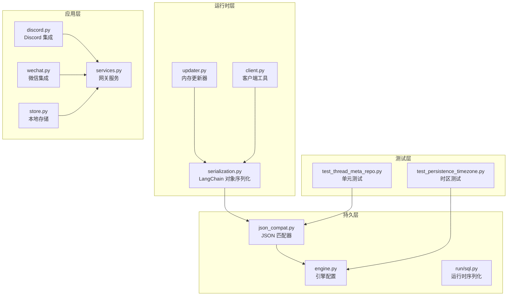
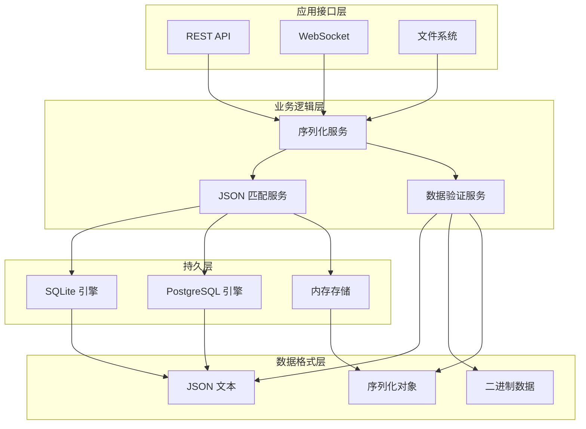
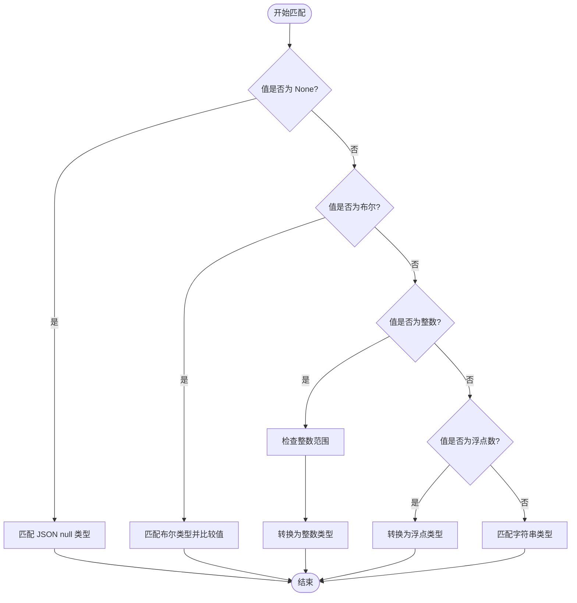
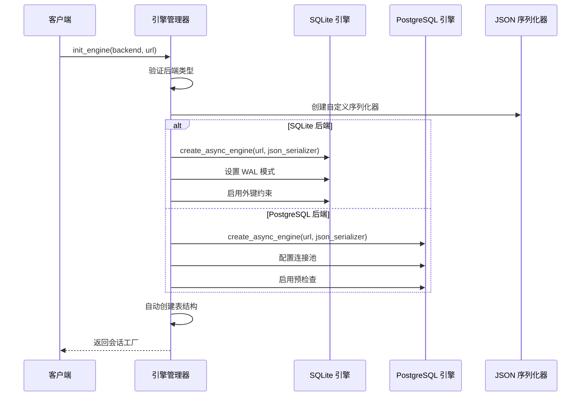
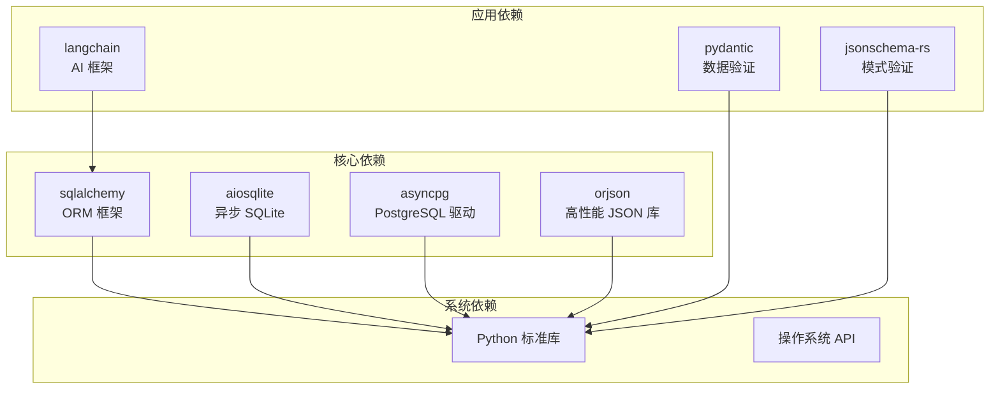
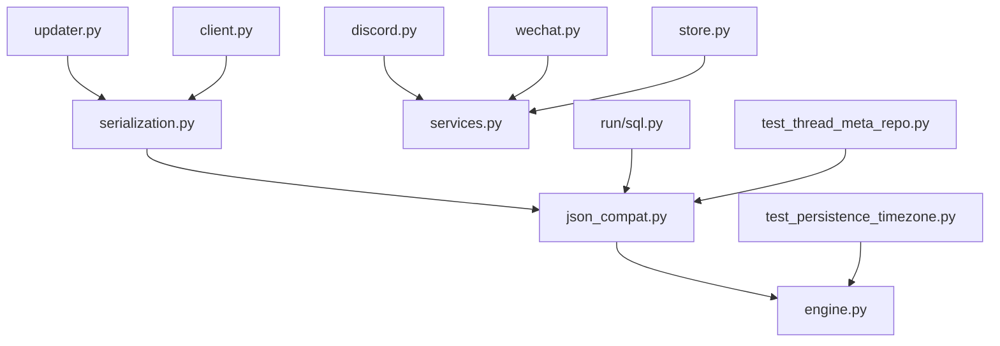

# JSON 兼容性处理

<cite>
**本文档引用的文件**
- [json_compat.py](file://backend/packages/harness/deerflow/persistence/json_compat.py)
- [engine.py](file://backend/packages/harness/deerflow/persistence/engine.py)
- [serialization.py](file://backend/packages/harness/deerflow/runtime/serialization.py)
- [run/sql.py](file://backend/packages/harness/deerflow/persistence/run/sql.py)
- [test_thread_meta_repo.py](file://backend/tests/test_thread_meta_repo.py)
- [test_persistence_timezone.py](file://backend/tests/test_persistence_timezone.py)
- [discord.py](file://backend/app/channels/discord.py)
- [wechat.py](file://backend/app/channels/wechat.py)
- [store.py](file://backend/app/channels/store.py)
- [services.py](file://backend/app/gateway/services.py)
- [updater.py](file://backend/packages/harness/deerflow/agents/memory/updater.py)
- [client.py](file://backend/packages/harness/deerflow/client.py)
- [uv.lock](file://backend/uv.lock)
</cite>

## 目录
1. [简介](#简介)
2. [项目结构](#项目结构)
3. [核心组件](#核心组件)
4. [架构概览](#架构概览)
5. [详细组件分析](#详细组件分析)
6. [依赖分析](#依赖分析)
7. [性能考虑](#性能考虑)
8. [故障排除指南](#故障排除指南)
9. [结论](#结论)

## 简介

DeerFlow 的 JSON 兼容性处理是一个跨数据库后端的统一解决方案，旨在确保在不同数据库系统中对 JSON 数据进行一致的序列化、反序列化和查询操作。该系统支持 SQLite 和 PostgreSQL 两种主要数据库后端，并提供了完整的数据类型转换规则和兼容性保证策略。

本系统的核心目标是在保持数据完整性的同时，提供高性能的 JSON 处理能力，支持中文字符编码、NULL 值处理和特殊字符转义。通过标准化的接口设计，开发者可以无缝地在不同数据库之间切换，而无需修改业务逻辑代码。

## 项目结构

DeerFlow 的 JSON 兼容性处理分布在多个关键模块中：



**图表来源**
- [json_compat.py:1-196](file://backend/packages/harness/deerflow/persistence/json_compat.py#L1-L196)
- [engine.py:1-200](file://backend/packages/harness/deerflow/persistence/engine.py#L1-L200)
- [serialization.py:1-79](file://backend/packages/harness/deerflow/runtime/serialization.py#L1-L79)

## 核心组件

### JSON 匹配器 (JsonMatch)

JsonMatch 是系统的核心组件，提供了跨数据库后端的 JSON 值匹配功能。它支持以下特性：

- **类型安全比较**：区分布尔值、整数、浮点数和字符串
- **NULL 值处理**：正确处理缺失键和显式 NULL 值
- **方言适配**：自动适配 SQLite 和 PostgreSQL 的语法差异
- **注入防护**：严格的键名验证和参数绑定

### 引擎配置管理

引擎配置负责设置数据库连接和 JSON 序列化选项：

- **自定义 JSON 序列化器**：支持中文字符的非 ASCII 编码
- **连接池管理**：PostgreSQL 使用连接池预检查
- **自动数据库创建**：PostgreSQL 数据库不存在时自动创建

### LangChain 对象序列化

专门处理 LangChain 消息对象和状态字典的序列化：

- **递归序列化**：支持嵌套的数据结构
- **模式特定处理**：针对不同模式（messages/values）提供定制化处理
- **内部键过滤**：移除框架内部使用的键

**章节来源**
- [json_compat.py:60-92](file://backend/packages/harness/deerflow/persistence/json_compat.py#L60-L92)
- [engine.py:19-21](file://backend/packages/harness/deerflow/persistence/engine.py#L19-L21)
- [serialization.py:16-42](file://backend/packages/harness/deerflow/runtime/serialization.py#L16-L42)

## 架构概览

DeerFlow 的 JSON 兼容性处理采用分层架构设计，确保了良好的可维护性和扩展性：



**图表来源**
- [engine.py:57-133](file://backend/packages/harness/deerflow/persistence/engine.py#L57-L133)
- [json_compat.py:168-195](file://backend/packages/harness/deerflow/persistence/json_compat.py#L168-L195)

## 详细组件分析

### JSON 匹配器实现

JsonMatch 类提供了统一的 JSON 查询接口，支持多种数据类型的精确匹配：

```mermaid
classDiagram
class JsonMatch {
+ColumnElement column
+string key
+object value
+Boolean type
+bool inherit_cache
+bool _is_implicitly_boolean
+__init__(column, key, value)
+validate_metadata_filter_key(key)
+validate_metadata_filter_value(value)
}
class _Dialect {
+string null_type
+tuple num_types
+string num_cast
+tuple int_types
+string int_cast
+string int_guard
+string string_type
+string bool_type
}
class _SQLITE {
+string null_type = "null"
+tuple num_types = ("integer", "real")
+string num_cast = "REAL"
+tuple int_types = ("integer",)
+string int_cast = "INTEGER"
+string int_guard = None
+string string_type = "text"
+string bool_type = None
}
class _PG {
+string null_type = "null"
+tuple num_types = ("number",)
+string num_cast = "DOUBLE PRECISION"
+tuple int_types = ("number",)
+string int_cast = "BIGINT"
+string int_guard = "'^-?[0-9+$'"
+string string_type = "string"
+string bool_type = "boolean"
}
JsonMatch --> _Dialect : "uses"
_Dialect <|-- _SQLITE : "extends"
_Dialect <|-- _PG : "extends"
```



**图表来源**
- [json_compat.py:60-131](file://backend/packages/harness/deerflow/persistence/json_compat.py#L60-L131)

#### 类型匹配算法

系统实现了精确的类型匹配算法，确保不同数据类型不会产生意外的匹配结果：



**图表来源**
- [json_compat.py:146-165](file://backend/packages/harness/deerflow/persistence/json_compat.py#L146-L165)

**章节来源**
- [json_compat.py:28-57](file://backend/packages/harness/deerflow/persistence/json_compat.py#L28-L57)
- [json_compat.py:168-195](file://backend/packages/harness/deerflow/persistence/json_compat.py#L168-L195)

### 引擎初始化流程

数据库引擎的初始化过程确保了 JSON 处理的一致性和可靠性：



**图表来源**
- [engine.py:57-133](file://backend/packages/harness/deerflow/persistence/engine.py#L57-L133)

**章节来源**
- [engine.py:101-131](file://backend/packages/harness/deerflow/persistence/engine.py#L101-L131)

### LangChain 对象序列化

系统提供了专门的序列化服务来处理 LangChain 框架的对象：

```mermaid
flowchart TD
Input[输入对象] --> CheckType{"检查对象类型"}
CheckType --> |None| ReturnNone[返回 None]
CheckType --> |基本类型| ReturnBasic[直接返回]
CheckType --> |字典| DictHandler[递归处理字典]
CheckType --> |列表/元组| ListHandler[递归处理序列]
CheckType --> |Pydantic v2| ModelDump[v2 model_dump()]
CheckType --> |Pydantic v1| DictMethod[v1 dict()]
CheckType --> |其他| Fallback[字符串或表示形式]
DictHandler --> DictResult[返回序列化字典]
ListHandler --> ListResult[返回序列化列表]
ModelDump --> ModelResult[返回字典]
DictMethod --> DictResult
Fallback --> FallbackResult[返回字符串]
ReturnNone --> End[结束]
ReturnBasic --> End
DictResult --> End
ListResult --> End
ModelResult --> End
FallbackResult --> End
```

**图表来源**
- [serialization.py:16-42](file://backend/packages/harness/deerflow/runtime/serialization.py#L16-L42)

**章节来源**
- [serialization.py:45-79](file://backend/packages/harness/deerflow/runtime/serialization.py#L45-L79)

## 依赖分析

### 外部依赖关系

系统对外部库的依赖主要集中在 JSON 处理和数据库访问方面：



**图表来源**
- [uv.lock:1667-1675](file://backend/uv.lock#L1667-L1675)
- [uv.lock:2734-2742](file://backend/uv.lock#L2734-L2742)

### 内部模块依赖



**图表来源**
- [json_compat.py:1-196](file://backend/packages/harness/deerflow/persistence/json_compat.py#L1-L196)
- [engine.py:1-200](file://backend/packages/harness/deerflow/persistence/engine.py#L1-L200)

**章节来源**
- [uv.lock:1667-1675](file://backend/uv.lock#L1667-L1675)
- [uv.lock:2734-2742](file://backend/uv.lock#L2734-L2742)

## 性能考虑

### JSON 处理优化策略

DeerFlow 实现了多项性能优化措施来提升 JSON 处理效率：

1. **批量序列化**：使用高效的序列化库减少 CPU 开销
2. **连接池复用**：避免频繁的数据库连接创建销毁
3. **缓存策略**：对常用查询结果进行缓存
4. **内存管理**：优化大对象的内存使用模式

### 大数据 JSON 处理最佳实践

对于大规模 JSON 数据的处理，建议采用以下策略：

- **流式处理**：使用迭代器模式处理大型 JSON 结构
- **分页加载**：对大量数据进行分页处理
- **压缩传输**：在网络传输中启用压缩
- **增量更新**：只更新发生变化的部分

## 故障排除指南

### 常见问题及解决方案

#### JSON 类型不匹配

当遇到 JSON 类型不匹配错误时，检查以下几点：

1. **数据类型验证**：确保传入的数据类型符合允许的集合
2. **整数范围检查**：确认整数值在 64 位有符号范围内
3. **键名安全性**：验证 JSON 键名符合字符集要求

#### 数据库兼容性问题

不同数据库后端可能存在兼容性差异：

- **SQLite**：使用 `json_type` 和 `json_extract` 函数
- **PostgreSQL**：使用 `json_typeof` 和 `->>` 操作符
- **类型转换**：注意不同数据库的类型转换规则

#### 编码问题

系统通过自定义 JSON 序列化器支持中文字符：

- **ensure_ascii=False**：允许非 ASCII 字符直接输出
- **UTF-8 编码**：确保文件和网络传输使用 UTF-8
- **BOM 处理**：避免 BOM 字符影响 JSON 解析

**章节来源**
- [json_compat.py:28-57](file://backend/packages/harness/deerflow/persistence/json_compat.py#L28-L57)
- [engine.py:19-21](file://backend/packages/harness/deerflow/persistence/engine.py#L19-L21)
- [test_thread_meta_repo.py:383-550](file://backend/tests/test_thread_meta_repo.py#L383-L550)

## 结论

DeerFlow 的 JSON 兼容性处理系统通过精心设计的架构和实现，成功解决了多数据库后端的 JSON 数据处理挑战。系统的主要优势包括：

1. **跨平台兼容性**：统一的接口设计支持 SQLite 和 PostgreSQL
2. **类型安全保证**：严格的类型检查防止意外的数据转换
3. **性能优化**：高效的序列化和查询机制
4. **扩展性强**：模块化设计便于功能扩展和维护

该系统为开发者提供了一个可靠、高效且易于使用的 JSON 处理解决方案，能够满足各种复杂应用场景的需求。通过持续的优化和改进，DeerFlow 的 JSON 兼容性处理将继续为用户提供卓越的开发体验。