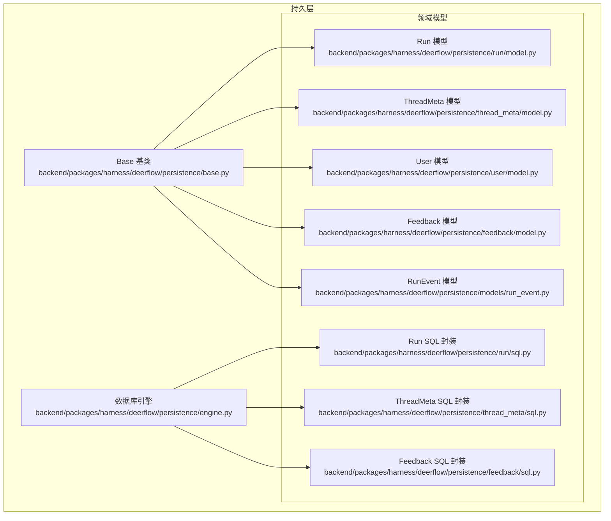
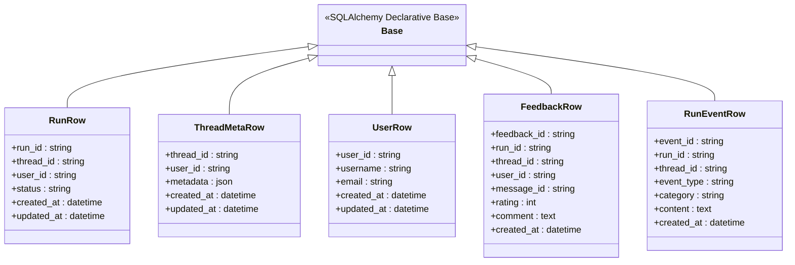
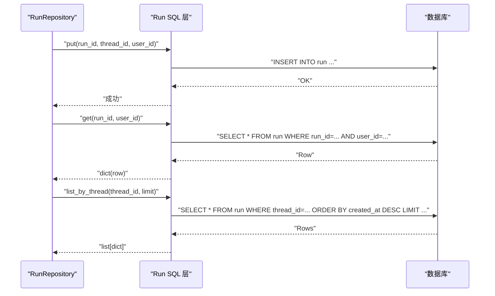
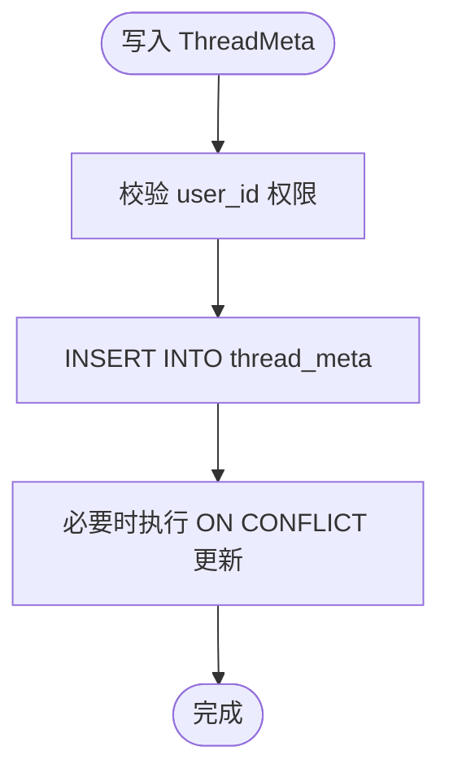
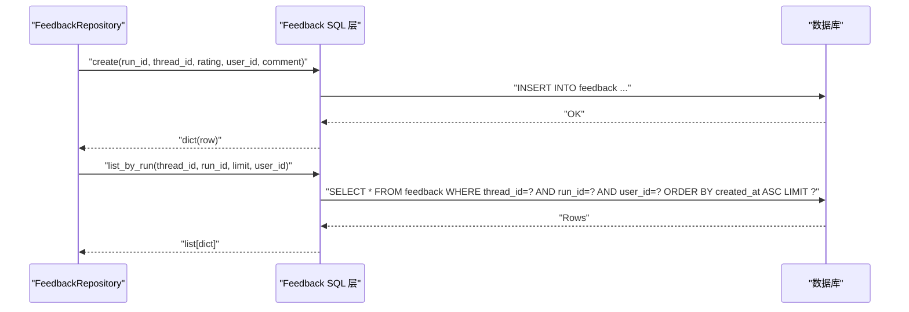
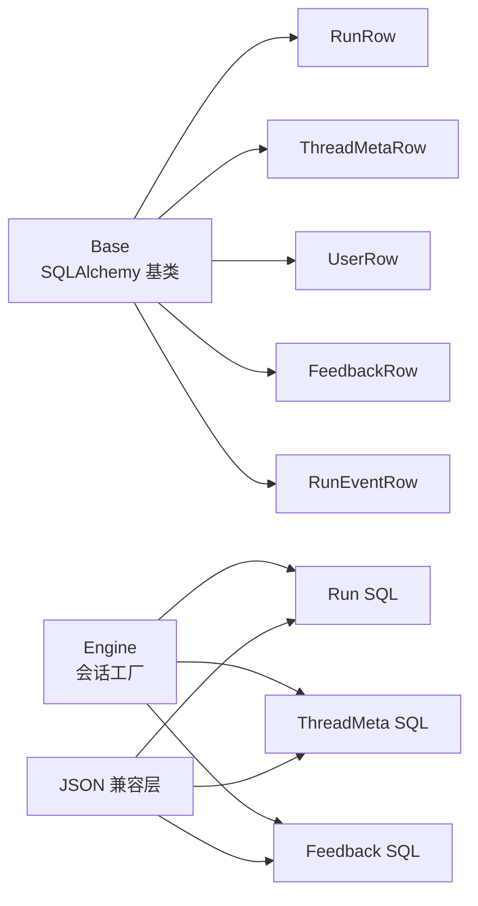

# 数据库模型设计

<cite>
**本文引用的文件**
- [backend/packages/harness/deerflow/persistence/base.py](file://backend/packages/harness/deerflow/persistence/base.py)
- [backend/packages/harness/deerflow/persistence/run/model.py](file://backend/packages/harness/deerflow/persistence/run/model.py)
- [backend/packages/harness/deerflow/persistence/run/sql.py](file://backend/packages/harness/deerflow/persistence/run/sql.py)
- [backend/packages/harness/deerflow/persistence/thread_meta/model.py](file://backend/packages/harness/deerflow/persistence/thread_meta/model.py)
- [backend/packages/harness/deerflow/persistence/thread_meta/sql.py](file://backend/packages/harness/deerflow/persistence/thread_meta/sql.py)
- [backend/packages/harness/deerflow/persistence/user/model.py](file://backend/packages/harness/deerflow/persistence/user/model.py)
- [backend/packages/harness/deerflow/persistence/feedback/model.py](file://backend/packages/harness/deerflow/persistence/feedback/model.py)
- [backend/packages/harness/deerflow/persistence/feedback/sql.py](file://backend/packages/harness/deerflow/persistence/feedback/sql.py)
- [backend/packages/harness/deerflow/persistence/models/run_event.py](file://backend/packages/harness/deerflow/persistence/models/run_event.py)
- [backend/packages/harness/deerflow/persistence/engine.py](file://backend/packages/harness/deerflow/persistence/engine.py)
- [backend/packages/harness/deerflow/persistence/json_compat.py](file://backend/packages/harness/deerflow/persistence/json_compat.py)
- [backend/tests/test_persistence_timezone.py](file://backend/tests/test_persistence_timezone.py)
</cite>

## 目录
1. [简介](#简介)
2. [项目结构](#项目结构)
3. [核心组件](#核心组件)
4. [架构总览](#架构总览)
5. [详细组件分析](#详细组件分析)
6. [依赖分析](#依赖分析)
7. [性能考虑](#性能考虑)
8. [故障排查指南](#故障排查指南)
9. [结论](#结论)
10. [附录](#附录)

## 简介
本文件系统性梳理 DeerFlow 的数据库模型设计，聚焦于核心实体：RunEvent、ThreadMeta、User、Run、Feedback。文档从设计理念、实体关系、字段规范、索引策略、数据验证与序列化机制、跨模型关联查询最佳实践等方面展开，并提供模型扩展与自定义字段添加指南，帮助开发者在不破坏现有约束的前提下进行演进。

## 项目结构
DeerFlow 的持久层采用“按功能域分包”的组织方式，核心模型位于 deerflow.persistence.* 子模块中，每个领域（run、thread_meta、user、feedback）均包含 ORM 模型定义与 SQL 查询封装，统一继承自基础基类，使用 SQLAlchemy ORM 进行映射与查询。

**图表来源**
- [backend/packages/harness/deerflow/persistence/base.py](file://backend/packages/harness/deerflow/persistence/base.py)
- [backend/packages/harness/deerflow/persistence/engine.py](file://backend/packages/harness/deerflow/persistence/engine.py)
- [backend/packages/harness/deerflow/persistence/run/model.py](file://backend/packages/harness/deerflow/persistence/run/model.py)
- [backend/packages/harness/deerflow/persistence/run/sql.py](file://backend/packages/harness/deerflow/persistence/run/sql.py)
- [backend/packages/harness/deerflow/persistence/thread_meta/model.py](file://backend/packages/harness/deerflow/persistence/thread_meta/model.py)
- [backend/packages/harness/deerflow/persistence/thread_meta/sql.py](file://backend/packages/harness/deerflow/persistence/thread_meta/sql.py)
- [backend/packages/harness/deerflow/persistence/user/model.py](file://backend/packages/harness/deerflow/persistence/user/model.py)
- [backend/packages/harness/deerflow/persistence/feedback/model.py](file://backend/packages/harness/deerflow/persistence/feedback/model.py)
- [backend/packages/harness/deerflow/persistence/feedback/sql.py](file://backend/packages/harness/deerflow/persistence/feedback/sql.py)
- [backend/packages/harness/deerflow/persistence/models/run_event.py](file://backend/packages/harness/deerflow/persistence/models/run_event.py)

**章节来源**
- [backend/packages/harness/deerflow/persistence/base.py](file://backend/packages/harness/deerflow/persistence/base.py)
- [backend/packages/harness/deerflow/persistence/engine.py](file://backend/packages/harness/deerflow/persistence/engine.py)

## 核心组件
本节概述五个关键模型的设计理念与职责边界：
- RunEvent：记录运行过程中的事件流，支持分页与时间序列检索。
- ThreadMeta：线程元信息存储，用于管理会话上下文与用户隔离。
- User：用户身份与权限相关的基本信息。
- Run：一次具体执行实例的状态与元数据。
- Feedback：对某次运行或消息的评分与评论反馈。

这些模型通过统一的 Base 类进行 ORM 映射，遵循一致的命名约定、索引策略与时区处理规范。

**章节来源**
- [backend/packages/harness/deerflow/persistence/models/run_event.py](file://backend/packages/harness/deerflow/persistence/models/run_event.py)
- [backend/packages/harness/deerflow/persistence/thread_meta/model.py](file://backend/packages/harness/deerflow/persistence/thread_meta/model.py)
- [backend/packages/harness/deerflow/persistence/user/model.py](file://backend/packages/harness/deerflow/persistence/user/model.py)
- [backend/packages/harness/deerflow/persistence/run/model.py](file://backend/packages/harness/deerflow/persistence/run/model.py)
- [backend/packages/harness/deerflow/persistence/feedback/model.py](file://backend/packages/harness/deerflow/persistence/feedback/model.py)

## 架构总览
下图展示模型层与查询层的交互关系，以及统一基类与引擎的作用：

**图表来源**
- [backend/packages/harness/deerflow/persistence/base.py](file://backend/packages/harness/deerflow/persistence/base.py)
- [backend/packages/harness/deerflow/persistence/run/model.py](file://backend/packages/harness/deerflow/persistence/run/model.py)
- [backend/packages/harness/deerflow/persistence/thread_meta/model.py](file://backend/packages/harness/deerflow/persistence/thread_meta/model.py)
- [backend/packages/harness/deerflow/persistence/user/model.py](file://backend/packages/harness/deerflow/persistence/user/model.py)
- [backend/packages/harness/deerflow/persistence/feedback/model.py](file://backend/packages/harness/deerflow/persistence/feedback/model.py)
- [backend/packages/harness/deerflow/persistence/models/run_event.py](file://backend/packages/harness/deerflow/persistence/models/run_event.py)

## 详细组件分析

### Run 模型
- 设计理念：Run 表示一次具体的执行实例，承载状态、用户与线程关联等关键信息，便于跨接口查询与审计。
- 字段与约束：
  - 主键：run_id（字符串）
  - 外键/关联：thread_id、user_id
  - 状态：status（枚举/受限集合）
  - 时间戳：created_at、updated_at（带时区）
- 索引策略：基于 thread_id、user_id 的复合查询频繁，建议在查询路径上建立相应索引以优化性能。
- 序列化：统一使用 JSON 兼容层进行序列化，确保跨服务一致性。

**图表来源**
- [backend/packages/harness/deerflow/persistence/run/sql.py](file://backend/packages/harness/deerflow/persistence/run/sql.py)
- [backend/packages/harness/deerflow/persistence/run/model.py](file://backend/packages/harness/deerflow/persistence/run/model.py)

**章节来源**
- [backend/packages/harness/deerflow/persistence/run/model.py](file://backend/packages/harness/deerflow/persistence/run/model.py)
- [backend/packages/harness/deerflow/persistence/run/sql.py](file://backend/packages/harness/deerflow/persistence/run/sql.py)

### ThreadMeta 模型
- 设计理念：存储线程级别的元信息，支持用户隔离与上下文管理。
- 字段与约束：
  - 主键：thread_id
  - 关联：user_id
  - 元数据：JSON 类型字段，支持灵活扩展
  - 时间戳：created_at、updated_at（带时区）
- 索引策略：按 thread_id 查询为主，user_id 作为过滤条件，建议在 user_id 上建立索引以提升多租户场景下的查询效率。

**图表来源**
- [backend/packages/harness/deerflow/persistence/thread_meta/model.py](file://backend/packages/harness/deerflow/persistence/thread_meta/model.py)
- [backend/packages/harness/deerflow/persistence/thread_meta/sql.py](file://backend/packages/harness/deerflow/persistence/thread_meta/sql.py)

**章节来源**
- [backend/packages/harness/deerflow/persistence/thread_meta/model.py](file://backend/packages/harness/deerflow/persistence/thread_meta/model.py)
- [backend/packages/harness/deerflow/persistence/thread_meta/sql.py](file://backend/packages/harness/deerflow/persistence/thread_meta/sql.py)

### User 模型
- 设计理念：最小可用用户信息模型，支撑用户隔离与鉴权。
- 字段与约束：
  - 主键：user_id
  - 唯一标识：username、email（可选唯一约束）
  - 时间戳：created_at、updated_at（带时区）

**章节来源**
- [backend/packages/harness/deerflow/persistence/user/model.py](file://backend/packages/harness/deerflow/persistence/user/model.py)

### Feedback 模型
- 设计理念：对单次运行或特定消息进行评分与评论，支持唯一性约束避免重复反馈。
- 字段与约束：
  - 主键：feedback_id
  - 联合唯一：thread_id + run_id + user_id
  - 关联：run_id、thread_id、user_id、message_id（可空）
  - 评分：+1/-1 整数
  - 评论：文本字段
  - 时间戳：created_at（带时区）
- 查询模式：按 run_id 或 thread_id 列表查询，支持按时间排序与限制数量。

**图表来源**
- [backend/packages/harness/deerflow/persistence/feedback/sql.py](file://backend/packages/harness/deerflow/persistence/feedback/sql.py)
- [backend/packages/harness/deerflow/persistence/feedback/model.py](file://backend/packages/harness/deerflow/persistence/feedback/model.py)

**章节来源**
- [backend/packages/harness/deerflow/persistence/feedback/model.py](file://backend/packages/harness/deerflow/persistence/feedback/model.py)
- [backend/packages/harness/deerflow/persistence/feedback/sql.py](file://backend/packages/harness/deerflow/persistence/feedback/sql.py)

### RunEvent 模型
- 设计理念：事件驱动的数据流记录，支持日志、消息、中间态等多类别事件，便于回放与审计。
- 字段与约束：
  - 主键：event_id
  - 关联：run_id、thread_id
  - 类别：event_type、category（区分事件类型与子类）
  - 内容：content（文本/JSON）
  - 时间戳：created_at（带时区）
- 查询模式：按 run_id/thread_id 分页查询，支持时间范围与类型过滤。

**章节来源**
- [backend/packages/harness/deerflow/persistence/models/run_event.py](file://backend/packages/harness/deerflow/persistence/models/run_event.py)

## 依赖分析
- 继承体系：所有模型统一继承自 Base，确保一致的元数据、序列化与生命周期行为。
- 引擎与会话：通过 engine 提供的会话工厂创建异步会话，SQL 层负责构建查询语句并返回字典结果。
- JSON 兼容：json_compat 提供序列化/反序列化工具，保证跨服务一致性与可移植性。

**图表来源**
- [backend/packages/harness/deerflow/persistence/base.py](file://backend/packages/harness/deerflow/persistence/base.py)
- [backend/packages/harness/deerflow/persistence/engine.py](file://backend/packages/harness/deerflow/persistence/engine.py)
- [backend/packages/harness/deerflow/persistence/json_compat.py](file://backend/packages/harness/deerflow/persistence/json_compat.py)
- [backend/packages/harness/deerflow/persistence/run/sql.py](file://backend/packages/harness/deerflow/persistence/run/sql.py)
- [backend/packages/harness/deerflow/persistence/thread_meta/sql.py](file://backend/packages/harness/deerflow/persistence/thread_meta/sql.py)
- [backend/packages/harness/deerflow/persistence/feedback/sql.py](file://backend/packages/harness/deerflow/persistence/feedback/sql.py)

**章节来源**
- [backend/packages/harness/deerflow/persistence/base.py](file://backend/packages/harness/deerflow/persistence/base.py)
- [backend/packages/harness/deerflow/persistence/engine.py](file://backend/packages/harness/deerflow/persistence/engine.py)
- [backend/packages/harness/deerflow/persistence/json_compat.py](file://backend/packages/harness/deerflow/persistence/json_compat.py)

## 性能考虑
- 索引策略
  - Run：优先按 thread_id、user_id 查询，建议在上述字段建立索引；对 created_at 建立索引以支持时间序列查询。
  - ThreadMeta：按 user_id 建立索引，提升多租户隔离查询效率。
  - Feedback：联合唯一索引已覆盖 thread_id + run_id + user_id，避免重复反馈；按 run_id、thread_id 建立索引以支持列表查询。
  - RunEvent：按 run_id、thread_id、created_at 建立复合索引，优化分页与时间序列扫描。
- 时区处理：所有时间戳统一使用带时区的 DateTime，默认值使用 UTC，测试用例验证了时区感知的时间戳输出。
- 序列化：通过 JSON 兼容层进行序列化，减少跨语言/跨服务差异带来的问题。

**章节来源**
- [backend/tests/test_persistence_timezone.py](file://backend/tests/test_persistence_timezone.py)
- [backend/packages/harness/deerflow/persistence/json_compat.py](file://backend/packages/harness/deerflow/persistence/json_compat.py)

## 故障排查指南
- 时区异常
  - 现象：时间戳显示不正确或比较失败。
  - 排查：确认默认时区设置与数据库连接配置；参考测试用例验证 created_at/updated_at 是否为带时区对象。
- 唯一约束冲突
  - 现象：插入 Feedback 时抛出唯一约束错误。
  - 排查：检查 thread_id、run_id、user_id 的组合是否已存在；必要时先查询再决定插入或更新。
- 查询性能下降
  - 现象：按 run_id/thread_id 列表查询变慢。
  - 排查：确认相关字段是否建立索引；检查查询语句是否包含不必要的排序或过滤；适当调整分页大小与排序方向。

**章节来源**
- [backend/tests/test_persistence_timezone.py](file://backend/tests/test_persistence_timezone.py)
- [backend/packages/harness/deerflow/persistence/feedback/sql.py](file://backend/packages/harness/deerflow/persistence/feedback/sql.py)

## 结论
DeerFlow 的数据库模型围绕“事件驱动 + 用户隔离”的核心目标设计，RunEvent、ThreadMeta、User、Run、Feedback 各司其职，配合统一的基类与引擎，形成清晰、可扩展且具备良好性能特征的持久层架构。通过合理的索引策略与时区处理，能够在高并发与多租户场景下保持稳定表现。

## 附录

### 模型扩展与自定义字段指南
- 扩展步骤
  - 在对应领域目录新增模型文件，继承 Base 并定义字段与约束。
  - 在同目录下新增 SQL 文件，封装常用查询逻辑（如 get/list/create/update）。
  - 在 engine 中注册会话工厂（如已有则复用），并在 SQL 层通过会话工厂创建会话。
  - 在 json_compat 中补充必要的序列化/反序列化逻辑，确保对外输出一致。
- 自定义字段添加
  - 新增字段需明确是否需要索引；对于高频查询字段建议建立索引。
  - 对于 JSON 类型字段，建议提供默认值与校验逻辑，避免空值导致的解析异常。
  - 修改模型后，通过迁移脚本生成并应用数据库变更，确保生产环境安全升级。

**章节来源**
- [backend/packages/harness/deerflow/persistence/base.py](file://backend/packages/harness/deerflow/persistence/base.py)
- [backend/packages/harness/deerflow/persistence/engine.py](file://backend/packages/harness/deerflow/persistence/engine.py)
- [backend/packages/harness/deerflow/persistence/json_compat.py](file://backend/packages/harness/deerflow/persistence/json_compat.py)