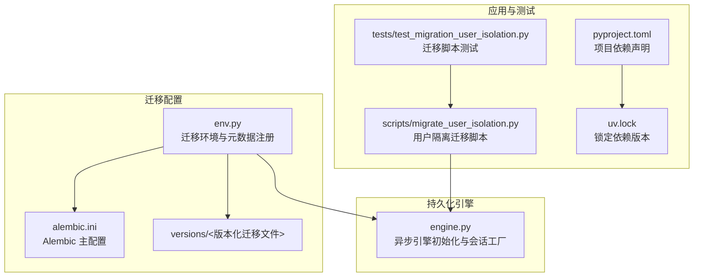
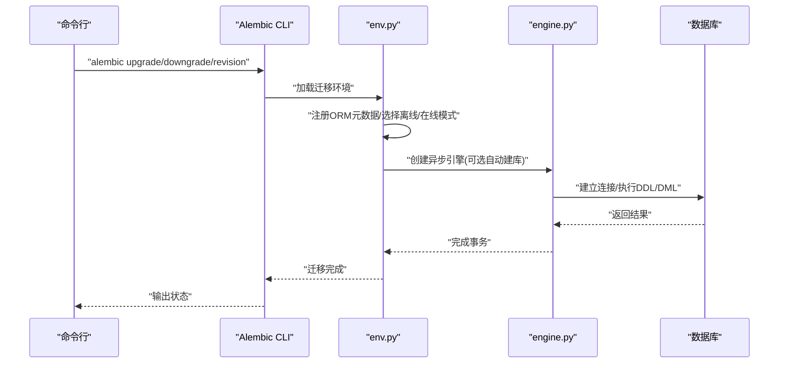
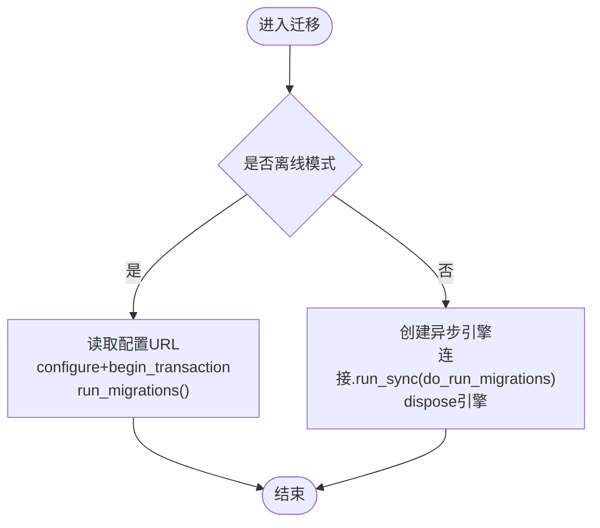
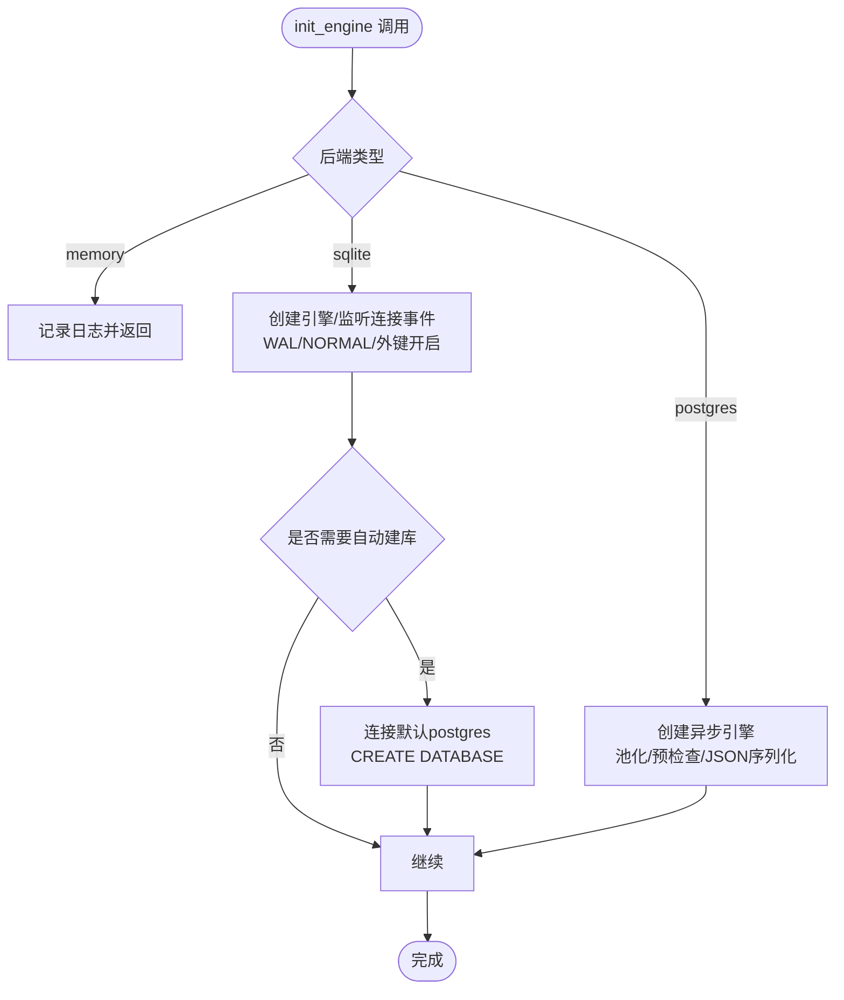
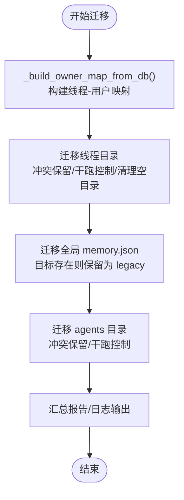
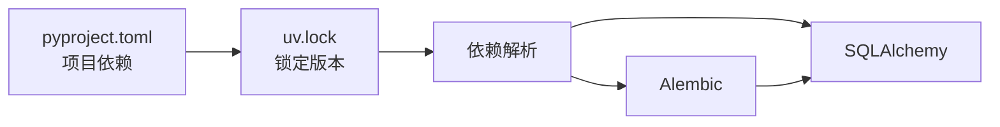
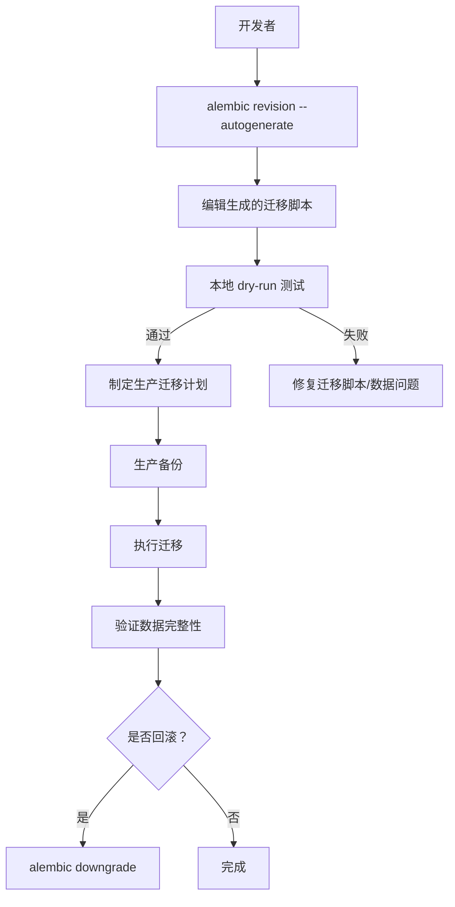

# 数据库迁移管理

<cite>
**本文引用的文件**
- [env.py](file://backend/packages/harness/deerflow/persistence/migrations/env.py)
- [alembic.ini](file://backend/packages/harness/deerflow/persistence/migrations/alembic.ini)
- [engine.py](file://backend/packages/harness/deerflow/persistence/engine.py)
- [migrate_user_isolation.py](file://backend/scripts/migrate_user_isolation.py)
- [test_migration_user_isolation.py](file://backend/tests/test_migration_user_isolation.py)
- [uv.lock](file://backend/uv.lock)
- [pyproject.toml](file://backend/pyproject.toml)
- [config-upgrade.sh](file://scripts/config-upgrade.sh)
</cite>

## 目录
1. [简介](#简介)
2. [项目结构](#项目结构)
3. [核心组件](#核心组件)
4. [架构总览](#架构总览)
5. [详细组件分析](#详细组件分析)
6. [依赖关系分析](#依赖关系分析)
7. [性能考量](#性能考量)
8. [故障排查指南](#故障排查指南)
9. [结论](#结论)
10. [附录](#附录)

## 简介
本文件面向 DeerFlow 的数据库迁移管理，系统性阐述基于 Alembic 的迁移框架配置与使用方法，覆盖迁移文件生成、版本管理、回滚策略、迁移脚本编写规范、数据迁移模式与结构变更处理流程，并提供面向生产的最佳实践（含向后兼容性、生产迁移步骤与故障恢复）、复杂数据迁移场景与批量转换处理建议。

## 项目结构
DeerFlow 后端采用异步 SQLAlchemy 引擎与 Alembic 迁移工具，迁移环境由独立模块维护，仅管理 DeerFlow 自身表空间（runs、threads_meta、cron_jobs、users），LangGraph 检查点表由 LangGraph 自行生命周期管理，避免 Alembic 干扰。

图表来源
- [env.py:1-67](file://backend/packages/harness/deerflow/persistence/migrations/env.py#L1-L67)
- [alembic.ini](file://backend/packages/harness/deerflow/persistence/migrations/alembic.ini)
- [engine.py:1-199](file://backend/packages/harness/deerflow/persistence/engine.py#L1-L199)
- [migrate_user_isolation.py:116-254](file://backend/scripts/migrate_user_isolation.py#L116-L254)
- [test_migration_user_isolation.py:44-192](file://backend/tests/test_migration_user_isolation.py#L44-L192)
- [pyproject.toml](file://backend/pyproject.toml)
- [uv.lock:162-173](file://backend/uv.lock#L162-L173)

章节来源
- [env.py:1-67](file://backend/packages/harness/deerflow/persistence/migrations/env.py#L1-L67)
- [alembic.ini](file://backend/packages/harness/deerflow/persistence/migrations/alembic.ini)
- [engine.py:1-199](file://backend/packages/harness/deerflow/persistence/engine.py#L1-L199)
- [migrate_user_isolation.py:116-254](file://backend/scripts/migrate_user_isolation.py#L116-L254)
- [test_migration_user_isolation.py:44-192](file://backend/tests/test_migration_user_isolation.py#L44-L192)
- [uv.lock:162-173](file://backend/uv.lock#L162-L173)
- [pyproject.toml](file://backend/pyproject.toml)

## 核心组件
- Alembic 迁移环境：负责注册 ORM 元数据、离线/在线迁移执行、SQLite 批处理渲染等。
- 异步引擎与会话工厂：统一数据库连接、池化、WAL/同步模式设置、PostgreSQL 自动建库等。
- 用户隔离迁移脚本：处理历史全局数据到按用户隔离布局的迁移，包含冲突保留、干跑校验、清理空目录等。
- 测试用例：验证迁移幂等性、冲突保留、干跑不移动、空目录清理等行为。
- 依赖与锁定：明确 Alembic 版本与 SQLAlchemy 依赖，确保迁移环境一致性。

章节来源
- [env.py:1-67](file://backend/packages/harness/deerflow/persistence/migrations/env.py#L1-L67)
- [engine.py:1-199](file://backend/packages/harness/deerflow/persistence/engine.py#L1-L199)
- [migrate_user_isolation.py:116-254](file://backend/scripts/migrate_user_isolation.py#L116-L254)
- [test_migration_user_isolation.py:44-192](file://backend/tests/test_migration_user_isolation.py#L44-L192)
- [uv.lock:162-173](file://backend/uv.lock#L162-L173)

## 架构总览
下图展示迁移执行的关键路径：从 Alembic CLI 到 env.py，再到异步引擎与数据库；同时体现用户隔离迁移脚本与测试的关系。

图表来源
- [env.py:35-67](file://backend/packages/harness/deerflow/persistence/migrations/env.py#L35-L67)
- [engine.py:57-131](file://backend/packages/harness/deerflow/persistence/engine.py#L57-L131)

## 详细组件分析

### Alembic 迁移环境（env.py）
- 元数据注册：导入 ORM 模块以填充 Base.metadata，若导入失败则记录警告，不影响已有元数据迁移。
- 离线迁移：通过配置文件中的 sqlalchemy.url 渲染迁移，启用批处理渲染以支持 SQLite 的 ALTER TABLE。
- 在线迁移：创建异步引擎并使用连接执行迁移，事务内运行迁移。
- 注意事项：仅管理 DeerFlow 表空间，LangGraph 检查点表由 LangGraph 自管，避免 Alembic 干扰。

图表来源
- [env.py:35-67](file://backend/packages/harness/deerflow/persistence/migrations/env.py#L35-L67)

章节来源
- [env.py:1-67](file://backend/packages/harness/deerflow/persistence/migrations/env.py#L1-L67)

### 异步引擎与会话工厂（engine.py）
- 初始化策略：
  - 内存后端：不初始化 ORM 引擎，仓库需降级为内存实现。
  - SQLite：启用 WAL、NORMAL 同步、外键约束；自动创建数据库目录。
  - PostgreSQL：连接池、预检查、JSON 序列化器。
- 自动建库：当目标数据库不存在时，连接默认 postgres 数据库进行 AUTOCOMMIT 下的 CREATE DATABASE。
- 生命周期：启动初始化、关闭释放连接。

图表来源
- [engine.py:57-131](file://backend/packages/harness/deerflow/persistence/engine.py#L57-L131)
- [engine.py:30-55](file://backend/packages/harness/deerflow/persistence/engine.py#L30-L55)

章节来源
- [engine.py:1-199](file://backend/packages/harness/deerflow/persistence/engine.py#L1-L199)

### 用户隔离迁移脚本（migrate_user_isolation.py）
- 功能范围：
  - 将历史全局线程目录迁移到 per-user 布局，保留冲突内容至冲突目录。
  - 将全局 memory.json 移动到 per-user 布局，避免覆盖现有用户数据。
  - 将历史 agents 目录迁移到 per-user 布局，冲突保留并记录报告。
  - 支持 dry-run，不实际移动文件，仅生成报告。
  - 清理空的遗留目录。
- 报告与日志：对每个动作生成条目，包含源、目标、操作类型；未拥有者线程分配给默认用户。
- 与测试联动：通过单元测试验证幂等、冲突保留、干跑不移动、空目录清理等。

图表来源
- [migrate_user_isolation.py:116-254](file://backend/scripts/migrate_user_isolation.py#L116-L254)

章节来源
- [migrate_user_isolation.py:116-254](file://backend/scripts/migrate_user_isolation.py#L116-L254)
- [test_migration_user_isolation.py:44-192](file://backend/tests/test_migration_user_isolation.py#L44-L192)

### 配置升级脚本（config-upgrade.sh）
- 作用：对比当前配置与示例配置版本，增量合并新增字段，备份旧配置，更新版本号。
- 适用场景：在不破坏既有配置的前提下平滑升级配置结构，减少手动维护成本。

章节来源
- [config-upgrade.sh:46-155](file://scripts/config-upgrade.sh#L46-L155)

## 依赖关系分析
- Alembic 依赖 SQLAlchemy 与模板引擎，确保迁移模板与 SQL 方言兼容。
- 项目使用异步 SQLAlchemy，迁移环境通过异步引擎执行在线迁移。
- 锁定文件确保迁移工具链版本稳定，避免因版本差异导致迁移失败。

图表来源
- [pyproject.toml](file://backend/pyproject.toml)
- [uv.lock:162-173](file://backend/uv.lock#L162-L173)

章节来源
- [uv.lock:162-173](file://backend/uv.lock#L162-L173)
- [pyproject.toml](file://backend/pyproject.toml)

## 性能考量
- SQLite 迁移批处理：启用批处理渲染以支持 ALTER TABLE，降低迁移失败风险。
- WAL 模式：SQLite 使用 WAL + NORMAL 同步，提升并发读写性能与可靠性。
- 连接池与预检查：PostgreSQL 设置连接池大小与 pre_ping，减少连接失效带来的重试开销。
- 大批量数据迁移：优先分批处理、索引优化、必要时禁用触发器/外键临时迁移再重建。

## 故障排查指南
- 迁移失败（SQLite ALTER TABLE）：确认已启用批处理渲染；检查是否存在未提交事务或锁竞争。
- 引擎初始化异常：核对数据库 URL、后端类型与权限；内存后端需确保仓库适配。
- 用户隔离迁移冲突：查看冲突目录与报告，确认目标已存在且不应被覆盖；必要时人工合并。
- 干跑验证：使用 dry-run 选项先评估迁移影响，确认无误后再执行真实迁移。
- 回滚策略：在受控环境下先备份数据库，使用 Alembic downgrades 回退到上一版本；生产前充分测试。

章节来源
- [env.py:35-67](file://backend/packages/harness/deerflow/persistence/migrations/env.py#L35-L67)
- [engine.py:57-131](file://backend/packages/harness/deerflow/persistence/engine.py#L57-L131)
- [migrate_user_isolation.py:116-254](file://backend/scripts/migrate_user_isolation.py#L116-L254)
- [test_migration_user_isolation.py:44-192](file://backend/tests/test_migration_user_isolation.py#L44-L192)

## 结论
DeerFlow 的数据库迁移管理以 Alembic 为核心，结合异步引擎与专用迁移脚本，实现了对自身表空间的可控演进与复杂数据布局迁移。通过批处理渲染、WAL 模式、连接池与预检查、冲突保留与干跑校验等机制，兼顾了开发效率与生产稳定性。建议在生产环境中严格遵循版本管理、备份与回滚策略，并持续完善测试覆盖以保障迁移质量。

## 附录

### 迁移工作流（概念示意）

[此图为概念流程，无需图表来源]