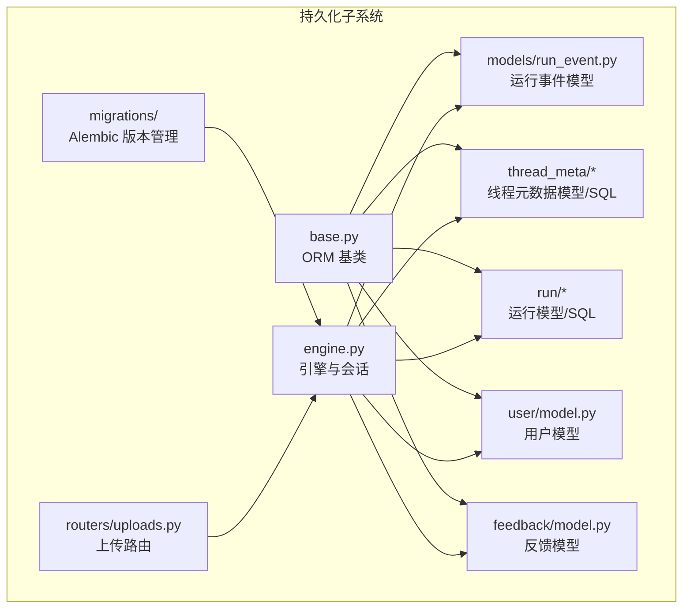
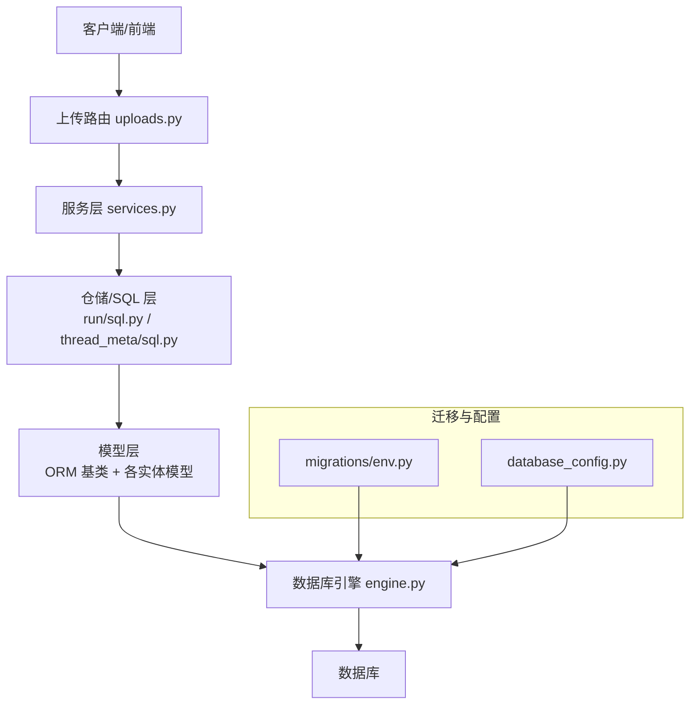
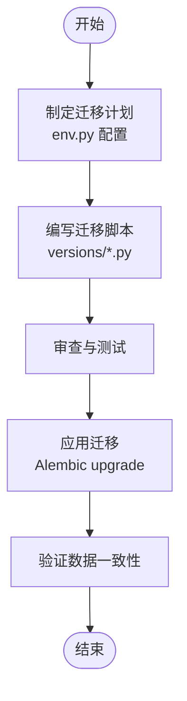
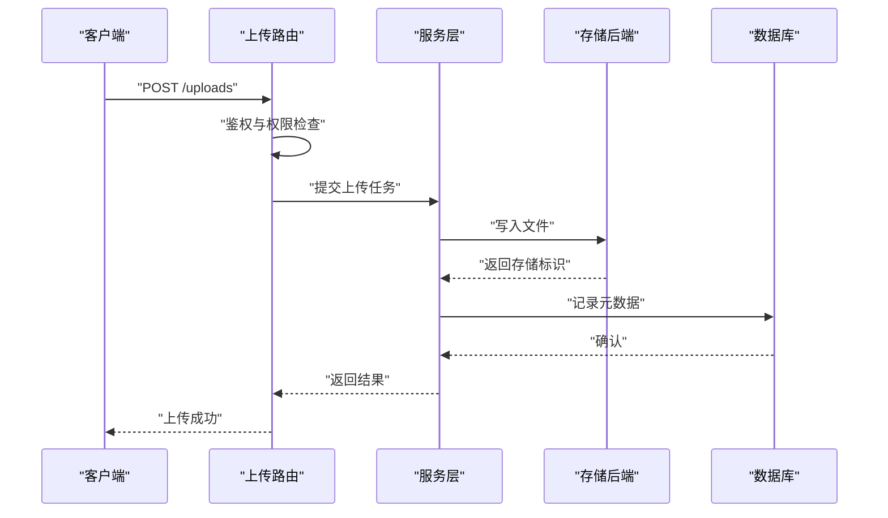
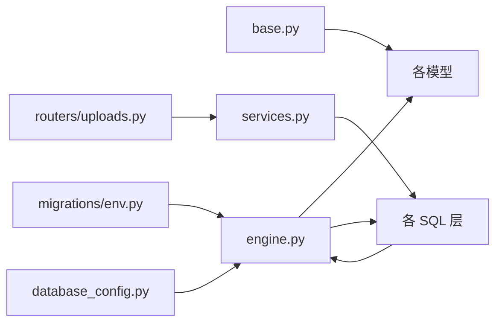

# 数据持久化系统

<cite>
**本文档引用的文件**
- [backend/packages/harness/deerflow/persistence/base.py](file://backend/packages/harness/deerflow/persistence/base.py)
- [backend/packages/harness/deerflow/persistence/engine.py](file://backend/packages/harness/deerflow/persistence/engine.py)
- [backend/packages/harness/deerflow/persistence/models/run_event.py](file://backend/packages/harness/deerflow/persistence/models/run_event.py)
- [backend/packages/harness/deerflow/persistence/thread_meta/model.py](file://backend/packages/harness/deerflow/persistence/thread_meta/model.py)
- [backend/packages/harness/deerflow/persistence/thread_meta/sql.py](file://backend/packages/harness/deerflow/persistence/thread_meta/sql.py)
- [backend/packages/harness/deerflow/persistence/run/model.py](file://backend/packages/harness/deerflow/persistence/run/model.py)
- [backend/packages/harness/deerflow/persistence/run/sql.py](file://backend/packages/harness/deerflow/persistence/run/sql.py)
- [backend/packages/harness/deerflow/persistence/user/model.py](file://backend/packages/harness/deerflow/persistence/user/model.py)
- [backend/packages/harness/deerflow/persistence/feedback/model.py](file://backend/packages/harness/deerflow/persistence/feedback/model.py)
- [backend/packages/harness/deerflow/persistence/migrations/env.py](file://backend/packages/harness/deerflow/persistence/migrations/env.py)
- [backend/packages/harness/deerflow/persistence/migrations/versions/](file://backend/packages/harness/deerflow/persistence/migrations/versions/)
- [backend/app/gateway/routers/uploads.py](file://backend/app/gateway/routers/uploads.py)
- [backend/app/gateway/services.py](file://backend/app/gateway/services.py)
- [backend/app/gateway/utils.py](file://backend/app/gateway/utils.py)
- [backend/packages/harness/deerflow/config/database_config.py](file://backend/packages/harness/deerflow/config/database_config.py)
- [backend/docs/FILE_UPLOAD.md](file://backend/docs/FILE_UPLOAD.md)
- [backend/docs/AUTH_DESIGN.md](file://backend/docs/AUTH_DESIGN.md)
- [backend/scripts/migrate_user_isolation.py](file://backend/scripts/migrate_user_isolation.py)
</cite>

## 目录
1. [简介](#简介)
2. [项目结构](#项目结构)
3. [核心组件](#核心组件)
4. [架构总览](#架构总览)
5. [详细组件分析](#详细组件分析)
6. [依赖关系分析](#依赖关系分析)
7. [性能考虑](#性能考虑)
8. [故障排除指南](#故障排除指南)
9. [结论](#结论)
10. [附录](#附录)

## 简介
本文件面向 DeerFlow 的数据持久化系统，系统性梳理数据库模型设计、迁移管理策略、查询优化方案与缓存机制设计；深入解释文件上传处理、存储策略与访问权限控制；并提供可扩展的数据模型、自定义存储后端与大数据量场景下的实践建议。文档以仓库中实际存在的持久化代码与相关文档为依据，避免臆造信息。

## 项目结构
DeerFlow 的持久化子系统主要位于后端包 deerflow.persistence 下，采用分层与按功能域划分的组织方式：
- 基础设施层：engine.py 提供数据库引擎与会话管理，base.py 定义 ORM 基类与通用能力
- 模型层：run_event、thread_meta、run、user、feedback 等子模块定义业务实体
- SQL 层：各子模块配套 sql.py 实现具体查询逻辑
- 迁移层：migrations/ 下通过 Alembic 管理数据库版本演进
- 路由与服务：gateway/routers/uploads.py 与相关服务负责文件上传与访问控制
- 配置与文档：database_config.py 与 FILE_UPLOAD.md、AUTH_DESIGN.md 等文档提供运行时配置与设计说明



**图表来源**
- [backend/packages/harness/deerflow/persistence/base.py](file://backend/packages/harness/deerflow/persistence/base.py)
- [backend/packages/harness/deerflow/persistence/engine.py](file://backend/packages/harness/deerflow/persistence/engine.py)
- [backend/packages/harness/deerflow/persistence/models/run_event.py](file://backend/packages/harness/deerflow/persistence/models/run_event.py)
- [backend/packages/harness/deerflow/persistence/thread_meta/model.py](file://backend/packages/harness/deerflow/persistence/thread_meta/model.py)
- [backend/packages/harness/deerflow/persistence/run/model.py](file://backend/packages/harness/deerflow/persistence/run/model.py)
- [backend/packages/harness/deerflow/persistence/user/model.py](file://backend/packages/harness/deerflow/persistence/user/model.py)
- [backend/packages/harness/deerflow/persistence/feedback/model.py](file://backend/packages/harness/deerflow/persistence/feedback/model.py)
- [backend/packages/harness/deerflow/persistence/migrations/env.py](file://backend/packages/harness/deerflow/persistence/migrations/env.py)
- [backend/app/gateway/routers/uploads.py](file://backend/app/gateway/routers/uploads.py)

**章节来源**
- [backend/packages/harness/deerflow/persistence/base.py](file://backend/packages/harness/deerflow/persistence/base.py)
- [backend/packages/harness/deerflow/persistence/engine.py](file://backend/packages/harness/deerflow/persistence/engine.py)
- [backend/packages/harness/deerflow/persistence/migrations/env.py](file://backend/packages/harness/deerflow/persistence/migrations/env.py)

## 核心组件
- ORM 基类与会话管理：提供统一的模型基类、时间戳字段、序列化兼容等能力，以及数据库引擎初始化与会话生命周期管理
- 模型定义：围绕运行事件、线程元数据、运行记录、用户与反馈等核心业务实体建立数据模型
- SQL 查询封装：在各子模块的 sql.py 中实现常用查询、聚合与事务操作
- 迁移管理：基于 Alembic 的版本化迁移，支持增量演进与回滚
- 文件上传与访问控制：通过上传路由与服务层实现文件写入、鉴权与权限校验

**章节来源**
- [backend/packages/harness/deerflow/persistence/base.py](file://backend/packages/harness/deerflow/persistence/base.py)
- [backend/packages/harness/deerflow/persistence/engine.py](file://backend/packages/harness/deerflow/persistence/engine.py)
- [backend/packages/harness/deerflow/persistence/models/run_event.py](file://backend/packages/harness/deerflow/persistence/models/run_event.py)
- [backend/packages/harness/deerflow/persistence/thread_meta/model.py](file://backend/packages/harness/deerflow/persistence/thread_meta/model.py)
- [backend/packages/harness/deerflow/persistence/run/model.py](file://backend/packages/harness/deerflow/persistence/run/model.py)
- [backend/packages/harness/deerflow/persistence/user/model.py](file://backend/packages/harness/deerflow/persistence/user/model.py)
- [backend/packages/harness/deerflow/persistence/feedback/model.py](file://backend/packages/harness/deerflow/persistence/feedback/model.py)
- [backend/app/gateway/routers/uploads.py](file://backend/app/gateway/routers/uploads.py)

## 架构总览
持久化系统采用“模型-SQL-路由”三层协作：
- 模型层：定义表结构与关系，继承统一基类
- SQL 层：封装查询、更新、删除与事务
- 路由层：接收请求，调用服务与仓储，返回结果
- 引擎层：提供连接池、方言适配与迁移环境



**图表来源**
- [backend/app/gateway/routers/uploads.py](file://backend/app/gateway/routers/uploads.py)
- [backend/app/gateway/services.py](file://backend/app/gateway/services.py)
- [backend/packages/harness/deerflow/persistence/run/sql.py](file://backend/packages/harness/deerflow/persistence/run/sql.py)
- [backend/packages/harness/deerflow/persistence/thread_meta/sql.py](file://backend/packages/harness/deerflow/persistence/thread_meta/sql.py)
- [backend/packages/harness/deerflow/persistence/base.py](file://backend/packages/harness/deerflow/persistence/base.py)
- [backend/packages/harness/deerflow/persistence/engine.py](file://backend/packages/harness/deerflow/persistence/engine.py)
- [backend/packages/harness/deerflow/persistence/migrations/env.py](file://backend/packages/harness/deerflow/persistence/migrations/env.py)
- [backend/packages/harness/deerflow/config/database_config.py](file://backend/packages/harness/deerflow/config/database_config.py)

## 详细组件分析

### 数据库模型设计
- 统一基类：提供公共字段（如时间戳）与序列化兼容能力，确保所有模型具有一致的审计与持久化特性
- 运行事件模型：用于记录运行过程中的事件流，支撑回放与分析
- 线程元数据模型：保存线程级别的元信息，便于检索与权限隔离
- 运行模型：承载一次完整执行的上下文与状态
- 用户模型：用户身份与属性，配合权限控制
- 反馈模型：收集用户反馈，支持后续分析与改进

```mermaid
classDiagram
class BaseModel {
"+公共字段与序列化兼容"
}
class RunEventModel {
"+事件类型/内容/时间戳"
}
class ThreadMetaModel {
"+线程ID/元数据/隔离键"
}
class RunModel {
"+运行ID/状态/参数"
}
class UserModel {
"+用户ID/凭证/角色"
}
class FeedbackModel {
"+反馈内容/评分/时间"
}
BaseModel <|-- RunEventModel
BaseModel <|-- ThreadMetaModel
BaseModel <|-- RunModel
BaseModel <|-- UserModel
BaseModel <|-- FeedbackModel
```

**图表来源**
- [backend/packages/harness/deerflow/persistence/base.py](file://backend/packages/harness/deerflow/persistence/base.py)
- [backend/packages/harness/deerflow/persistence/models/run_event.py](file://backend/packages/harness/deerflow/persistence/models/run_event.py)
- [backend/packages/harness/deerflow/persistence/thread_meta/model.py](file://backend/packages/harness/deerflow/persistence/thread_meta/model.py)
- [backend/packages/harness/deerflow/persistence/run/model.py](file://backend/packages/harness/deerflow/persistence/run/model.py)
- [backend/packages/harness/deerflow/persistence/user/model.py](file://backend/packages/harness/deerflow/persistence/user/model.py)
- [backend/packages/harness/deerflow/persistence/feedback/model.py](file://backend/packages/harness/deerflow/persistence/feedback/model.py)

**章节来源**
- [backend/packages/harness/deerflow/persistence/base.py](file://backend/packages/harness/deerflow/persistence/base.py)
- [backend/packages/harness/deerflow/persistence/models/run_event.py](file://backend/packages/harness/deerflow/persistence/models/run_event.py)
- [backend/packages/harness/deerflow/persistence/thread_meta/model.py](file://backend/packages/harness/deerflow/persistence/thread_meta/model.py)
- [backend/packages/harness/deerflow/persistence/run/model.py](file://backend/packages/harness/deerflow/persistence/run/model.py)
- [backend/packages/harness/deerflow/persistence/user/model.py](file://backend/packages/harness/deerflow/persistence/user/model.py)
- [backend/packages/harness/deerflow/persistence/feedback/model.py](file://backend/packages/harness/deerflow/persistence/feedback/model.py)

### 迁移管理策略
- 使用 Alembic 进行版本化迁移，env.py 提供迁移环境配置
- 迁移版本位于 versions/ 目录，按时间顺序演进
- 支持增量迁移与回滚，结合数据库配置进行安全升级
- 示例脚本 migrate_user_isolation.py 展示了用户隔离相关的迁移流程



**图表来源**
- [backend/packages/harness/deerflow/persistence/migrations/env.py](file://backend/packages/harness/deerflow/persistence/migrations/env.py)
- [backend/packages/harness/deerflow/persistence/migrations/versions/](file://backend/packages/harness/deerflow/persistence/migrations/versions/)
- [backend/scripts/migrate_user_isolation.py](file://backend/scripts/migrate_user_isolation.py)

**章节来源**
- [backend/packages/harness/deerflow/persistence/migrations/env.py](file://backend/packages/harness/deerflow/persistence/migrations/env.py)
- [backend/packages/harness/deerflow/persistence/migrations/versions/](file://backend/packages/harness/deerflow/persistence/migrations/versions/)
- [backend/scripts/migrate_user_isolation.py](file://backend/scripts/migrate_user_isolation.py)

### 查询优化方案
- 使用 SQL 层封装高频查询，减少重复 SQL 编写与错误
- 在模型基类中统一时间戳与索引字段，便于查询优化
- 对大表进行分页查询与条件过滤，避免全表扫描
- 利用数据库连接池与异步 I/O（参考阻塞 I/O 检测文档）提升吞吐

**章节来源**
- [backend/packages/harness/deerflow/persistence/base.py](file://backend/packages/harness/deerflow/persistence/base.py)
- [backend/packages/harness/deerflow/persistence/run/sql.py](file://backend/packages/harness/deerflow/persistence/run/sql.py)
- [backend/packages/harness/deerflow/persistence/thread_meta/sql.py](file://backend/packages/harness/deerflow/persistence/thread_meta/sql.py)

### 缓存机制设计
- MCP 缓存模块提供工具级缓存能力，可用于加速外部工具调用结果
- 结合业务热点数据（如线程元数据、运行摘要）设计应用层缓存策略
- 注意缓存失效与一致性，避免脏读

**章节来源**
- [backend/packages/harness/deerflow/mcp/cache.py](file://backend/packages/harness/deerflow/mcp/cache.py)

### 文件上传处理与存储策略
- 上传路由负责接收文件、鉴权与权限校验
- 服务层协调存储后端（本地/对象存储），并生成访问链接或标识
- 文档 FILE_UPLOAD.md 提供上传流程与最佳实践



**图表来源**
- [backend/app/gateway/routers/uploads.py](file://backend/app/gateway/routers/uploads.py)
- [backend/app/gateway/services.py](file://backend/app/gateway/services.py)
- [backend/docs/FILE_UPLOAD.md](file://backend/docs/FILE_UPLOAD.md)

**章节来源**
- [backend/app/gateway/routers/uploads.py](file://backend/app/gateway/routers/uploads.py)
- [backend/app/gateway/services.py](file://backend/app/gateway/services.py)
- [backend/docs/FILE_UPLOAD.md](file://backend/docs/FILE_UPLOAD.md)

### 访问权限控制
- 权限设计与 JWT、认证提供者等集成，确保资源访问受控
- 文档 AUTH_DESIGN.md 提供整体权限设计思路

**章节来源**
- [backend/docs/AUTH_DESIGN.md](file://backend/docs/AUTH_DESIGN.md)

## 依赖关系分析
- 模型依赖 ORM 基类，统一字段与序列化
- SQL 层依赖模型与引擎，提供 CRUD 与复杂查询
- 路由层依赖服务层，服务层依赖仓储/SQL 层
- 引擎层依赖数据库配置与 Alembic 环境



**图表来源**
- [backend/packages/harness/deerflow/persistence/base.py](file://backend/packages/harness/deerflow/persistence/base.py)
- [backend/packages/harness/deerflow/persistence/engine.py](file://backend/packages/harness/deerflow/persistence/engine.py)
- [backend/packages/harness/deerflow/persistence/run/sql.py](file://backend/packages/harness/deerflow/persistence/run/sql.py)
- [backend/packages/harness/deerflow/persistence/thread_meta/sql.py](file://backend/packages/harness/deerflow/persistence/thread_meta/sql.py)
- [backend/app/gateway/routers/uploads.py](file://backend/app/gateway/routers/uploads.py)
- [backend/app/gateway/services.py](file://backend/app/gateway/services.py)
- [backend/packages/harness/deerflow/persistence/migrations/env.py](file://backend/packages/harness/deerflow/persistence/migrations/env.py)
- [backend/packages/harness/deerflow/config/database_config.py](file://backend/packages/harness/deerflow/config/database_config.py)

**章节来源**
- [backend/packages/harness/deerflow/persistence/base.py](file://backend/packages/harness/deerflow/persistence/base.py)
- [backend/packages/harness/deerflow/persistence/engine.py](file://backend/packages/harness/deerflow/persistence/engine.py)
- [backend/app/gateway/routers/uploads.py](file://backend/app/gateway/routers/uploads.py)
- [backend/app/gateway/services.py](file://backend/app/gateway/services.py)
- [backend/packages/harness/deerflow/persistence/migrations/env.py](file://backend/packages/harness/deerflow/persistence/migrations/env.py)
- [backend/packages/harness/deerflow/config/database_config.py](file://backend/packages/harness/deerflow/config/database_config.py)

## 性能考虑
- 连接池与并发：合理配置连接池大小，避免高并发下的连接争用
- 查询优化：对高频查询建立合适索引，使用分页与条件裁剪
- 存储策略：大文件采用分块上传与断点续传，降低单次写入压力
- 缓存策略：热点数据缓存与失效策略需与业务一致性要求平衡
- I/O 检测：参考阻塞 I/O 检测脚本，避免同步阻塞影响吞吐

## 故障排除指南
- 迁移失败：检查 Alembic 环境配置与版本号，必要时回滚到上一个稳定版本
- 上传异常：核对路由鉴权、服务层存储后端配置与权限，查看上传文档示例
- 查询缓慢：确认索引是否存在、是否使用了合适的过滤条件与分页
- 权限问题：检查认证提供者与 JWT 配置，确保用户隔离策略生效

**章节来源**
- [backend/packages/harness/deerflow/persistence/migrations/env.py](file://backend/packages/harness/deerflow/persistence/migrations/env.py)
- [backend/docs/FILE_UPLOAD.md](file://backend/docs/FILE_UPLOAD.md)
- [backend/docs/AUTH_DESIGN.md](file://backend/docs/AUTH_DESIGN.md)

## 结论
DeerFlow 的数据持久化系统以清晰的分层与模块化设计为基础，结合 Alembic 迁移、统一 ORM 基类与 SQL 封装，提供了可扩展、可维护且具备一定性能优化能力的数据层。通过合理的文件上传流程、访问权限控制与缓存策略，可在保证安全性的同时满足不同规模的数据处理需求。

## 附录
- 扩展数据模型：在 models/ 下新增模型，继承统一基类，并在对应 sql.py 中补充查询逻辑
- 自定义存储后端：在服务层接入新的存储实现，保持接口一致
- 大数据量场景：采用分页、索引、缓存与异步 I/O 等手段综合优化