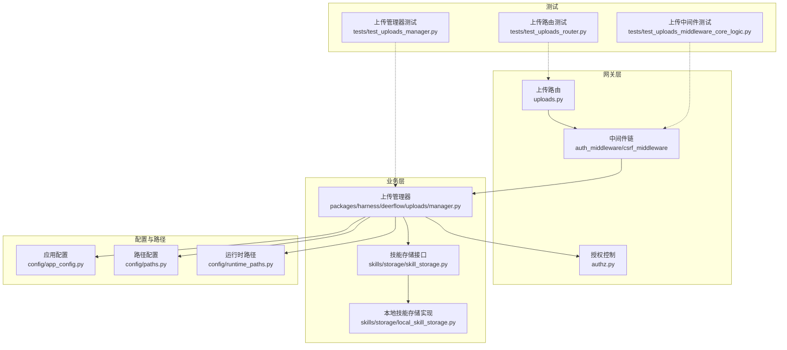
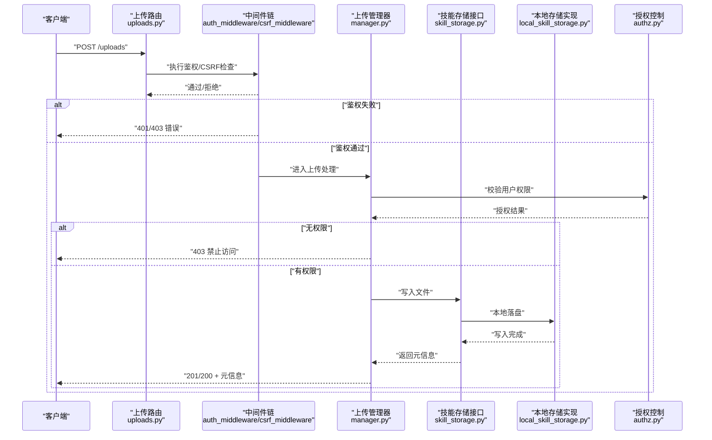
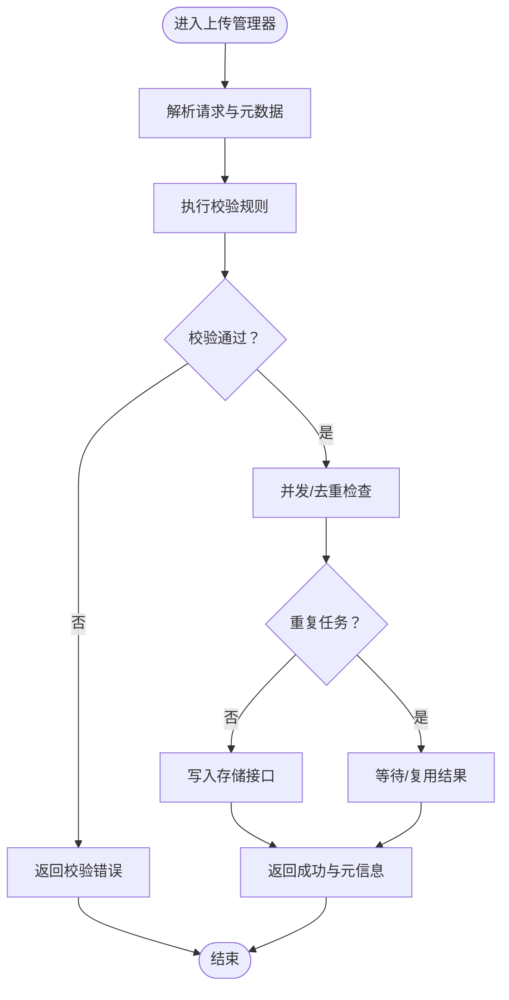
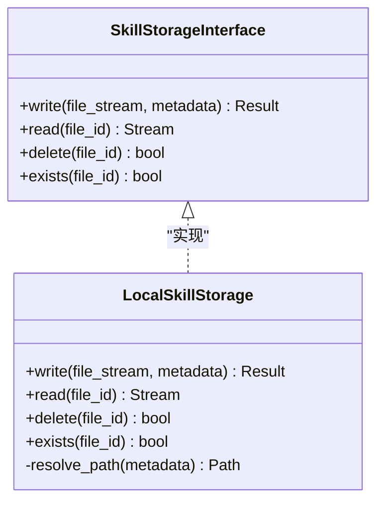
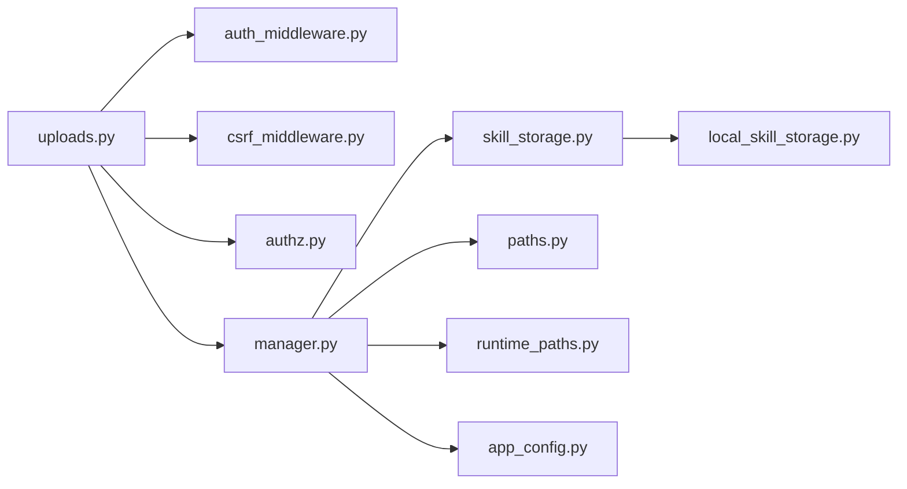

# 文件存储系统

<cite>
**本文引用的文件**
- [FILE_UPLOAD.md](file://backend/docs/FILE_UPLOAD.md)
- [uploads.py](file://backend/app/gateway/routers/uploads.py)
- [manager.py](file://backend/packages/harness/deerflow/uploads/manager.py)
- [skill_storage.py](file://backend/packages/harness/deerflow/skills/storage/skill_storage.py)
- [local_skill_storage.py](file://backend/packages/harness/deerflow/skills/storage/local_skill_storage.py)
- [paths.py](file://backend/packages/harness/deerflow/config/paths.py)
- [runtime_paths.py](file://backend/packages/harness/deerflow/config/runtime_paths.py)
- [app_config.py](file://backend/packages/harness/deerflow/config/app_config.py)
- [authz.py](file://backend/app/gateway/authz.py)
- [auth_middleware.py](file://backend/app/gateway/auth_middleware.py)
- [csrf_middleware.py](file://backend/app/gateway/csrf_middleware.py)
- [deps.py](file://backend/app/gateway/deps.py)
- [test_uploads_manager.py](file://backend/tests/test_uploads_manager.py)
- [test_uploads_router.py](file://backend/tests/test_uploads_router.py)
- [test_uploads_middleware_core_logic.py](file://backend/tests/test_uploads_middleware_core_logic.py)
- [test_memory_upload_filtering.py](file://backend/tests/test_memory_upload_filtering.py)
</cite>

## 目录
1. [简介](#简介)
2. [项目结构](#项目结构)
3. [核心组件](#核心组件)
4. [架构总览](#架构总览)
5. [详细组件分析](#详细组件分析)
6. [依赖关系分析](#依赖关系分析)
7. [性能考虑](#性能考虑)
8. [故障排查指南](#故障排查指南)
9. [结论](#结论)
10. [附录](#附录)

## 简介
本文件存储系统围绕“上传管理器”构建，负责统一接收、校验、持久化与分发文件资源，支持多后端存储（本地/技能存储等），并提供访问权限控制、并发上传管理、大文件处理策略与文件清理回收机制。本文档从架构、组件职责、数据流、安全控制到性能优化进行系统性阐述，并给出可操作的排障建议。

## 项目结构
文件存储相关的关键位置如下：
- 后端网关路由：处理上传请求入口，定义上传接口与鉴权中间件链
- 上传管理器：封装上传业务逻辑，协调校验、写入与回传
- 技能存储模块：提供技能类文件的专用存储抽象与本地实现
- 配置与路径：集中管理应用路径、运行时路径与全局配置
- 权限与中间件：统一鉴权、授权与 CSRF 安全控制
- 测试用例：覆盖上传管理器、路由与中间件的核心行为

**图表来源**
- [uploads.py](file://backend/app/gateway/routers/uploads.py)
- [manager.py](file://backend/packages/harness/deerflow/uploads/manager.py)
- [skill_storage.py](file://backend/packages/harness/deerflow/skills/storage/skill_storage.py)
- [local_skill_storage.py](file://backend/packages/harness/deerflow/skills/storage/local_skill_storage.py)
- [paths.py](file://backend/packages/harness/deerflow/config/paths.py)
- [runtime_paths.py](file://backend/packages/harness/deerflow/config/runtime_paths.py)
- [app_config.py](file://backend/packages/harness/deerflow/config/app_config.py)
- [auth_middleware.py](file://backend/app/gateway/auth_middleware.py)
- [csrf_middleware.py](file://backend/app/gateway/csrf_middleware.py)
- [authz.py](file://backend/app/gateway/authz.py)
- [test_uploads_manager.py](file://backend/tests/test_uploads_manager.py)
- [test_uploads_router.py](file://backend/tests/test_uploads_router.py)
- [test_uploads_middleware_core_logic.py](file://backend/tests/test_uploads_middleware_core_logic.py)

**章节来源**
- [uploads.py](file://backend/app/gateway/routers/uploads.py)
- [manager.py](file://backend/packages/harness/deerflow/uploads/manager.py)
- [skill_storage.py](file://backend/packages/harness/deerflow/skills/storage/skill_storage.py)
- [local_skill_storage.py](file://backend/packages/harness/deerflow/skills/storage/local_skill_storage.py)
- [paths.py](file://backend/packages/harness/deerflow/config/paths.py)
- [runtime_paths.py](file://backend/packages/harness/deerflow/config/runtime_paths.py)
- [app_config.py](file://backend/packages/harness/deerflow/config/app_config.py)
- [auth_middleware.py](file://backend/app/gateway/auth_middleware.py)
- [csrf_middleware.py](file://backend/app/gateway/csrf_middleware.py)
- [authz.py](file://backend/app/gateway/authz.py)
- [test_uploads_manager.py](file://backend/tests/test_uploads_manager.py)
- [test_uploads_router.py](file://backend/tests/test_uploads_router.py)
- [test_uploads_middleware_core_logic.py](file://backend/tests/test_uploads_middleware_core_logic.py)

## 核心组件
- 上传路由：定义上传接口、参数与响应格式；绑定鉴权与 CSRF 中间件
- 上传管理器：负责文件接收、校验、写入目标存储、生成访问元信息与异常处理
- 技能存储接口与实现：抽象出技能类文件的统一写入/读取接口，提供本地实现
- 路径与配置：集中管理静态/动态路径、运行时目录与应用配置项
- 权限与中间件：统一鉴权、授权与 CSRF 控制，确保上传安全边界
- 测试套件：覆盖上传管理器、路由与中间件的正确性与鲁棒性

**章节来源**
- [uploads.py](file://backend/app/gateway/routers/uploads.py)
- [manager.py](file://backend/packages/harness/deerflow/uploads/manager.py)
- [skill_storage.py](file://backend/packages/harness/deerflow/skills/storage/skill_storage.py)
- [local_skill_storage.py](file://backend/packages/harness/deerflow/skills/storage/local_skill_storage.py)
- [paths.py](file://backend/packages/harness/deerflow/config/paths.py)
- [runtime_paths.py](file://backend/packages/harness/deerflow/config/runtime_paths.py)
- [app_config.py](file://backend/packages/harness/deerflow/config/app_config.py)
- [auth_middleware.py](file://backend/app/gateway/auth_middleware.py)
- [csrf_middleware.py](file://backend/app/gateway/csrf_middleware.py)
- [authz.py](file://backend/app/gateway/authz.py)

## 架构总览
下图展示从客户端到上传管理器、存储后端与权限控制的整体交互流程。

**图表来源**
- [uploads.py](file://backend/app/gateway/routers/uploads.py)
- [auth_middleware.py](file://backend/app/gateway/auth_middleware.py)
- [csrf_middleware.py](file://backend/app/gateway/csrf_middleware.py)
- [manager.py](file://backend/packages/harness/deerflow/uploads/manager.py)
- [skill_storage.py](file://backend/packages/harness/deerflow/skills/storage/skill_storage.py)
- [local_skill_storage.py](file://backend/packages/harness/deerflow/skills/storage/local_skill_storage.py)
- [authz.py](file://backend/app/gateway/authz.py)

## 详细组件分析

### 上传路由（uploads.py）
- 责任边界：暴露上传接口，定义请求体字段、MIME 类型、大小限制与响应结构
- 中间件绑定：串联鉴权中间件与 CSRF 中间件，确保请求来源可信与会话有效
- 参数约束：对文件类型、文件名、标签、归属维度进行约束与白名单校验
- 响应规范：成功返回文件标识、访问链接与元数据；失败返回明确错误码与原因

**章节来源**
- [uploads.py](file://backend/app/gateway/routers/uploads.py)

### 上传管理器（manager.py）
- 接收与解析：从路由获取文件流、元数据与上下文信息
- 校验规则：
  - 文件类型白名单与扩展名过滤
  - 文件大小阈值与分片阈值（用于大文件）
  - 名称冲突检测与重命名策略
- 存储策略：
  - 统一写入接口：调用技能存储接口
  - 多后端适配：当前提供本地实现，便于扩展 S3/OSS 等对象存储
- 并发控制：基于文件指纹或会话令牌的去重与队列化处理
- 异常处理：捕获 IO/权限/网络等异常，返回标准化错误
- 回调与通知：写入完成后触发后续事件（如索引、扫描、归档）

**图表来源**
- [manager.py](file://backend/packages/harness/deerflow/uploads/manager.py)

**章节来源**
- [manager.py](file://backend/packages/harness/deerflow/uploads/manager.py)

### 技能存储接口与本地实现（skill_storage.py、local_skill_storage.py）
- 接口抽象：定义通用的写入、读取、删除与存在性检查方法，屏蔽后端差异
- 本地实现：在本地文件系统中按规则组织目录结构，保证路径唯一性与可检索性
- 可扩展性：通过接口注入可替换为云存储或其他持久化介质

**图表来源**
- [skill_storage.py](file://backend/packages/harness/deerflow/skills/storage/skill_storage.py)
- [local_skill_storage.py](file://backend/packages/harness/deerflow/skills/storage/local_skill_storage.py)

**章节来源**
- [skill_storage.py](file://backend/packages/harness/deerflow/skills/storage/skill_storage.py)
- [local_skill_storage.py](file://backend/packages/harness/deerflow/skills/storage/local_skill_storage.py)

### 路径与配置（paths.py、runtime_paths.py、app_config.py）
- 路径管理：集中定义静态资源根、临时目录、缓存目录与运行时输出目录
- 运行时路径：根据环境变量与启动参数动态生成实际工作目录
- 应用配置：读取全局配置项（如最大文件大小、允许类型、存储根路径等），供上传管理器与存储实现消费

**章节来源**
- [paths.py](file://backend/packages/harness/deerflow/config/paths.py)
- [runtime_paths.py](file://backend/packages/harness/deerflow/config/runtime_paths.py)
- [app_config.py](file://backend/packages/harness/deerflow/config/app_config.py)

### 权限与安全控制（auth_middleware.py、csrf_middleware.py、authz.py、deps.py）
- 鉴权中间件：校验 JWT 或会话有效性，提取用户身份与角色
- 授权控制：结合用户角色与资源属性（如所属线程/技能）判定是否具备上传权限
- CSRF 中间件：防止跨站请求伪造，要求携带合法 CSRF Token
- 依赖注入：通过依赖工厂提供认证/授权服务实例

**章节来源**
- [auth_middleware.py](file://backend/app/gateway/auth_middleware.py)
- [csrf_middleware.py](file://backend/app/gateway/csrf_middleware.py)
- [authz.py](file://backend/app/gateway/authz.py)
- [deps.py](file://backend/app/gateway/deps.py)

## 依赖关系分析
- 路由依赖中间件与授权模块，确保请求在进入业务前已通过安全检查
- 上传管理器依赖存储接口与路径/配置模块，以实现可插拔的存储后端与一致的路径策略
- 技能存储接口与实现之间采用依赖倒置，便于替换与扩展
- 测试用例覆盖路由、管理器与中间件，保障上传流程的稳定性

**图表来源**
- [uploads.py](file://backend/app/gateway/routers/uploads.py)
- [auth_middleware.py](file://backend/app/gateway/auth_middleware.py)
- [csrf_middleware.py](file://backend/app/gateway/csrf_middleware.py)
- [authz.py](file://backend/app/gateway/authz.py)
- [manager.py](file://backend/packages/harness/deerflow/uploads/manager.py)
- [skill_storage.py](file://backend/packages/harness/deerflow/skills/storage/skill_storage.py)
- [local_skill_storage.py](file://backend/packages/harness/deerflow/skills/storage/local_skill_storage.py)
- [paths.py](file://backend/packages/harness/deerflow/config/paths.py)
- [runtime_paths.py](file://backend/packages/harness/deerflow/config/runtime_paths.py)
- [app_config.py](file://backend/packages/harness/deerflow/config/app_config.py)

**章节来源**
- [uploads.py](file://backend/app/gateway/routers/uploads.py)
- [manager.py](file://backend/packages/harness/deerflow/uploads/manager.py)
- [skill_storage.py](file://backend/packages/harness/deerflow/skills/storage/skill_storage.py)
- [local_skill_storage.py](file://backend/packages/harness/deerflow/skills/storage/local_skill_storage.py)
- [paths.py](file://backend/packages/harness/deerflow/config/paths.py)
- [runtime_paths.py](file://backend/packages/harness/deerflow/config/runtime_paths.py)
- [app_config.py](file://backend/packages/harness/deerflow/config/app_config.py)
- [auth_middleware.py](file://backend/app/gateway/auth_middleware.py)
- [csrf_middleware.py](file://backend/app/gateway/csrf_middleware.py)
- [authz.py](file://backend/app/gateway/authz.py)

## 性能考虑
- 大文件处理
  - 分块上传：对超过阈值的文件启用分块写入，降低内存峰值与超时风险
  - 流式写入：避免一次性加载整个文件到内存，优先使用流式接口
  - 并行写入：在本地存储实现中，合理设置并发度与缓冲区大小
- 并发上传管理
  - 去重与排队：基于文件指纹或会话令牌去重，重复请求快速返回
  - 限流与背压：在路由与中间件层设置速率限制，防止突发流量击穿
- 存储后端优化
  - 对象存储：如接入 S3/OSS，开启多部分上传与断点续传
  - 缓存策略：热点文件使用本地缓存，冷数据下沉至对象存储
- I/O 与网络
  - 选择合适的文件系统与挂载参数，减少随机写放大
  - 在容器环境中使用本地 SSD 或高性能卷

[本节为通用性能指导，不直接分析具体文件]

## 故障排查指南
- 常见问题定位
  - 鉴权失败：检查 JWT/会话是否过期，确认中间件链顺序与配置
  - CSRF 校验失败：确认前端正确携带 CSRF Token，后端中间件未被绕过
  - 权限不足：核对授权策略与用户角色，确认资源归属与访问范围
  - 文件过大：检查分块阈值与路由限制，必要时调整配置
  - 存储写入失败：查看存储后端可用空间、权限与网络连通性
- 单元测试参考
  - 上传管理器测试：验证校验、写入、异常分支与返回值
  - 上传路由测试：验证接口契约、参数与响应一致性
  - 上传中间件测试：验证鉴权、CSRF 与授权链路

**章节来源**
- [test_uploads_manager.py](file://backend/tests/test_uploads_manager.py)
- [test_uploads_router.py](file://backend/tests/test_uploads_router.py)
- [test_uploads_middleware_core_logic.py](file://backend/tests/test_uploads_middleware_core_logic.py)

## 结论
该文件存储系统以“上传管理器”为核心，结合严格的权限控制与可插拔的存储后端，形成高内聚、低耦合的上传处理链路。通过分块上传、并发去重与本地/对象存储的灵活组合，系统在安全性与性能之间取得平衡。建议在生产环境中进一步完善对象存储接入、监控告警与备份恢复机制，持续提升可用性与可维护性。

[本节为总结性内容，不直接分析具体文件]

## 附录

### 上传处理流程（来自官方文档）
- 文档概述了上传接口、参数、校验规则与返回结构，可作为接口契约与测试依据
- 建议结合路由与管理器源码理解具体实现细节

**章节来源**
- [FILE_UPLOAD.md](file://backend/docs/FILE_UPLOAD.md)