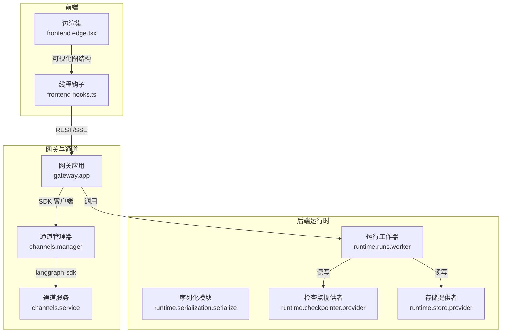
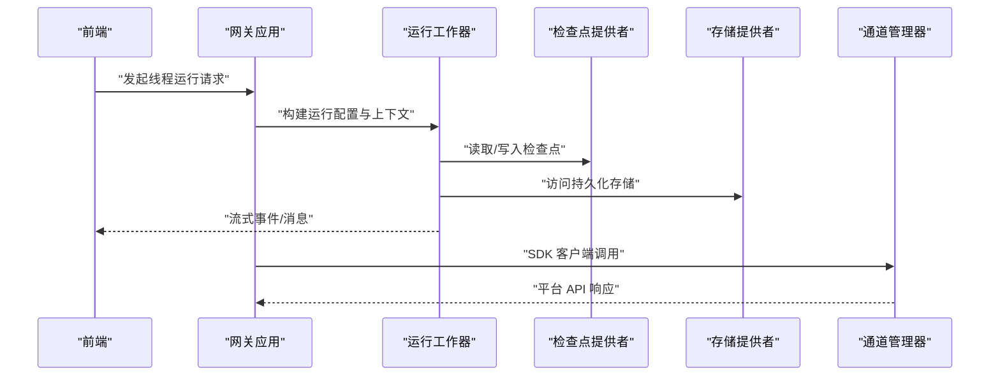
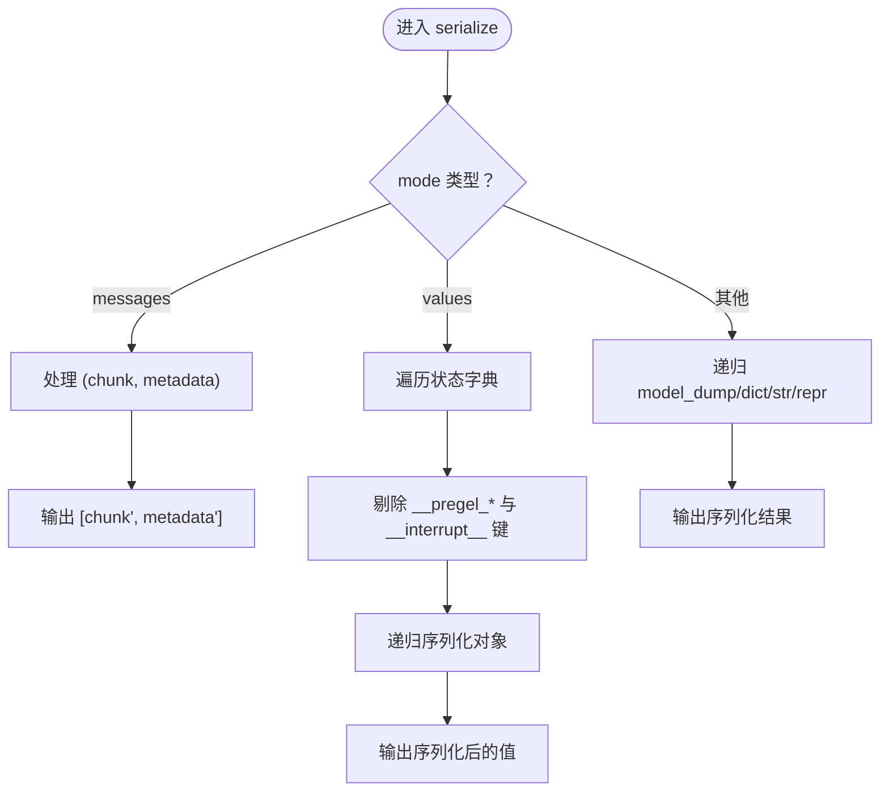
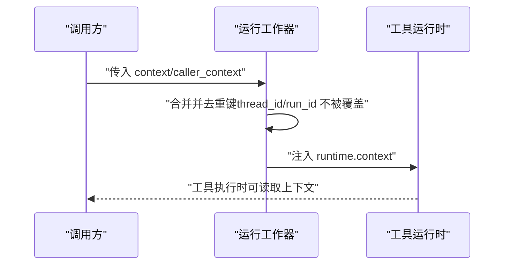
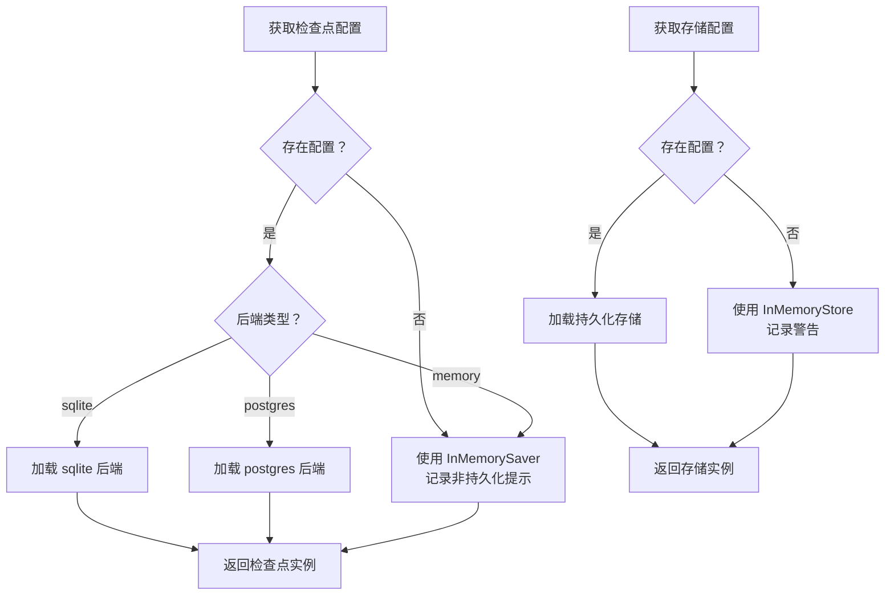
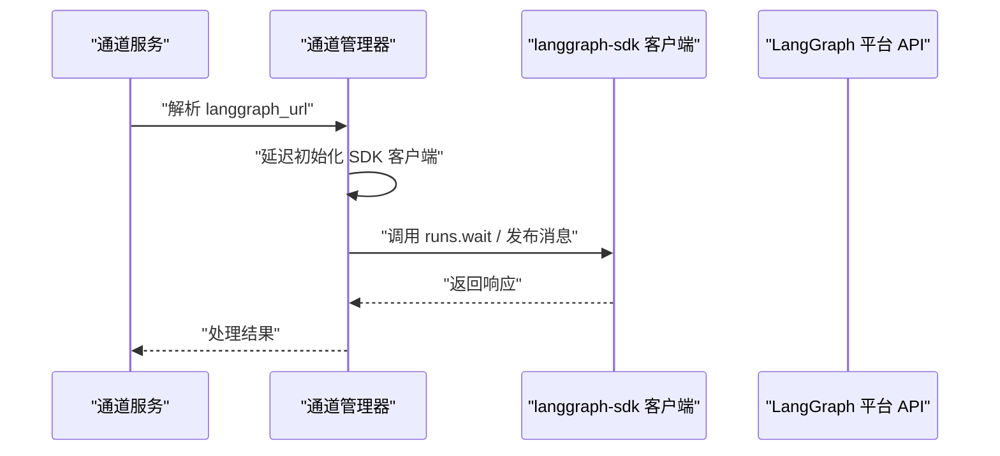
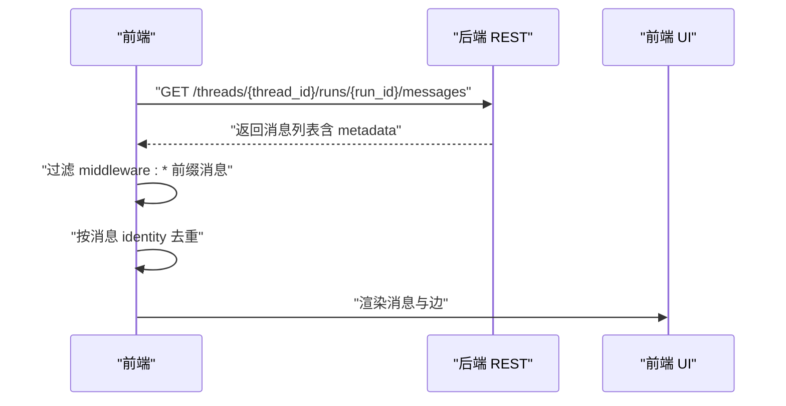
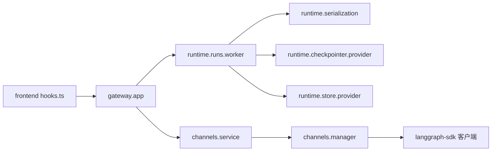

# LangGraph 集成

<cite>
**本文引用的文件**
- [serialization.py](file://backend/packages/harness/deerflow/runtime/serialization.py)
- [test_serialization.py](file://backend/tests/test_serialization.py)
- [worker.py](file://backend/packages/harness/deerflow/runtime/runs/worker.py)
- [provider.py（检查点提供者）](file://backend/packages/harness/deerflow/runtime/checkpointer/provider.py)
- [provider.py（存储提供者）](file://backend/packages/harness/deerflow/runtime/store/provider.py)
- [test_checkpointer.py](file://backend/tests/test_checkpointer.py)
- [manager.py（通道管理器）](file://backend/app/channels/manager.py)
- [service.py（通道服务）](file://backend/app/channels/service.py)
- [app.py（网关应用）](file://backend/app/gateway/app.py)
- [test_setup_agent_e2e_user_isolation.py](file://backend/tests/test_setup_agent_e2e_user_isolation.py)
- [hooks.ts（前端线程钩子）](file://frontend/src/core/threads/hooks.ts)
- [edge.tsx（前端边渲染）](file://frontend/src/components/ai-elements/edge.tsx)
</cite>

## 目录
1. [简介](#简介)
2. [项目结构](#项目结构)
3. [核心组件](#核心组件)
4. [架构总览](#架构总览)
5. [组件详解](#组件详解)
6. [依赖关系分析](#依赖关系分析)
7. [性能考量](#性能考量)
8. [故障排查指南](#故障排查指南)
9. [结论](#结论)
10. [附录](#附录)

## 简介
本技术文档聚焦于 DeerFlow 后端中 LangGraph 集成模块，系统阐述以下主题：
- LangGraph 图构建与执行机制：包括图节点创建、边连接、状态传递、运行上下文注入与流模式控制。
- 状态序列化与反序列化：消息与状态字典的 JSON 友好序列化策略，以及内部键过滤规则。
- 消息转换器与中间件：如何在运行前后对状态进行转换，确保运行上下文、令牌用量等信息正确注入。
- 错误处理与隔离：运行失败、检查点缺失、后端依赖缺失等场景下的稳健性策略。
- 性能优化与调试：流模式选择、检查点与存储后端配置、前端消息去重与增量加载。

## 项目结构
LangGraph 集成横跨后端运行时、网关路由、通道桥接与前端交互层，关键位置如下：
- 运行时序列化与运行上下文：runtime 层负责将 LangGraph 状态与消息安全地序列化为可传输结构，并构建工具运行时上下文。
- 检查点与存储：提供统一的检查点与存储后端抽象，支持内存、SQLite、PostgreSQL 等后端。
- 通道集成：通过 langgraph-sdk 客户端与外部 LangGraph 平台兼容的 API 通信，实现消息等待与发布。
- 前端交互：线程消息拉取、去重与增量加载，以及可视化边渲染。

图表来源
- [serialization.py:1-78](file://backend/packages/harness/deerflow/runtime/serialization.py#L1-L78)
- [worker.py:42-77](file://backend/packages/harness/deerflow/runtime/runs/worker.py#L42-L77)
- [provider.py（检查点提供者）:125-152](file://backend/packages/harness/deerflow/runtime/checkpointer/provider.py#L125-L152)
- [provider.py（存储提供者）:108-143](file://backend/packages/harness/deerflow/runtime/store/provider.py#L108-L143)
- [manager.py（通道管理器）:600-624](file://backend/app/channels/manager.py#L600-L624)
- [service.py（通道服务）:65-72](file://backend/app/channels/service.py#L65-L72)
- [hooks.ts（前端线程钩子）:842-881](file://frontend/src/core/threads/hooks.ts#L842-L881)
- [edge.tsx（前端边渲染）:1-140](file://frontend/src/components/ai-elements/edge.tsx#L1-L140)

章节来源
- [serialization.py:1-78](file://backend/packages/harness/deerflow/runtime/serialization.py#L1-L78)
- [worker.py:42-77](file://backend/packages/harness/deerflow/runtime/runs/worker.py#L42-L77)
- [provider.py（检查点提供者）:125-152](file://backend/packages/harness/deerflow/runtime/checkpointer/provider.py#L125-L152)
- [provider.py（存储提供者）:108-143](file://backend/packages/harness/deerflow/runtime/store/provider.py#L108-L143)
- [manager.py（通道管理器）:600-624](file://backend/app/channels/manager.py#L600-L624)
- [service.py（通道服务）:65-72](file://backend/app/channels/service.py#L65-L72)
- [hooks.ts（前端线程钩子）:842-881](file://frontend/src/core/threads/hooks.ts#L842-L881)
- [edge.tsx（前端边渲染）:1-140](file://frontend/src/components/ai-elements/edge.tsx#L1-L140)

## 核心组件
- 序列化模块：提供 LangChain/LangGraph 对象到 JSON 友好结构的递归序列化，支持消息模式与值模式，并过滤内部键。
- 运行工作器：构建运行时上下文（包含 thread_id、run_id、app_config 等），并声明支持的流模式集合。
- 检查点提供者：按配置选择持久化或内存后端，缺失依赖时报错；支持重置单例以切换后端。
- 存储提供者：按配置选择持久化或内存存储，缺失配置时回退至内存存储并发出警告。
- 通道管理器与服务：通过 langgraph-sdk 客户端与 LangGraph 兼容 API 通信，延迟初始化客户端，支持 URL 解析与默认值。
- 前端钩子：拉取线程运行消息，过滤中间件消息，去重并增量加载。
- 前端边渲染：可视化渲染带动画的边，辅助理解图结构。

章节来源
- [serialization.py:16-78](file://backend/packages/harness/deerflow/runtime/serialization.py#L16-L78)
- [worker.py:48-72](file://backend/packages/harness/deerflow/runtime/runs/worker.py#L48-L72)
- [provider.py（检查点提供者）:125-152](file://backend/packages/harness/deerflow/runtime/checkpointer/provider.py#L125-L152)
- [provider.py（存储提供者）:108-143](file://backend/packages/harness/deerflow/runtime/store/provider.py#L108-L143)
- [manager.py（通道管理器）:689-724](file://backend/app/channels/manager.py#L689-L724)
- [service.py（通道服务）:65-72](file://backend/app/channels/service.py#L65-L72)
- [hooks.ts（前端线程钩子）:842-881](file://frontend/src/core/threads/hooks.ts#L842-L881)
- [edge.tsx（前端边渲染）:105-135](file://frontend/src/components/ai-elements/edge.tsx#L105-L135)

## 架构总览
LangGraph 集成采用“运行时上下文 + 流式执行 + 持久化检查点”的架构。前端通过 REST/SSE 获取消息，后端在运行时构建上下文并驱动图执行；通道层通过 langgraph-sdk 与平台 API 互通；序列化模块保证状态与消息的跨层一致性。

图表来源
- [worker.py:48-72](file://backend/packages/harness/deerflow/runtime/runs/worker.py#L48-L72)
- [provider.py（检查点提供者）:125-152](file://backend/packages/harness/deerflow/runtime/checkpointer/provider.py#L125-L152)
- [provider.py（存储提供者）:108-143](file://backend/packages/harness/deerflow/runtime/store/provider.py#L108-L143)
- [manager.py（通道管理器）:689-724](file://backend/app/channels/manager.py#L689-L724)

## 组件详解

### 序列化与状态传递
- 模式化序列化：
  - messages 模式：将消息元组拆分为块与元数据，元数据非字典时回退为空字典。
  - values 模式：对状态字典进行序列化并剔除内部键（如 __pregel_* 与 __interrupt__）。
  - 默认模式：递归调用对象的 model_dump/dict 或回退为字符串/repr。
- 内部键过滤：仅保留对外可见的键，避免泄露内部运行时信息。
- 使用场景：SSE 发布与 REST 响应均依赖该模块，确保跨进程/跨服务的一致性。

图表来源
- [serialization.py:67-78](file://backend/packages/harness/deerflow/runtime/serialization.py#L67-L78)
- [serialization.py:45-56](file://backend/packages/harness/deerflow/runtime/serialization.py#L45-L56)
- [serialization.py:59-64](file://backend/packages/harness/deerflow/runtime/serialization.py#L59-L64)

章节来源
- [serialization.py:16-78](file://backend/packages/harness/deerflow/runtime/serialization.py#L16-L78)
- [test_serialization.py:92-134](file://backend/tests/test_serialization.py#L92-L134)

### 运行上下文与流模式
- 运行上下文构建：固定包含 thread_id、run_id，并合并 caller 上下文，最终注入到工具运行时。
- 流模式集合：声明支持的流模式集合，用于 graph.astream() 的模式选择。
- 用户隔离验证：测试覆盖了通过运行上下文传播用户 ID，确保工具写入正确的用户目录。

图表来源
- [worker.py:48-72](file://backend/packages/harness/deerflow/runtime/runs/worker.py#L48-L72)
- [test_setup_agent_e2e_user_isolation.py:341-350](file://backend/tests/test_setup_agent_e2e_user_isolation.py#L341-L350)

章节来源
- [worker.py:48-72](file://backend/packages/harness/deerflow/runtime/runs/worker.py#L48-L72)
- [test_setup_agent_e2e_user_isolation.py:314-350](file://backend/tests/test_setup_agent_e2e_user_isolation.py#L314-L350)

### 检查点与存储后端
- 检查点提供者：
  - 无配置时回退至内存保存器，日志提示非持久化。
  - 支持 SQLite/PostgreSQL 后端，缺失依赖时报 ImportError，并给出明确包名提示。
  - 提供重置单例能力，便于测试或运行时切换。
- 存储提供者：
  - 无配置时回退至内存存储，发出警告提示重启丢失。
  - 支持按配置懒加载后端连接上下文。

图表来源
- [provider.py（检查点提供者）:125-152](file://backend/packages/harness/deerflow/runtime/checkpointer/provider.py#L125-L152)
- [provider.py（存储提供者）:108-143](file://backend/packages/harness/deerflow/runtime/store/provider.py#L108-L143)
- [test_checkpointer.py:146-158](file://backend/tests/test_checkpointer.py#L146-L158)

章节来源
- [provider.py（检查点提供者）:125-152](file://backend/packages/harness/deerflow/runtime/checkpointer/provider.py#L125-L152)
- [provider.py（存储提供者）:108-143](file://backend/packages/harness/deerflow/runtime/store/provider.py#L108-L143)
- [test_checkpointer.py:47-158](file://backend/tests/test_checkpointer.py#L47-L158)

### 通道集成与平台 API 互通
- 通道管理器：
  - 通过 langgraph-sdk 异步客户端与平台 API 通信。
  - 延迟初始化客户端，支持 URL 解析与默认值。
  - 在消息等待与发布流程中使用 SDK 客户端。
- 通道服务：
  - 解析环境变量与配置，确定 langgraph_url，默认值来自常量。
- 网关应用：
  - 在启动阶段迁移 LangGraph 线程元数据，处理孤儿线程与所有权问题。

图表来源
- [service.py（通道服务）:65-72](file://backend/app/channels/service.py#L65-L72)
- [manager.py（通道管理器）:689-724](file://backend/app/channels/manager.py#L689-L724)
- [app.py（网关应用）:110-132](file://backend/app/gateway/app.py#L110-L132)

章节来源
- [service.py（通道服务）:65-72](file://backend/app/channels/service.py#L65-L72)
- [manager.py（通道管理器）:600-624](file://backend/app/channels/manager.py#L600-L624)
- [manager.py（通道管理器）:689-724](file://backend/app/channels/manager.py#L689-L724)
- [app.py（网关应用）:110-132](file://backend/app/gateway/app.py#L110-L132)

### 前端消息拉取与可视化
- 消息拉取与去重：
  - 通过 REST 接口拉取线程运行消息，过滤中间件前缀的消息，按消息身份去重。
  - 支持增量加载多个运行的消息，避免重复渲染。
- 边渲染：
  - 使用贝塞尔曲线绘制边，支持临时边与动画边，提升图结构可视化体验。

图表来源
- [hooks.ts（前端线程钩子）:842-881](file://frontend/src/core/threads/hooks.ts#L842-L881)
- [edge.tsx（前端边渲染）:105-135](file://frontend/src/components/ai-elements/edge.tsx#L105-L135)

章节来源
- [hooks.ts（前端线程钩子）:842-881](file://frontend/src/core/threads/hooks.ts#L842-L881)
- [edge.tsx（前端边渲染）:1-140](file://frontend/src/components/ai-elements/edge.tsx#L1-L140)

## 依赖关系分析
- 运行时层依赖：
  - 序列化模块被 SSE 发布与 REST 响应消费。
  - 运行工作器依赖检查点与存储提供者，以实现状态恢复与持久化。
- 网关与通道层：
  - 通道服务解析配置并注入通道管理器。
  - 通道管理器延迟初始化 langgraph-sdk 客户端，减少启动开销。
- 前端层：
  - 钩子函数依赖后端接口，边渲染组件依赖前端可视化库。

图表来源
- [worker.py:48-72](file://backend/packages/harness/deerflow/runtime/runs/worker.py#L48-L72)
- [serialization.py:16-78](file://backend/packages/harness/deerflow/runtime/serialization.py#L16-L78)
- [provider.py（检查点提供者）:125-152](file://backend/packages/harness/deerflow/runtime/checkpointer/provider.py#L125-L152)
- [provider.py（存储提供者）:108-143](file://backend/packages/harness/deerflow/runtime/store/provider.py#L108-L143)
- [service.py（通道服务）:65-72](file://backend/app/channels/service.py#L65-L72)
- [manager.py（通道管理器）:689-724](file://backend/app/channels/manager.py#L689-L724)

章节来源
- [worker.py:48-72](file://backend/packages/harness/deerflow/runtime/runs/worker.py#L48-L72)
- [serialization.py:16-78](file://backend/packages/harness/deerflow/runtime/serialization.py#L16-L78)
- [provider.py（检查点提供者）:125-152](file://backend/packages/harness/deerflow/runtime/checkpointer/provider.py#L125-L152)
- [provider.py（存储提供者）:108-143](file://backend/packages/harness/deerflow/runtime/store/provider.py#L108-L143)
- [service.py（通道服务）:65-72](file://backend/app/channels/service.py#L65-L72)
- [manager.py（通道管理器）:689-724](file://backend/app/channels/manager.py#L689-L724)

## 性能考量
- 流模式选择：
  - 根据需求选择 values/updates/messages 等模式，平衡实时性与带宽占用。
- 检查点与存储后端：
  - 生产环境优先使用 SQLite/PostgreSQL，避免内存后端导致的状态丢失。
  - 合理设置连接池与超时，减少 IO 抖动。
- 前端消息去重与增量加载：
  - 利用消息 identity 去重，避免重复渲染；分页/增量加载减少一次性数据量。
- 可视化优化：
  - 边渲染使用贝塞尔曲线，动画边在长链路中谨慎使用，避免过度重绘。

## 故障排查指南
- 检查点后端缺失依赖：
  - 现象：初始化检查点时报 ImportError，提示缺少特定后端包。
  - 处理：安装对应后端包或调整配置为 memory。
- 存储未配置回退内存：
  - 现象：启动时出现内存存储警告，重启后线程列表丢失。
  - 处理：配置持久化存储后端。
- 序列化异常：
  - 现象：消息或状态无法序列化。
  - 处理：确认对象具备 model_dump/dict 方法，或在序列化前做适配。
- 通道 SDK 初始化失败：
  - 现象：SDK 客户端未就绪或 URL 解析失败。
  - 处理：检查环境变量与配置项，确保默认 URL 可用。
- 前端消息重复或不刷新：
  - 现象：消息重复或中间件消息干扰。
  - 处理：确认过滤 middleware:* 前缀消息，启用去重逻辑。

章节来源
- [test_checkpointer.py:146-158](file://backend/tests/test_checkpointer.py#L146-L158)
- [provider.py（存储提供者）:134-139](file://backend/packages/harness/deerflow/runtime/store/provider.py#L134-L139)
- [serialization.py:16-43](file://backend/packages/harness/deerflow/runtime/serialization.py#L16-L43)
- [manager.py（通道管理器）:689-724](file://backend/app/channels/manager.py#L689-L724)
- [hooks.ts（前端线程钩子）:842-881](file://frontend/src/core/threads/hooks.ts#L842-L881)

## 结论
LangGraph 集成模块通过清晰的运行时上下文、可靠的序列化策略、可插拔的检查点与存储后端，以及与平台 API 的通道桥接，实现了稳定、可观测且可扩展的智能体运行框架。配合前端的消息去重与可视化增强，整体用户体验与开发效率得到显著提升。建议在生产环境中优先采用持久化后端，并结合流模式与增量加载策略优化性能。

## 附录
- 示例参考（代码路径）：
  - 构建运行上下文：[worker.py:48-72](file://backend/packages/harness/deerflow/runtime/runs/worker.py#L48-L72)
  - 序列化消息与状态：[serialization.py:67-78](file://backend/packages/harness/deerflow/runtime/serialization.py#L67-L78)
  - 检查点后端选择与回退：[provider.py（检查点提供者）:125-152](file://backend/packages/harness/deerflow/runtime/checkpointer/provider.py#L125-L152)
  - 存储后端选择与回退：[provider.py（存储提供者）:108-143](file://backend/packages/harness/deerflow/runtime/store/provider.py#L108-L143)
  - 通道 SDK 客户端初始化：[manager.py（通道管理器）:689-724](file://backend/app/channels/manager.py#L689-L724)
  - 前端消息拉取与去重：[hooks.ts（前端线程钩子）:842-881](file://frontend/src/core/threads/hooks.ts#L842-L881)