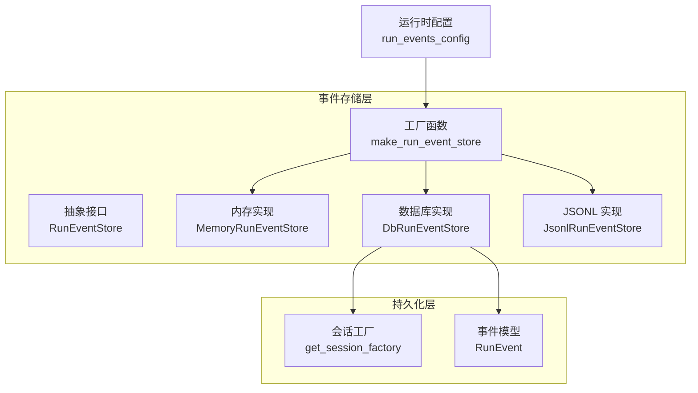
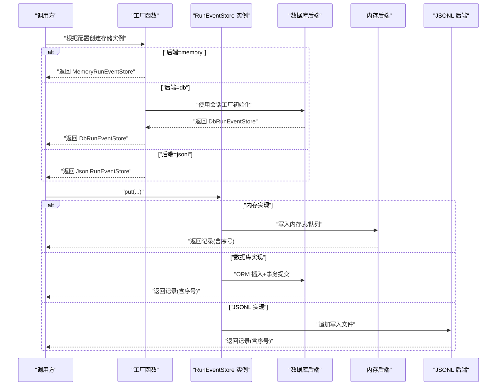
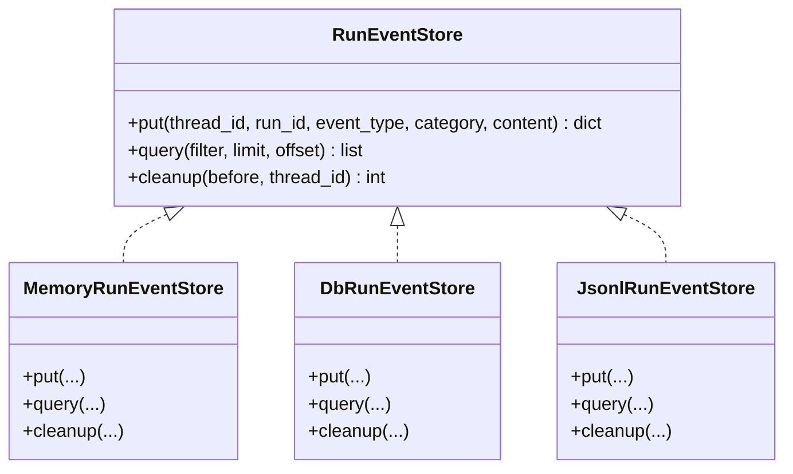
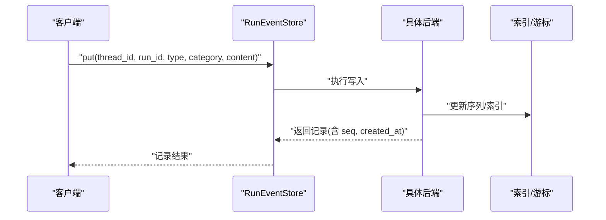
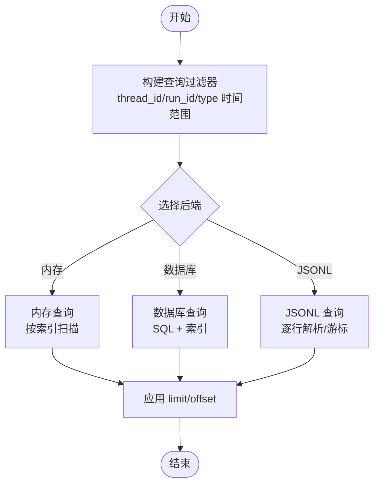
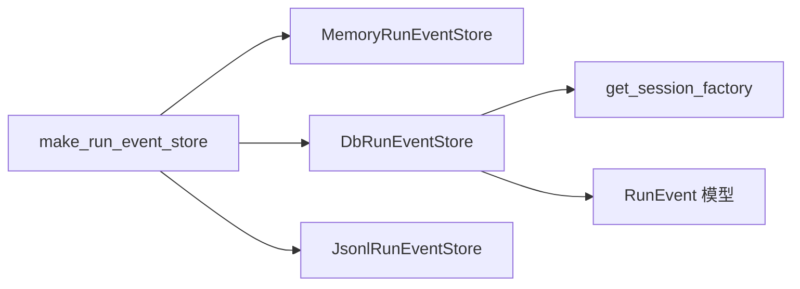

# 事件存储系统

<cite>
**本文引用的文件**
- [backend/packages/harness/deerflow/runtime/events/store/__init__.py](file://backend/packages/harness/deerflow/runtime/events/store/__init__.py)
- [backend/packages/harness/deerflow/runtime/events/store/base.py](file://backend/packages/harness/deerflow/runtime/events/store/base.py)
- [backend/packages/harness/deerflow/runtime/events/store/memory.py](file://backend/packages/harness/deerflow/runtime/events/store/memory.py)
- [backend/packages/harness/deerflow/runtime/events/store/db.py](file://backend/packages/harness/deerflow/runtime/events/store/db.py)
- [backend/packages/harness/deerflow/runtime/events/store/jsonl.py](file://backend/packages/harness/deerflow/runtime/events/store/jsonl.py)
- [backend/packages/harness/deerflow/persistence/engine.py](file://backend/packages/harness/deerflow/persistence/engine.py)
- [backend/packages/harness/deerflow/persistence/models/run_event.py](file://backend/packages/harness/deerflow/persistence/models/run_event.py)
- [backend/packages/harness/deerflow/config/run_events_config.py](file://backend/packages/harness/deerflow/config/run_events_config.py)
- [backend/tests/test_run_event_store.py](file://backend/tests/test_run_event_store.py)
- [backend/tests/test_run_event_store_pagination.py](file://backend/tests/test_run_event_store_pagination.py)
- [backend/tests/test_jsonl_event_store_async_io.py](file://backend/tests/test_jsonl_event_store_async_io.py)
- [backend/tests/blocking_io/test_jsonl_run_event_store.py](file://backend/tests/blocking_io/test_jsonl_run_event_store.py)
</cite>

## 目录
1. [简介](#简介)
2. [项目结构](#项目结构)
3. [核心组件](#核心组件)
4. [架构总览](#架构总览)
5. [详细组件分析](#详细组件分析)
6. [依赖关系分析](#依赖关系分析)
7. [性能考量](#性能考量)
8. [故障排查指南](#故障排查指南)
9. [结论](#结论)
10. [附录](#附录)

## 简介
本技术文档围绕事件存储系统展开，系统通过统一的抽象接口屏蔽不同存储后端的差异，支持内存、数据库与 JSONL 文件三种后端。文档重点阐述事件的写入、读取、查询与清理机制，给出后端选择建议、自定义存储策略实现思路以及在海量事件场景下的性能优化与一致性保障方法。

## 项目结构
事件存储位于运行时层，采用“抽象接口 + 多后端实现”的分层设计。核心目录与文件如下：
- 抽象与工厂：runtime/events/store/base.py、runtime/events/store/__init__.py
- 后端实现：memory.py、db.py、jsonl.py
- 持久化引擎：persistence/engine.py
- 数据模型：persistence/models/run_event.py
- 运行配置：config/run_events_config.py
- 测试用例：tests/test_run_event_store.py、tests/test_run_event_store_pagination.py、tests/test_jsonl_event_store_async_io.py、tests/blocking_io/test_jsonl_run_event_store.py

图表来源
- [backend/packages/harness/deerflow/runtime/events/store/__init__.py:5-23](file://backend/packages/harness/deerflow/runtime/events/store/__init__.py#L5-L23)
- [backend/packages/harness/deerflow/runtime/events/store/base.py](file://backend/packages/harness/deerflow/runtime/events/store/base.py)
- [backend/packages/harness/deerflow/runtime/events/store/db.py](file://backend/packages/harness/deerflow/runtime/events/store/db.py)
- [backend/packages/harness/deerflow/persistence/engine.py](file://backend/packages/harness/deerflow/persistence/engine.py)
- [backend/packages/harness/deerflow/persistence/models/run_event.py](file://backend/packages/harness/deerflow/persistence/models/run_event.py)
- [backend/packages/harness/deerflow/config/run_events_config.py](file://backend/packages/harness/deerflow/config/run_events_config.py)

章节来源
- [backend/packages/harness/deerflow/runtime/events/store/__init__.py:1-26](file://backend/packages/harness/deerflow/runtime/events/store/__init__.py#L1-L26)
- [backend/packages/harness/deerflow/runtime/events/store/base.py](file://backend/packages/harness/deerflow/runtime/events/store/base.py)
- [backend/packages/harness/deerflow/runtime/events/store/memory.py](file://backend/packages/harness/deerflow/runtime/events/store/memory.py)
- [backend/packages/harness/deerflow/runtime/events/store/db.py](file://backend/packages/harness/deerflow/runtime/events/store/db.py)
- [backend/packages/harness/deerflow/runtime/events/store/jsonl.py](file://backend/packages/harness/deerflow/runtime/events/store/jsonl.py)
- [backend/packages/harness/deerflow/persistence/engine.py](file://backend/packages/harness/deerflow/persistence/engine.py)
- [backend/packages/harness/deerflow/persistence/models/run_event.py](file://backend/packages/harness/deerflow/persistence/models/run_event.py)
- [backend/packages/harness/deerflow/config/run_events_config.py](file://backend/packages/harness/deerflow/config/run_events_config.py)

## 核心组件
- 抽象接口 RunEventStore：定义统一的事件写入、查询、清理等能力契约，确保上层逻辑与后端解耦。
- 工厂函数 make_run_event_store：根据运行时配置选择具体后端实例；当数据库后端不可用时自动回退到内存实现。
- 内存实现 MemoryRunEventStore：基于内存的数据结构维护事件序列，适合开发测试与小规模场景。
- 数据库实现 DbRunEventStore：基于持久化引擎与 ORM 模型进行事件落盘，适合生产环境。
- JSONL 实现 JsonlRunEventStore：以 JSONL 文本文件形式追加写入事件，便于审计与离线分析。

章节来源
- [backend/packages/harness/deerflow/runtime/events/store/base.py](file://backend/packages/harness/deerflow/runtime/events/store/base.py)
- [backend/packages/harness/deerflow/runtime/events/store/__init__.py:5-23](file://backend/packages/harness/deerflow/runtime/events/store/__init__.py#L5-L23)
- [backend/packages/harness/deerflow/runtime/events/store/memory.py](file://backend/packages/harness/deerflow/runtime/events/store/memory.py)
- [backend/packages/harness/deerflow/runtime/events/store/db.py](file://backend/packages/harness/deerflow/runtime/events/store/db.py)
- [backend/packages/harness/deerflow/runtime/events/store/jsonl.py](file://backend/packages/harness/deerflow/runtime/events/store/jsonl.py)

## 架构总览
事件存储系统通过工厂函数按配置选择后端，数据库后端依赖持久化引擎提供的会话工厂；内存与 JSONL 后端无需外部依赖。查询与清理操作由各实现类内部维护索引或游标，支持按线程 ID、运行 ID、时间范围等条件检索。

图表来源
- [backend/packages/harness/deerflow/runtime/events/store/__init__.py:5-23](file://backend/packages/harness/deerflow/runtime/events/store/__init__.py#L5-L23)
- [backend/packages/harness/deerflow/runtime/events/store/memory.py](file://backend/packages/harness/deerflow/runtime/events/store/memory.py)
- [backend/packages/harness/deerflow/runtime/events/store/db.py](file://backend/packages/harness/deerflow/runtime/events/store/db.py)
- [backend/packages/harness/deerflow/runtime/events/store/jsonl.py](file://backend/packages/harness/deerflow/runtime/events/store/jsonl.py)

## 详细组件分析

### 抽象接口与工厂
- 抽象接口 RunEventStore：定义 put、query、cleanup 等方法签名，确保所有后端具备一致的行为语义。
- 工厂函数 make_run_event_store：依据配置选择后端；当数据库后端不可用时自动回退至内存实现，保证系统可用性。

图表来源
- [backend/packages/harness/deerflow/runtime/events/store/base.py](file://backend/packages/harness/deerflow/runtime/events/store/base.py)
- [backend/packages/harness/deerflow/runtime/events/store/memory.py](file://backend/packages/harness/deerflow/runtime/events/store/memory.py)
- [backend/packages/harness/deerflow/runtime/events/store/db.py](file://backend/packages/harness/deerflow/runtime/events/store/db.py)
- [backend/packages/harness/deerflow/runtime/events/store/jsonl.py](file://backend/packages/harness/deerflow/runtime/events/store/jsonl.py)

章节来源
- [backend/packages/harness/deerflow/runtime/events/store/base.py](file://backend/packages/harness/deerflow/runtime/events/store/base.py)
- [backend/packages/harness/deerflow/runtime/events/store/__init__.py:5-23](file://backend/packages/harness/deerflow/runtime/events/store/__init__.py#L5-L23)

### 内存实现（MemoryRunEventStore）
- 特点：基于内存的数据结构维护事件序列，写入与查询开销低，适合开发测试与小规模场景。
- 序列生成：同一线程内的事件序号严格递增，保证事件顺序。
- 查询与清理：支持按线程 ID、运行 ID、类型等过滤；清理时可按时间阈值删除旧事件。

章节来源
- [backend/packages/harness/deerflow/runtime/events/store/memory.py](file://backend/packages/harness/deerflow/runtime/events/store/memory.py)
- [backend/tests/test_run_event_store.py:20-120](file://backend/tests/test_run_event_store.py#L20-L120)

### 数据库实现（DbRunEventStore）
- 特点：基于 ORM 模型与持久化引擎进行事件落盘，具备高可靠性和可扩展性。
- 初始化：从持久化引擎获取会话工厂；若会话工厂为空则回退到内存实现。
- 数据模型：事件字段映射到 ORM 模型，支持高效查询与索引。
- 性能：批量写入、事务提交、索引优化可显著提升吞吐。

章节来源
- [backend/packages/harness/deerflow/runtime/events/store/db.py](file://backend/packages/harness/deerflow/runtime/events/store/db.py)
- [backend/packages/harness/deerflow/persistence/engine.py](file://backend/packages/harness/deerflow/persistence/engine.py)
- [backend/packages/harness/deerflow/persistence/models/run_event.py](file://backend/packages/harness/deerflow/persistence/models/run_event.py)
- [backend/tests/test_run_event_store.py:522-537](file://backend/tests/test_run_event_store.py#L522-L537)

### JSONL 实现（JsonlRunEventStore）
- 特点：事件以 JSONL 文本文件形式追加写入，便于审计、备份与离线分析。
- 异步 IO：提供异步写入路径，减少阻塞；同时保留同步实现以兼容不同运行时。
- 分页与清理：支持按游标/偏移分页读取；清理时可按时间阈值删除旧记录。

章节来源
- [backend/packages/harness/deerflow/runtime/events/store/jsonl.py](file://backend/packages/harness/deerflow/runtime/events/store/jsonl.py)
- [backend/tests/test_jsonl_event_store_async_io.py](file://backend/tests/test_jsonl_event_store_async_io.py)
- [backend/tests/blocking_io/test_jsonl_run_event_store.py](file://backend/tests/blocking_io/test_jsonl_run_event_store.py)
- [backend/tests/test_run_event_store_pagination.py](file://backend/tests/test_run_event_store_pagination.py)

### 事件写入流程（序列图）

图表来源
- [backend/packages/harness/deerflow/runtime/events/store/base.py](file://backend/packages/harness/deerflow/runtime/events/store/base.py)
- [backend/packages/harness/deerflow/runtime/events/store/memory.py](file://backend/packages/harness/deerflow/runtime/events/store/memory.py)
- [backend/packages/harness/deerflow/runtime/events/store/db.py](file://backend/packages/harness/deerflow/runtime/events/store/db.py)
- [backend/packages/harness/deerflow/runtime/events/store/jsonl.py](file://backend/packages/harness/deerflow/runtime/events/store/jsonl.py)

### 事件查询与分页（流程图）

图表来源
- [backend/packages/harness/deerflow/runtime/events/store/memory.py](file://backend/packages/harness/deerflow/runtime/events/store/memory.py)
- [backend/packages/harness/deerflow/runtime/events/store/db.py](file://backend/packages/harness/deerflow/runtime/events/store/db.py)
- [backend/packages/harness/deerflow/runtime/events/store/jsonl.py](file://backend/packages/harness/deerflow/runtime/events/store/jsonl.py)
- [backend/tests/test_run_event_store_pagination.py](file://backend/tests/test_run_event_store_pagination.py)

## 依赖关系分析
- 组件耦合：工厂函数仅依赖配置与会话工厂；具体后端实现彼此独立，降低耦合度。
- 外部依赖：数据库后端依赖持久化引擎；JSONL 后端依赖文件系统；内存后端无外部依赖。
- 回退策略：数据库后端在会话工厂缺失时自动回退内存实现，增强鲁棒性。

图表来源
- [backend/packages/harness/deerflow/runtime/events/store/__init__.py:5-23](file://backend/packages/harness/deerflow/runtime/events/store/__init__.py#L5-L23)
- [backend/packages/harness/deerflow/persistence/engine.py](file://backend/packages/harness/deerflow/persistence/engine.py)
- [backend/packages/harness/deerflow/persistence/models/run_event.py](file://backend/packages/harness/deerflow/persistence/models/run_event.py)

章节来源
- [backend/packages/harness/deerflow/runtime/events/store/__init__.py:5-23](file://backend/packages/harness/deerflow/runtime/events/store/__init__.py#L5-L23)
- [backend/packages/harness/deerflow/persistence/engine.py](file://backend/packages/harness/deerflow/persistence/engine.py)
- [backend/packages/harness/deerflow/persistence/models/run_event.py](file://backend/packages/harness/deerflow/persistence/models/run_event.py)

## 性能考量
- 写入性能
  - 内存实现：适合小规模与开发测试，避免磁盘与网络 IO 开销。
  - 数据库实现：批量插入、事务合并、索引优化可显著提升吞吐；合理设置连接池大小与批大小。
  - JSONL 实现：异步写入减少阻塞；大文件场景下注意文件句柄与缓冲区管理。
- 查询性能
  - 建议在 thread_id、run_id、event_type、created_at 上建立复合索引。
  - 分页查询使用游标或基于主键的 offset，避免深层 offset 导致的性能问题。
- 清理策略
  - 定期清理过期事件，释放存储空间；清理前先统计占用并评估影响。
  - 对于 JSONL，可采用滚动日志与压缩归档策略。
- 一致性保障
  - 数据库后端通过事务保证写入原子性；内存实现适合最终一致性场景。
  - 跨后端一致性可通过统一的写入接口与幂等设计实现。

## 故障排查指南
- 后端选择异常
  - 若配置未知后端，工厂函数会抛出错误；检查配置项是否为 memory、db 或 jsonl。
  - 参考：[backend/tests/test_run_event_store.py:550-558](file://backend/tests/test_run_event_store.py#L550-L558)
- 数据库后端不可用回退
  - 当会话工厂为空时自动回退内存实现；确认持久化引擎初始化状态。
  - 参考：[backend/tests/test_run_event_store.py:522-537](file://backend/tests/test_run_event_store.py#L522-L537)
- JSONL 写入阻塞
  - 使用异步写入路径；如仍阻塞，检查文件权限、磁盘空间与句柄限制。
  - 参考：[backend/tests/test_jsonl_event_store_async_io.py](file://backend/tests/test_jsonl_event_store_async_io.py)
- 分页与查询异常
  - 确认过滤条件与排序字段；对大数据集使用游标分页。
  - 参考：[backend/tests/test_run_event_store_pagination.py](file://backend/tests/test_run_event_store_pagination.py)

章节来源
- [backend/tests/test_run_event_store.py:522-558](file://backend/tests/test_run_event_store.py#L522-L558)
- [backend/tests/test_jsonl_event_store_async_io.py](file://backend/tests/test_jsonl_event_store_async_io.py)
- [backend/tests/test_run_event_store_pagination.py](file://backend/tests/test_run_event_store_pagination.py)

## 结论
事件存储系统通过统一抽象与多后端实现，满足从开发测试到生产部署的不同需求。内存实现适合小规模与快速迭代，数据库实现提供高可靠与可扩展性，JSONL 实现便于审计与离线分析。结合合理的索引、分页与清理策略，可在海量事件场景下获得稳定性能与数据一致性。

## 附录
- 选择建议
  - 开发测试：优先内存实现，简单易用。
  - 生产环境：优先数据库实现，配合索引与事务优化。
  - 审计与归档：采用 JSONL 实现，便于导出与长期保存。
- 自定义存储策略
  - 新增后端：实现 RunEventStore 接口，注册到工厂函数中。
  - 参考实现：[backend/packages/harness/deerflow/runtime/events/store/memory.py](file://backend/packages/harness/deerflow/runtime/events/store/memory.py)、[backend/packages/harness/deerflow/runtime/events/store/db.py](file://backend/packages/harness/deerflow/runtime/events/store/db.py)、[backend/packages/harness/deerflow/runtime/events/store/jsonl.py](file://backend/packages/harness/deerflow/runtime/events/store/jsonl.py)
- 关键配置
  - 运行时后端选择：run_events.backend
  - 参考：[backend/packages/harness/deerflow/config/run_events_config.py](file://backend/packages/harness/deerflow/config/run_events_config.py)
- 数据模型
  - 事件字段映射与约束：参考 ORM 模型定义
  - 参考：[backend/packages/harness/deerflow/persistence/models/run_event.py](file://backend/packages/harness/deerflow/persistence/models/run_event.py)