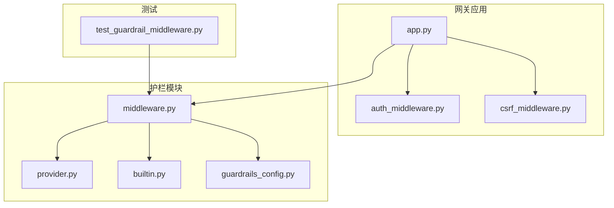
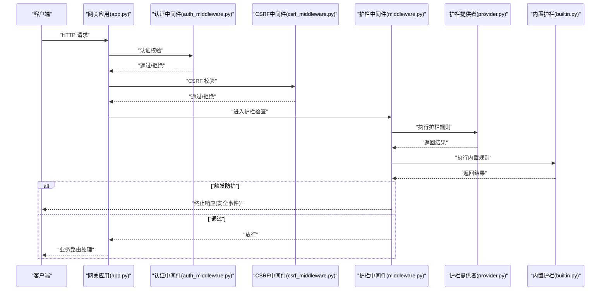
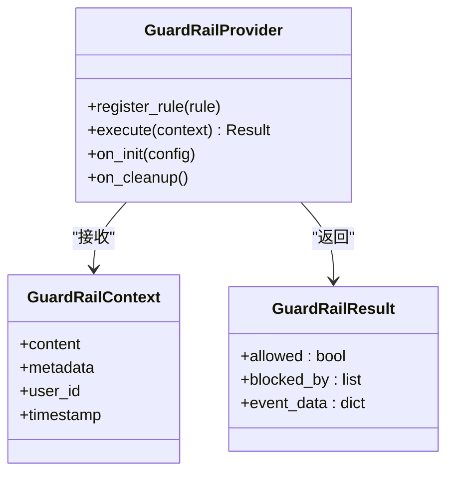
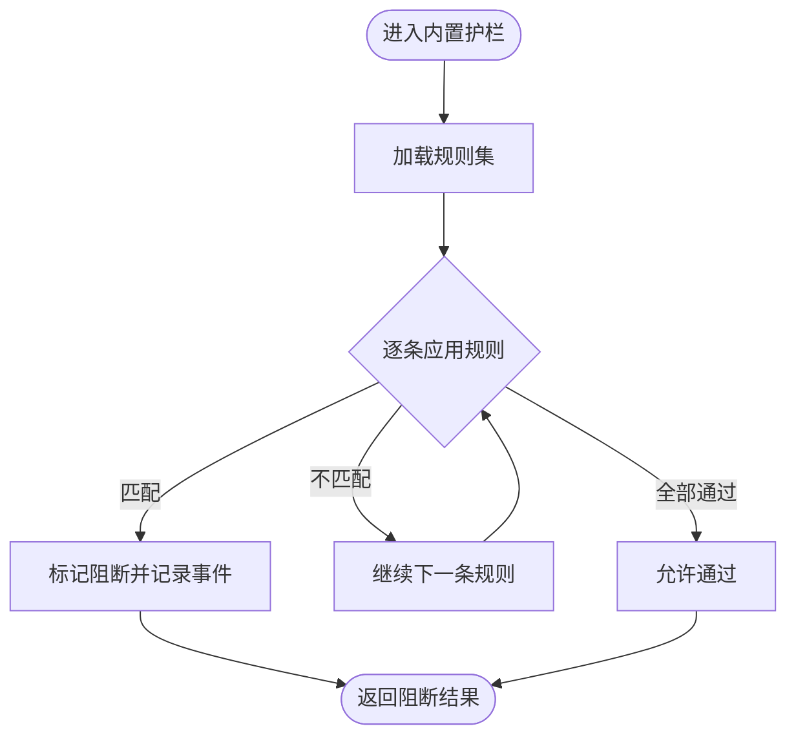
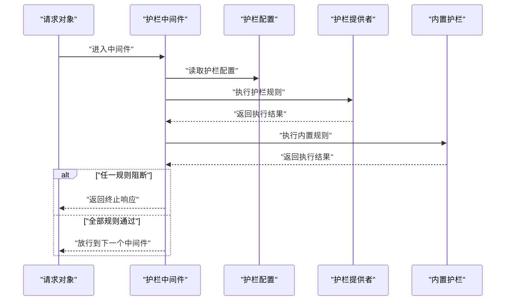
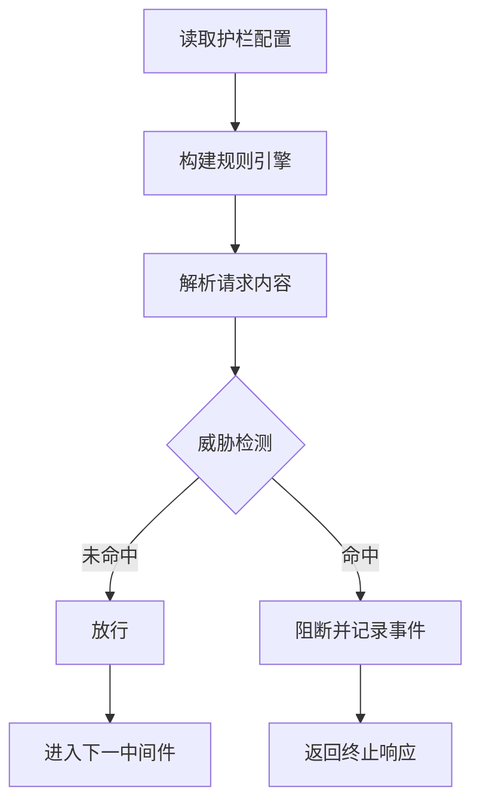
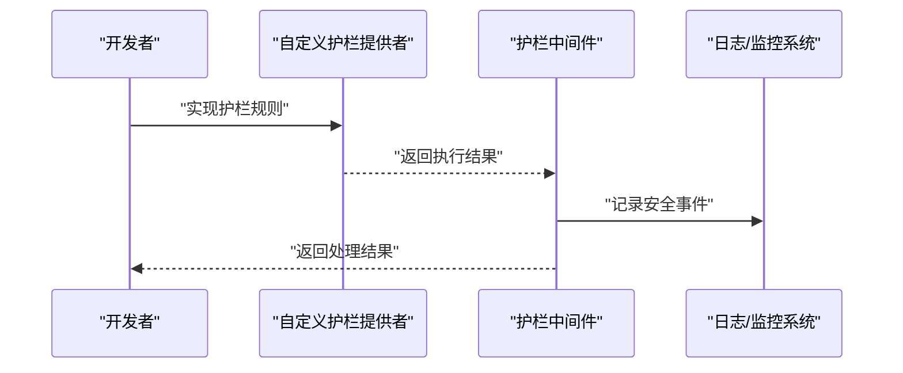
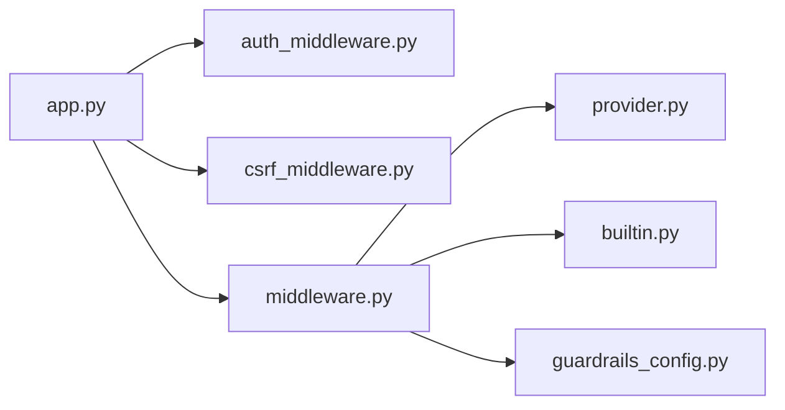

# 守卫护栏集成

<cite>
**本文引用的文件**
- [builtin.py](file://backend/packages/harness/deerflow/guardrails/builtin.py)
- [middleware.py](file://backend/packages/harness/deerflow/guardrails/middleware.py)
- [provider.py](file://backend/packages/harness/deerflow/guardrails/provider.py)
- [guardrails_config.py](file://backend/packages/harness/deerflow/config/guardrails_config.py)
- [test_guardrail_middleware.py](file://backend/tests/test_guardrail_middleware.py)
- [GUARDRAILS.md](file://backend/docs/GUARDRAILS.md)
- [middleware-execution-flow.md](file://backend/docs/middleware-execution-flow.md)
- [auth_middleware.py](file://backend/app/gateway/auth_middleware.py)
- [csrf_middleware.py](file://backend/app/gateway/csrf_middleware.py)
- [app.py](file://backend/app/gateway/app.py)
</cite>

## 目录
1. [简介](#简介)
2. [项目结构](#项目结构)
3. [核心组件](#核心组件)
4. [架构总览](#架构总览)
5. [详细组件分析](#详细组件分析)
6. [依赖关系分析](#依赖关系分析)
7. [性能考量](#性能考量)
8. [故障排查指南](#故障排查指南)
9. [结论](#结论)
10. [附录](#附录)

## 简介
本技术文档围绕“守卫护栏”（Guardrails）集成模块展开，系统性阐述内置护栏的实现方式、中间件集成机制以及提供者接口设计。文档重点覆盖以下方面：
- 内置护栏的实现与扩展点
- 中间件在请求处理链中的位置与执行顺序
- 提供者接口的设计与自定义护栏逻辑实现
- 安全策略配置、威胁检测算法与防护措施执行流程
- 具体的启用步骤、自定义护栏示例与安全事件处理指引
- 护栏系统对性能的影响评估与调优建议

## 项目结构
守卫护栏模块位于后端 harness 包中，采用分层组织：提供者接口抽象、内置护栏实现、中间件接入与配置管理。关键目录与文件如下：
- guardrails 子模块：提供者接口、内置护栏、中间件
- config 子模块：护栏配置项
- 文档：GUARDRAILS.md 与 middleware-execution-flow.md
- 测试：test_guardrail_middleware.py
- 网关应用：app.py、auth_middleware.py、csrf_middleware.py

**图表来源**
- [app.py:1-200](file://backend/app/gateway/app.py#L1-L200)
- [auth_middleware.py:1-200](file://backend/app/gateway/auth_middleware.py#L1-L200)
- [csrf_middleware.py:1-200](file://backend/app/gateway/csrf_middleware.py#L1-L200)
- [provider.py:1-200](file://backend/packages/harness/deerflow/guardrails/provider.py#L1-L200)
- [builtin.py:1-200](file://backend/packages/harness/deerflow/guardrails/builtin.py#L1-L200)
- [middleware.py:1-200](file://backend/packages/harness/deerflow/guardrails/middleware.py#L1-L200)
- [guardrails_config.py:1-200](file://backend/packages/harness/deerflow/config/guardrails_config.py#L1-L200)
- [test_guardrail_middleware.py:1-200](file://backend/tests/test_guardrail_middleware.py#L1-L200)

**章节来源**
- [GUARDRAILS.md:1-200](file://backend/docs/GUARDRAILS.md#L1-L200)
- [middleware-execution-flow.md:1-200](file://backend/docs/middleware-execution-flow.md#L1-L200)

## 核心组件
- 提供者接口（Provider）：定义护栏能力的统一抽象，支持注册、执行与结果判定。
- 内置护栏（Builtin）：提供默认护栏规则集，如敏感词过滤、主题限制等。
- 中间件（Middleware）：在请求进入业务路由前执行护栏检查，支持短路终止与事件上报。
- 配置（Config）：集中管理护栏开关、阈值、策略集合与执行模式。

关键职责与交互：
- 中间件负责拦截请求，按配置选择护栏提供者与内置护栏规则进行校验。
- 提供者接口抽象了护栏的生命周期与执行上下文，便于扩展自定义护栏。
- 内置护栏作为默认策略集合，可与自定义护栏组合使用。

**章节来源**
- [provider.py:1-200](file://backend/packages/harness/deerflow/guardrails/provider.py#L1-L200)
- [builtin.py:1-200](file://backend/packages/harness/deerflow/guardrails/builtin.py#L1-L200)
- [middleware.py:1-200](file://backend/packages/harness/deerflow/guardrails/middleware.py#L1-L200)
- [guardrails_config.py:1-200](file://backend/packages/harness/deerflow/config/guardrails_config.py#L1-L200)

## 架构总览
护栏系统以中间件为核心，贯穿于网关请求处理链。其执行顺序通常在认证与跨域之后、业务路由之前，确保所有进入系统的请求均经过安全校验。

**图表来源**
- [app.py:1-200](file://backend/app/gateway/app.py#L1-L200)
- [auth_middleware.py:1-200](file://backend/app/gateway/auth_middleware.py#L1-L200)
- [csrf_middleware.py:1-200](file://backend/app/gateway/csrf_middleware.py#L1-L200)
- [middleware.py:1-200](file://backend/packages/harness/deerflow/guardrails/middleware.py#L1-L200)
- [provider.py:1-200](file://backend/packages/harness/deerflow/guardrails/provider.py#L1-L200)
- [builtin.py:1-200](file://backend/packages/harness/deerflow/guardrails/builtin.py#L1-L200)

## 详细组件分析

### 提供者接口设计（Provider）
护栏提供者接口定义了护栏能力的统一抽象，包括但不限于：
- 规则注册与管理
- 执行上下文封装（输入内容、元数据、用户标识等）
- 结果判定与事件上报
- 生命周期钩子（初始化、清理）

**图表来源**
- [provider.py:1-200](file://backend/packages/harness/deerflow/guardrails/provider.py#L1-L200)

**章节来源**
- [provider.py:1-200](file://backend/packages/harness/deerflow/guardrails/provider.py#L1-L200)

### 内置护栏实现（Builtin）
内置护栏提供一组默认规则集，典型场景包括：
- 敏感词过滤：基于词表匹配与模糊检测
- 主题限制：基于预定义主题白名单/黑名单
- 长度与格式约束：防止异常输入导致的资源消耗

内置护栏通常以“规则工厂”的形式存在，支持动态加载与组合。

**图表来源**
- [builtin.py:1-200](file://backend/packages/harness/deerflow/guardrails/builtin.py#L1-L200)

**章节来源**
- [builtin.py:1-200](file://backend/packages/harness/deerflow/guardrails/builtin.py#L1-L200)

### 中间件集成机制（Middleware）
护栏中间件负责在请求进入业务路由前执行护栏检查，并根据结果决定是否放行或终止响应。关键流程：
- 解析请求上下文（路径、方法、头信息、主体内容）
- 依据配置选择护栏提供者与内置规则
- 执行护栏并收集结果
- 若触发防护，生成安全事件并返回终止响应；否则放行至后续中间件与路由

**图表来源**
- [middleware.py:1-200](file://backend/packages/harness/deerflow/guardrails/middleware.py#L1-L200)
- [guardrails_config.py:1-200](file://backend/packages/harness/deerflow/config/guardrails_config.py#L1-L200)

**章节来源**
- [middleware.py:1-200](file://backend/packages/harness/deerflow/guardrails/middleware.py#L1-L200)
- [guardrails_config.py:1-200](file://backend/packages/harness/deerflow/config/guardrails_config.py#L1-L200)

### 安全策略配置与威胁检测
- 配置项：护栏开关、规则集列表、阈值、黑白名单、事件上报目标
- 威胁检测算法：基于词表匹配、正则表达式、统计特征与上下文分析
- 防护措施：立即终止请求、记录审计日志、触发告警与事件上报

**图表来源**
- [guardrails_config.py:1-200](file://backend/packages/harness/deerflow/config/guardrails_config.py#L1-L200)
- [middleware.py:1-200](file://backend/packages/harness/deerflow/guardrails/middleware.py#L1-L200)

**章节来源**
- [guardrails_config.py:1-200](file://backend/packages/harness/deerflow/config/guardrails_config.py#L1-L200)

### 自定义护栏逻辑与安全事件处理
- 实现自定义护栏：遵循提供者接口规范，实现规则注册与执行逻辑
- 安全事件处理：在中间件中捕获阻断事件，输出结构化日志并上报外部监控系统
- 示例参考：测试用例展示了护栏中间件的行为与断言

**图表来源**
- [provider.py:1-200](file://backend/packages/harness/deerflow/guardrails/provider.py#L1-L200)
- [middleware.py:1-200](file://backend/packages/harness/deerflow/guardrails/middleware.py#L1-L200)
- [test_guardrail_middleware.py:1-200](file://backend/tests/test_guardrail_middleware.py#L1-L200)

**章节来源**
- [test_guardrail_middleware.py:1-200](file://backend/tests/test_guardrail_middleware.py#L1-L200)

## 依赖关系分析
护栏中间件依赖于：
- 网关应用的中间件栈（认证、跨域等）
- 护栏提供者接口与内置护栏实现
- 护栏配置模块

**图表来源**
- [app.py:1-200](file://backend/app/gateway/app.py#L1-L200)
- [auth_middleware.py:1-200](file://backend/app/gateway/auth_middleware.py#L1-L200)
- [csrf_middleware.py:1-200](file://backend/app/gateway/csrf_middleware.py#L1-L200)
- [middleware.py:1-200](file://backend/packages/harness/deerflow/guardrails/middleware.py#L1-L200)
- [provider.py:1-200](file://backend/packages/harness/deerflow/guardrails/provider.py#L1-L200)
- [builtin.py:1-200](file://backend/packages/harness/deerflow/guardrails/builtin.py#L1-L200)
- [guardrails_config.py:1-200](file://backend/packages/harness/deerflow/config/guardrails_config.py#L1-L200)

**章节来源**
- [middleware-execution-flow.md:1-200](file://backend/docs/middleware-execution-flow.md#L1-L200)

## 性能考量
- 执行开销：内置护栏与提供者规则的匹配复杂度直接影响延迟；建议对高频规则进行缓存与索引优化
- 并发控制：护栏中间件应避免阻塞主线程，必要时引入异步执行与限流
- 资源隔离：将护栏规则与业务逻辑解耦，减少对上游服务的影响
- 配置优化：按需启用规则集，避免不必要的全量扫描；合理设置阈值与超时时间

## 故障排查指南
- 启用护栏中间件：确认网关应用已正确挂载护栏中间件，并在配置中开启护栏功能
- 规则不生效：检查护栏配置项是否正确加载，规则集是否存在且可访问
- 性能异常：观察护栏中间件耗时指标，定位高成本规则并进行优化
- 安全事件缺失：核对事件上报配置与日志输出，确保阻断事件被正确记录

**章节来源**
- [GUARDRAILS.md:1-200](file://backend/docs/GUARDRAILS.md#L1-L200)
- [middleware-execution-flow.md:1-200](file://backend/docs/middleware-execution-flow.md#L1-L200)

## 结论
守卫护栏集成通过提供者接口与内置护栏实现解耦，借助中间件在请求处理链中前置执行，形成可配置、可扩展、可观测的安全防线。结合合理的配置与性能优化策略，可在保障安全性的同时维持系统吞吐与稳定性。

## 附录
- 启用内置护栏：在应用启动时挂载护栏中间件，并在护栏配置中启用所需规则集
- 实现自定义护栏：实现护栏提供者接口，注册规则并在中间件中启用
- 处理安全事件：在中间件中捕获阻断事件并输出结构化日志，配合外部监控系统进行告警

**章节来源**
- [middleware.py:1-200](file://backend/packages/harness/deerflow/guardrails/middleware.py#L1-L200)
- [provider.py:1-200](file://backend/packages/harness/deerflow/guardrails/provider.py#L1-L200)
- [guardrails_config.py:1-200](file://backend/packages/harness/deerflow/config/guardrails_config.py#L1-L200)