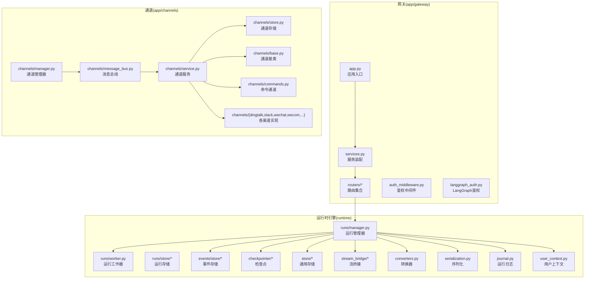
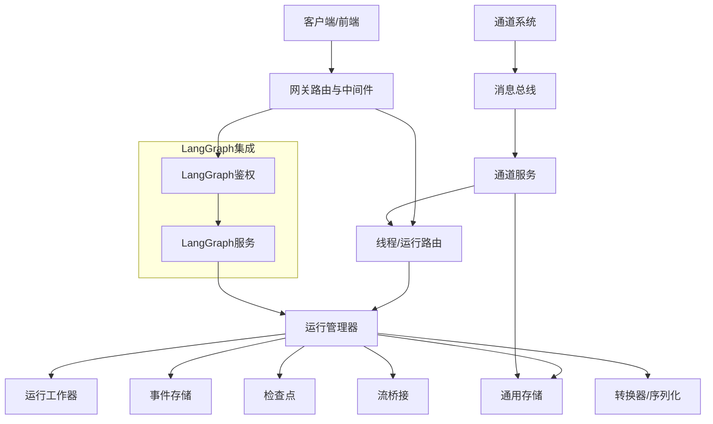
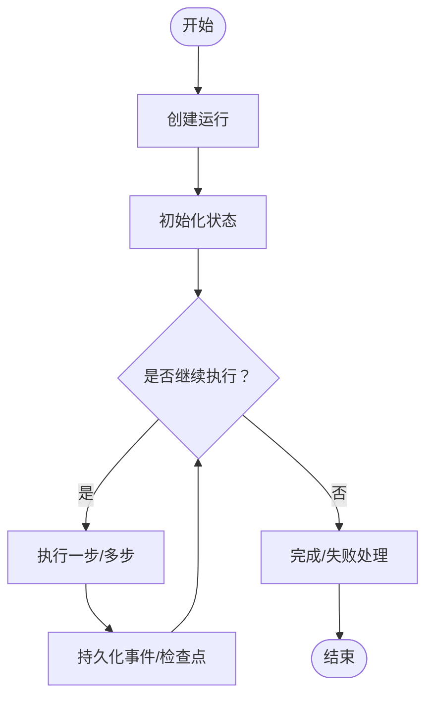
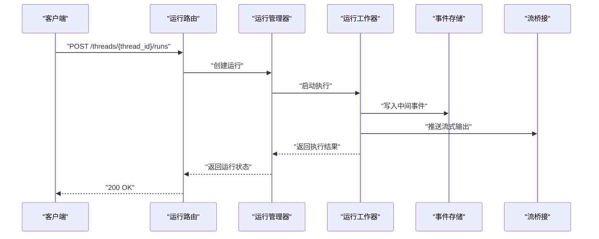
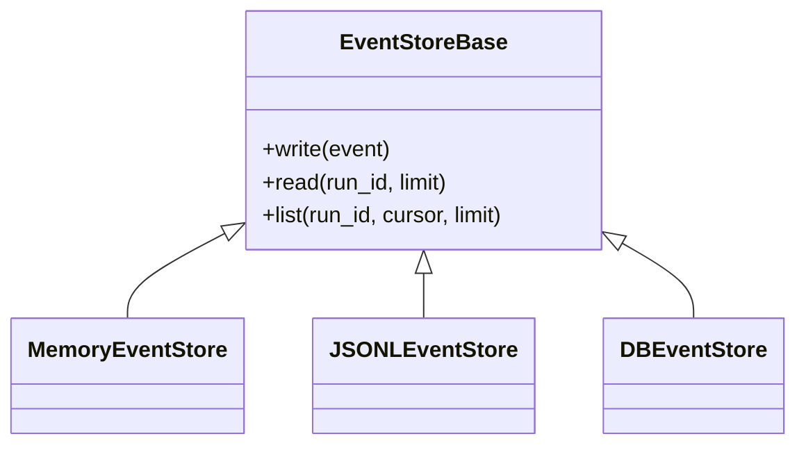
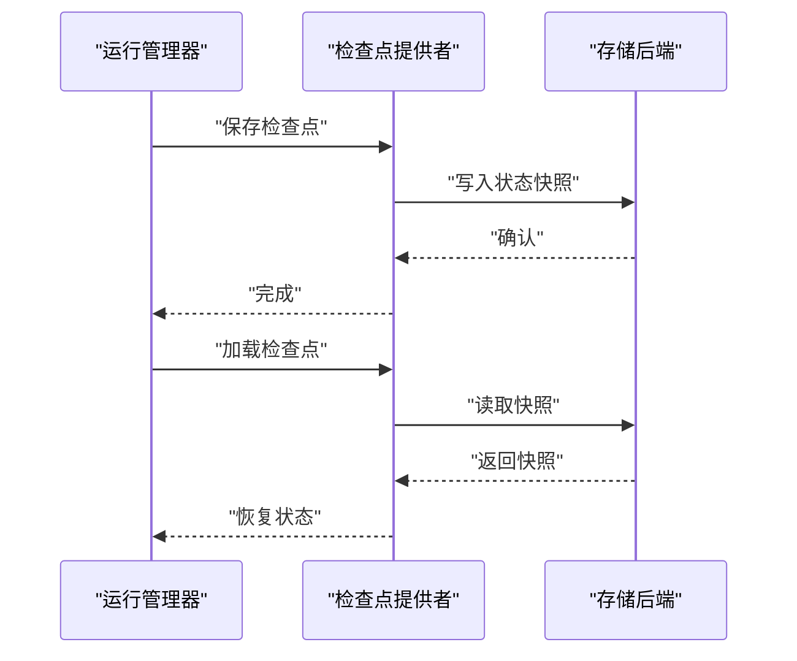
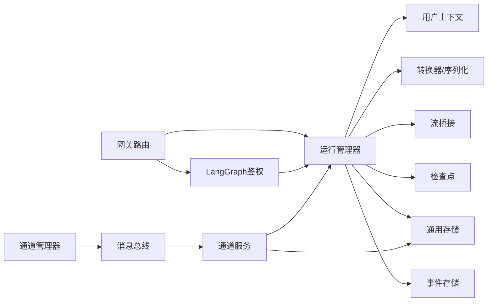

# 智能体运行时引擎

<cite>
**本文引用的文件**
- [runtime/__init__.py](file://backend/packages/harness/deerflow/runtime/__init__.py)
- [runtime/checkpointer/provider.py](file://backend/packages/harness/deerflow/runtime/checkpointer/provider.py)
- [runtime/checkpointer/async_provider.py](file://backend/packages/harness/deerflow/runtime/checkpointer/async_provider.py)
- [runtime/events/store/base.py](file://backend/packages/harness/deerflow/runtime/events/store/base.py)
- [runtime/events/store/db.py](file://backend/packages/harness/deerflow/runtime/events/store/db.py)
- [runtime/events/store/jsonl.py](file://backend/packages/harness/deerflow/runtime/events/store/jsonl.py)
- [runtime/events/store/memory.py](file://backend/packages/harness/deerflow/runtime/events/store/memory.py)
- [runtime/runs/manager.py](file://backend/packages/harness/deerflow/runtime/runs/manager.py)
- [runtime/runs/naming.py](file://backend/packages/harness/deerflow/runtime/runs/naming.py)
- [runtime/runs/schemas.py](file://backend/packages/harness/deerflow/runtime/runs/schemas.py)
- [runtime/runs/worker.py](file://backend/packages/harness/deerflow/runtime/runs/worker.py)
- [runtime/store/provider.py](file://backend/packages/harness/deerflow/runtime/store/provider.py)
- [runtime/store/async_provider.py](file://backend/packages/harness/deerflow/runtime/store/async_provider.py)
- [runtime/stream_bridge/base.py](file://backend/packages/harness/deerflow/runtime/stream_bridge/base.py)
- [runtime/stream_bridge/memory.py](file://backend/packages/harness/deerflow/runtime/stream_bridge/memory.py)
- [runtime/converters.py](file://backend/packages/harness/deerflow/runtime/converters.py)
- [runtime/journal.py](file://backend/packages/harness/deerflow/runtime/journal.py)
- [runtime/serialization.py](file://backend/packages/harness/deerflow/runtime/serialization.py)
- [runtime/user_context.py](file://backend/packages/harness/deerflow/runtime/user_context.py)
- [app/gateway/app.py](file://backend/app/gateway/app.py)
- [app/gateway/services.py](file://backend/app/gateway/services.py)
- [app/gateway/routers/threads.py](file://backend/app/gateway/routers/threads.py)
- [app/gateway/routers/runs.py](file://backend/app/gateway/routers/runs.py)
- [app/gateway/routers/agents.py](file://backend/app/gateway/routers/agents.py)
- [app/gateway/routers/memory.py](file://backend/app/gateway/routers/memory.py)
- [app/gateway/routers/channels.py](file://backend/app/gateway/routers/channels.py)
- [app/gateway/routers/artifacts.py](file://backend/app/gateway/routers/artifacts.py)
- [app/gateway/routers/suggestions.py](file://backend/app/gateway/routers/suggestions.py)
- [app/gateway/routers/skills.py](file://backend/app/gateway/routers/skills.py)
- [app/gateway/routers/mcp.py](file://backend/app/gateway/routers/mcp.py)
- [app/gateway/routers/feedback.py](file://backend/app/gateway/routers/feedback.py)
- [app/gateway/routers/thread_runs.py](file://backend/app/gateway/routers/thread_runs.py)
- [app/gateway/routers/uploads.py](file://backend/app/gateway/routers/uploads.py)
- [app/gateway/routers/models.py](file://backend/app/gateway/routers/models.py)
- [app/gateway/routers/auth.py](file://backend/app/gateway/routers/auth.py)
- [app/gateway/routers/assistants_compat.py](file://backend/app/gateway/routers/assistants_compat.py)
- [app/gateway/auth_middleware.py](file://backend/app/gateway/auth_middleware.py)
- [app/gateway/langgraph_auth.py](file://backend/app/gateway/langgraph_auth.py)
- [app/gateway/utils.py](file://backend/app/gateway/utils.py)
- [app/gateway/deps.py](file://backend/app/gateway/deps.py)
- [app/gateway/internal_auth.py](file://backend/app/gateway/internal_auth.py)
- [app/gateway/csrf_middleware.py](file://backend/app/gateway/csrf_middleware.py)
- [app/gateway/path_utils.py](file://backend/app/gateway/path_utils.py)
- [app/channels/manager.py](file://backend/app/channels/manager.py)
- [app/channels/message_bus.py](file://backend/app/channels/message_bus.py)
- [app/channels/service.py](file://backend/app/channels/service.py)
- [app/channels/store.py](file://backend/app/channels/store.py)
- [app/channels/base.py](file://backend/app/channels/base.py)
- [app/channels/commands.py](file://backend/app/channels/commands.py)
- [app/channels/dingtalk.py](file://backend/app/channels/dingtalk.py)
- [app/channels/discord.py](file://backend/app/channels/discord.py)
- [app/channels/feishu.py](file://backend/app/channels/feishu.py)
- [app/channels/slack.py](file://backend/app/channels/slack.py)
- [app/channels/telegram.py](file://backend/app/channels/telegram.py)
- [app/channels/wechat.py](file://backend/app/channels/wechat.py)
- [app/channels/wecom.py](file://backend/app/channels/wecom.py)
- [app/channels/wechat.py](file://backend/app/channels/wechat.py)
- [app/channels/wecom.py](file://backend/app/channels/wecom.py)
- [app/gateway/config.py](file://backend/app/gateway/config.py)
- [app/gateway/authz.py](file://backend/app/gateway/authz.py)
- [app/gateway/auth/errors.py](file://backend/app/gateway/auth/errors.py)
- [app/gateway/auth/models.py](file://backend/app/gateway/auth/models.py)
- [app/gateway/auth/providers.py](file://backend/app/gateway/auth/providers.py)
- [app/gateway/auth/local_provider.py](file://backend/app/gateway/auth/local_provider.py)
- [app/gateway/auth/password.py](file://backend/app/gateway/auth/password.py)
- [app/gateway/auth/jwt.py](file://backend/app/gateway/auth/jwt.py)
- [app/gateway/auth/credential_file.py](file://backend/app/gateway/auth/credential_file.py)
- [app/gateway/auth/reset_admin.py](file://backend/app/gateway/auth/reset_admin.py)
- [app/gateway/auth/config.py](file://backend/app/gateway/auth/config.py)
- [app/gateway/auth/credential_file.py](file://backend/app/gateway/auth/credential_file.py)
- [app/gateway/auth/reset_admin.py](file://backend/app/gateway/auth/reset_admin.py)
- [app/gateway/auth/config.py](file://backend/app/gateway/auth/config.py)
- [app/gateway/auth/credential_file.py](file://backend/app/gateway/auth/credential_file.py)
- [app/gateway/auth/reset_admin.py](file://backend/app/gateway/auth/reset_admin.py)
- [app/gateway/auth/config.py](file://backend/app/gateway/auth/config.py)
- [app/gateway/auth/credential_file.py](file://backend/app/gateway/auth/credential_file.py)
- [app/gateway/auth/reset_admin.py](file://backend/app/gateway/auth/reset_admin.py)
- [app/gateway/auth/config.py](file://backend/app/gateway/auth/config.py)
- [app/gateway/auth/credential_file.py](file://backend/app/gateway/auth/credential_file.py)
- [app/gateway/auth/reset_admin.py](file://backend/app/gateway/auth/reset_admin.py)
- [app/gateway/auth/config.py](file://backend/app/gateway/auth/config.py)
- [app/gateway/auth/credential_file.py](file://backend/app/gateway/auth/credential_file.py)
- [app/gateway/auth/reset_admin.py](file://backend/app/gateway/auth/reset_admin.py)
- [app/gateway/auth/config.py](file://backend/app/gateway/auth/config.py)
- [app/gateway/auth/credential_file.py](file://backend/app/gateway/auth/credential_file.py)
- [app/gateway/auth/reset_admin.py](file://backend/app/gateway/auth/reset_admin.py)
- [app/gateway/auth/config.py](file://backend/app/gateway/auth/config.py)
- [app/gateway/auth/credential_file.py](file://backend/app/gateway/auth/credential_file.py)
- [app/gateway/auth/reset_admin.py](file://backend/app/gateway/auth/reset_admin.py)
- [app/gateway/auth/config.py](file://backend/app/gateway/auth/config.py)
- [app/gateway/auth/credential_file.py](file://backend/app/gateway/auth/credential......]
</cite>

## 目录
1. [简介](#简介)
2. [项目结构](#项目结构)
3. [核心组件](#核心组件)
4. [架构总览](#架构总览)
5. [详细组件分析](#详细组件分析)
6. [依赖关系分析](#依赖关系分析)
7. [性能考虑](#性能考虑)
8. [故障排除指南](#故障排除指南)
9. [结论](#结论)
10. [附录](#附录)

## 简介
本技术文档面向 DeerFlow 智能体运行时引擎，聚焦于 LangGraph 集成、状态管理、事件处理、错误恢复、运行时生命周期、检查点机制、并发控制与资源管理等主题。文档通过分层讲解与图示结合的方式，帮助开发者快速理解并高效扩展运行时能力。

## 项目结构
运行时引擎位于后端包 deerflow/runtime 下，围绕“运行任务管理、事件存储、检查点、流桥接、序列化与转换、用户上下文”等模块构建；同时，网关层提供对外路由与中间件，通道层负责多渠道消息接入与转发。

图表来源
- [runtime/runs/manager.py](file://backend/packages/harness/deerflow/runtime/runs/manager.py)
- [runtime/runs/worker.py](file://backend/packages/harness/deerflow/runtime/runs/worker.py)
- [runtime/events/store/base.py](file://backend/packages/harness/deerflow/runtime/events/store/base.py)
- [runtime/checkpointer/provider.py](file://backend/packages/harness/deerflow/runtime/checkpointer/provider.py)
- [runtime/store/provider.py](file://backend/packages/harness/deerflow/runtime/store/provider.py)
- [runtime/stream_bridge/base.py](file://backend/packages/harness/deerflow/runtime/stream_bridge/base.py)
- [runtime/converters.py](file://backend/packages/harness/deerflow/runtime/converters.py)
- [runtime/serialization.py](file://backend/packages/harness/deerflow/runtime/serialization.py)
- [runtime/journal.py](file://backend/packages/harness/deerflow/runtime/journal.py)
- [runtime/user_context.py](file://backend/packages/harness/deerflow/runtime/user_context.py)
- [app/gateway/app.py](file://backend/app/gateway/app.py)
- [app/gateway/services.py](file://backend/app/gateway/services.py)
- [app/gateway/routers/threads.py](file://backend/app/gateway/routers/threads.py)
- [app/gateway/routers/runs.py](file://backend/app/gateway/routers/runs.py)
- [app/gateway/routers/agents.py](file://backend/app/gateway/routers/agents.py)
- [app/gateway/routers/memory.py](file://backend/app/gateway/routers/memory.py)
- [app/gateway/routers/channels.py](file://backend/app/gateway/routers/channels.py)
- [app/gateway/routers/artifacts.py](file://backend/app/gateway/routers/artifacts.py)
- [app/gateway/routers/suggestions.py](file://backend/app/gateway/routers/suggestions.py)
- [app/gateway/routers/skills.py](file://backend/app/gateway/routers/skills.py)
- [app/gateway/routers/mcp.py](file://backend/app/gateway/routers/mcp.py)
- [app/gateway/routers/feedback.py](file://backend/app/gateway/routers/feedback.py)
- [app/gateway/routers/thread_runs.py](file://backend/app/gateway/routers/thread_runs.py)
- [app/gateway/routers/uploads.py](file://backend/app/gateway/routers/uploads.py)
- [app/gateway/routers/models.py](file://backend/app/gateway/routers/models.py)
- [app/gateway/routers/auth.py](file://backend/app/gateway/routers/auth.py)
- [app/gateway/routers/assistants_compat.py](file://backend/app/gateway/routers/assistants_compat.py)
- [app/gateway/auth_middleware.py](file://backend/app/gateway/auth_middleware.py)
- [app/gateway/langgraph_auth.py](file://backend/app/gateway/langgraph_auth.py)
- [app/channels/manager.py](file://backend/app/channels/manager.py)
- [app/channels/message_bus.py](file://backend/app/channels/message_bus.py)
- [app/channels/service.py](file://backend/app/channels/service.py)
- [app/channels/store.py](file://backend/app/channels/store.py)
- [app/channels/base.py](file://backend/app/channels/base.py)
- [app/channels/commands.py](file://backend/app/channels/commands.py)
- [app/channels/dingtalk.py](file://backend/app/channels/dingtalk.py)
- [app/channels/discord.py](file://backend/app/channels/discord.py)
- [app/channels/feishu.py](file://backend/app/channels/feishu.py)
- [app/channels/slack.py](file://backend/app/channels/slack.py)
- [app/channels/telegram.py](file://backend/app/channels/telegram.py)
- [app/channels/wechat.py](file://backend/app/channels/wechat.py)
- [app/channels/wecom.py](file://backend/app/channels/wecom.py)

章节来源
- [runtime/__init__.py](file://backend/packages/harness/deerflow/runtime/__init__.py)
- [app/gateway/app.py](file://backend/app/gateway/app.py)
- [app/gateway/services.py](file://backend/app/gateway/services.py)

## 核心组件
- 运行管理器：负责运行生命周期编排、状态推进、并发调度与错误恢复。
- 运行工作器：执行具体运行步骤，协调工具调用、LLM 推理与结果回写。
- 事件存储：持久化运行事件（含内存、JSONL、数据库等多种后端），支持查询与回放。
- 检查点：在关键节点保存/恢复运行状态，保障中断恢复与重放能力。
- 通用存储：统一键值/对象存储抽象，支持同步与异步提供者。
- 流桥接：将运行输出桥接到 SSE/WS 等实时通道，支持客户端订阅。
- 转换器与序列化：在 LangGraph 与内部模型之间进行双向转换，保证兼容性。
- 用户上下文：封装当前请求的用户身份、租户隔离与权限信息。
- 网关路由与中间件：提供对外 API、鉴权与安全控制。
- 通道系统：多渠道消息接入与转发，统一消息总线与存储。

章节来源
- [runtime/runs/manager.py](file://backend/packages/harness/deerflow/runtime/runs/manager.py)
- [runtime/runs/worker.py](file://backend/packages/harness/deerflow/runtime/runs/worker.py)
- [runtime/events/store/base.py](file://backend/packages/harness/deerflow/runtime/events/store/base.py)
- [runtime/checkpointer/provider.py](file://backend/packages/harness/deerflow/runtime/checkpointer/provider.py)
- [runtime/store/provider.py](file://backend/packages/harness/deerflow/runtime/store/provider.py)
- [runtime/stream_bridge/base.py](file://backend/packages/harness/deerflow/runtime/stream_bridge/base.py)
- [runtime/converters.py](file://backend/packages/harness/deerflow/runtime/converters.py)
- [runtime/serialization.py](file://backend/packages/harness/deerflow/runtime/serialization.py)
- [runtime/user_context.py](file://backend/packages/harness/deerflow/runtime/user_context.py)
- [app/gateway/routers/threads.py](file://backend/app/gateway/routers/threads.py)
- [app/gateway/routers/runs.py](file://backend/app/gateway/routers/runs.py)
- [app/gateway/routers/agents.py](file://backend/app/gateway/routers/agents.py)
- [app/gateway/routers/memory.py](file://backend/app/gateway/routers/memory.py)
- [app/gateway/routers/channels.py](file://backend/app/gateway/routers/channels.py)
- [app/gateway/routers/artifacts.py](file://backend/app/gateway/routers/artifacts.py)
- [app/gateway/routers/suggestions.py](file://backend/app/gateway/routers/suggestions.py)
- [app/gateway/routers/skills.py](file://backend/app/gateway/routers/skills.py)
- [app/gateway/routers/mcp.py](file://backend/app/gateway/routers/mcp.py)
- [app/gateway/routers/feedback.py](file://backend/app/gateway/routers/feedback.py)
- [app/gateway/routers/thread_runs.py](file://backend/app/gateway/routers/thread_runs.py)
- [app/gateway/routers/uploads.py](file://backend/app/gateway/routers/uploads.py)
- [app/gateway/routers/models.py](file://backend/app/gateway/routers/models.py)
- [app/gateway/routers/auth.py](file://backend/app/gateway/routers/auth.py)
- [app/gateway/routers/assistants_compat.py](file://backend/app/gateway/routers/assistants_compat.py)
- [app/gateway/auth_middleware.py](file://backend/app/gateway/auth_middleware.py)
- [app/gateway/langgraph_auth.py](file://backend/app/gateway/langgraph_auth.py)
- [app/channels/manager.py](file://backend/app/channels/manager.py)
- [app/channels/message_bus.py](file://backend/app/channels/message_bus.py)
- [app/channels/service.py](file://backend/app/channels/service.py)
- [app/channels/store.py](file://backend/app/channels/store.py)
- [app/channels/base.py](file://backend/app/channels/base.py)
- [app/channels/commands.py](file://backend/app/channels/commands.py)
- [app/channels/dingtalk.py](file://backend/app/channels/dingtalk.py)
- [app/channels/discord.py](file://backend/app/channels/discord.py)
- [app/channels/feishu.py](file://backend/app/channels/feishu.py)
- [app/channels/slack.py](file://backend/app/channels/slack.py)
- [app/channels/telegram.py](file://backend/app/channels/telegram.py)
- [app/channels/wechat.py](file://backend/app/channels/wechat.py)
- [app/channels/wecom.py](file://backend/app/channels/wecom.py)

## 架构总览
下图展示了从网关到运行时引擎再到通道系统的整体交互流程，以及 LangGraph 集成的关键位置。

图表来源
- [app/gateway/routers/threads.py](file://backend/app/gateway/routers/threads.py)
- [app/gateway/routers/runs.py](file://backend/app/gateway/routers/runs.py)
- [app/gateway/auth_middleware.py](file://backend/app/gateway/auth_middleware.py)
- [app/gateway/langgraph_auth.py](file://backend/app/gateway/langgraph_auth.py)
- [runtime/runs/manager.py](file://backend/packages/harness/deerflow/runtime/runs/manager.py)
- [runtime/runs/worker.py](file://backend/packages/harness/deerflow/runtime/runs/worker.py)
- [runtime/events/store/base.py](file://backend/packages/harness/deerflow/runtime/events/store/base.py)
- [runtime/checkpointer/provider.py](file://backend/packages/harness/deerflow/runtime/checkpointer/provider.py)
- [runtime/store/provider.py](file://backend/packages/harness/deerflow/runtime/store/provider.py)
- [runtime/stream_bridge/base.py](file://backend/packages/harness/deerflow/runtime/stream_bridge/base.py)
- [runtime/converters.py](file://backend/packages/harness/deerflow/runtime/converters.py)
- [app/channels/message_bus.py](file://backend/app/channels/message_bus.py)
- [app/channels/service.py](file://backend/app/channels/service.py)

## 详细组件分析

### 运行管理器（Runs Manager）
职责
- 生命周期编排：创建、启动、暂停、恢复、取消、完成运行。
- 并发控制：限制同一线程或用户的并发运行数，避免资源争用。
- 错误恢复：捕获异常，触发回滚/重试策略，并记录运行日志。
- 状态推进：驱动状态机前进，协调事件存储与检查点更新。
- 与 LangGraph 集成：通过转换器与序列化模块适配 LangGraph 输入输出。

关键接口与流程
- 创建运行：接收线程 ID、代理配置与输入，生成运行标识与初始状态。
- 启动运行：进入执行循环，按步骤推进状态，处理工具调用与 LLM 推理。
- 暂停/恢复：基于检查点保存与恢复，确保可中断/可续跑。
- 取消：幂等取消，清理资源并回写最终状态。
- 完成：汇总结果、触发事件、落盘检查点与运行日志。

图表来源
- [runtime/runs/manager.py](file://backend/packages/harness/deerflow/runtime/runs/manager.py)
- [runtime/events/store/base.py](file://backend/packages/harness/deerflow/runtime/events/store/base.py)
- [runtime/checkpointer/provider.py](file://backend/packages/harness/deerflow/runtime/checkpointer/provider.py)

章节来源
- [runtime/runs/manager.py](file://backend/packages/harness/deerflow/runtime/runs/manager.py)
- [runtime/runs/naming.py](file://backend/packages/harness/deerflow/runtime/runs/naming.py)
- [runtime/runs/schemas.py](file://backend/packages/harness/deerflow/runtime/runs/schemas.py)

### 运行工作器（Runs Worker）
职责
- 执行具体步骤：包括工具调用、LLM 推理、中间件链路处理。
- 结果回写：将输出写入事件存储与流桥接，供客户端订阅。
- 资源管理：控制超时、内存占用与并发度，防止资源耗尽。
- 错误处理：捕获工具/模型异常，生成标准化错误事件并上报。

图表来源
- [app/gateway/routers/runs.py](file://backend/app/gateway/routers/runs.py)
- [runtime/runs/manager.py](file://backend/packages/harness/deerflow/runtime/runs/manager.py)
- [runtime/runs/worker.py](file://backend/packages/harness/deerflow/runtime/runs/worker.py)
- [runtime/events/store/base.py](file://backend/packages/harness/deerflow/runtime/events/store/base.py)
- [runtime/stream_bridge/base.py](file://backend/packages/harness/deerflow/runtime/stream_bridge/base.py)

章节来源
- [runtime/runs/worker.py](file://backend/packages/harness/deerflow/runtime/runs/worker.py)

### 事件存储（Events Store）
职责
- 记录运行过程中的所有事件，支持查询、分页与回放。
- 提供多种后端：内存、JSONL 文件、数据库，满足不同部署场景。
- 与运行管理器解耦，便于替换与扩展。

图表来源
- [runtime/events/store/base.py](file://backend/packages/harness/deerflow/runtime/events/store/base.py)
- [runtime/events/store/memory.py](file://backend/packages/harness/deerflow/runtime/events/store/memory.py)
- [runtime/events/store/jsonl.py](file://backend/packages/harness/deerflow/runtime/events/store/jsonl.py)
- [runtime/events/store/db.py](file://backend/packages/harness/deerflow/runtime/events/store/db.py)

章节来源
- [runtime/events/store/base.py](file://backend/packages/harness/deerflow/runtime/events/store/base.py)
- [runtime/events/store/memory.py](file://backend/packages/harness/deerflow/runtime/events/store/memory.py)
- [runtime/events/store/jsonl.py](file://backend/packages/harness/deerflow/runtime/events/store/jsonl.py)
- [runtime/events/store/db.py](file://backend/packages/harness/deerflow/runtime/events/store/db.py)

### 检查点（Checkpointer）
职责
- 在关键节点保存运行状态，支持中断恢复与重放。
- 提供同步与异步提供者，适应不同 IO 场景。
- 与运行管理器协作，确保一致性与原子性。

图表来源
- [runtime/checkpointer/provider.py](file://backend/packages/harness/deerflow/runtime/checkpointer/provider.py)
- [runtime/checkpointer/async_provider.py](file://backend/packages/harness/deerflow/runtime/checkpointer/async_provider.py)
- [runtime/store/provider.py](file://backend/packages/harness/deerflow/runtime/store/provider.py)
- [runtime/store/async_provider.py](file://backend/packages/harness/deerflow/runtime/store/async_provider.py)

章节来源
- [runtime/checkpointer/provider.py](file://backend/packages/harness/deerflow/runtime/checkpointer/provider.py)
- [runtime/checkpointer/async_provider.py](file://backend/packages/harness/deerflow/runtime/checkpointer/async_provider.py)
- [runtime/store/provider.py](file://backend/packages/harness/deerflow/runtime/store/provider.py)
- [runtime/store/async_provider.py](file://backend/packages/harness/deerflow/runtime/store/async_provider.py)

### 通用存储（Store Provider）
职责
- 统一键值/对象存储抽象，屏蔽底层差异。
- 支持同步与异步提供者，适配不同部署形态。
- 与检查点、事件存储、通道存储协同工作。

章节来源
- [runtime/store/provider.py](file://backend/packages/harness/deerflow/runtime/store/provider.py)
- [runtime/store/async_provider.py](file://backend/packages/harness/deerflow/runtime/store/async_provider.py)

### 流桥接（Stream Bridge）
职责
- 将运行输出桥接到 SSE/WS 等实时通道，供客户端订阅。
- 提供内存桥接作为默认实现，便于开发与测试。
- 与运行工作器配合，实现边运行边输出。

章节来源
- [runtime/stream_bridge/base.py](file://backend/packages/harness/deerflow/runtime/stream_bridge/base.py)
- [runtime/stream_bridge/memory.py](file://backend/packages/harness/deerflow/runtime/stream_bridge/memory.py)

### 转换器与序列化（Converters & Serialization）
职责
- 在 LangGraph 与内部模型之间进行双向转换，保证兼容性。
- 处理消息内容、工具调用参数与返回值的序列化/反序列化。
- 与运行管理器/工作器紧密耦合，确保数据一致性。

章节来源
- [runtime/converters.py](file://backend/packages/harness/deerflow/runtime/converters.py)
- [runtime/serialization.py](file://backend/packages/harness/deerflow/runtime/serialization.py)

### 用户上下文（User Context）
职责
- 封装当前请求的用户身份、租户隔离与权限信息。
- 为运行管理器与通道服务提供上下文，确保操作安全可控。

章节来源
- [runtime/user_context.py](file://backend/packages/harness/deerflow/runtime/user_context.py)

### 网关与路由（Gateway & Routers）
职责
- 对外提供 REST API，路由到运行管理器与通道服务。
- 中间件负责鉴权、CSRF、路径解析与依赖注入。
- 与 LangGraph 集成，提供安全访问控制。

章节来源
- [app/gateway/app.py](file://backend/app/gateway/app.py)
- [app/gateway/services.py](file://backend/app/gateway/services.py)
- [app/gateway/routers/threads.py](file://backend/app/gateway/routers/threads.py)
- [app/gateway/routers/runs.py](file://backend/app/gateway/routers/runs.py)
- [app/gateway/routers/agents.py](file://backend/app/gateway/routers/agents.py)
- [app/gateway/routers/memory.py](file://backend/app/gateway/routers/memory.py)
- [app/gateway/routers/channels.py](file://backend/app/gateway/routers/channels.py)
- [app/gateway/routers/artifacts.py](file://backend/app/gateway/routers/artifacts.py)
- [app/gateway/routers/suggestions.py](file://backend/app/gateway/routers/suggestions.py)
- [app/gateway/routers/skills.py](file://backend/app/gateway/routers/skills.py)
- [app/gateway/routers/mcp.py](file://backend/app/gateway/routers/mcp.py)
- [app/gateway/routers/feedback.py](file://backend/app/gateway/routers/feedback.py)
- [app/gateway/routers/thread_runs.py](file://backend/app/gateway/routers/thread_runs.py)
- [app/gateway/routers/uploads.py](file://backend/app/gateway/routers/uploads.py)
- [app/gateway/routers/models.py](file://backend/app/gateway/routers/models.py)
- [app/gateway/routers/auth.py](file://backend/app/gateway/routers/auth.py)
- [app/gateway/routers/assistants_compat.py](file://backend/app/gateway/routers/assistants_compat.py)
- [app/gateway/auth_middleware.py](file://backend/app/gateway/auth_middleware.py)
- [app/gateway/langgraph_auth.py](file://backend/app/gateway/langgraph_auth.py)
- [app/gateway/utils.py](file://backend/app/gateway/utils.py)
- [app/gateway/deps.py](file://backend/app/gateway/deps.py)
- [app/gateway/internal_auth.py](file://backend/app/gateway/internal_auth.py)
- [app/gateway/csrf_middleware.py](file://backend/app/gateway/csrf_middleware.py)
- [app/gateway/path_utils.py](file://backend/app/gateway/path_utils.py)

### 通道系统（Channels）
职责
- 多渠道消息接入与转发，统一消息总线与存储。
- 提供命令通道与各平台实现（钉钉、飞书、Slack、Telegram、微信企业微信等）。
- 与通道服务协作，将外部消息转化为内部运行事件。

章节来源
- [app/channels/manager.py](file://backend/app/channels/manager.py)
- [app/channels/message_bus.py](file://backend/app/channels/message_bus.py)
- [app/channels/service.py](file://backend/app/channels/service.py)
- [app/channels/store.py](file://backend/app/channels/store.py)
- [app/channels/base.py](file://backend/app/channels/base.py)
- [app/channels/commands.py](file://backend/app/channels/commands.py)
- [app/channels/dingtalk.py](file://backend/app/channels/dingtalk.py)
- [app/channels/discord.py](file://backend/app/channels/discord.py)
- [app/channels/feishu.py](file://backend/app/channels/feishu.py)
- [app/channels/slack.py](file://backend/app/channels/slack.py)
- [app/channels/telegram.py](file://backend/app/channels/telegram.py)
- [app/channels/wechat.py](file://backend/app/channels/wechat.py)
- [app/channels/wecom.py](file://backend/app/channels/wecom.py)

## 依赖关系分析
运行时引擎内部模块高度内聚，与网关层通过路由与中间件解耦；通道系统独立于运行时，通过消息总线与通道服务连接。

图表来源
- [runtime/runs/manager.py](file://backend/packages/harness/deerflow/runtime/runs/manager.py)
- [runtime/events/store/base.py](file://backend/packages/harness/deerflow/runtime/events/store/base.py)
- [runtime/checkpointer/provider.py](file://backend/packages/harness/deerflow/runtime/checkpointer/provider.py)
- [runtime/store/provider.py](file://backend/packages/harness/deerflow/runtime/store/provider.py)
- [runtime/stream_bridge/base.py](file://backend/packages/harness/deerflow/runtime/stream_bridge/base.py)
- [runtime/converters.py](file://backend/packages/harness/deerflow/runtime/converters.py)
- [runtime/user_context.py](file://backend/packages/harness/deerflow/runtime/user_context.py)
- [app/gateway/routers/threads.py](file://backend/app/gateway/routers/threads.py)
- [app/gateway/langgraph_auth.py](file://backend/app/gateway/langgraph_auth.py)
- [app/channels/manager.py](file://backend/app/channels/manager.py)
- [app/channels/message_bus.py](file://backend/app/channels/message_bus.py)
- [app/channels/service.py](file://backend/app/channels/service.py)

章节来源
- [runtime/runs/manager.py](file://backend/packages/harness/deerflow/runtime/runs/manager.py)
- [app/gateway/routers/threads.py](file://backend/app/gateway/routers/threads.py)
- [app/gateway/langgraph_auth.py](file://backend/app/gateway/langgraph_auth.py)
- [app/channels/manager.py](file://backend/app/channels/manager.py)
- [app/channels/message_bus.py](file://backend/app/channels/message_bus.py)
- [app/channels/service.py](file://backend/app/channels/service.py)

## 性能考虑
- 并发控制
  - 限制同一线程或用户的并发运行数，避免资源争用与级联阻塞。
  - 使用队列与令牌桶策略平滑突发流量。
- IO 优化
  - 事件存储优先选择低延迟后端（内存/JSONL），生产环境推荐数据库。
  - 检查点批量写入，减少频繁 IO。
- 序列化与转换
  - 缓存常用模型/工具元数据，减少重复序列化开销。
  - 控制消息大小，必要时启用压缩。
- 流桥接
  - 合理设置缓冲区大小与刷新频率，平衡延迟与吞吐。
- 资源隔离
  - 为不同租户/用户分配独立存储命名空间，避免串扰。
- 监控与告警
  - 关注运行时延迟、错误率、队列长度与资源使用率，建立预警机制。

## 故障排除指南
常见问题与定位思路
- 运行卡住或超时
  - 检查运行管理器的并发限制与队列积压。
  - 查看事件存储写入是否阻塞，确认后端可用性。
- 中断恢复失败
  - 校验检查点提供者可用性与数据完整性。
  - 对比快照时间戳与事件日志，排查不一致。
- 流式输出异常
  - 检查流桥接配置与客户端订阅状态。
  - 关注网络抖动与客户端断连处理。
- 权限与鉴权错误
  - 核对网关中间件与 LangGraph 鉴权配置。
  - 确认用户上下文与租户隔离设置。
- 通道消息未达
  - 检查消息总线与通道服务状态。
  - 核对各平台回调签名与消息格式。

章节来源
- [runtime/runs/manager.py](file://backend/packages/harness/deerflow/runtime/runs/manager.py)
- [runtime/events/store/base.py](file://backend/packages/harness/deerflow/runtime/events/store/base.py)
- [runtime/checkpointer/provider.py](file://backend/packages/harness/deerflow/runtime/checkpointer/provider.py)
- [runtime/stream_bridge/base.py](file://backend/packages/harness/deerflow/runtime/stream_bridge/base.py)
- [app/gateway/auth_middleware.py](file://backend/app/gateway/auth_middleware.py)
- [app/gateway/langgraph_auth.py](file://backend/app/gateway/langgraph_auth.py)
- [app/channels/message_bus.py](file://backend/app/channels/message_bus.py)
- [app/channels/service.py](file://backend/app/channels/service.py)

## 结论
DeerFlow 智能体运行时引擎以“运行管理器为核心”，围绕事件存储、检查点、流桥接与转换序列化构建了高内聚、可扩展的运行时基础设施；通过网关与通道系统实现对外 API 与多渠道接入。遵循本文的架构理解与最佳实践，可在保证稳定性的同时持续提升性能与可观测性。

## 附录
- 如何创建与配置智能体运行时
  - 通过网关路由创建线程与运行，传入代理配置与输入。
  - 在运行管理器中设置并发限制与错误恢复策略。
  - 选择合适的事件存储与检查点后端，满足生产要求。
- 如何处理运行时事件
  - 使用事件存储的查询接口获取运行历史。
  - 借助流桥接实现客户端订阅，实时查看输出。
- 如何实现自定义运行时行为
  - 扩展事件存储/检查点/流桥接的提供者实现。
  - 在转换器与序列化模块中适配新的模型/工具格式。
  - 通过通道服务接入新渠道，完善消息总线。