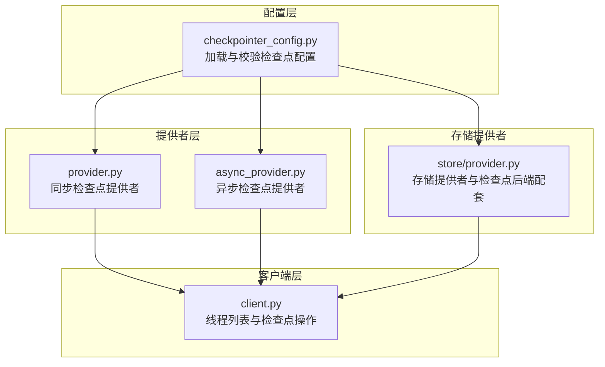
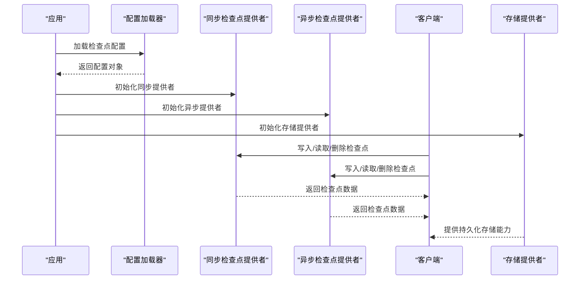
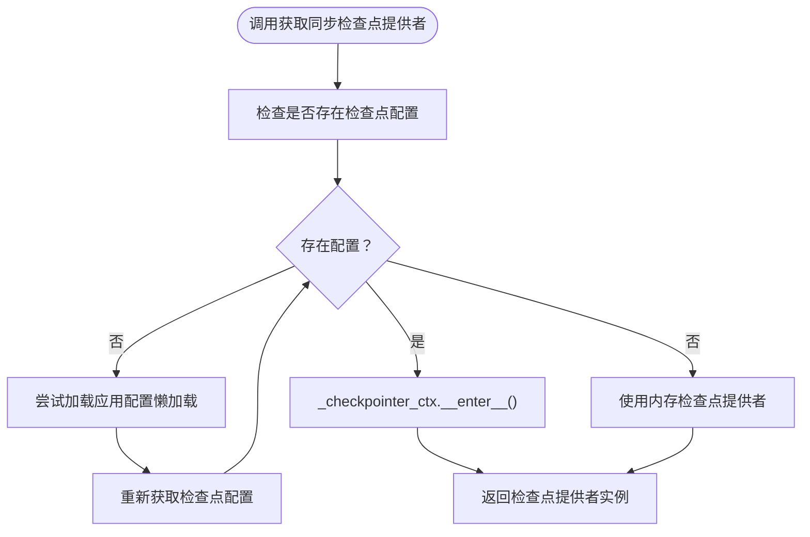
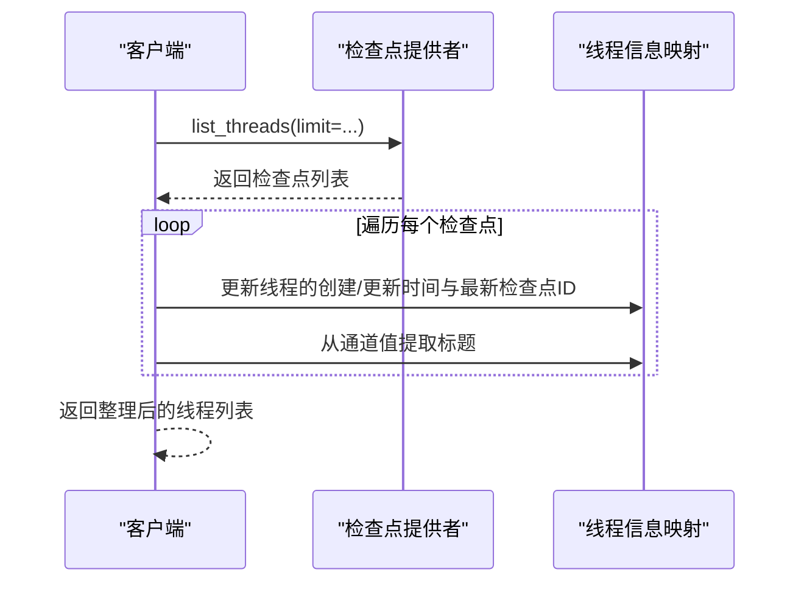
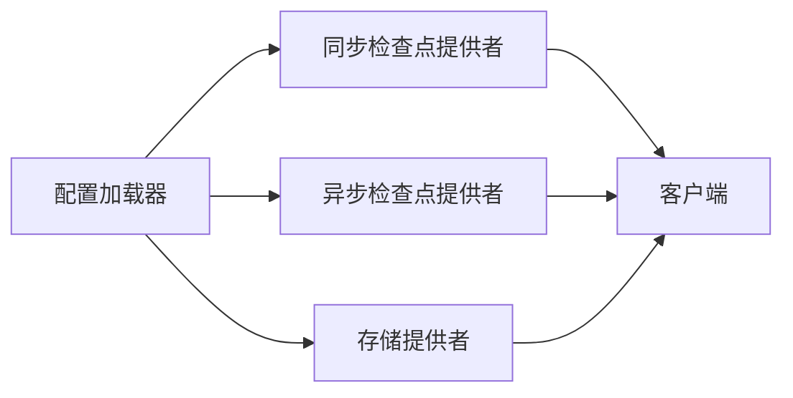

# 检查点系统

<cite>
**本文引用的文件**
- [checkpointer_config.py](file://backend/packages/harness/deerflow/config/checkpointer_config.py)
- [provider.py](file://backend/packages/harness/deerflow/runtime/checkpointer/provider.py)
- [async_provider.py](file://backend/packages/harness/deerflow/runtime/checkpointer/async_provider.py)
- [test_checkpointer.py](file://backend/tests/test_checkpointer.py)
- [client.py](file://backend/packages/harness/deerflow/client.py)
- [provider.py（存储）](file://backend/packages/harness/deerflow/runtime/store/provider.py)
</cite>

## 目录
1. [简介](#简介)
2. [项目结构](#项目结构)
3. [核心组件](#核心组件)
4. [架构总览](#架构总览)
5. [详细组件分析](#详细组件分析)
6. [依赖关系分析](#依赖关系分析)
7. [性能考量](#性能考量)
8. [故障排查指南](#故障排查指南)
9. [结论](#结论)
10. [附录](#附录)

## 简介
本技术文档围绕“检查点系统”展开，系统性阐述检查点的创建、保存、恢复与删除机制；对比同步与异步检查点提供者的实现差异；说明数据持久化策略与性能优化手段；并给出配置示例、自定义检查点逻辑的实现思路以及检查点冲突处理策略。同时覆盖版本管理与故障恢复建议，帮助开发者在生产环境中稳定地使用检查点能力。

## 项目结构
检查点系统主要由以下模块构成：
- 配置层：负责从应用配置中加载检查点后端类型与连接信息
- 提供者层：根据配置选择并实例化同步或异步检查点提供者
- 客户端层：对外暴露线程列表、检查点读写等接口，并进行时间戳与标题等元信息聚合
- 存储提供者：与检查点后端配套的存储提供者，用于持久化线程状态

图表来源
- [checkpointer_config.py](file://backend/packages/harness/deerflow/config/checkpointer_config.py)
- [provider.py](file://backend/packages/harness/deerflow/runtime/checkpointer/provider.py)
- [async_provider.py](file://backend/packages/harness/deerflow/runtime/checkpointer/async_provider.py)
- [client.py](file://backend/packages/harness/deerflow/client.py)
- [provider.py（存储）](file://backend/packages/harness/deerflow/runtime/store/provider.py)

章节来源
- [checkpointer_config.py](file://backend/packages/harness/deerflow/config/checkpointer_config.py)
- [provider.py](file://backend/packages/harness/deerflow/runtime/checkpointer/provider.py)
- [async_provider.py](file://backend/packages/harness/deerflow/runtime/checkpointer/async_provider.py)
- [client.py](file://backend/packages/harness/deerflow/client.py)
- [provider.py（存储）](file://backend/packages/harness/deerflow/runtime/store/provider.py)

## 核心组件
- 检查点配置加载器：负责解析配置字典，支持内存、SQLite、PostgreSQL等类型，并对缺失依赖抛出导入异常
- 同步检查点提供者：按需延迟加载应用配置，若未显式配置则回退到内存检查点提供者
- 异步检查点提供者：与同步提供者类似，但面向异步运行时
- 客户端工具：封装线程列表查询、检查点读写等操作，并基于时间戳与通道值维护线程元信息
- 存储提供者：与检查点后端配套，若未配置检查点后端则回退到内存存储

章节来源
- [checkpointer_config.py](file://backend/packages/harness/deerflow/config/checkpointer_config.py)
- [provider.py](file://backend/packages/harness/deerflow/runtime/checkpointer/provider.py)
- [async_provider.py](file://backend/packages/harness/deerflow/runtime/checkpointer/async_provider.py)
- [client.py](file://backend/packages/harness/deerflow/client.py)
- [provider.py（存储）](file://backend/packages/harness/deerflow/runtime/store/provider.py)

## 架构总览
检查点系统的运行流程如下：
- 应用启动时，通过配置加载器读取检查点配置
- 同步/异步提供者根据配置选择具体后端（内存、SQLite、PostgreSQL）
- 客户端通过提供者执行检查点的保存、恢复与删除
- 存储提供者与检查点后端配套，确保线程状态可持久化

图表来源
- [checkpointer_config.py](file://backend/packages/harness/deerflow/config/checkpointer_config.py)
- [provider.py](file://backend/packages/harness/deerflow/runtime/checkpointer/provider.py)
- [async_provider.py](file://backend/packages/harness/deerflow/runtime/checkpointer/async_provider.py)
- [client.py](file://backend/packages/harness/deerflow/client.py)
- [provider.py（存储）](file://backend/packages/harness/deerflow/runtime/store/provider.py)

## 详细组件分析

### 配置加载与校验
- 支持类型：内存、SQLite、PostgreSQL
- 连接字符串：根据类型进行必要性校验
- 缺失依赖：当对应后端包未安装时，触发导入错误提示
- 单例重置：提供重置函数以强制重建检查点提供者单例

章节来源
- [checkpointer_config.py](file://backend/packages/harness/deerflow/config/checkpointer_config.py)
- [test_checkpointer.py](file://backend/tests/test_checkpointer.py)

### 同步检查点提供者
- 延迟加载应用配置：仅在未显式设置全局配置时才尝试加载应用配置
- 回退策略：若无配置，使用内存检查点提供者
- 上下文管理：通过上下文管理器进入后端提供者实例
- 单例复用：避免重复初始化带来的资源浪费

图表来源
- [provider.py](file://backend/packages/harness/deerflow/runtime/checkpointer/provider.py)

章节来源
- [provider.py](file://backend/packages/harness/deerflow/runtime/checkpointer/provider.py)

### 异步检查点提供者
- 与同步提供者一致的延迟加载与回退策略
- 适配异步运行时，确保在异步上下文中正确进入与退出后端提供者

章节来源
- [async_provider.py](file://backend/packages/harness/deerflow/runtime/checkpointer/async_provider.py)

### 客户端与线程列表
- 列表聚合：遍历检查点结果，按线程 ID 聚合创建时间、更新时间、最新检查点 ID 与标题
- 时间戳比较：严格比较时间戳以确定最早创建与最晚更新
- 参数传递：向后端提供者传递分页与过滤参数

图表来源
- [client.py](file://backend/packages/harness/deerflow/client.py)

章节来源
- [client.py](file://backend/packages/harness/deerflow/client.py)

### 存储提供者与检查点后端配套
- 若未配置检查点后端，则发出警告并使用内存存储
- 当配置存在时，与检查点后端配套使用，确保线程状态持久化

章节来源
- [provider.py（存储）](file://backend/packages/harness/deerflow/runtime/store/provider.py)

## 依赖关系分析
- 配置依赖：检查点提供者依赖于配置加载器提供的配置对象
- 回退依赖：无配置时依赖内存提供者作为默认实现
- 异步依赖：异步提供者与同步提供者共享相同的配置与回退逻辑
- 客户端依赖：客户端依赖提供者进行检查点的读写与删除

图表来源
- [checkpointer_config.py](file://backend/packages/harness/deerflow/config/checkpointer_config.py)
- [provider.py](file://backend/packages/harness/deerflow/runtime/checkpointer/provider.py)
- [async_provider.py](file://backend/packages/harness/deerflow/runtime/checkpointer/async_provider.py)
- [client.py](file://backend/packages/harness/deerflow/client.py)
- [provider.py（存储）](file://backend/packages/harness/deerflow/runtime/store/provider.py)

章节来源
- [checkpointer_config.py](file://backend/packages/harness/deerflow/config/checkpointer_config.py)
- [provider.py](file://backend/packages/harness/deerflow/runtime/checkpointer/provider.py)
- [async_provider.py](file://backend/packages/harness/deerflow/runtime/checkpointer/async_provider.py)
- [client.py](file://backend/packages/harness/deerflow/client.py)
- [provider.py（存储）](file://backend/packages/harness/deerflow/runtime/store/provider.py)

## 性能考量
- 延迟加载：仅在首次需要时加载应用配置，减少启动开销
- 单例复用：避免重复初始化检查点提供者，降低资源消耗
- 内存回退：在开发或测试环境使用内存提供者，避免外部依赖带来的性能波动
- 分页与过滤：客户端在查询线程列表时传入分页参数，控制返回数量，提升响应速度
- 异步适配：异步提供者在高并发场景下更有利于吞吐量提升

## 故障排查指南
- 导入异常：当未安装对应后端包时会触发导入错误，请确认已安装相应依赖
- 配置缺失：若检查点配置为空，系统将回退到内存提供者；如需持久化，请在配置中指定后端类型与连接字符串
- 单例重置：若修改了检查点配置但仍使用旧实例，可通过重置函数强制重建单例
- 线程列表异常：若线程列表为空或不完整，请检查后端是否正常工作以及分页参数是否合理

章节来源
- [test_checkpointer.py](file://backend/tests/test_checkpointer.py)
- [provider.py](file://backend/packages/harness/deerflow/runtime/checkpointer/provider.py)
- [provider.py（存储）](file://backend/packages/harness/deerflow/runtime/store/provider.py)

## 结论
检查点系统通过配置驱动与延迟加载策略，在保证易用性的同时兼顾性能与可靠性。同步与异步提供者共享统一的配置与回退逻辑，客户端提供简洁的接口用于线程列表与检查点操作。在生产环境中，建议明确配置持久化后端并关注导入依赖与单例生命周期，以获得稳定的检查点能力。

## 附录

### 配置示例与最佳实践
- 内存模式：适用于开发与测试，无需额外依赖
- SQLite 模式：轻量级本地持久化，适合小规模部署
- PostgreSQL 模式：适合高并发与大规模部署，需确保数据库可用性与连接池配置

章节来源
- [checkpointer_config.py](file://backend/packages/harness/deerflow/config/checkpointer_config.py)
- [test_checkpointer.py](file://backend/tests/test_checkpointer.py)

### 自定义检查点逻辑与冲突处理
- 自定义提供者：可在现有提供者基础上扩展，遵循相同的配置加载与回退策略
- 冲突处理：在多实例或多进程场景下，建议通过后端事务与锁机制避免并发写入冲突；客户端应基于时间戳与检查点 ID 进行幂等判断

章节来源
- [provider.py](file://backend/packages/harness/deerflow/runtime/checkpointer/provider.py)
- [client.py](file://backend/packages/harness/deerflow/client.py)