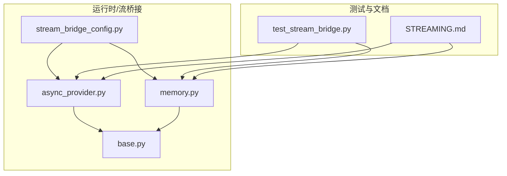
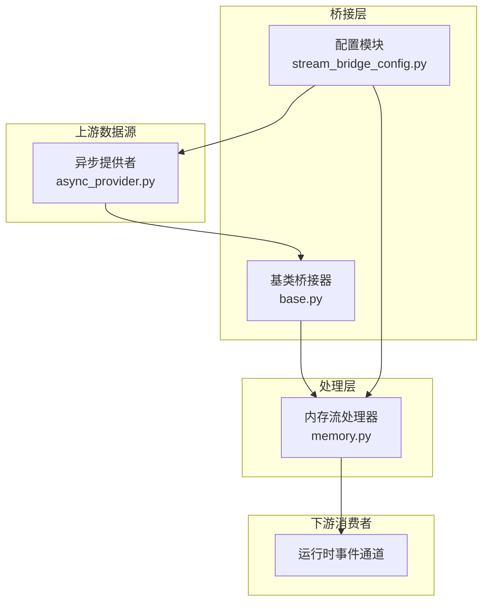
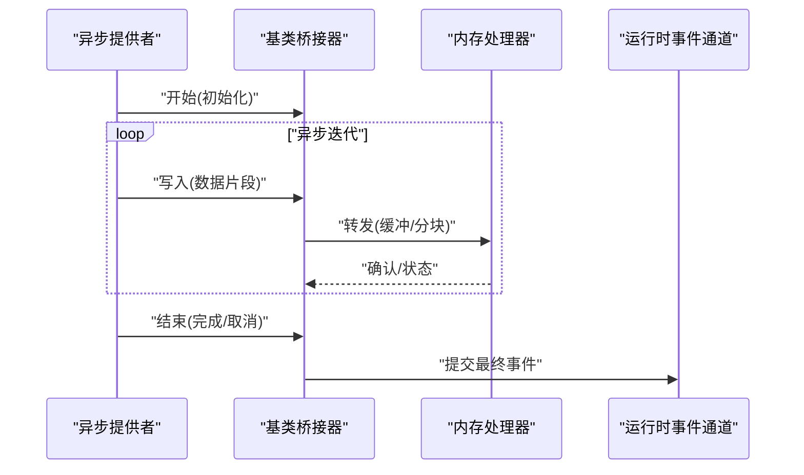
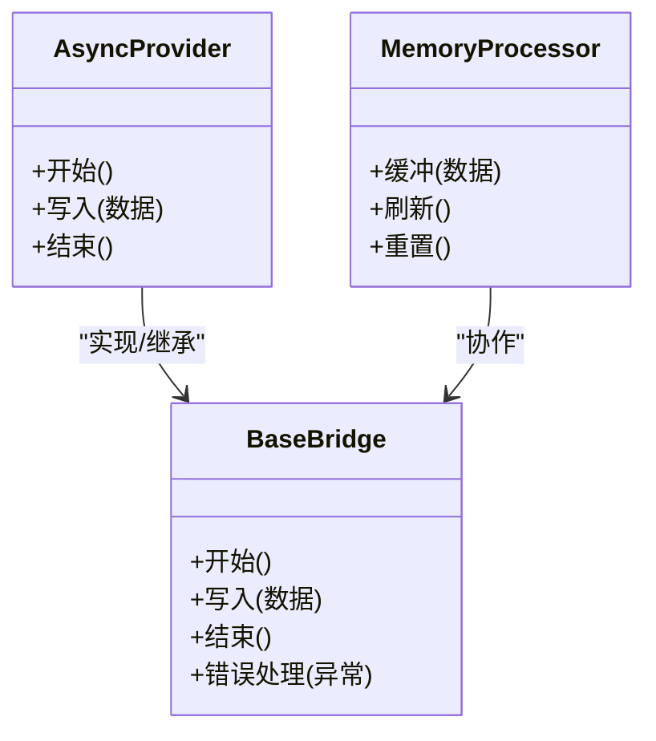
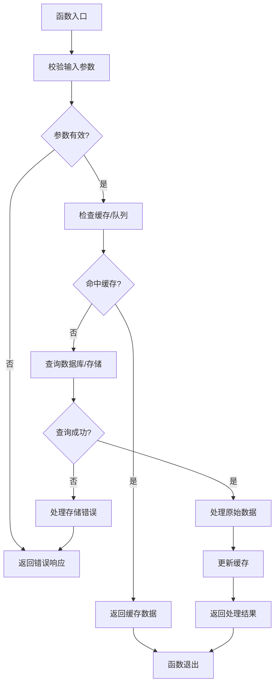
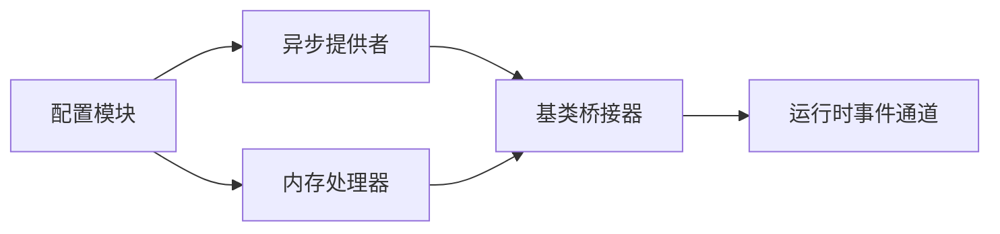

# 流桥接系统

<cite>
**本文引用的文件**
- [async_provider.py](file://backend/packages/harness/deerflow/runtime/stream_bridge/async_provider.py)
- [base.py](file://backend/packages/harness/deerflow/runtime/stream_bridge/base.py)
- [memory.py](file://backend/packages/harness/deerflow/runtime/stream_bridge/memory.py)
- [stream_bridge_config.py](file://backend/packages/harness/deerflow/config/stream_bridge_config.py)
- [test_stream_bridge.py](file://backend/tests/test_stream_bridge.py)
- [STREAMING.md](file://backend/docs/STREAMING.md)
- [runtime_init.py](file://backend/packages/harness/deerflow/runtime/__init__.py)
</cite>

## 目录
1. [简介](#简介)
2. [项目结构](#项目结构)
3. [核心组件](#核心组件)
4. [架构总览](#架构总览)
5. [详细组件分析](#详细组件分析)
6. [依赖关系分析](#依赖关系分析)
7. [性能考虑](#性能考虑)
8. [故障排查指南](#故障排查指南)
9. [结论](#结论)
10. [附录](#附录)

## 简介
本技术文档围绕“流桥接系统”展开，系统性阐述流式数据在运行时层的桥接机制、内存流处理器以及异步提供者的实现方式。重点覆盖数据流的转换、缓冲、传输与错误处理策略，并提供可操作的配置与使用指引，帮助开发者在真实场景中安全、稳定地进行实时数据处理与传输。

## 项目结构
流桥接系统位于运行时模块的子目录下，主要由以下文件构成：
- 异步提供者：负责以异步方式生成或消费流数据
- 基类抽象：定义统一的流桥接接口与生命周期管理
- 内存流处理器：基于内存的缓冲与转发逻辑
- 配置模块：集中管理流桥接相关参数
- 单元测试：验证桥接行为与边界条件
- 文档：提供流式传输的设计说明与最佳实践

图表来源
- [async_provider.py](file://backend/packages/harness/deerflow/runtime/stream_bridge/async_provider.py)
- [base.py](file://backend/packages/harness/deerflow/runtime/stream_bridge/base.py)
- [memory.py](file://backend/packages/harness/deerflow/runtime/stream_bridge/memory.py)
- [stream_bridge_config.py](file://backend/packages/harness/deerflow/config/stream_bridge_config.py)
- [test_stream_bridge.py](file://backend/tests/test_stream_bridge.py)
- [STREAMING.md](file://backend/docs/STREAMING.md)

章节来源
- [runtime_init.py](file://backend/packages/harness/deerflow/runtime/__init__.py)

## 核心组件
- 异步提供者（Async Provider）
  - 负责以异步方式产生或消费流数据，支持背压与取消语义
  - 提供统一的异步迭代接口，便于与运行时事件循环集成
- 基类抽象（Base Bridge）
  - 定义流桥接的核心契约：开始、写入、结束、错误处理等
  - 统一生命周期管理，确保资源正确释放
- 内存流处理器（Memory Stream Processor）
  - 在内存中维护缓冲区，按策略进行分块与转发
  - 支持批量写入、超时刷新与异常隔离
- 配置模块（Stream Bridge Config）
  - 暴露关键参数：缓冲大小、刷新间隔、超时阈值、并发限制等
  - 通过集中配置简化部署与调优

章节来源
- [async_provider.py](file://backend/packages/harness/deerflow/runtime/stream_bridge/async_provider.py)
- [base.py](file://backend/packages/harness/deerflow/runtime/stream_bridge/base.py)
- [memory.py](file://backend/packages/harness/deerflow/runtime/stream_bridge/memory.py)
- [stream_bridge_config.py](file://backend/packages/harness/deerflow/config/stream_bridge_config.py)

## 架构总览
整体架构采用“异步提供者 + 基类桥接 + 内存处理器”的分层设计，通过配置模块对运行参数进行集中控制。数据从异步提供者产生，经基类桥接器统一调度，再由内存处理器进行缓冲与分发，最终通过运行时事件通道对外输出。

图表来源
- [async_provider.py](file://backend/packages/harness/deerflow/runtime/stream_bridge/async_provider.py)
- [base.py](file://backend/packages/harness/deerflow/runtime/stream_bridge/base.py)
- [memory.py](file://backend/packages/harness/deerflow/runtime/stream_bridge/memory.py)
- [stream_bridge_config.py](file://backend/packages/harness/deerflow/config/stream_bridge_config.py)

## 详细组件分析

### 异步提供者（Async Provider）
职责与特性
- 以异步迭代的方式产出数据片段，适配运行时的异步生态
- 支持取消与背压，避免在高负载下造成内存压力
- 与基类桥接器配合，完成数据的接入与生命周期管理

关键流程（序列图）

图表来源
- [async_provider.py](file://backend/packages/harness/deerflow/runtime/stream_bridge/async_provider.py)
- [base.py](file://backend/packages/harness/deerflow/runtime/stream_bridge/base.py)
- [memory.py](file://backend/packages/harness/deerflow/runtime/stream_bridge/memory.py)

章节来源
- [async_provider.py](file://backend/packages/harness/deerflow/runtime/stream_bridge/async_provider.py)

### 基类桥接器（Base Bridge）
职责与特性
- 定义统一的桥接接口：开始、写入、结束、错误处理
- 管理生命周期与资源回收，确保异常场景下的稳定性
- 作为异步提供者与内存处理器之间的协调者

类关系（类图）

图表来源
- [base.py](file://backend/packages/harness/deerflow/runtime/stream_bridge/base.py)
- [async_provider.py](file://backend/packages/harness/deerflow/runtime/stream_bridge/async_provider.py)
- [memory.py](file://backend/packages/harness/deerflow/runtime/stream_bridge/memory.py)

章节来源
- [base.py](file://backend/packages/harness/deerflow/runtime/stream_bridge/base.py)

### 内存流处理器（Memory Stream Processor）
职责与特性
- 在内存中维护缓冲区，按配置策略进行分块与刷新
- 支持批量写入与超时触发，兼顾吞吐与延迟
- 对异常进行隔离与恢复，避免单点故障影响整体链路

算法流程（流程图）

图表来源
- [memory.py](file://backend/packages/harness/deerflow/runtime/stream_bridge/memory.py)

章节来源
- [memory.py](file://backend/packages/harness/deerflow/runtime/stream_bridge/memory.py)

### 配置模块（Stream Bridge Config）
职责与特性
- 集中管理流桥接的关键参数：缓冲大小、刷新间隔、超时阈值、并发限制等
- 通过配置驱动行为，便于在不同环境与负载下进行快速调优

章节来源
- [stream_bridge_config.py](file://backend/packages/harness/deerflow/config/stream_bridge_config.py)

### 单元测试（Test Stream Bridge）
职责与特性
- 验证异步提供者与内存处理器的行为一致性
- 覆盖正常路径、边界条件与异常场景，确保稳定性

章节来源
- [test_stream_bridge.py](file://backend/tests/test_stream_bridge.py)

## 依赖关系分析
- 组件耦合
  - 异步提供者与基类桥接器存在强契约依赖，前者必须遵循后者的接口规范
  - 内存处理器依赖于基类桥接器的状态与数据流转
- 外部依赖
  - 运行时事件通道用于最终输出，需满足事件格式与序列化要求
  - 配置模块为所有组件提供统一参数来源，降低分散配置带来的风险

图表来源
- [async_provider.py](file://backend/packages/harness/deerflow/runtime/stream_bridge/async_provider.py)
- [base.py](file://backend/packages/harness/deerflow/runtime/stream_bridge/base.py)
- [memory.py](file://backend/packages/harness/deerflow/runtime/stream_bridge/memory.py)
- [stream_bridge_config.py](file://backend/packages/harness/deerflow/config/stream_bridge_config.py)

章节来源
- [async_provider.py](file://backend/packages/harness/deerflow/runtime/stream_bridge/async_provider.py)
- [base.py](file://backend/packages/harness/deerflow/runtime/stream_bridge/base.py)
- [memory.py](file://backend/packages/harness/deerflow/runtime/stream_bridge/memory.py)
- [stream_bridge_config.py](file://backend/packages/harness/deerflow/config/stream_bridge_config.py)

## 性能考虑
- 缓冲与分块
  - 合理设置缓冲大小与刷新间隔，平衡延迟与吞吐
  - 对高频小包进行合并，减少事件通道压力
- 背压与取消
  - 在异步提供者中实现背压与取消信号，避免过载
  - 使用超时与重试策略提升鲁棒性
- 并发与资源
  - 控制并发度，避免过多线程/协程导致上下文切换开销
  - 及时释放临时资源，防止内存泄漏
- 序列化与传输
  - 优先使用轻量级序列化格式，减少 CPU 开销
  - 对大对象进行分片传输，避免一次性阻塞

## 故障排查指南
常见问题与对策
- 数据丢失或重复
  - 检查内存处理器的缓冲与刷新策略是否合理
  - 核对异步提供者的写入确认机制与基类桥接器的状态同步
- 性能退化
  - 调整缓冲大小与刷新间隔，观察延迟与吞吐变化
  - 检查是否存在未及时释放的资源或阻塞操作
- 异常传播
  - 确认错误处理流程是否完整，避免异常穿透至运行时事件通道
  - 在单元测试中补充边界与异常用例，提前发现潜在问题

章节来源
- [test_stream_bridge.py](file://backend/tests/test_stream_bridge.py)
- [STREAMING.md](file://backend/docs/STREAMING.md)

## 结论
流桥接系统通过“异步提供者 + 基类桥接器 + 内存处理器”的分层设计，在保证实时性的同时提升了系统的稳定性与可维护性。结合集中式配置与完善的测试覆盖，能够在复杂场景中实现可靠的流式数据传输与处理。

## 附录
- 使用建议
  - 在生产环境中优先启用背压与超时控制
  - 将配置参数纳入运维平台，支持动态调整
  - 对关键路径增加监控指标，如缓冲长度、刷新频率、错误率等
- 扩展方向
  - 支持多路复用与优先级调度，进一步提升并发能力
  - 引入持久化缓冲，增强断点续传与容错能力