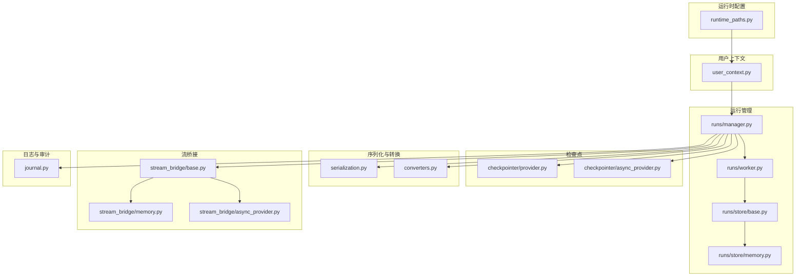
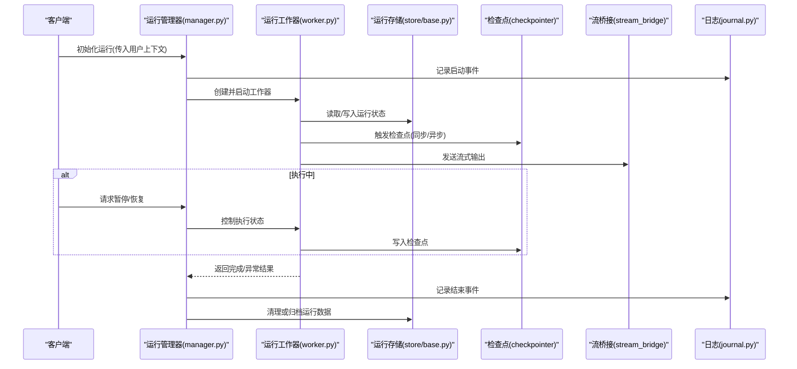
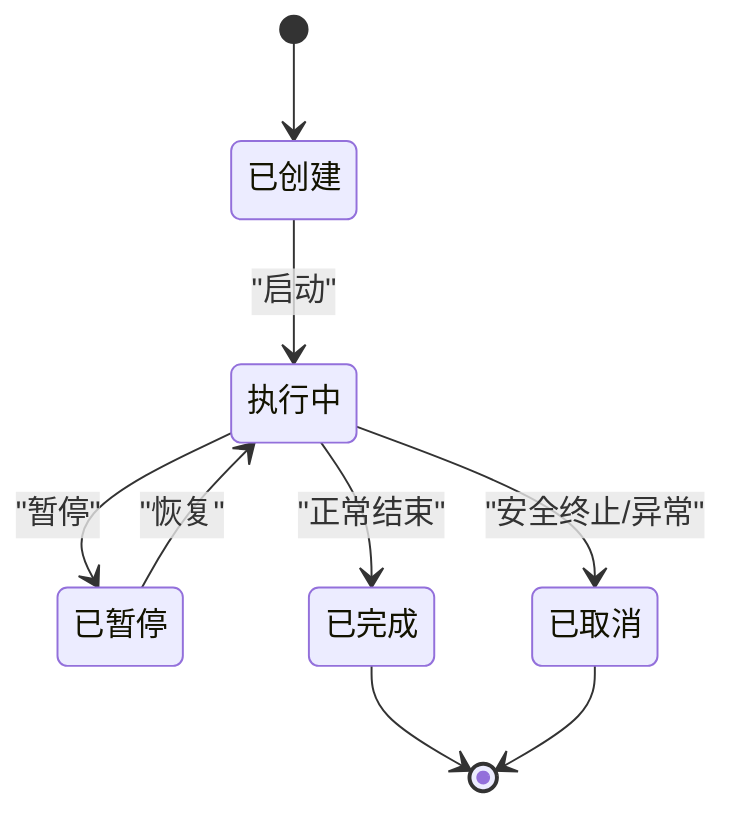
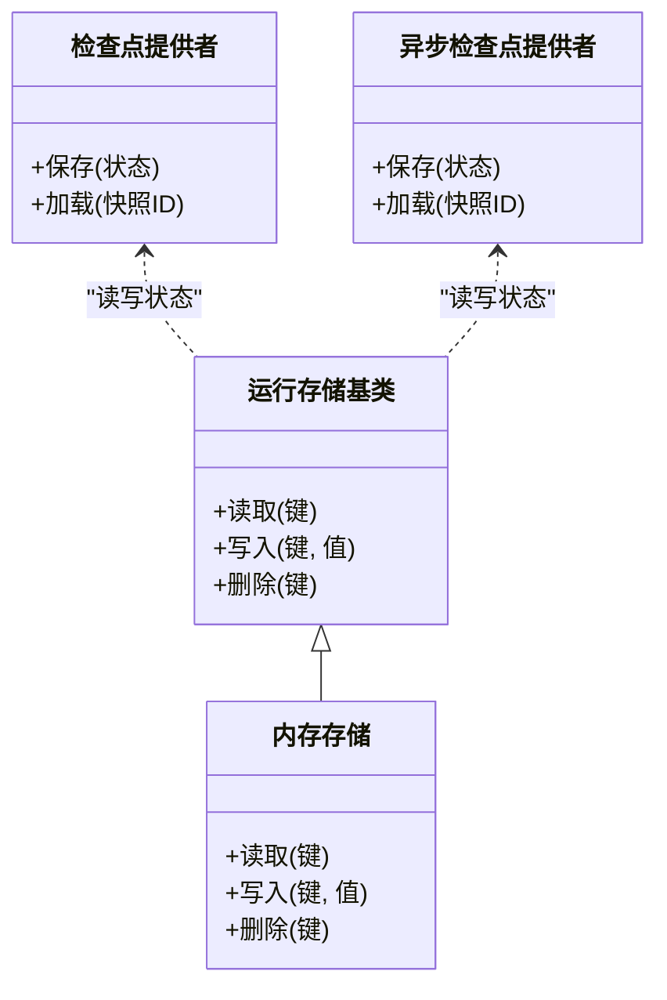
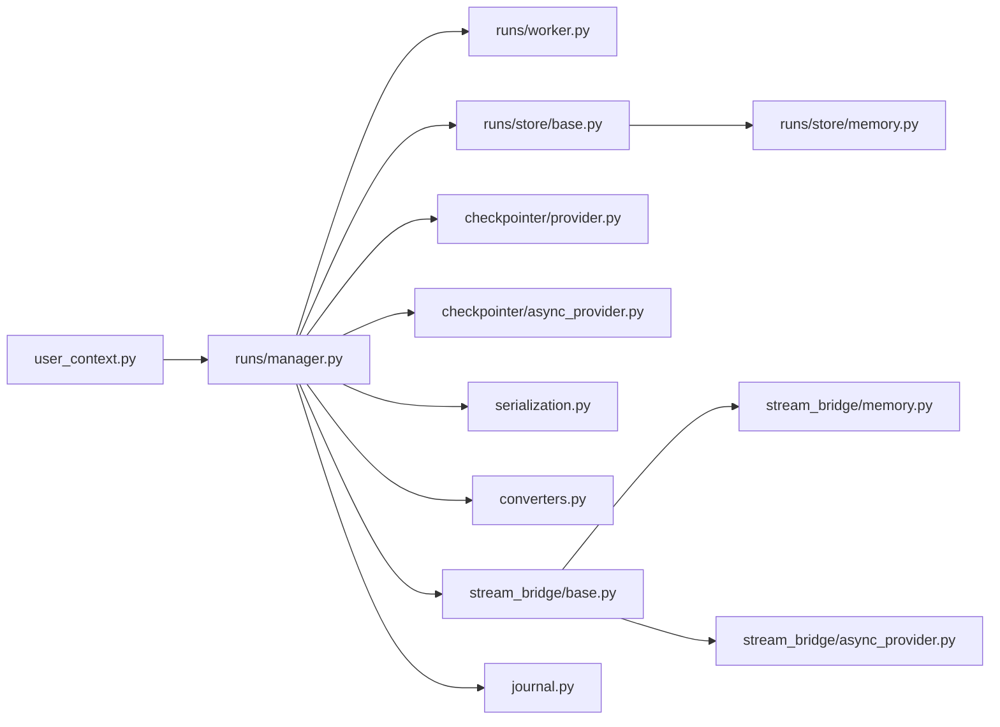

# 运行时生命周期管理

<cite>
**本文引用的文件**
- [runtime_paths.py](file://backend/packages/harness/deerflow/config/runtime_paths.py)
- [user_context.py](file://backend/packages/harness/deerflow/runtime/user_context.py)
- [journal.py](file://backend/packages/harness/deerflow/runtime/journal.py)
- [manager.py](file://backend/packages/harness/deerflow/runtime/runs/manager.py)
- [worker.py](file://backend/packages/harness/deerflow/runtime/runs/worker.py)
- [store.py](file://backend/packages/harness/deerflow/runtime/runs/store/base.py)
- [memory_store.py](file://backend/packages/harness/deerflow/runtime/runs/store/memory.py)
- [checkpointer_provider.py](file://backend/packages/harness/deerflow/runtime/checkpointer/provider.py)
- [async_checkpointer_provider.py](file://backend/packages/harness/deerflow/runtime/checkpointer/async_provider.py)
- [serialization.py](file://backend/packages/harness/deerflow/runtime/serialization.py)
- [converters.py](file://backend/packages/harness/deerflow/runtime/converters.py)
- [stream_bridge_base.py](file://backend/packages/harness/deerflow/runtime/stream_bridge/base.py)
- [stream_bridge_memory.py](file://backend/packages/harness/deerflow/runtime/stream_bridge/memory.py)
- [stream_bridge_async_provider.py](file://backend/packages/harness/deerflow/runtime/stream_bridge/async_provider.py)
- [test_runtime_lifecycle_e2e.py](file://backend/tests/test_runtime_lifecycle_e2e.py)
- [test_gateway_runtime_cleanup.py](file://backend/tests/test_gateway_runtime_cleanup.py)
- [blocking_io_runtime.py](file://backend/tests/support/detectors/blocking_io_runtime.py)
</cite>

## 目录
1. [引言](#引言)
2. [项目结构](#项目结构)
3. [核心组件](#核心组件)
4. [架构总览](#架构总览)
5. [详细组件分析](#详细组件分析)
6. [依赖关系分析](#依赖关系分析)
7. [性能考量](#性能考量)
8. [故障排查指南](#故障排查指南)
9. [结论](#结论)
10. [附录](#附录)

## 引言
本技术文档聚焦于 DeerFlow 后端运行时（Runtime）的生命周期管理，系统性阐述运行时的启动、执行、暂停、恢复与终止流程；详解用户上下文管理、运行日志记录、状态持久化与资源清理机制；并提供可操作的代码示例路径，帮助开发者正确初始化运行时、监控执行状态与处理异常。文档同时总结生命周期钩子函数的使用方式与最佳实践。

## 项目结构
运行时相关能力主要集中在后端 harness 包下的 deerflow 子包中，围绕“运行时配置、用户上下文、运行管理、事件与检查点、序列化与桥接”等模块组织。关键目录与文件如下：
- 配置：runtime 路径与环境配置
- 用户上下文：会话与用户状态管理
- 运行管理：运行生命周期、工作器与存储
- 检查点：同步与异步检查点提供者
- 序列化与转换：消息与状态序列化
- 流桥接：内存与异步流桥接
- 日志与审计：运行日志与审计记录

图表来源
- [runtime_paths.py](file://backend/packages/harness/deerflow/config/runtime_paths.py)
- [user_context.py](file://backend/packages/harness/deerflow/runtime/user_context.py)
- [manager.py](file://backend/packages/harness/deerflow/runtime/runs/manager.py)
- [worker.py](file://backend/packages/harness/deerflow/runtime/runs/worker.py)
- [store.py](file://backend/packages/harness/deerflow/runtime/runs/store/base.py)
- [memory_store.py](file://backend/packages/harness/deerflow/runtime/runs/store/memory.py)
- [checkpointer_provider.py](file://backend/packages/harness/deerflow/runtime/checkpointer/provider.py)
- [async_checkpointer_provider.py](file://backend/packages/harness/deerflow/runtime/checkpointer/async_provider.py)
- [serialization.py](file://backend/packages/harness/deerflow/runtime/serialization.py)
- [converters.py](file://backend/packages/harness/deerflow/runtime/converters.py)
- [stream_bridge_base.py](file://backend/packages/harness/deerflow/runtime/stream_bridge/base.py)
- [stream_bridge_memory.py](file://backend/packages/harness/deerflow/runtime/stream_bridge/memory.py)
- [stream_bridge_async_provider.py](file://backend/packages/harness/deerflow/runtime/stream_bridge/async_provider.py)
- [journal.py](file://backend/packages/harness/deerflow/runtime/journal.py)

章节来源
- [runtime_paths.py](file://backend/packages/harness/deerflow/config/runtime_paths.py)
- [user_context.py](file://backend/packages/harness/deerflow/runtime/user_context.py)
- [manager.py](file://backend/packages/harness/deerflow/runtime/runs/manager.py)
- [worker.py](file://backend/packages/harness/deerflow/runtime/runs/worker.py)
- [store.py](file://backend/packages/harness/deerflow/runtime/runs/store/base.py)
- [memory_store.py](file://backend/packages/harness/deerflow/runtime/runs/store/memory.py)
- [checkpointer_provider.py](file://backend/packages/harness/deerflow/runtime/checkpointer/provider.py)
- [async_checkpointer_provider.py](file://backend/packages/harness/deerflow/runtime/checkpointer/async_provider.py)
- [serialization.py](file://backend/packages/harness/deerflow/runtime/serialization.py)
- [converters.py](file://backend/packages/harness/deerflow/runtime/converters.py)
- [stream_bridge_base.py](file://backend/packages/harness/deerflow/runtime/stream_bridge/base.py)
- [stream_bridge_memory.py](file://backend/packages/harness/deerflow/runtime/stream_bridge/memory.py)
- [stream_bridge_async_provider.py](file://backend/packages/harness/deerflow/runtime/stream_bridge/async_provider.py)
- [journal.py](file://backend/packages/harness/deerflow/runtime/journal.py)

## 核心组件
- 运行时配置与路径：定义运行时所需的基础路径与环境参数，确保各模块在统一的运行环境中初始化。
- 用户上下文：维护当前用户的会话信息与上下文状态，贯穿运行时的整个生命周期。
- 运行管理器与工作器：负责运行的创建、调度、暂停、恢复与终止，并协调存储与检查点。
- 运行存储：抽象运行状态的存储接口与内存实现，支持运行元数据与中间结果的持久化。
- 检查点提供者：提供同步与异步两种检查点机制，保障运行中断后的可恢复性。
- 序列化与转换：负责运行状态、消息与事件的序列化与反序列化。
- 流桥接：在运行过程中桥接流式输出，支持内存与异步提供者。
- 日志与审计：记录运行过程中的关键事件与审计信息，便于追踪与排障。

章节来源
- [runtime_paths.py](file://backend/packages/harness/deerflow/config/runtime_paths.py)
- [user_context.py](file://backend/packages/harness/deerflow/runtime/user_context.py)
- [manager.py](file://backend/packages/harness/deerflow/runtime/runs/manager.py)
- [worker.py](file://backend/packages/harness/deerflow/runtime/runs/worker.py)
- [store.py](file://backend/packages/harness/deerflow/runtime/runs/store/base.py)
- [memory_store.py](file://backend/packages/harness/deerflow/runtime/runs/store/memory.py)
- [checkpointer_provider.py](file://backend/packages/harness/deerflow/runtime/checkpointer/provider.py)
- [async_checkpointer_provider.py](file://backend/packages/harness/deerflow/runtime/checkpointer/async_provider.py)
- [serialization.py](file://backend/packages/harness/deerflow/runtime/serialization.py)
- [converters.py](file://backend/packages/harness/deerflow/runtime/converters.py)
- [stream_bridge_base.py](file://backend/packages/harness/deerflow/runtime/stream_bridge/base.py)
- [stream_bridge_memory.py](file://backend/packages/harness/deerflow/runtime/stream_bridge/memory.py)
- [stream_bridge_async_provider.py](file://backend/packages/harness/deerflow/runtime/stream_bridge/async_provider.py)
- [journal.py](file://backend/packages/harness/deerflow/runtime/journal.py)

## 架构总览
下图展示了运行时生命周期从启动到终止的关键交互，包括用户上下文注入、运行管理器调度、工作器执行、存储与检查点协同、流桥接以及日志审计。

图表来源
- [manager.py](file://backend/packages/harness/deerflow/runtime/runs/manager.py)
- [worker.py](file://backend/packages/harness/deerflow/runtime/runs/worker.py)
- [store.py](file://backend/packages/harness/deerflow/runtime/runs/store/base.py)
- [checkpointer_provider.py](file://backend/packages/harness/deerflow/runtime/checkpointer/provider.py)
- [async_checkpointer_provider.py](file://backend/packages/harness/deerflow/runtime/checkpointer/async_provider.py)
- [stream_bridge_base.py](file://backend/packages/harness/deerflow/runtime/stream_bridge/base.py)
- [journal.py](file://backend/packages/harness/deerflow/runtime/journal.py)

## 详细组件分析

### 用户上下文管理
- 职责：在运行时启动前注入用户身份与上下文，贯穿运行期间的状态读写与权限控制。
- 关键点：上下文应包含用户标识、租户隔离、会话令牌等必要字段；在运行管理器初始化阶段进行校验与绑定。
- 示例路径：
  - [user_context.py](file://backend/packages/harness/deerflow/runtime/user_context.py)
  - [manager.py](file://backend/packages/harness/deerflow/runtime/runs/manager.py)

章节来源
- [user_context.py](file://backend/packages/harness/deerflow/runtime/user_context.py)
- [manager.py](file://backend/packages/harness/deerflow/runtime/runs/manager.py)

### 运行生命周期与执行控制
- 启动：运行管理器根据用户上下文与配置创建运行实例，初始化存储与检查点。
- 执行：工作器驱动运行逻辑，周期性触发检查点，向流桥接发送输出。
- 暂停/恢复：通过工作器状态机控制执行暂停与恢复，检查点用于断点续跑。
- 终止：根据完成原因（正常/异常/安全终止）记录日志并清理资源。
- 示例路径：
  - [manager.py](file://backend/packages/harness/deerflow/runtime/runs/manager.py)
  - [worker.py](file://backend/packages/harness/deerflow/runtime/runs/worker.py)
  - [test_runtime_lifecycle_e2e.py](file://backend/tests/test_runtime_lifecycle_e2e.py)

图表来源
- [manager.py](file://backend/packages/harness/deerflow/runtime/runs/manager.py)
- [worker.py](file://backend/packages/harness/deerflow/runtime/runs/worker.py)

章节来源
- [manager.py](file://backend/packages/harness/deerflow/runtime/runs/manager.py)
- [worker.py](file://backend/packages/harness/deerflow/runtime/runs/worker.py)
- [test_runtime_lifecycle_e2e.py](file://backend/tests/test_runtime_lifecycle_e2e.py)

### 状态持久化与检查点
- 存储接口：抽象运行状态的读写，内存实现用于测试与快速验证。
- 检查点提供者：支持同步与异步两种模式，保证运行中断后的可恢复性。
- 示例路径：
  - [store.py](file://backend/packages/harness/deerflow/runtime/runs/store/base.py)
  - [memory_store.py](file://backend/packages/harness/deerflow/runtime/runs/store/memory.py)
  - [checkpointer_provider.py](file://backend/packages/harness/deerflow/runtime/checkpointer/provider.py)
  - [async_checkpointer_provider.py](file://backend/packages/harness/deerflow/runtime/checkpointer/async_provider.py)

图表来源
- [store.py](file://backend/packages/harness/deerflow/runtime/runs/store/base.py)
- [memory_store.py](file://backend/packages/harness/deerflow/runtime/runs/store/memory.py)
- [checkpointer_provider.py](file://backend/packages/harness/deerflow/runtime/checkpointer/provider.py)
- [async_checkpointer_provider.py](file://backend/packages/harness/deerflow/runtime/checkpointer/async_provider.py)

章节来源
- [store.py](file://backend/packages/harness/deerflow/runtime/runs/store/base.py)
- [memory_store.py](file://backend/packages/harness/deerflow/runtime/runs/store/memory.py)
- [checkpointer_provider.py](file://backend/packages/harness/deerflow/runtime/checkpointer/provider.py)
- [async_checkpointer_provider.py](file://backend/packages/harness/deerflow/runtime/checkpointer/async_provider.py)

### 序列化与转换
- 序列化：对运行状态、消息与事件进行序列化，确保跨进程/跨模块传输一致性。
- 转换器：将内部对象转换为对外可见的数据结构，或反之。
- 示例路径：
  - [serialization.py](file://backend/packages/harness/deerflow/runtime/serialization.py)
  - [converters.py](file://backend/packages/harness/deerflow/runtime/converters.py)

章节来源
- [serialization.py](file://backend/packages/harness/deerflow/runtime/serialization.py)
- [converters.py](file://backend/packages/harness/deerflow/runtime/converters.py)

### 流桥接与输出
- 流桥接：在运行过程中将中间结果以流式方式输出，支持内存与异步提供者。
- 示例路径：
  - [stream_bridge_base.py](file://backend/packages/harness/deerflow/runtime/stream_bridge/base.py)
  - [stream_bridge_memory.py](file://backend/packages/harness/deerflow/runtime/stream_bridge/memory.py)
  - [stream_bridge_async_provider.py](file://backend/packages/harness/deerflow/runtime/stream_bridge/async_provider.py)

章节来源
- [stream_bridge_base.py](file://backend/packages/harness/deerflow/runtime/stream_bridge/base.py)
- [stream_bridge_memory.py](file://backend/packages/harness/deerflow/runtime/stream_bridge/memory.py)
- [stream_bridge_async_provider.py](file://backend/packages/harness/deerflow/runtime/stream_bridge/async_provider.py)

### 日志记录与审计
- 日志：记录运行启动、暂停、恢复、完成与异常等关键事件，便于问题定位与审计。
- 审计：结合安全终止策略，记录异常与保护性终止的原因与影响范围。
- 示例路径：
  - [journal.py](file://backend/packages/harness/deerflow/runtime/journal.py)
  - [test_runtime_lifecycle_e2e.py](file://backend/tests/test_runtime_lifecycle_e2e.py)

章节来源
- [journal.py](file://backend/packages/harness/deerflow/runtime/journal.py)
- [test_runtime_lifecycle_e2e.py](file://backend/tests/test_runtime_lifecycle_e2e.py)

### 生命周期钩子函数与最佳实践
- 钩子位置建议：
  - 启动前：校验用户上下文与配置，准备存储与检查点。
  - 执行中：定期触发检查点，上报进度与指标。
  - 暂停/恢复：保存/恢复断点状态，确保幂等。
  - 终止后：清理临时资源，归档运行元数据。
- 最佳实践：
  - 使用异步检查点避免阻塞主执行线程。
  - 在高并发场景下，确保存储与检查点的原子性与一致性。
  - 对敏感字段进行脱敏与最小化记录，遵循隐私与合规要求。
  - 将日志分级与结构化，便于检索与告警。

章节来源
- [manager.py](file://backend/packages/harness/deerflow/runtime/runs/manager.py)
- [worker.py](file://backend/packages/harness/deerflow/runtime/runs/worker.py)
- [checkpointer_provider.py](file://backend/packages/harness/deerflow/runtime/checkpointer/provider.py)
- [async_checkpointer_provider.py](file://backend/packages/harness/deerflow/runtime/checkpointer/async_provider.py)
- [journal.py](file://backend/packages/harness/deerflow/runtime/journal.py)

## 依赖关系分析
运行时各模块之间的耦合与协作如下：

图表来源
- [user_context.py](file://backend/packages/harness/deerflow/runtime/user_context.py)
- [manager.py](file://backend/packages/harness/deerflow/runtime/runs/manager.py)
- [worker.py](file://backend/packages/harness/deerflow/runtime/runs/worker.py)
- [store.py](file://backend/packages/harness/deerflow/runtime/runs/store/base.py)
- [memory_store.py](file://backend/packages/harness/deerflow/runtime/runs/store/memory.py)
- [checkpointer_provider.py](file://backend/packages/harness/deerflow/runtime/checkpointer/provider.py)
- [async_checkpointer_provider.py](file://backend/packages/harness/deerflow/runtime/checkpointer/async_provider.py)
- [serialization.py](file://backend/packages/harness/deerflow/runtime/serialization.py)
- [converters.py](file://backend/packages/harness/deerflow/runtime/converters.py)
- [stream_bridge_base.py](file://backend/packages/harness/deerflow/runtime/stream_bridge/base.py)
- [stream_bridge_memory.py](file://backend/packages/harness/deerflow/runtime/stream_bridge/memory.py)
- [stream_bridge_async_provider.py](file://backend/packages/harness/deerflow/runtime/stream_bridge/async_provider.py)
- [journal.py](file://backend/packages/harness/deerflow/runtime/journal.py)

章节来源
- [user_context.py](file://backend/packages/harness/deerflow/runtime/user_context.py)
- [manager.py](file://backend/packages/harness/deerflow/runtime/runs/manager.py)
- [worker.py](file://backend/packages/harness/deerflow/runtime/runs/worker.py)
- [store.py](file://backend/packages/harness/deerflow/runtime/runs/store/base.py)
- [memory_store.py](file://backend/packages/harness/deerflow/runtime/runs/store/memory.py)
- [checkpointer_provider.py](file://backend/packages/harness/deerflow/runtime/checkpointer/provider.py)
- [async_checkpointer_provider.py](file://backend/packages/harness/deerflow/runtime/checkpointer/async_provider.py)
- [serialization.py](file://backend/packages/harness/deerflow/runtime/serialization.py)
- [converters.py](file://backend/packages/harness/deerflow/runtime/converters.py)
- [stream_bridge_base.py](file://backend/packages/harness/deerflow/runtime/stream_bridge/base.py)
- [stream_bridge_memory.py](file://backend/packages/harness/deerflow/runtime/stream_bridge/memory.py)
- [stream_bridge_async_provider.py](file://backend/packages/harness/deerflow/runtime/stream_bridge/async_provider.py)
- [journal.py](file://backend/packages/harness/deerflow/runtime/journal.py)

## 性能考量
- 检查点频率：在高频更新场景下，采用异步检查点降低延迟抖动。
- 存储选择：生产环境优先使用高性能存储后端，测试环境可用内存存储提升速度。
- 序列化开销：对大对象进行分片或压缩，减少网络与磁盘 IO。
- 并发控制：在多工作器共享同一存储时，引入锁或版本控制避免竞态。
- 资源回收：及时释放未使用的文件句柄、连接池与缓存，防止内存泄漏。

## 故障排查指南
- 阻塞 IO 检测：通过测试辅助工具检测潜在阻塞调用，避免影响运行时吞吐。
  - 参考路径：[blocking_io_runtime.py](file://backend/tests/support/detectors/blocking_io_runtime.py)
- 运行生命周期端到端测试：验证启动、暂停/恢复、终止与清理流程是否符合预期。
  - 参考路径：[test_runtime_lifecycle_e2e.py](file://backend/tests/test_runtime_lifecycle_e2e.py)
- 网关运行时清理：确保服务关闭或重启时清理残留运行状态。
  - 参考路径：[test_gateway_runtime_cleanup.py](file://backend/tests/test_gateway_runtime_cleanup.py)
- 日志审计：结合运行日志定位异常节点与失败原因，必要时启用更详细的调试级别。

章节来源
- [blocking_io_runtime.py](file://backend/tests/support/detectors/blocking_io_runtime.py)
- [test_runtime_lifecycle_e2e.py](file://backend/tests/test_runtime_lifecycle_e2e.py)
- [test_gateway_runtime_cleanup.py](file://backend/tests/test_gateway_runtime_cleanup.py)

## 结论
运行时生命周期管理是 DeerFlow 的核心能力之一。通过清晰的模块划分与严格的流程控制，系统实现了从启动到终止的全链路可观测与可恢复。配合完善的用户上下文、状态持久化、流桥接与日志审计，开发者可以构建稳定、可扩展的运行时执行环境。建议在实际部署中遵循异步检查点、结构化日志与资源回收的最佳实践，持续优化性能与可靠性。

## 附录
- 初始化运行时示例路径（不展示具体代码内容）：
  - [runtime_paths.py](file://backend/packages/harness/deerflow/config/runtime_paths.py)
  - [user_context.py](file://backend/packages/harness/deerflow/runtime/user_context.py)
  - [manager.py](file://backend/packages/harness/deerflow/runtime/runs/manager.py)
- 监控执行状态示例路径：
  - [worker.py](file://backend/packages/harness/deerflow/runtime/runs/worker.py)
  - [journal.py](file://backend/packages/harness/deerflow/runtime/journal.py)
- 处理异常与安全终止示例路径：
  - [test_runtime_lifecycle_e2e.py](file://backend/tests/test_runtime_lifecycle_e2e.py)
  - [test_gateway_runtime_cleanup.py](file://backend/tests/test_gateway_runtime_cleanup.py)
- 生命周期钩子函数使用建议：
  - 启动前：校验上下文与配置，准备存储与检查点。
  - 执行中：定期保存检查点，上报进度与指标。
  - 暂停/恢复：保存/恢复断点，确保幂等。
  - 终止后：清理临时资源，归档元数据。