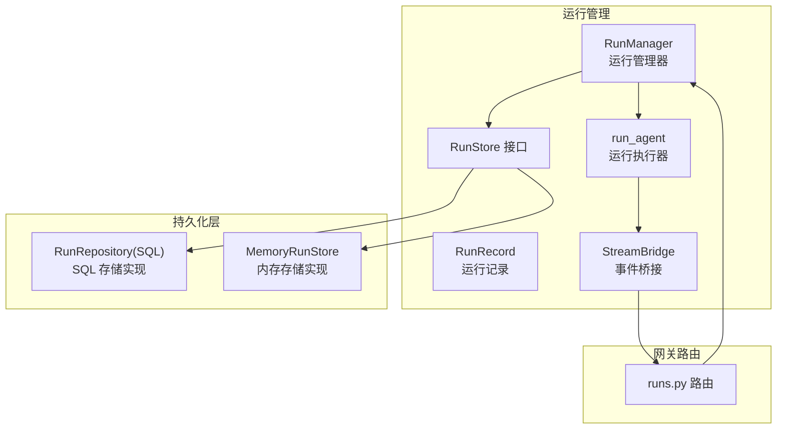
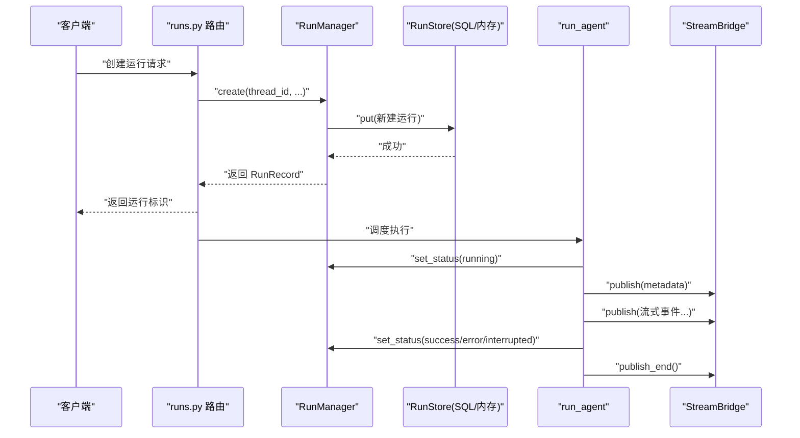
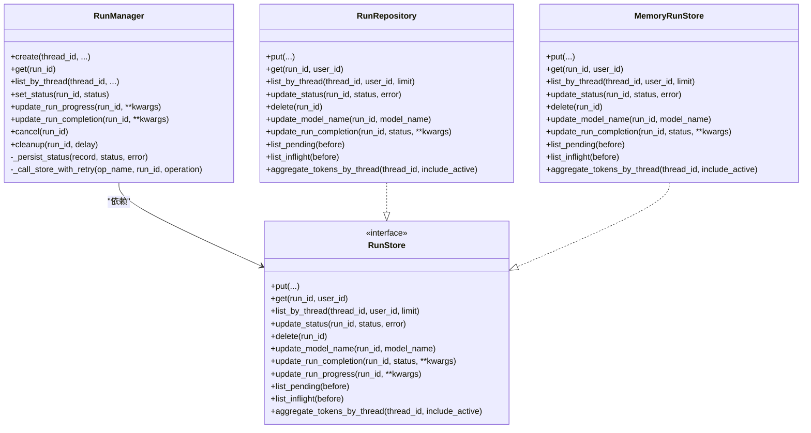
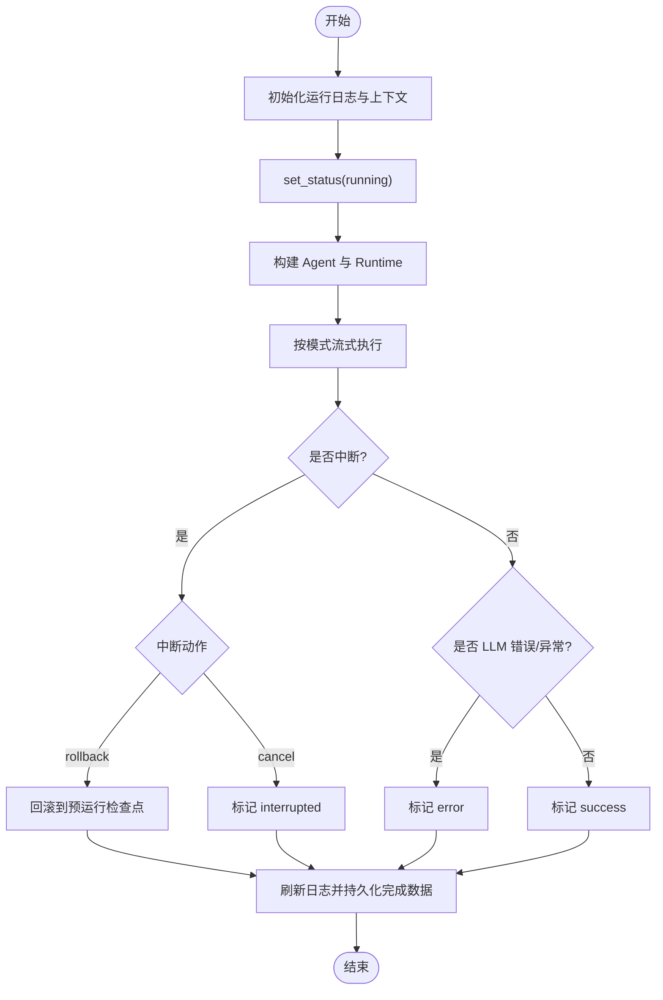
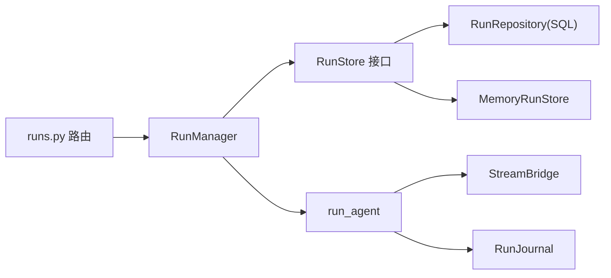

# 运行管理

<cite>
**本文引用的文件**
- [backend/packages/harness/deerflow/runtime/runs/manager.py](file://backend/packages/harness/deerflow/runtime/runs/manager.py)
- [backend/packages/harness/deerflow/runtime/runs/worker.py](file://backend/packages/harness/deerflow/runtime/runs/worker.py)
- [backend/packages/harness/deerflow/runtime/runs/store/base.py](file://backend/packages/harness/deerflow/runtime/runs/store/base.py)
- [backend/packages/harness/deerflow/persistence/run/sql.py](file://backend/packages/harness/deerflow/persistence/run/sql.py)
- [backend/packages/harness/deerflow/runtime/runs/store/memory.py](file://backend/packages/harness/deerflow/runtime/runs/store/memory.py)
- [backend/packages/harness/deerflow/runtime/runs/schemas.py](file://backend/packages/harness/deerflow/runtime/runs/schemas.py)
- [backend/app/gateway/routers/runs.py](file://backend/app/gateway/routers/runs.py)
- [backend/tests/test_run_manager.py](file://backend/tests/test_run_manager.py)
- [backend/tests/test_cancel_run_idempotent.py](file://backend/tests/test_cancel_run_idempotent.py)
- [backend/tests/test_run_repository.py](file://backend/tests/test_run_repository.py)
</cite>

## 目录
1. [引言](#引言)
2. [项目结构](#项目结构)
3. [核心组件](#核心组件)
4. [架构总览](#架构总览)
5. [详细组件分析](#详细组件分析)
6. [依赖关系分析](#依赖关系分析)
7. [性能考量](#性能考量)
8. [故障排查指南](#故障排查指南)
9. [结论](#结论)
10. [附录](#附录)

## 引言
本技术文档聚焦于“运行管理”模块，系统阐述运行实例的创建、调度、监控与清理全生命周期流程；明确运行命名规则、数据模式定义、工作线程池与并发控制机制；并提供启动新运行、监控运行状态、实现自定义运行逻辑的实践指引。文档同时覆盖运行生命周期管理与资源分配策略，帮助开发者在高并发场景下稳定地管理多运行实例。

## 项目结构
运行管理相关代码主要分布在以下位置：
- 运行管理器与运行记录：runtime/runs/manager.py
- 运行执行与事件桥接：runtime/runs/worker.py
- 运行存储接口与实现：runtime/runs/store/* 与 persistence/run/sql.py
- 运行状态枚举：runtime/runs/schemas.py
- 网关路由入口：app/gateway/routers/runs.py
- 单元测试：tests/test_run_manager.py、tests/test_cancel_run_idempotent.py、tests/test_run_repository.py

图表来源
- [backend/packages/harness/deerflow/runtime/runs/manager.py](file://backend/packages/harness/deerflow/runtime/runs/manager.py)
- [backend/packages/harness/deerflow/runtime/runs/worker.py](file://backend/packages/harness/deerflow/runtime/runs/worker.py)
- [backend/packages/harness/deerflow/runtime/runs/store/base.py](file://backend/packages/harness/deerflow/runtime/runs/store/base.py)
- [backend/packages/harness/deerflow/persistence/run/sql.py](file://backend/packages/harness/deerflow/persistence/run/sql.py)
- [backend/packages/harness/deerflow/runtime/runs/store/memory.py](file://backend/packages/harness/deerflow/runtime/runs/store/memory.py)
- [backend/app/gateway/routers/runs.py](file://backend/app/gateway/routers/runs.py)

章节来源
- [backend/packages/harness/deerflow/runtime/runs/manager.py](file://backend/packages/harness/deerflow/runtime/runs/manager.py)
- [backend/packages/harness/deerflow/runtime/runs/worker.py](file://backend/packages/harness/deerflow/runtime/runs/worker.py)
- [backend/packages/harness/deerflow/runtime/runs/store/base.py](file://backend/packages/harness/deerflow/runtime/runs/store/base.py)
- [backend/packages/harness/deerflow/persistence/run/sql.py](file://backend/packages/harness/deerflow/persistence/run/sql.py)
- [backend/packages/harness/deerflow/runtime/runs/store/memory.py](file://backend/packages/harness/deerflow/runtime/runs/store/memory.py)
- [backend/app/gateway/routers/runs.py](file://backend/app/gateway/routers/runs.py)

## 核心组件
- 运行管理器（RunManager）
  - 提供运行的创建、状态变更、进度更新、完成数据持久化、取消与清理等能力
  - 使用异步锁保护内部状态，支持可选的持久化后端
  - 支持幂等取消、中断回滚策略、重试持久化策略
- 运行执行器（run_agent）
  - 在后台执行 Agent，发布事件到 StreamBridge
  - 管理检查点快照、运行日志、令牌用量统计、最终状态判定
- 运行存储接口（RunStore）
  - 定义 put/get/list/update 等抽象方法，支持多种实现（SQL、内存）
- SQL 存储实现（RunRepository）
  - 基于 SQLAlchemy 的异步实现，支持列表查询、状态恢复、模型名规范化
- 内存存储实现（MemoryRunStore）
  - 用于测试或轻量场景，提供基本的 CRUD 与查询能力
- 运行状态枚举（RunStatus）
  - 定义运行生命周期状态：pending、running、success、error、timeout、interrupted

章节来源
- [backend/packages/harness/deerflow/runtime/runs/manager.py](file://backend/packages/harness/deerflow/runtime/runs/manager.py)
- [backend/packages/harness/deerflow/runtime/runs/worker.py](file://backend/packages/harness/deerflow/runtime/runs/worker.py)
- [backend/packages/harness/deerflow/runtime/runs/store/base.py](file://backend/packages/harness/deerflow/runtime/runs/store/base.py)
- [backend/packages/harness/deerflow/persistence/run/sql.py](file://backend/packages/harness/deerflow/persistence/run/sql.py)
- [backend/packages/harness/deerflow/runtime/runs/store/memory.py](file://backend/packages/harness/deerflow/runtime/runs/store/memory.py)
- [backend/packages/harness/deerflow/runtime/runs/schemas.py](file://backend/packages/harness/deerflow/runtime/runs/schemas.py)

## 架构总览
运行管理采用“管理器 + 执行器 + 持久化”的分层架构：
- 网关路由接收请求，创建运行记录并交由 RunManager 管理
- RunManager 将运行注册到内存，并可持久化到后端
- 后台 Worker 调用 run_agent 执行 Agent，期间通过 StreamBridge 发布事件
- 运行完成后，RunManager 更新完成数据并持久化
- 支持取消、中断、回滚等生命周期操作

图表来源
- [backend/app/gateway/routers/runs.py](file://backend/app/gateway/routers/runs.py)
- [backend/packages/harness/deerflow/runtime/runs/manager.py](file://backend/packages/harness/deerflow/runtime/runs/manager.py)
- [backend/packages/harness/deerflow/runtime/runs/worker.py](file://backend/packages/harness/deerflow/runtime/runs/worker.py)

## 详细组件分析

### 运行管理器（RunManager）
- 职责
  - 创建运行、注册运行、状态转换、进度与完成数据持久化
  - 取消运行、中断处理、回滚策略、幂等性保证
  - 并发安全：所有变更在异步锁内进行
  - 持久化重试：基于退避策略应对瞬时错误
- 关键方法
  - create：生成唯一 run_id，写入内存并持久化
  - set_status：状态转换并持久化
  - update_run_progress：仅在 running 状态下持久化进度
  - update_run_completion：持久化完成指标（令牌用量、消息数等）
  - cancel：设置中断事件并转为 interrupted 或触发回滚
  - cleanup：延迟清理运行记录
- 幂等取消
  - 已中断运行再次取消返回 True
  - 成功运行取消返回 False，不改变其状态

图表来源
- [backend/packages/harness/deerflow/runtime/runs/manager.py](file://backend/packages/harness/deerflow/runtime/runs/manager.py)
- [backend/packages/harness/deerflow/runtime/runs/store/base.py](file://backend/packages/harness/deerflow/runtime/runs/store/base.py)
- [backend/packages/harness/deerflow/persistence/run/sql.py](file://backend/packages/harness/deerflow/persistence/run/sql.py)
- [backend/packages/harness/deerflow/runtime/runs/store/memory.py](file://backend/packages/harness/deerflow/runtime/runs/store/memory.py)

章节来源
- [backend/packages/harness/deerflow/runtime/runs/manager.py](file://backend/packages/harness/deerflow/runtime/runs/manager.py)
- [backend/tests/test_run_manager.py](file://backend/tests/test_run_manager.py)
- [backend/tests/test_cancel_run_idempotent.py](file://backend/tests/test_cancel_run_idempotent.py)

### 运行执行器（run_agent）
- 职责
  - 初始化运行日志、构建 Runtime 上下文、安装 LangChain 回调
  - 执行 Agent 流式输出，将事件通过 StreamBridge 发布
  - 处理中断、回滚、异常、最终状态判定与完成数据持久化
- 关键流程
  - 标记 running，发布 metadata
  - 构建 Agent 与 Runtime，注入上下文与回调
  - 根据请求模式选择单模式或多模式流式输出
  - 监听 abort_event 实现即时中断
  - 最终根据中断动作或异常设置 success/error/interrupted
  - 刷新运行日志、持久化完成数据、同步标题到线程元信息、更新线程状态
- 中断与回滚
  - 支持 rollback 动作：回滚到预运行检查点并标记 error
  - 默认动作：标记 interrupted

图表来源
- [backend/packages/harness/deerflow/runtime/runs/worker.py](file://backend/packages/harness/deerflow/runtime/runs/worker.py)
- [backend/packages/harness/deerflow/runtime/runs/manager.py](file://backend/packages/harness/deerflow/runtime/runs/manager.py)

章节来源
- [backend/packages/harness/deerflow/runtime/runs/worker.py](file://backend/packages/harness/deerflow/runtime/runs/worker.py)

### 运行存储接口与实现
- RunStore 抽象
  - 定义 put/get/list/update/delete/聚合等方法
  - 支持 update_run_progress（默认空实现，具体由实现类覆盖）
- RunRepository（SQL 实现）
  - 支持 list_pending/list_inflight，用于启动恢复
  - 模型名规范化与截断（最大 128 字符）
- MemoryRunStore（内存实现）
  - 提供基本 CRUD 与排序、过滤能力，适合测试与本地开发

章节来源
- [backend/packages/harness/deerflow/runtime/runs/store/base.py](file://backend/packages/harness/deerflow/runtime/runs/store/base.py)
- [backend/packages/harness/deerflow/persistence/run/sql.py](file://backend/packages/harness/deerflow/persistence/run/sql.py)
- [backend/packages/harness/deerflow/runtime/runs/store/memory.py](file://backend/packages/harness/deerflow/runtime/runs/store/memory.py)
- [backend/tests/test_run_repository.py](file://backend/tests/test_run_repository.py)

### 运行状态与命名规则
- 运行状态（RunStatus）
  - pending、running、success、error、timeout、interrupted
- 运行命名规则
  - run_id 采用 UUID v4 生成，确保全局唯一
  - thread_id 作为运行归属标识，用于按线程查询与聚合
  - assistant_id、model_name、metadata、kwargs 等作为运行元信息存储
- 数据模式定义
  - 字段包括：run_id、thread_id、assistant_id、status、on_disconnect、multitask_strategy、metadata、kwargs、created_at、updated_at、error、model_name、以及完成指标（令牌用量、消息数、LLM 调用次数等）

章节来源
- [backend/packages/harness/deerflow/runtime/runs/schemas.py](file://backend/packages/harness/deerflow/runtime/runs/schemas.py)
- [backend/packages/harness/deerflow/runtime/runs/manager.py](file://backend/packages/harness/deerflow/runtime/runs/manager.py)
- [backend/packages/harness/deerflow/persistence/run/sql.py](file://backend/packages/harness/deerflow/persistence/run/sql.py)

### 并发控制与资源分配
- 并发控制
  - RunManager 使用 asyncio.Lock 保护内部运行表与状态变更
  - 持久化操作采用带退避的重试策略，避免 SQLite 压力过大
- 资源分配
  - 运行执行器在后台协程中运行，通过 StreamBridge 发布事件
  - 运行完成后延迟清理（默认 60 秒），释放连接与缓存
- 多任务策略
  - 支持 reject/rollback/interrupt 等策略，用于处理同一线程并发运行
  - create_or_reject 与 create_or_rollback 保障旧运行不受新运行持久化失败影响

章节来源
- [backend/packages/harness/deerflow/runtime/runs/manager.py](file://backend/packages/harness/deerflow/runtime/runs/manager.py)
- [backend/packages/harness/deerflow/runtime/runs/worker.py](file://backend/packages/harness/deerflow/runtime/runs/worker.py)
- [backend/tests/test_run_manager.py](file://backend/tests/test_run_manager.py)

### 生命周期管理与清理
- 生命周期
  - pending → running → success/error/timeout/interrupted
  - 支持回滚（rollback）与中断（interrupt）两种终止路径
- 清理
  - cleanup 延迟删除运行记录，避免过早释放资源
  - 完成数据持久化后，同步标题到线程元信息并更新线程状态

章节来源
- [backend/packages/harness/deerflow/runtime/runs/manager.py](file://backend/packages/harness/deerflow/runtime/runs/manager.py)
- [backend/packages/harness/deerflow/runtime/runs/worker.py](file://backend/packages/harness/deerflow/runtime/runs/worker.py)

### 如何使用：启动新运行、监控状态与自定义逻辑
- 启动新运行
  - 通过网关路由创建运行，传入 thread_id、assistant_id、multitask_strategy 等参数
  - RunManager.create 返回 RunRecord，随后调度 run_agent 执行
- 监控运行状态
  - 通过 RunManager.get/list_by_thread 查询运行状态与进度
  - 通过 StreamBridge 订阅事件流，实时获取运行进展
- 自定义运行逻辑
  - 在 run_agent 中注入自定义中间件或回调
  - 通过 RunManager.update_run_progress/update_run_completion 持久化自定义指标
  - 使用 RunManager.set_status 手动推进状态（谨慎使用）

章节来源
- [backend/app/gateway/routers/runs.py](file://backend/app/gateway/routers/runs.py)
- [backend/packages/harness/deerflow/runtime/runs/manager.py](file://backend/packages/harness/deerflow/runtime/runs/manager.py)
- [backend/packages/harness/deerflow/runtime/runs/worker.py](file://backend/packages/harness/deerflow/runtime/runs/worker.py)

## 依赖关系分析
- 组件耦合
  - RunManager 依赖 RunStore 接口，具体实现可替换
  - run_agent 依赖 RunManager、StreamBridge、检查点与事件存储
  - 网关路由依赖 RunManager 创建与调度运行
- 外部依赖
  - SQLAlchemy（SQL 实现）
  - asyncio（并发与锁）
  - LangGraph/LangChain（Agent 执行与回调）

图表来源
- [backend/app/gateway/routers/runs.py](file://backend/app/gateway/routers/runs.py)
- [backend/packages/harness/deerflow/runtime/runs/manager.py](file://backend/packages/harness/deerflow/runtime/runs/manager.py)
- [backend/packages/harness/deerflow/runtime/runs/worker.py](file://backend/packages/harness/deerflow/runtime/runs/worker.py)
- [backend/packages/harness/deerflow/runtime/runs/store/base.py](file://backend/packages/harness/deerflow/runtime/runs/store/base.py)
- [backend/packages/harness/deerflow/persistence/run/sql.py](file://backend/packages/harness/deerflow/persistence/run/sql.py)
- [backend/packages/harness/deerflow/runtime/runs/store/memory.py](file://backend/packages/harness/deerflow/runtime/runs/store/memory.py)

章节来源
- [backend/packages/harness/deerflow/runtime/runs/manager.py](file://backend/packages/harness/deerflow/runtime/runs/manager.py)
- [backend/packages/harness/deerflow/runtime/runs/worker.py](file://backend/packages/harness/deerflow/runtime/runs/worker.py)
- [backend/packages/harness/deerflow/runtime/runs/store/base.py](file://backend/packages/harness/deerflow/runtime/runs/store/base.py)
- [backend/packages/harness/deerflow/persistence/run/sql.py](file://backend/packages/harness/deerflow/persistence/run/sql.py)
- [backend/packages/harness/deerflow/runtime/runs/store/memory.py](file://backend/packages/harness/deerflow/runtime/runs/store/memory.py)
- [backend/app/gateway/routers/runs.py](file://backend/app/gateway/routers/runs.py)

## 性能考量
- 持久化压力缓解
  - RunManager 对持久化操作采用退避重试，降低 SQLite 竞争
  - update_run_progress 仅在 running 状态持久化，减少写放大
- 并发与锁粒度
  - RunManager 使用细粒度异步锁，避免长时间持有锁
- 资源回收
  - 运行结束后延迟清理，平衡资源占用与回收效率

## 故障排查指南
- 取消幂等性
  - 已中断运行再次取消应返回 True；成功运行取消应返回 False
- 状态一致性
  - set_status 应正确持久化；若持久化失败，应记录警告并尝试恢复
- 模型名规范化
  - SQL 实现会规范化并截断模型名，确保长度与格式一致
- 回滚失败
  - 回滚到预运行检查点失败时，应记录警告并保持 error 状态

章节来源
- [backend/tests/test_cancel_run_idempotent.py](file://backend/tests/test_cancel_run_idempotent.py)
- [backend/tests/test_run_manager.py](file://backend/tests/test_run_manager.py)
- [backend/tests/test_run_repository.py](file://backend/tests/test_run_repository.py)

## 结论
运行管理模块以 RunManager 为核心，结合 run_agent 的后台执行与 StreamBridge 的事件发布，实现了从创建、调度、监控到清理的完整生命周期管理。通过 RunStore 接口与多种实现，系统具备良好的可扩展性与可维护性。在高并发场景下，建议合理配置多任务策略、启用回滚与幂等取消，并利用持久化重试策略提升稳定性。

## 附录
- 关键 API 与路径参考
  - 创建运行：[backend/app/gateway/routers/runs.py](file://backend/app/gateway/routers/runs.py)
  - 运行管理器：[backend/packages/harness/deerflow/runtime/runs/manager.py](file://backend/packages/harness/deerflow/runtime/runs/manager.py)
  - 运行执行器：[backend/packages/harness/deerflow/runtime/runs/worker.py](file://backend/packages/harness/deerflow/runtime/runs/worker.py)
  - 存储接口与实现：[backend/packages/harness/deerflow/runtime/runs/store/base.py](file://backend/packages/harness/deerflow/runtime/runs/store/base.py)、[backend/packages/harness/deerflow/persistence/run/sql.py](file://backend/packages/harness/deerflow/persistence/run/sql.py)、[backend/packages/harness/deerflow/runtime/runs/store/memory.py](file://backend/packages/harness/deerflow/runtime/runs/store/memory.py)
  - 状态枚举：[backend/packages/harness/deerflow/runtime/runs/schemas.py](file://backend/packages/harness/deerflow/runtime/runs/schemas.py)