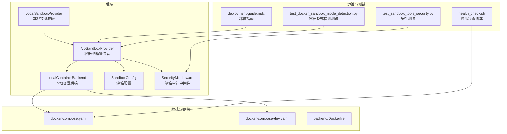
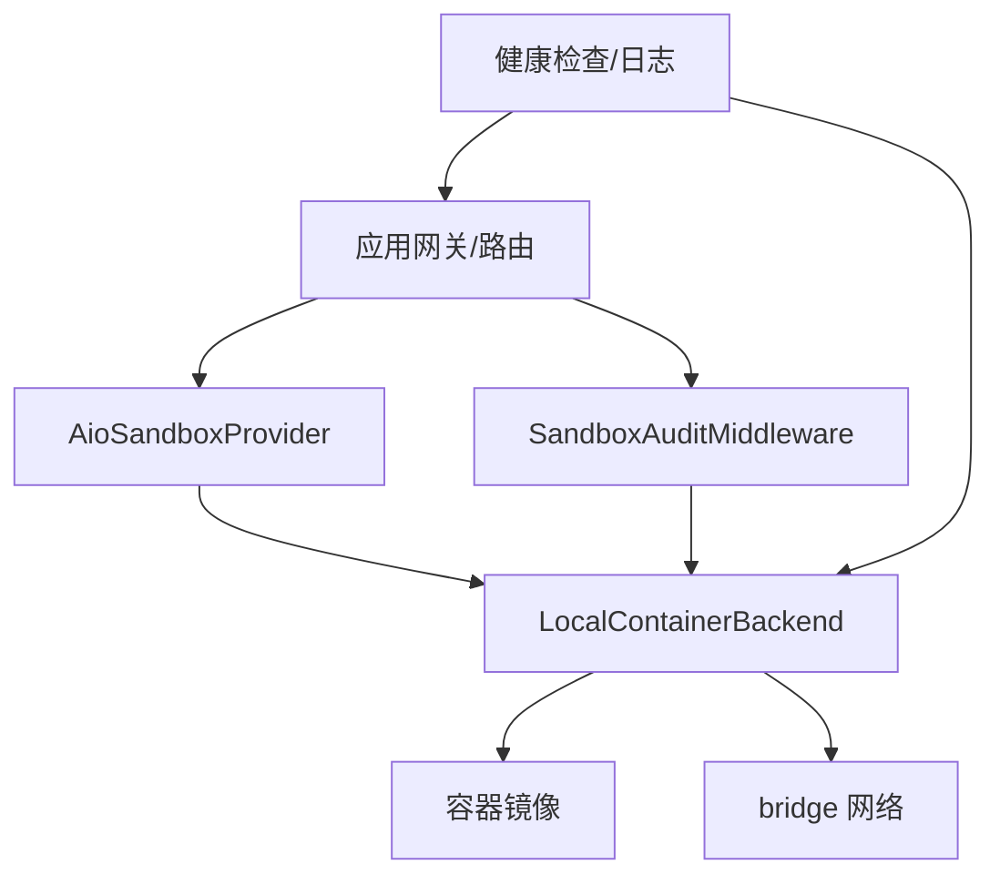
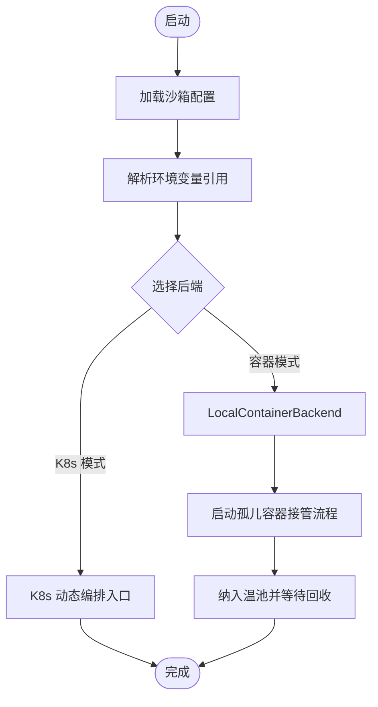
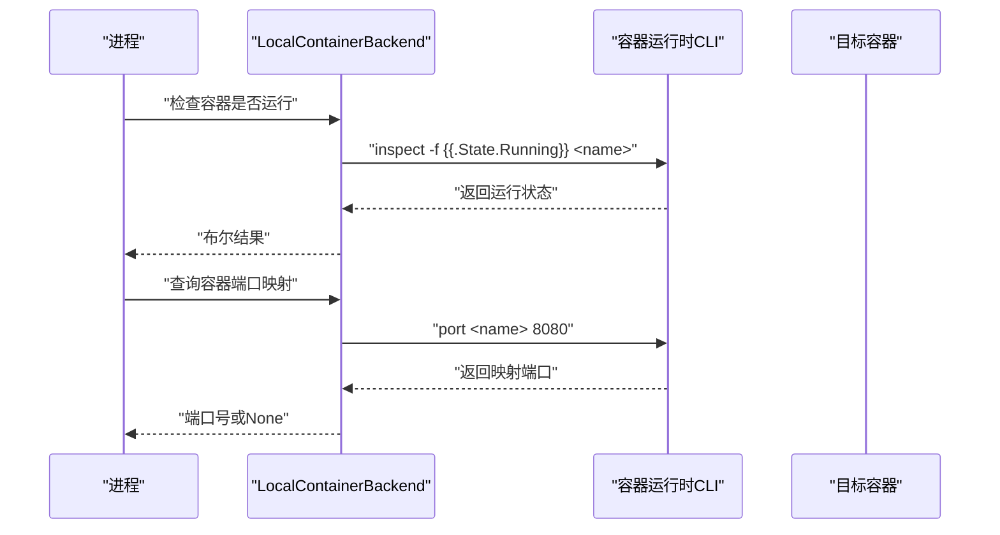
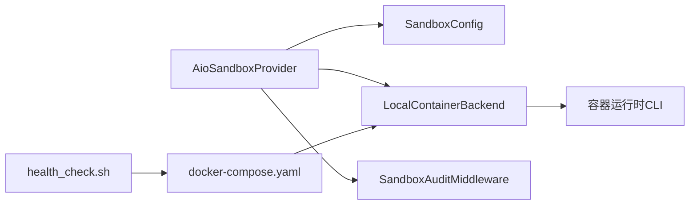

# Docker 沙箱执行

<cite>
**本文引用的文件**
- [aio_sandbox_provider.py](file://backend/packages/harness/deerflow/community/aio_sandbox/aio_sandbox_provider.py)
- [local_backend.py](file://backend/packages/harness/deerflow/community/aio_sandbox/local_backend.py)
- [sandbox_config.py](file://backend/packages/harness/deerflow/config/sandbox_config.py)
- [local_sandbox_provider.py](file://backend/packages/harness/deerflow/sandbox/local/local_sandbox_provider.py)
- [security.py](file://backend/packages/harness/deerflow/sandbox/security.py)
- [docker-compose.yaml](file://docker/docker-compose.yaml)
- [docker-compose-dev.yaml](file://docker/docker-compose-dev.yaml)
- [Dockerfile](file://backend/Dockerfile)
- [health_check.sh](file://.agent/skills/smoke-test/scripts/health_check.sh)
- [deployment-guide.mdx](file://frontend/src/content/en/application/deployment-guide.mdx)
- [test_sandbox_tools_security.py](file://backend/tests/test_sandbox_tools_security.py)
- [test_docker_sandbox_mode_detection.py](file://backend/tests/test_docker_sandbox_mode_detection.py)
</cite>

## 目录
1. [简介](#简介)
2. [项目结构](#项目结构)
3. [核心组件](#核心组件)
4. [架构总览](#架构总览)
5. [组件详解](#组件详解)
6. [依赖关系分析](#依赖关系分析)
7. [性能考量](#性能考量)
8. [故障排查指南](#故障排查指南)
9. [结论](#结论)
10. [附录](#附录)

## 简介
本文件面向在生产环境中使用 Docker 容器化沙箱执行 DeerFlow 的工程团队，系统性阐述容器化沙箱的实现细节、配置管理、部署策略与运维实践。重点覆盖容器镜像构建、网络与存储卷挂载、安全隔离与资源限制、监控与健康检查、容器生命周期管理与故障恢复等主题，并提供可操作的部署步骤、配置示例与性能调优建议。

## 项目结构
与 Docker 沙箱执行直接相关的代码与配置主要分布在以下位置：
- 后端沙箱提供者与本地容器后端：负责容器生命周期、端口映射、环境变量注入与挂载解析
- 沙箱配置模块：定义沙箱运行参数（镜像、端口、前缀、空闲超时、副本数、挂载、环境变量、K8s 动态编排入口）
- Docker 编排与镜像：Compose 文件定义网络与服务编排；后端 Dockerfile 构建应用镜像
- 健康检查脚本与部署指南：自动化检测与部署建议
- 安全与测试：沙箱工具安全策略与容器模式探测测试

图表来源
- [aio_sandbox_provider.py:188-229](file://backend/packages/harness/deerflow/community/aio_sandbox/aio_sandbox_provider.py#L188-L229)
- [local_backend.py:580-619](file://backend/packages/harness/deerflow/community/aio_sandbox/local_backend.py#L580-L619)
- [sandbox_config.py](file://backend/packages/harness/deerflow/config/sandbox_config.py)
- [docker-compose.yaml:147-162](file://docker/docker-compose.yaml#L147-L162)
- [docker-compose-dev.yaml](file://docker/docker-compose-dev.yaml)
- [Dockerfile](file://backend/Dockerfile)
- [health_check.sh:1-66](file://.agent/skills/smoke-test/scripts/health_check.sh#L1-L66)
- [deployment-guide.mdx:122-155](file://frontend/src/content/en/application/deployment-guide.mdx#L122-L155)
- [test_sandbox_tools_security.py](file://backend/tests/test_sandbox_tools_security.py)
- [test_docker_sandbox_mode_detection.py](file://backend/tests/test_docker_sandbox_mode_detection.py)

章节来源
- [aio_sandbox_provider.py:188-229](file://backend/packages/harness/deerflow/community/aio_sandbox/aio_sandbox_provider.py#L188-L229)
- [docker-compose.yaml:147-162](file://docker/docker-compose.yaml#L147-L162)

## 核心组件
- 容器沙箱提供者（AioSandboxProvider）：负责加载沙箱配置、选择容器后端、启动/回收容器、处理孤儿容器接管与空闲回收
- 本地容器后端（LocalContainerBackend）：通过容器运行时接口（如 Docker CLI）进行容器发现、端口查询、状态检查与生命周期管理
- 沙箱配置（SandboxConfig）：集中定义镜像、端口、容器前缀、空闲超时、副本数、挂载列表、环境变量、K8s 动态编排入口等
- 本地挂载提供者（LocalSandboxProvider）：对宿主机到容器的路径映射进行严格校验（绝对路径、容器内绝对路径、保留路径冲突、宿主机路径存在性）
- 安全中间件（SandboxAuditMiddleware）：在运行期对工具调用与输出进行审计与限制，降低越权与资源滥用风险
- 编排与镜像：docker-compose 定义网络与服务；后端 Dockerfile 构建应用镜像；开发环境 Compose 包含动态编排器

章节来源
- [aio_sandbox_provider.py:199-229](file://backend/packages/harness/deerflow/community/aio_sandbox/aio_sandbox_provider.py#L199-L229)
- [local_backend.py:580-619](file://backend/packages/harness/deerflow/community/aio_sandbox/local_backend.py#L580-L619)
- [sandbox_config.py](file://backend/packages/harness/deerflow/config/sandbox_config.py)
- [local_sandbox_provider.py:127-169](file://backend/packages/harness/deerflow/sandbox/local/local_sandbox_provider.py#L127-L169)
- [security.py](file://backend/packages/harness/deerflow/sandbox/security.py)
- [docker-compose.yaml:147-162](file://docker/docker-compose.yaml#L147-L162)
- [Dockerfile](file://backend/Dockerfile)

## 架构总览
下图展示容器沙箱在系统中的位置与交互关系：应用网关通过沙箱提供者调度容器，容器承载技能执行与工具调用；编排层负责网络与服务发现；安全中间件贯穿执行链路以保障隔离与合规。

图表来源
- [aio_sandbox_provider.py:188-229](file://backend/packages/harness/deerflow/community/aio_sandbox/aio_sandbox_provider.py#L188-L229)
- [local_backend.py:580-619](file://backend/packages/harness/deerflow/community/aio_sandbox/local_backend.py#L580-L619)
- [docker-compose.yaml:147-162](file://docker/docker-compose.yaml#L147-L162)
- [security.py](file://backend/packages/harness/deerflow/sandbox/security.py)

## 组件详解

### 容器沙箱提供者（AioSandboxProvider）
- 负责从应用配置中加载沙箱参数，包括镜像、端口、容器前缀、空闲超时、副本数、挂载列表、环境变量与 K8s 动态编排入口
- 支持环境变量值以“$VARNAME”形式引用宿主环境变量并进行解析
- 在启动阶段扫描运行中的同名容器并纳入“温池”，由空闲检查器回收未被再次获取的容器，避免进程重启导致的僵尸容器

图表来源
- [aio_sandbox_provider.py:199-229](file://backend/packages/harness/deerflow/community/aio_sandbox/aio_sandbox_provider.py#L199-L229)
- [aio_sandbox_provider.py:231-260](file://backend/packages/harness/deerflow/community/aio_sandbox/aio_sandbox_provider.py#L231-L260)

章节来源
- [aio_sandbox_provider.py:199-229](file://backend/packages/harness/deerflow/community/aio_sandbox/aio_sandbox_provider.py#L199-L229)
- [aio_sandbox_provider.py:231-260](file://backend/packages/harness/deerflow/community/aio_sandbox/aio_sandbox_provider.py#L231-L260)

### 本地容器后端（LocalContainerBackend）
- 使用容器运行时命令行工具进行容器状态检查与端口查询
- 提供跨进程容器发现能力，通过确定性的容器名称识别其他进程启动的容器
- 支持容器端口到宿主机端口的映射查询，便于服务注册与访问

图表来源
- [local_backend.py:580-619](file://backend/packages/harness/deerflow/community/aio_sandbox/local_backend.py#L580-L619)

章节来源
- [local_backend.py:580-619](file://backend/packages/harness/deerflow/community/aio_sandbox/local_backend.py#L580-L619)

### 沙箱配置（SandboxConfig）
- 关键参数
  - 镜像：容器镜像名称与标签
  - 端口：容器对外暴露的服务端口基座
  - 容器前缀：用于命名空间隔离的容器前缀
  - 空闲超时：容器在未被复用时的回收时间阈值
  - 副本数：并发容器实例数量
  - 挂载：宿主机到容器的路径映射列表
  - 环境变量：键值对，支持引用宿主环境变量
  - 动态编排入口：K8s 动态编排器地址（可选）

章节来源
- [sandbox_config.py](file://backend/packages/harness/deerflow/config/sandbox_config.py)

### 本地挂载提供者（LocalSandboxProvider）
- 对挂载配置进行严格校验
  - 宿主机路径必须为绝对路径
  - 容器内路径必须为绝对路径
  - 容器内路径不得与保留前缀冲突
  - 宿主机路径必须存在，否则跳过该映射
- 若配置加载失败，记录警告但不中断整体流程

章节来源
- [local_sandbox_provider.py:127-169](file://backend/packages/harness/deerflow/sandbox/local/local_sandbox_provider.py#L127-L169)

### 安全与审计
- 沙箱审计中间件在运行期对工具调用与输出进行审计与限制，防止越权与资源滥用
- 安全扫描测试覆盖沙箱工具的安全策略，确保执行链路符合最小权限原则

章节来源
- [security.py](file://backend/packages/harness/deerflow/sandbox/security.py)
- [test_sandbox_tools_security.py](file://backend/tests/test_sandbox_tools_security.py)

### 编排与镜像
- docker-compose.yaml 定义了 bridge 网络，便于容器间通信与服务发现
- docker-compose-dev.yaml 包含动态编排器服务，用于在开发/测试环境模拟 K8s Pod 生命周期
- backend/Dockerfile 用于构建后端应用镜像，配合 Compose 进行部署

章节来源
- [docker-compose.yaml:147-162](file://docker/docker-compose.yaml#L147-L162)
- [docker-compose-dev.yaml](file://docker/docker-compose-dev.yaml)
- [Dockerfile](file://backend/Dockerfile)

## 依赖关系分析
- Provider 依赖 Config 与 Backend；Backend 依赖容器运行时 CLI；Provider 与 Audit 中间件共同构成执行链
- Compose 为 Backend 提供网络与服务编排支撑；Health Check 脚本依赖 Compose 与运行时状态

图表来源
- [aio_sandbox_provider.py:188-229](file://backend/packages/harness/deerflow/community/aio_sandbox/aio_sandbox_provider.py#L188-L229)
- [local_backend.py:580-619](file://backend/packages/harness/deerflow/community/aio_sandbox/local_backend.py#L580-L619)
- [sandbox_config.py](file://backend/packages/harness/deerflow/config/sandbox_config.py)
- [docker-compose.yaml:147-162](file://docker/docker-compose.yaml#L147-L162)
- [health_check.sh:1-66](file://.agent/skills/smoke-test/scripts/health_check.sh#L1-L66)

章节来源
- [aio_sandbox_provider.py:188-229](file://backend/packages/harness/deerflow/community/aio_sandbox/aio_sandbox_provider.py#L188-L229)
- [docker-compose.yaml:147-162](file://docker/docker-compose.yaml#L147-L162)

## 性能考量
- 并发与副本数：根据并发用户规模设置副本数，避免容器争抢与上下文切换开销
- 空闲回收：合理设置空闲超时，平衡资源占用与冷启动延迟
- 网络与存储：使用 bridge 网络减少跨主机开销；挂载点尽量精简，避免频繁 IO
- 资源限制：结合容器运行时的资源限制能力，控制 CPU/内存上限，防止资源饥饿
- 日志与监控：开启健康检查与日志聚合，及时发现异常与瓶颈

## 故障排查指南
- 容器无法启动/端口不可达
  - 使用健康检查脚本定位服务监听状态与端口占用
  - 检查 Compose 网络与端口映射配置
- 孤儿容器与资源泄漏
  - 观察 Provider 的孤儿容器接管日志，确认空闲回收是否生效
  - 手动清理长时间未使用的容器
- 挂载失败
  - 校验宿主机路径是否存在、容器内路径是否为绝对路径、是否与保留路径冲突
- 安全策略触发
  - 查看审计中间件日志，确认工具调用是否被阻断或降级

章节来源
- [health_check.sh:1-66](file://.agent/skills/smoke-test/scripts/health_check.sh#L1-L66)
- [aio_sandbox_provider.py:231-260](file://backend/packages/harness/deerflow/community/aio_sandbox/aio_sandbox_provider.py#L231-L260)
- [local_sandbox_provider.py:127-169](file://backend/packages/harness/deerflow/sandbox/local/local_sandbox_provider.py#L127-L169)
- [test_docker_sandbox_mode_detection.py](file://backend/tests/test_docker_sandbox_mode_detection.py)

## 结论
通过容器化沙箱，DeerFlow 实现了多用户场景下的强隔离与可伸缩执行。结合严格的挂载校验、审计中间件与编排网络，能够在保证安全性的同时提升资源利用率与稳定性。建议在生产中启用健康检查、资源限制与日志监控，并根据业务负载调整副本数与空闲回收策略。

## 附录

### 部署指南（Docker 模式）
- 准备环境变量文件与 Compose
  - 复制并编辑 .env，确保关键变量已配置
  - 使用 docker-compose.yaml 启动服务与网络
- 启动与验证
  - 通过健康检查脚本验证服务可达性与端口监听
  - 如需开发/测试的动态编排能力，参考 docker-compose-dev.yaml
- 生产注意事项
  - 为容器运行时配置资源限制
  - 开启健康检查与日志聚合
  - 定期清理孤儿容器与回收空闲容器

章节来源
- [deployment-guide.mdx:122-155](file://frontend/src/content/en/application/deployment-guide.mdx#L122-L155)
- [docker-compose.yaml:147-162](file://docker/docker-compose.yaml#L147-L162)
- [docker-compose-dev.yaml](file://docker/docker-compose-dev.yaml)
- [health_check.sh:1-66](file://.agent/skills/smoke-test/scripts/health_check.sh#L1-L66)

### 配置示例要点
- 沙箱配置项（示例字段）
  - 镜像：容器镜像名称与标签
  - 端口：容器对外端口基座
  - 容器前缀：用于命名隔离
  - 空闲超时：秒
  - 副本数：整数
  - 挂载：宿主机路径 → 容器内路径（可只读）
  - 环境变量：键值对，支持“$ENV_VAR”引用
  - 动态编排入口：K8s 编排器地址（可选）

章节来源
- [sandbox_config.py](file://backend/packages/harness/deerflow/config/sandbox_config.py)