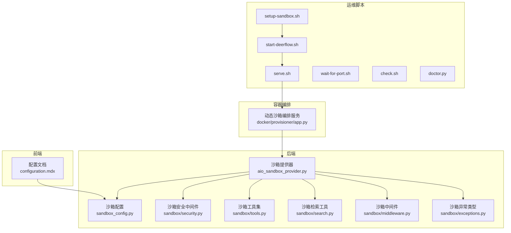
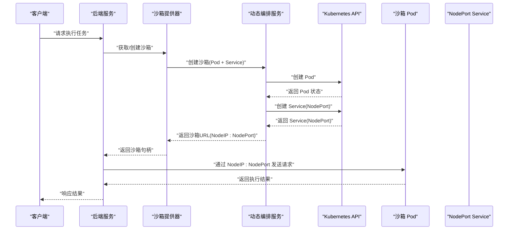
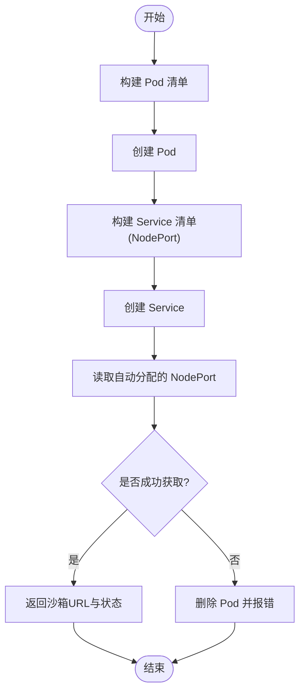
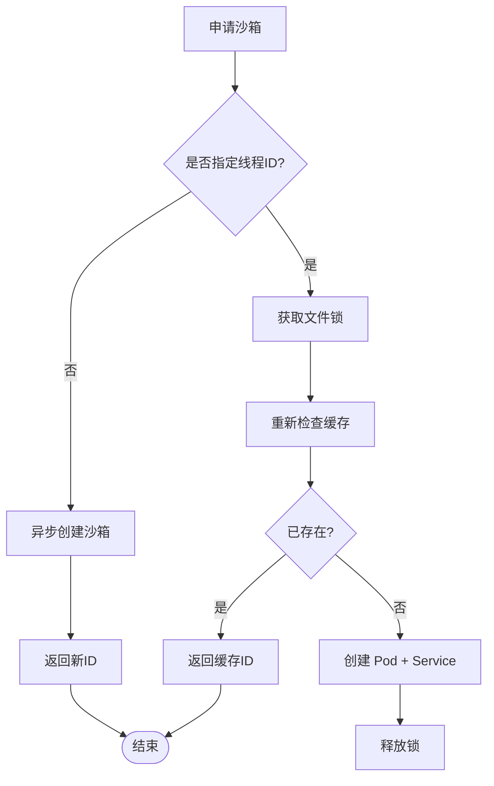
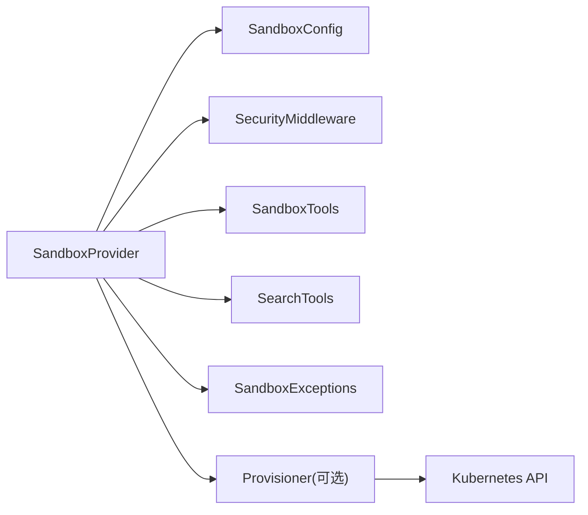

# Kubernetes 沙箱执行

<cite>
**本文引用的文件**
- [docker/provisioner/app.py](file://docker/provisioner/app.py)
- [backend/packages/harness/deerflow/community/aio_sandbox/aio_sandbox_provider.py](file://backend/packages/harness/deerflow/community/aio_sandbox/aio_sandbox_provider.py)
- [backend/packages/harness/deerflow/sandbox/exceptions.py](file://backend/packages/harness/deerflow/sandbox/exceptions.py)
- [backend/packages/harness/deerflow/sandbox/security.py](file://backend/packages/harness/deerflow/sandbox/security.py)
- [backend/packages/harness/deerflow/sandbox/tools.py](file://backend/packages/harness/deerflow/sandbox/tools.py)
- [backend/packages/harness/deerflow/sandbox/search.py](file://backend/packages/harness/deerflow/sandbox/search.py)
- [backend/packages/harness/deerflow/sandbox/middleware.py](file://backend/packages/harness/deerflow/sandbox/middleware.py)
- [backend/packages/harness/deerflow/config/sandbox_config.py](file://backend/packages/harness/deerflow/config/sandbox_config.py)
- [frontend/src/content/en/harness/configuration.mdx](file://frontend/src/content/en/harness/configuration.mdx)
- [scripts/setup-sandbox.sh](file://scripts/setup-sandbox.sh)
- [scripts/start-deerflow.sh](file://scripts/start-deerflow.sh)
- [scripts/serve.sh](file://scripts/serve.sh)
- [scripts/wait-for-port.sh](file://scripts/wait-for-port.sh)
- [scripts/check.sh](file://scripts/check.sh)
- [scripts/doctor.py](file://scripts/doctor.py)
- [backend/docs/AUTH_DESIGN.md](file://backend/docs/AUTH_DESIGN.md)
- [backend/docs/CONFIGURATION.md](file://backend/docs/CONFIGURATION.md)
- [backend/docs/MEMORY_IMPROVEMENTS.md](file://backend/docs/MEMORY_IMPROVEMENTS.md)
- [backend/docs/STREAMING.md](file://backend/docs/STREAMING.md)
- [backend/docs/GUARDRAILS.md](file://backend/docs/GUARDRAILS.md)
- [backend/docs/MCP_SERVER.md](file://backend/docs/MCP_SERVER.md)
- [backend/tests/test_sandbox_audit_middleware.py](file://backend/tests/test_sandbox_audit_middleware.py)
- [backend/tests/test_local_sandbox_virtual_path_contract.py](file://backend/tests/test_local_sandbox_virtual_path_contract.py)
- [backend/tests/test_runtime_lifecycle_e2e.py](file://backend/tests/test_runtime_lifecycle_e2e.py)
- [backend/tests/test_sandbox_middleware.py](file://backend/tests/test_sandbox_middleware.py)
- [backend/tests/test_sandbox_provider.py](file://backend/tests/test_sandbox_provider.py)
- [backend/tests/test_sandbox_orphan_reconciliation.py](file://backend/tests/test_sandbox_orphan_reconciliation.py)
- [backend/tests/test_sandbox_orphan_reconciliation_e2e.py](file://backend/tests/test_sandbox_orphan_reconciliation_e2e.py)
- [backend/tests/test_sandbox_readiness.py](file://backend/tests/test_sandbox_readiness.py)
- [backend/tests/test_sandbox_tools_security.py](file://backend/tests/test_sandbox_tools_security.py)
- [backend/tests/test_sandbox.py](file://backend/tests/test_sandbox.py)
</cite>

## 目录
1. [简介](#简介)
2. [项目结构](#项目结构)
3. [核心组件](#核心组件)
4. [架构总览](#架构总览)
5. [详细组件分析](#详细组件分析)
6. [依赖关系分析](#依赖关系分析)
7. [性能考量](#性能考量)
8. [故障排查指南](#故障排查指南)
9. [结论](#结论)
10. [附录](#附录)

## 简介
本文件面向在 Kubernetes 集群中运行 DeerFlow 沙箱执行的技术读者，系统性阐述基于动态 Pod 的沙箱部署架构、资源配置与调度策略；深入解析 Pod 生命周期管理、Service 发现与负载均衡机制；说明集群安全策略（含 RBAC 与网络策略）、权限控制与沙箱安全中间件；提供 Helm Chart 部署建议、监控告警与扩缩容策略；并给出故障诊断与性能优化指南。

## 项目结构
围绕 Kubernetes 沙箱执行的关键代码主要分布在以下区域：
- 后端沙箱提供器与配置：负责沙箱生命周期编排、资源池管理、启动收敛与环境变量解析等。
- 前端配置文档：描述配置系统与环境变量插值规则。
- 容器编排与脚本：提供本地/开发环境下的启动与检查脚本。
- 测试用例：覆盖沙箱工具安全、路径隔离、生命周期、审计中间件等质量保障场景。

图表来源
- [docker/provisioner/app.py:1-580](file://docker/provisioner/app.py#L1-L580)
- [backend/packages/harness/deerflow/community/aio_sandbox/aio_sandbox_provider.py:199-260](file://backend/packages/harness/deerflow/community/aio_sandbox/aio_sandbox_provider.py#L199-L260)
- [backend/packages/harness/deerflow/config/sandbox_config.py](file://backend/packages/harness/deerflow/config/sandbox_config.py)
- [backend/packages/harness/deerflow/sandbox/security.py](file://backend/packages/harness/deerflow/sandbox/security.py)
- [backend/packages/harness/deerflow/sandbox/tools.py](file://backend/packages/harness/deerflow/sandbox/tools.py)
- [backend/packages/harness/deerflow/sandbox/search.py](file://backend/packages/harness/deerflow/sandbox/search.py)
- [backend/packages/harness/deerflow/sandbox/middleware.py](file://backend/packages/harness/deerflow/sandbox/middleware.py)
- [backend/packages/harness/deerflow/sandbox/exceptions.py:31-71](file://backend/packages/harness/deerflow/sandbox/exceptions.py#L31-L71)
- [frontend/src/content/en/harness/configuration.mdx:1-37](file://frontend/src/content/en/harness/configuration.mdx#L1-L37)
- [scripts/setup-sandbox.sh](file://scripts/setup-sandbox.sh)
- [scripts/start-deerflow.sh](file://scripts/start-deerflow.sh)
- [scripts/serve.sh](file://scripts/serve.sh)
- [scripts/wait-for-port.sh](file://scripts/wait-for-port.sh)
- [scripts/check.sh](file://scripts/check.sh)
- [scripts/doctor.py](file://scripts/doctor.py)

章节来源
- [docker/provisioner/app.py:1-580](file://docker/provisioner/app.py#L1-L580)
- [backend/packages/harness/deerflow/community/aio_sandbox/aio_sandbox_provider.py:199-260](file://backend/packages/harness/deerflow/community/aio_sandbox/aio_sandbox_provider.py#L199-L260)
- [frontend/src/content/en/harness/configuration.mdx:1-37](file://frontend/src/content/en/harness/configuration.mdx#L1-L37)

## 核心组件
- 动态沙箱编排服务（Provisioner）
  - 通过 Kubernetes API 动态创建/销毁每个沙箱专属的 Pod 与 NodePort Service，后端直接以 NodeIP:NodePort 访问沙箱。
  - 提供健康检查、状态查询、列表枚举等接口，支持幂等创建与回滚清理。
- 沙箱提供器（SandboxProvider）
  - 负责沙箱生命周期管理、热身池与空闲回收、进程内/跨进程锁、启动收敛与孤儿容器接管。
  - 支持从应用配置加载镜像、端口、挂载、环境变量与可选的外部编排器地址。
- 沙箱安全与中间件
  - 提供命令/文件操作审计与阻断策略，确保高风险行为被拦截或警告。
  - 文件路径虚拟映射隔离，避免线程间状态泄漏。
- 配置系统
  - 以 config.yaml 为核心，支持环境变量插值与多级优先解析，便于在不同环境中复用与定制。

章节来源
- [docker/provisioner/app.py:11-16](file://docker/provisioner/app.py#L11-L16)
- [docker/provisioner/app.py:301-369](file://docker/provisioner/app.py#L301-L369)
- [docker/provisioner/app.py:372-400](file://docker/provisioner/app.py#L372-L400)
- [docker/provisioner/app.py:470-502](file://docker/provisioner/app.py#L470-L502)
- [docker/provisioner/app.py:505-531](file://docker/provisioner/app.py#L505-L531)
- [docker/provisioner/app.py:534-545](file://docker/provisioner/app.py#L534-L545)
- [docker/provisioner/app.py:548-580](file://docker/provisioner/app.py#L548-L580)
- [backend/packages/harness/deerflow/community/aio_sandbox/aio_sandbox_provider.py:199-217](file://backend/packages/harness/deerflow/community/aio_sandbox/aio_sandbox_provider.py#L199-L217)
- [backend/packages/harness/deerflow/community/aio_sandbox/aio_sandbox_provider.py:233-260](file://backend/packages/harness/deerflow/community/aio_sandbox/aio_sandbox_provider.py#L233-L260)
- [backend/packages/harness/deerflow/sandbox/security.py](file://backend/packages/harness/deerflow/sandbox/security.py)
- [backend/packages/harness/deerflow/sandbox/middleware.py](file://backend/packages/harness/deerflow/sandbox/middleware.py)
- [backend/packages/harness/deerflow/sandbox/exceptions.py:31-71](file://backend/packages/harness/deerflow/sandbox/exceptions.py#L31-L71)
- [frontend/src/content/en/harness/configuration.mdx:18-37](file://frontend/src/content/en/harness/configuration.mdx#L18-L37)

## 架构总览
下图展示从后端到 Kubernetes 的端到端调用链：后端通过沙箱提供器发现/创建沙箱，必要时由动态编排服务创建 Pod 与 Service；后端以 NodeIP:NodePort 直连访问沙箱。

图表来源
- [docker/provisioner/app.py:470-502](file://docker/provisioner/app.py#L470-L502)
- [docker/provisioner/app.py:301-369](file://docker/provisioner/app.py#L301-L369)
- [docker/provisioner/app.py:372-400](file://docker/provisioner/app.py#L372-L400)
- [backend/packages/harness/deerflow/community/aio_sandbox/aio_sandbox_provider.py:199-217](file://backend/packages/harness/deerflow/community/aio_sandbox/aio_sandbox_provider.py#L199-L217)

## 详细组件分析

### 组件一：动态沙箱编排服务（Provisioner）
- 角色与职责
  - 为每个 sandbox_id 创建独立的 Pod 与 NodePort Service，后端以 NodeIP:NodePort 直连访问。
  - 提供创建、删除、查询、列表与健康检查接口。
- 关键实现要点
  - Pod 清单构建：容器端口、就绪/存活探针、资源请求/限制、卷挂载与安全上下文。
  - Service 清单构建：NodePort 类型、自动分配端口、选择器标签。
  - 节点端口读取与超时重试，失败时回滚删除 Pod。
  - 列表与状态查询基于标签选择器与 Pod 阶段判断。
- 处理流程（创建）

图表来源
- [docker/provisioner/app.py:470-502](file://docker/provisioner/app.py#L470-L502)
- [docker/provisioner/app.py:403-496](file://docker/provisioner/app.py#L403-L496)
- [docker/provisioner/app.py:301-369](file://docker/provisioner/app.py#L301-L369)
- [docker/provisioner/app.py:372-400](file://docker/provisioner/app.py#L372-L400)

章节来源
- [docker/provisioner/app.py:11-16](file://docker/provisioner/app.py#L11-L16)
- [docker/provisioner/app.py:301-369](file://docker/provisioner/app.py#L301-L369)
- [docker/provisioner/app.py:372-400](file://docker/provisioner/app.py#L372-L400)
- [docker/provisioner/app.py:470-502](file://docker/provisioner/app.py#L470-L502)
- [docker/provisioner/app.py:505-531](file://docker/provisioner/app.py#L505-L531)
- [docker/provisioner/app.py:534-545](file://docker/provisioner/app.py#L534-L545)
- [docker/provisioner/app.py:548-580](file://docker/provisioner/app.py#L548-L580)

### 组件二：沙箱提供器（SandboxProvider）
- 角色与职责
  - 负责沙箱生命周期管理、热身池与空闲回收、孤儿容器接管、跨进程锁与并发保护。
  - 从应用配置加载镜像、端口、挂载、环境变量与可选的外部编排器地址。
- 关键实现要点
  - 启动收敛：进程启动时扫描运行中的容器并“收养”到热身池，交由空闲检查器回收。
  - 并发控制：同一 thread_id 的沙箱创建使用文件锁串行化，避免命名冲突。
  - 环境变量解析：支持以 $VAR 形式引用环境变量。
- 生命周期与并发流程

图表来源
- [backend/packages/harness/deerflow/community/aio_sandbox/aio_sandbox_provider.py:632-658](file://backend/packages/harness/deerflow/community/aio_sandbox/aio_sandbox_provider.py#L632-L658)
- [backend/packages/harness/deerflow/community/aio_sandbox/aio_sandbox_provider.py:233-260](file://backend/packages/harness/deerflow/community/aio_sandbox/aio_sandbox_provider.py#L233-L260)
- [backend/packages/harness/deerflow/community/aio_sandbox/aio_sandbox_provider.py:199-217](file://backend/packages/harness/deerflow/community/aio_sandbox/aio_sandbox_provider.py#L199-L217)

章节来源
- [backend/packages/harness/deerflow/community/aio_sandbox/aio_sandbox_provider.py:199-217](file://backend/packages/harness/deerflow/community/aio_sandbox/aio_sandbox_provider.py#L199-L217)
- [backend/packages/harness/deerflow/community/aio_sandbox/aio_sandbox_provider.py:233-260](file://backend/packages/harness/deerflow/community/aio_sandbox/aio_sandbox_provider.py#L233-L260)
- [backend/packages/harness/deerflow/community/aio_sandbox/aio_sandbox_provider.py:632-658](file://backend/packages/harness/deerflow/community/aio_sandbox/aio_sandbox_provider.py#L632-L658)

### 组件三：沙箱安全与中间件
- 审计与阻断
  - 对高风险命令进行 100% 阻断，中风险进行警告，降低误报率至 0%，确保安全基线。
- 路径隔离与状态隔离
  - 每个线程拥有独立的用户数据映射，写入路径不泄漏到其他线程。
- 工具安全
  - 沙箱工具的安全策略与权限控制，防止越权或危险操作。
- 异常建模
  - 将命令执行错误、文件操作错误、权限错误等抽象为专用异常类型，便于上层捕获与处理。

章节来源
- [backend/tests/test_sandbox_audit_middleware.py:704-716](file://backend/tests/test_sandbox_audit_middleware.py#L704-L716)
- [backend/tests/test_local_sandbox_virtual_path_contract.py:145-192](file://backend/tests/test_local_sandbox_virtual_path_contract.py#L145-L192)
- [backend/packages/harness/deerflow/sandbox/security.py](file://backend/packages/harness/deerflow/sandbox/security.py)
- [backend/packages/harness/deerflow/sandbox/tools.py](file://backend/packages/harness/deerflow/sandbox/tools.py)
- [backend/packages/harness/deerflow/sandbox/exceptions.py:31-71](file://backend/packages/harness/deerflow/sandbox/exceptions.py#L31-L71)

### 组件四：配置系统
- 配置文件定位与优先级
  - 支持显式路径、环境变量、后端目录相对路径、仓库根目录相对路径。
- 环境变量插值
  - 任意字段值可用 $VAR_NAME 引用环境变量，便于在不同环境注入敏感信息或差异化参数。
- 沙箱配置项
  - 包括镜像、端口、容器前缀、空闲超时、副本数、挂载、环境变量与可选的外部编排器地址。

章节来源
- [frontend/src/content/en/harness/configuration.mdx:18-37](file://frontend/src/content/en/harness/configuration.mdx#L18-L37)
- [backend/packages/harness/deerflow/config/sandbox_config.py](file://backend/packages/harness/deerflow/config/sandbox_config.py)
- [backend/packages/harness/deerflow/community/aio_sandbox/aio_sandbox_provider.py:199-217](file://backend/packages/harness/deerflow/community/aio_sandbox/aio_sandbox_provider.py#L199-L217)

## 依赖关系分析
- 组件耦合
  - 沙箱提供器依赖配置模块与安全中间件；动态编排服务作为外部依赖被提供器调用（当启用外部编排）。
  - 沙箱工具与检索工具依赖安全中间件提供的审计能力。
- 外部依赖
  - Kubernetes API（用于 Pod 与 Service 的创建/删除/查询）。
  - 运维脚本（启动、等待端口、健康检查、诊断）。
- 循环依赖
  - 当前结构未见循环导入；各模块职责清晰，接口边界明确。

图表来源
- [backend/packages/harness/deerflow/community/aio_sandbox/aio_sandbox_provider.py:199-217](file://backend/packages/harness/deerflow/community/aio_sandbox/aio_sandbox_provider.py#L199-L217)
- [backend/packages/harness/deerflow/sandbox/security.py](file://backend/packages/harness/deerflow/sandbox/security.py)
- [backend/packages/harness/deerflow/sandbox/tools.py](file://backend/packages/harness/deerflow/sandbox/tools.py)
- [backend/packages/harness/deerflow/sandbox/search.py](file://backend/packages/harness/deerflow/sandbox/search.py)
- [backend/packages/harness/deerflow/sandbox/exceptions.py:31-71](file://backend/packages/harness/deerflow/sandbox/exceptions.py#L31-L71)
- [docker/provisioner/app.py:470-502](file://docker/provisioner/app.py#L470-L502)

章节来源
- [backend/packages/harness/deerflow/community/aio_sandbox/aio_sandbox_provider.py:199-217](file://backend/packages/harness/deerflow/community/aio_sandbox/aio_sandbox_provider.py#L199-L217)
- [docker/provisioner/app.py:470-502](file://docker/provisioner/app.py#L470-L502)

## 性能考量
- 资源配额与弹性
  - 为沙箱 Pod 设置合理的 CPU/内存/临时存储请求与限制，避免资源争抢。
  - 结合 NodePort 访问模式，尽量减少额外的入口网关开销。
- 热身池与空闲回收
  - 通过热身池与空闲超时策略平衡冷启动延迟与资源占用。
- 探针与稳定性
  - 就绪/存活探针合理设置初始延迟、周期与超时，避免误判导致频繁重启。
- I/O 与隔离
  - 使用虚拟路径隔离与严格的文件操作权限，降低跨线程干扰与磁盘 I/O 抖动。

## 故障排查指南
- 健康检查与诊断
  - 使用健康检查端点确认编排服务可用；结合 wait-for-port 脚本等待 NodePort 就绪。
  - 使用 doctor.py 执行端到端自检，定位配置、网络与权限问题。
- 常见问题定位
  - NodePort 未分配：检查 Service 是否创建成功、K8s 节点范围是否充足。
  - Pod 无法就绪：检查探针路径、容器镜像与资源限制。
  - 权限与安全：查看审计中间件日志，确认高/中风险命令是否被阻断。
- 测试用例参考
  - 生命周期端到端测试、工具安全测试、路径隔离测试、孤儿容器接管测试等，均可作为回归验证与问题复现的依据。

章节来源
- [scripts/wait-for-port.sh](file://scripts/wait-for-port.sh)
- [scripts/doctor.py](file://scripts/doctor.py)
- [scripts/check.sh](file://scripts/check.sh)
- [backend/tests/test_runtime_lifecycle_e2e.py](file://backend/tests/test_runtime_lifecycle_e2e.py)
- [backend/tests/test_sandbox_tools_security.py](file://backend/tests/test_sandbox_tools_security.py)
- [backend/tests/test_local_sandbox_virtual_path_contract.py:145-192](file://backend/tests/test_local_sandbox_virtual_path_contract.py#L145-L192)
- [backend/tests/test_sandbox_orphan_reconciliation.py](file://backend/tests/test_sandbox_orphan_reconciliation.py)
- [backend/tests/test_sandbox_orphan_reconciliation_e2e.py](file://backend/tests/test_sandbox_orphan_reconciliation_e2e.py)
- [backend/tests/test_sandbox_readiness.py](file://backend/tests/test_sandbox_readiness.py)

## 结论
本文从架构、组件、安全与运维四个维度梳理了 DeerFlow 在 Kubernetes 中的沙箱执行方案。通过动态编排服务与沙箱提供器的协同，实现了按需创建、稳定访问与高效回收；通过安全中间件与严格的路径隔离，确保了执行安全与租户隔离；配合完善的配置系统与测试用例，为生产部署提供了可复现、可观测、可治理的基础能力。

## 附录
- Helm Chart 部署建议
  - 将动态编排服务以 Deployment/Service 方式部署于集群，并授予必要的 RBAC 权限（创建/删除 Pod 与 Service）。
  - 为沙箱 Pod 设置资源请求/限制与节点亲和/反亲和，避免热点集中。
  - 使用探针与健康检查保障服务可用性。
- 监控与告警
  - 指标：沙箱 Pod 数量、NodePort 分配成功率、就绪/存活探针失败率、沙箱创建/销毁耗时。
  - 告警：NodePort 超时、Pod 频繁重启、安全事件（阻断/警告）阈值。
- 扩缩容策略
  - 节点级：根据集群资源与工作负载动态增减节点。
  - 应用级：通过热身池与空闲回收策略平衡吞吐与成本；对高并发场景可考虑多副本与水平扩展。