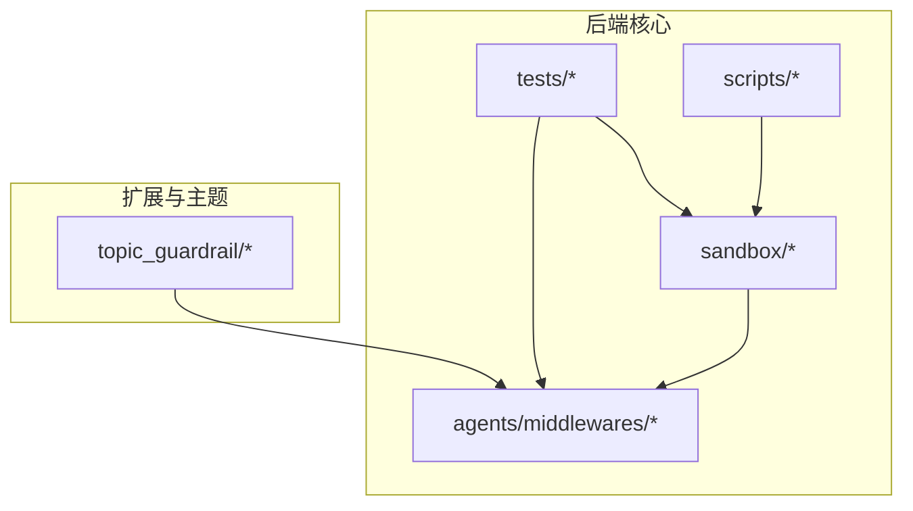
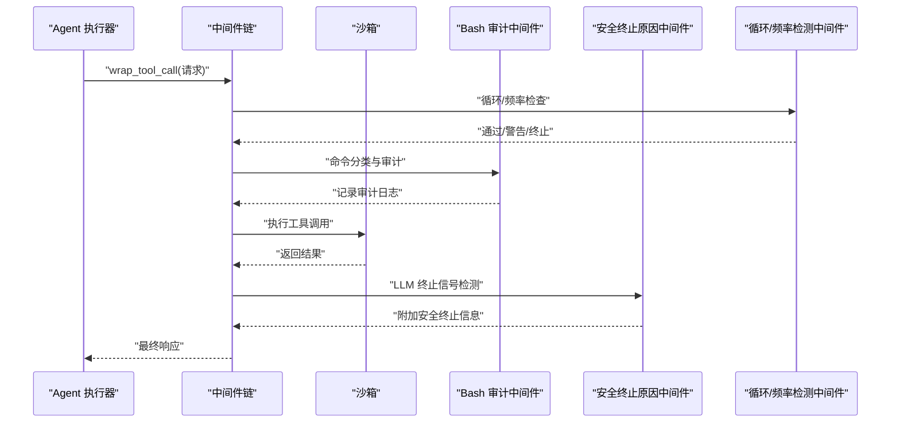
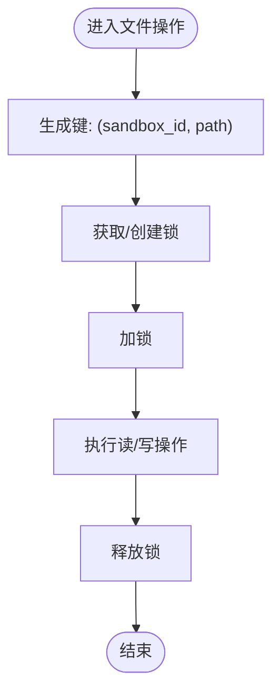
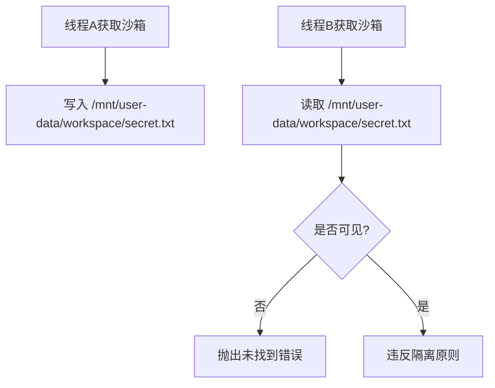
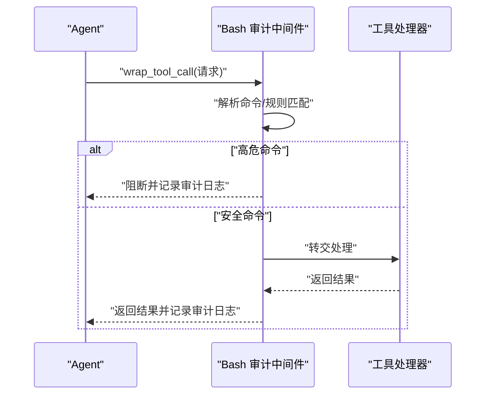
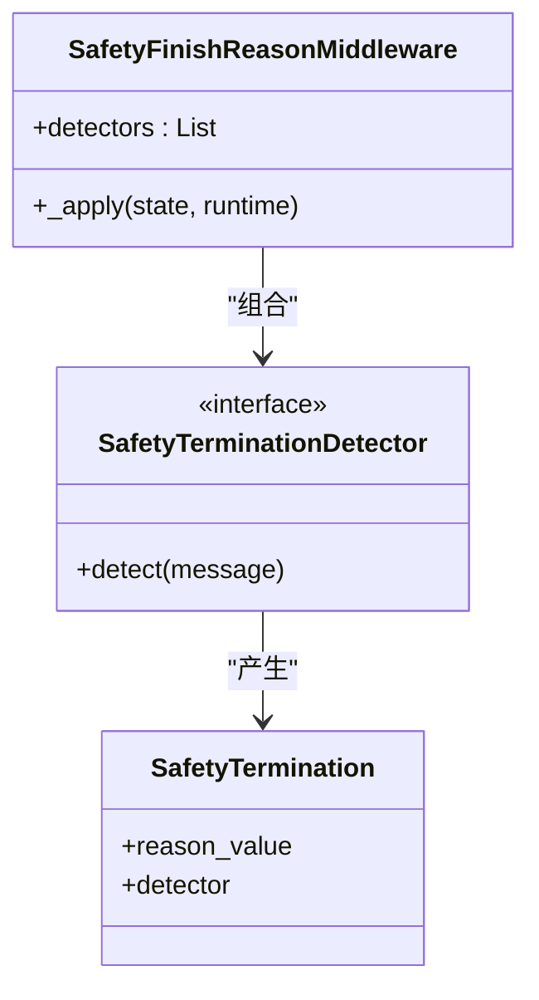
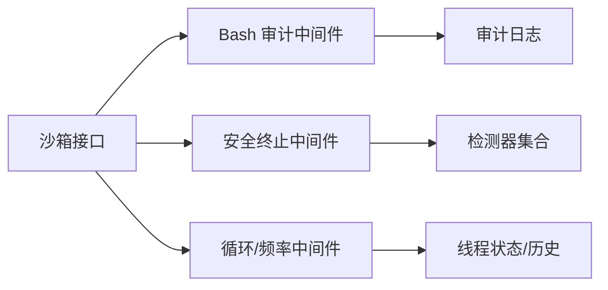

# 安全控制机制

<cite>
**本文引用的文件**
- [backend/packages/harness/deerflow/sandbox/security.py](file://backend/packages/harness/deerflow/sandbox/security.py)
- [backend/packages/harness/deerflow/sandbox/sandbox.py](file://backend/packages/harness/deerflow/sandbox/sandbox.py)
- [backend/packages/harness/deerflow/sandbox/middleware.py](file://backend/packages/harness/deerflow/sandbox/middleware.py)
- [backend/packages/harness/deerflow/sandbox/file_operation_lock.py](file://backend/packages/harness/deerflow/sandbox/file_operation_lock.py)
- [backend/packages/harness/deerflow/agents/middlewares/sandbox_audit_middleware.py](file://backend/packages/harness/deerflow/agents/middlewares/sandbox_audit_middleware.py)
- [backend/packages/harness/deerflow/agents/middlewares/safety_finish_reason_middleware.py](file://backend/packages/harness/deerflow/agents/middlewares/safety_finish_reason_middleware.py)
- [backend/packages/harness/deerflow/agents/middlewares/safety_termination_detectors.py](file://backend/packages/harness/deerflow/agents/middlewares/safety_termination_detectors.py)
- [backend/packages/harness/deerflow/agents/middlewares/loop_detection_middleware.py](file://backend/packages/harness/deerflow/agents/middlewares/loop_detection_middleware.py)
- [deerflow_extensions/topic_guardrail/topics.yaml](file://deerflow_extensions/topic_guardrail/topics.yaml)
- [backend/tests/test_sandbox_audit_middleware.py](file://backend/tests/test_sandbox_audit_middleware.py)
- [backend/tests/test_local_sandbox_virtual_path_contract.py](file://backend/tests/test_local_sandbox_virtual_path_contract.py)
- [backend/tests/test_safety_finish_reason_middleware.py](file://backend/tests/test_safety_finish_reason_middleware.py)
- [backend/tests/test_detect_blocking_io_static.py](file://backend/tests/test_detect_blocking_io_static.py)
- [backend/scripts/e2e_safety_termination_demo.py](file://backend/scripts/e2e_safety_termination_demo.py)
</cite>

## 目录
1. [引言](#引言)
2. [项目结构](#项目结构)
3. [核心组件](#核心组件)
4. [架构总览](#架构总览)
5. [详细组件分析](#详细组件分析)
6. [依赖关系分析](#依赖关系分析)
7. [性能考量](#性能考量)
8. [故障排查指南](#故障排查指南)
9. [结论](#结论)
10. [附录](#附录)

## 引言
本文件面向 DeerFlow 的沙箱安全控制机制，系统性阐述安全边界设计、访问控制策略、威胁防护与异常检测、入侵防护、安全审计与日志、资源访问限制与进程隔离、安全配置最佳实践、漏洞扫描与应急响应流程，以及安全合规与风险评估方法。内容基于仓库中实际实现与测试用例进行归纳总结，帮助技术与非技术读者理解并落地安全控制。

## 项目结构
围绕“沙箱安全”主题，后端核心位于 deerflow 包中的 sandbox 与 agents/middlewares 子模块；前端与扩展通过中间件与工具链协同实现安全策略。下图展示与安全相关的关键目录与文件：

图表来源
- [backend/packages/harness/deerflow/sandbox/security.py](file://backend/packages/harness/deerflow/sandbox/security.py)
- [backend/packages/harness/deerflow/sandbox/sandbox.py](file://backend/packages/harness/deerflow/sandbox/sandbox.py)
- [backend/packages/harness/deerflow/agents/middlewares/sandbox_audit_middleware.py](file://backend/packages/harness/deerflow/agents/middlewares/sandbox_audit_middleware.py)
- [deerflow_extensions/topic_guardrail/topics.yaml](file://deerflow_extensions/topic_guardrail/topics.yaml)

章节来源
- [backend/packages/harness/deerflow/sandbox/security.py](file://backend/packages/harness/deerflow/sandbox/security.py)
- [backend/packages/harness/deerflow/sandbox/sandbox.py](file://backend/packages/harness/deerflow/sandbox/sandbox.py)
- [backend/packages/harness/deerflow/sandbox/middleware.py](file://backend/packages/harness/deerflow/sandbox/middleware.py)
- [backend/packages/harness/deerflow/agents/middlewares/sandbox_audit_middleware.py](file://backend/packages/harness/deerflow/agents/middlewares/sandbox_audit_middleware.py)
- [deerflow_extensions/topic_guardrail/topics.yaml](file://deerflow_extensions/topic_guardrail/topics.yaml)

## 核心组件
- 沙箱安全基元：提供文件操作锁、虚拟路径隔离、本地/远程沙箱抽象与权限约束。
- 中间件层：实现 Bash 命令审计、安全终止原因检测、循环检测与频率控制、阻塞 I/O 静态检测等。
- 主题守卫（Topic Guardrail）：基于工具白/黑名单与敏感词列表的策略配置。
- 测试与演示：覆盖审计日志、线程隔离、安全终止、阻塞 I/O 检测等场景。

章节来源
- [backend/packages/harness/deerflow/sandbox/file_operation_lock.py](file://backend/packages/harness/deerflow/sandbox/file_operation_lock.py)
- [backend/packages/harness/deerflow/sandbox/sandbox.py](file://backend/packages/harness/deerflow/sandbox/sandbox.py)
- [backend/packages/harness/deerflow/agents/middlewares/sandbox_audit_middleware.py](file://backend/packages/harness/deerflow/agents/middlewares/sandbox_audit_middleware.py)
- [backend/packages/harness/deerflow/agents/middlewares/safety_finish_reason_middleware.py](file://backend/packages/harness/deerflow/agents/middlewares/safety_finish_reason_middleware.py)
- [backend/packages/harness/deerflow/agents/middlewares/loop_detection_middleware.py](file://backend/packages/harness/deerflow/agents/middlewares/loop_detection_middleware.py)
- [deerflow_extensions/topic_guardrail/topics.yaml](file://deerflow_extensions/topic_guardrail/topics.yaml)

## 架构总览
下图展示从工具调用到沙箱执行、再到安全审计与异常检测的整体流程：

图表来源
- [backend/packages/harness/deerflow/agents/middlewares/sandbox_audit_middleware.py](file://backend/packages/harness/deerflow/agents/middlewares/sandbox_audit_middleware.py)
- [backend/packages/harness/deerflow/agents/middlewares/safety_finish_reason_middleware.py](file://backend/packages/harness/deerflow/agents/middlewares/safety_finish_reason_middleware.py)
- [backend/packages/harness/deerflow/agents/middlewares/loop_detection_middleware.py](file://backend/packages/harness/deerflow/agents/middlewares/loop_detection_middleware.py)
- [backend/packages/harness/deerflow/sandbox/sandbox.py](file://backend/packages/harness/deerflow/sandbox/sandbox.py)

## 详细组件分析

### 文件操作锁定与并发安全
- 设计目标：避免多线程/多实例对同一虚拟路径的并发写冲突，防止竞态条件导致的数据损坏或越权访问。
- 实现要点：
  - 使用弱引用字典缓存每个 (sandbox_id, 路径) 对应的锁对象，避免长生命周期进程中的内存泄漏。
  - 获取锁时以 (sandbox_id, 路径) 作为键，确保不同沙箱实例与不同路径相互独立。
  - 通过全局锁保护锁表的创建与查询，保证线程安全。
- 复杂度与性能：锁表查询为 O(1)，锁持有时间取决于具体文件操作耗时；弱引用避免长期占用。

图表来源
- [backend/packages/harness/deerflow/sandbox/file_operation_lock.py](file://backend/packages/harness/deerflow/sandbox/file_operation_lock.py)

章节来源
- [backend/packages/harness/deerflow/sandbox/file_operation_lock.py](file://backend/packages/harness/deerflow/sandbox/file_operation_lock.py)

### 虚拟路径隔离与用户数据映射
- 设计目标：确保不同线程/会话的用户数据空间相互隔离，避免跨线程读写泄露。
- 实现要点：
  - 通过虚拟路径约定（如 /mnt/user-data/workspace 与 /mnt/user-data/uploads）在沙箱内统一映射。
  - 同一虚拟路径在不同线程/会话解析到不同的宿主路径，从而实现 per-thread 隔离。
  - 写入路径集合用于反向解析与追踪，避免跨线程状态泄漏。
- 测试验证：使用两个线程分别获取沙箱实例，写入同名文件但不同线程不可见；断言写入集合不跨线程泄漏。

图表来源
- [backend/tests/test_local_sandbox_virtual_path_contract.py](file://backend/tests/test_local_sandbox_virtual_path_contract.py)

章节来源
- [backend/tests/test_local_sandbox_virtual_path_contract.py](file://backend/tests/test_local_sandbox_virtual_path_contract.py)

### Bash 命令审计与入侵防护
- 设计目标：对所有 Bash 工具调用进行分类与审计，阻断高危命令并记录日志。
- 实现要点：
  - 中间件对工具调用请求进行预处理，解析命令并应用规则集进行分类。
  - 审计日志记录每次调用的命令与判定结果（通过/阻断），便于事后追溯。
  - 测试覆盖安全命令放行与危险命令阻断，并验证审计日志必写。
- 入侵防护：通过规则集拦截破坏性命令（如递归删除根目录），降低攻击面。

图表来源
- [backend/packages/harness/deerflow/agents/middlewares/sandbox_audit_middleware.py](file://backend/packages/harness/deerflow/agents/middlewares/sandbox_audit_middleware.py)
- [backend/tests/test_sandbox_audit_middleware.py](file://backend/tests/test_sandbox_audit_middleware.py)

章节来源
- [backend/packages/harness/deerflow/agents/middlewares/sandbox_audit_middleware.py](file://backend/packages/harness/deerflow/agents/middlewares/sandbox_audit_middleware.py)
- [backend/tests/test_sandbox_audit_middleware.py](file://backend/tests/test_sandbox_audit_middleware.py)

### 安全终止原因检测与异常注入
- 设计目标：识别 LLM 提供商返回的安全终止信号，统一注入到运行状态中，便于上层决策与告警。
- 实现要点：
  - 定义统一的检测器接口与若干内置检测器，适配主流提供商的差异字段。
  - 中间件按顺序执行检测器，若命中则附加安全终止信息；异常检测器不会中断整体流程。
  - 支持通过配置启用/禁用与自定义检测器列表。
- 测试验证：检测器顺序、无匹配返回空、异常检测器容错等行为均被覆盖。

图表来源
- [backend/packages/harness/deerflow/agents/middlewares/safety_finish_reason_middleware.py](file://backend/packages/harness/deerflow/agents/middlewares/safety_finish_reason_middleware.py)
- [backend/packages/harness/deerflow/agents/middlewares/safety_termination_detectors.py](file://backend/packages/harness/deerflow/agents/middlewares/safety_termination_detectors.py)

章节来源
- [backend/packages/harness/deerflow/agents/middlewares/safety_finish_reason_middleware.py](file://backend/packages/harness/deerflow/agents/middlewares/safety_finish_reason_middleware.py)
- [backend/packages/harness/deerflow/agents/middlewares/safety_termination_detectors.py](file://backend/packages/harness/deerflow/agents/middlewares/safety_termination_detectors.py)
- [backend/tests/test_safety_finish_reason_middleware.py](file://backend/tests/test_safety_finish_reason_middleware.py)

### 循环检测与频率控制
- 设计目标：防止代理陷入重复工具调用循环，或单工具过度调用导致资源耗尽。
- 实现要点：
  - 基于滑动窗口与哈希的工具调用集检测，以及按工具类型统计频率的双轨机制。
  - 支持全局阈值与逐工具覆盖，允许对高频率工具（如批处理场景）放宽限制。
  - 警告与硬限制可配置，同时维护每线程/运行的待注入警告队列。
- 性能：使用有序字典与锁保护状态，避免共享状态竞争；LRU 策略限制跟踪规模。

章节来源
- [backend/packages/harness/deerflow/agents/middlewares/loop_detection_middleware.py](file://backend/packages/harness/deerflow/agents/middlewares/loop_detection_middleware.py)

### 阻塞 I/O 静态检测与事件循环暴露
- 设计目标：静态发现潜在的阻塞 I/O 与事件循环暴露风险，避免主线程阻塞。
- 实现要点：
  - CLI 与检测器对同步钩子、异步可达性、文件枚举/元数据/读取等进行分类标记。
  - 输出支持 JSON，包含优先级、操作类别与事件循环暴露类型，便于集成流水线。
- 测试验证：按优先级与操作分组汇总、代码片段截断、仅同步中间件钩子的暴露识别等。

章节来源
- [backend/tests/test_detect_blocking_io_static.py](file://backend/tests/test_detect_blocking_io_static.py)

### 主题守卫与工具策略
- 设计目标：通过工具白/黑名单与敏感词列表，限制高风险工具使用并审计阻断行为。
- 实现要点：
  - 配置文件声明禁止使用的工具（如 bash）、基础/自定义敏感词与白名单。
  - 可开启阻断审计日志，统一记录阻断事件以便合规与溯源。

章节来源
- [deerflow_extensions/topic_guardrail/topics.yaml](file://deerflow_extensions/topic_guardrail/topics.yaml)

### 沙箱抽象与安全边界
- 设计目标：在本地与远程模式下提供一致的安全边界，限制文件系统访问与资源使用。
- 实现要点：
  - 沙箱提供统一的文件读写、更新与搜索接口，内部实现负责路径映射与权限约束。
  - 中间件层在工具调用前后插入安全检查与审计逻辑，形成“前置/后置”控制点。
- 安全边界：
  - 虚拟路径隔离与 per-thread 用户数据映射。
  - 文件操作锁避免并发冲突。
  - Bash 审计与安全终止检测减少攻击面与异常扩散。

章节来源
- [backend/packages/harness/deerflow/sandbox/sandbox.py](file://backend/packages/harness/deerflow/sandbox/sandbox.py)
- [backend/packages/harness/deerflow/sandbox/middleware.py](file://backend/packages/harness/deerflow/sandbox/middleware.py)
- [backend/packages/harness/deerflow/sandbox/security.py](file://backend/packages/harness/deerflow/sandbox/security.py)

## 依赖关系分析
- 组件耦合：
  - 中间件链依赖沙箱接口完成工具调用；审计中间件依赖线程状态与工具消息格式。
  - 安全终止中间件依赖检测器接口，检测器可插拔扩展。
  - 循环检测中间件维护每线程历史与频率统计，需与运行时上下文配合。
- 外部依赖：
  - LangChain/LangGraph 中间件协议与消息类型。
  - ACP 权限响应（在其他工具中使用）。

图表来源
- [backend/packages/harness/deerflow/sandbox/sandbox.py](file://backend/packages/harness/deerflow/sandbox/sandbox.py)
- [backend/packages/harness/deerflow/agents/middlewares/sandbox_audit_middleware.py](file://backend/packages/harness/deerflow/agents/middlewares/sandbox_audit_middleware.py)
- [backend/packages/harness/deerflow/agents/middlewares/safety_finish_reason_middleware.py](file://backend/packages/harness/deerflow/agents/middlewares/safety_finish_reason_middleware.py)
- [backend/packages/harness/deerflow/agents/middlewares/loop_detection_middleware.py](file://backend/packages/harness/deerflow/agents/middlewares/loop_detection_middleware.py)

## 性能考量
- 锁与弱引用：文件操作锁采用弱引用字典缓存，避免内存泄漏；全局锁保护创建过程，建议在高并发场景下评估锁争用。
- 滑动窗口与频率统计：循环检测中间件使用有序字典与锁，跟踪规模受最大线程数与窗口大小影响；可通过参数调优平衡准确率与开销。
- 审计日志：审计中间件对每次调用写日志，建议结合异步写入与批量刷新降低 I/O 影响。
- 静态检测：CLI 与检测器输出 JSON，适合流水线集成；注意大文件源码的代码片段截断策略。

## 故障排查指南
- 审计日志缺失：
  - 检查中间件是否正确注册与执行；确认测试用例中对审计日志的断言是否通过。
  - 参考：[backend/tests/test_sandbox_audit_middleware.py](file://backend/tests/test_sandbox_audit_middleware.py)
- 跨线程数据泄露：
  - 确认虚拟路径映射与 per-thread 隔离是否生效；核对写入路径集合是否按线程隔离。
  - 参考：[backend/tests/test_local_sandbox_virtual_path_contract.py](file://backend/tests/test_local_sandbox_virtual_path_contract.py)
- 安全终止未触发：
  - 检查检测器配置与顺序；确认异常检测器不会导致整体失败。
  - 参考：[backend/tests/test_safety_finish_reason_middleware.py](file://backend/tests/test_safety_finish_reason_middleware.py)
- 阻塞 I/O 风险未被识别：
  - 使用静态检测 CLI 并检查输出的事件循环暴露类型与操作分类。
  - 参考：[backend/tests/test_detect_blocking_io_static.py](file://backend/tests/test_detect_blocking_io_static.py)
- 端到端安全终止演示：
  - 运行演示脚本观察安全终止注入与日志输出。
  - 参考：[backend/scripts/e2e_safety_termination_demo.py](file://backend/scripts/e2e_safety_termination_demo.py)

章节来源
- [backend/tests/test_sandbox_audit_middleware.py](file://backend/tests/test_sandbox_audit_middleware.py)
- [backend/tests/test_local_sandbox_virtual_path_contract.py](file://backend/tests/test_local_sandbox_virtual_path_contract.py)
- [backend/tests/test_safety_finish_reason_middleware.py](file://backend/tests/test_safety_finish_reason_middleware.py)
- [backend/tests/test_detect_blocking_io_static.py](file://backend/tests/test_detect_blocking_io_static.py)
- [backend/scripts/e2e_safety_termination_demo.py](file://backend/scripts/e2e_safety_termination_demo.py)

## 结论
DeerFlow 的沙箱安全控制通过“虚拟路径隔离 + 文件操作锁 + 中间件审计与检测 + 循环/频率控制 + 静态阻塞 I/O 检测”的组合拳，构建了从边界到执行的多层防护。测试用例覆盖了关键行为与边界场景，确保安全策略在真实运行中稳定生效。建议在生产环境中结合配置管理、日志聚合与告警策略，持续优化阈值与规则集，以适应不断演进的威胁态势。

## 附录

### 安全配置最佳实践
- 工具与主题策略
  - 明确禁止高风险工具（如 bash），并开启阻断审计日志。
  - 维护敏感词库与白名单，定期评审与更新。
- 沙箱与中间件
  - 启用 Bash 审计中间件与安全终止中间件，合理设置循环检测阈值。
  - 在 CI/CD 中集成阻塞 I/O 静态检测，提前发现风险。
- 日志与监控
  - 将审计日志接入集中式日志系统，设置告警规则。
  - 关注安全终止事件与异常检测器误报/漏报。

### 漏洞扫描指南
- 静态扫描
  - 使用阻塞 I/O 静态检测 CLI 对新增/变更代码进行扫描。
  - 关注同步中间件钩子、文件枚举与元数据访问等高风险模式。
- 动态扫描
  - 在沙箱内执行受限命令与文件操作，验证隔离与审计有效性。
  - 结合单元测试与端到端测试覆盖关键路径。

### 应急响应流程
- 触发条件
  - 审计日志出现大量阻断事件、安全终止频繁触发、循环检测多次报警。
- 处置步骤
  - 快速定位受影响的线程/运行实例，暂停相关工具调用。
  - 回滚最近配置变更，审查检测器与规则集。
  - 分析日志与快照，修复问题后重新放量。
- 复盘与改进
  - 更新规则集与阈值，补充测试用例，完善监控告警。

### 安全合规与风险评估
- 合规要求
  - 审计日志完整可追溯，满足最小权限与职责分离原则。
  - 资源访问限制与进程隔离满足容器/虚拟化环境的合规边界。
- 风险评估
  - 识别高危工具与命令、跨线程数据泄露、阻塞 I/O 导致的服务降级。
  - 通过阈值调优与规则迭代降低误报与漏报，提升整体安全性。