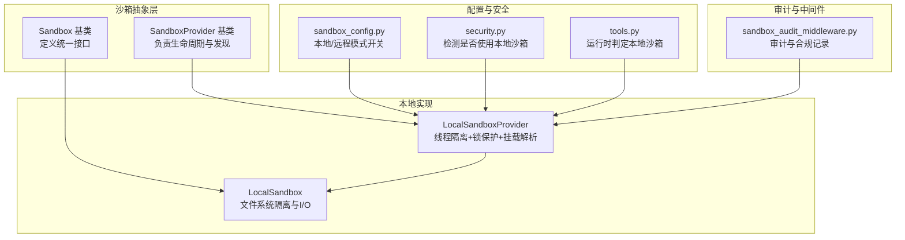
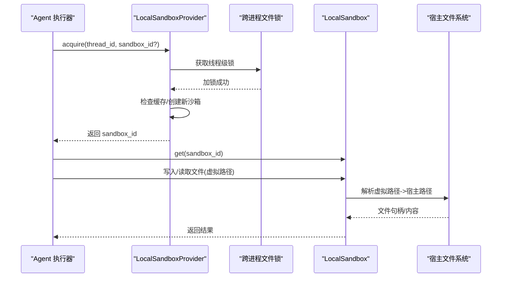
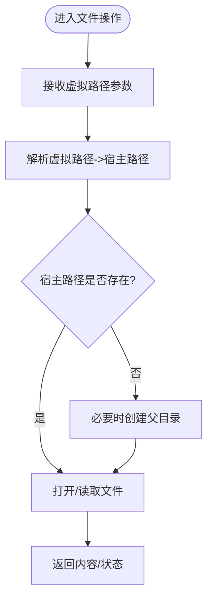
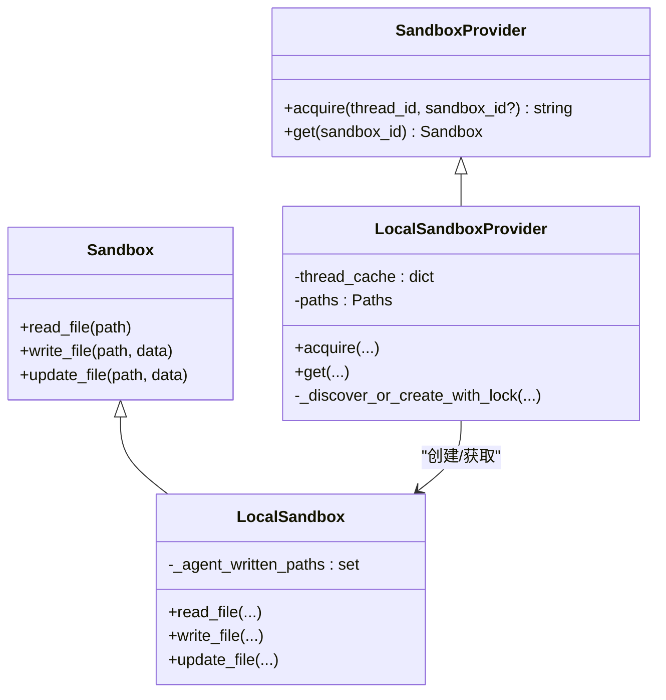
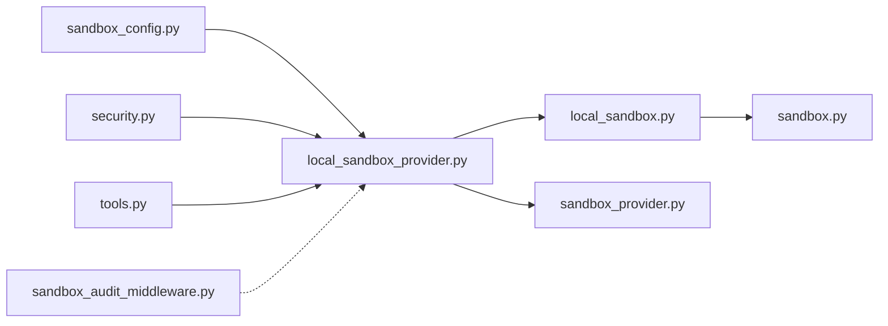

# 本地沙箱执行

<cite>
**本文引用的文件**
- [backend/packages/harness/deerflow/sandbox/local/local_sandbox.py](file://backend/packages/harness/deerflow/sandbox/local/local_sandbox.py)
- [backend/packages/harness/deerflow/sandbox/local/local_sandbox_provider.py](file://backend/packages/harness/deerflow/sandbox/local/local_sandbox_provider.py)
- [backend/packages/harness/deerflow/sandbox/sandbox.py](file://backend/packages/harness/deerflow/sandbox/sandbox.py)
- [backend/packages/harness/deerflow/sandbox/sandbox_provider.py](file://backend/packages/harness/deerflow/sandbox/sandbox_provider.py)
- [backend/packages/harness/deerflow/config/sandbox_config.py](file://backend/packages/harness/deerflow/config/sandbox_config.py)
- [backend/packages/harness/deerflow/sandbox/security.py](file://backend/packages/harness/deerflow/sandbox/security.py)
- [backend/packages/harness/deerflow/sandbox/tools.py](file://backend/packages/harness/deerflow/sandbox/tools.py)
- [backend/packages/harness/deerflow/agents/middlewares/sandbox_audit_middleware.py](file://backend/packages/harness/deerflow/agents/middlewares/sandbox_audit_middleware.py)
- [backend/docs/CONFIGURATION.md](file://backend/docs/CONFIGURATION.md)
- [backend/tests/test_local_sandbox_provider_mounts.py](file://backend/tests/test_local_sandbox_provider_mounts.py)
- [backend/tests/test_local_sandbox_virtual_path_contract.py](file://backend/tests/test_local_sandbox_virtual_path_contract.py)
- [backend/tests/test_local_sandbox_encoding.py](file://backend/tests/test_local_sandbox_encoding.py)
- [backend/tests/test_local_bash_tool_loading.py](file://backend/tests/test_local_bash_tool_loading.py)
- [backend/tests/test_sandbox_tools_security.py](file://backend/tests/test_sandbox_tools_security.py)
- [backend/tests/test_uploads_router.py](file://backend/tests/test_uploads_router.py)
</cite>

## 目录
1. [引言](#引言)
2. [项目结构](#项目结构)
3. [核心组件](#核心组件)
4. [架构总览](#架构总览)
5. [详细组件分析](#详细组件分析)
6. [依赖关系分析](#依赖关系分析)
7. [性能考虑](#性能考虑)
8. [故障排除指南](#故障排除指南)
9. [结论](#结论)
10. [附录](#附录)

## 引言
本文件面向在本地环境中安全执行各类技能与工具的用户与开发者，系统性阐述 DeerFlow 本地沙箱执行的实现原理、隔离机制、进程管理与资源限制策略，并提供可操作的配置示例与性能优化建议。本地沙箱并非容器级强隔离边界，而是主机侧的便捷执行模式；若需要更强隔离或更丰富的后端能力，请参考其他后端（如 AIO 沙箱）。

## 项目结构
本地沙箱相关代码主要位于后端 harness 包中，围绕 Sandbox 抽象与 LocalSandboxProvider 展开，配合配置模块、安全检查与中间件共同构成完整的本地执行链路。

图示来源
- [backend/packages/harness/deerflow/sandbox/sandbox.py](file://backend/packages/harness/deerflow/sandbox/sandbox.py)
- [backend/packages/harness/deerflow/sandbox/sandbox_provider.py](file://backend/packages/harness/deerflow/sandbox/sandbox_provider.py)
- [backend/packages/harness/deerflow/sandbox/local/local_sandbox.py](file://backend/packages/harness/deerflow/sandbox/local/local_sandbox.py)
- [backend/packages/harness/deerflow/sandbox/local/local_sandbox_provider.py](file://backend/packages/harness/deerflow/sandbox/local/local_sandbox_provider.py)
- [backend/packages/harness/deerflow/config/sandbox_config.py](file://backend/packages/harness/deerflow/config/sandbox_config.py)
- [backend/packages/harness/deerflow/sandbox/security.py](file://backend/packages/harness/deerflow/sandbox/security.py)
- [backend/packages/harness/deerflow/sandbox/tools.py](file://backend/packages/harness/deerflow/sandbox/tools.py)
- [backend/packages/harness/deerflow/agents/middlewares/sandbox_audit_middleware.py](file://backend/packages/harness/deerflow/agents/middlewares/sandbox_audit_middleware.py)

章节来源
- [backend/packages/harness/deerflow/sandbox/sandbox.py](file://backend/packages/harness/deerflow/sandbox/sandbox.py)
- [backend/packages/harness/deerflow/sandbox/sandbox_provider.py](file://backend/packages/harness/deerflow/sandbox/sandbox_provider.py)
- [backend/packages/harness/deerflow/sandbox/local/local_sandbox.py](file://backend/packages/harness/deerflow/sandbox/local/local_sandbox.py)
- [backend/packages/harness/deerflow/sandbox/local/local_sandbox_provider.py](file://backend/packages/harness/deerflow/sandbox/local/local_sandbox_provider.py)
- [backend/packages/harness/deerflow/config/sandbox_config.py](file://backend/packages/harness/deerflow/config/sandbox_config.py)
- [backend/packages/harness/deerflow/sandbox/security.py](file://backend/packages/harness/deerflow/sandbox/security.py)
- [backend/packages/harness/deerflow/sandbox/tools.py](file://backend/packages/harness/deerflow/sandbox/tools.py)
- [backend/packages/harness/deerflow/agents/middlewares/sandbox_audit_middleware.py](file://backend/packages/harness/deerflow/agents/middlewares/sandbox_audit_middleware.py)

## 核心组件
- Sandbox 抽象基类：定义统一的文件读写、工具调用等接口契约，确保不同后端实现的一致行为。
- SandboxProvider 抽象基类：负责沙箱实例的获取、发现与生命周期管理。
- LocalSandbox：在本地执行上下文中实现 Sandbox 接口，提供基于虚拟路径映射的文件系统隔离与 I/O 能力。
- LocalSandboxProvider：负责按线程维度分配独立沙箱，通过跨进程文件锁避免并发冲突，解析挂载与虚拟路径映射。
- 配置模块：控制本地/远程沙箱模式选择与相关行为。
- 安全与工具判定：在运行时判断当前是否处于本地沙箱环境，以调整工具可用性与权限策略。
- 审计中间件：对沙箱相关操作进行审计记录，便于合规与追踪。

章节来源
- [backend/packages/harness/deerflow/sandbox/sandbox.py](file://backend/packages/harness/deerflow/sandbox/sandbox.py)
- [backend/packages/harness/deerflow/sandbox/sandbox_provider.py](file://backend/packages/harness/deerflow/sandbox/sandbox_provider.py)
- [backend/packages/harness/deerflow/sandbox/local/local_sandbox.py](file://backend/packages/harness/deerflow/sandbox/local/local_sandbox.py)
- [backend/packages/harness/deerflow/sandbox/local/local_sandbox_provider.py](file://backend/packages/harness/deerflow/sandbox/local/local_sandbox_provider.py)
- [backend/packages/harness/deerflow/config/sandbox_config.py](file://backend/packages/harness/deerflow/config/sandbox_config.py)
- [backend/packages/harness/deerflow/sandbox/security.py](file://backend/packages/harness/deerflow/sandbox/security.py)
- [backend/packages/harness/deerflow/sandbox/tools.py](file://backend/packages/harness/deerflow/sandbox/tools.py)
- [backend/packages/harness/deerflow/agents/middlewares/sandbox_audit_middleware.py](file://backend/packages/harness/deerflow/agents/middlewares/sandbox_audit_middleware.py)

## 架构总览
本地沙箱执行的关键流程包括：线程隔离与沙箱发现/创建、虚拟路径到宿主路径的映射、文件系统隔离与 I/O、以及与工具加载与权限策略的协同。

图示来源
- [backend/packages/harness/deerflow/sandbox/local/local_sandbox_provider.py](file://backend/packages/harness/deerflow/sandbox/local/local_sandbox_provider.py)
- [backend/packages/harness/deerflow/sandbox/local/local_sandbox.py](file://backend/packages/harness/deerflow/sandbox/local/local_sandbox.py)

## 详细组件分析

### LocalSandbox 文件系统隔离与 I/O
- 虚拟路径契约：所有对外的文件操作均以“虚拟路径”进行，例如 /mnt/user-data/uploads/...，内部再映射到宿主路径，避免直接写入宿主根目录。
- 线程隔离：同一 thread_id 的多次 acquire 会得到相同沙箱 ID，不同 thread_id 得到不同沙箱，确保跨线程不泄漏。
- 反向解析：记录“代理写入过的路径”，用于后续反向解析与一致性校验。
- 编码与路径解析：测试覆盖了编码处理与虚拟路径解析，保证在不同平台与字符集下的稳定性。

图示来源
- [backend/tests/test_local_sandbox_virtual_path_contract.py](file://backend/tests/test_local_sandbox_virtual_path_contract.py)
- [backend/tests/test_local_sandbox_encoding.py](file://backend/tests/test_local_sandbox_encoding.py)

章节来源
- [backend/tests/test_local_sandbox_virtual_path_contract.py](file://backend/tests/test_local_sandbox_virtual_path_contract.py)
- [backend/tests/test_local_sandbox_encoding.py](file://backend/tests/test_local_sandbox_encoding.py)

### LocalSandboxProvider 线程隔离与并发控制
- 线程级沙箱：每个 thread_id 对应一个独立沙箱实例，避免多线程共享状态导致的数据竞争。
- 跨进程文件锁：在创建沙箱前加锁，防止多进程同时创建同一线程的沙箱，避免命名冲突与竞态。
- 路径挂载解析：根据配置与线程/用户上下文生成宿主路径，确保隔离与可预测性。
- 单例与重置：支持重置清理单例状态，保障测试与长生命周期服务的正确性。

图示来源
- [backend/packages/harness/deerflow/sandbox/sandbox_provider.py](file://backend/packages/harness/deerflow/sandbox/sandbox_provider.py)
- [backend/packages/harness/deerflow/sandbox/local/local_sandbox_provider.py](file://backend/packages/harness/deerflow/sandbox/local/local_sandbox_provider.py)
- [backend/packages/harness/deerflow/sandbox/sandbox.py](file://backend/packages/harness/deerflow/sandbox/sandbox.py)
- [backend/packages/harness/deerflow/sandbox/local/local_sandbox.py](file://backend/packages/harness/deerflow/sandbox/local/local_sandbox.py)

章节来源
- [backend/packages/harness/deerflow/sandbox/local/local_sandbox_provider.py](file://backend/packages/harness/deerflow/sandbox/local/local_sandbox_provider.py)
- [backend/tests/test_local_sandbox_provider_mounts.py](file://backend/tests/test_local_sandbox_provider_mounts.py)
- [backend/tests/test_local_sandbox_virtual_path_contract.py](file://backend/tests/test_local_sandbox_virtual_path_contract.py)

### 配置与模式选择
- 本地/远程沙箱：通过配置模块决定是否启用本地沙箱模式，从而影响工具可用性与权限策略。
- 安全提示：默认不开放 host bash，仅在完全受信任的单用户本地工作流中才建议开启。
- 运行时判定：在运行时可通过工具函数判断当前是否处于本地沙箱，以便动态调整策略。

章节来源
- [backend/packages/harness/deerflow/config/sandbox_config.py](file://backend/packages/harness/deerflow/config/sandbox_config.py)
- [backend/packages/harness/deerflow/sandbox/security.py](file://backend/packages/harness/deerflow/sandbox/security.py)
- [backend/packages/harness/deerflow/sandbox/tools.py](file://backend/packages/harness/deerflow/sandbox/tools.py)
- [backend/docs/CONFIGURATION.md](file://backend/docs/CONFIGURATION.md)

### 工具加载与权限策略
- 默认隐藏 bash 工具：在本地沙箱默认配置下，bash 工具不会被暴露，以降低风险。
- 安全拒绝：当检测到本地沙箱默认模式且尝试使用 host bash 时，工具加载会被拒绝。
- 上传路由协作：上传文件写入线程存储后，本地沙箱不强制同步，避免不必要的 I/O 干扰。

章节来源
- [backend/tests/test_local_bash_tool_loading.py](file://backend/tests/test_local_bash_tool_loading.py)
- [backend/tests/test_sandbox_tools_security.py](file://backend/tests/test_sandbox_tools_security.py)
- [backend/tests/test_uploads_router.py](file://backend/tests/test_uploads_router.py)

### 审计与合规
- 审计中间件：对沙箱相关操作进行记录，便于审计与问题追溯。
- 合规策略：结合配置与安全策略，确保本地执行符合最小权限原则与最小暴露面。

章节来源
- [backend/packages/harness/deerflow/agents/middlewares/sandbox_audit_middleware.py](file://backend/packages/harness/deerflow/agents/middlewares/sandbox_audit_middleware.py)

## 依赖关系分析
- 继承与组合：LocalSandbox 组合于 LocalSandboxProvider，后者依赖路径与锁设施；配置与安全模块贯穿于创建与运行期决策。
- 测试覆盖：针对虚拟路径契约、线程隔离、挂载解析、编码处理、工具加载与权限策略均有针对性测试，保障行为一致性。

图示来源
- [backend/packages/harness/deerflow/config/sandbox_config.py](file://backend/packages/harness/deerflow/config/sandbox_config.py)
- [backend/packages/harness/deerflow/sandbox/security.py](file://backend/packages/harness/deerflow/sandbox/security.py)
- [backend/packages/harness/deerflow/sandbox/tools.py](file://backend/packages/harness/deerflow/sandbox/tools.py)
- [backend/packages/harness/deerflow/sandbox/local/local_sandbox_provider.py](file://backend/packages/harness/deerflow/sandbox/local/local_sandbox_provider.py)
- [backend/packages/harness/deerflow/sandbox/local/local_sandbox.py](file://backend/packages/harness/deerflow/sandbox/local/local_sandbox.py)
- [backend/packages/harness/deerflow/sandbox/sandbox.py](file://backend/packages/harness/deerflow/sandbox/sandbox.py)
- [backend/packages/harness/deerflow/sandbox/sandbox_provider.py](file://backend/packages/harness/deerflow/sandbox/sandbox_provider.py)
- [backend/packages/harness/deerflow/agents/middlewares/sandbox_audit_middleware.py](file://backend/packages/harness/deerflow/agents/middlewares/sandbox_audit_middleware.py)

章节来源
- [backend/packages/harness/deerflow/sandbox/local/local_sandbox_provider.py](file://backend/packages/harness/deerflow/sandbox/local/local_sandbox_provider.py)
- [backend/packages/harness/deerflow/sandbox/local/local_sandbox.py](file://backend/packages/harness/deerflow/sandbox/local/local_sandbox.py)
- [backend/packages/harness/deerflow/sandbox/sandbox_provider.py](file://backend/packages/harness/deerflow/sandbox/sandbox_provider.py)
- [backend/packages/harness/deerflow/sandbox/sandbox.py](file://backend/packages/harness/deerflow/sandbox/sandbox.py)
- [backend/packages/harness/deerflow/agents/middlewares/sandbox_audit_middleware.py](file://backend/packages/harness/deerflow/agents/middlewares/sandbox_audit_middleware.py)

## 性能考虑
- I/O 路径解析：尽量复用已解析的宿主路径，减少重复解析成本。
- 线程缓存：利用线程级沙箱缓存，避免频繁创建与销毁带来的额外开销。
- 最小同步：本地沙箱默认不强制同步上传文件，减少不必要的磁盘往返。
- 工具过滤：在本地沙箱默认模式下隐藏高风险工具，降低运行时上下文复杂度。

## 故障排除指南
- 虚拟路径写入失败
  - 现象：向 /mnt/user-data/... 写入时报错。
  - 排查：确认使用的是虚拟路径而非宿主绝对路径；检查线程隔离是否正确，避免跨线程访问。
  - 参考测试：虚拟路径契约与线程隔离测试。
  - 章节来源
    - [backend/tests/test_local_sandbox_virtual_path_contract.py](file://backend/tests/test_local_sandbox_virtual_path_contract.py)
    - [backend/tests/test_local_sandbox_provider_mounts.py](file://backend/tests/test_local_sandbox_provider_mounts.py)

- 上传文件未生效
  - 现象：上传后本地沙箱未更新。
  - 排查：本地沙箱默认不强制同步上传文件；如需同步请切换到非本地沙箱后端。
  - 章节来源
    - [backend/tests/test_uploads_router.py](file://backend/tests/test_uploads_router.py)

- bash 工具不可用
  - 现象：工具列表中看不到 bash。
  - 排查：本地沙箱默认隐藏 bash；如确需使用，请评估风险并参考配置文档中的安全提示。
  - 章节来源
    - [backend/tests/test_local_bash_tool_loading.py](file://backend/tests/test_local_bash_tool_loading.py)
    - [backend/docs/CONFIGURATION.md](file://backend/docs/CONFIGURATION.md)

- 并发创建冲突
  - 现象：多进程同时创建同一线程沙箱导致异常。
  - 排查：确认跨进程文件锁逻辑正常；检查线程/用户上下文路径生成是否一致。
  - 章节来源
    - [backend/packages/harness/deerflow/sandbox/local/local_sandbox_provider.py](file://backend/packages/harness/deerflow/sandbox/local/local_sandbox_provider.py)

## 结论
本地沙箱为 DeerFlow 提供了轻量、易用且相对安全的本地执行能力。它通过线程隔离、虚拟路径映射与跨进程锁等机制，在主机侧实现基本的隔离与一致性。对于需要更强隔离或更丰富后端能力的场景，建议结合配置模块与安全策略，谨慎评估是否启用 host bash，并优先采用非本地沙箱后端。

## 附录
- 使用场景建议
  - 开发调试与快速验证：本地沙箱适合单用户、受信任的本地开发环境。
  - 工具加载与权限：默认隐藏高风险工具，遵循最小权限原则。
  - 上传与同步：本地沙箱默认不强制同步上传文件，避免不必要的 I/O。
- 配置要点
  - 本地/远程模式：通过配置模块选择后端模式。
  - 安全提示：默认不开放 host bash，仅在完全受信任的单用户本地工作流中才建议开启。