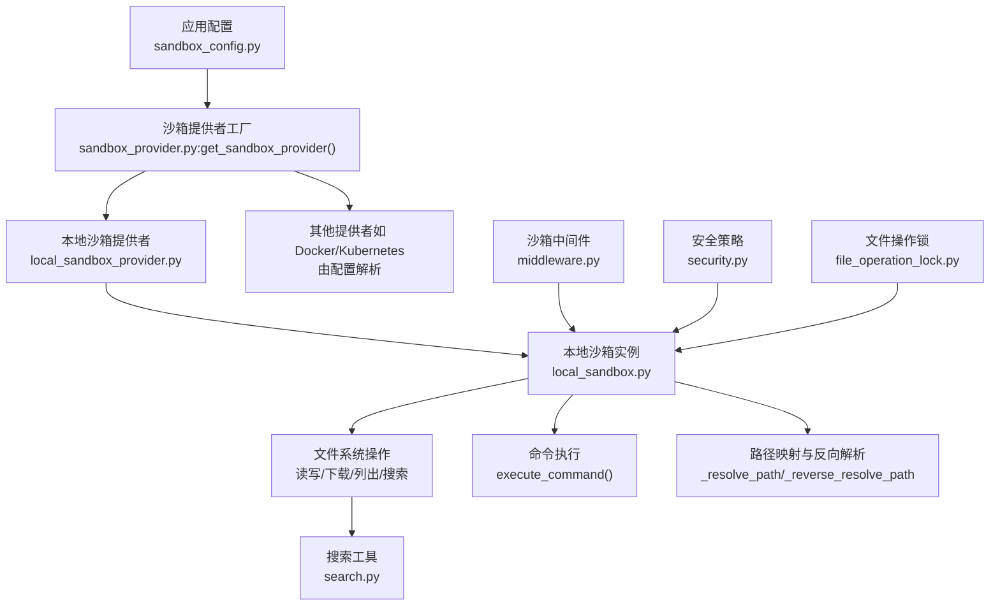
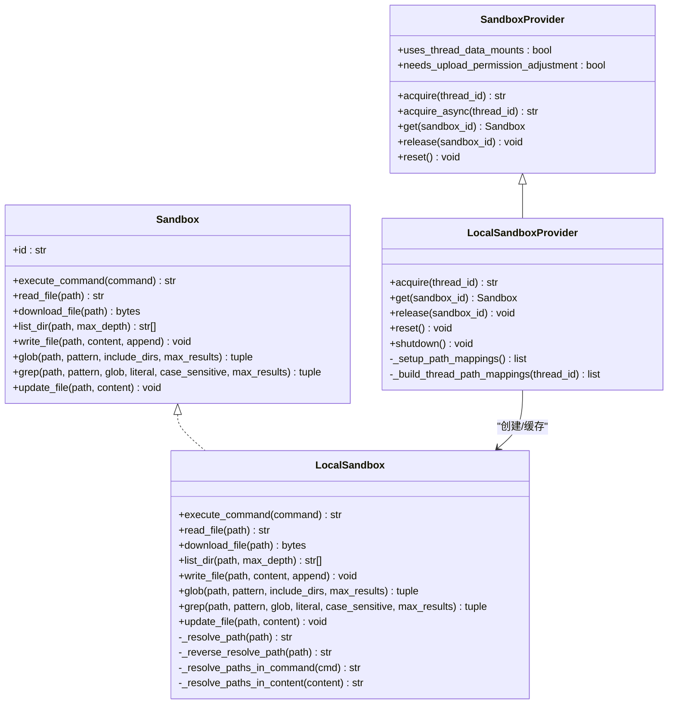
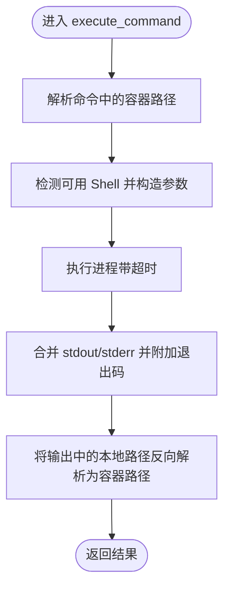
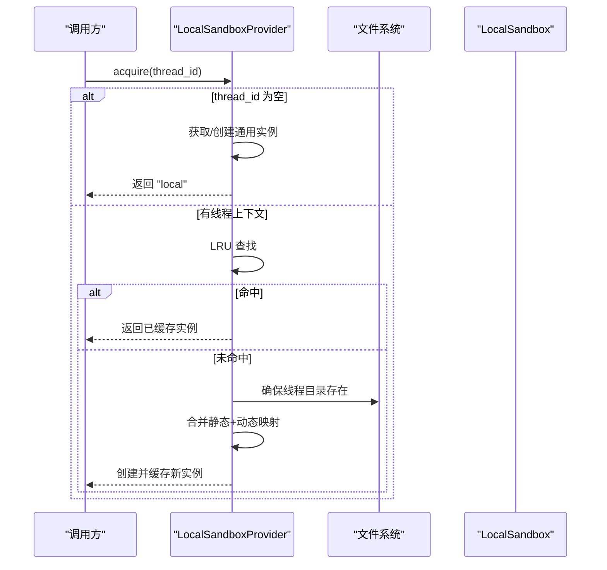
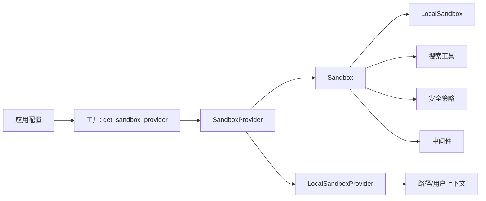

# 沙箱执行系统

<cite>
**本文引用的文件**
- [backend/packages/harness/deerflow/sandbox/__init__.py](file://backend/packages/harness/deerflow/sandbox/__init__.py)
- [backend/packages/harness/deerflow/sandbox/sandbox.py](file://backend/packages/harness/deerflow/sandbox/sandbox.py)
- [backend/packages/harness/deerflow/sandbox/sandbox_provider.py](file://backend/packages/harness/deerflow/sandbox/sandbox_provider.py)
- [backend/packages/harness/deerflow/sandbox/local/local_sandbox.py](file://backend/packages/harness/deerflow/sandbox/local/local_sandbox.py)
- [backend/packages/harness/deerflow/sandbox/local/local_sandbox_provider.py](file://backend/packages/harness/deerflow/sandbox/local/local_sandbox_provider.py)
- [backend/packages/harness/deerflow/sandbox/search.py](file://backend/packages/harness/deerflow/sandbox/search.py)
- [backend/packages/harness/deerflow/sandbox/security.py](file://backend/packages/harness/deerflow/sandbox/security.py)
- [backend/packages/harness/deerflow/sandbox/tools.py](file://backend/packages/harness/deerflow/sandbox/tools.py)
- [backend/packages/harness/deerflow/sandbox/exceptions.py](file://backend/packages/harness/deerflow/sandbox/exceptions.py)
- [backend/packages/harness/deerflow/sandbox/middleware.py](file://backend/packages/harness/deerflow/sandbox/middleware.py)
- [backend/packages/harness/deerflow/sandbox/file_operation_lock.py](file://backend/packages/harness/deerflow/sandbox/file_operation_lock.py)
- [backend/packages/harness/deerflow/config/sandbox_config.py](file://backend/packages/harness/deerflow/config/sandbox_config.py)
- [backend/docs/CONFIGURATION.md](file://backend/docs/CONFIGURATION.md)
- [backend/docs/ARCHITECTURE.md](file://backend/docs/ARCHITECTURE.md)
- [backend/tests/test_local_sandbox_provider_mounts.py](file://backend/tests/test_local_sandbox_provider_mounts.py)
- [backend/tests/test_local_sandbox_virtual_path_contract.py](file://backend/tests/test_local_sandbox_virtual_path_contract.py)
- [backend/tests/test_sandbox_tools_security.py](file://backend/tests/test_sandbox_tools_security.py)
- [backend/tests/test_docker_sandbox_mode_detection.py](file://backend/tests/test_docker_sandbox_mode_detection.py)
</cite>

## 目录
1. [引言](#引言)
2. [项目结构](#项目结构)
3. [核心组件](#核心组件)
4. [架构总览](#架构总览)
5. [详细组件分析](#详细组件分析)
6. [依赖关系分析](#依赖关系分析)
7. [性能考量](#性能考量)
8. [故障排查指南](#故障排查指南)
9. [结论](#结论)
10. [附录](#附录)

## 引言
本技术文档围绕 DeerFlow 的沙箱执行系统，系统性阐述执行环境隔离、文件系统管理、网络访问控制与资源限制机制，并对比本地沙箱、Docker 沙箱与 Kubernetes 沙箱的实现差异与适用场景。文档同时提供配置示例、使用模式、异常处理策略、性能对比与安全最佳实践，帮助读者在不同部署形态下做出合理选择并稳定运行。

## 项目结构
沙箱子系统位于后端 harness 包中，采用“抽象接口 + 提供者 + 具体实现”的分层设计：
- 抽象层：定义统一的 Sandbox 接口与 SandboxProvider 抽象类，屏蔽具体执行后端差异
- 本地实现：LocalSandbox 与 LocalSandboxProvider，基于本地文件系统与路径映射实现隔离
- 搜索与工具：提供文件检索、匹配与工具调用能力
- 安全与中间件：提供安全策略、文件操作锁与运行时中间件
- 配置：通过应用配置解析沙箱后端类型与挂载参数

图表来源
- [backend/packages/harness/deerflow/sandbox/sandbox_provider.py:60-74](file://backend/packages/harness/deerflow/sandbox/sandbox_provider.py#L60-L74)
- [backend/packages/harness/deerflow/sandbox/local/local_sandbox_provider.py:34-81](file://backend/packages/harness/deerflow/sandbox/local/local_sandbox_provider.py#L34-L81)
- [backend/packages/harness/deerflow/sandbox/local/local_sandbox.py:33-85](file://backend/packages/harness/deerflow/sandbox/local/local_sandbox.py#L33-L85)
- [backend/packages/harness/deerflow/sandbox/search.py](file://backend/packages/harness/deerflow/sandbox/search.py)
- [backend/packages/harness/deerflow/sandbox/middleware.py](file://backend/packages/harness/deerflow/sandbox/middleware.py)
- [backend/packages/harness/deerflow/sandbox/security.py](file://backend/packages/harness/deerflow/sandbox/security.py)
- [backend/packages/harness/deerflow/sandbox/file_operation_lock.py](file://backend/packages/harness/deerflow/sandbox/file_operation_lock.py)
- [backend/packages/harness/deerflow/config/sandbox_config.py](file://backend/packages/harness/deerflow/config/sandbox_config.py)

章节来源
- [backend/packages/harness/deerflow/sandbox/__init__.py:1-9](file://backend/packages/harness/deerflow/sandbox/__init__.py#L1-L9)
- [backend/packages/harness/deerflow/sandbox/sandbox.py:6-113](file://backend/packages/harness/deerflow/sandbox/sandbox.py#L6-L113)
- [backend/packages/harness/deerflow/sandbox/sandbox_provider.py:9-122](file://backend/packages/harness/deerflow/sandbox/sandbox_provider.py#L9-L122)
- [backend/packages/harness/deerflow/sandbox/local/local_sandbox.py:33-478](file://backend/packages/harness/deerflow/sandbox/local/local_sandbox.py#L33-L478)
- [backend/packages/harness/deerflow/sandbox/local/local_sandbox_provider.py:34-330](file://backend/packages/harness/deerflow/sandbox/local/local_sandbox_provider.py#L34-L330)

## 核心组件
- Sandbox 抽象基类：定义统一的命令执行、文件读写、目录遍历、全局匹配与文本搜索等能力，确保上层逻辑不依赖具体后端
- SandboxProvider 抽象基类：负责获取/释放沙箱实例，支持同步 acquire 与异步 acquire_async；提供单例工厂与重置/关闭生命周期管理
- LocalSandbox：本地文件系统沙箱，实现路径映射、只读保护、输出中的路径反向解析、命令执行与超时控制、二进制更新与下载大小限制
- LocalSandboxProvider：按线程维度生成 LocalSandbox 实例，维护静态与动态路径映射，支持 LRU 缓存与并发安全
- 搜索与工具：提供 glob/grep 等检索能力，配合虚拟路径进行结果反向解析
- 安全与中间件：提供安全策略、文件操作锁与运行时中间件，保障多线程与多用户隔离
- 配置：从应用配置解析沙箱后端类型与挂载参数，支持自定义主机路径到容器路径的映射

章节来源
- [backend/packages/harness/deerflow/sandbox/sandbox.py:6-113](file://backend/packages/harness/deerflow/sandbox/sandbox.py#L6-L113)
- [backend/packages/harness/deerflow/sandbox/sandbox_provider.py:9-122](file://backend/packages/harness/deerflow/sandbox/sandbox_provider.py#L9-L122)
- [backend/packages/harness/deerflow/sandbox/local/local_sandbox.py:33-478](file://backend/packages/harness/deerflow/sandbox/local/local_sandbox.py#L33-L478)
- [backend/packages/harness/deerflow/sandbox/local/local_sandbox_provider.py:34-330](file://backend/packages/harness/deerflow/sandbox/local/local_sandbox_provider.py#L34-L330)
- [backend/packages/harness/deerflow/sandbox/search.py](file://backend/packages/harness/deerflow/sandbox/search.py)
- [backend/packages/harness/deerflow/sandbox/security.py](file://backend/packages/harness/deerflow/sandbox/security.py)
- [backend/packages/harness/deerflow/sandbox/middleware.py](file://backend/packages/harness/deerflow/sandbox/middleware.py)
- [backend/packages/harness/deerflow/sandbox/file_operation_lock.py](file://backend/packages/harness/deerflow/sandbox/file_operation_lock.py)
- [backend/packages/harness/deerflow/config/sandbox_config.py](file://backend/packages/harness/deerflow/config/sandbox_config.py)

## 架构总览
沙箱系统通过“提供者工厂”根据配置解析具体后端类型，返回对应 SandboxProvider 实例，再由其产出 Sandbox 实例。本地沙箱提供者按线程生成独立的 LocalSandbox，结合静态与动态路径映射实现用户级隔离与工作空间绑定。搜索与工具模块在虚拟路径视图内执行，最终将结果反向解析回容器路径，保证对外输出的一致性与可追踪性。

图表来源
- [backend/packages/harness/deerflow/sandbox/sandbox.py:6-113](file://backend/packages/harness/deerflow/sandbox/sandbox.py#L6-L113)
- [backend/packages/harness/deerflow/sandbox/sandbox_provider.py:9-122](file://backend/packages/harness/deerflow/sandbox/sandbox_provider.py#L9-L122)
- [backend/packages/harness/deerflow/sandbox/local/local_sandbox.py:33-478](file://backend/packages/harness/deerflow/sandbox/local/local_sandbox.py#L33-L478)
- [backend/packages/harness/deerflow/sandbox/local/local_sandbox_provider.py:34-330](file://backend/packages/harness/deerflow/sandbox/local/local_sandbox_provider.py#L34-L330)

## 详细组件分析

### 本地沙箱（LocalSandbox）
- 路径映射与解析
  - 支持将容器路径映射到本地宿主路径，优先匹配最长前缀，避免嵌套挂载冲突
  - 在命令与内容中解析容器路径为本地路径，执行后再将本地路径反向解析回容器路径，保证输出一致性
- 文件系统安全
  - 只读挂载检测与拒绝写入，防止越界修改
  - 下载限制：仅允许下载位于虚拟前缀下的文件，且对最大文件大小进行限制
  - 写入跟踪：记录“代理作者写入”的文件，仅对这些文件在读取时进行路径反向解析，避免污染外部或上传内容
- 命令执行
  - 自动检测 Shell 并设置相应参数；Windows 上区分 PowerShell、cmd 与 MSYS；支持超时控制
  - 输出合并标准输出与错误输出，并追加退出码提示
- 搜索与匹配
  - glob 与 grep 在解析后的本地路径上执行，结果路径统一反向解析回容器路径
- 二进制更新
  - 支持二进制文件更新，写入前同样进行路径解析与只读检查

图表来源
- [backend/packages/harness/deerflow/sandbox/local/local_sandbox.py:311-357](file://backend/packages/harness/deerflow/sandbox/local/local_sandbox.py#L311-L357)

章节来源
- [backend/packages/harness/deerflow/sandbox/local/local_sandbox.py:33-478](file://backend/packages/harness/deerflow/sandbox/local/local_sandbox.py#L33-L478)

### 本地沙箱提供者（LocalSandboxProvider）
- 静态映射与动态映射
  - 静态映射：技能目录与配置中的自定义挂载（仅当宿主路径存在且绝对路径有效）
  - 动态映射：按线程构建用户数据与工作区目录映射，确保每个线程拥有独立的用户数据视图
- 缓存与并发
  - 使用 LRU 缓存保存每线程的 LocalSandbox 实例，默认上限可配置
  - 通过锁保证并发安全，避免竞态导致的重复创建
- 生命周期管理
  - release 不销毁实例，仅用于复用；reset/shutdown 清空缓存并重置模块级别别名
- 兼容性
  - 支持“无线程上下文”的通用实例，兼容旧测试与脚本

图表来源
- [backend/packages/harness/deerflow/sandbox/local/local_sandbox_provider.py:219-264](file://backend/packages/harness/deerflow/sandbox/local/local_sandbox_provider.py#L219-L264)

章节来源
- [backend/packages/harness/deerflow/sandbox/local/local_sandbox_provider.py:34-330](file://backend/packages/harness/deerflow/sandbox/local/local_sandbox_provider.py#L34-L330)

### 搜索与工具（Glob/Grep/工具集成）
- Glob 与 Grep
  - 在解析后的本地路径上执行，返回匹配项并进行路径反向解析
- 工具集成
  - 工具模块通过沙箱接口执行外部命令与文件操作，结合安全策略与中间件进行权限校验与审计

章节来源
- [backend/packages/harness/deerflow/sandbox/search.py](file://backend/packages/harness/deerflow/sandbox/search.py)
- [backend/packages/harness/deerflow/sandbox/tools.py](file://backend/packages/harness/deerflow/sandbox/tools.py)

### 安全与中间件
- 安全策略
  - 提供安全扫描、策略判定与异常拦截能力，贯穿工具调用与文件操作
- 中间件
  - 运行时中间件对沙箱请求进行鉴权、审计与限流
- 文件操作锁
  - 防止并发写入冲突，保障多线程场景下的数据一致性

章节来源
- [backend/packages/harness/deerflow/sandbox/security.py](file://backend/packages/harness/deerflow/sandbox/security.py)
- [backend/packages/harness/deerflow/sandbox/middleware.py](file://backend/packages/harness/deerflow/sandbox/middleware.py)
- [backend/packages/harness/deerflow/sandbox/file_operation_lock.py](file://backend/packages/harness/deerflow/sandbox/file_operation_lock.py)

### 配置与工厂
- 工厂
  - 通过应用配置解析沙箱后端类，创建 SandboxProvider 单例；支持重置与关闭
- 配置
  - 沙箱配置包含后端类型、挂载列表等；挂载校验包括绝对路径、容器路径合法性与保留前缀冲突检查

章节来源
- [backend/packages/harness/deerflow/sandbox/sandbox_provider.py:60-122](file://backend/packages/harness/deerflow/sandbox/sandbox_provider.py#L60-L122)
- [backend/packages/harness/deerflow/config/sandbox_config.py](file://backend/packages/harness/deerflow/config/sandbox_config.py)

## 依赖关系分析
- 组件耦合
  - SandboxProvider 与 Sandbox 为抽象依赖，降低对具体后端的耦合
  - LocalSandboxProvider 依赖应用路径与用户上下文，以生成线程级隔离的映射
- 外部依赖
  - 子进程执行依赖系统 Shell；文件系统操作依赖操作系统权限模型
- 循环依赖
  - 通过模块导入顺序与延迟初始化避免循环依赖

图表来源
- [backend/packages/harness/deerflow/sandbox/sandbox_provider.py:60-122](file://backend/packages/harness/deerflow/sandbox/sandbox_provider.py#L60-L122)
- [backend/packages/harness/deerflow/sandbox/local/local_sandbox_provider.py:82-169](file://backend/packages/harness/deerflow/sandbox/local/local_sandbox_provider.py#L82-L169)
- [backend/packages/harness/deerflow/sandbox/local/local_sandbox.py:11-14](file://backend/packages/harness/deerflow/sandbox/local/local_sandbox.py#L11-L14)

章节来源
- [backend/packages/harness/deerflow/sandbox/sandbox_provider.py:60-122](file://backend/packages/harness/deerflow/sandbox/sandbox_provider.py#L60-L122)
- [backend/packages/harness/deerflow/sandbox/local/local_sandbox_provider.py:82-169](file://backend/packages/harness/deerflow/sandbox/local/local_sandbox_provider.py#L82-L169)
- [backend/packages/harness/deerflow/sandbox/local/local_sandbox.py:11-14](file://backend/packages/harness/deerflow/sandbox/local/local_sandbox.py#L11-L14)

## 性能考量
- 本地沙箱
  - 优点：启动快、延迟低、无需容器编排；适合开发调试与小规模任务
  - 代价：隔离性弱于容器/集群模式，需严格依赖路径映射与只读保护
- Docker/Kubernetes 沙箱
  - 优点：更强的进程与网络隔离、资源配额与网络策略可控
  - 代价：启动与调度开销较大，需要容器镜像与编排配置
- 选择建议
  - 开发/测试：优先本地沙箱
  - 生产：优先容器/集群沙箱，结合资源限制与网络策略
- 优化点
  - 本地沙箱提供者使用 LRU 缓存减少重复创建成本
  - 异步 acquire_async 将阻塞操作移至工作线程，避免事件循环阻塞

## 故障排查指南
- 权限与路径问题
  - 下载被拒：确认路径位于虚拟前缀下，且不超过最大下载限制
  - 写入失败：检查目标路径是否处于只读挂载，或是否超出映射范围
- 命令执行异常
  - Shell 未找到：检查系统可用 Shell 列表与环境变量
  - 超时：适当增大超时阈值或优化命令执行逻辑
- 路径解析异常
  - 输出路径不一致：确认命令与内容中的路径解析链路完整
- 测试验证
  - 提供针对挂载与虚拟路径契约的测试用例，便于回归验证

章节来源
- [backend/tests/test_local_sandbox_provider_mounts.py](file://backend/tests/test_local_sandbox_provider_mounts.py)
- [backend/tests/test_local_sandbox_virtual_path_contract.py](file://backend/tests/test_local_sandbox_virtual_path_contract.py)
- [backend/tests/test_sandbox_tools_security.py](file://backend/tests/test_sandbox_tools_security.py)
- [backend/tests/test_docker_sandbox_mode_detection.py](file://backend/tests/test_docker_sandbox_mode_detection.py)

## 结论
DeerFlow 沙箱系统通过抽象接口与提供者工厂实现了对多种执行后端的统一封装。本地沙箱提供低成本、高响应的执行能力；容器与集群沙箱则提供更强的隔离与治理能力。结合严格的路径映射、只读保护、下载限制与中间件安全策略，系统在功能完整性与安全性之间取得平衡。生产部署建议优先采用容器/集群沙箱，并配合完善的资源限制与网络策略。

## 附录

### 执行模式与适用场景
- 本地沙箱
  - 场景：开发调试、小规模任务、快速迭代
  - 关键特性：路径映射、只读保护、输出路径反向解析、命令超时
- Docker 沙箱
  - 场景：需要更强隔离与资源限制的生产任务
  - 关键特性：进程隔离、网络策略、资源配额、镜像一致性
- Kubernetes 沙箱
  - 场景：大规模并发、弹性扩缩容、多租户隔离
  - 关键特性：Pod 级隔离、命名空间与 RBAC、HPA/资源配额、持久化存储

### 配置示例与使用模式
- 配置要点
  - 解析后端类：通过应用配置指定沙箱后端实现类
  - 挂载参数：主机路径必须为绝对路径，容器路径必须以“/”开头；避免与保留前缀冲突
  - 用户数据目录：按线程生成工作区、上传与输出目录，确保隔离
- 使用模式
  - 获取提供者：通过工厂方法获取单例提供者
  - 获取沙箱：按线程 ID 获取或创建沙箱实例
  - 执行命令/文件操作：通过沙箱接口完成，自动处理路径解析与安全检查

章节来源
- [backend/packages/harness/deerflow/sandbox/sandbox_provider.py:60-122](file://backend/packages/harness/deerflow/sandbox/sandbox_provider.py#L60-L122)
- [backend/packages/harness/deerflow/sandbox/local/local_sandbox_provider.py:82-169](file://backend/packages/harness/deerflow/sandbox/local/local_sandbox_provider.py#L82-L169)
- [backend/docs/CONFIGURATION.md](file://backend/docs/CONFIGURATION.md)
- [backend/docs/ARCHITECTURE.md](file://backend/docs/ARCHITECTURE.md)