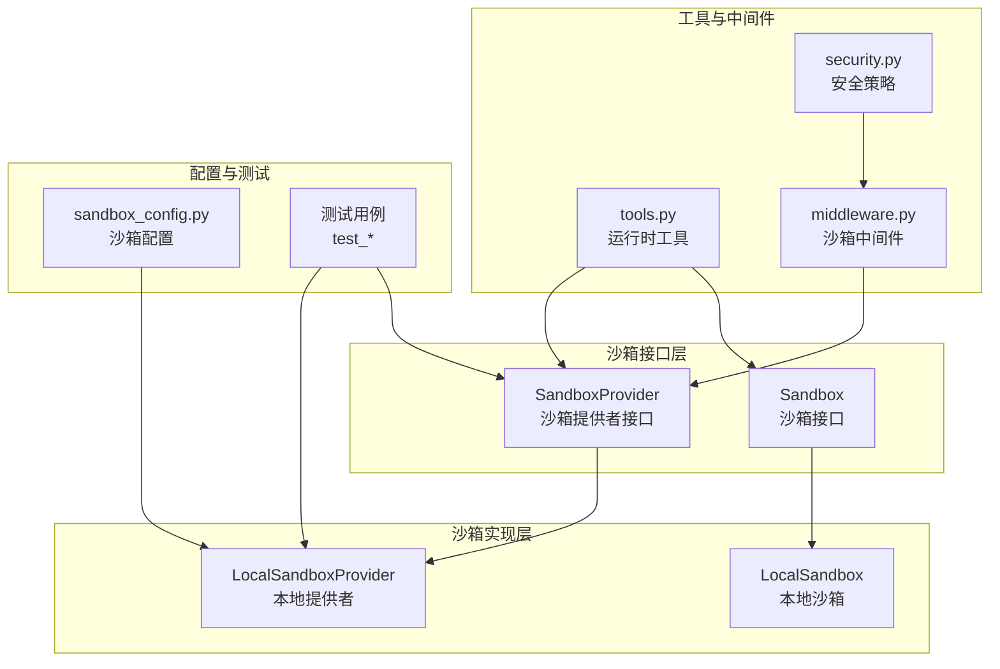
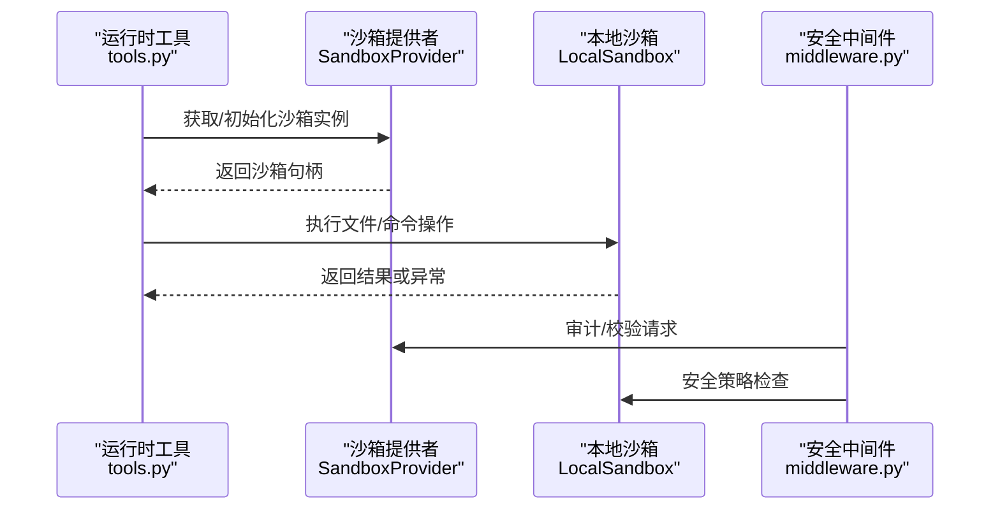
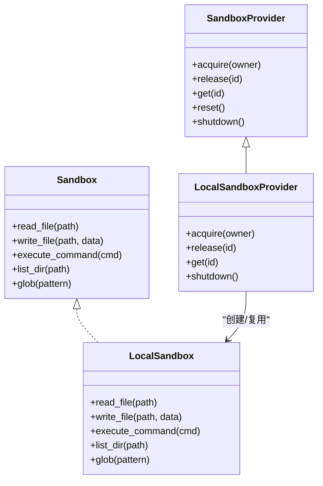
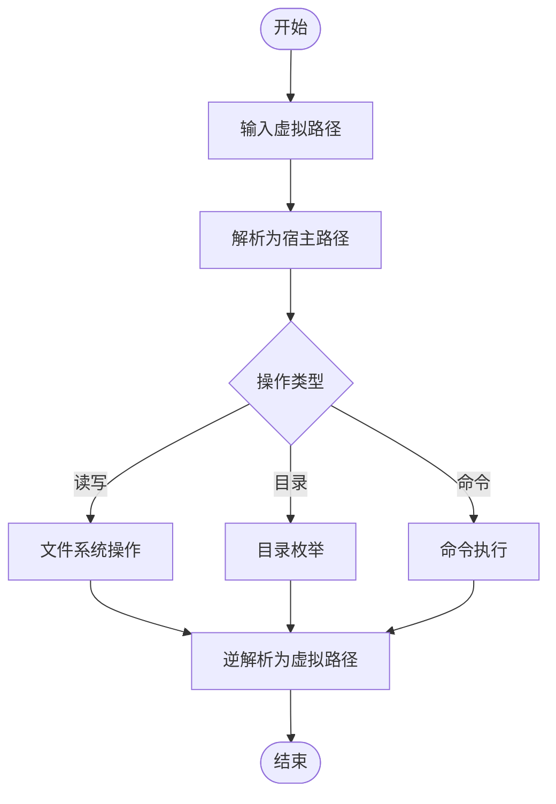
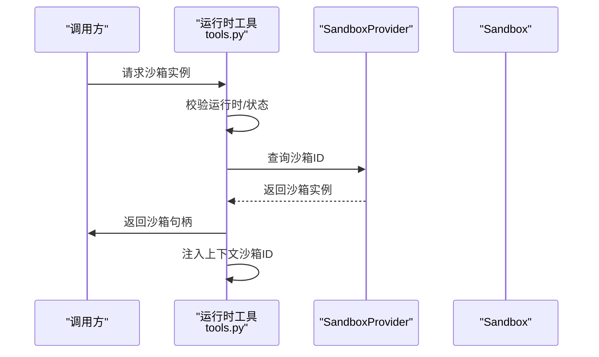
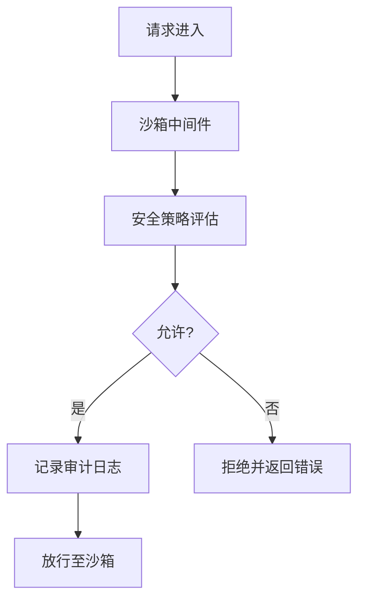
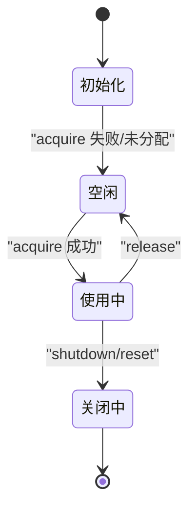
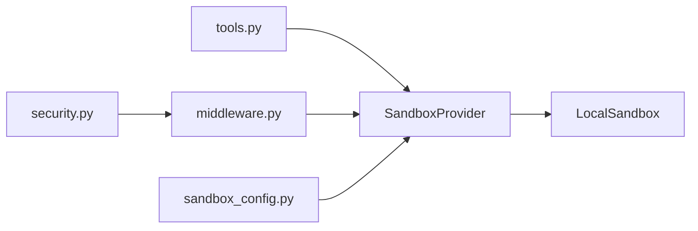

# 沙箱架构设计

<cite>
**本文档引用的文件**
- [sandbox.py](file://backend/packages/harness/deerflow/sandbox/sandbox.py)
- [sandbox_provider.py](file://backend/packages/harness/deerflow/sandbox/sandbox_provider.py)
- [local_sandbox.py](file://backend/packages/harness/deerflow/sandbox/local/local_sandbox.py)
- [local_sandbox_provider.py](file://backend/packages/harness/deerflow/sandbox/local/local_sandbox_provider.py)
- [tools.py](file://backend/packages/harness/deerflow/sandbox/tools.py)
- [security.py](file://backend/packages/harness/deerflow/sandbox/security.py)
- [middleware.py](file://backend/packages/harness/deerflow/sandbox/middleware.py)
- [exceptions.py](file://backend/packages/harness/deerflow/sandbox/exceptions.py)
- [sandbox_config.py](file://backend/packages/harness/deerflow/config/sandbox_config.py)
- [test_aio_sandbox.py](file://backend/tests/test_aio_sandbox.py)
- [test_aio_sandbox_local_backend.py](file://backend/tests/test_aio_sandbox_local_backend.py)
- [test_aio_sandbox_provider.py](file://backend/tests/test_aio_sandbox_provider.py)
- [test_docker_sandbox_mode_detection.py](file://backend/tests/test_docker_sandbox_mode_detection.py)
</cite>

## 目录
1. [引言](#引言)
2. [项目结构](#项目结构)
3. [核心组件](#核心组件)
4. [架构总览](#架构总览)
5. [详细组件分析](#详细组件分析)
6. [依赖关系分析](#依赖关系分析)
7. [性能考虑](#性能考虑)
8. [故障排查指南](#故障排查指南)
9. [结论](#结论)

## 引言
本文件面向 DeerFlow 的沙箱系统，系统性阐述其设计理念、架构模式与组件关系，重点覆盖沙箱提供者接口、安全边界设计、执行环境抽象、生命周期管理、资源分配策略以及错误处理机制。通过架构图与组件交互流程，帮助开发者快速理解并正确集成与扩展沙箱能力。

## 项目结构
沙箱子系统位于后端 harness 包中，采用“接口抽象 + 具体实现 + 工具与中间件”的分层组织方式：
- 接口层：定义通用沙箱与提供者接口，屏蔽具体后端差异
- 实现层：本地沙箱与提供者，支持虚拟路径映射、命令执行、文件操作等
- 工具层：围绕运行时上下文的安全工具函数（如获取沙箱实例）
- 安全层：安全策略与审计中间件
- 配置层：沙箱相关配置项
- 测试层：覆盖本地后端、提供者、就绪态检测等场景

**图表来源**
- [sandbox_provider.py:1-121](file://backend/packages/harness/deerflow/sandbox/sandbox_provider.py#L1-L121)
- [local_sandbox_provider.py](file://backend/packages/harness/deerflow/sandbox/local/local_sandbox_provider.py)
- [sandbox.py](file://backend/packages/harness/deerflow/sandbox/sandbox.py)
- [local_sandbox.py](file://backend/packages/harness/deerflow/sandbox/local/local_sandbox.py)
- [tools.py:1071-1103](file://backend/packages/harness/deerflow/sandbox/tools.py#L1071-L1103)
- [middleware.py](file://backend/packages/harness/deerflow/sandbox/middleware.py)
- [security.py](file://backend/packages/harness/deerflow/sandbox/security.py)
- [sandbox_config.py](file://backend/packages/harness/deerflow/config/sandbox_config.py)
- [test_aio_sandbox.py](file://backend/tests/test_aio_sandbox.py)
- [test_aio_sandbox_local_backend.py](file://backend/tests/test_aio_sandbox_local_backend.py)
- [test_aio_sandbox_provider.py](file://backend/tests/test_aio_sandbox_provider.py)
- [test_docker_sandbox_mode_detection.py](file://backend/tests/test_docker_sandbox_mode_detection.py)

**章节来源**
- [sandbox_provider.py:1-121](file://backend/packages/harness/deerflow/sandbox/sandbox_provider.py#L1-L121)
- [local_sandbox_provider.py](file://backend/packages/harness/deerflow/sandbox/local/local_sandbox_provider.py)
- [sandbox.py](file://backend/packages/harness/deerflow/sandbox/sandbox.py)
- [local_sandbox.py](file://backend/packages/harness/deerflow/sandbox/local/local_sandbox.py)
- [tools.py:1071-1103](file://backend/packages/harness/deerflow/sandbox/tools.py#L1071-L1103)
- [middleware.py](file://backend/packages/harness/deerflow/sandbox/middleware.py)
- [security.py](file://backend/packages/harness/deerflow/sandbox/security.py)
- [sandbox_config.py](file://backend/packages/harness/deerflow/config/sandbox_config.py)
- [test_aio_sandbox.py](file://backend/tests/test_aio_sandbox.py)
- [test_aio_sandbox_local_backend.py](file://backend/tests/test_aio_sandbox_local_backend.py)
- [test_aio_sandbox_provider.py](file://backend/tests/test_aio_sandbox_provider.py)
- [test_docker_sandbox_mode_detection.py](file://backend/tests/test_docker_sandbox_mode_detection.py)

## 核心组件
- 沙箱接口（Sandbox）：抽象出统一的文件操作、命令执行、目录遍历、通配符匹配等能力，并支持虚拟路径到宿主路径的映射约定
- 沙箱提供者接口（SandboxProvider）：负责沙箱的获取、回收、重置与关闭；提供默认单例与自定义注入能力
- 本地实现：LocalSandbox 提供基于本地文件系统的沙箱能力；LocalSandboxProvider 负责生命周期管理与资源分配
- 运行时工具：从运行时状态中解析并确保沙箱实例存在，保证线程安全与上下文一致性
- 安全与中间件：在调用链中插入安全检查与审计日志，保障跨进程/多租户隔离
- 配置：集中管理沙箱行为参数（如挂载点、超时、隔离级别等）

**章节来源**
- [sandbox.py](file://backend/packages/harness/deerflow/sandbox/sandbox.py)
- [sandbox_provider.py:1-121](file://backend/packages/harness/deerflow/sandbox/sandbox_provider.py#L1-L121)
- [local_sandbox.py](file://backend/packages/harness/deerflow/sandbox/local/local_sandbox.py)
- [local_sandbox_provider.py](file://backend/packages/harness/deerflow/sandbox/local/local_sandbox_provider.py)
- [tools.py:1071-1103](file://backend/packages/harness/deerflow/sandbox/tools.py#L1071-L1103)
- [middleware.py](file://backend/packages/harness/deerflow/sandbox/middleware.py)
- [security.py](file://backend/packages/harness/deerflow/sandbox/security.py)
- [sandbox_config.py](file://backend/packages/harness/deerflow/config/sandbox_config.py)

## 架构总览
下图展示了从运行时工具到提供者再到具体沙箱的调用链路，以及安全中间件的介入位置：

**图表来源**
- [tools.py:1071-1103](file://backend/packages/harness/deerflow/sandbox/tools.py#L1071-L1103)
- [sandbox_provider.py:1-121](file://backend/packages/harness/deerflow/sandbox/sandbox_provider.py#L1-L121)
- [local_sandbox.py](file://backend/packages/harness/deerflow/sandbox/local/local_sandbox.py)
- [middleware.py](file://backend/packages/harness/deerflow/sandbox/middleware.py)

## 详细组件分析

### 组件一：沙箱接口与提供者
- 设计要点
  - 接口抽象：Sandbox 定义最小可用能力集，便于替换不同后端（容器、远程服务等）
  - 提供者职责：生命周期管理（acquire/release）、全局重置与优雅关闭、默认提供者单例
  - 线程安全：提供者内部通过锁机制保证并发安全
- 关键流程
  - 获取沙箱：通过提供者按需分配或复用现有实例
  - 初始化保障：运行时工具确保首次调用时完成懒加载与状态注入
  - 关闭清理：应用退出或重配置时调用关闭流程，释放所有资源

**图表来源**
- [sandbox.py](file://backend/packages/harness/deerflow/sandbox/sandbox.py)
- [sandbox_provider.py:1-121](file://backend/packages/harness/deerflow/sandbox/sandbox_provider.py#L1-L121)
- [local_sandbox_provider.py](file://backend/packages/harness/deerflow/sandbox/local/local_sandbox_provider.py)
- [local_sandbox.py](file://backend/packages/harness/deerflow/sandbox/local/local_sandbox.py)

**章节来源**
- [sandbox.py](file://backend/packages/harness/deerflow/sandbox/sandbox.py)
- [sandbox_provider.py:1-121](file://backend/packages/harness/deerflow/sandbox/sandbox_provider.py#L1-L121)
- [local_sandbox_provider.py](file://backend/packages/harness/deerflow/sandbox/local/local_sandbox_provider.py)
- [local_sandbox.py](file://backend/packages/harness/deerflow/sandbox/local/local_sandbox.py)

### 组件二：本地沙箱与虚拟路径映射
- 设计要点
  - 虚拟路径约定：对外暴露统一前缀（如用户工作区、上传目录、输出目录），内部映射到宿主真实路径
  - 文件操作：读写、列出目录、通配符匹配均遵循该映射规则，返回值逆解析回虚拟路径
  - 命令执行：在受控环境中执行命令，限制可访问范围与权限
- 关键流程
  - 写入文件：接收虚拟路径，转换为宿主路径并持久化
  - 列表目录：返回虚拟路径列表，便于上层统一展示
  - 命令执行：在沙箱内执行，受限于白名单与权限策略

**图表来源**
- [local_sandbox.py](file://backend/packages/harness/deerflow/sandbox/local/local_sandbox.py)
- [test_local_sandbox_virtual_path_contract.py:88-115](file://backend/tests/test_local_sandbox_virtual_path_contract.py#L88-L115)

**章节来源**
- [local_sandbox.py](file://backend/packages/harness/deerflow/sandbox/local/local_sandbox.py)
- [test_local_sandbox_virtual_path_contract.py:88-115](file://backend/tests/test_local_sandbox_virtual_path_contract.py#L88-L115)

### 组件三：运行时工具与沙箱获取
- 设计要点
  - 从运行时状态中提取沙箱标识，若缺失则通过提供者懒加载并写回状态
  - 确保上下文中包含沙箱 ID，便于下游组件使用
  - 对空状态进行显式错误提示，避免静默失败
- 关键流程
  - 校验运行时与状态完整性
  - 解析沙箱 ID 并查询提供者
  - 若未找到则抛出明确的“沙箱不存在”异常

**图表来源**
- [tools.py:1071-1103](file://backend/packages/harness/deerflow/sandbox/tools.py#L1071-L1103)

**章节来源**
- [tools.py:1071-1103](file://backend/packages/harness/deerflow/sandbox/tools.py#L1071-L1103)

### 组件四：安全边界与审计
- 设计要点
  - 中间件在进入沙箱操作前进行权限校验与审计记录
  - 安全策略模块提供统一的策略入口，约束操作范围与敏感行为
- 关键流程
  - 请求进入中间件，读取当前用户/会话信息
  - 应用安全策略，拒绝越权或高风险操作
  - 记录审计日志，便于追踪与合规

**图表来源**
- [middleware.py](file://backend/packages/harness/deerflow/sandbox/middleware.py)
- [security.py](file://backend/packages/harness/deerflow/sandbox/security.py)

**章节来源**
- [middleware.py](file://backend/packages/harness/deerflow/sandbox/middleware.py)
- [security.py](file://backend/packages/harness/deerflow/sandbox/security.py)

### 组件五：生命周期管理与资源分配
- 设计要点
  - acquire：按拥有者标识分配沙箱，支持缓存与复用
  - release：归还沙箱，触发清理与资源回收
  - reset/shutdown：重置提供者状态或完全关闭，用于配置变更或应用退出
- 关键流程
  - 应用启动：初始化默认提供者
  - 运行期：按需 acquire/release
  - 应用关闭：调用 shutdown，确保无孤儿沙箱

**图表来源**
- [sandbox_provider.py:84-121](file://backend/packages/harness/deerflow/sandbox/sandbox_provider.py#L84-L121)

**章节来源**
- [sandbox_provider.py:84-121](file://backend/packages/harness/deerflow/sandbox/sandbox_provider.py#L84-L121)

## 依赖关系分析
- 松耦合接口：通过 Sandbox/SandboxProvider 抽象，实现与具体后端解耦
- 单例提供者：全局默认提供者简化了调用方的依赖注入
- 运行时绑定：工具层与运行时上下文强绑定，确保沙箱状态一致
- 安全前置：中间件与安全策略前置，避免越权操作进入底层实现

**图表来源**
- [tools.py:1071-1103](file://backend/packages/harness/deerflow/sandbox/tools.py#L1071-L1103)
- [sandbox_provider.py:1-121](file://backend/packages/harness/deerflow/sandbox/sandbox_provider.py#L1-L121)
- [local_sandbox_provider.py](file://backend/packages/harness/deerflow/sandbox/local/local_sandbox_provider.py)
- [local_sandbox.py](file://backend/packages/harness/deerflow/sandbox/local/local_sandbox.py)
- [middleware.py](file://backend/packages/harness/deerflow/sandbox/middleware.py)
- [security.py](file://backend/packages/harness/deerflow/sandbox/security.py)
- [sandbox_config.py](file://backend/packages/harness/deerflow/config/sandbox_config.py)

**章节来源**
- [tools.py:1071-1103](file://backend/packages/harness/deerflow/sandbox/tools.py#L1071-L1103)
- [sandbox_provider.py:1-121](file://backend/packages/harness/deerflow/sandbox/sandbox_provider.py#L1-L121)
- [local_sandbox_provider.py](file://backend/packages/harness/deerflow/sandbox/local/local_sandbox_provider.py)
- [local_sandbox.py](file://backend/packages/harness/deerflow/sandbox/local/local_sandbox.py)
- [middleware.py](file://backend/packages/harness/deerflow/sandbox/middleware.py)
- [security.py](file://backend/packages/harness/deerflow/sandbox/security.py)
- [sandbox_config.py](file://backend/packages/harness/deerflow/config/sandbox_config.py)

## 性能考虑
- 懒加载与复用：通过提供者的 acquire/release 降低频繁创建销毁的成本
- 虚拟路径映射：减少路径解析开销，提升批量操作效率
- 中间件前置：在进入底层实现前完成策略评估，避免无效系统调用
- 资源上限：结合配置项设置 I/O 与执行时间上限，防止资源耗尽

## 故障排查指南
- 常见错误
  - 运行时状态缺失：检查运行时是否正确传递状态与上下文
  - 沙箱未初始化：确认已调用懒加载逻辑或手动初始化
  - 沙箱不存在：核对沙箱 ID 是否正确，是否存在被回收的情况
- 排查步骤
  - 启用审计日志，定位拒绝原因
  - 检查提供者状态与资源占用
  - 在测试用例中复现问题，验证虚拟路径映射与命令执行流程

**章节来源**
- [exceptions.py](file://backend/packages/harness/deerflow/sandbox/exceptions.py)
- [test_aio_sandbox.py](file://backend/tests/test_aio_sandbox.py)
- [test_aio_sandbox_local_backend.py](file://backend/tests/test_aio_sandbox_local_backend.py)
- [test_aio_sandbox_provider.py](file://backend/tests/test_aio_sandbox_provider.py)
- [test_docker_sandbox_mode_detection.py](file://backend/tests/test_docker_sandbox_mode_detection.py)

## 结论
DeerFlow 的沙箱系统以接口抽象为核心，结合本地实现、运行时工具、安全中间件与配置管理，构建了可扩展、可审计、可隔离的执行环境。通过虚拟路径映射与生命周期管理，既保证了易用性，又强化了安全性与稳定性。建议在生产环境中配合严格的策略与监控，持续优化资源分配与性能表现。