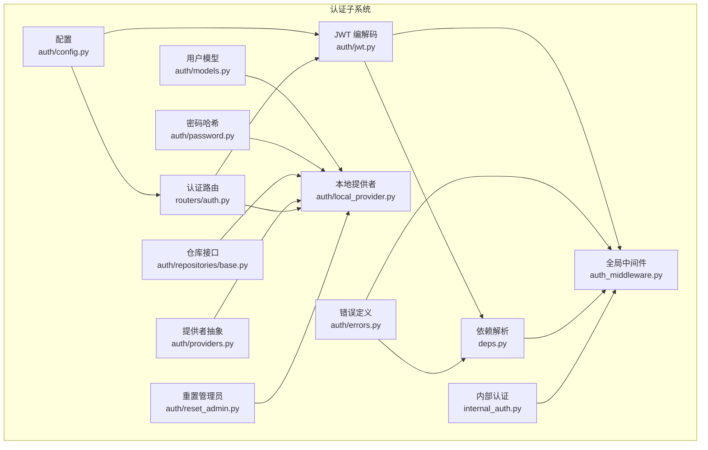
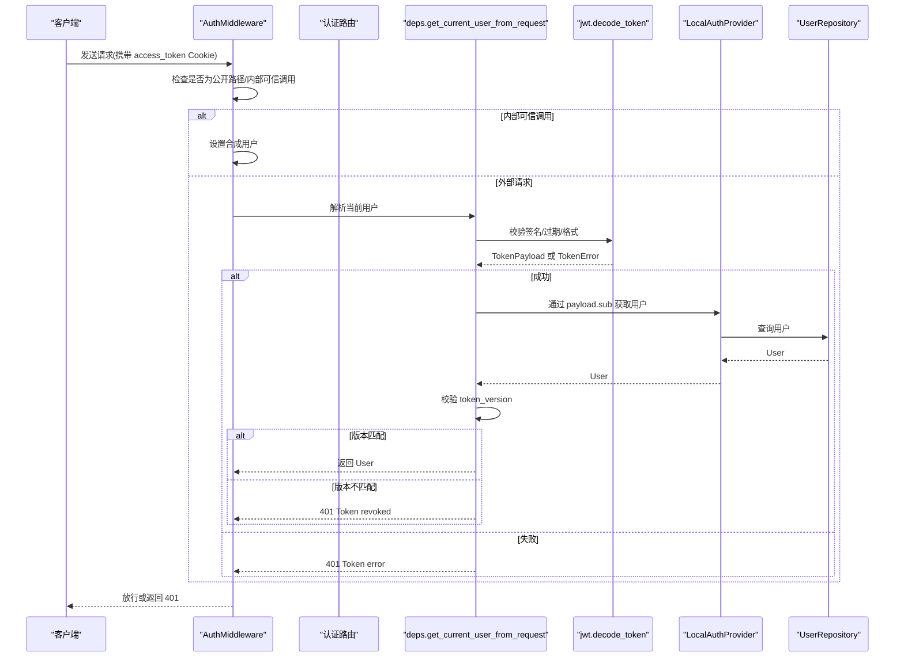
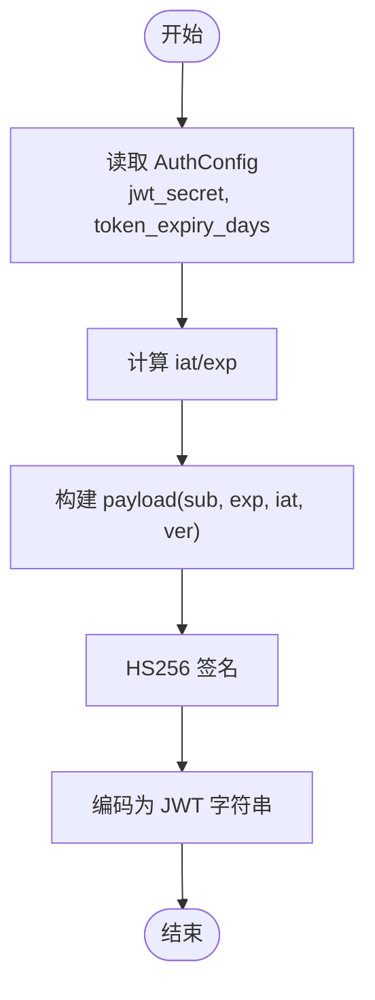
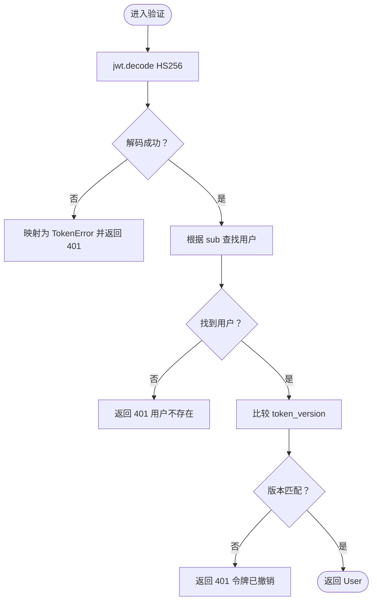
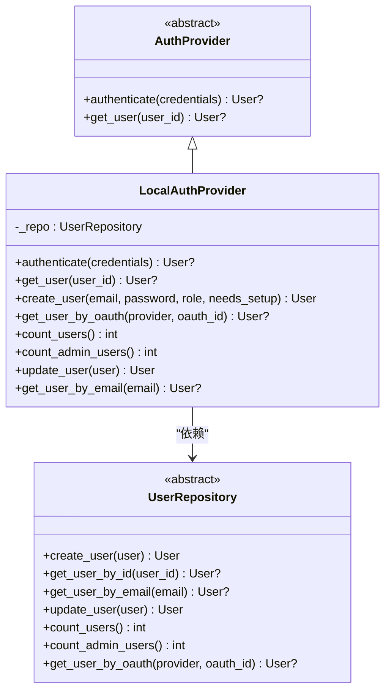
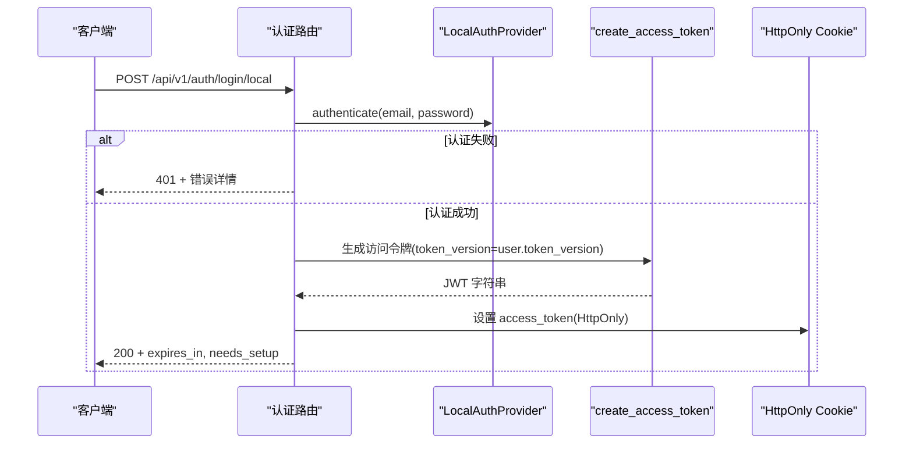
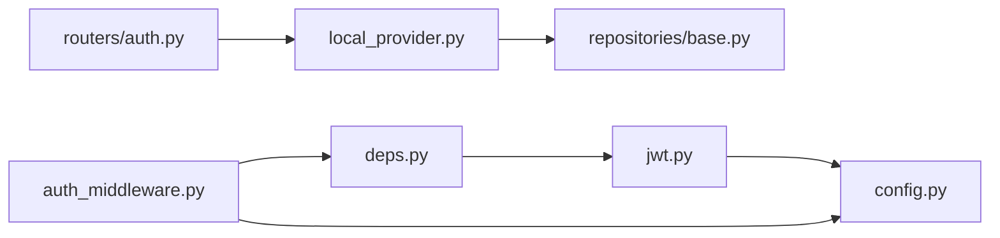

# JWT 认证机制

<cite>
**本文引用的文件**
- [jwt.py](file://backend/app/gateway/auth/jwt.py)
- [providers.py](file://backend/app/gateway/auth/providers.py)
- [local_provider.py](file://backend/app/gateway/auth/local_provider.py)
- [config.py](file://backend/app/gateway/auth/config.py)
- [models.py](file://backend/app/gateway/auth/models.py)
- [password.py](file://backend/app/gateway/auth/password.py)
- [base.py](file://backend/app/gateway/auth/repositories/base.py)
- [errors.py](file://backend/app/gateway/auth/errors.py)
- [auth_middleware.py](file://backend/app/gateway/auth_middleware.py)
- [auth.py](file://backend/app/gateway/routers/auth.py)
- [deps.py](file://backend/app/gateway/deps.py)
- [internal_auth.py](file://backend/app/gateway/internal_auth.py)
- [reset_admin.py](file://backend/app/gateway/auth/reset_admin.py)
</cite>

## 目录
1. [简介](#简介)
2. [项目结构](#项目结构)
3. [核心组件](#核心组件)
4. [架构总览](#架构总览)
5. [组件详解](#组件详解)
6. [依赖关系分析](#依赖关系分析)
7. [性能考量](#性能考量)
8. [故障排查指南](#故障排查指南)
9. [结论](#结论)
10. [附录](#附录)

## 简介
本文件系统性阐述 DeerFlow 的 JWT 认证机制，覆盖令牌生成、验证与失效处理、认证提供者设计（本地与外部集成）、配置项与安全参数、以及在中间件与路由中的传递与校验流程。重点解释 HS256 对称签名、过期时间管理、token_version 用于强制失效的策略，并给出令牌在请求生命周期内的流转图与错误映射。

## 项目结构
与 JWT 认证相关的核心模块分布于网关层的 auth 子系统，包含：
- 配置与密钥管理：auth/config.py
- 令牌编解码：auth/jwt.py
- 用户模型与密码哈希：auth/models.py、auth/password.py
- 认证提供者抽象与本地实现：auth/providers.py、auth/local_provider.py
- 仓库接口：auth/repositories/base.py
- 错误类型与映射：auth/errors.py
- 中间件与路由：auth_middleware.py、routers/auth.py
- 请求上下文解析：deps.py
- 内部可信调用：internal_auth.py
- 管理员重置工具：auth/reset_admin.py

图表来源
- [config.py:14-86](file://backend/app/gateway/auth/config.py#L14-L86)
- [jwt.py:21-56](file://backend/app/gateway/auth/jwt.py#L21-L56)
- [models.py:15-42](file://backend/app/gateway/auth/models.py#L15-L42)
- [password.py:32-82](file://backend/app/gateway/auth/password.py#L32-L82)
- [base.py:18-108](file://backend/app/gateway/auth/repositories/base.py#L18-L108)
- [providers.py:6-25](file://backend/app/gateway/auth/providers.py#L6-L25)
- [local_provider.py:13-105](file://backend/app/gateway/auth/local_provider.py#L13-L105)
- [errors.py:13-46](file://backend/app/gateway/auth/errors.py#L13-L46)
- [auth_middleware.py:53-160](file://backend/app/gateway/auth_middleware.py#L53-L160)
- [auth.py:276-529](file://backend/app/gateway/routers/auth.py#L276-L529)
- [deps.py:251-339](file://backend/app/gateway/deps.py#L251-L339)
- [internal_auth.py:15-38](file://backend/app/gateway/internal_auth.py#L15-L38)
- [reset_admin.py:27-92](file://backend/app/gateway/auth/reset_admin.py#L27-L92)

章节来源
- [config.py:14-86](file://backend/app/gateway/auth/config.py#L14-L86)
- [jwt.py:21-56](file://backend/app/gateway/auth/jwt.py#L21-L56)
- [models.py:15-42](file://backend/app/gateway/auth/models.py#L15-L42)
- [password.py:32-82](file://backend/app/gateway/auth/password.py#L32-L82)
- [base.py:18-108](file://backend/app/gateway/auth/repositories/base.py#L18-L108)
- [providers.py:6-25](file://backend/app/gateway/auth/providers.py#L6-L25)
- [local_provider.py:13-105](file://backend/app/gateway/auth/local_provider.py#L13-L105)
- [errors.py:13-46](file://backend/app/gateway/auth/errors.py#L13-L46)
- [auth_middleware.py:53-160](file://backend/app/gateway/auth_middleware.py#L53-L160)
- [auth.py:276-529](file://backend/app/gateway/routers/auth.py#L276-L529)
- [deps.py:251-339](file://backend/app/gateway/deps.py#L251-L339)
- [internal_auth.py:15-38](file://backend/app/gateway/internal_auth.py#L15-L38)
- [reset_admin.py:27-92](file://backend/app/gateway/auth/reset_admin.py#L27-L92)

## 核心组件
- 配置与密钥管理：加载或生成 JWT 密钥、设置过期天数等；支持从环境变量注入或自动持久化到工作目录。
- 令牌编解码：使用 HS256 对称签名生成访问令牌，解析并校验签名、过期与格式。
- 用户模型与密码：统一用户实体、token_version 用于强制失效；密码采用带版本的 bcrypt 哈希。
- 认证提供者：抽象 AuthProvider 接口，本地提供者实现邮箱/密码登录、用户查询与创建。
- 仓库接口：UserRepository 抽象存储操作，便于替换后端。
- 中间件与路由：全局中间件拦截非公开路径，严格校验会话与 JWT；路由负责登录、注册、登出、改密等业务。
- 依赖解析：集中获取 LocalAuthProvider、当前用户等；提供从 Cookie 解析用户的方法。
- 内部认证：可信内部调用通过固定头进行鉴权，绕过外部 JWT 流程。
- 错误体系：TokenError 映射到 AuthErrorCode，确保一致的错误语义。

章节来源
- [config.py:14-86](file://backend/app/gateway/auth/config.py#L14-L86)
- [jwt.py:21-56](file://backend/app/gateway/auth/jwt.py#L21-L56)
- [models.py:15-42](file://backend/app/gateway/auth/models.py#L15-L42)
- [password.py:32-82](file://backend/app/gateway/auth/password.py#L32-L82)
- [providers.py:6-25](file://backend/app/gateway/auth/providers.py#L6-L25)
- [local_provider.py:13-105](file://backend/app/gateway/auth/local_provider.py#L13-L105)
- [base.py:18-108](file://backend/app/gateway/auth/repositories/base.py#L18-L108)
- [auth_middleware.py:53-160](file://backend/app/gateway/auth_middleware.py#L53-L160)
- [auth.py:276-529](file://backend/app/gateway/routers/auth.py#L276-L529)
- [deps.py:251-339](file://backend/app/gateway/deps.py#L251-L339)
- [internal_auth.py:15-38](file://backend/app/gateway/internal_auth.py#L15-L38)
- [errors.py:13-46](file://backend/app/gateway/auth/errors.py#L13-L46)

## 架构总览
下图展示从请求进入网关到最终解析用户身份的关键交互，涵盖 Cookie 提取、JWT 解码、用户查找与 token_version 校验、以及内部可信调用路径。

图表来源
- [auth_middleware.py:76-160](file://backend/app/gateway/auth_middleware.py#L76-L160)
- [deps.py:273-317](file://backend/app/gateway/deps.py#L273-L317)
- [jwt.py:40-56](file://backend/app/gateway/auth/jwt.py#L40-L56)
- [local_provider.py:24-63](file://backend/app/gateway/auth/local_provider.py#L24-L63)
- [base.py:40-79](file://backend/app/gateway/auth/repositories/base.py#L40-L79)

## 组件详解

### 令牌结构与签名算法
- 结构要点
  - sub：用户标识（UUID 字符串）
  - exp：过期时间（UTC）
  - iat：签发时间（UTC，可选）
  - ver：token_version（整型），与用户记录保持一致，用于强制撤销旧令牌
- 签名算法
  - HS256 对称密钥签名
- 过期时间
  - 默认 7 天；可通过配置项调整
  - Cookie 的 max-age 与 HTTPS 环境相关

章节来源
- [jwt.py:12-19](file://backend/app/gateway/auth/jwt.py#L12-L19)
- [jwt.py:21-37](file://backend/app/gateway/auth/jwt.py#L21-L37)
- [models.py:30-33](file://backend/app/gateway/auth/models.py#L30-L33)
- [config.py:23-27](file://backend/app/gateway/auth/config.py#L23-L27)
- [auth.py:135-147](file://backend/app/gateway/routers/auth.py#L135-L147)

### 令牌生成流程
- 输入：用户 ID（字符串 UUID）、可选过期时长、用户 token_version
- 步骤
  - 读取配置（密钥、过期天数）
  - 计算签发与过期时间
  - 使用 HS256 生成 JWT 字符串
- 登录成功后，服务端通过 HttpOnly Cookie 返回 access_token

图表来源
- [jwt.py:21-37](file://backend/app/gateway/auth/jwt.py#L21-L37)
- [config.py:61-79](file://backend/app/gateway/auth/config.py#L61-L79)

章节来源
- [jwt.py:21-37](file://backend/app/gateway/auth/jwt.py#L21-L37)
- [config.py:61-79](file://backend/app/gateway/auth/config.py#L61-L79)

### 令牌验证与错误处理
- 解码与校验
  - 使用相同密钥与 HS256 算法尝试解码
  - 捕获过期、签名无效、格式错误等异常，映射为 TokenError
- 用户态校验
  - 从 payload.sub 查找用户
  - 比对用户 token_version 与 payload.ver，不一致则视为被撤销
- 中间件策略
  - 非公开路径必须具备有效 Cookie
  - 严格拒绝无效/过期/格式错误的令牌，返回 401

图表来源
- [jwt.py:40-56](file://backend/app/gateway/auth/jwt.py#L40-L56)
- [deps.py:273-317](file://backend/app/gateway/deps.py#L273-L317)
- [errors.py:26-46](file://backend/app/gateway/auth/errors.py#L26-L46)

章节来源
- [jwt.py:40-56](file://backend/app/gateway/auth/jwt.py#L40-L56)
- [deps.py:273-317](file://backend/app/gateway/deps.py#L273-L317)
- [errors.py:26-46](file://backend/app/gateway/auth/errors.py#L26-L46)

### 认证提供者设计模式
- 抽象层
  - AuthProvider 定义 authenticate 与 get_user 两个核心方法，屏蔽具体存储细节
- 本地提供者
  - 通过 UserRepository 实现邮箱/密码登录、用户创建、更新等
  - 登录时对密码进行校验与必要时的重新哈希
- 外部提供者
  - 当前代码未实现具体外部提供者类，但抽象接口已就绪，便于后续接入第三方（如 GitHub、Google）

图表来源
- [providers.py:6-25](file://backend/app/gateway/auth/providers.py#L6-L25)
- [local_provider.py:13-105](file://backend/app/gateway/auth/local_provider.py#L13-L105)
- [base.py:18-108](file://backend/app/gateway/auth/repositories/base.py#L18-L108)

章节来源
- [providers.py:6-25](file://backend/app/gateway/auth/providers.py#L6-L25)
- [local_provider.py:13-105](file://backend/app/gateway/auth/local_provider.py#L13-L105)
- [base.py:18-108](file://backend/app/gateway/auth/repositories/base.py#L18-L108)

### 密钥管理与配置
- 密钥来源优先级
  - 显式设置 AUTH_JWT_SECRET 环境变量
  - 若未设置，自动在工作目录生成并持久化 .jwt_secret 文件
- 过期天数
  - token_expiry_days，默认 7 天，范围 1~30
- 其他相关配置
  - OAuth GitHub 客户端凭据（预留）

章节来源
- [config.py:23-27](file://backend/app/gateway/auth/config.py#L23-L27)
- [config.py:61-79](file://backend/app/gateway/auth/config.py#L61-L79)

### 密码哈希与升级
- 哈希格式
  - v2：$dfv2$ + bcrypt(sha256(password) 的 base64 编码)
  - v1：$dfv1$ + bcrypt(password)
- 自动检测与升级
  - 验证时自动识别版本，v1 将在下次登录时透明升级为 v2
- 异步接口
  - 使用线程池避免阻塞事件循环

章节来源
- [password.py:32-82](file://backend/app/gateway/auth/password.py#L32-L82)

### 登录、注册与登出流程
- 登录
  - 校验速率限制
  - 本地提供者认证
  - 生成访问令牌并写入 HttpOnly Cookie
- 注册
  - 创建普通用户并写入 Cookie
- 登出
  - 清除 access_token 与 ads_token Cookie
- 修改密码
  - 更新密码并递增 token_version，重新签发 Cookie

图表来源
- [auth.py:276-303](file://backend/app/gateway/routers/auth.py#L276-L303)
- [local_provider.py:24-59](file://backend/app/gateway/auth/local_provider.py#L24-L59)
- [jwt.py:21-37](file://backend/app/gateway/auth/jwt.py#L21-L37)

章节来源
- [auth.py:276-303](file://backend/app/gateway/routers/auth.py#L276-L303)
- [auth.py:305-331](file://backend/app/gateway/routers/auth.py#L305-L331)
- [auth.py:326-331](file://backend/app/gateway/routers/auth.py#L326-L331)
- [auth.py:334-377](file://backend/app/gateway/routers/auth.py#L334-L377)
- [local_provider.py:24-59](file://backend/app/gateway/auth/local_provider.py#L24-L59)
- [jwt.py:21-37](file://backend/app/gateway/auth/jwt.py#L21-L37)

### 令牌失效与刷新机制
- 失效策略
  - 过期时间到期触发失效
  - 用户修改密码导致 token_version 递增，旧令牌被判定为撤销
- 刷新机制
  - 当前代码未实现 refresh_token 刷新流程；登录成功后仅返回新的 access_token 并写入 Cookie
  - 如需刷新能力，可在后续扩展中引入 refresh_token 与独立刷新端点

章节来源
- [models.py:30-33](file://backend/app/gateway/auth/models.py#L30-L33)
- [deps.py:309-314](file://backend/app/gateway/deps.py#L309-L314)
- [auth.py:276-303](file://backend/app/gateway/routers/auth.py#L276-L303)

### 中间件与请求上下文
- 全局中间件
  - 公开路径白名单
  - 严格校验 Cookie 与 JWT，拒绝无效令牌
  - 支持内部可信调用与外部 ADS 令牌兼容
- 请求上下文
  - 解析当前用户后，同时写入 request.state.user 与运行时用户上下文，供下游权限过滤使用

章节来源
- [auth_middleware.py:24-71](file://backend/app/gateway/auth_middleware.py#L24-L71)
- [auth_middleware.py:76-160](file://backend/app/gateway/auth_middleware.py#L76-L160)
- [deps.py:273-317](file://backend/app/gateway/deps.py#L273-L317)
- [internal_auth.py:15-38](file://backend/app/gateway/internal_auth.py#L15-L38)

### 管理员重置与安全参数
- 管理员重置
  - CLI 工具重置管理员密码，写入受保护的凭证文件，提升运维安全性
- 安全参数
  - Cookie 属性：HttpOnly、Secure（HTTPS）、SameSite=Lax
  - 速率限制：按客户端 IP 维度限制登录尝试次数
  - 可信代理：支持通过 AUTH_TRUSTED_PROXIES 信任特定代理转发的真实 IP

章节来源
- [reset_admin.py:27-92](file://backend/app/gateway/auth/reset_admin.py#L27-L92)
- [auth.py:135-147](file://backend/app/gateway/routers/auth.py#L135-L147)
- [auth.py:158-271](file://backend/app/gateway/routers/auth.py#L158-L271)
- [auth.py:165-224](file://backend/app/gateway/routers/auth.py#L165-L224)

## 依赖关系分析
- 松耦合设计
  - AuthProvider 抽象隔离了存储细节，LocalAuthProvider 仅依赖 UserRepository
  - deps 模块集中管理单例与请求级解析逻辑，避免路由直接依赖底层实现
- 关键依赖链
  - 路由 → LocalAuthProvider → UserRepository
  - 中间件/依赖 → jwt.decode_token → AuthProvider → UserRepository
  - 配置 → jwt.encode/decode → Cookie 设置

图表来源
- [auth.py:276-529](file://backend/app/gateway/routers/auth.py#L276-L529)
- [local_provider.py:13-105](file://backend/app/gateway/auth/local_provider.py#L13-L105)
- [base.py:18-108](file://backend/app/gateway/auth/repositories/base.py#L18-L108)
- [auth_middleware.py:53-160](file://backend/app/gateway/auth_middleware.py#L53-L160)
- [deps.py:251-339](file://backend/app/gateway/deps.py#L251-L339)
- [jwt.py:21-56](file://backend/app/gateway/auth/jwt.py#L21-L56)
- [config.py:61-79](file://backend/app/gateway/auth/config.py#L61-L79)

章节来源
- [auth.py:276-529](file://backend/app/gateway/routers/auth.py#L276-L529)
- [local_provider.py:13-105](file://backend/app/gateway/auth/local_provider.py#L13-L105)
- [base.py:18-108](file://backend/app/gateway/auth/repositories/base.py#L18-L108)
- [auth_middleware.py:53-160](file://backend/app/gateway/auth_middleware.py#L53-L160)
- [deps.py:251-339](file://backend/app/gateway/deps.py#L251-L339)
- [jwt.py:21-56](file://backend/app/gateway/auth/jwt.py#L21-L56)
- [config.py:61-79](file://backend/app/gateway/auth/config.py#L61-L79)

## 性能考量
- 密码哈希异步化：使用线程池执行 bcrypt，避免阻塞事件循环
- 令牌解析：HS256 解码为 O(n) 操作，开销极低；建议避免在高频路径重复解析
- 速率限制：内存级计数器，多进程部署需共享存储以保证全局限流
- Cookie 设置：仅在 HTTPS 下启用 Secure 属性，减少不必要的网络传输风险

## 故障排查指南
- 常见错误与定位
  - TokenExpired：检查 token_expiry_days 与系统时间
  - TokenInvalidSignature：确认 AUTH_JWT_SECRET 一致性与 .jwt_secret 持久化状态
  - Malformed：检查前端是否正确发送 Cookie 或请求体
  - UserNotFound：确认用户是否存在且未被删除
  - TokenRevoked：用户修改密码导致 token_version 不匹配，需重新登录
- 日志与告警
  - 配置加载与密钥生成存在警告日志，注意工作目录权限
  - 中间件对无效令牌直接返回 401，便于快速定位问题

章节来源
- [errors.py:13-46](file://backend/app/gateway/auth/errors.py#L13-L46)
- [config.py:72-78](file://backend/app/gateway/auth/config.py#L72-L78)
- [deps.py:294-314](file://backend/app/gateway/deps.py#L294-L314)
- [auth_middleware.py:118-126](file://backend/app/gateway/auth_middleware.py#L118-L126)

## 结论
DeerFlow 的 JWT 认证以 HS256 对称签名为核心，结合 token_version 与过期时间实现简洁可靠的会话管理。通过抽象化的认证提供者与集中依赖解析，系统在可扩展性与安全性之间取得平衡。未来可在现有基础上引入 refresh_token 刷新流程与更完善的 OAuth 集成，进一步增强用户体验与生产可用性。

## 附录
- 配置项示例（描述性说明）
  - AUTH_JWT_SECRET：JWT 签名密钥（推荐使用随机安全字符串）
  - AUTH_TOKEN_EXPIRY_DAYS：令牌有效期（1~30 天）
  - AUTH_TRUSTED_PROXIES：反向代理网段列表，用于提取真实客户端 IP
  - DEER_FLOW_INTERNAL_AUTH_TOKEN：内部可信调用令牌
- 最佳实践
  - 生产环境务必显式设置 AUTH_JWT_SECRET，避免自动生成带来的重启后密钥变更
  - 在多进程部署中，考虑将速率限制与会话状态迁移到共享存储
  - 启用 HTTPS 并合理设置 SameSite/Lax，降低 CSRF 风险