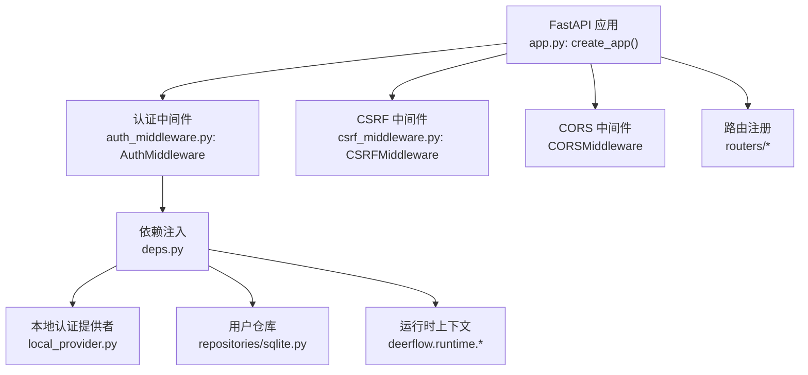
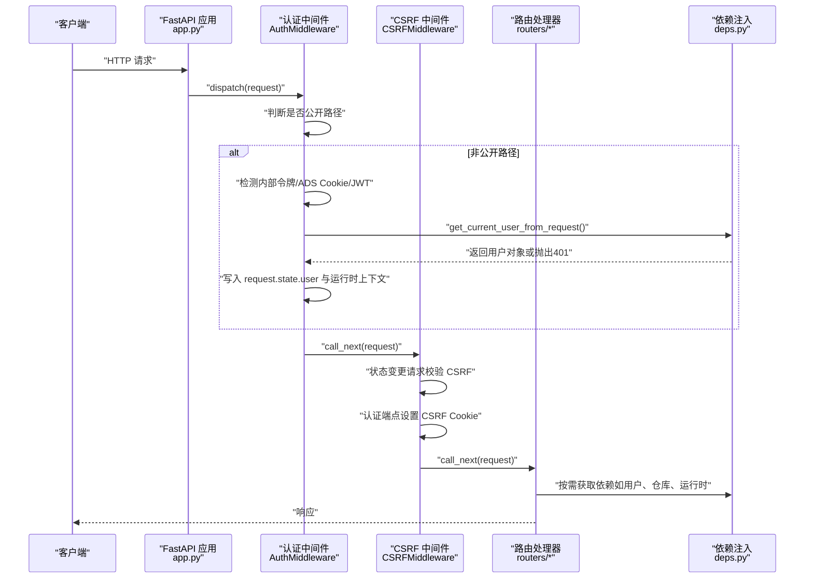
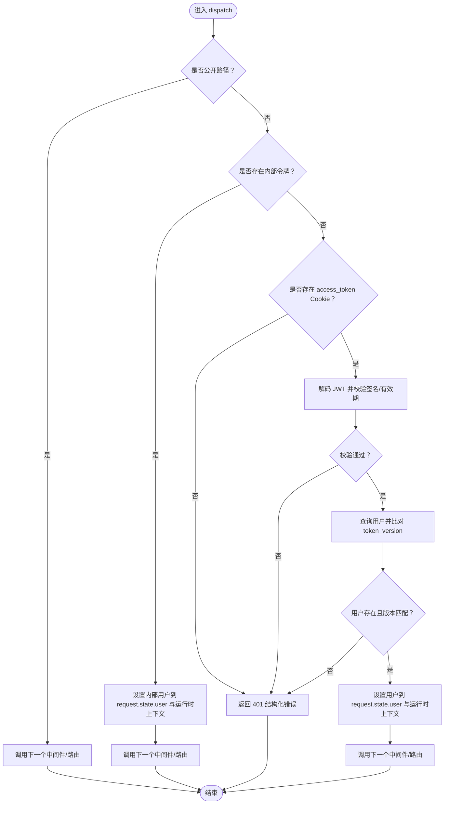
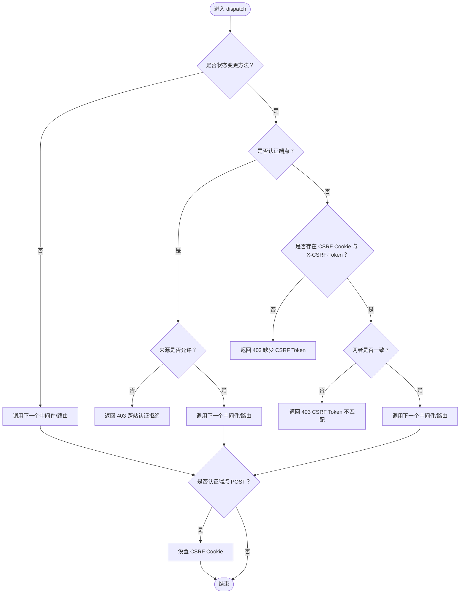
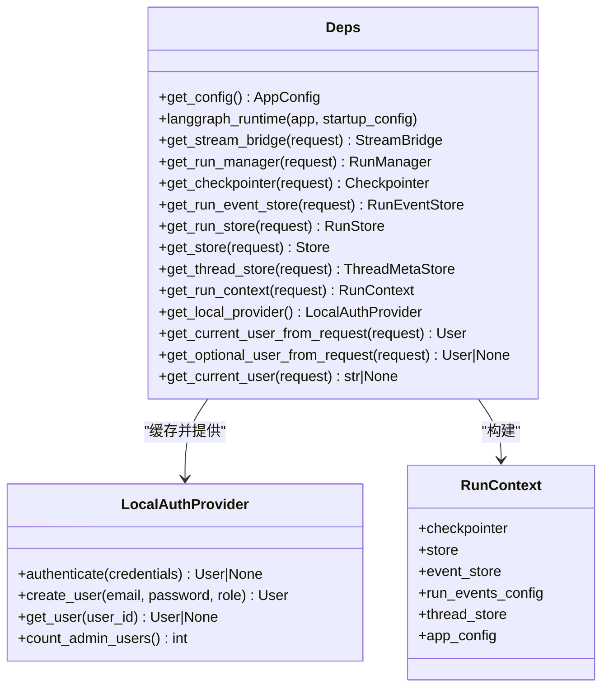
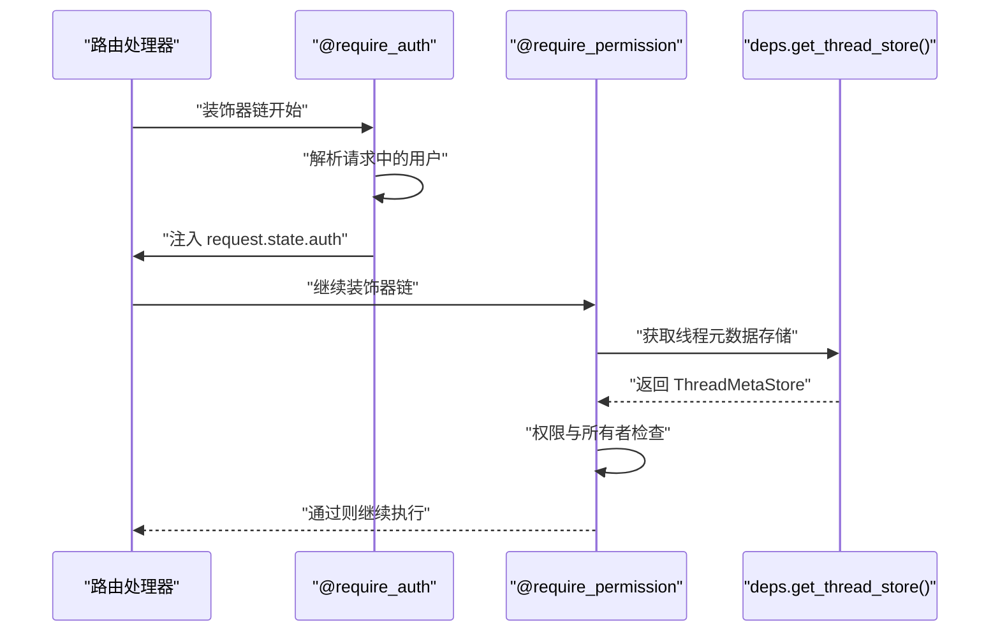
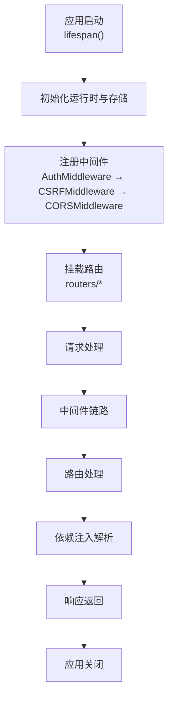
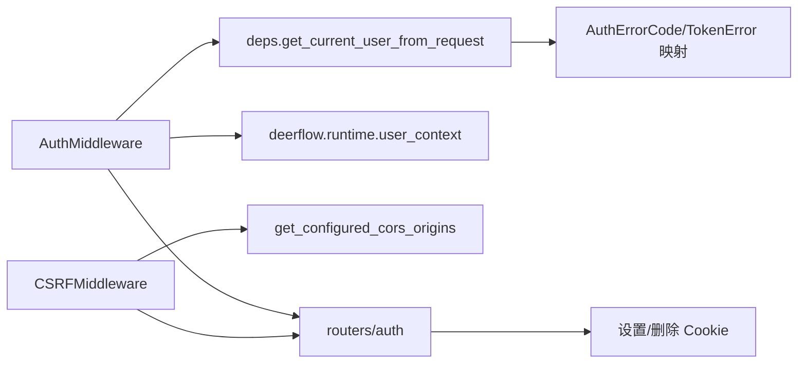

# 中间件集成机制

<cite>
**本文档引用的文件**
- [app.py](file://backend/app/gateway/app.py)
- [auth_middleware.py](file://backend/app/gateway/auth_middleware.py)
- [csrf_middleware.py](file://backend/app/gateway/csrf_middleware.py)
- [deps.py](file://backend/app/gateway/deps.py)
- [authz.py](file://backend/app/gateway/authz.py)
- [auth.py](file://backend/app/gateway/routers/auth.py)
- [errors.py](file://backend/app/gateway/auth/errors.py)
- [config.py](file://backend/app/gateway/auth/config.py)
- [internal_auth.py](file://backend/app/gateway/internal_auth.py)
</cite>

## 目录
1. [引言](#引言)
2. [项目结构](#项目结构)
3. [核心组件](#核心组件)
4. [架构总览](#架构总览)
5. [详细组件分析](#详细组件分析)
6. [依赖分析](#依赖分析)
7. [性能考虑](#性能考虑)
8. [故障排除指南](#故障排除指南)
9. [结论](#结论)

## 引言
本文件面向 DeerFlow 的认证授权中间件集成机制，系统性阐述以下内容：
- 认证中间件的执行流程：请求拦截、令牌解析与用户上下文注入
- CSRF 保护中间件的实现原理：令牌生成、验证与跨站请求防护
- 依赖注入系统设计：认证依赖的获取与传递机制
- 中间件配置与定制：中间件顺序、异常处理与性能优化
- 中间件与路由系统的集成方式及生命周期管理

## 项目结构
DeerFlow 后端采用 FastAPI 应用入口集中配置中间件与路由挂载。认证与 CSRF 中间件在应用创建阶段被添加到 ASGI 管道中，并通过依赖注入模块提供运行时服务。

图表来源
- [app.py:339-357](file://backend/app/gateway/app.py#L339-L357)
- [auth_middleware.py:53-160](file://backend/app/gateway/auth_middleware.py#L53-L160)
- [csrf_middleware.py:175-238](file://backend/app/gateway/csrf_middleware.py#L175-L238)

章节来源
- [app.py:229-418](file://backend/app/gateway/app.py#L229-L418)

## 核心组件
- 认证中间件（AuthMiddleware）：全局安全网关，对非公开路径进行严格认证检查；支持内部令牌与外部 JWT 两种认证源；成功后将用户对象写入请求状态与运行时上下文。
- CSRF 中间件（CSRFMiddleware）：基于双提交 Cookie 模式的跨站请求伪造防护；对状态变更类请求强制校验 CSRF 头部与 Cookie；在认证端点首次调用时设置 CSRF Cookie。
- 依赖注入模块（deps.py）：集中管理应用单例与请求级依赖，提供认证用户解析、运行时上下文构建等能力。
- 授权装饰器（authz.py）：提供 require_auth 与 require_permission 装饰器链，配合中间件实现细粒度权限控制。
- 认证路由（routers/auth.py）：登录、注册、登出、密码修改、初始化管理员等端点，负责会话 Cookie 设置与清理。

章节来源
- [auth_middleware.py:53-160](file://backend/app/gateway/auth_middleware.py#L53-L160)
- [csrf_middleware.py:175-238](file://backend/app/gateway/csrf_middleware.py#L175-L238)
- [deps.py:242-339](file://backend/app/gateway/deps.py#L242-L339)
- [authz.py:147-303](file://backend/app/gateway/authz.py#L147-L303)
- [auth.py:276-332](file://backend/app/gateway/routers/auth.py#L276-L332)

## 架构总览
下图展示从请求进入应用到路由处理的整体流程，重点标注认证与 CSRF 中间件的职责边界与协作关系。

图表来源
- [app.py:339-357](file://backend/app/gateway/app.py#L339-L357)
- [auth_middleware.py:76-160](file://backend/app/gateway/auth_middleware.py#L76-L160)
- [csrf_middleware.py:181-229](file://backend/app/gateway/csrf_middleware.py#L181-L229)
- [deps.py:273-317](file://backend/app/gateway/deps.py#L273-L317)

## 详细组件分析

### 认证中间件（AuthMiddleware）
- 公开路径豁免：健康检查与文档路径默认放行；部分认证端点（如登录、注册、初始化）也无需认证。
- 双重认证源：
  - 内部令牌：用于可信内部调用，快速解析为合成用户。
  - 外部 JWT：从 Cookie 提取 access_token，严格解码与校验，失败即返回 401。
- 用户上下文注入：成功后同时写入 request.state.user 与运行时上下文，供下游仓库层自动生效。
- 异常处理：捕获认证异常并以结构化错误体返回。

图表来源
- [auth_middleware.py:76-160](file://backend/app/gateway/auth_middleware.py#L76-L160)
- [deps.py:273-317](file://backend/app/gateway/deps.py#L273-L317)

章节来源
- [auth_middleware.py:24-51](file://backend/app/gateway/auth_middleware.py#L24-L51)
- [auth_middleware.py:116-159](file://backend/app/gateway/auth_middleware.py#L116-L159)
- [deps.py:273-317](file://backend/app/gateway/deps.py#L273-L317)

### CSRF 保护中间件（CSRFMiddleware）
- 触发条件：仅对状态变更方法（POST/PUT/DELETE/PATCH）进行校验；GET/HEAD/OPTIONS/TRACE 放行。
- 校验策略：
  - 认证端点首次调用（无 CSRF Cookie）：允许但需同源或显式允许的 CORS 来源。
  - 非认证端点：要求同时具备 CSRF Cookie 与 X-CSRF-Token 头，且二者必须一致。
- Cookie 设置：在认证端点 POST 成功后，生成新的 CSRF Token 并设置为可由前端读取的 Cookie（SameSite=strict）。

图表来源
- [csrf_middleware.py:181-229](file://backend/app/gateway/csrf_middleware.py#L181-L229)
- [auth.py:135-147](file://backend/app/gateway/routers/auth.py#L135-L147)

章节来源
- [csrf_middleware.py:32-64](file://backend/app/gateway/csrf_middleware.py#L32-L64)
- [csrf_middleware.py:154-173](file://backend/app/gateway/csrf_middleware.py#L154-L173)
- [auth.py:276-302](file://backend/app/gateway/routers/auth.py#L276-L302)

### 依赖注入系统（deps.py）
- 单例管理：通过 app.state 存储运行时基础设施（流桥、运行管理器、检查点、存储、事件存储等），确保请求间共享。
- 请求级依赖：提供 get_* 函数族，缺失时统一返回 503；get_config 始终通过全局配置加载器获取最新配置（热重载）。
- 认证辅助：get_local_provider 缓存本地认证提供者与仓库；get_current_user_from_request 统一解析 JWT 并校验用户有效性。
- 运行时上下文：get_run_context 将当前请求所需的运行时依赖组合为 RunContext，保证配置与存储的一致性。

图表来源
- [deps.py:96-181](file://backend/app/gateway/deps.py#L96-L181)
- [deps.py:209-240](file://backend/app/gateway/deps.py#L209-L240)
- [deps.py:251-270](file://backend/app/gateway/deps.py#L251-L270)
- [deps.py:273-317](file://backend/app/gateway/deps.py#L273-L317)

章节来源
- [deps.py:70-94](file://backend/app/gateway/deps.py#L70-L94)
- [deps.py:209-240](file://backend/app/gateway/deps.py#L209-L240)
- [deps.py:251-270](file://backend/app/gateway/deps.py#L251-L270)
- [deps.py:273-317](file://backend/app/gateway/deps.py#L273-L317)

### 授权装饰器（authz.py）
- require_auth：独立于中间件的二次认证保障，将 AuthContext 注入 request.state.auth；未认证时返回 401。
- require_permission：在 require_auth 之后使用，支持资源动作权限检查与所有者检查（owner_check），并结合线程元数据存储进行访问控制。

图表来源
- [authz.py:147-196](file://backend/app/gateway/authz.py#L147-L196)
- [authz.py:198-303](file://backend/app/gateway/authz.py#L198-L303)
- [deps.py:214-219](file://backend/app/gateway/deps.py#L214-L219)

章节来源
- [authz.py:147-196](file://backend/app/gateway/authz.py#L147-L196)
- [authz.py:198-303](file://backend/app/gateway/authz.py#L198-L303)

### 中间件与路由集成与生命周期
- 中间件注册：在应用创建时按顺序添加，认证中间件作为“失败关闭”的安全网关优先于 CSRF 中间件，确保所有后续处理均处于受控环境。
- CORS 配置：与 CSRF 的来源校验共享同一来源白名单，避免双重标准导致的安全漏洞。
- 生命周期：应用启动时初始化 LangGraph 运行时与持久化组件；关闭时有序释放资源，避免进程退出阻塞。

图表来源
- [app.py:169-227](file://backend/app/gateway/app.py#L169-L227)
- [app.py:339-357](file://backend/app/gateway/app.py#L339-L357)

章节来源
- [app.py:169-227](file://backend/app/gateway/app.py#L169-L227)
- [app.py:339-357](file://backend/app/gateway/app.py#L339-L357)

## 依赖分析
- 中间件耦合关系：
  - AuthMiddleware 依赖 deps.get_current_user_from_request 与 deerflow.runtime.user_context 进行用户解析与上下文注入。
  - CSRFMiddleware 依赖 deps.get_configured_cors_origins 与内部安全判定函数进行来源校验。
  - 两者均不直接依赖路由层，保持横切关注点的纯粹性。
- 路由与中间件交互：
  - 认证端点（如登录）在响应中设置会话 Cookie；CSRF 中间件随后在响应阶段设置 CSRF Cookie。
  - 非认证端点必须携带 CSRF Cookie 与头部，否则被拒绝。
- 错误类型与映射：
  - 认证错误码枚举化，便于前端统一处理；JWT 解析失败映射到具体错误码。

图表来源
- [auth_middleware.py:139-155](file://backend/app/gateway/auth_middleware.py#L139-L155)
- [csrf_middleware.py:110-113](file://backend/app/gateway/csrf_middleware.py#L110-L113)
- [auth.py:135-147](file://backend/app/gateway/routers/auth.py#L135-L147)
- [errors.py:13-46](file://backend/app/gateway/auth/errors.py#L13-L46)

章节来源
- [auth_middleware.py:139-155](file://backend/app/gateway/auth_middleware.py#L139-L155)
- [csrf_middleware.py:110-113](file://backend/app/gateway/csrf_middleware.py#L110-L113)
- [auth.py:135-147](file://backend/app/gateway/routers/auth.py#L135-L147)
- [errors.py:13-46](file://backend/app/gateway/auth/errors.py#L13-L46)

## 性能考虑
- 中间件顺序优化：认证中间件先于 CSRF 中间件，减少无效 CSRF 校验成本；对公开路径快速放行。
- 依赖缓存：deps.get_local_provider 使用全局缓存，避免重复实例化；get_config 通过配置加载器实现热重载，降低重启成本。
- CSRF 校验最小化：仅对状态变更方法与非认证端点校验，GET/HEAD/OPTIONS/TRACE 放行；认证端点首次调用允许无 CSRF Cookie，避免首次交互阻塞。
- 运行时上下文复用：RunContext 组合多个单例，减少重复查找与构造。

## 故障排除指南
- 认证失败（401）：
  - 检查 access_token Cookie 是否存在且未过期；确认 JWT 秘钥配置正确；核对用户 token_version 是否与当前一致。
- CSRF 失败（403）：
  - 确认请求方法为状态变更方法且非认证端点；检查 X-CSRF-Token 头与 CSRF Cookie 是否同时存在且一致；核对来源是否在 CORS 白名单内。
- 依赖缺失（503）：
  - 检查应用生命周期是否已完成运行时组件初始化；确认数据库连接与会话工厂可用。
- 结构化错误：
  - 使用 AuthErrorCode 与 AuthErrorResponse 统一错误格式，便于前端识别与提示。

章节来源
- [auth_middleware.py:116-159](file://backend/app/gateway/auth_middleware.py#L116-L159)
- [csrf_middleware.py:181-229](file://backend/app/gateway/csrf_middleware.py#L181-L229)
- [deps.py:188-199](file://backend/app/gateway/deps.py#L188-L199)
- [errors.py:13-46](file://backend/app/gateway/auth/errors.py#L13-L46)

## 结论
DeerFlow 的中间件集成机制通过“认证中间件 + CSRF 中间件 + 授权装饰器”的分层设计，实现了高安全性与良好可维护性的平衡。认证中间件负责全局安全网关与用户上下文注入，CSRF 中间件提供细粒度的跨站防护，依赖注入模块统一管理运行时与请求级依赖，路由层专注于业务逻辑。该体系支持灵活的中间件顺序调整、异常处理与性能优化，满足生产环境的复杂需求。