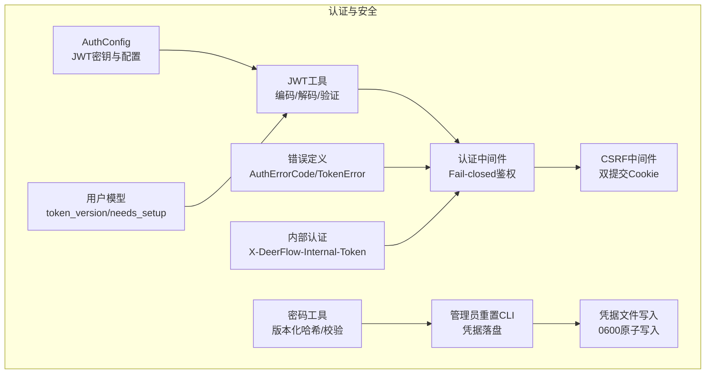
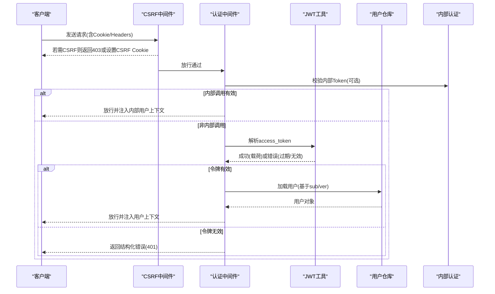
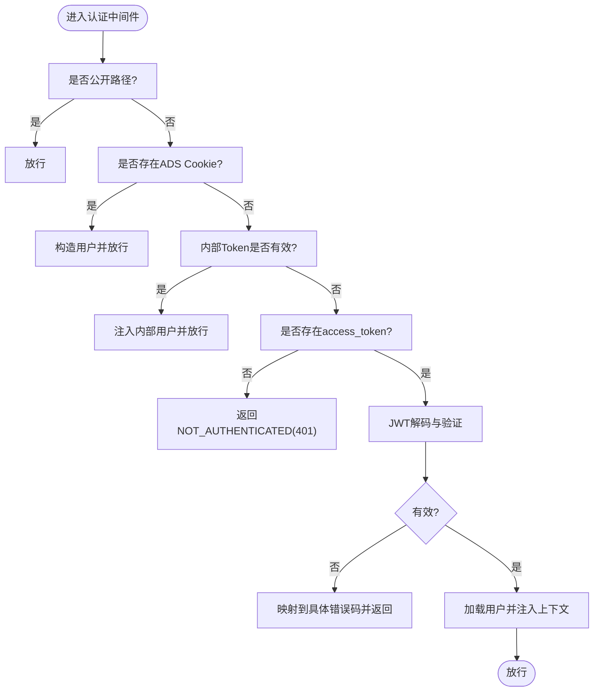
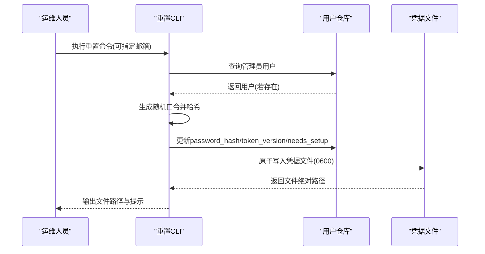
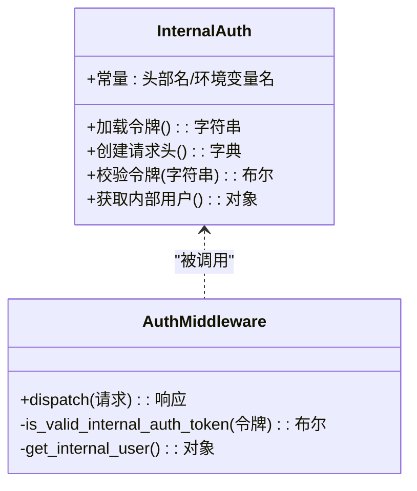
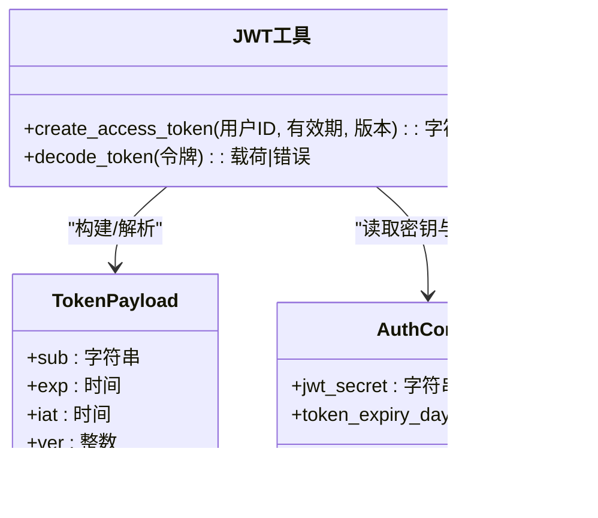
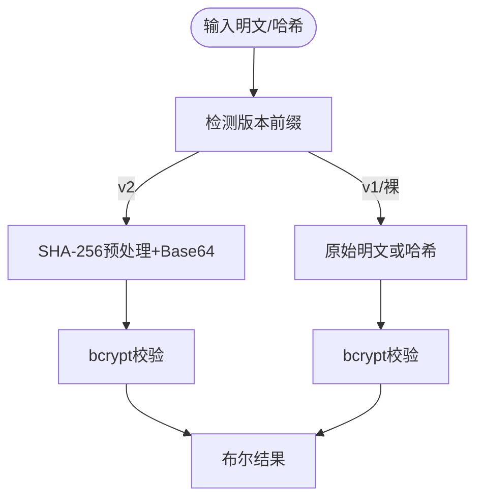
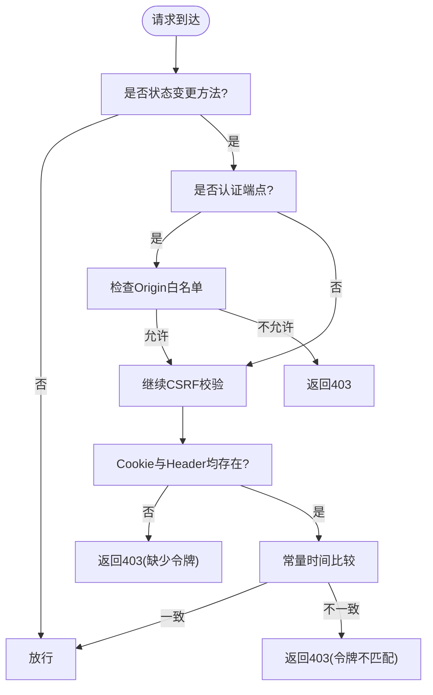
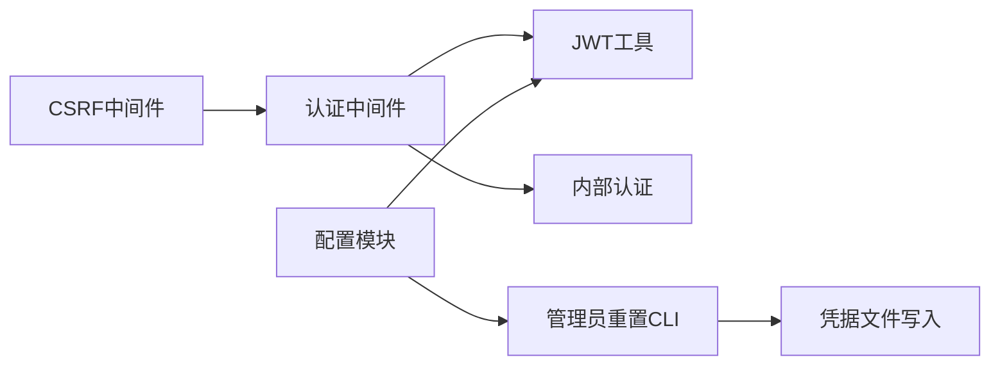

# 安全特性与最佳实践

<cite>
**本文引用的文件**
- [backend/app/gateway/auth/errors.py](file://backend/app/gateway/auth/errors.py)
- [backend/app/gateway/auth/jwt.py](file://backend/app/gateway/auth/jwt.py)
- [backend/app/gateway/auth/password.py](file://backend/app/gateway/auth/password.py)
- [backend/app/gateway/auth/reset_admin.py](file://backend/app/gateway/auth/reset_admin.py)
- [backend/app/gateway/auth/credential_file.py](file://backend/app/gateway/auth/credential_file.py)
- [backend/app/gateway/auth/config.py](file://backend/app/gateway/auth/config.py)
- [backend/app/gateway/auth/models.py](file://backend/app/gateway/auth/models.py)
- [backend/app/gateway/internal_auth.py](file://backend/app/gateway/internal_auth.py)
- [backend/app/gateway/auth_middleware.py](file://backend/app/gateway/auth_middleware.py)
- [backend/app/gateway/csrf_middleware.py](file://backend/app/gateway/csrf_middleware.py)
</cite>

## 目录
1. [引言](#引言)
2. [项目结构](#项目结构)
3. [核心组件](#核心组件)
4. [架构总览](#架构总览)
5. [详细组件分析](#详细组件分析)
6. [依赖关系分析](#依赖关系分析)
7. [性能考量](#性能考量)
8. [故障排查指南](#故障排查指南)
9. [结论](#结论)
10. [附录](#附录)

## 引言
本文件面向 DeerFlow 认证授权系统，聚焦安全特性与最佳实践，覆盖以下主题：
- 安全错误处理机制：认证失败、权限不足、令牌无效的分类与处理策略
- 管理员重置功能：安全令牌生成、有效期控制与审计日志建议
- 内部认证机制：服务间认证与信任边界管理
- 安全配置最佳实践：HTTPS 强制、安全头设置、敏感信息保护
- 常见安全威胁防护与应急响应流程

## 项目结构
认证与安全相关代码主要集中在后端网关模块中，采用“按职责分层”的组织方式：
- 配置与密钥管理：AuthConfig、JWT 密钥持久化与加载
- 身份与令牌：JWT 编解码、载荷结构、错误映射
- 凭据与密码：版本化哈希、异步校验、迁移兼容
- 中间件：全局认证中间件、CSRF 保护、内部服务认证
- 管理员重置：CLI 工具、原子写入凭据文件、一次性使用场景

图表来源
- [backend/app/gateway/auth/config.py:14-86](file://backend/app/gateway/auth/config.py#L14-L86)
- [backend/app/gateway/auth/jwt.py:12-56](file://backend/app/gateway/auth/jwt.py#L12-L56)
- [backend/app/gateway/auth/password.py:16-82](file://backend/app/gateway/auth/password.py#L16-L82)
- [backend/app/gateway/auth/errors.py:13-46](file://backend/app/gateway/auth/errors.py#L13-L46)
- [backend/app/gateway/auth/models.py:15-42](file://backend/app/gateway/auth/models.py#L15-L42)
- [backend/app/gateway/internal_auth.py:15-38](file://backend/app/gateway/internal_auth.py#L15-L38)
- [backend/app/gateway/auth_middleware.py:53-160](file://backend/app/gateway/auth_middleware.py#L53-L160)
- [backend/app/gateway/csrf_middleware.py:175-238](file://backend/app/gateway/csrf_middleware.py#L175-L238)
- [backend/app/gateway/auth/reset_admin.py:27-92](file://backend/app/gateway/auth/reset_admin.py#L27-L92)
- [backend/app/gateway/auth/credential_file.py:21-49](file://backend/app/gateway/auth/credential_file.py#L21-L49)

章节来源
- [backend/app/gateway/auth/config.py:14-86](file://backend/app/gateway/auth/config.py#L14-L86)
- [backend/app/gateway/auth/jwt.py:12-56](file://backend/app/gateway/auth/jwt.py#L12-L56)
- [backend/app/gateway/auth/password.py:16-82](file://backend/app/gateway/auth/password.py#L16-L82)
- [backend/app/gateway/auth/errors.py:13-46](file://backend/app/gateway/auth/errors.py#L13-L46)
- [backend/app/gateway/auth/models.py:15-42](file://backend/app/gateway/auth/models.py#L15-L42)
- [backend/app/gateway/internal_auth.py:15-38](file://backend/app/gateway/internal_auth.py#L15-L38)
- [backend/app/gateway/auth_middleware.py:53-160](file://backend/app/gateway/auth_middleware.py#L53-L160)
- [backend/app/gateway/csrf_middleware.py:175-238](file://backend/app/gateway/csrf_middleware.py#L175-L238)
- [backend/app/gateway/auth/reset_admin.py:27-92](file://backend/app/gateway/auth/reset_admin.py#L27-L92)
- [backend/app/gateway/auth/credential_file.py:21-49](file://backend/app/gateway/auth/credential_file.py#L21-L49)

## 核心组件
- 错误与响应模型：统一的错误枚举与结构化响应，便于前端与监控系统识别与告警
- JWT 令牌：标准化载荷、签名算法、过期时间与版本号控制
- 密码与哈希：版本化前缀、SHA-256 预处理规避 bcrypt 截断限制、异步非阻塞接口
- 全局认证中间件：fail-closed 策略、公开路径豁免、严格令牌校验
- CSRF 中间件：双提交 Cookie 模式、Origin 白名单、HTTPS 场景下的安全属性
- 内部认证：受信服务间认证、常量时间比较、合成用户上下文
- 管理员重置：随机强口令生成、原子写入受限文件、一次性使用与后续引导

章节来源
- [backend/app/gateway/auth/errors.py:13-46](file://backend/app/gateway/auth/errors.py#L13-L46)
- [backend/app/gateway/auth/jwt.py:12-56](file://backend/app/gateway/auth/jwt.py#L12-L56)
- [backend/app/gateway/auth/password.py:16-82](file://backend/app/gateway/auth/password.py#L16-L82)
- [backend/app/gateway/auth_middleware.py:53-160](file://backend/app/gateway/auth_middleware.py#L53-L160)
- [backend/app/gateway/csrf_middleware.py:175-238](file://backend/app/gateway/csrf_middleware.py#L175-L238)
- [backend/app/gateway/internal_auth.py:15-38](file://backend/app/gateway/internal_auth.py#L15-L38)
- [backend/app/gateway/auth/reset_admin.py:27-92](file://backend/app/gateway/auth/reset_admin.py#L27-L92)
- [backend/app/gateway/auth/credential_file.py:21-49](file://backend/app/gateway/auth/credential_file.py#L21-L49)

## 架构总览
下图展示认证与安全在请求生命周期中的交互：

图表来源
- [backend/app/gateway/csrf_middleware.py:175-238](file://backend/app/gateway/csrf_middleware.py#L175-L238)
- [backend/app/gateway/auth_middleware.py:53-160](file://backend/app/gateway/auth_middleware.py#L53-L160)
- [backend/app/gateway/internal_auth.py:15-38](file://backend/app/gateway/internal_auth.py#L15-L38)
- [backend/app/gateway/auth/jwt.py:40-56](file://backend/app/gateway/auth/jwt.py#L40-L56)

## 详细组件分析

### 安全错误处理机制
- 错误分类
  - 认证失败：用户名/密码错误、用户不存在、系统已初始化等
  - 令牌问题：过期、签名无效、格式错误
  - 权限不足：由授权装饰器负责，认证中间件在此阶段不做资源级授权判断
- 处理策略
  - 统一结构化响应体，包含错误码与消息，便于前端与监控系统解析
  - 严格区分令牌错误类型，并映射到统一错误码，避免信息泄露
  - fail-closed：未通过认证的请求一律拒绝，不进行降级或模糊处理

图表来源
- [backend/app/gateway/auth_middleware.py:53-160](file://backend/app/gateway/auth_middleware.py#L53-L160)
- [backend/app/gateway/auth/errors.py:13-46](file://backend/app/gateway/auth/errors.py#L13-L46)
- [backend/app/gateway/auth/jwt.py:40-56](file://backend/app/gateway/auth/jwt.py#L40-L56)

章节来源
- [backend/app/gateway/auth/errors.py:13-46](file://backend/app/gateway/auth/errors.py#L13-L46)
- [backend/app/gateway/auth_middleware.py:53-160](file://backend/app/gateway/auth_middleware.py#L53-L160)
- [backend/app/gateway/auth/jwt.py:40-56](file://backend/app/gateway/auth/jwt.py#L40-L56)

### 管理员重置功能（安全实现）
- 安全令牌生成：使用安全随机源生成强口令，避免弱口令与可预测性
- 有效期控制：重置后 token_version 自增，旧令牌立即失效；同时标记 needs_setup，强制首次登录完成账户设置
- 审计日志记录：建议在生产环境对管理员重置事件进行审计日志记录（例如写入专用审计表），包含操作者、目标用户、时间戳与结果
- 凭据落盘：以原子方式写入受限文件（0600），避免日志与进程输出泄露明文口令；CLI 输出仅记录文件路径而非口令内容

图表来源
- [backend/app/gateway/auth/reset_admin.py:27-92](file://backend/app/gateway/auth/reset_admin.py#L27-L92)
- [backend/app/gateway/auth/credential_file.py:21-49](file://backend/app/gateway/auth/credential_file.py#L21-L49)
- [backend/app/gateway/auth/password.py:32-35](file://backend/app/gateway/auth/password.py#L32-L35)

章节来源
- [backend/app/gateway/auth/reset_admin.py:27-92](file://backend/app/gateway/auth/reset_admin.py#L27-L92)
- [backend/app/gateway/auth/credential_file.py:21-49](file://backend/app/gateway/auth/credential_file.py#L21-L49)
- [backend/app/gateway/auth/password.py:32-35](file://backend/app/gateway/auth/password.py#L32-L35)

### 内部认证机制（服务间认证与信任边界）
- 受信边界：仅允许来自同一运行实例且携带正确内部令牌的调用通过
- 令牌管理：优先从环境变量加载，否则生成随机令牌；比较采用常量时间算法，降低侧信道风险
- 合成用户：为内部调用注入固定标识的“内部用户”，确保下游逻辑可识别并应用相应策略
- 使用场景：跨服务调用时附加特定头部，认证中间件识别后直接放行并注入上下文

图表来源
- [backend/app/gateway/internal_auth.py:15-38](file://backend/app/gateway/internal_auth.py#L15-L38)
- [backend/app/gateway/auth_middleware.py:112-115](file://backend/app/gateway/auth_middleware.py#L112-L115)

章节来源
- [backend/app/gateway/internal_auth.py:15-38](file://backend/app/gateway/internal_auth.py#L15-L38)
- [backend/app/gateway/auth_middleware.py:112-115](file://backend/app/gateway/auth_middleware.py#L112-L115)

### JWT 设计与实现要点
- 载荷结构：包含 sub、exp、iat、ver；ver 与用户 token_version 协同实现令牌撤销
- 签名与算法：HS256，密钥由配置提供；默认过期天数可配置
- 解码与错误映射：区分过期、签名无效、格式错误，映射到统一错误码

图表来源
- [backend/app/gateway/auth/jwt.py:12-56](file://backend/app/gateway/auth/jwt.py#L12-L56)
- [backend/app/gateway/auth/config.py:14-86](file://backend/app/gateway/auth/config.py#L14-L86)

章节来源
- [backend/app/gateway/auth/jwt.py:12-56](file://backend/app/gateway/auth/jwt.py#L12-L56)
- [backend/app/gateway/auth/config.py:14-86](file://backend/app/gateway/auth/config.py#L14-L86)

### 密码与哈希（版本化与异步）
- 版本化前缀：v1（遗留）与 v2（当前，SHA-256 预处理 + bcrypt）
- 自动兼容：校验时自动检测版本，透明迁移
- 异步接口：将阻塞的 bcrypt 操作放入线程池，避免事件循环阻塞
- 安全收益：规避 bcrypt 72 字节截断限制，提升长口令安全性

图表来源
- [backend/app/gateway/auth/password.py:27-82](file://backend/app/gateway/auth/password.py#L27-L82)

章节来源
- [backend/app/gateway/auth/password.py:27-82](file://backend/app/gateway/auth/password.py#L27-L82)

### CSRF 保护（双提交 Cookie）
- 双提交模式：Cookie + Header 的一致性校验，防跨站请求伪造
- Origin 白名单：仅允许显式配置的浏览器来源或同源请求访问认证端点
- 安全属性：在 HTTPS 场景下设置 Secure 属性，SameSite 严格策略
- 特例豁免：首次认证请求（无 CSRF 令牌）仍受 Origin 限制，防止会话固定

图表来源
- [backend/app/gateway/csrf_middleware.py:175-238](file://backend/app/gateway/csrf_middleware.py#L175-L238)

章节来源
- [backend/app/gateway/csrf_middleware.py:175-238](file://backend/app/gateway/csrf_middleware.py#L175-L238)

## 依赖关系分析
- 认证中间件依赖 JWT 工具与内部认证模块，用于严格令牌校验与内部调用放行
- CSRF 中间件独立于认证链路，但与认证端点存在交集，共同构成“双重门禁”
- 管理员重置 CLI 依赖凭据文件写入模块，确保凭据落盘安全
- 配置模块集中管理 JWT 密钥与过期策略，影响所有令牌行为

图表来源
- [backend/app/gateway/auth_middleware.py:53-160](file://backend/app/gateway/auth_middleware.py#L53-L160)
- [backend/app/gateway/csrf_middleware.py:175-238](file://backend/app/gateway/csrf_middleware.py#L175-L238)
- [backend/app/gateway/auth/reset_admin.py:27-92](file://backend/app/gateway/auth/reset_admin.py#L27-L92)
- [backend/app/gateway/auth/credential_file.py:21-49](file://backend/app/gateway/auth/credential_file.py#L21-L49)
- [backend/app/gateway/auth/config.py:61-86](file://backend/app/gateway/auth/config.py#L61-L86)

章节来源
- [backend/app/gateway/auth_middleware.py:53-160](file://backend/app/gateway/auth_middleware.py#L53-L160)
- [backend/app/gateway/csrf_middleware.py:175-238](file://backend/app/gateway/csrf_middleware.py#L175-L238)
- [backend/app/gateway/auth/reset_admin.py:27-92](file://backend/app/gateway/auth/reset_admin.py#L27-L92)
- [backend/app/gateway/auth/credential_file.py:21-49](file://backend/app/gateway/auth/credential_file.py#L21-L49)
- [backend/app/gateway/auth/config.py:61-86](file://backend/app/gateway/auth/config.py#L61-L86)

## 性能考量
- 密码处理异步化：通过线程池避免阻塞事件循环，适合高并发场景
- 常量时间比较：内部令牌比较采用常量时间算法，降低侧信道攻击面
- 中间件短路：公开路径与内部调用快速放行，减少不必要的解码与查询
- CSRF 令牌生成：使用安全随机源，长度适中以平衡安全与网络开销

## 故障排查指南
- 401 未认证
  - 检查 access_token 是否存在且未过期
  - 确认 JWT 密钥与算法配置一致
  - 排查内部令牌是否正确传递
- 401 令牌无效/过期
  - 核对 token_version 与用户记录是否一致
  - 检查系统时间与时区配置
- 403 CSRF 失败
  - 确认 Cookie 与 Header 的双提交令牌一致
  - 检查 Origin 是否在白名单内或为同源
  - 确保 HTTPS 下 Cookie 设置了 Secure 属性
- 管理员重置后无法登录
  - 查看凭据文件是否成功写入且权限为 0600
  - 确认 needs_setup 标记导致的首次登录流程
  - 核对 token_version 是否已递增

章节来源
- [backend/app/gateway/auth_middleware.py:116-147](file://backend/app/gateway/auth_middleware.py#L116-L147)
- [backend/app/gateway/csrf_middleware.py:197-211](file://backend/app/gateway/csrf_middleware.py#L197-L211)
- [backend/app/gateway/auth/reset_admin.py:66-76](file://backend/app/gateway/auth/reset_admin.py#L66-L76)
- [backend/app/gateway/auth/credential_file.py:41-48](file://backend/app/gateway/auth/credential_file.py#L41-L48)

## 结论
DeerFlow 的认证授权系统通过“fail-closed”中间件、严格的令牌校验、版本化密码与 CSRF 双提交保护，构建了稳健的安全基线。管理员重置流程强调最小暴露面与原子落盘，内部认证提供受控的服务间信任边界。结合 HTTPS 强制与安全头配置，可在生产环境中进一步强化整体安全态势。

## 附录

### 安全配置最佳实践清单
- 强制 HTTPS
  - 反向代理或网关层启用 TLS；确保所有认证与敏感接口仅通过 HTTPS 访问
- 安全头设置
  - HSTS、X-Frame-Options、X-Content-Type-Options、Referrer-Policy、Permissions-Policy 等
  - CSRF Cookie 在 HTTPS 下设置 Secure 属性
- 敏感信息保护
  - JWT 密钥通过环境变量注入，避免硬编码；定期轮换
  - 日志与监控中避免输出明文口令或密钥
- 审计与告警
  - 记录管理员重置、登录失败、令牌异常等关键事件
  - 配置阈值告警与自动化处置流程

### 常见威胁与防护
- 令牌泄露与重放
  - 短有效期 + token_version 撤销；严格 SameSite/Secure 属性
- 跨站请求伪造
  - 双提交 Cookie + Origin 白名单；豁免路径最小化
- 会话固定
  - 首次认证请求限制 Origin；登录后重新发放会话与 CSRF 令牌
- 弱口令与暴力破解
  - 版本化哈希与 SHA-256 预处理；速率限制与账户锁定策略