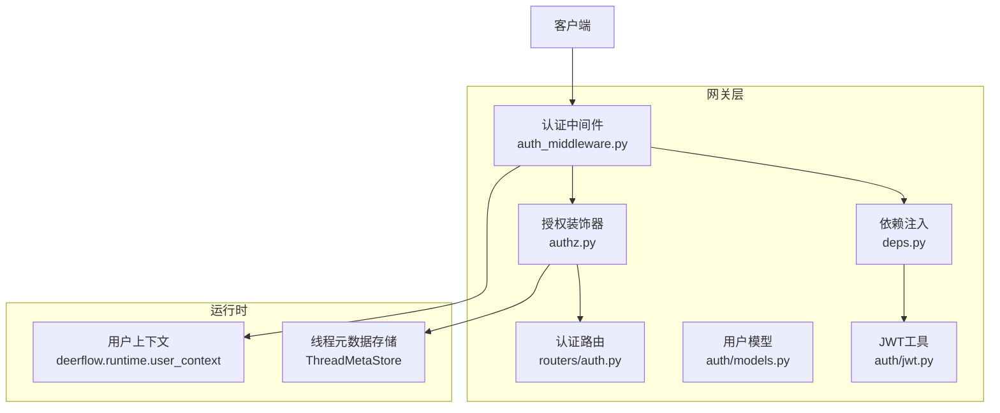
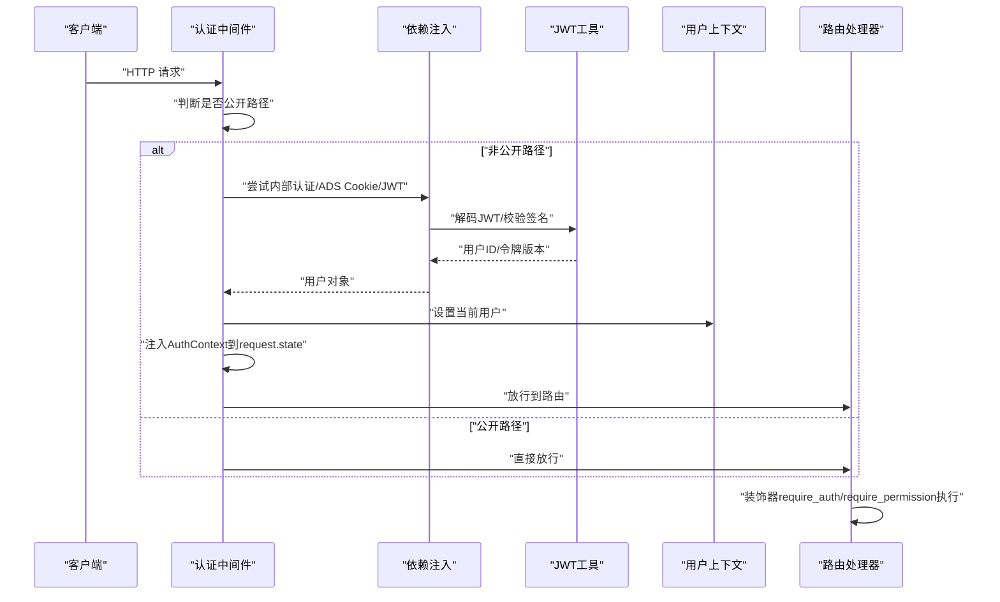
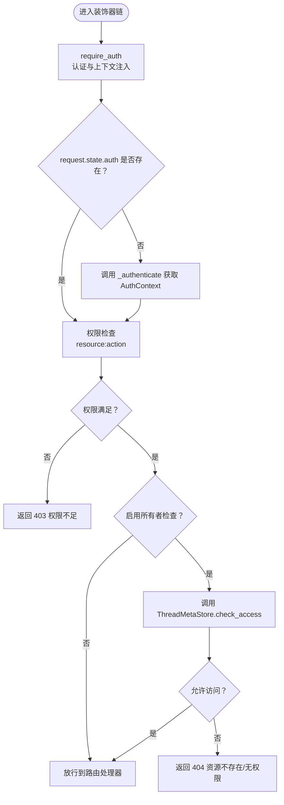
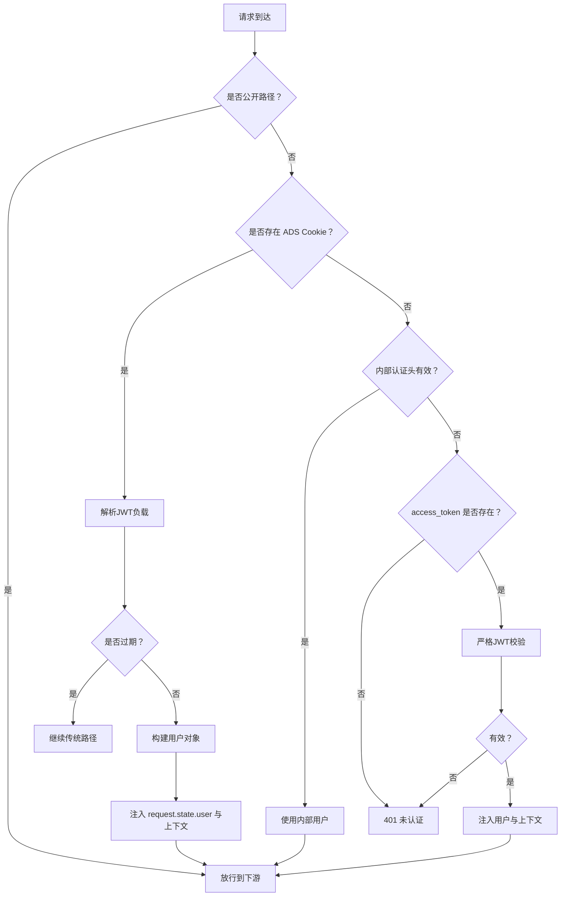
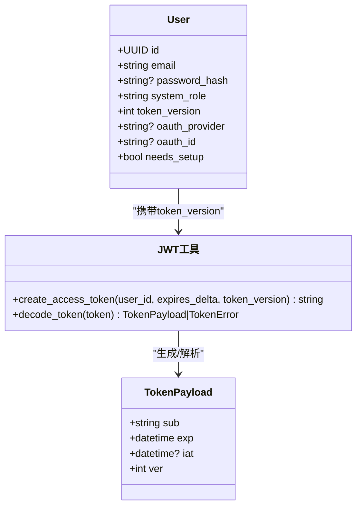
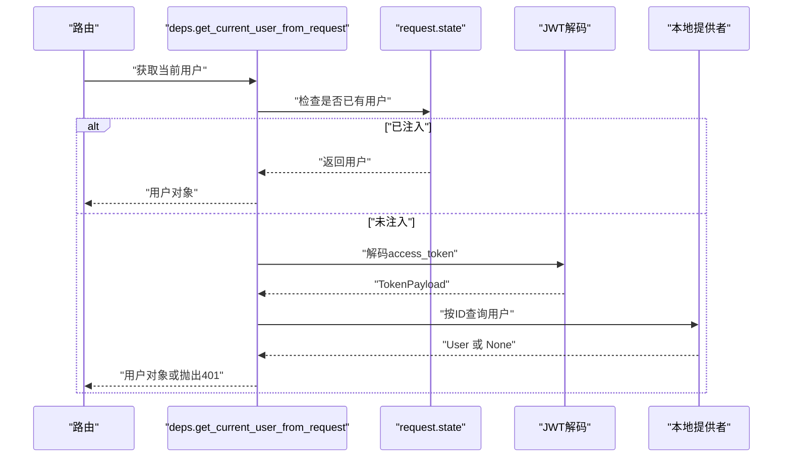
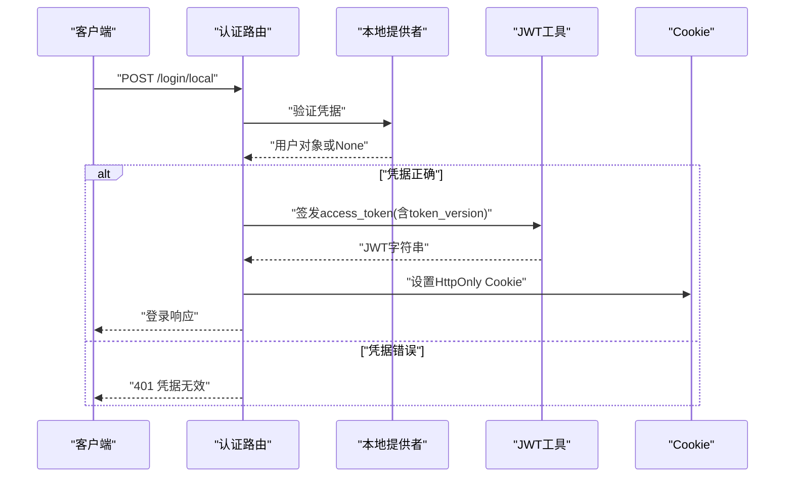
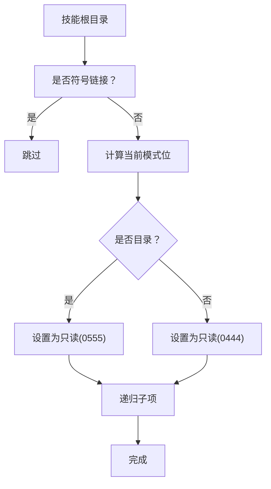
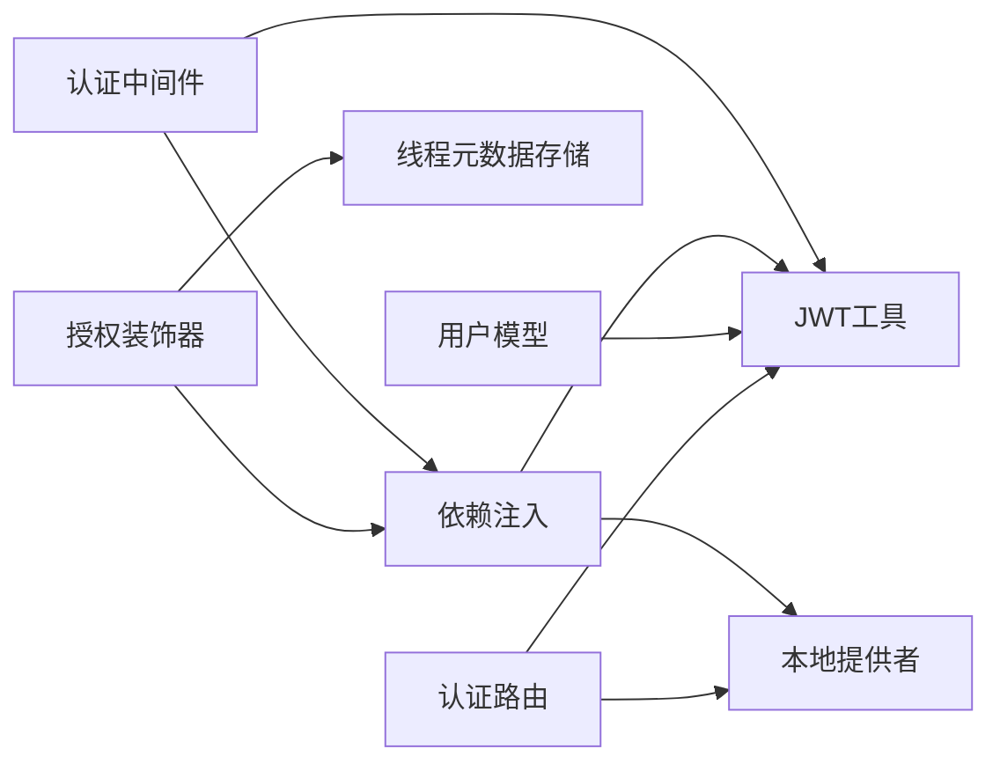

# 权限控制系统

<cite>
**本文档引用的文件**
- [authz.py](file://backend/app/gateway/authz.py)
- [auth_middleware.py](file://backend/app/gateway/auth_middleware.py)
- [models.py](file://backend/app/gateway/auth/models.py)
- [deps.py](file://backend/app/gateway/deps.py)
- [jwt.py](file://backend/app/gateway/auth/jwt.py)
- [auth.py](file://backend/app/gateway/routers/auth.py)
- [permissions.py](file://backend/packages/harness/deerflow/skills/permissions.py)
</cite>

## 目录
1. [简介](#简介)
2. [项目结构](#项目结构)
3. [核心组件](#核心组件)
4. [架构总览](#架构总览)
5. [详细组件分析](#详细组件分析)
6. [依赖关系分析](#依赖关系分析)
7. [性能考虑](#性能考虑)
8. [故障排除指南](#故障排除指南)
9. [结论](#结论)

## 简介
本文件为 DeerFlow 权限控制系统的技术文档，聚焦于基于角色的访问控制（RBAC）实现与权限验证流程。系统采用“认证中间件 + 路由装饰器”的双层安全防护：全局认证中间件负责强制认证与用户上下文注入，路由装饰器负责细粒度的资源与操作权限校验，并支持所有者检查与线程级访问控制。同时，系统通过 JWT 实现会话管理，结合令牌版本号实现密码变更后的会话失效；并通过依赖注入与运行时上下文确保仓库层的资源隔离。

## 项目结构
权限控制相关代码主要分布在后端网关模块中，核心文件如下：
- 认证与授权装饰器：backend/app/gateway/authz.py
- 全局认证中间件：backend/app/gateway/auth_middleware.py
- 用户模型：backend/app/gateway/auth/models.py
- 依赖注入与用户解析：backend/app/gateway/deps.py
- JWT 工具：backend/app/gateway/auth/jwt.py
- 认证路由：backend/app/gateway/routers/auth.py
- 技能树文件系统权限辅助：backend/packages/harness/deerflow/skills/permissions.py

图表来源
- [auth_middleware.py:53-160](file://backend/app/gateway/auth_middleware.py#L53-L160)
- [authz.py:147-303](file://backend/app/gateway/authz.py#L147-L303)
- [deps.py:273-339](file://backend/app/gateway/deps.py#L273-L339)
- [jwt.py:21-56](file://backend/app/gateway/auth/jwt.py#L21-L56)
- [models.py:15-42](file://backend/app/gateway/auth/models.py#L15-L42)
- [auth.py:276-332](file://backend/app/gateway/routers/auth.py#L276-L332)

章节来源
- [auth_middleware.py:1-160](file://backend/app/gateway/auth_middleware.py#L1-L160)
- [authz.py:1-303](file://backend/app/gateway/authz.py#L1-L303)
- [deps.py:1-339](file://backend/app/gateway/deps.py#L1-L339)
- [jwt.py:1-56](file://backend/app/gateway/auth/jwt.py#L1-L56)
- [models.py:1-42](file://backend/app/gateway/auth/models.py#L1-L42)
- [auth.py:1-529](file://backend/app/gateway/routers/auth.py#L1-L529)
- [permissions.py:1-35](file://backend/packages/harness/deerflow/skills/permissions.py#L1-L35)

## 核心组件
- 权限常量与上下文
  - 权限常量集中定义资源与动作，如 threads:read、threads:write、runs:create 等。
  - AuthContext 提供当前请求的认证上下文，包含用户对象与权限列表，并提供权限检查与用户获取能力。
- 授权装饰器
  - require_auth：在路由执行前进行认证，失败返回 401；成功将 AuthContext 注入 request.state。
  - require_permission：在 require_auth 基础上进行资源与动作权限检查，并可选执行所有者检查（owner_check）与存在性要求（require_existing）。
- 全局认证中间件
  - 对非公开路径进行严格认证：支持内部认证头、ADS 登录 Cookie、标准 JWT Cookie；对匿名请求统一返回 401。
  - 成功认证后，将用户写入 request.state.user 与 deerflow.runtime.user_context，实现仓库层的自动所有者过滤。
- 用户模型与 JWT
  - User 模型包含系统角色（admin/user）、令牌版本号等字段，用于会话失效与角色控制。
  - JWT 工具负责签发与解码，payload 包含用户标识、签发时间、过期时间与令牌版本号。
- 依赖注入与解析
  - 从请求中解析当前用户，支持已由中间件注入或通过 JWT 解析；并提供可选用户解析与用户 ID 提取。
- 技能树文件系统权限
  - 提供技能目录与文件的只读权限调整，确保沙箱环境下的安全访问。

章节来源
- [authz.py:47-119](file://backend/app/gateway/authz.py#L47-L119)
- [authz.py:62-105](file://backend/app/gateway/authz.py#L62-L105)
- [authz.py:147-196](file://backend/app/gateway/authz.py#L147-L196)
- [authz.py:198-303](file://backend/app/gateway/authz.py#L198-L303)
- [auth_middleware.py:53-160](file://backend/app/gateway/auth_middleware.py#L53-L160)
- [models.py:15-42](file://backend/app/gateway/auth/models.py#L15-L42)
- [jwt.py:12-56](file://backend/app/gateway/auth/jwt.py#L12-L56)
- [deps.py:273-339](file://backend/app/gateway/deps.py#L273-L339)
- [permissions.py:7-35](file://backend/packages/harness/deerflow/skills/permissions.py#L7-L35)

## 架构总览
DeerFlow 的权限控制采用“中间件 + 装饰器 + 上下文”的分层设计：
- 中间层（中间件）：统一拦截请求，完成认证与用户上下文注入，保证所有非公开接口均受保护。
- 控制层（装饰器）：在路由层进行细粒度权限校验，支持资源、动作与所有者检查。
- 存储层（依赖注入）：提供用户解析、线程元数据访问控制等能力，配合运行时上下文实现自动所有者过滤。

图表来源
- [auth_middleware.py:76-160](file://backend/app/gateway/auth_middleware.py#L76-L160)
- [deps.py:273-317](file://backend/app/gateway/deps.py#L273-L317)
- [jwt.py:40-56](file://backend/app/gateway/auth/jwt.py#L40-L56)
- [authz.py:147-303](file://backend/app/gateway/authz.py#L147-L303)

## 详细组件分析

### 组件一：权限模型与装饰器链
- 权限模型
  - 使用 resource:action 形式的权限字符串，覆盖 threads 与 runs 的常见操作。
  - AuthContext 提供 has_permission(resource, action) 与 require_user() 等便捷方法。
- 装饰器链执行顺序
  - require_auth 必须置于最内层（最后执行），以确保在其他装饰器之后完成认证。
  - require_permission 在认证通过后进行权限与所有者检查，支持 owner_check 与 require_existing。
- 所有者检查逻辑
  - 当 owner_check=True 时，通过线程元数据存储检查当前用户是否拥有目标资源的所有权。
  - require_existing=True 用于破坏性操作，确保仅对已存在的资源进行操作，避免重定向攻击。

图表来源
- [authz.py:147-196](file://backend/app/gateway/authz.py#L147-L196)
- [authz.py:198-303](file://backend/app/gateway/authz.py#L198-L303)

章节来源
- [authz.py:47-119](file://backend/app/gateway/authz.py#L47-L119)
- [authz.py:147-303](file://backend/app/gateway/authz.py#L147-L303)

### 组件二：全局认证中间件
- 公开路径白名单
  - 健康检查、文档与登录注册等路径无需认证。
- 多通道认证
  - 支持内部认证头、ADS 登录 Cookie（包含过期时间验证）与标准 JWT Cookie。
- 强制 JWT 校验
  - 对非内部用户，严格校验 JWT 有效性，拒绝过期或无效令牌，防止“垃圾 Cookie 绕过”。
- 用户上下文注入
  - 将用户写入 request.state.user 与 deerflow.runtime.user_context，使仓库层的 owner 过滤生效。

图表来源
- [auth_middleware.py:46-160](file://backend/app/gateway/auth_middleware.py#L46-L160)

章节来源
- [auth_middleware.py:24-160](file://backend/app/gateway/auth_middleware.py#L24-L160)

### 组件三：用户模型与 JWT
- 用户模型
  - 包含系统角色（admin/user）、令牌版本号、OAuth 关联等字段，用于角色控制与会话失效。
- JWT 工具
  - 签发时包含用户 ID、签发时间、过期时间与令牌版本号。
  - 解码时区分过期、签名无效、格式错误等错误类型，便于返回精确的错误码。

图表来源
- [models.py:15-42](file://backend/app/gateway/auth/models.py#L15-L42)
- [jwt.py:12-56](file://backend/app/gateway/auth/jwt.py#L12-L56)

章节来源
- [models.py:15-42](file://backend/app/gateway/auth/models.py#L15-L42)
- [jwt.py:21-56](file://backend/app/gateway/auth/jwt.py#L21-L56)

### 组件四：依赖注入与用户解析
- get_current_user_from_request
  - 优先使用中间件注入的用户；否则从 Cookie 中提取 access_token，解码后查询用户并校验令牌版本号。
- get_optional_user_from_request
  - 返回 None 而非抛出异常，便于装饰器链中的可选认证场景。
- get_current_user
  - 仅返回用户 ID 字符串，适用于不需要完整用户信息的场景。

图表来源
- [deps.py:273-317](file://backend/app/gateway/deps.py#L273-L317)

章节来源
- [deps.py:273-339](file://backend/app/gateway/deps.py#L273-L339)

### 组件五：认证路由与会话管理
- 登录/注册/初始化
  - 本地邮箱密码登录、新用户注册（默认 user 角色）、首次管理员初始化。
- 会话 Cookie
  - 登录成功后设置 HttpOnly 的 access_token Cookie，根据 HTTPS 环境决定有效期。
- 密码变更与令牌版本
  - 变更密码会增加 token_version，旧令牌立即失效，强制重新登录。
- 安全增强
  - 登录尝试速率限制（按 IP 维护失败计数与封禁时间）。
  - setup-status 结果缓存，避免多标签页重连风暴导致的 429。

图表来源
- [auth.py:276-332](file://backend/app/gateway/routers/auth.py#L276-L332)
- [jwt.py:21-38](file://backend/app/gateway/auth/jwt.py#L21-L38)

章节来源
- [auth.py:276-494](file://backend/app/gateway/routers/auth.py#L276-L494)
- [jwt.py:21-38](file://backend/app/gateway/auth/jwt.py#L21-L38)

### 组件六：技能树文件系统权限
- 目标
  - 将技能树目录与文件调整为沙箱可读权限，避免写权限泄露。
- 方法
  - 递归遍历技能根目录，对符号链接跳过，对目录与文件分别设置只读权限位。
  - 写入路径的安全提升：逐级确保父路径具备只读权限，再设置目标路径权限。

图表来源
- [permissions.py:7-35](file://backend/packages/harness/deerflow/skills/permissions.py#L7-L35)

章节来源
- [permissions.py:1-35](file://backend/packages/harness/deerflow/skills/permissions.py#L1-L35)

## 依赖关系分析
- 组件耦合
  - 认证中间件依赖依赖注入模块解析用户与 JWT 工具；依赖注入模块依赖本地提供者与用户仓库。
  - 授权装饰器依赖依赖注入模块解析用户与线程元数据存储；线程元数据存储用于 owner_check。
  - 用户模型与 JWT 工具被广泛复用，形成稳定的基础设施层。
- 外部依赖
  - Starlette 中间件基类、FastAPI 路由与响应模型。
  - deerflow.runtime.user_context 作为运行时上下文，贯穿仓库层的 owner 过滤。

图表来源
- [auth_middleware.py:19-22](file://backend/app/gateway/auth_middleware.py#L19-L22)
- [deps.py:251-270](file://backend/app/gateway/deps.py#L251-L270)
- [authz.py:284-291](file://backend/app/gateway/authz.py#L284-L291)
- [models.py:15-42](file://backend/app/gateway/auth/models.py#L15-L42)
- [auth.py:13-21](file://backend/app/gateway/routers/auth.py#L13-L21)

章节来源
- [auth_middleware.py:19-22](file://backend/app/gateway/auth_middleware.py#L19-L22)
- [deps.py:251-270](file://backend/app/gateway/deps.py#L251-L270)
- [authz.py:284-291](file://backend/app/gateway/authz.py#L284-L291)
- [models.py:15-42](file://backend/app/gateway/auth/models.py#L15-L42)
- [auth.py:13-21](file://backend/app/gateway/routers/auth.py#L13-L21)

## 性能考虑
- 中间件短路与上下文复用
  - 中间件成功认证后，将 AuthContext 注入 request.state，装饰器链无需重复解析 JWT，减少重复 IO 与数据库查询。
- 依赖注入缓存
  - 本地提供者与用户仓库在进程内缓存，避免每请求重复实例化，降低启动成本。
- 速率限制与缓存
  - 登录尝试与 setup-status 采用内存级缓存与并发保护，避免热点请求造成抖动。
- 建议
  - 多工作进程部署时，登录速率限制应迁移到共享存储（如 Redis）以实现全局限流。
  - 对频繁访问的权限结果可引入轻量缓存（如 LRU），但需注意权限变更的失效策略。

## 故障排除指南
- 401 未认证
  - 检查是否命中公开路径白名单；确认 Cookie 中 access_token 是否存在；验证中间件是否正确注入用户。
- 403 权限不足
  - 确认用户是否具备 resource:action 权限；若使用装饰器链，确保 require_auth 在 require_permission 之前。
- 404 资源不存在/无权限
  - owner_check 启用时，检查线程元数据是否存在且归属当前用户；对破坏性操作建议开启 require_existing。
- 令牌无效或过期
  - 检查 JWT 签名与过期时间；密码变更会增加 token_version，旧令牌会被拒绝。
- 会话绕过风险
  - 确保中间件严格校验 JWT，避免“垃圾 Cookie 绕过”；生产环境建议启用内部认证头或代理信任配置。

章节来源
- [auth_middleware.py:116-148](file://backend/app/gateway/auth_middleware.py#L116-L148)
- [authz.py:260-297](file://backend/app/gateway/authz.py#L260-L297)
- [deps.py:287-317](file://backend/app/gateway/deps.py#L287-L317)
- [jwt.py:40-56](file://backend/app/gateway/auth/jwt.py#L40-L56)

## 结论
DeerFlow 的权限控制系统通过“中间件 + 装饰器 + 上下文”的分层设计，实现了强一致的认证与细粒度的授权控制。认证中间件提供 fail-closed 的安全网，装饰器链负责资源与操作权限校验，并通过所有者检查与线程元数据存储保障数据隔离。JWT 与令牌版本号机制确保会话安全与变更即时生效；依赖注入与运行时上下文使仓库层的 owner 过滤自动化。整体架构清晰、职责分明，既满足开发效率也兼顾安全性与可维护性。