# 用户管理系统

<cite>
**本文引用的文件**
- [backend/app/gateway/auth/models.py](file://backend/app/gateway/auth/models.py)
- [backend/app/gateway/auth/password.py](file://backend/app/gateway/auth/password.py)
- [backend/app/gateway/auth/credential_file.py](file://backend/app/gateway/auth/credential_file.py)
- [backend/app/gateway/routers/auth.py](file://backend/app/gateway/routers/auth.py)
- [backend/app/gateway/auth/jwt.py](file://backend/app/gateway/auth/jwt.py)
- [backend/app/gateway/auth/local_provider.py](file://backend/app/gateway/auth/local_provider.py)
- [backend/app/gateway/auth/providers.py](file://backend/app/gateway/auth/providers.py)
- [backend/scripts/migrate_user_isolation.py](file://backend/scripts/migrate_user_isolation.py)
</cite>

## 目录
1. [简介](#简介)
2. [项目结构](#项目结构)
3. [核心组件](#核心组件)
4. [架构总览](#架构总览)
5. [详细组件分析](#详细组件分析)
6. [依赖分析](#依赖分析)
7. [性能考虑](#性能考虑)
8. [故障排查指南](#故障排查指南)
9. [结论](#结论)
10. [附录](#附录)

## 简介
本技术文档面向 DeerFlow 用户管理系统，聚焦用户实体模型设计、密码处理机制、凭据文件管理、认证与会话（注册、登录、注销、密码变更）、以及用户数据迁移与备份恢复最佳实践。文档旨在帮助开发者与运维人员快速理解系统实现细节，并在生产环境中安全、稳定地部署与维护。

## 项目结构
用户管理相关代码主要位于后端网关模块中，采用“路由层-认证服务层-仓储层”的分层组织方式：
- 路由层：定义认证接口与业务流程（注册、登录、注销、密码变更、初始化管理员等）
- 认证服务层：提供密码哈希/校验、JWT 签发/解码、本地认证提供者、凭据落盘工具
- 仓储层：抽象用户仓库接口，具体实现可替换（当前使用 SQLite）

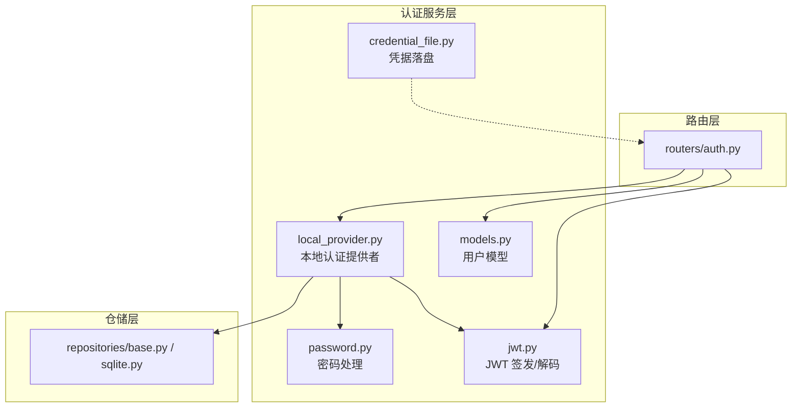

图表来源
- [backend/app/gateway/routers/auth.py:1-529](file://backend/app/gateway/routers/auth.py#L1-L529)
- [backend/app/gateway/auth/models.py:1-42](file://backend/app/gateway/auth/models.py#L1-L42)
- [backend/app/gateway/auth/password.py:1-82](file://backend/app/gateway/auth/password.py#L1-L82)
- [backend/app/gateway/auth/jwt.py:1-56](file://backend/app/gateway/auth/jwt.py#L1-L56)
- [backend/app/gateway/auth/local_provider.py:1-105](file://backend/app/gateway/auth/local_provider.py#L1-L105)
- [backend/app/gateway/auth/credential_file.py:1-49](file://backend/app/gateway/auth/credential_file.py#L1-L49)

章节来源
- [backend/app/gateway/routers/auth.py:1-529](file://backend/app/gateway/routers/auth.py#L1-L529)
- [backend/app/gateway/auth/models.py:1-42](file://backend/app/gateway/auth/models.py#L1-L42)
- [backend/app/gateway/auth/password.py:1-82](file://backend/app/gateway/auth/password.py#L1-L82)
- [backend/app/gateway/auth/jwt.py:1-56](file://backend/app/gateway/auth/jwt.py#L1-L56)
- [backend/app/gateway/auth/local_provider.py:1-105](file://backend/app/gateway/auth/local_provider.py#L1-L105)
- [backend/app/gateway/auth/credential_file.py:1-49](file://backend/app/gateway/auth/credential_file.py#L1-L49)

## 核心组件
- 用户模型：定义用户主键、邮箱、密码哈希、系统角色、OAuth 关联、生命周期字段（首次设置标记、令牌版本）等
- 密码处理：支持版本化哈希（v1/v2），SHA-256 预处理规避 bcrypt 截断限制；提供同步/异步哈希与校验
- JWT 令牌：基于 HS256 的签发与解码，携带用户标识与令牌版本号用于强制失效
- 本地认证提供者：封装数据库访问、用户创建、认证、计数查询、更新等
- 凭据文件：将初始管理员凭据写入受控文件，避免日志泄露
- 路由器：实现注册、登录、注销、密码变更、初始化管理员、设置状态检查等接口

章节来源
- [backend/app/gateway/auth/models.py:15-42](file://backend/app/gateway/auth/models.py#L15-L42)
- [backend/app/gateway/auth/password.py:32-82](file://backend/app/gateway/auth/password.py#L32-L82)
- [backend/app/gateway/auth/jwt.py:21-56](file://backend/app/gateway/auth/jwt.py#L21-L56)
- [backend/app/gateway/auth/local_provider.py:13-105](file://backend/app/gateway/auth/local_provider.py#L13-L105)
- [backend/app/gateway/auth/credential_file.py:21-49](file://backend/app/gateway/auth/credential_file.py#L21-L49)
- [backend/app/gateway/routers/auth.py:276-494](file://backend/app/gateway/routers/auth.py#L276-L494)

## 架构总览
下图展示从客户端到认证服务与仓储层的整体交互：

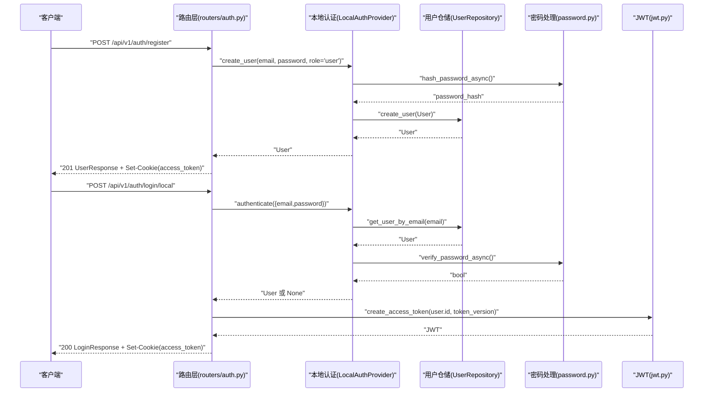

图表来源
- [backend/app/gateway/routers/auth.py:305-324](file://backend/app/gateway/routers/auth.py#L305-L324)
- [backend/app/gateway/routers/auth.py:276-303](file://backend/app/gateway/routers/auth.py#L276-L303)
- [backend/app/gateway/auth/local_provider.py:65-84](file://backend/app/gateway/auth/local_provider.py#L65-L84)
- [backend/app/gateway/auth/password.py:66-82](file://backend/app/gateway/auth/password.py#L66-L82)
- [backend/app/gateway/auth/jwt.py:21-37](file://backend/app/gateway/auth/jwt.py#L21-L37)

## 详细组件分析

### 用户实体模型设计
- 主键与唯一性：UUID 主键，邮箱唯一（由仓储约束保证）
- 角色与权限：系统角色为“admin”或“user”，默认“user”
- 密码与 OAuth：密码哈希可空（OAuth 用户），OAuth 提供商与 ID 可空
- 生命周期：首次设置标记（首次登录需完成设置）、令牌版本号（每次改密递增，用于强制旧令牌失效）
- 响应模型：对外返回模型剔除敏感字段，保留必要信息

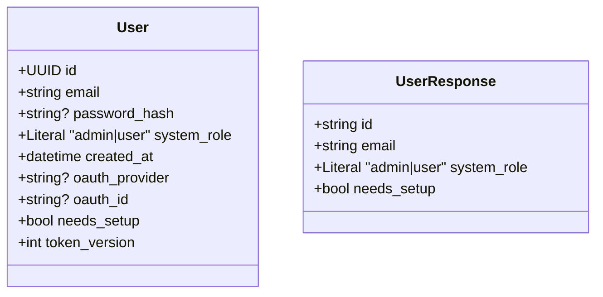

图表来源
- [backend/app/gateway/auth/models.py:15-42](file://backend/app/gateway/auth/models.py#L15-L42)

章节来源
- [backend/app/gateway/auth/models.py:15-42](file://backend/app/gateway/auth/models.py#L15-L42)

### 密码处理机制
- 版本化哈希格式：前缀区分版本（v1 为传统 bcrypt；v2 为 SHA-256 预处理 + bcrypt）
- 强度策略：内置常见弱口令集合，请求级校验拒绝弱口令
- 安全性增强：v2 避免 bcrypt 72 字节静默截断，确保完整密码参与哈希
- 性能与兼容：自动检测版本并回退兼容；提供异步接口避免阻塞事件循环；登录时可选重哈希升级

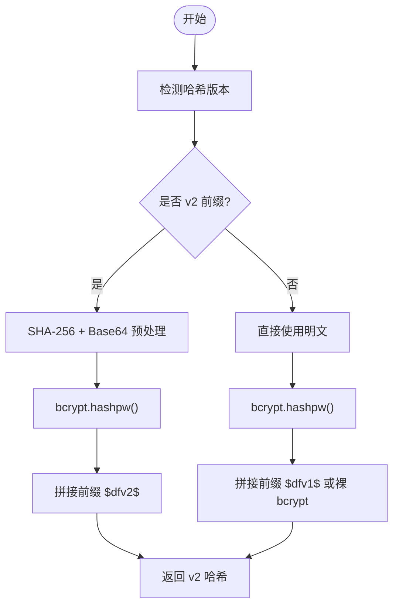

图表来源
- [backend/app/gateway/auth/password.py:32-58](file://backend/app/gateway/auth/password.py#L32-L58)

章节来源
- [backend/app/gateway/auth/password.py:1-82](file://backend/app/gateway/auth/password.py#L1-L82)

### 凭据文件管理
- 目标：避免将管理员初始密码记录到可收集日志中
- 实现：原子创建 0600 文件，仅进程用户可读；返回文件路径而非明文密码
- 使用场景：首次启动或重置密码后写入，提示操作员登录后修改并删除文件

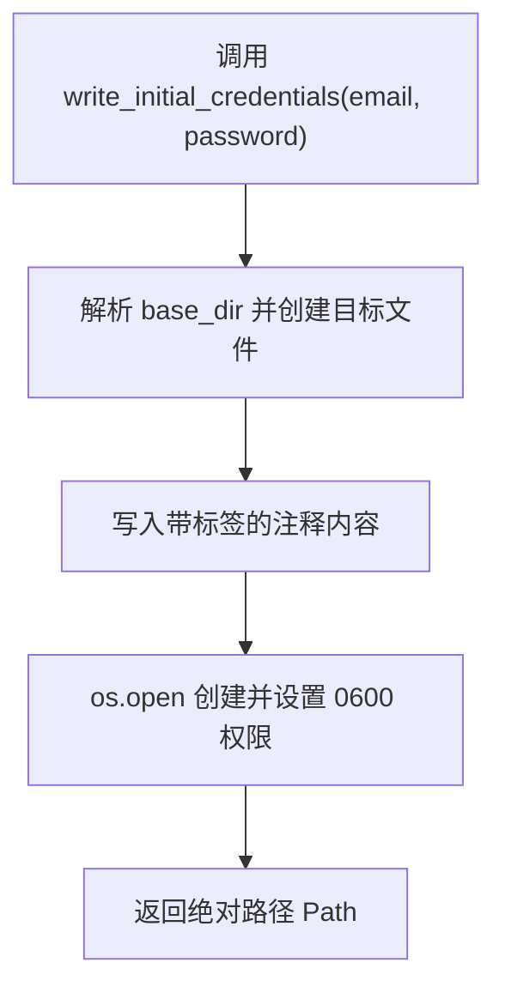

图表来源
- [backend/app/gateway/auth/credential_file.py:21-49](file://backend/app/gateway/auth/credential_file.py#L21-L49)

章节来源
- [backend/app/gateway/auth/credential_file.py:1-49](file://backend/app/gateway/auth/credential_file.py#L1-L49)

### 登录、注册与注销流程
- 注册：校验密码强度，创建普通用户，设置会话 Cookie 返回用户信息
- 登录：速率限制（按 IP 维护失败次数与封禁时间），认证成功后签发 JWT 并设置 HttpOnly Cookie
- 注销：清除会话 Cookie
- 设置状态检查：缓存稳定结果，避免多标签页重连风暴导致 429

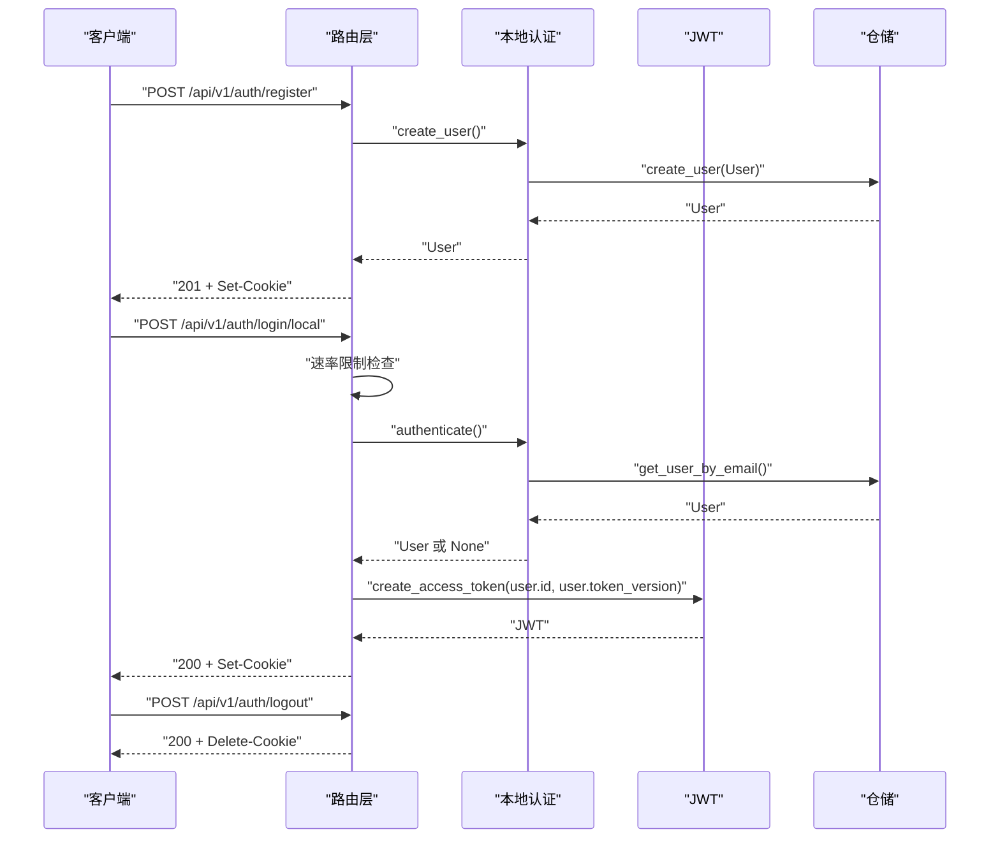

图表来源
- [backend/app/gateway/routers/auth.py:305-324](file://backend/app/gateway/routers/auth.py#L305-L324)
- [backend/app/gateway/routers/auth.py:276-303](file://backend/app/gateway/routers/auth.py#L276-L303)
- [backend/app/gateway/routers/auth.py:326-332](file://backend/app/gateway/routers/auth.py#L326-L332)

章节来源
- [backend/app/gateway/routers/auth.py:276-332](file://backend/app/gateway/routers/auth.py#L276-L332)

### 密码重置与账户生命周期
- 密码变更：当前密码校验通过后，更新密码哈希并递增令牌版本，重新签发 Cookie
- 首次设置：若用户标记需要设置，提供邮箱更新时自动清除该标记
- OAuth 用户：无本地密码，禁止变更密码

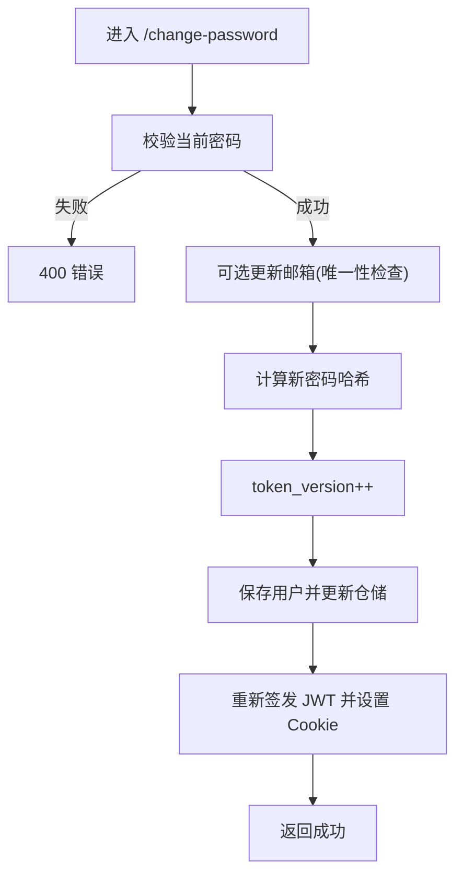

图表来源
- [backend/app/gateway/routers/auth.py:334-378](file://backend/app/gateway/routers/auth.py#L334-L378)

章节来源
- [backend/app/gateway/routers/auth.py:334-378](file://backend/app/gateway/routers/auth.py#L334-L378)

### 初始化管理员与系统设置
- 初始化：当不存在管理员时创建首个管理员账户，关闭首次设置标记，设置会话
- 设置状态：查询管理员数量，返回是否需要初始化

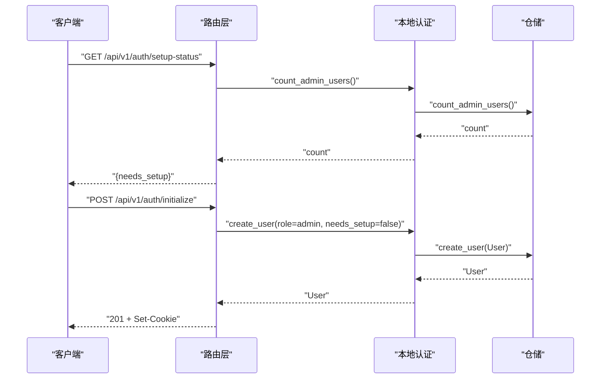

图表来源
- [backend/app/gateway/routers/auth.py:398-453](file://backend/app/gateway/routers/auth.py#L398-L453)
- [backend/app/gateway/routers/auth.py:464-494](file://backend/app/gateway/routers/auth.py#L464-L494)

章节来源
- [backend/app/gateway/routers/auth.py:398-494](file://backend/app/gateway/routers/auth.py#L398-L494)

### 令牌版本与强制失效
- 令牌版本：用户改密后递增，JWT 中携带该版本
- 解码校验：解码时要求版本匹配，不匹配即视为无效
- 会话失效：同一用户改密后，旧令牌无法通过校验，需重新登录

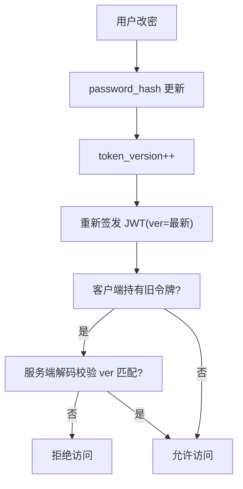

图表来源
- [backend/app/gateway/auth/jwt.py:12-18](file://backend/app/gateway/auth/jwt.py#L12-L18)
- [backend/app/gateway/auth/jwt.py:40-56](file://backend/app/gateway/auth/jwt.py#L40-L56)
- [backend/app/gateway/routers/auth.py:364-375](file://backend/app/gateway/routers/auth.py#L364-L375)

章节来源
- [backend/app/gateway/auth/jwt.py:12-56](file://backend/app/gateway/auth/jwt.py#L12-L56)
- [backend/app/gateway/routers/auth.py:364-375](file://backend/app/gateway/routers/auth.py#L364-L375)

### 速率限制与安全边界
- 按 IP 维护失败次数与封禁到期时间，超过阈值临时封禁
- 支持可信代理提取真实客户端 IP（仅在配置允许时信任 X-Real-IP）
- 缓存稳定结果，避免多标签页重连风暴导致 429

章节来源
- [backend/app/gateway/routers/auth.py:158-271](file://backend/app/gateway/routers/auth.py#L158-L271)
- [backend/app/gateway/routers/auth.py:398-453](file://backend/app/gateway/routers/auth.py#L398-L453)

### 用户数据迁移与备份恢复最佳实践
- 迁移脚本：将历史全局数据迁移到按用户隔离的目录结构，支持干运行与冲突处理
- 内容范围：线程目录、自定义智能体、全局记忆文件
- 备份建议：迁移前后对数据库与用户目录进行快照；迁移完成后清理遗留目录

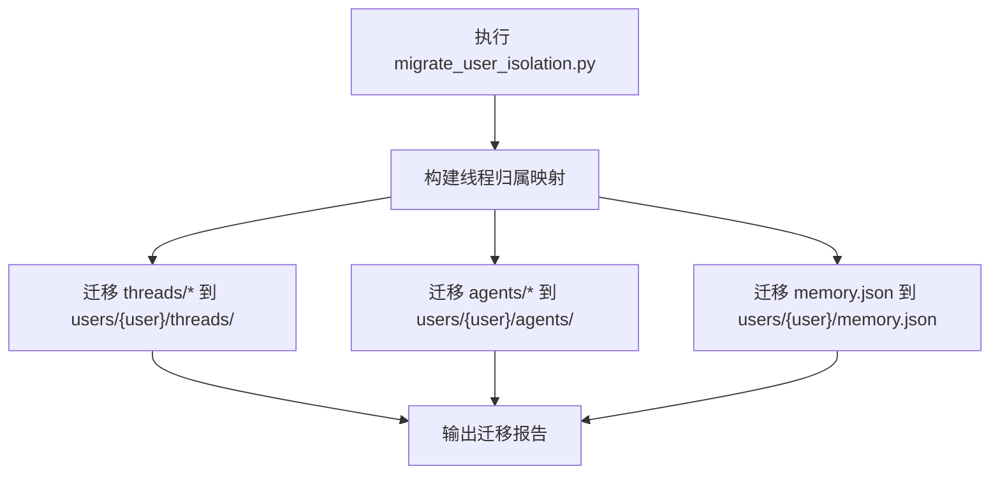

图表来源
- [backend/scripts/migrate_user_isolation.py:196-255](file://backend/scripts/migrate_user_isolation.py#L196-L255)

章节来源
- [backend/scripts/migrate_user_isolation.py:1-255](file://backend/scripts/migrate_user_isolation.py#L1-L255)

## 依赖分析
- 路由层依赖认证提供者与配置，提供统一的请求模型与响应模型
- 认证提供者依赖仓储接口与密码处理模块
- JWT 依赖配置模块获取密钥与过期参数
- 凭据文件工具依赖路径配置模块

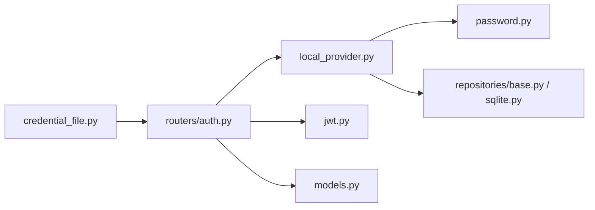

图表来源
- [backend/app/gateway/routers/auth.py:13-21](file://backend/app/gateway/routers/auth.py#L13-L21)
- [backend/app/gateway/auth/local_provider.py:1-23](file://backend/app/gateway/auth/local_provider.py#L1-L23)
- [backend/app/gateway/auth/password.py:1-20](file://backend/app/gateway/auth/password.py#L1-L20)
- [backend/app/gateway/auth/jwt.py:1-9](file://backend/app/gateway/auth/jwt.py#L1-L9)
- [backend/app/gateway/auth/credential_file.py:1-16](file://backend/app/gateway/auth/credential_file.py#L1-L16)

章节来源
- [backend/app/gateway/routers/auth.py:13-21](file://backend/app/gateway/routers/auth.py#L13-L21)
- [backend/app/gateway/auth/local_provider.py:1-23](file://backend/app/gateway/auth/local_provider.py#L1-L23)
- [backend/app/gateway/auth/password.py:1-20](file://backend/app/gateway/auth/password.py#L1-L20)
- [backend/app/gateway/auth/jwt.py:1-9](file://backend/app/gateway/auth/jwt.py#L1-L9)
- [backend/app/gateway/auth/credential_file.py:1-16](file://backend/app/gateway/auth/credential_file.py#L1-L16)

## 性能考虑
- 密码处理异步化：使用线程池包装阻塞 bcrypt，避免事件循环阻塞
- 速率限制内存上限：按阈值清理过期记录，控制跟踪 IP 数量
- 缓存稳定结果：对设置状态进行短期缓存，降低重复查询压力
- 多工作进程限制：当前内存级速率限制未跨进程共享，建议在多实例部署中引入共享存储（如 Redis）

## 故障排查指南
- 登录失败过多被限流：检查环境变量中的可信代理配置，确认 X-Real-IP 是否被正确信任；查看限流表清理逻辑
- 令牌无效或过期：确认 JWT 密钥一致、过期天数配置；核对用户令牌版本是否已递增
- 密码变更后仍无法登录：确认改密流程已更新令牌版本并重新签发 Cookie
- OAuth 用户无法改密：该类用户无本地密码哈希，属预期行为
- 初次设置状态异常：检查管理员计数逻辑与缓存 TTL

章节来源
- [backend/app/gateway/routers/auth.py:158-271](file://backend/app/gateway/routers/auth.py#L158-L271)
- [backend/app/gateway/auth/jwt.py:40-56](file://backend/app/gateway/auth/jwt.py#L40-L56)
- [backend/app/gateway/routers/auth.py:348-352](file://backend/app/gateway/routers/auth.py#L348-L352)
- [backend/app/gateway/routers/auth.py:398-453](file://backend/app/gateway/routers/auth.py#L398-L453)

## 结论
DeerFlow 用户管理系统通过清晰的分层设计与安全实践，提供了从用户模型、密码处理、令牌签发到路由编排的完整能力。版本化密码哈希、令牌版本强制失效、凭据落盘与速率限制等特性共同保障了系统的安全性与可用性。配合迁移脚本与缓存策略，可在生产环境中实现平滑演进与稳定运行。

## 附录
- 接口清单与行为参考：见路由层各端点定义与错误响应模型
- 配置要点：JWT 密钥、过期天数、速率限制阈值、可信代理列表
- 最佳实践：定期重哈希、及时删除初始凭据文件、备份数据库与用户目录、多实例部署时启用共享限流存储