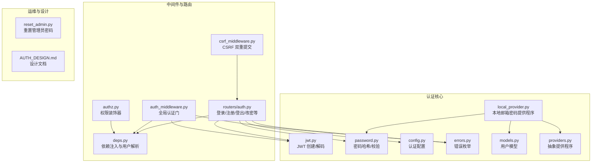
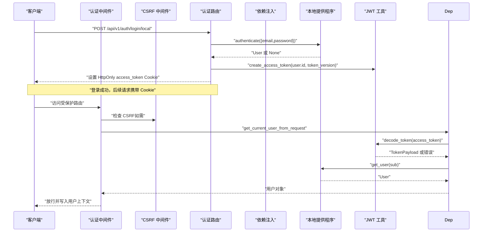
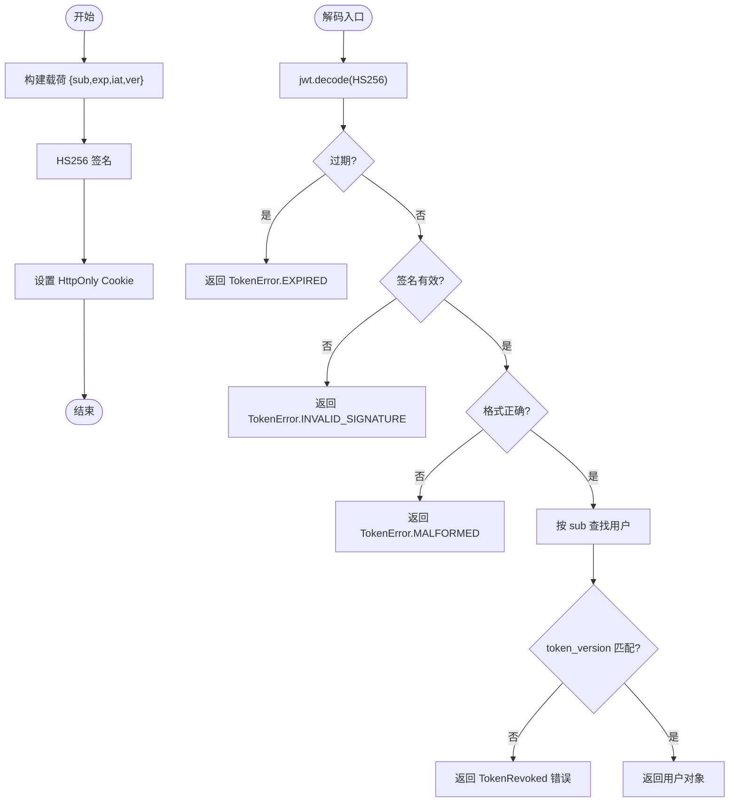
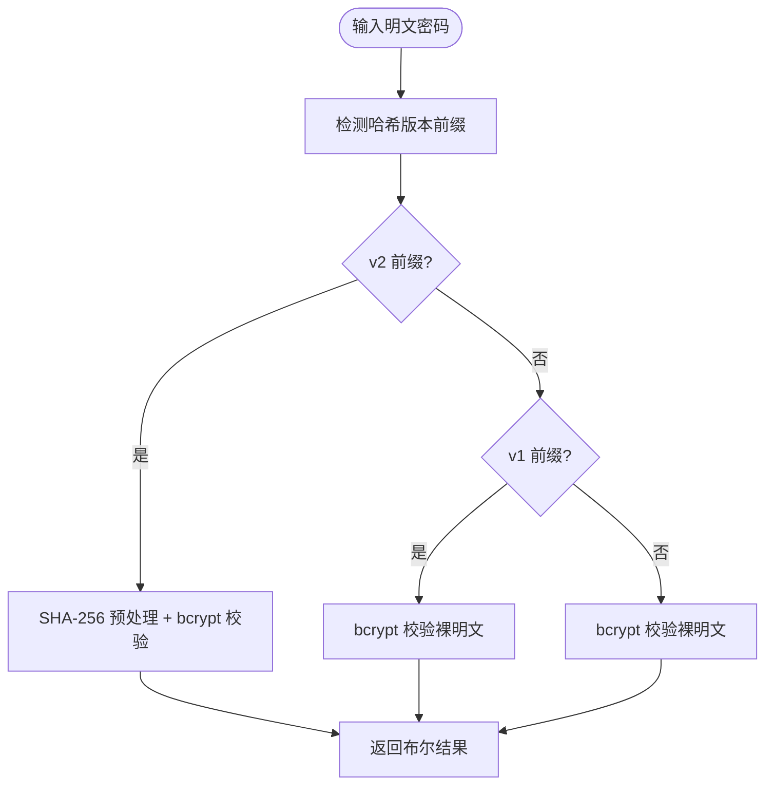
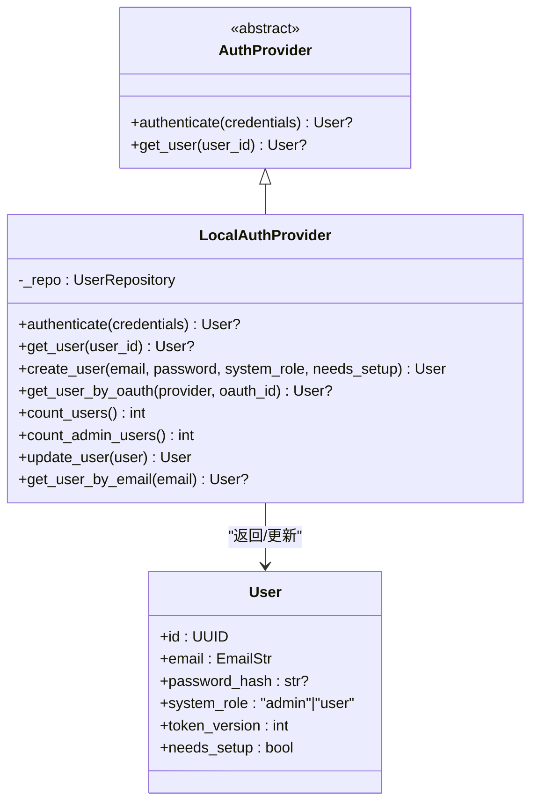
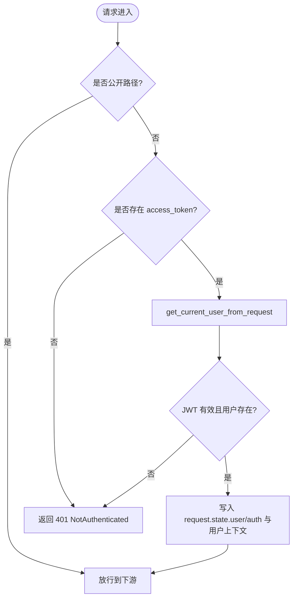
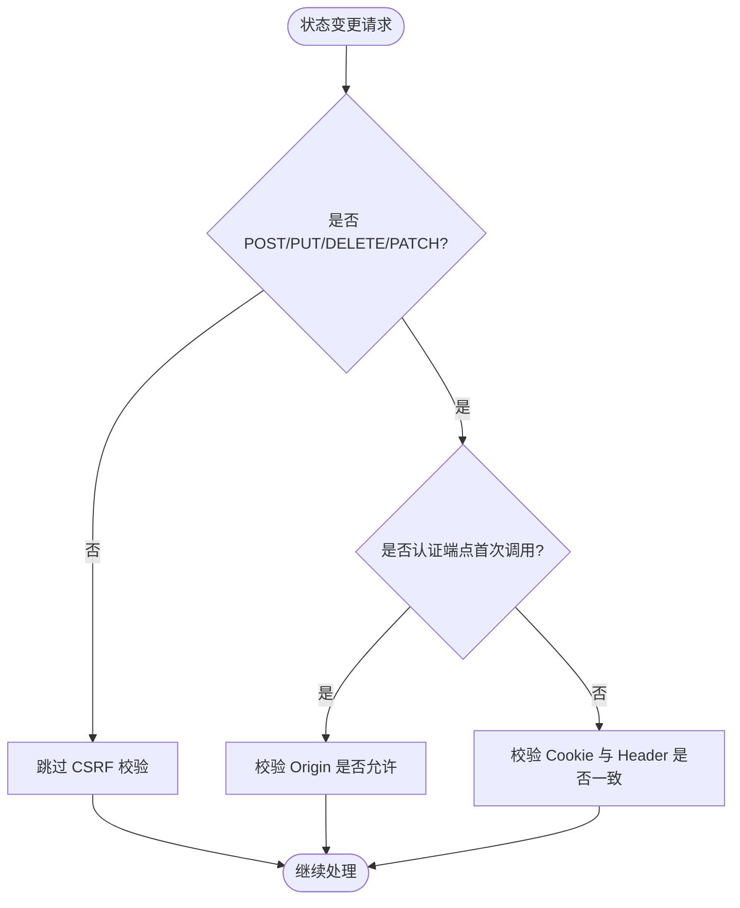
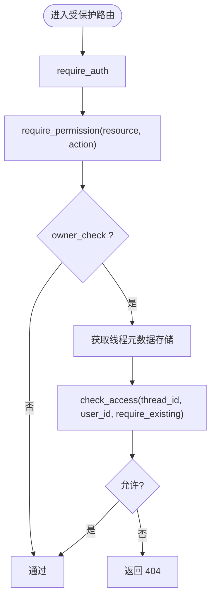
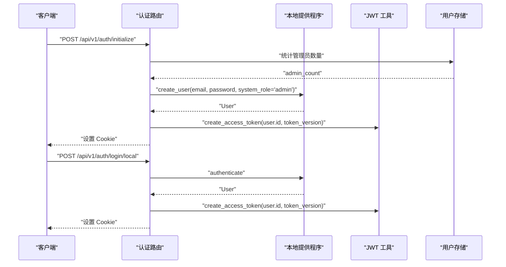
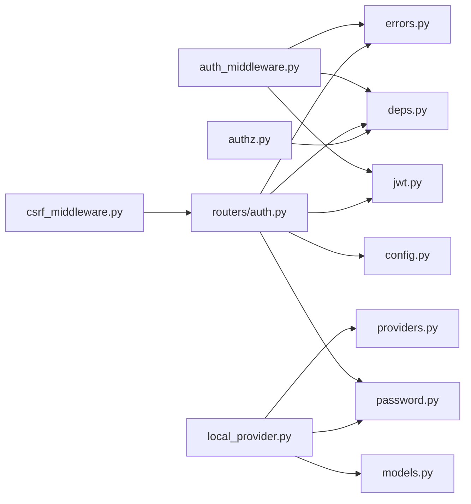

# 认证授权系统

<cite>
**本文引用的文件**
- [jwt.py](file://backend/app/gateway/auth/jwt.py)
- [password.py](file://backend/app/gateway/auth/password.py)
- [providers.py](file://backend/app/gateway/auth/providers.py)
- [local_provider.py](file://backend/app/gateway/auth/local_provider.py)
- [models.py](file://backend/app/gateway/auth/models.py)
- [config.py](file://backend/app/gateway/auth/config.py)
- [errors.py](file://backend/app/gateway/auth/errors.py)
- [auth_middleware.py](file://backend/app/gateway/auth_middleware.py)
- [csrf_middleware.py](file://backend/app/gateway/csrf_middleware.py)
- [auth.py](file://backend/app/gateway/routers/auth.py)
- [authz.py](file://backend/app/gateway/authz.py)
- [deps.py](file://backend/app/gateway/deps.py)
- [reset_admin.py](file://backend/app/gateway/auth/reset_admin.py)
- [AUTH_DESIGN.md](file://backend/docs/AUTH_DESIGN.md)
</cite>

## 目录
1. [简介](#简介)
2. [项目结构](#项目结构)
3. [核心组件](#核心组件)
4. [架构总览](#架构总览)
5. [详细组件分析](#详细组件分析)
6. [依赖分析](#依赖分析)
7. [性能考虑](#性能考虑)
8. [故障排查指南](#故障排查指南)
9. [结论](#结论)
10. [附录](#附录)

## 简介
本文件面向 DeerFlow 认证授权系统，系统性阐述基于 JWT 的认证机制、权限控制、CSRF 保护与用户隔离设计。内容涵盖认证提供程序、密码处理、令牌管理、权限验证、异常处理与安全最佳实践，并提供可扩展的配置示例与使用模式，帮助开发者在不破坏安全边界的前提下扩展认证方式、实现自定义权限策略与处理认证异常。

## 项目结构
认证授权相关代码主要位于后端网关模块的 gateway/auth 及其关联中间件与路由中，配合运行时用户上下文与权限装饰器实现端到端的安全控制。

图表来源
- [jwt.py:1-56](file://backend/app/gateway/auth/jwt.py#L1-L56)
- [password.py:1-82](file://backend/app/gateway/auth/password.py#L1-L82)
- [config.py:1-86](file://backend/app/gateway/auth/config.py#L1-L86)
- [errors.py:1-46](file://backend/app/gateway/auth/errors.py#L1-L46)
- [models.py:1-42](file://backend/app/gateway/auth/models.py#L1-L42)
- [providers.py:1-25](file://backend/app/gateway/auth/providers.py#L1-L25)
- [local_provider.py:1-105](file://backend/app/gateway/auth/local_provider.py#L1-L105)
- [auth_middleware.py:1-160](file://backend/app/gateway/auth_middleware.py#L1-L160)
- [csrf_middleware.py:1-238](file://backend/app/gateway/csrf_middleware.py#L1-L238)
- [auth.py:1-529](file://backend/app/gateway/routers/auth.py#L1-L529)
- [authz.py:1-303](file://backend/app/gateway/authz.py#L1-L303)
- [deps.py:1-339](file://backend/app/gateway/deps.py#L1-L339)
- [reset_admin.py:1-92](file://backend/app/gateway/auth/reset_admin.py#L1-L92)
- [AUTH_DESIGN.md:1-332](file://backend/docs/AUTH_DESIGN.md#L1-L332)

章节来源
- [AUTH_DESIGN.md:1-332](file://backend/docs/AUTH_DESIGN.md#L1-L332)

## 核心组件
- JWT 令牌管理：负责令牌签发、载荷结构与解码校验，结合 token_version 实现密码变更后的即时撤销。
- 密码处理：采用带版本号的 bcrypt 哈希格式，支持透明升级与异步处理，避免阻塞事件循环。
- 认证提供程序：抽象出 AuthProvider 接口，本地提供程序实现邮箱/密码认证与用户生命周期管理。
- 全局认证中间件：Fail-closed 的严格认证门，确保非公开路由必须具备有效会话。
- CSRF 中间件：双提交 Cookie 模式，结合 Origin 校验防止跨站状态变更攻击。
- 权限控制：装饰器驱动的权限模型，支持资源动作与拥有者检查。
- 依赖注入与用户解析：集中获取用户实例，统一处理 token 版本与用户存在性校验。
- 配置与错误：集中式认证配置加载与标准化错误响应。

章节来源
- [jwt.py:1-56](file://backend/app/gateway/auth/jwt.py#L1-L56)
- [password.py:1-82](file://backend/app/gateway/auth/password.py#L1-L82)
- [providers.py:1-25](file://backend/app/gateway/auth/providers.py#L1-L25)
- [local_provider.py:1-105](file://backend/app/gateway/auth/local_provider.py#L1-L105)
- [auth_middleware.py:1-160](file://backend/app/gateway/auth_middleware.py#L1-L160)
- [csrf_middleware.py:1-238](file://backend/app/gateway/csrf_middleware.py#L1-L238)
- [authz.py:1-303](file://backend/app/gateway/authz.py#L1-L303)
- [deps.py:273-339](file://backend/app/gateway/deps.py#L273-L339)
- [config.py:1-86](file://backend/app/gateway/auth/config.py#L1-L86)
- [errors.py:1-46](file://backend/app/gateway/auth/errors.py#L1-L46)

## 架构总览
下图展示了认证授权系统的端到端交互：浏览器通过认证路由进行初始化/登录/注册/登出/改密，随后携带 HttpOnly 的 access_token Cookie 访问受保护资源；全局认证中间件严格校验 JWT 并写入运行时用户上下文；权限装饰器在路由层做细粒度授权；CSRF 中间件在状态变更请求上进行双重提交校验与 Origin 校验。

图表来源
- [auth.py:276-303](file://backend/app/gateway/routers/auth.py#L276-L303)
- [auth_middleware.py:76-160](file://backend/app/gateway/auth_middleware.py#L76-L160)
- [deps.py:273-317](file://backend/app/gateway/deps.py#L273-L317)
- [jwt.py:21-56](file://backend/app/gateway/auth/jwt.py#L21-L56)
- [local_provider.py:24-60](file://backend/app/gateway/auth/local_provider.py#L24-L60)
- [csrf_middleware.py:181-229](file://backend/app/gateway/csrf_middleware.py#L181-L229)

## 详细组件分析

### JWT 认证机制
- 载荷结构：包含 sub（用户 ID）、exp（过期时间）、iat（签发时间）、ver（token_version）。ver 与用户记录中的 token_version 对齐，用于密码变更后的即时撤销。
- 签发流程：根据配置的过期天数计算到期时间，使用 HS256 算法签名；响应仅设置 Cookie，不将明文 token 返回 JSON。
- 解码与校验：捕获过期、签名无效、格式错误等异常，映射为标准化错误码；最终通过用户 ID 查询用户并比对 token_version。

图表来源
- [jwt.py:21-56](file://backend/app/gateway/auth/jwt.py#L21-L56)
- [deps.py:294-317](file://backend/app/gateway/deps.py#L294-L317)
- [errors.py:26-46](file://backend/app/gateway/auth/errors.py#L26-L46)

章节来源
- [jwt.py:1-56](file://backend/app/gateway/auth/jwt.py#L1-L56)
- [deps.py:273-317](file://backend/app/gateway/deps.py#L273-L317)
- [errors.py:1-46](file://backend/app/gateway/auth/errors.py#L1-L46)

### 密码处理与版本演进
- 哈希格式：v2（推荐）使用 SHA-256 预处理规避 bcrypt 72 字节截断限制；v1 为遗留格式，自动降级兼容。
- 验证逻辑：自动检测版本前缀，透明升级；对损坏哈希采取“失败关闭”策略，避免崩溃。
- 异步接口：通过线程池包装阻塞 bcrypt，避免事件循环阻塞。
- 重哈希策略：检测到旧版本哈希时，在登录成功后尝试异步重哈希，失败仅记录警告不影响登录。

图表来源
- [password.py:38-58](file://backend/app/gateway/auth/password.py#L38-L58)

章节来源
- [password.py:1-82](file://backend/app/gateway/auth/password.py#L1-L82)

### 认证提供程序与本地邮箱密码
- 抽象接口：AuthProvider 定义 authenticate 与 get_user 两个核心方法，便于扩展 OAuth/GitHub 等提供程序。
- 本地实现：按邮箱查找用户，校验密码（异步 bcrypt），必要时重哈希；支持创建用户、统计用户与管理员数量、按 OAuth 提供商与 ID 查询用户等。

图表来源
- [providers.py:6-25](file://backend/app/gateway/auth/providers.py#L6-L25)
- [local_provider.py:13-105](file://backend/app/gateway/auth/local_provider.py#L13-L105)
- [models.py:15-42](file://backend/app/gateway/auth/models.py#L15-L42)

章节来源
- [providers.py:1-25](file://backend/app/gateway/auth/providers.py#L1-L25)
- [local_provider.py:1-105](file://backend/app/gateway/auth/local_provider.py#L1-L105)
- [models.py:1-42](file://backend/app/gateway/auth/models.py#L1-L42)

### 全局认证中间件与用户上下文
- 公开路径白名单：健康检查、文档、认证引导端点等无需认证。
- ADS 兼容：支持 ads_token/access_token 的 Cookie 解析与临时用户注入，用于特定集成场景。
- 严格 JWT 校验：非公开路径必须具备有效 access_token，否则返回标准化错误；成功后将用户写入 request.state.user、request.state.auth 以及运行时用户上下文，实现下游仓储的“自动用户解析”。

图表来源
- [auth_middleware.py:76-160](file://backend/app/gateway/auth_middleware.py#L76-L160)
- [deps.py:273-317](file://backend/app/gateway/deps.py#L273-L317)

章节来源
- [auth_middleware.py:1-160](file://backend/app/gateway/auth_middleware.py#L1-L160)
- [deps.py:273-317](file://backend/app/gateway/deps.py#L273-L317)

### CSRF 保护与跨站防护
- 双重提交：服务端设置 csrf_token Cookie，前端在状态变更请求中携带 X-CSRF-Token Header，服务端使用常量时间比较校验一致性。
- 方法豁免：GET/HEAD/OPTIONS/TRACE 不需要 CSRF 校验；认证端点（登录/注册/初始化/登出）首次调用不强制双提交，但仍进行 Origin 校验以防范登录 CSRF 与会话固定。
- CORS 来源校验：仅允许来自同源或显式配置的 GATEWAY_CORS_ORIGINS 的 Origin。

图表来源
- [csrf_middleware.py:181-229](file://backend/app/gateway/csrf_middleware.py#L181-L229)

章节来源
- [csrf_middleware.py:1-238](file://backend/app/gateway/csrf_middleware.py#L1-L238)

### 权限控制与拥有者检查
- 权限模型：资源:动作（如 threads:read、runs:create 等），装饰器链自底向上执行。
- require_auth：独立认证装饰器，确保请求已认证并写入 AuthContext。
- require_permission：检查资源动作权限；当 owner_check=True 时，结合线程元数据存储进行拥有者校验，避免通过缺失行绕过；destructive 路由建议启用 require_existing=True 以严格拒绝不存在或不属于当前用户的资源。

图表来源
- [authz.py:147-303](file://backend/app/gateway/authz.py#L147-L303)

章节来源
- [authz.py:1-303](file://backend/app/gateway/authz.py#L1-L303)

### 认证路由与端到端流程
- 初始化：当无管理员时，返回 needs_setup=true；创建管理员账户后设置 Cookie 并清零 needs_setup。
- 登录/注册：登录成功签发 JWT 并设置 HttpOnly Cookie；注册创建普通用户并自动登录。
- 登出：清理 access_token 与 ads_token Cookie。
- 改密：校验当前密码，更新哈希与 token_version，重新签发 Cookie；若处于首次设置流程可同时更新邮箱并清除 needs_setup。
- 安全增强：登录失败按客户端 IP 计数，支持可信代理解析真实来源，避免被伪造头绕过。

图表来源
- [auth.py:464-494](file://backend/app/gateway/routers/auth.py#L464-L494)
- [auth.py:276-303](file://backend/app/gateway/routers/auth.py#L276-L303)
- [local_provider.py:65-84](file://backend/app/gateway/auth/local_provider.py#L65-L84)
- [jwt.py:21-37](file://backend/app/gateway/auth/jwt.py#L21-L37)

章节来源
- [auth.py:1-529](file://backend/app/gateway/routers/auth.py#L1-L529)

### 配置与错误模型
- 认证配置：集中加载 AUTH_JWT_SECRET，支持从环境变量或持久化文件读取；提供运行时覆盖与测试注入能力。
- 错误模型：统一的 AuthErrorCode 与 TokenError，标准化 HTTP 错误响应结构，便于前端与 SDK 侧一致处理。

章节来源
- [config.py:1-86](file://backend/app/gateway/auth/config.py#L1-L86)
- [errors.py:1-46](file://backend/app/gateway/auth/errors.py#L1-L46)

### 运维与异常处理
- 重置管理员密码：通过 CLI 生成新密码，更新哈希与 token_version，并写入权限 0600 的凭据文件，避免明文密码出现在日志中。
- 依赖注入：集中获取 LocalAuthProvider 与用户解析器，避免重复初始化；在请求边界抛出标准化 HTTP 异常。

章节来源
- [reset_admin.py:1-92](file://backend/app/gateway/auth/reset_admin.py#L1-L92)
- [deps.py:251-271](file://backend/app/gateway/deps.py#L251-L271)

## 依赖分析
- 组件耦合：认证中间件依赖 JWT 工具与依赖注入；路由依赖提供程序与配置；权限装饰器依赖依赖注入与线程元数据存储。
- 外部依赖：FastAPI/Starlette 中间件栈、Pydantic 模型、bcrypt、PyJWT；运行时用户上下文通过 ContextVar 传递。
- 循环依赖：通过延迟导入与运行时装配避免循环。

图表来源
- [auth_middleware.py:1-160](file://backend/app/gateway/auth_middleware.py#L1-L160)
- [csrf_middleware.py:1-238](file://backend/app/gateway/csrf_middleware.py#L1-L238)
- [auth.py:1-529](file://backend/app/gateway/routers/auth.py#L1-L529)
- [authz.py:1-303](file://backend/app/gateway/authz.py#L1-L303)
- [local_provider.py:1-105](file://backend/app/gateway/auth/local_provider.py#L1-L105)

## 性能考虑
- 密码处理异步化：通过线程池包装 bcrypt，避免阻塞事件循环，提高并发吞吐。
- 登录限速：进程内字典计数，单 Worker 精确，多 Worker 场景建议替换为共享存储（如 Redis/数据库）以实现全局精确限速。
- 缓存与去重：setup-status 结果缓存与去重，避免多标签页重连风暴导致的 429。
- Cookie 策略：HttpOnly Cookie 降低 XSS 风险；HTTPS 环境下设置 max_age 以减少不必要的 Cookie 传输。

## 故障排查指南
- 401 未认证：检查 access_token Cookie 是否存在；确认 JWT 未过期且用户仍存在；核对 token_version 与用户记录一致。
- 401 令牌无效：检查 AUTH_JWT_SECRET 是否正确加载；确认签名算法与 HS256 一致；查看标准化错误码定位具体原因。
- 403 权限不足：确认用户是否具备所需资源:动作权限；对于拥有者检查，确认线程元数据行存在且属于当前用户。
- CSRF 失败：确认前端在状态变更请求中携带 X-CSRF-Token；确保 Cookie 与 Header 值一致；检查 Origin 是否在允许列表或同源。
- 登录频繁失败：检查 AUTH_TRUSTED_PROXIES 配置是否正确；确认 X-Real-IP 来源可信；观察限速阈值与锁定时间。

章节来源
- [errors.py:1-46](file://backend/app/gateway/auth/errors.py#L1-L46)
- [deps.py:294-317](file://backend/app/gateway/deps.py#L294-L317)
- [authz.py:236-303](file://backend/app/gateway/authz.py#L236-L303)
- [csrf_middleware.py:181-229](file://backend/app/gateway/csrf_middleware.py#L181-L229)
- [auth.py:226-271](file://backend/app/gateway/routers/auth.py#L226-L271)

## 结论
DeerFlow 的认证授权系统以“默认强制认证、严格 JWT 校验、CSRF 双重提交、运行时用户上下文贯穿”的设计实现了端到端的安全边界。通过可扩展的认证提供程序接口、版本化密码处理与细粒度权限装饰器，系统既满足当前多用户部署需求，也为未来接入 OAuth、细化 RBAC 与分布式限速提供了清晰的扩展路径。

## 附录

### 配置示例与使用模式
- JWT 秘钥：通过 AUTH_JWT_SECRET 环境变量设置；未设置时自动在持久化目录生成并写入，生产环境建议显式配置。
- CSRF 来源：通过 GATEWAY_CORS_ORIGINS 显式配置允许的浏览器来源；首次认证请求仍进行 Origin 校验。
- 登录限速：通过 AUTH_TRUSTED_PROXIES 与 X-Real-IP 配置可信代理；多 Worker 场景建议引入共享存储实现全局限速。
- 初始化与改密：使用 /api/v1/auth/initialize 创建管理员；使用 /api/v1/auth/change-password 更新密码并立即撤销旧会话。

章节来源
- [config.py:61-86](file://backend/app/gateway/auth/config.py#L61-L86)
- [csrf_middleware.py:97-113](file://backend/app/gateway/csrf_middleware.py#L97-L113)
- [auth.py:464-494](file://backend/app/gateway/routers/auth.py#L464-L494)
- [auth.py:334-378](file://backend/app/gateway/routers/auth.py#L334-L378)

### 扩展认证方式与自定义权限策略
- 扩展认证提供程序：实现 AuthProvider 接口，注册到依赖注入；在认证路由中增加相应端点与回调。
- 自定义权限策略：在装饰器中扩展权限集合与拥有者检查逻辑；结合线程元数据存储实现更严格的资源隔离。
- OAuth 集成：参考 OAuth 端点占位，实现提供商授权与回调，统一 token_version 与角色语义。

章节来源
- [providers.py:6-25](file://backend/app/gateway/auth/providers.py#L6-L25)
- [authz.py:48-119](file://backend/app/gateway/authz.py#L48-L119)
- [auth.py:499-529](file://backend/app/gateway/routers/auth.py#L499-L529)

### 安全最佳实践
- 令牌传输：仅在 HttpOnly Cookie 中传输，避免明文 token 返回 JSON。
- 默认拒绝：非公开路由必须严格验证 JWT，不可仅依赖 Cookie 存在。
- 即时撤销：密码变更后 token_version 递增，旧 JWT 立即失效。
- 客户端元数据：剥离 user_id/owner_id，防止客户端声明身份。
- 文件路径：通过路径解析与沙箱校验，避免拼接未校验的用户输入。
- 异常处理：捕获认证、迁移、后台任务异常并记录日志，避免空 catch。

章节来源
- [AUTH_DESIGN.md:287-332](file://backend/docs/AUTH_DESIGN.md#L287-L332)