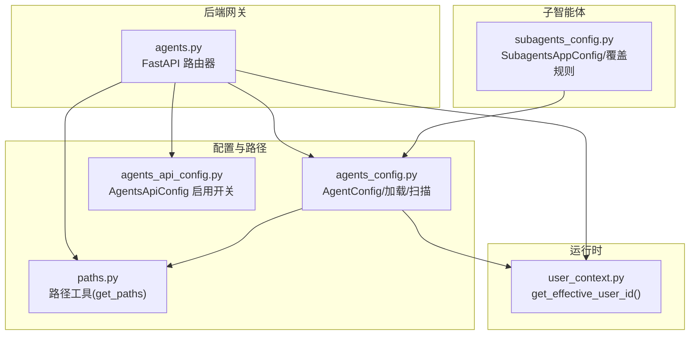
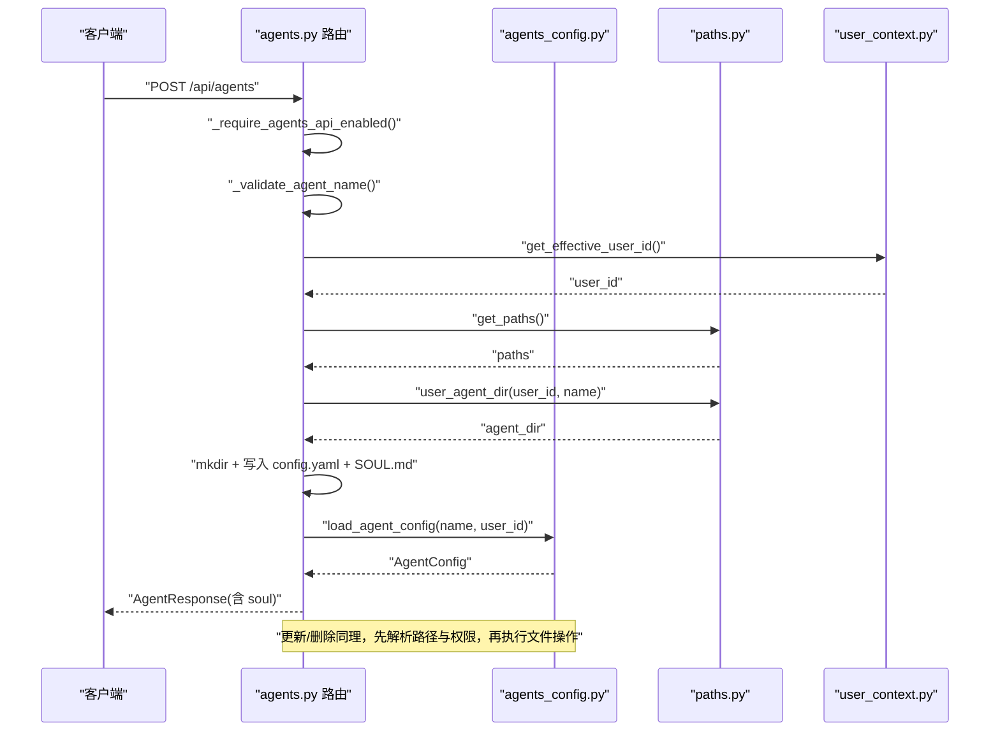
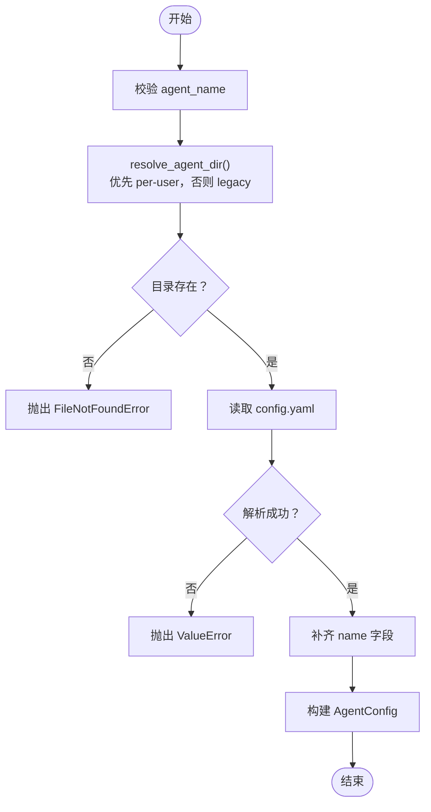
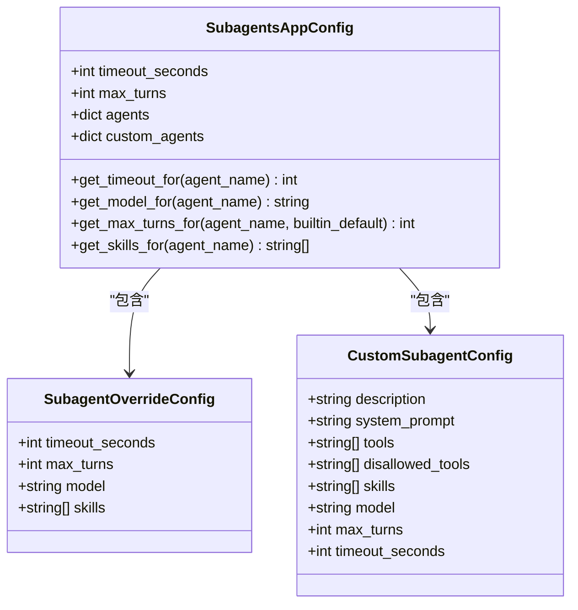
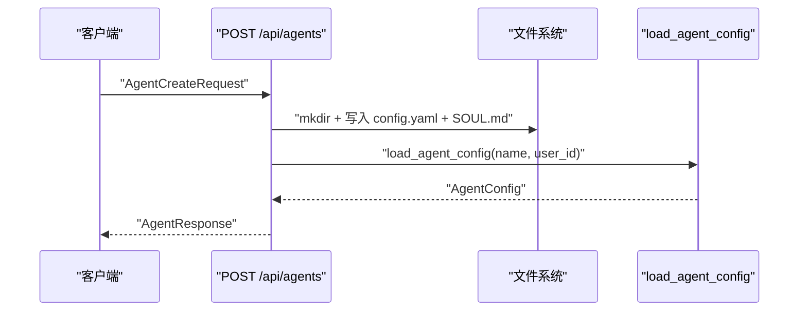
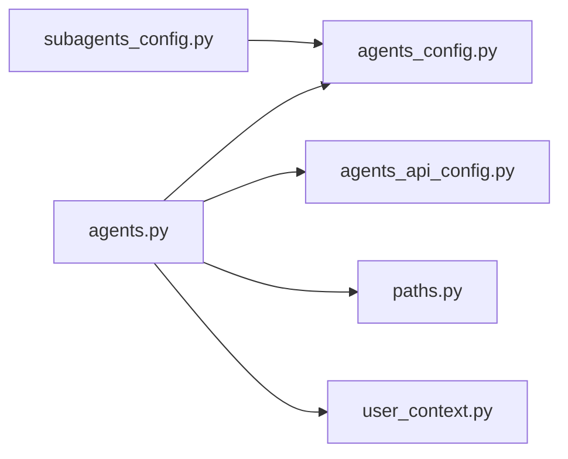

# Agents 路由模块

<cite>
**本文引用的文件**
- [agents.py](file://backend/app/gateway/routers/agents.py)
- [agents_config.py](file://backend/packages/harness/deerflow/config/agents_config.py)
- [agents_api_config.py](file://backend/packages/harness/deerflow/config/agents_api_config.py)
- [subagents_config.py](file://backend/packages/harness/deerflow/config/subagents_config.py)
- [paths.py](file://backend/packages/harness/deerflow/config/paths.py)
- [user_context.py](file://backend/packages/harness/deerflow/runtime/user_context.py)
- [test_custom_agent.py](file://backend/tests/test_custom_agent.py)
- [test_update_agent_tool.py](file://backend/tests/test_update_agent_tool.py)
- [test_create_deerflow_agent.py](file://backend/tests/test_create_deerflow_agent.py)
- [test_migration_user_isolation.py](file://backend/tests/test_migration_user_isolation.py)
</cite>

## 目录
1. [简介](#简介)
2. [项目结构](#项目结构)
3. [核心组件](#核心组件)
4. [架构总览](#架构总览)
5. [详细组件分析](#详细组件分析)
6. [依赖分析](#依赖分析)
7. [性能考虑](#性能考虑)
8. [故障排查指南](#故障排查指南)
9. [结论](#结论)
10. [附录](#附录)

## 简介
本技术文档聚焦于 Agents 路由模块，系统性阐述自定义智能体的管理路由设计与实现，覆盖以下方面：
- 智能体生命周期：创建、查询、更新、删除与名称可用性检查
- 模板与配置：config.yaml 的字段语义、SOUL.md 的注入机制与 USER.md 全局用户档案
- 参数校验与配置继承：名称格式、字段可空性区分、技能白名单策略、工具组过滤
- 子智能体（Subagent）配置：超时、轮次上限、模型继承与覆盖、技能白名单
- 权限与隔离：按用户隔离存储、启用开关控制、迁移兼容策略
- 运行时集成：智能体配置如何被运行时加载与使用

## 项目结构
Agents 路由位于后端网关层，通过 FastAPI 路由器对外暴露 HTTP 接口；配置与路径解析由 harness 包提供，运行时上下文用于确定当前用户。

**图表来源**
- [agents.py:17](file://backend/app/gateway/routers/agents.py#L17)
- [agents_config.py:18](file://backend/packages/harness/deerflow/config/agents_config.py#L18)
- [agents_api_config.py:6](file://backend/packages/harness/deerflow/config/agents_api_config.py#L6)
- [paths.py](file://backend/packages/harness/deerflow/config/paths.py)
- [user_context.py](file://backend/packages/harness/deerflow/runtime/user_context.py)
- [subagents_config.py:71](file://backend/packages/harness/deerflow/config/subagents_config.py#L71)

**章节来源**
- [agents.py:106-447](file://backend/app/gateway/routers/agents.py#L106-L447)
- [agents_config.py:1-201](file://backend/packages/harness/deerflow/config/agents_config.py#L1-L201)
- [agents_api_config.py:1-33](file://backend/packages/harness/deerflow/config/agents_api_config.py#L1-L33)
- [subagents_config.py:1-182](file://backend/packages/harness/deerflow/config/subagents_config.py#L1-L182)

## 核心组件
- 路由器与端点
  - 列表、查询、创建、更新、删除、名称检查、用户档案读写
  - 均受 AgentsApiConfig.enabled 开关保护
- 配置与加载
  - AgentConfig：描述智能体元数据与能力边界（模型、工具组、技能）
  - 加载/扫描：从 per-user 与 legacy 共享布局读取，支持迁移期并存
- 用户隔离与路径
  - per-user 布局优先，legacy 只读回退
  - USER.md 全局用户档案注入到所有自定义智能体
- 子智能体配置
  - 超时、最大轮次、模型继承/覆盖、技能白名单
- 运行时上下文
  - 通过 get_effective_user_id() 获取当前操作者身份，确保 per-user 隔离

**章节来源**
- [agents.py:106-447](file://backend/app/gateway/routers/agents.py#L106-L447)
- [agents_config.py:38-127](file://backend/packages/harness/deerflow/config/agents_config.py#L38-L127)
- [agents_config.py:154-201](file://backend/packages/harness/deerflow/config/agents_config.py#L154-L201)
- [agents_api_config.py:6-27](file://backend/packages/harness/deerflow/config/agents_api_config.py#L6-L27)
- [subagents_config.py:71-182](file://backend/packages/harness/deerflow/config/subagents_config.py#L71-L182)

## 架构总览
下图展示从 HTTP 请求到配置加载与文件系统写入的关键交互：

**图表来源**
- [agents.py:191-257](file://backend/app/gateway/routers/agents.py#L191-L257)
- [agents_config.py:80-127](file://backend/packages/harness/deerflow/config/agents_config.py#L80-L127)
- [paths.py](file://backend/packages/harness/deerflow/config/paths.py)
- [user_context.py](file://backend/packages/harness/deerflow/runtime/user_context.py)

## 详细组件分析

### 1) 路由与端点设计
- GET /api/agents：列出所有自定义智能体（含 soul），按名称排序
- GET /api/agents/check：校验名称合法性并判断是否可用（大小写不敏感）
- GET /api/agents/{name}：按名称获取智能体详情与 soul
- POST /api/agents：创建新智能体（写入 config.yaml 与 SOUL.md）
- PUT /api/agents/{name}：更新现有智能体（可选字段：description/model/tool_groups/skills/soul）
- DELETE /api/agents/{name}：删除智能体目录
- GET /api/user-profile：读取全局 USER.md
- PUT /api/user-profile：写入全局 USER.md

关键行为与约束
- 所有写操作均受 AgentsApiConfig.enabled 控制
- 名称仅允许字母、数字、连字符，且统一转为小写存储
- 更新时对“省略 vs 显式设为 null”进行区分，以正确处理 skills 的继承语义
- 删除前检查是否仅为 legacy 共享布局存在，避免误删

**章节来源**
- [agents.py:106-447](file://backend/app/gateway/routers/agents.py#L106-L447)
- [agents_api_config.py:6-12](file://backend/packages/harness/deerflow/config/agents_api_config.py#L6-L12)

### 2) 配置模型与加载
- AgentConfig 字段
  - name：必填
  - description：可选
  - model：可选（覆盖）
  - tool_groups：可选（白名单）
  - skills：可选（None 表示继承全部；[] 表示禁用全部；["a","b"] 表示白名单）
- 加载与解析
  - 优先 per-user 布局，若不存在则回退到 legacy 共享布局
  - 若目录或 config.yaml 缺失，抛出 FileNotFoundError
  - 解析失败抛出 ValueError
  - 自动补齐 name 字段（若文件未包含）
- 扫描与去重
  - 合并 per-user 与 legacy 目录，per-user 优先覆盖同名 legacy
  - 忽略无 config.yaml 的条目，并记录警告

**图表来源**
- [agents_config.py:80-127](file://backend/packages/harness/deerflow/config/agents_config.py#L80-L127)

**章节来源**
- [agents_config.py:38-127](file://backend/packages/harness/deerflow/config/agents_config.py#L38-L127)
- [agents_config.py:154-201](file://backend/packages/harness/deerflow/config/agents_config.py#L154-L201)

### 3) 模板系统与参数验证
- 模板文件
  - config.yaml：智能体元数据与能力边界
  - SOUL.md：智能体人格、价值观与行为守则，注入到系统提示中
  - USER.md：全局用户档案，注入到所有自定义智能体
- 参数验证
  - 名称正则：仅允许字母、数字、连字符
  - 更新时对“省略 vs 显式 null”的区分，确保 skills 的继承语义正确
  - 创建时若目标路径已存在，返回 409 冲突

**章节来源**
- [agents.py:39-58](file://backend/app/gateway/routers/agents.py#L39-L58)
- [agents.py:298-322](file://backend/app/gateway/routers/agents.py#L298-L322)
- [agents_config.py:27-36](file://backend/packages/harness/deerflow/config/agents_config.py#L27-L36)

### 4) 配置继承与能力边界
- 继承策略
  - skills：None 表示继承父级全部启用的技能；[] 表示禁用全部；["a","b"] 表示白名单
  - model/tool_groups：None 表示继承父级设置
- 子智能体（Subagent）覆盖
  - 支持按 agent_name 设置 per-agent 覆盖项：timeout_seconds、max_turns、model、skills
  - 支持自定义子智能体类型（custom_agents），包含系统提示、工具白名单等

**图表来源**
- [subagents_config.py:10-92](file://backend/packages/harness/deerflow/config/subagents_config.py#L10-L92)

**章节来源**
- [subagents_config.py:71-182](file://backend/packages/harness/deerflow/config/subagents_config.py#L71-L182)

### 5) 智能体与技能、模型提供者的关系
- 技能与工具
  - skills 白名单控制哪些技能被注入到系统提示中
  - tool_groups 白名单控制可用工具组
- 模型提供者
  - model 字段可覆盖默认模型；子智能体可通过 get_model_for 继承或覆盖
- 运行时集成
  - AgentConfig 作为运行时加载的基础配置，结合 USER.md 与 SOUL.md 形成最终系统提示

**章节来源**
- [agents_config.py:38-49](file://backend/packages/harness/deerflow/config/agents_config.py#L38-L49)
- [subagents_config.py:107-119](file://backend/packages/harness/deerflow/config/subagents_config.py#L107-L119)

### 6) 权限管理、资源隔离与迁移
- 权限与隔离
  - 所有 per-user 路径均基于 get_effective_user_id() 生成
  - 写操作受 AgentsApiConfig.enabled 控制
- 迁移兼容
  - legacy 共享布局只读回退，新建写入统一走 per-user
  - 更新/删除前检测仅存在 legacy 的情况，建议运行迁移脚本

**章节来源**
- [agents.py:118-126](file://backend/app/gateway/routers/agents.py#L118-L126)
- [agents.py:284-294](file://backend/app/gateway/routers/agents.py#L284-L294)
- [agents.py:426-440](file://backend/app/gateway/routers/agents.py#L426-L440)
- [agents_config.py:52-77](file://backend/packages/harness/deerflow/config/agents_config.py#L52-L77)

### 7) API 示例与工作流

#### 基础智能体创建流程
- 步骤
  - 校验 AgentsApiConfig.enabled
  - 校验名称格式并归一化
  - 确定 user_id 并计算 user_agent_dir
  - 若目录已存在，返回 409
  - 写入 config.yaml（name/description/model/tool_groups/skills）
  - 写入 SOUL.md
  - 读取并返回 AgentResponse（可选包含 soul）

**图表来源**
- [agents.py:191-257](file://backend/app/gateway/routers/agents.py#L191-L257)

**章节来源**
- [agents.py:191-257](file://backend/app/gateway/routers/agents.py#L191-L257)

#### 子智能体配置应用
- 场景
  - 在 config.yaml 中声明 custom_agents 或在 agents 下设置 per-agent 覆盖
  - 运行时通过 get_timeout_for/get_model_for/get_skills_for 等方法解析生效值
- 注意
  - model 为 "inherit" 表示继承父级模型
  - disallowed_tools 默认排除 task、ask_clarification、present_files

**章节来源**
- [subagents_config.py:34-69](file://backend/packages/harness/deerflow/config/subagents_config.py#L34-L69)
- [subagents_config.py:107-142](file://backend/packages/harness/deerflow/config/subagents_config.py#L107-L142)

#### 引导智能体（默认智能体）与 USER.md 注入
- 默认智能体
  - 通过在 base_dir 写入 SOUL.md 实现“默认”行为
- USER.md
  - 全局用户档案，注入到所有自定义智能体的系统提示中
  - 通过 /api/user-profile 读写

**章节来源**
- [agents_config.py:129-151](file://backend/packages/harness/deerflow/config/agents_config.py#L129-L151)
- [agents.py:357-407](file://backend/app/gateway/routers/agents.py#L357-L407)

### 8) 错误处理与状态码
- 403：AgentsApiConfig.enabled=false
- 404：智能体不存在或仅存在于 legacy 且未迁移
- 409：名称冲突或仅存在 legacy
- 422：名称格式非法
- 500：内部异常（读写失败、解析失败等）

**章节来源**
- [agents.py:81-88](file://backend/app/gateway/routers/agents.py#L81-L88)
- [agents.py:146-155](file://backend/app/gateway/routers/agents.py#L146-L155)
- [agents.py:219-221](file://backend/app/gateway/routers/agents.py#L219-L221)
- [agents.py:285-286](file://backend/app/gateway/routers/agents.py#L285-L286)
- [agents.py:434-440](file://backend/app/gateway/routers/agents.py#L434-L440)

## 依赖分析
- 路由器依赖
  - agents_config.py：AgentConfig 加载、扫描、路径解析
  - agents_api_config.py：启用开关
  - paths.py：路径工具
  - user_context.py：用户上下文
- 子智能体配置
  - 与 AgentConfig 解析结果协同，决定运行时行为

**图表来源**
- [agents.py:1-17](file://backend/app/gateway/routers/agents.py#L1-L17)
- [agents_config.py:1-21](file://backend/packages/harness/deerflow/config/agents_config.py#L1-L21)
- [agents_api_config.py:1-12](file://backend/packages/harness/deerflow/config/agents_api_config.py#L1-L12)
- [subagents_config.py:1-10](file://backend/packages/harness/deerflow/config/subagents_config.py#L1-L10)

**章节来源**
- [agents.py:1-17](file://backend/app/gateway/routers/agents.py#L1-L17)
- [agents_config.py:1-21](file://backend/packages/harness/deerflow/config/agents_config.py#L1-L21)
- [agents_api_config.py:1-12](file://backend/packages/harness/deerflow/config/agents_api_config.py#L1-L12)
- [subagents_config.py:1-10](file://backend/packages/harness/deerflow/config/subagents_config.py#L1-L10)

## 性能考虑
- I/O 模式
  - 文件系统读写集中在 config.yaml 与 SOUL.md；批量列表扫描时逐个校验 config.yaml
- 复杂度
  - 列表扫描：O(N) 遍历目录并解析 YAML
  - 单对象读取：O(1) 访问固定路径
- 建议
  - 控制每用户智能体数量，避免目录层级过深
  - 对频繁读取的场景可引入缓存（需在上层服务实现）

[本节为通用指导，无需特定文件来源]

## 故障排查指南
- 无法创建智能体
  - 检查 AgentsApiConfig.enabled 是否开启
  - 确认名称符合正则要求且未被占用
  - 查看写入目录是否存在权限问题
- 更新失败
  - 若仅存在 legacy 共享布局，需先运行迁移脚本
  - 确保 skills 字段未误传显式 null 导致清空
- 删除报错
  - 仅存在 legacy 共享布局时会提示运行迁移脚本
- 列表为空
  - 检查 per-user 与 legacy 目录是否存在有效 config.yaml

**章节来源**
- [agents.py:81-88](file://backend/app/gateway/routers/agents.py#L81-L88)
- [agents.py:146-155](file://backend/app/gateway/routers/agents.py#L146-L155)
- [agents.py:219-221](file://backend/app/gateway/routers/agents.py#L219-L221)
- [agents.py:284-294](file://backend/app/gateway/routers/agents.py#L284-L294)
- [agents.py:434-440](file://backend/app/gateway/routers/agents.py#L434-L440)

## 结论
Agents 路由模块通过清晰的文件系统布局与严格的参数校验，提供了稳定可靠的自定义智能体管理能力。配合 USER.md 与 SOUL.md 的注入机制、per-user 隔离与迁移兼容策略，既满足多租户隔离需求，又保证了向后兼容。子智能体配置进一步增强了运行时的灵活性与可控性。

[本节为总结，无需特定文件来源]

## 附录

### A. API 定义概览
- 列表智能体：GET /api/agents
- 检查名称：GET /api/agents/check?name={name}
- 查询智能体：GET /api/agents/{name}
- 创建智能体：POST /api/agents
- 更新智能体：PUT /api/agents/{name}
- 删除智能体：DELETE /api/agents/{name}
- 读取用户档案：GET /api/user-profile
- 更新用户档案：PUT /api/user-profile

请求/响应字段要点
- AgentCreateRequest：name、description、model、tool_groups、skills、soul
- AgentUpdateRequest：description、model、tool_groups、skills、soul（可空）
- AgentResponse：name、description、model、tool_groups、skills、soul（可选）
- UserProfileResponse：content（可空）

**章节来源**
- [agents.py:22-58](file://backend/app/gateway/routers/agents.py#L22-L58)
- [agents.py:106-447](file://backend/app/gateway/routers/agents.py#L106-L447)

### B. 测试参考
- 自定义智能体 CRUD 流程与行为验证
- 更新工具链对智能体配置的影响
- 用户隔离迁移脚本的兼容性

**章节来源**
- [test_custom_agent.py](file://backend/tests/test_custom_agent.py)
- [test_update_agent_tool.py](file://backend/tests/test_update_agent_tool.py)
- [test_create_deerflow_agent.py](file://backend/tests/test_create_deerflow_agent.py)
- [test_migration_user_isolation.py](file://backend/tests/test_migration_user_isolation.py)