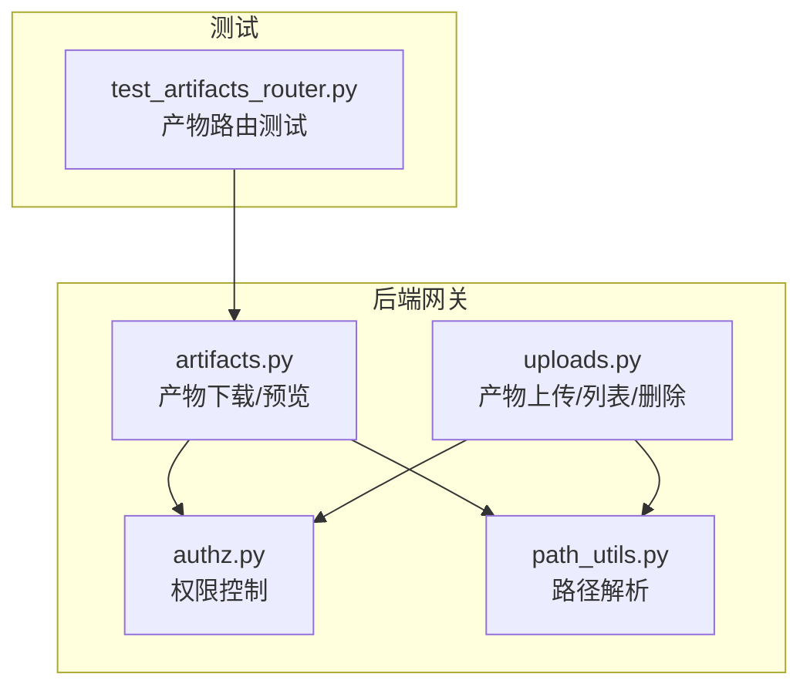
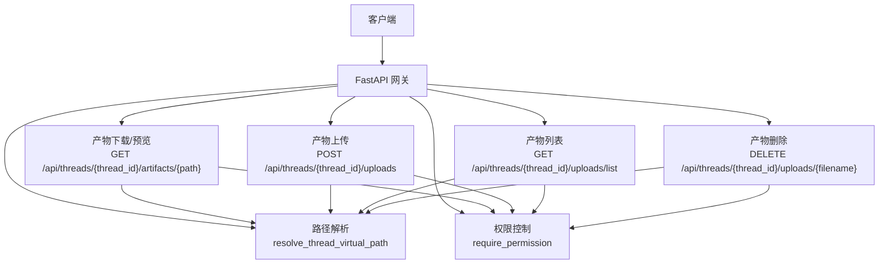
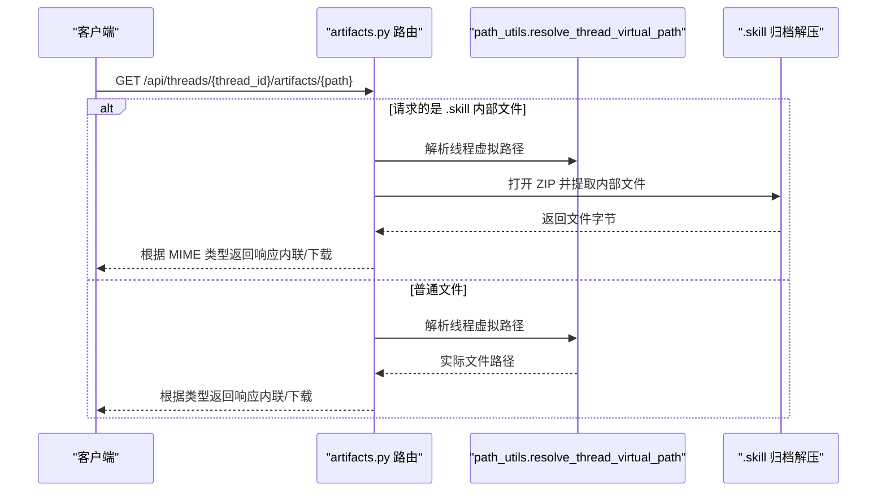
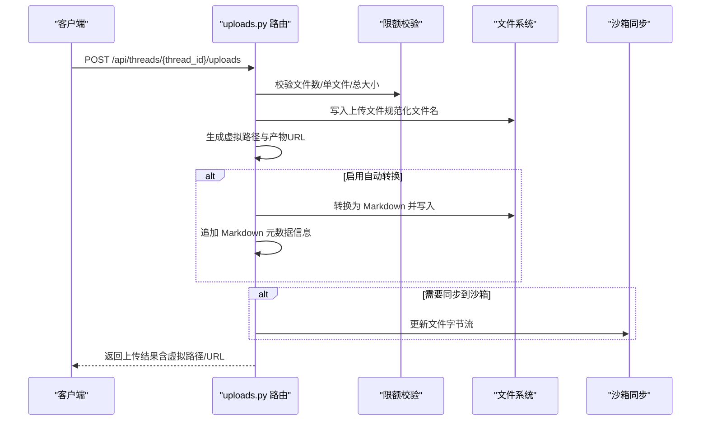
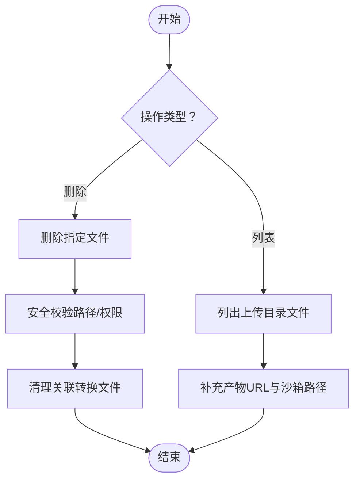
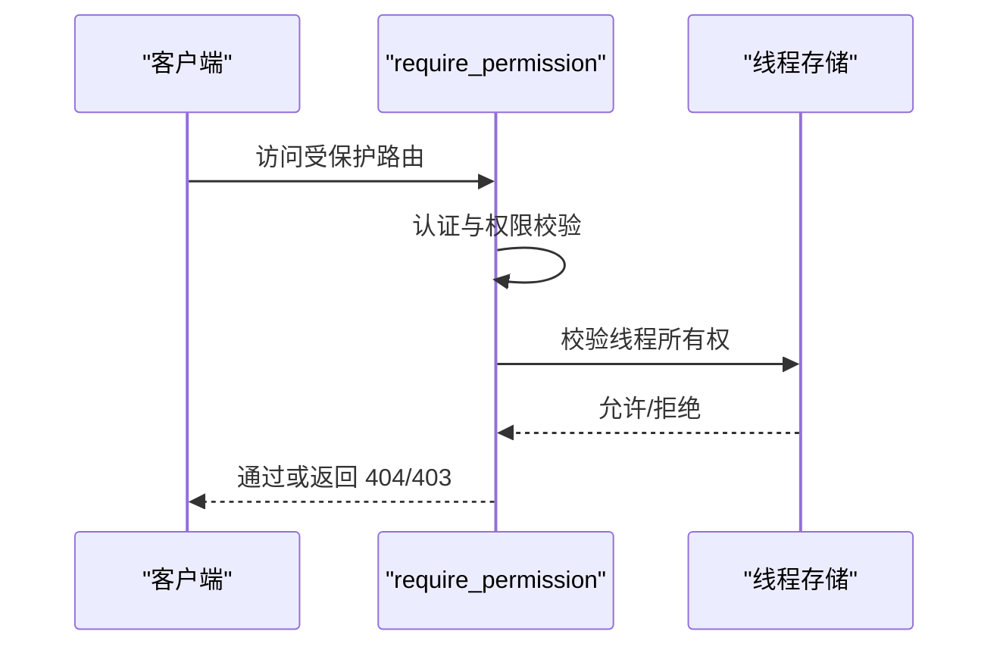
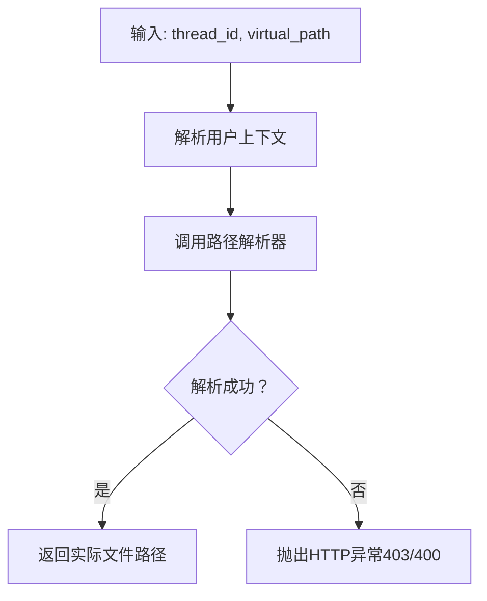
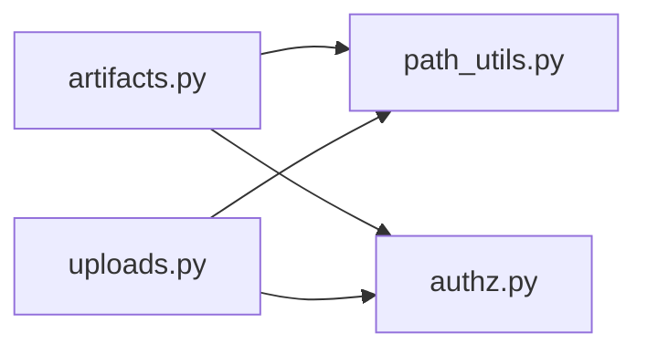

# Artifacts 路由模块

<cite>
**本文引用的文件**
- [artifacts.py](file://backend/app/gateway/routers/artifacts.py)
- [uploads.py](file://backend/app/gateway/routers/uploads.py)
- [authz.py](file://backend/app/gateway/authz.py)
- [path_utils.py](file://backend/app/gateway/path_utils.py)
- [test_artifacts_router.py](file://backend/tests/test_artifacts_router.py)
</cite>

## 目录
1. [简介](#简介)
2. [项目结构](#项目结构)
3. [核心组件](#核心组件)
4. [架构总览](#架构总览)
5. [详细组件分析](#详细组件分析)
6. [依赖分析](#依赖分析)
7. [性能考虑](#性能考虑)
8. [故障排查指南](#故障排查指南)
9. [结论](#结论)
10. [附录](#附录)

## 简介
本技术文档聚焦于 Artifacts（智能体产物）路由模块的设计与实现，覆盖产物上传、下载、删除与预览的完整 API 流程；解释产物存储策略、访问权限控制与版本管理机制；提供产物操作 API 的使用示例与最佳实践；阐明产物与线程、运行的关联关系及产物元数据管理；并说明产物压缩、加密存储与清理策略的实现要点。

## 项目结构
Artifacts 路由模块位于后端网关层，围绕线程（thread）维度组织产物的虚拟路径解析与访问控制，并通过上传路由完成产物的写入与同步。关键文件如下：
- 后端路由：/backend/app/gateway/routers/artifacts.py（产物下载/预览）
- 后端路由：/backend/app/gateway/routers/uploads.py（产物上传/列表/删除）
- 权限控制：/backend/app/gateway/authz.py（权限装饰器与上下文）
- 路径解析：/backend/app/gateway/path_utils.py（线程虚拟路径解析）
- 单元测试：/backend/tests/test_artifacts_router.py（产物路由行为验证）

**图表来源**
- [artifacts.py:1-203](file://backend/app/gateway/routers/artifacts.py#L1-L203)
- [uploads.py:1-372](file://backend/app/gateway/routers/uploads.py#L1-L372)
- [authz.py:1-303](file://backend/app/gateway/authz.py#L1-L303)
- [path_utils.py:1-30](file://backend/app/gateway/path_utils.py#L1-L30)
- [test_artifacts_router.py](file://backend/tests/test_artifacts_router.py)

**章节来源**
- [artifacts.py:1-203](file://backend/app/gateway/routers/artifacts.py#L1-L203)
- [uploads.py:1-372](file://backend/app/gateway/routers/uploads.py#L1-L372)
- [authz.py:1-303](file://backend/app/gateway/authz.py#L1-L303)
- [path_utils.py:1-30](file://backend/app/gateway/path_utils.py#L1-L30)
- [test_artifacts_router.py](file://backend/tests/test_artifacts_router.py)

## 核心组件
- 产物下载/预览路由（GET /api/threads/{thread_id}/artifacts/{path:path}）
  - 支持普通文件内联显示、强制下载、活动内容（HTML/XHTML/SVG）强制附件下载
  - 支持 .skill 归档内部文件的提取与预览，带大小限制与缓存头
- 产物上传路由（POST /api/threads/{thread_id}/uploads）
  - 多文件上传、限额校验、安全命名、自动转换（可选）、沙箱同步
- 产物删除路由（DELETE /api/threads/{thread_id}/uploads/{filename}）
  - 基于线程目录的安全删除，支持关联 Markdown 转换文件的清理
- 产物列表路由（GET /api/threads/{thread_id}/uploads/list）
  - 列出线程上传目录中的文件清单
- 权限控制（require_permission）
  - 基于资源“threads”与动作“read/write/delete”的授权，支持所有者检查
- 路径解析（resolve_thread_virtual_path）
  - 将线程内的虚拟路径解析到宿主文件系统，防止路径穿越

**章节来源**
- [artifacts.py:99-203](file://backend/app/gateway/routers/artifacts.py#L99-L203)
- [uploads.py:189-372](file://backend/app/gateway/routers/uploads.py#L189-L372)
- [authz.py:198-303](file://backend/app/gateway/authz.py#L198-L303)
- [path_utils.py:11-30](file://backend/app/gateway/path_utils.py#L11-L30)

## 架构总览
Artifacts 模块围绕“线程”作为产物归属单位，采用虚拟路径隔离与权限控制双保险，确保产物在多租户场景下的安全与可追溯性。

**图表来源**
- [artifacts.py:15-203](file://backend/app/gateway/routers/artifacts.py#L15-L203)
- [uploads.py:34-372](file://backend/app/gateway/routers/uploads.py#L34-L372)
- [authz.py:198-303](file://backend/app/gateway/authz.py#L198-L303)
- [path_utils.py:11-30](file://backend/app/gateway/path_utils.py#L11-L30)

## 详细组件分析

### 产物下载/预览（GET /api/threads/{thread_id}/artifacts/{path:path}）
- 功能要点
  - 自动识别 MIME 类型与内容类型，决定内联显示或强制下载
  - 对活动内容（HTML/XHTML/SVG）强制以附件形式下载，避免脚本执行风险
  - 支持 .skill 归档内部文件的提取与预览，内置大小上限与分块读取
  - 提供缓存头以减少重复 ZIP 解压开销
- 关键流程
  - 若请求路径包含“.skill/”，则解析归档路径与内部文件名，从 ZIP 中提取目标文件
  - 否则解析线程虚拟路径，定位实际文件并进行类型判断与响应构造
- 安全与合规
  - 使用路径解析函数进行安全校验，拒绝越权与路径穿越
  - 对文本内容进行二进制特征检测，避免错误判定导致的 XSS 风险

**图表来源**
- [artifacts.py:99-203](file://backend/app/gateway/routers/artifacts.py#L99-L203)
- [path_utils.py:11-30](file://backend/app/gateway/path_utils.py#L11-L30)

**章节来源**
- [artifacts.py:99-203](file://backend/app/gateway/routers/artifacts.py#L99-L203)
- [path_utils.py:11-30](file://backend/app/gateway/path_utils.py#L11-L30)

### 产物上传（POST /api/threads/{thread_id}/uploads）
- 功能要点
  - 多文件上传，支持单文件大小、总大小与文件数量的限额控制
  - 文件名规范化与去重，生成唯一安全文件名
  - 可选自动文档转换（如 PDF/DOCX→Markdown），并同步到沙箱
  - 上传完成后对文件权限进行调整，确保沙箱可读
- 关键流程
  - 校验上传参数与限额
  - 创建线程上传目录并写入文件
  - 记录虚拟路径与产物 URL，必要时生成 Markdown 元数据文件
  - 在非挂载模式下同步至沙箱，设置可写/可读权限
- 元数据与版本
  - 上传接口返回每个文件的虚拟路径与产物 URL，便于后续检索与版本追踪
  - 删除接口支持清理关联转换文件，保持产物集合一致性

**图表来源**
- [uploads.py:189-322](file://backend/app/gateway/routers/uploads.py#L189-L322)

**章节来源**
- [uploads.py:189-322](file://backend/app/gateway/routers/uploads.py#L189-L322)

### 产物列表与删除（GET /api/threads/{thread_id}/uploads/list 与 DELETE /api/threads/{thread_id}/uploads/{filename}）
- 列表接口
  - 返回线程上传目录中的文件清单，并补充沙箱相对路径与产物 URL
- 删除接口
  - 基于线程目录的安全删除，支持关联转换文件的清理
  - 对路径穿越与非法路径进行严格校验

**图表来源**
- [uploads.py:336-372](file://backend/app/gateway/routers/uploads.py#L336-L372)

**章节来源**
- [uploads.py:336-372](file://backend/app/gateway/routers/uploads.py#L336-L372)

### 权限控制与访问模型
- 资源与动作
  - threads:read / threads:write / threads:delete
- 装饰器链
  - require_auth（认证）+ require_permission（授权）+ owner_check（所有者校验）
- 线程级访问
  - 通过线程存储检查当前用户是否拥有目标线程的所有权，未找到或所有权不符返回 404

**图表来源**
- [authz.py:198-303](file://backend/app/gateway/authz.py#L198-L303)

**章节来源**
- [authz.py:198-303](file://backend/app/gateway/authz.py#L198-L303)

### 路径解析与安全
- 虚拟路径解析
  - 将线程内的虚拟路径映射到宿主文件系统，结合用户上下文与路径配置进行安全校验
- 路径穿越防护
  - 解析失败时根据错误类型返回 403（越权）或 400（无效路径）

**图表来源**
- [path_utils.py:11-30](file://backend/app/gateway/path_utils.py#L11-L30)

**章节来源**
- [path_utils.py:11-30](file://backend/app/gateway/path_utils.py#L11-L30)

## 依赖分析
- 组件耦合
  - artifacts 路由依赖 path_utils 进行路径解析，依赖 authz 进行权限控制
  - uploads 路由同样依赖 path_utils 与 authz，并依赖 deerflow.uploads.* 工具集完成上传、清理与转换
- 外部依赖
  - FastAPI（路由与响应）
  - Python 标准库（zipfile、mimetypes、pathlib 等）
- 循环依赖
  - 当前模块间无循环导入迹象

**图表来源**
- [artifacts.py:10-11](file://backend/app/gateway/routers/artifacts.py#L10-L11)
- [uploads.py:16-29](file://backend/app/gateway/routers/uploads.py#L16-L29)
- [path_utils.py:7-8](file://backend/app/gateway/path_utils.py#L7-L8)
- [authz.py:38-41](file://backend/app/gateway/authz.py#L38-L41)

**章节来源**
- [artifacts.py:10-11](file://backend/app/gateway/routers/artifacts.py#L10-L11)
- [uploads.py:16-29](file://backend/app/gateway/routers/uploads.py#L16-L29)
- [path_utils.py:7-8](file://backend/app/gateway/path_utils.py#L7-L8)
- [authz.py:38-41](file://backend/app/gateway/authz.py#L38-L41)

## 性能考虑
- 下载性能
  - 文本文件优先使用纯文本响应，减少不必要的二进制读取
  - 活动内容强制下载，避免浏览器内联渲染带来的额外解析开销
- 预览性能
  - .skill 归档预览使用分块读取与大小上限，防止内存峰值过高
  - 缓存头用于降低重复访问的 ZIP 解压成本
- 上传性能
  - 分块写入（默认 8KB）平衡内存占用与磁盘 IO
  - 自动转换仅在启用时触发，避免不必要的 CPU 开销
- 存储与清理
  - 删除接口支持清理关联转换文件，保持存储整洁
  - 上传完成后统一设置可读权限，减少沙箱读取失败重试

[本节为通用性能建议，不直接分析具体文件，故无“章节来源”]

## 故障排查指南
- 404 未找到
  - 下载：请求路径不存在或不是文件
  - 预览：.skill 内部文件不存在
  - 删除：目标文件不存在
- 403/400 路径错误
  - 路径穿越或虚拟路径解析失败
- 413 超限
  - 单文件过大、总上传超限、.skill 成员过大
- 权限不足
  - 未登录或缺少 threads:read/write/delete 权限
- 沙箱同步失败
  - 非挂载模式下沙箱不可用或更新失败

**章节来源**
- [artifacts.py:176-203](file://backend/app/gateway/routers/artifacts.py#L176-L203)
- [uploads.py:142-171](file://backend/app/gateway/routers/uploads.py#L142-L171)
- [uploads.py:355-372](file://backend/app/gateway/routers/uploads.py#L355-L372)
- [authz.py:231-299](file://backend/app/gateway/authz.py#L231-299)

## 结论
Artifacts 路由模块通过严格的权限控制与路径解析，实现了线程维度的产物安全托管；上传、下载、删除与预览 API 设计清晰，兼顾易用性与安全性；配合沙箱同步与可选文档转换，满足多样化的产物管理需求。建议在生产环境中开启自动转换与缓存头策略，同时定期清理不再使用的产物以优化存储与性能。

[本节为总结性内容，不直接分析具体文件，故无“章节来源”]

## 附录

### API 行为与示例（路径引用）
- 下载产物（内联/下载）
  - 示例：GET /api/threads/{thread_id}/artifacts/mnt/user-data/outputs/notes.txt
  - 强制下载：GET /api/threads/{thread_id}/artifacts/mnt/user-data/outputs/data.csv?download=true
  - 活动内容始终下载：HTML/XHTML/SVG
  - 参考：[artifacts.py:99-203](file://backend/app/gateway/routers/artifacts.py#L99-L203)
- 预览 .skill 归档内部文件
  - 示例：GET /api/threads/{thread_id}/artifacts/mnt/user-data/outputs/my-skill.skill/SKILL.md
  - 参考：[artifacts.py:138-175](file://backend/app/gateway/routers/artifacts.py#L138-L175)
- 上传产物
  - 示例：POST /api/threads/{thread_id}/uploads（multipart/form-data）
  - 返回：虚拟路径、产物 URL、Markdown 元数据（若启用）
  - 参考：[uploads.py:189-322](file://backend/app/gateway/routers/uploads.py#L189-L322)
- 列出产物
  - 示例：GET /api/threads/{thread_id}/uploads/list
  - 参考：[uploads.py:336-352](file://backend/app/gateway/routers/uploads.py#L336-L352)
- 删除产物
  - 示例：DELETE /api/threads/{thread_id}/uploads/{filename}
  - 参考：[uploads.py:355-372](file://backend/app/gateway/routers/uploads.py#L355-L372)

### 版本管理与元数据
- 元数据字段
  - 文件名、大小、虚拟路径、产物 URL、原始文件名（当发生重命名时）、Markdown 元数据（当启用自动转换时）
- 版本策略
  - 采用唯一文件名与虚拟路径记录，便于检索与回溯
  - 删除接口会清理关联转换文件，保持产物集合一致性

**章节来源**
- [uploads.py:257-284](file://backend/app/gateway/routers/uploads.py#L257-L284)
- [uploads.py:355-372](file://backend/app/gateway/routers/uploads.py#L355-L372)

### 存储策略与清理
- 存储位置
  - 线程上传目录（由路径解析器确定）
- 清理策略
  - 删除接口清理目标文件及其关联转换文件
  - 上传失败时自动清理已写入的部分文件
- 加密存储
  - 当前实现未包含端到端加密逻辑，建议在部署层（如文件系统加密或对象存储加密）进行增强

**章节来源**
- [uploads.py:132-140](file://backend/app/gateway/routers/uploads.py#L132-L140)
- [uploads.py:363-366](file://backend/app/gateway/routers/uploads.py#L363-L366)

### 与线程、运行的关系
- 产物归属
  - 产物与线程强绑定，所有操作均需通过线程 ID 限定作用域
- 运行集成
  - 上传接口返回的虚拟路径与产物 URL 可用于后续消息与运行事件中引用该产物
- 测试验证
  - 单元测试覆盖产物路由的关键行为，确保权限、路径与响应正确性

**章节来源**
- [test_artifacts_router.py](file://backend/tests/test_artifacts_router.py)