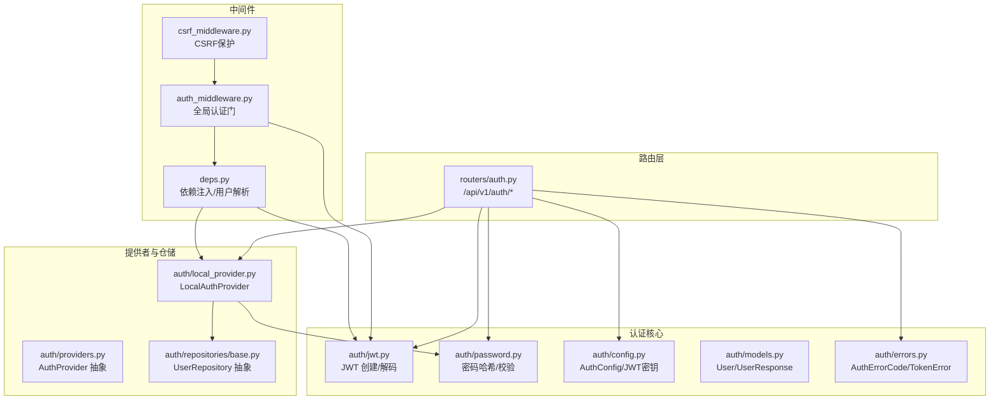
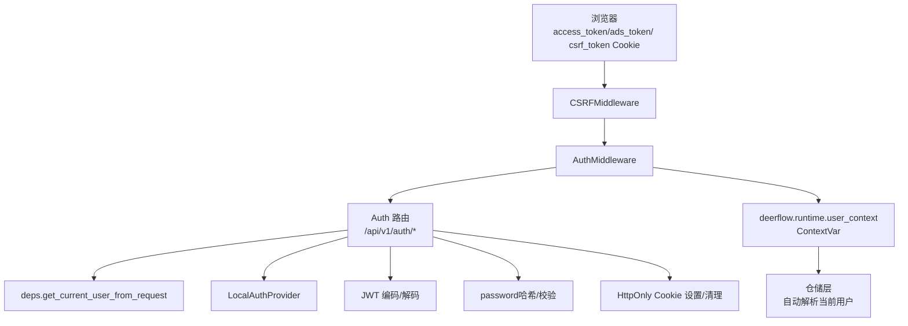
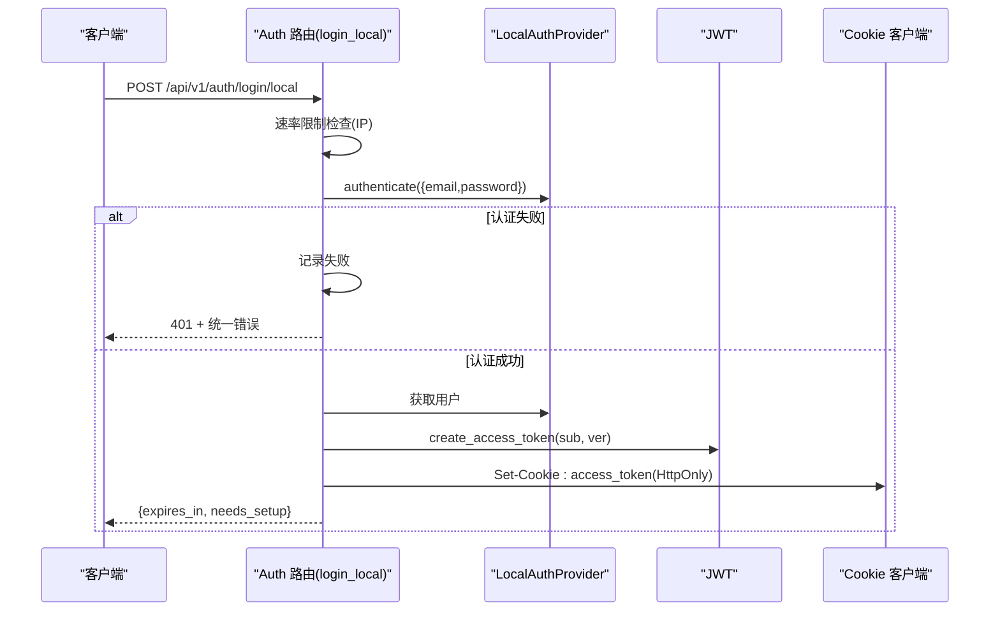
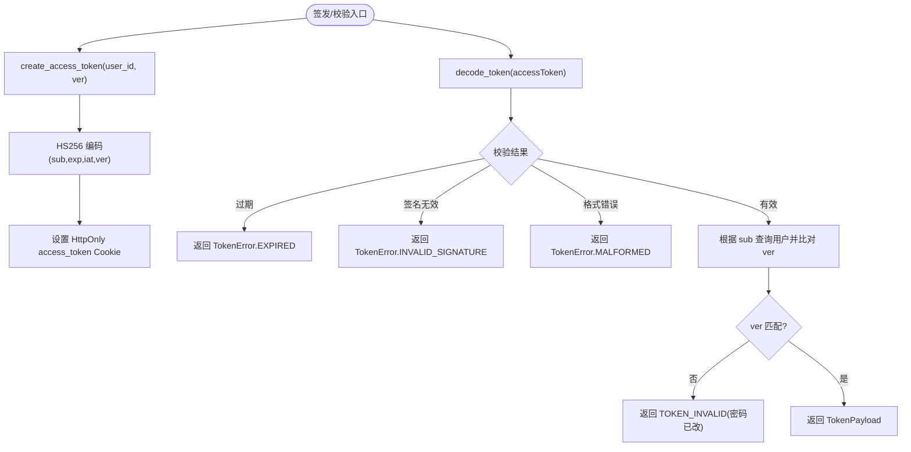
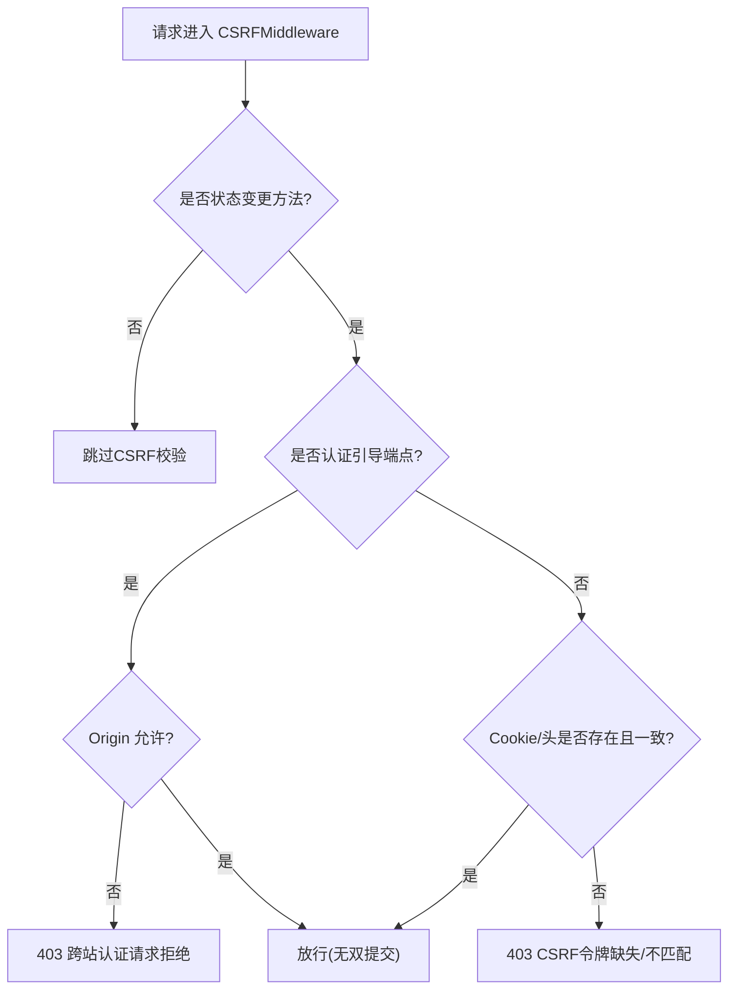
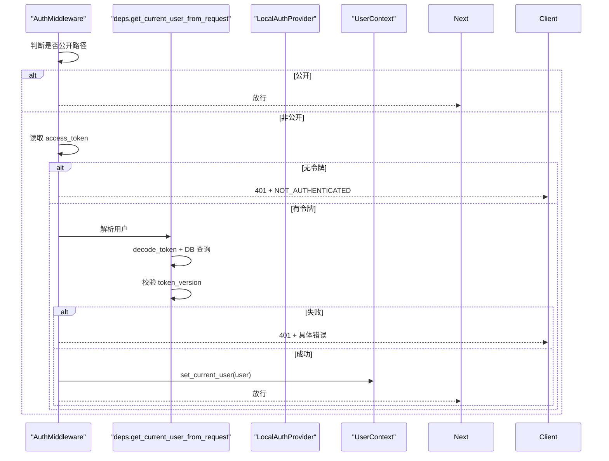
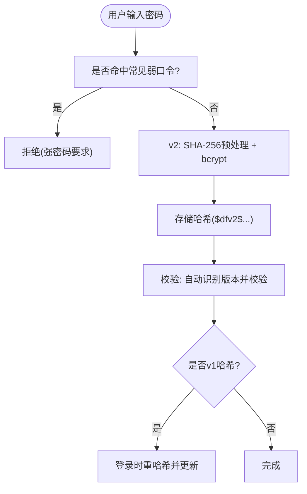
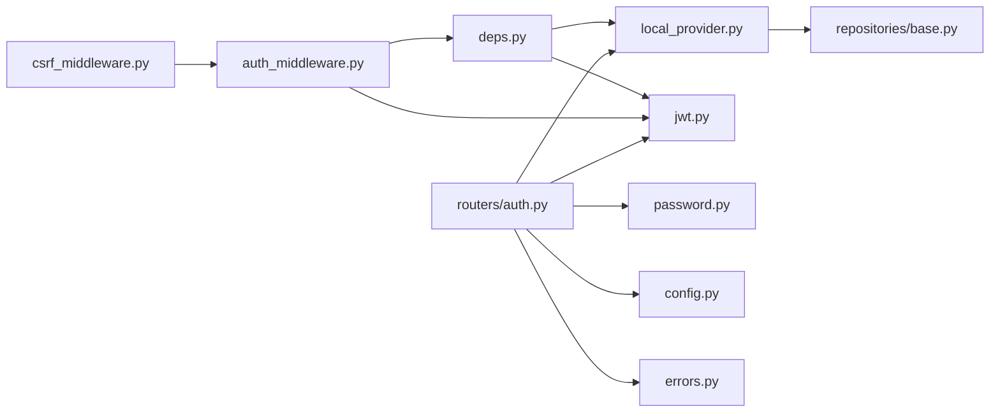

# Auth 路由模块

<cite>
**本文引用的文件**
- [backend/app/gateway/routers/auth.py](file://backend/app/gateway/routers/auth.py)
- [backend/app/gateway/auth/local_provider.py](file://backend/app/gateway/auth/local_provider.py)
- [backend/app/gateway/auth/jwt.py](file://backend/app/gateway/auth/jwt.py)
- [backend/app/gateway/auth/password.py](file://backend/app/gateway/auth/password.py)
- [backend/app/gateway/auth/providers.py](file://backend/app/gateway/auth/providers.py)
- [backend/app/gateway/auth/models.py](file://backend/app/gateway/auth/models.py)
- [backend/app/gateway/auth/config.py](file://backend/app/gateway/auth/config.py)
- [backend/app/gateway/auth_middleware.py](file://backend/app/gateway/auth_middleware.py)
- [backend/app/gateway/csrf_middleware.py](file://backend/app/gateway/csrf_middleware.py)
- [backend/app/gateway/deps.py](file://backend/app/gateway/deps.py)
- [backend/app/gateway/auth/errors.py](file://backend/app/gateway/auth/errors.py)
- [backend/app/gateway/auth/repositories/base.py](file://backend/app/gateway/auth/repositories/base.py)
- [backend/tests/test_auth.py](file://backend/tests/test_auth.py)
- [backend/tests/test_auth_middleware.py](file://backend/tests/test_auth_middleware.py)
- [backend/docs/AUTH_DESIGN.md](file://backend/docs/AUTH_DESIGN.md)
</cite>

## 目录
1. [简介](#简介)
2. [项目结构](#项目结构)
3. [核心组件](#核心组件)
4. [架构总览](#架构总览)
5. [详细组件分析](#详细组件分析)
6. [依赖关系分析](#依赖关系分析)
7. [性能考量](#性能考量)
8. [故障排查指南](#故障排查指南)
9. [结论](#结论)
10. [附录](#附录)

## 简介
本文件为 DeerFlow 后端网关中 Auth 路由模块的权威技术文档。内容涵盖用户认证与授权的路由设计、登录/注册/令牌刷新/注销等 API 端点、JWT 令牌管理、CSRF 保护、权限验证机制、认证中间件工作原理、用户会话生命周期管理、安全策略、密码加密与账户锁定实现细节。文档同时提供本地认证、第三方认证占位流程与管理员初始化流程的说明，并给出面向开发者的最佳实践与排障建议。

## 项目结构
Auth 路由模块位于后端网关的路由层与认证子系统之间，主要文件组织如下：
- 路由层：/backend/app/gateway/routers/auth.py 提供 /api/v1/auth 下的认证相关端点
- 认证核心：jwt.py（令牌）、password.py（密码哈希）、config.py（配置）、models.py（用户模型）
- 认证提供者：local_provider.py（本地邮箱/密码）、providers.py（抽象接口）、repositories/base.py（仓储接口）
- 中间件：auth_middleware.py（全局认证门）、csrf_middleware.py（CSRF 保护）、deps.py（依赖注入与用户解析）
- 错误模型：errors.py（统一错误响应）

图表来源
- [backend/app/gateway/routers/auth.py:1-529](file://backend/app/gateway/routers/auth.py#L1-L529)
- [backend/app/gateway/auth/jwt.py:1-56](file://backend/app/gateway/auth/jwt.py#L1-L56)
- [backend/app/gateway/auth/password.py:1-82](file://backend/app/gateway/auth/password.py#L1-L82)
- [backend/app/gateway/auth/config.py:1-86](file://backend/app/gateway/auth/config.py#L1-L86)
- [backend/app/gateway/auth/models.py:1-42](file://backend/app/gateway/auth/models.py#L1-L42)
- [backend/app/gateway/auth/local_provider.py:1-105](file://backend/app/gateway/auth/local_provider.py#L1-L105)
- [backend/app/gateway/auth/providers.py:1-25](file://backend/app/gateway/auth/providers.py#L1-L25)
- [backend/app/gateway/auth/repositories/base.py:1-108](file://backend/app/gateway/auth/repositories/base.py#L1-L108)
- [backend/app/gateway/auth_middleware.py:1-160](file://backend/app/gateway/auth_middleware.py#L1-L160)
- [backend/app/gateway/csrf_middleware.py:1-238](file://backend/app/gateway/csrf_middleware.py#L1-L238)
- [backend/app/gateway/deps.py:1-339](file://backend/app/gateway/deps.py#L1-L339)
- [backend/app/gateway/auth/errors.py:1-46](file://backend/app/gateway/auth/errors.py#L1-L46)

章节来源
- [backend/app/gateway/routers/auth.py:1-529](file://backend/app/gateway/routers/auth.py#L1-L529)
- [backend/app/gateway/auth_middleware.py:1-160](file://backend/app/gateway/auth_middleware.py#L1-L160)
- [backend/app/gateway/csrf_middleware.py:1-238](file://backend/app/gateway/csrf_middleware.py#L1-L238)
- [backend/app/gateway/deps.py:1-339](file://backend/app/gateway/deps.py#L1-L339)

## 核心组件
- 路由器与端点
  - /api/v1/auth/login/local：本地邮箱/密码登录，返回 expires_in 与 needs_setup，设置 HttpOnly access_token Cookie
  - /api/v1/auth/register：注册普通用户并自动登录
  - /api/v1/auth/logout：清理 access_token 与 ads_token Cookie
  - /api/v1/auth/change-password：当前用户改密/邮箱变更，增量 token_version 以使旧令牌失效
  - /api/v1/auth/me：获取当前认证用户信息
  - /api/v1/auth/setup-status：检查是否需要初始化管理员
  - /api/v1/auth/initialize：首次创建管理员账户（仅当无管理员时）
  - /api/v1/auth/oauth/{provider} 与 /api/v1/auth/callback/{provider}：OAuth 占位（未实现）
- 认证提供者与仓储
  - LocalAuthProvider：基于邮箱/密码的本地认证，支持 OAuth 用户关联
  - UserRepository 抽象：用户 CRUD、计数、OAuth 查询
- JWT 与密码
  - create_access_token/decode_token：HS256 JWT，携带 sub、exp、iat、ver（token_version）
  - password.py：v2 基于 SHA-256 预处理 + bcrypt 的哈希格式，透明迁移 v1
- 中间件
  - AuthMiddleware：全局认证门，严格校验 Cookie+JWT，写入 request.state.user 与 ContextVar
  - CSRFMiddleware：双提交 Cookie + Origin 校验，对状态变更请求进行防护
- 依赖注入与用户解析
  - deps.get_current_user_from_request：从 Cookie 解析 JWT 并校验 token_version
  - deps.get_local_provider：缓存本地提供者与仓储

章节来源
- [backend/app/gateway/routers/auth.py:276-529](file://backend/app/gateway/routers/auth.py#L276-L529)
- [backend/app/gateway/auth/local_provider.py:13-105](file://backend/app/gateway/auth/local_provider.py#L13-L105)
- [backend/app/gateway/auth/jwt.py:21-56](file://backend/app/gateway/auth/jwt.py#L21-L56)
- [backend/app/gateway/auth/password.py:32-82](file://backend/app/gateway/auth/password.py#L32-L82)
- [backend/app/gateway/auth_middleware.py:53-160](file://backend/app/gateway/auth_middleware.py#L53-L160)
- [backend/app/gateway/csrf_middleware.py:175-238](file://backend/app/gateway/csrf_middleware.py#L175-L238)
- [backend/app/gateway/deps.py:251-339](file://backend/app/gateway/deps.py#L251-L339)

## 架构总览
下图展示了浏览器、中间件、路由与认证子系统的交互，以及用户上下文如何贯穿仓储与持久化层。

图表来源
- [backend/app/gateway/routers/auth.py:135-331](file://backend/app/gateway/routers/auth.py#L135-L331)
- [backend/app/gateway/auth_middleware.py:76-160](file://backend/app/gateway/auth_middleware.py#L76-L160)
- [backend/app/gateway/csrf_middleware.py:175-238](file://backend/app/gateway/csrf_middleware.py#L175-L238)
- [backend/app/gateway/deps.py:273-317](file://backend/app/gateway/deps.py#L273-L317)

章节来源
- [backend/docs/AUTH_DESIGN.md:1-332](file://backend/docs/AUTH_DESIGN.md#L1-L332)

## 详细组件分析

### 路由与端点设计
- 登录（/api/v1/auth/login/local）
  - 输入：OAuth2PasswordRequestForm（username=邮箱，password=密码）
  - 流程：速率限制检查 → 本地提供者认证 → 成功：签发 JWT（含 token_version）→ 设置 HttpOnly access_token Cookie → 返回 expires_in 与 needs_setup
  - 失败：记录失败次数 → 返回统一错误结构
- 注册（/api/v1/auth/register）
  - 输入：邮箱+密码（≥8字符，不在常见弱口令列表）
  - 流程：创建普通用户 → 签发 JWT → 设置 Cookie → 返回用户信息
- 注销（/api/v1/auth/logout）
  - 流程：删除 access_token 与 ads_token Cookie → 返回成功消息
- 改密码（/api/v1/auth/change-password）
  - 输入：当前密码、新密码（≥8字符）、可选新邮箱
  - 流程：校验当前密码 → 更新密码哈希 → token_version++ → 清理 needs_setup（若适用）→ 重新签发 Cookie → 返回成功
- 我的信息（/api/v1/auth/me）
  - 流程：解析当前用户 → 返回用户信息
- 初始化管理员（/api/v1/auth/initialize）
  - 输入：邮箱+强密码
  - 流程：若已有管理员则 409；否则创建 admin（needs_setup=false）→ 设置 Cookie → 返回用户信息
- 初始化状态（/api/v1/auth/setup-status）
  - 流程：按 IP 缓存计算管理员数量 → 返回 needs_setup

图表来源
- [backend/app/gateway/routers/auth.py:276-303](file://backend/app/gateway/routers/auth.py#L276-L303)
- [backend/app/gateway/auth/local_provider.py:24-59](file://backend/app/gateway/auth/local_provider.py#L24-L59)
- [backend/app/gateway/auth/jwt.py:21-37](file://backend/app/gateway/auth/jwt.py#L21-L37)

章节来源
- [backend/app/gateway/routers/auth.py:276-494](file://backend/app/gateway/routers/auth.py#L276-L494)

### JWT 令牌管理
- 令牌结构：sub（用户ID）、exp（过期时间）、iat（签发时间）、ver（token_version）
- 签发：create_access_token，使用 HS256 与 AuthConfig.jwt_secret
- 校验：decode_token，区分过期、签名无效、格式错误
- 版本控制：用户改密/重置后 token_version++，旧令牌立即失效
- Cookie 传输：仅通过 HttpOnly Cookie，不随响应 JSON 返回

图表来源
- [backend/app/gateway/auth/jwt.py:21-56](file://backend/app/gateway/auth/jwt.py#L21-L56)
- [backend/app/gateway/deps.py:273-317](file://backend/app/gateway/deps.py#L273-L317)

章节来源
- [backend/app/gateway/auth/jwt.py:1-56](file://backend/app/gateway/auth/jwt.py#L1-L56)
- [backend/app/gateway/deps.py:273-317](file://backend/app/gateway/deps.py#L273-L317)

### CSRF 保护机制
- 双提交 Cookie：服务端设置 csrf_token，前端发送 X-CSRF-Token 头
- 校验：secrets.compare_digest 比较 cookie 与 header
- 生效范围：POST/PUT/DELETE/PATCH 的状态变更请求
- 特例：认证引导端点（登录/注册/初始化/注销）首次调用无需双提交，但仍进行 Origin 校验防止跨站登录 CSRF 与会话固定

图表来源
- [backend/app/gateway/csrf_middleware.py:175-238](file://backend/app/gateway/csrf_middleware.py#L175-L238)

章节来源
- [backend/app/gateway/csrf_middleware.py:1-238](file://backend/app/gateway/csrf_middleware.py#L1-L238)

### 权限验证与中间件
- 全局认证门：AuthMiddleware 对非公开路径严格校验 Cookie+JWT，失败返回 401
- 公开路径：健康检查、文档、以及 /api/v1/auth/* 引导端点
- 用户上下文：解析成功后写入 request.state.user、request.state.auth 与 deerflow.runtime.user_context，下游仓储默认按当前用户解析
- 内部调用：支持 X-DeerFlow-Internal-Token 的内部用户身份

图表来源
- [backend/app/gateway/auth_middleware.py:53-160](file://backend/app/gateway/auth_middleware.py#L53-L160)
- [backend/app/gateway/deps.py:273-317](file://backend/app/gateway/deps.py#L273-L317)

章节来源
- [backend/app/gateway/auth_middleware.py:1-160](file://backend/app/gateway/auth_middleware.py#L1-L160)
- [backend/app/gateway/deps.py:273-317](file://backend/app/gateway/deps.py#L273-L317)

### 密码加密与账户安全
- 哈希格式：v2（$dfv2$ + SHA-256 预处理 + bcrypt），v1（$dfv1$ + bcrypt），裸 bcrypt 视为 v1
- 自动升级：登录时如检测到 v1 哈希则透明重哈希并更新
- 弱口令阻断：内置常见弱口令集合，注册/改密时拒绝
- 登录限速：按 IP 记录失败次数，超过阈值锁定一段时间；支持 AUTH_TRUSTED_PROXIES 解析真实客户端 IP

图表来源
- [backend/app/gateway/routers/auth.py:83-104](file://backend/app/gateway/routers/auth.py#L83-L104)
- [backend/app/gateway/auth/password.py:32-82](file://backend/app/gateway/auth/password.py#L32-L82)
- [backend/app/gateway/auth/local_provider.py:50-58](file://backend/app/gateway/auth/local_provider.py#L50-L58)

章节来源
- [backend/app/gateway/auth/password.py:1-82](file://backend/app/gateway/auth/password.py#L1-L82)
- [backend/app/gateway/routers/auth.py:158-271](file://backend/app/gateway/routers/auth.py#L158-L271)

### 第三方认证与管理员认证
- 第三方认证：/oauth/{provider} 与 /callback/{provider} 当前为占位，未实现具体提供商接入
- 管理员认证：/api/v1/auth/initialize 仅在无管理员时可用；/api/v1/auth/setup-status 返回 needs_setup 以驱动前端初始化流程

章节来源
- [backend/app/gateway/routers/auth.py:499-529](file://backend/app/gateway/routers/auth.py#L499-L529)
- [backend/app/gateway/routers/auth.py:398-453](file://backend/app/gateway/routers/auth.py#L398-L453)

### 用户会话生命周期管理
- 登录：设置 HttpOnly access_token Cookie，返回 expires_in 与 needs_setup
- 注销：删除 access_token 与 ads_token Cookie
- 令牌刷新：当前路由未提供专用刷新端点；可通过重新登录获得新令牌
- 会话失效：改密/重置导致 token_version 增长，旧令牌被拒绝

章节来源
- [backend/app/gateway/routers/auth.py:135-331](file://backend/app/gateway/routers/auth.py#L135-L331)
- [backend/app/gateway/deps.py:273-317](file://backend/app/gateway/deps.py#L273-L317)

## 依赖关系分析
- 路由层依赖认证提供者与仓储接口，通过 deps.get_local_provider 获取缓存实例
- 认证提供者依赖密码工具与仓储实现
- 中间件依赖 deps 解析用户并写入 ContextVar
- CSRF 与认证中间件共同构成安全边界

图表来源
- [backend/app/gateway/routers/auth.py:1-529](file://backend/app/gateway/routers/auth.py#L1-L529)
- [backend/app/gateway/auth/local_provider.py:1-105](file://backend/app/gateway/auth/local_provider.py#L1-L105)
- [backend/app/gateway/auth/jwt.py:1-56](file://backend/app/gateway/auth/jwt.py#L1-L56)
- [backend/app/gateway/auth/password.py:1-82](file://backend/app/gateway/auth/password.py#L1-L82)
- [backend/app/gateway/auth/config.py:1-86](file://backend/app/gateway/auth/config.py#L1-L86)
- [backend/app/gateway/auth/errors.py:1-46](file://backend/app/gateway/auth/errors.py#L1-L46)
- [backend/app/gateway/auth/repositories/base.py:1-108](file://backend/app/gateway/auth/repositories/base.py#L1-L108)
- [backend/app/gateway/auth_middleware.py:1-160](file://backend/app/gateway/auth_middleware.py#L1-L160)
- [backend/app/gateway/csrf_middleware.py:1-238](file://backend/app/gateway/csrf_middleware.py#L1-L238)
- [backend/app/gateway/deps.py:1-339](file://backend/app/gateway/deps.py#L1-L339)

章节来源
- [backend/app/gateway/routers/auth.py:1-529](file://backend/app/gateway/routers/auth.py#L1-L529)
- [backend/app/gateway/auth_middleware.py:1-160](file://backend/app/gateway/auth_middleware.py#L1-L160)
- [backend/app/gateway/csrf_middleware.py:1-238](file://backend/app/gateway/csrf_middleware.py#L1-L238)
- [backend/app/gateway/deps.py:1-339](file://backend/app/gateway/deps.py#L1-L339)

## 性能考量
- 密码哈希采用异步线程池包装，避免阻塞事件循环
- 登录限速使用内存字典，单进程精确，多进程需共享存储（如 Redis/数据库）以实现全局限速
- setup-status 端点对稳定结果做缓存与去抖，减少多标签页重连风暴带来的压力

章节来源
- [backend/app/gateway/auth/password.py:66-82](file://backend/app/gateway/auth/password.py#L66-L82)
- [backend/app/gateway/routers/auth.py:158-271](file://backend/app/gateway/routers/auth.py#L158-L271)
- [backend/app/gateway/routers/auth.py:398-453](file://backend/app/gateway/routers/auth.py#L398-L453)

## 故障排查指南
- 401 未认证
  - 检查是否命中公开路径、是否设置了 HttpOnly access_token Cookie
  - 若为内部调用，确认 X-DeerFlow-Internal-Token 正确
- 401 令牌错误
  - 过期：decode_token 返回 EXPIRED
  - 签名无效/格式错误：INVALID_SIGNATURE/MALFORMED
  - 用户不存在：USER_NOT_FOUND
  - token_version 不匹配：TOKEN_INVALID（密码已改）
- CSRF 403
  - 状态变更请求缺少 X-CSRF-Token 或与 Cookie 不一致
  - 认证引导端点存在跨站 Origin，被拒绝
- 登录失败过多
  - 检查 AUTH_TRUSTED_PROXIES 配置是否正确解析真实客户端 IP
  - 查看限速字典大小与淘汰策略

章节来源
- [backend/app/gateway/auth_middleware.py:116-148](file://backend/app/gateway/auth_middleware.py#L116-L148)
- [backend/app/gateway/deps.py:287-317](file://backend/app/gateway/deps.py#L287-L317)
- [backend/app/gateway/csrf_middleware.py:175-238](file://backend/app/gateway/csrf_middleware.py#L175-L238)
- [backend/app/gateway/routers/auth.py:226-271](file://backend/app/gateway/routers/auth.py#L226-L271)
- [backend/tests/test_auth_middleware.py:164-170](file://backend/tests/test_auth_middleware.py#L164-L170)

## 结论
Auth 路由模块通过严格的全局认证门、CSRF 保护与 JWT 版本控制，构建了安全可靠的多用户认证基础。本地邮箱/密码登录、注册、改密与初始化流程清晰完整；密码哈希与弱口令阻断提升了整体安全性；会话生命周期通过 HttpOnly Cookie 与 token_version 机制得到良好管理。第三方认证与全局限速等能力可在后续迭代中进一步完善。

## 附录
- 关键端点一览
  - POST /api/v1/auth/login/local：本地登录
  - POST /api/v1/auth/register：注册
  - POST /api/v1/auth/logout：注销
  - POST /api/v1/auth/change-password：改密/邮箱变更
  - GET /api/v1/auth/me：获取当前用户
  - GET /api/v1/auth/setup-status：初始化状态
  - POST /api/v1/auth/initialize：创建管理员
  - GET /api/v1/auth/oauth/{provider} 与 /api/v1/auth/callback/{provider}：OAuth 占位
- 相关设计文档参考
  - AUTH_DESIGN.md：认证与隔离设计、用户模型、运行时身份、CSRF、用户隔离、内部调用与迁移策略

章节来源
- [backend/docs/AUTH_DESIGN.md:1-332](file://backend/docs/AUTH_DESIGN.md#L1-L332)