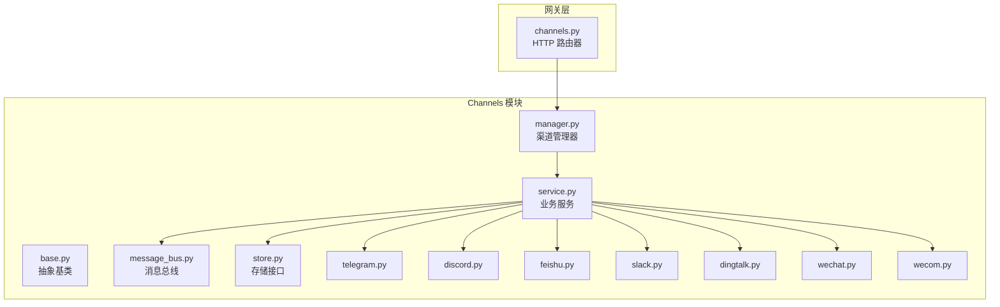
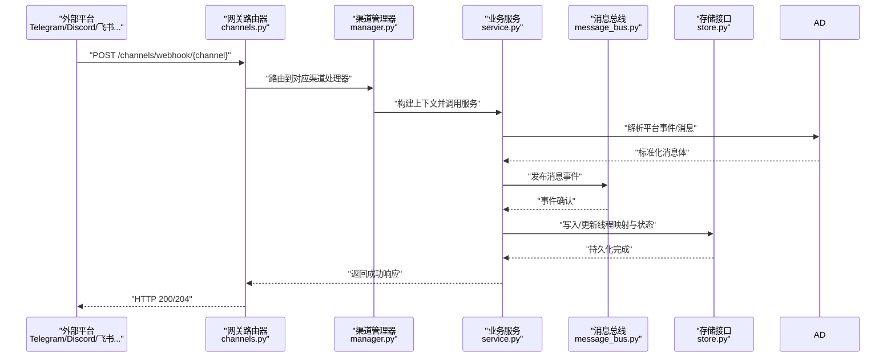
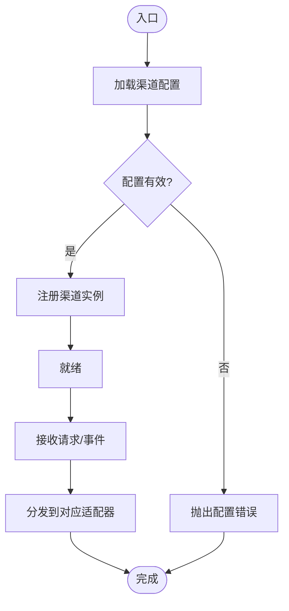
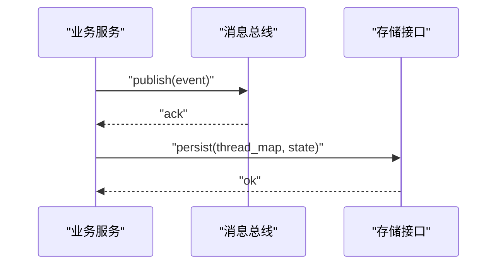
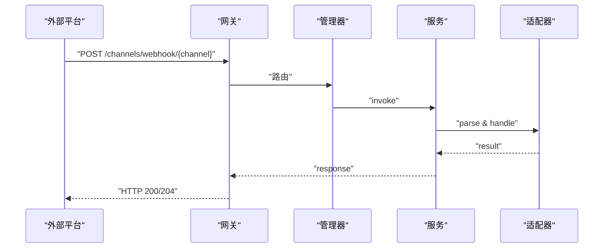
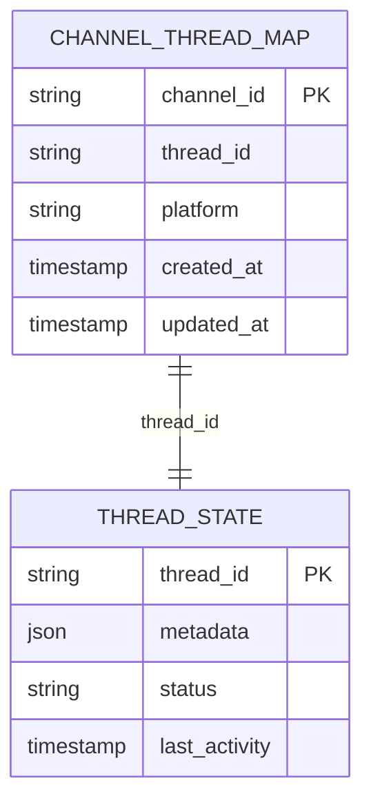
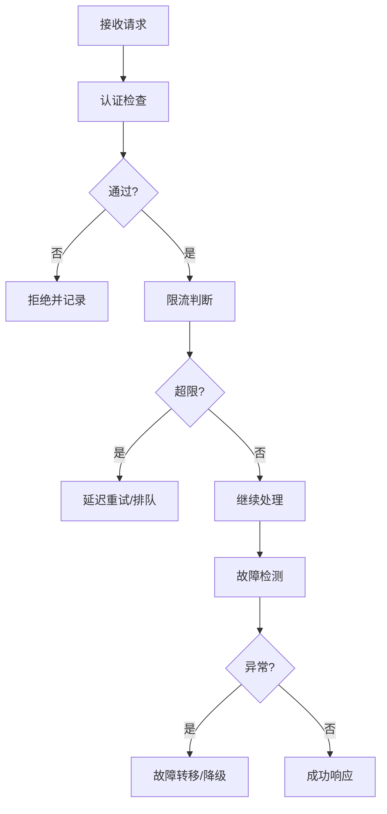
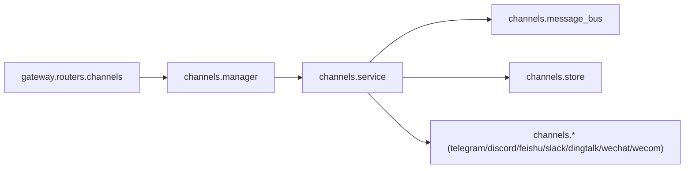

# Channels 路由模块

<cite>
**本文档引用的文件**
- [backend/app/channels/base.py](file://backend/app/channels/base.py)
- [backend/app/channels/manager.py](file://backend/app/channels/manager.py)
- [backend/app/channels/service.py](file://backend/app/channels/service.py)
- [backend/app/channels/message_bus.py](file://backend/app/channels/message_bus.py)
- [backend/app/channels/store.py](file://backend/app/channels/store.py)
- [backend/app/channels/telegram.py](file://backend/app/channels/telegram.py)
- [backend/app/channels/discord.py](file://backend/app/channels/discord.py)
- [backend/app/channels/feishu.py](file://backend/app/channels/feishu.py)
- [backend/app/channels/slack.py](file://backend/app/channels/slack.py)
- [backend/app/channels/dingtalk.py](file://backend/app/channels/dingtalk.py)
- [backend/app/channels/wechat.py](file://backend/app/channels/wechat.py)
- [backend/app/channels/wecom.py](file://backend/app/channels/wecom.py)
- [backend/app/gateway/routers/channels.py](file://backend/app/gateway/routers/channels.py)
- [docs/channels/README.md](file://docs/channels/README.md)
- [docs/channels/TELEGRAM.md](file://docs/channels/TELEGRAM.md)
- [docs/channels/DISCORD.md](file://docs/channels/DISCORD.md)
- [docs/channels/FEISHU.md](file://docs/channels/FEISHU.md)
- [docs/channels/SLACK.md](file://docs/channels/SLACK.md)
</cite>

## 更新摘要
**变更内容**
- 系统架构简化：移除了复杂的通道连接系统，从用户作用域改为纯代理作用域
- 功能精简：删除了用户拥有身份绑定、运行时配置存储、连接身份管理等复杂功能
- 实现简化：保留基础的渠道管理、消息转发和事件处理能力
- 配置简化：移除了浏览器连接 API 和数据持久化能力

## 目录
1. [简介](#简介)
2. [项目结构](#项目结构)
3. [核心组件](#核心组件)
4. [架构总览](#架构总览)
5. [详细组件分析](#详细组件分析)
6. [依赖关系分析](#依赖关系分析)
7. [性能考虑](#性能考虑)
8. [故障排查指南](#故障排查指南)
9. [结论](#结论)
10. [附录](#附录)

## 简介
本技术文档面向 Channels 路由模块，系统性阐述多平台即时通讯渠道（Telegram、Slack、飞书、Discord、钉钉、微信、企业微信等）的路由设计与实现。重点覆盖以下方面：
- 渠道配置管理：统一的渠道注册、参数校验与生命周期管理
- 消息转发与事件处理：消息总线驱动的消息分发、事件解析与路由
- 渠道连接 API：Webhook 配置、消息接收与状态同步
- 线程映射与一致性：跨平台消息在会话线程中的映射与一致性保障
- 安全与可靠性：认证、速率限制与故障转移策略

**更新** 系统架构大幅简化，移除了复杂的通道连接系统，从用户作用域改为纯代理作用域，保留基础的渠道管理能力。

## 项目结构
Channels 模块位于后端应用的 channels 子目录中，采用"平台适配器 + 统一服务层"的分层设计。网关层通过路由器暴露渠道相关的 HTTP 接口，测试用例覆盖各平台的集成行为。系统架构已简化，移除了复杂的连接管理系统。



**图表来源**
- [backend/app/gateway/routers/channels.py](file://backend/app/gateway/routers/channels.py)
- [backend/app/channels/base.py](file://backend/app/channels/base.py)
- [backend/app/channels/manager.py](file://backend/app/channels/manager.py)
- [backend/app/channels/service.py](file://backend/app/channels/service.py)
- [backend/app/channels/message_bus.py](file://backend/app/channels/message_bus.py)
- [backend/app/channels/store.py](file://backend/app/channels/store.py)

**章节来源**
- [backend/app/gateway/routers/channels.py](file://backend/app/gateway/routers/channels.py)
- [backend/app/channels/base.py](file://backend/app/channels/base.py)
- [backend/app/channels/manager.py](file://backend/app/channels/manager.py)
- [backend/app/channels/service.py](file://backend/app/channels/service.py)
- [backend/app/channels/message_bus.py](file://backend/app/channels/message_bus.py)
- [backend/app/channels/store.py](file://backend/app/channels/store.py)

## 核心组件
- 抽象基类与适配器模式：所有具体渠道（Telegram、Discord、飞书等）均继承自统一的抽象基类，确保一致的初始化、认证、消息解析与发送流程。
- 渠道管理器：负责渠道实例的注册、生命周期管理、配置校验与错误处理。
- 业务服务：封装消息转发、事件聚合、线程映射与状态同步逻辑；协调消息总线与存储层。
- 消息总线：解耦消息接收与处理，支持异步事件分发与幂等处理。
- 存储接口：提供渠道配置、会话元数据与持久化能力，支撑跨平台一致性。
- 网关路由器：对外暴露 HTTP 接口，接收各平台 Webhook 请求并交由服务层处理。

**章节来源**
- [backend/app/channels/base.py](file://backend/app/channels/base.py)
- [backend/app/channels/manager.py](file://backend/app/channels/manager.py)
- [backend/app/channels/service.py](file://backend/app/channels/service.py)
- [backend/app/channels/message_bus.py](file://backend/app/channels/message_bus.py)
- [backend/app/channels/store.py](file://backend/app/channels/store.py)
- [backend/app/gateway/routers/channels.py](file://backend/app/gateway/routers/channels.py)

## 架构总览
下图展示了从网关到各渠道适配器的整体调用链路，强调消息从 Webhook 到线程映射再到下游处理的完整流程。系统架构已简化，移除了复杂的连接管理系统。



**图表来源**
- [backend/app/gateway/routers/channels.py](file://backend/app/gateway/routers/channels.py)
- [backend/app/channels/manager.py](file://backend/app/channels/manager.py)
- [backend/app/channels/service.py](file://backend/app/channels/service.py)
- [backend/app/channels/message_bus.py](file://backend/app/channels/message_bus.py)
- [backend/app/channels/store.py](file://backend/app/channels/store.py)
- [backend/app/channels/telegram.py](file://backend/app/channels/telegram.py)
- [backend/app/channels/discord.py](file://backend/app/channels/discord.py)
- [backend/app/channels/feishu.py](file://backend/app/channels/feishu.py)

## 详细组件分析

### 渠道抽象与适配器
- 抽象基类定义了渠道通用接口：初始化、认证、消息解析、发送、状态同步等。
- 各平台适配器实现平台特定的事件解析与消息格式转换，保证上层服务以统一方式处理。

```mermaid
classDiagram
class ChannelBase {
"+initialize()"
"+authenticate()"
"+parse_event(raw)"
"+send_message(msg)"
"+sync_status(state)"
}
class TelegramAdapter {
"+parse_event(raw)"
"+send_message(msg)"
"+webhook_handler()"
}
class DiscordAdapter {
"+parse_event(raw)"
"+send_message(msg)"
"+interactions_handler()"
}
class FeishuAdapter {
"+parse_event(raw)"
"+send_message(msg)"
"+challenge_handler()"
}
ChannelBase <|-- TelegramAdapter
ChannelBase <|-- DiscordAdapter
ChannelBase <|-- FeishuAdapter
```

**图表来源**
- [backend/app/channels/base.py](file://backend/app/channels/base.py)
- [backend/app/channels/telegram.py](file://backend/app/channels/telegram.py)
- [backend/app/channels/discord.py](file://backend/app/channels/discord.py)
- [backend/app/channels/feishu.py](file://backend/app/channels/feishu.py)

**章节来源**
- [backend/app/channels/base.py](file://backend/app/channels/base.py)
- [backend/app/channels/telegram.py](file://backend/app/channels/telegram.py)
- [backend/app/channels/discord.py](file://backend/app/channels/discord.py)
- [backend/app/channels/feishu.py](file://backend/app/channels/feishu.py)

### 渠道管理器
- 负责渠道实例的注册、配置校验、并发控制与错误恢复。
- 提供统一的生命周期钩子，便于扩展新渠道或调整现有渠道行为。



**图表来源**
- [backend/app/channels/manager.py](file://backend/app/channels/manager.py)

**章节来源**
- [backend/app/channels/manager.py](file://backend/app/channels/manager.py)

### 业务服务与消息总线
- 业务服务聚合来自不同渠道的消息，进行去重、幂等与线程映射。
- 消息总线负责事件的异步分发，避免阻塞主流程，提升吞吐。



**图表来源**
- [backend/app/channels/service.py](file://backend/app/channels/service.py)
- [backend/app/channels/message_bus.py](file://backend/app/channels/message_bus.py)
- [backend/app/channels/store.py](file://backend/app/channels/store.py)

**章节来源**
- [backend/app/channels/service.py](file://backend/app/channels/service.py)
- [backend/app/channels/message_bus.py](file://backend/app/channels/message_bus.py)
- [backend/app/channels/store.py](file://backend/app/channels/store.py)

### 渠道连接 API 与 Webhook 处理
- 网关路由器提供统一的 Webhook 入口，按渠道类型路由至对应处理器。
- 各平台适配器实现平台特定的验证与回调处理（如挑战握手、交互式事件等）。



**图表来源**
- [backend/app/gateway/routers/channels.py](file://backend/app/gateway/routers/channels.py)
- [backend/app/channels/manager.py](file://backend/app/channels/manager.py)
- [backend/app/channels/service.py](file://backend/app/channels/service.py)
- [backend/app/channels/telegram.py](file://backend/app/channels/telegram.py)
- [backend/app/channels/discord.py](file://backend/app/channels/discord.py)
- [backend/app/channels/feishu.py](file://backend/app/channels/feishu.py)

**章节来源**
- [backend/app/gateway/routers/channels.py](file://backend/app/gateway/routers/channels.py)
- [backend/app/channels/telegram.py](file://backend/app/channels/telegram.py)
- [backend/app/channels/discord.py](file://backend/app/channels/discord.py)
- [backend/app/channels/feishu.py](file://backend/app/channels/feishu.py)

### 线程映射与跨平台一致性
- 业务服务维护"渠道标识 → 线程标识"的映射表，确保同一对话在不同渠道间保持一致的上下文。
- 存储接口负责持久化该映射与状态，支持重启后的恢复与一致性校验。



**图表来源**
- [backend/app/channels/service.py](file://backend/app/channels/service.py)
- [backend/app/channels/store.py](file://backend/app/channels/store.py)

**章节来源**
- [backend/app/channels/service.py](file://backend/app/channels/service.py)
- [backend/app/channels/store.py](file://backend/app/channels/store.py)

### 认证、速率限制与故障转移
- 认证：各适配器在初始化时执行平台级认证（如令牌校验、签名验证），失败即拒绝请求。
- 速率限制：服务层对同一线程/用户在短时间内的请求进行限流，防止平台封禁或拥塞。
- 故障转移：当某渠道不可用时，服务层记录错误并尝试降级处理（如本地缓存、延迟重试），同时通知监控系统。



**图表来源**
- [backend/app/channels/service.py](file://backend/app/channels/service.py)
- [backend/app/channels/telegram.py](file://backend/app/channels/telegram.py)
- [backend/app/channels/discord.py](file://backend/app/channels/discord.py)
- [backend/app/channels/feishu.py](file://backend/app/channels/feishu.py)

**章节来源**
- [backend/app/channels/service.py](file://backend/app/channels/service.py)
- [backend/app/channels/telegram.py](file://backend/app/channels/telegram.py)
- [backend/app/channels/discord.py](file://backend/app/channels/discord.py)
- [backend/app/channels/feishu.py](file://backend/app/channels/feishu.py)

## 依赖关系分析
Channels 模块内部依赖清晰，遵循"适配器 + 服务 + 总线 + 存储"的分层原则；网关层仅负责路由，不直接参与业务逻辑，降低耦合度。系统架构已简化，移除了复杂的连接管理系统。



**图表来源**
- [backend/app/gateway/routers/channels.py](file://backend/app/gateway/routers/channels.py)
- [backend/app/channels/manager.py](file://backend/app/channels/manager.py)
- [backend/app/channels/service.py](file://backend/app/channels/service.py)
- [backend/app/channels/message_bus.py](file://backend/app/channels/message_bus.py)
- [backend/app/channels/store.py](file://backend/app/channels/store.py)

**章节来源**
- [backend/app/gateway/routers/channels.py](file://backend/app/gateway/routers/channels.py)
- [backend/app/channels/manager.py](file://backend/app/channels/manager.py)
- [backend/app/channels/service.py](file://backend/app/channels/service.py)
- [backend/app/channels/message_bus.py](file://backend/app/channels/message_bus.py)
- [backend/app/channels/store.py](file://backend/app/channels/store.py)

## 性能考虑
- 异步处理：消息总线采用异步事件分发，减少请求阻塞，提高吞吐。
- 幂等与去重：服务层对重复事件进行幂等处理，避免重复写入与资源浪费。
- 缓存与批处理：对频繁查询的映射关系进行缓存，并在可能的情况下合并写入操作。
- 超时与重试：对下游平台调用设置合理超时与指数退避重试，降低抖动影响。
- 监控与告警：关键指标（错误率、延迟、队列长度）纳入监控，异常时自动触发告警。

## 故障排查指南
- Webhook 无法接收：检查网关路由是否正确、平台回调地址是否匹配、证书与域名配置。
- 认证失败：核对渠道密钥、签名算法与时间戳容差，确保请求头与签名一致。
- 消息未到达：查看消息总线队列积压情况、服务日志与存储写入结果，定位阻塞点。
- 线程错乱：检查线程映射表是否被意外覆盖，确认幂等键生成规则与冲突处理。
- 平台限流：观察服务层限流统计，调整并发与重试策略，必要时启用备用渠道。

**章节来源**
- [backend/tests/test_channels.py](file://backend/tests/test_channels.py)
- [backend/tests/test_discord_channel.py](file://backend/tests/test_discord_channel.py)
- [backend/tests/test_dingtalk_channel.py](file://backend/tests/test_dingtalk_channel.py)

## 结论
Channels 路由模块通过抽象基类与适配器模式实现了多平台渠道的统一接入，结合消息总线与存储接口，提供了高可用、可扩展且具备跨平台一致性的消息路由能力。系统架构已简化，移除了复杂的连接管理系统，保留了基础的渠道管理能力，能够稳定支撑复杂场景下的即时通讯需求。

## 附录
- 平台接入文档参考：
  - [文档：渠道总览](file://docs/channels/README.md)
  - [文档：Telegram 接入](file://docs/channels/TELEGRAM.md)
  - [文档：Discord 接入](file://docs/channels/DISCORD.md)
  - [文档：飞书 接入](file://docs/channels/FEISHU.md)
  - [文档：Slack 接入](file://docs/channels/SLACK.md)