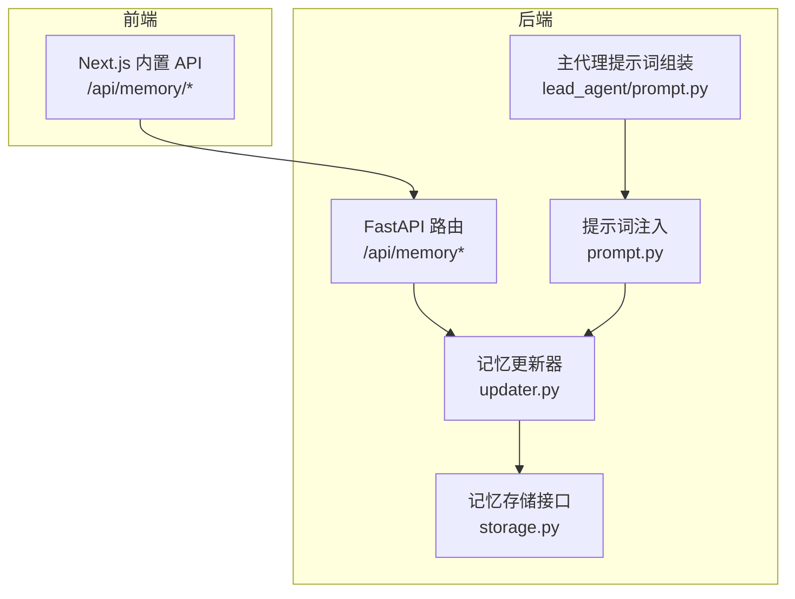
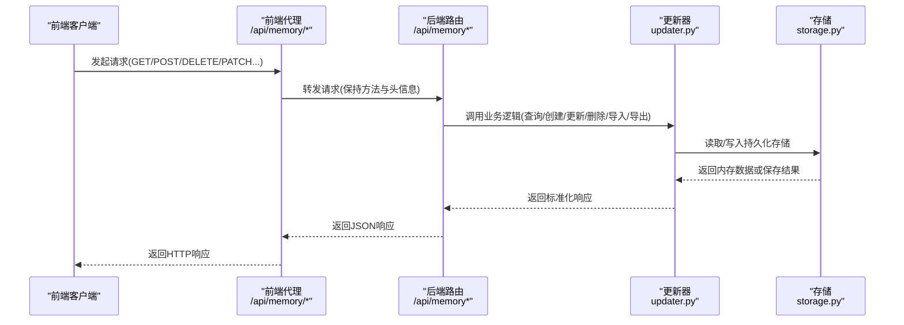
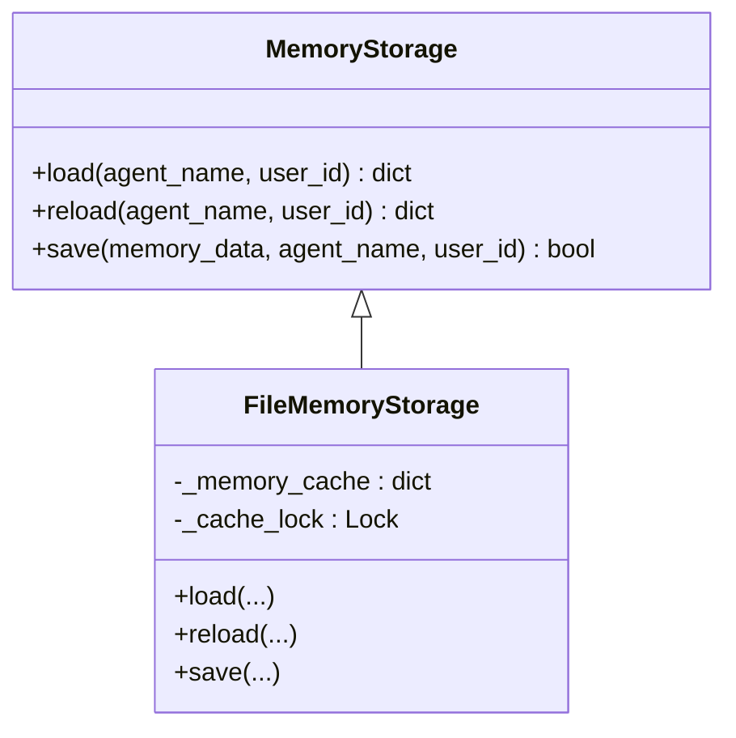
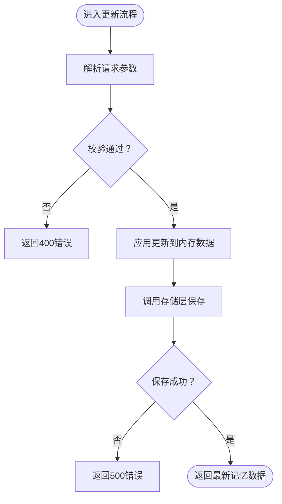
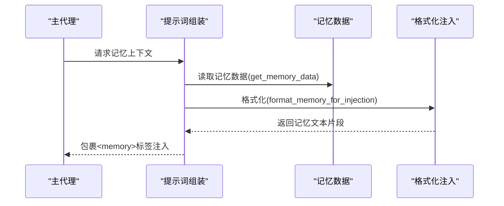
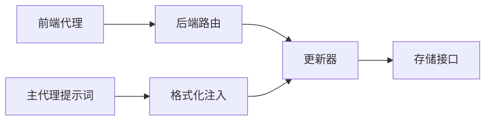

# Memory 路由模块

<cite>
**本文引用的文件**
- [backend/app/gateway/routers/memory.py](file://backend/app/gateway/routers/memory.py)
- [frontend/src/app/api/memory/route.ts](file://frontend/src/app/api/memory/route.ts)
- [backend/packages/harness/deerflow/agents/memory/storage.py](file://backend/packages/harness/deerflow/agents/memory/storage.py)
- [backend/packages/harness/deerflow/agents/memory/updater.py](file://backend/packages/harness/deerflow/agents/memory/updater.py)
- [backend/packages/harness/deerflow/agents/memory/prompt.py](file://backend/packages/harness/deerflow/agents/memory/prompt.py)
- [backend/packages/harness/deerflow/agents/lead_agent/prompt.py](file://backend/packages/harness/deerflow/agents/lead_agent/prompt.py)
- [backend/docs/MEMORY_IMPROVEMENTS.md](file://backend/docs/MEMORY_IMPROVEMENTS.md)
- [backend/docs/MEMORY_IMPROVEMENTS_SUMMARY.md](file://backend/docs/MEMORY_IMPROVEMENTS_SUMMARY.md)
- [backend/tests/test_memory_storage.py](file://backend/tests/test_memory_storage.py)
- [backend/tests/test_memory_prompt_injection.py](file://backend/tests/test_memory_prompt_injection.py)
- [frontend/src/components/workspace/settings/memory-settings-page.tsx](file://frontend/src/components/workspace/settings/memory-settings-page.tsx)
</cite>

## 目录
1. [简介](#简介)
2. [项目结构](#项目结构)
3. [核心组件](#核心组件)
4. [架构总览](#架构总览)
5. [详细组件分析](#详细组件分析)
6. [依赖分析](#依赖分析)
7. [性能考虑](#性能考虑)
8. [故障排查指南](#故障排查指南)
9. [结论](#结论)
10. [附录](#附录)

## 简介
本技术文档聚焦于 Memory 路由模块，系统性阐述长期记忆管理的路由设计与实现，覆盖以下方面：
- 记忆查询、更新与清理的 API 端点与行为
- 记忆存储策略、索引与检索现状及未来规划
- 上下文注入、记忆提取与相关性评分（当前基于置信度，计划引入 TF-IDF）
- 记忆与线程、智能体的关联关系
- 记忆持久化与并发安全机制
- 去重、过期策略与隐私保护建议

## 项目结构
Memory 路由模块由后端 FastAPI 路由、前端 Next.js 代理、内存/文件存储、更新器与提示词注入等子系统组成。整体采用“路由层 → 业务层 → 存储层”的分层架构。

图示来源
- [backend/app/gateway/routers/memory.py:110-357](file://backend/app/gateway/routers/memory.py#L110-L357)
- [frontend/src/app/api/memory/route.ts:1-36](file://frontend/src/app/api/memory/route.ts#L1-L36)
- [backend/packages/harness/deerflow/agents/memory/storage.py:43-214](file://backend/packages/harness/deerflow/agents/memory/storage.py#L43-L214)
- [backend/packages/harness/deerflow/agents/memory/updater.py:613-642](file://backend/packages/harness/deerflow/agents/memory/updater.py#L613-L642)
- [backend/packages/harness/deerflow/agents/memory/prompt.py](file://backend/packages/harness/deerflow/agents/memory/prompt.py)
- [backend/packages/harness/deerflow/agents/lead_agent/prompt.py:557-591](file://backend/packages/harness/deerflow/agents/lead_agent/prompt.py#L557-L591)

章节来源
- [backend/app/gateway/routers/memory.py:1-357](file://backend/app/gateway/routers/memory.py#L1-L357)
- [frontend/src/app/api/memory/route.ts:1-36](file://frontend/src/app/api/memory/route.ts#L1-L36)

## 核心组件
- 路由层：提供记忆查询、导入导出、事实增删改、配置与状态获取等端点
- 更新器：负责用户上下文、历史背景与事实的写入/更新/删除
- 存储层：抽象存储接口与文件存储实现，支持缓存与并发安全
- 提示词注入：将记忆内容格式化并注入到主代理提示词中
- 前端代理：将 /api/memory 请求转发至后端

章节来源
- [backend/app/gateway/routers/memory.py:110-357](file://backend/app/gateway/routers/memory.py#L110-L357)
- [backend/packages/harness/deerflow/agents/memory/storage.py:43-214](file://backend/packages/harness/deerflow/agents/memory/storage.py#L43-L214)
- [backend/packages/harness/deerflow/agents/memory/updater.py:613-642](file://backend/packages/harness/deerflow/agents/memory/updater.py#L613-L642)
- [backend/packages/harness/deerflow/agents/memory/prompt.py](file://backend/packages/harness/deerflow/agents/memory/prompt.py)
- [frontend/src/app/api/memory/route.ts:1-36](file://frontend/src/app/api/memory/route.ts#L1-L36)

## 架构总览
Memory 路由模块围绕“用户级全局记忆”展开，支持按用户隔离的记忆空间，并通过配置控制是否启用记忆、是否注入到提示词、最大注入 token 数等。

图示来源
- [frontend/src/app/api/memory/route.ts:10-27](file://frontend/src/app/api/memory/route.ts#L10-L27)
- [backend/app/gateway/routers/memory.py:110-357](file://backend/app/gateway/routers/memory.py#L110-L357)
- [backend/packages/harness/deerflow/agents/memory/storage.py:62-190](file://backend/packages/harness/deerflow/agents/memory/storage.py#L62-L190)
- [backend/packages/harness/deerflow/agents/memory/updater.py:613-642](file://backend/packages/harness/deerflow/agents/memory/updater.py#L613-L642)

## 详细组件分析

### 路由端点与数据模型
- 查询记忆：GET /api/memory
- 刷新记忆：POST /api/memory/reload
- 清空记忆：DELETE /api/memory
- 创建事实：POST /api/memory/facts
- 删除事实：DELETE /api/memory/facts/{fact_id}
- 更新事实：PATCH /api/memory/facts/{fact_id}
- 导出记忆：GET /api/memory/export
- 导入记忆：POST /api/memory/import
- 获取配置：GET /api/memory/config
- 获取状态：GET /api/memory/status

数据模型要点
- 用户上下文(UserContext)：工作、个人、心头想法三段式摘要
- 历史上下文(HistoryContext)：近期、早期、长期背景三段式摘要
- 事实(Fact)：唯一ID、内容、类别、置信度、创建时间、来源线程、错误说明
- 响应(MemoryResponse)：版本、最后更新时间、用户/历史/事实集合
- 配置(MemoryConfigResponse)：开关、存储路径、防抖秒数、最大事实数、置信度阈值、是否注入、最大注入token

章节来源
- [backend/app/gateway/routers/memory.py:21-108](file://backend/app/gateway/routers/memory.py#L21-L108)
- [backend/app/gateway/routers/memory.py:110-357](file://backend/app/gateway/routers/memory.py#L110-L357)

### 记忆存储策略与持久化
- 抽象存储接口：定义 load/reload/save 规范
- 文件存储实现：基于 JSON 文件，带缓存与锁保护
- 缓存键：(user_id, agent_name)，值为(数据, 文件mtime)
- 并发安全：使用线程锁保护 _memory_cache 的读写
- 持久化流程：先写临时文件，再原子替换；失败时记录日志且不污染缓存
- 错误处理：OSError 统一映射为 5xx 错误码

图示来源
- [backend/packages/harness/deerflow/agents/memory/storage.py:43-214](file://backend/packages/harness/deerflow/agents/memory/storage.py#L43-L214)

章节来源
- [backend/packages/harness/deerflow/agents/memory/storage.py:62-190](file://backend/packages/harness/deerflow/agents/memory/storage.py#L62-L190)
- [backend/tests/test_memory_storage.py:117-173](file://backend/tests/test_memory_storage.py#L117-L173)

### 记忆更新与事实管理
- 用户上下文/历史更新：仅当请求包含 shouldUpdate 且摘要非空时才更新，并设置 updatedAt
- 事实删除：按 fact_id 批量移除
- 事实创建/更新：支持最小长度校验、置信度范围校验、错误映射为 400
- 防抖与批量：通过队列与定时器合并更新（测试覆盖用户隔离）

图示来源
- [backend/app/gateway/routers/memory.py:192-259](file://backend/app/gateway/routers/memory.py#L192-L259)
- [backend/packages/harness/deerflow/agents/memory/updater.py:613-642](file://backend/packages/harness/deerflow/agents/memory/updater.py#L613-L642)

章节来源
- [backend/app/gateway/routers/memory.py:192-259](file://backend/app/gateway/routers/memory.py#L192-L259)
- [backend/packages/harness/deerflow/agents/memory/updater.py:613-642](file://backend/packages/harness/deerflow/agents/memory/updater.py#L613-L642)
- [backend/tests/test_memory_queue_user_isolation.py:68-79](file://backend/tests/test_memory_queue_user_isolation.py#L68-L79)

### 记忆检索与上下文注入
- 当前实现：按置信度降序排序的事实列表，按 tiktoken 估算 token 数，不超过 max_injection_tokens
- 注入位置：在主代理提示词中包裹 <memory>...</memory>
- 可配置项：enabled、injection_enabled、max_injection_tokens
- 测试验证：回归覆盖事实包含、置信度顺序、token 限额

图示来源
- [backend/packages/harness/deerflow/agents/lead_agent/prompt.py:557-591](file://backend/packages/harness/deerflow/agents/lead_agent/prompt.py#L557-L591)
- [backend/packages/harness/deerflow/agents/memory/prompt.py](file://backend/packages/harness/deerflow/agents/memory/prompt.py)
- [backend/docs/MEMORY_IMPROVEMENTS.md:19-66](file://backend/docs/MEMORY_IMPROVEMENTS.md#L19-L66)
- [backend/docs/MEMORY_IMPROVEMENTS_SUMMARY.md:1-39](file://backend/docs/MEMORY_IMPROVEMENTS_SUMMARY.md#L1-L39)

章节来源
- [backend/packages/harness/deerflow/agents/lead_agent/prompt.py:557-591](file://backend/packages/harness/deerflow/agents/lead_agent/prompt.py#L557-L591)
- [backend/packages/harness/deerflow/agents/memory/prompt.py](file://backend/packages/harness/deerflow/agents/memory/prompt.py)
- [backend/docs/MEMORY_IMPROVEMENTS.md:1-66](file://backend/docs/MEMORY_IMPROVEMENTS.md#L1-L66)
- [backend/docs/MEMORY_IMPROVEMENTS_SUMMARY.md:1-39](file://backend/docs/MEMORY_IMPROVEMENTS_SUMMARY.md#L1-L39)
- [backend/tests/test_memory_prompt_injection.py](file://backend/tests/test_memory_prompt_injection.py)

### API 使用示例与最佳实践
- 查询当前记忆：GET /api/memory
- 刷新缓存：POST /api/memory/reload
- 清空记忆：DELETE /api/memory
- 创建事实：POST /api/memory/facts（content、category、confidence）
- 更新事实：PATCH /api/memory/facts/{fact_id}（可选字段）
- 删除事实：DELETE /api/memory/facts/{fact_id}
- 导入/导出：POST /api/memory/import、GET /api/memory/export
- 获取配置：GET /api/memory/config
- 获取状态：GET /api/memory/status

章节来源
- [backend/app/gateway/routers/memory.py:110-357](file://backend/app/gateway/routers/memory.py#L110-L357)

### 与线程、智能体的关联
- 用户隔离：所有操作均通过 get_effective_user_id() 解析当前用户，确保多租户隔离
- 全局/按智能体：存储接口支持 agent_name 参数，当前路由默认使用全局（None）
- 线程元数据：线程存储提供按线程维度的用户归属与访问控制，便于后续将记忆与线程绑定

章节来源
- [backend/app/gateway/routers/memory.py:15-16](file://backend/app/gateway/routers/memory.py#L15-L16)
- [backend/packages/harness/deerflow/persistence/thread_meta/memory.py:41-102](file://backend/packages/harness/deerflow/persistence/thread_meta/memory.py#L41-L102)

### 去重、过期与隐私
- 去重：删除事实时按 id 移除；建议在上游创建时对重复内容进行去重
- 过期：当前未实现自动过期策略，建议通过定期任务或外部调度清理低置信度/过期事实
- 隐私：前端页面提供清空记忆能力；建议结合线程元数据与访问控制限制记忆可见范围

章节来源
- [backend/app/gateway/routers/memory.py:216-232](file://backend/app/gateway/routers/memory.py#L216-L232)
- [frontend/src/components/workspace/settings/memory-settings-page.tsx:272-303](file://frontend/src/components/workspace/settings/memory-settings-page.tsx#L272-L303)

## 依赖分析
- 路由依赖更新器与配置读取
- 更新器依赖存储接口与用户上下文
- 提示词注入依赖记忆数据与格式化函数
- 前端代理依赖后端基础地址环境变量

图示来源
- [frontend/src/app/api/memory/route.ts:1-36](file://frontend/src/app/api/memory/route.ts#L1-L36)
- [backend/app/gateway/routers/memory.py:1-18](file://backend/app/gateway/routers/memory.py#L1-L18)
- [backend/packages/harness/deerflow/agents/memory/updater.py:613-642](file://backend/packages/harness/deerflow/agents/memory/updater.py#L613-L642)
- [backend/packages/harness/deerflow/agents/memory/storage.py:43-214](file://backend/packages/harness/deerflow/agents/memory/storage.py#L43-L214)
- [backend/packages/harness/deerflow/agents/lead_agent/prompt.py:557-591](file://backend/packages/harness/deerflow/agents/lead_agent/prompt.py#L557-L591)

章节来源
- [backend/app/gateway/routers/memory.py:1-18](file://backend/app/gateway/routers/memory.py#L1-L18)
- [backend/packages/harness/deerflow/agents/memory/storage.py:43-214](file://backend/packages/harness/deerflow/agents/memory/storage.py#L43-L214)
- [backend/packages/harness/deerflow/agents/lead_agent/prompt.py:557-591](file://backend/packages/harness/deerflow/agents/lead_agent/prompt.py#L557-L591)

## 性能考虑
- Token 估算：优先使用 tiktoken，失败时回退为字符长度估算，避免额外依赖问题
- 缓存命中：文件存储内置缓存与 mtime 校验，减少磁盘 IO
- 并发安全：缓存读写加锁，避免竞态
- 防抖与批处理：通过队列合并频繁更新，降低写入频率

章节来源
- [backend/docs/MEMORY_IMPROVEMENTS.md:32-34](file://backend/docs/MEMORY_IMPROVEMENTS.md#L32-L34)
- [backend/packages/harness/deerflow/agents/memory/storage.py:62-190](file://backend/packages/harness/deerflow/agents/memory/storage.py#L62-L190)
- [backend/tests/test_memory_storage.py:117-173](file://backend/tests/test_memory_storage.py#L117-L173)

## 故障排查指南
- 400 错误：事实内容为空或置信度越界，检查请求体字段
- 404 错误：事实不存在，确认 fact_id 正确
- 500 错误：存储写入失败（如磁盘满），查看后端日志
- 注入无效：确认 enabled 与 injection_enabled 均为 true，且 max_injection_tokens > 0
- 缓存异常：强制调用 /api/memory/reload 刷新缓存

章节来源
- [backend/app/gateway/routers/memory.py:66-72](file://backend/app/gateway/routers/memory.py#L66-L72)
- [backend/app/gateway/routers/memory.py:171-189](file://backend/app/gateway/routers/memory.py#L171-L189)
- [backend/app/gateway/routers/memory.py:208-231](file://backend/app/gateway/routers/memory.py#L208-L231)
- [backend/app/gateway/routers/memory.py:284-287](file://backend/app/gateway/routers/memory.py#L284-L287)

## 结论
Memory 路由模块提供了完整的长期记忆生命周期管理：从查询、导入导出到事实的增删改，配合文件存储与缓存机制，满足多用户隔离与并发安全需求。当前注入策略以置信度为主，未来将引入 TF-IDF 语义相似度与上下文感知评分，进一步提升检索质量与相关性。建议结合线程元数据与访问控制完善隐私与权限管理。

## 附录
- 前端代理：将 /api/memory 请求转发至后端，保留请求头并透传响应
- 配置项：enabled、storage_path、debounce_seconds、max_facts、fact_confidence_threshold、injection_enabled、max_injection_tokens

章节来源
- [frontend/src/app/api/memory/route.ts:1-36](file://frontend/src/app/api/memory/route.ts#L1-L36)
- [backend/app/gateway/routers/memory.py:291-326](file://backend/app/gateway/routers/memory.py#L291-L326)