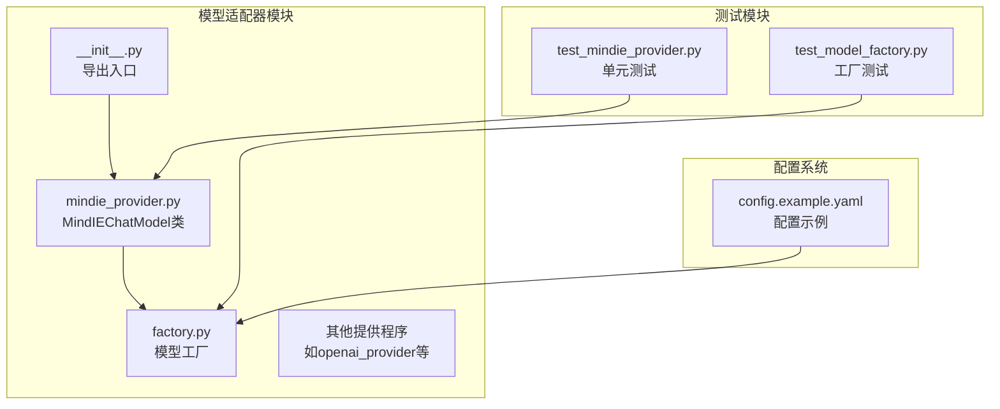
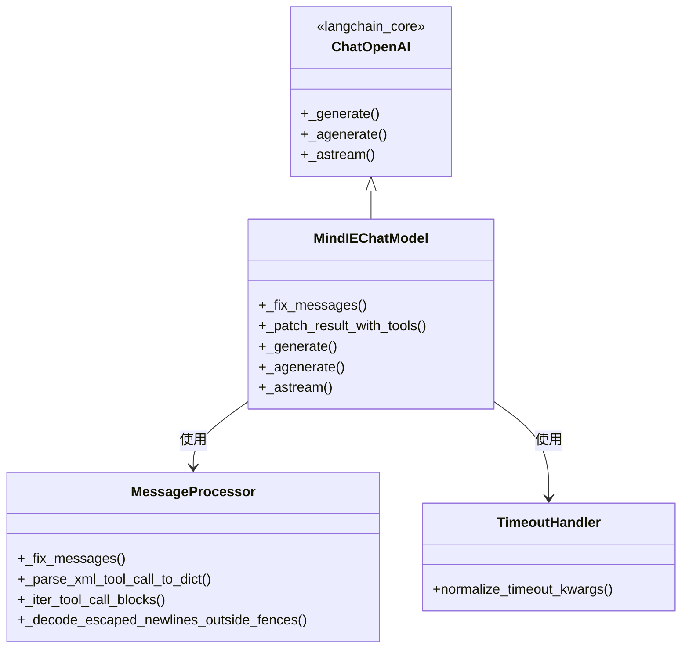
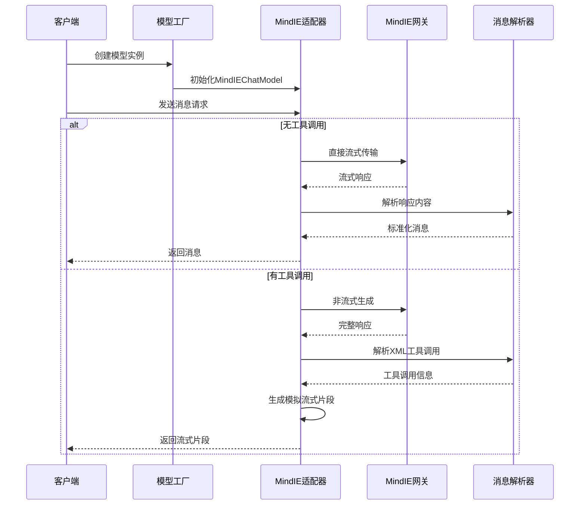
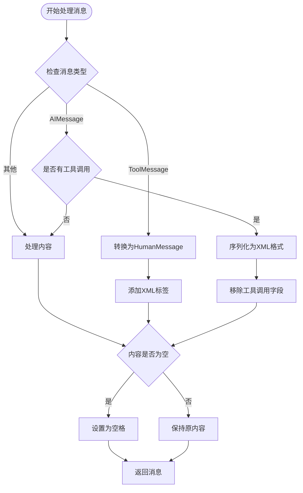
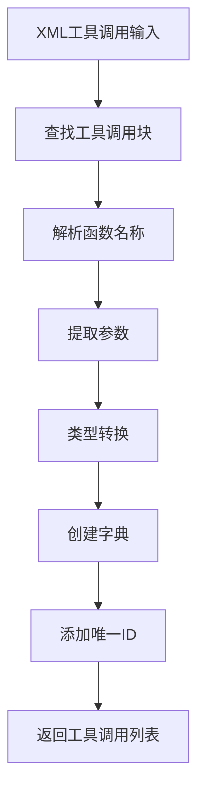
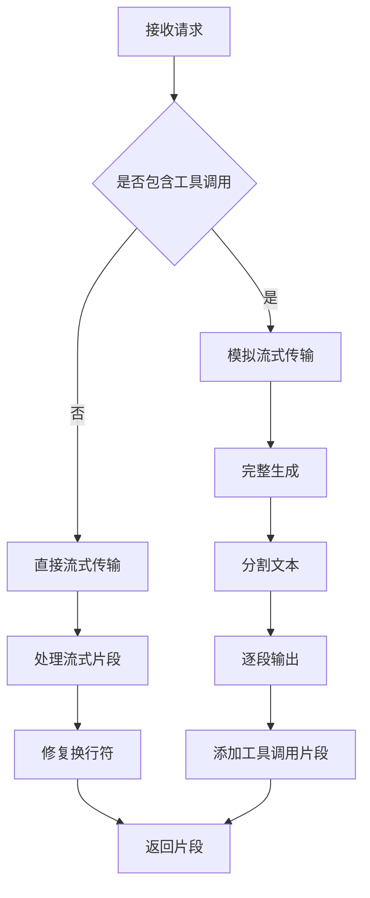
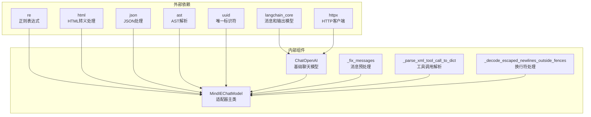
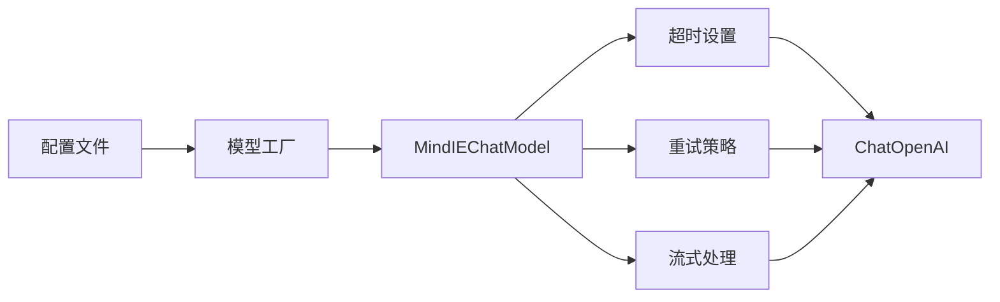

# MindIE模型提供程序

<cite>
**本文档引用的文件**
- [mindie_provider.py](file://backend/packages/harness/deerflow/models/mindie_provider.py)
- [test_mindie_provider.py](file://backend/tests/test_mindie_provider.py)
- [factory.py](file://backend/packages/harness/deerflow/models/factory.py)
- [config.example.yaml](file://config.example.yaml)
- [__init__.py](file://backend/packages/harness/deerflow/models/__init__.py)
</cite>

## 目录
1. [简介](#简介)
2. [项目结构](#项目结构)
3. [核心组件](#核心组件)
4. [架构概览](#架构概览)
5. [详细组件分析](#详细组件分析)
6. [依赖关系分析](#依赖关系分析)
7. [性能考虑](#性能考虑)
8. [故障排除指南](#故障排除指南)
9. [结论](#结论)

## 简介

MindIE模型提供程序是DeerFlow项目中专门为MindIE引擎设计的聊天模型适配器。该提供程序解决了MindIE引擎与LangChain框架之间的兼容性问题，特别是在处理工具调用、多模态消息和流式传输方面的特殊需求。

MindIE引擎是一个高性能的推理引擎，支持大规模语言模型的部署和推理。然而，它在某些方面与标准的OpenAI兼容接口存在差异，需要专门的适配器来确保无缝集成。

## 项目结构

MindIE模型提供程序位于DeerFlow项目的模型适配器模块中，采用模块化设计，便于维护和扩展。

**图表来源**
- [mindie_provider.py:1-250](file://backend/packages/harness/deerflow/models/mindie_provider.py#L1-L250)
- [factory.py:1-205](file://backend/packages/harness/deerflow/models/factory.py#L1-L205)

**章节来源**
- [mindie_provider.py:1-250](file://backend/packages/harness/deerflow/models/mindie_provider.py#L1-L250)
- [factory.py:1-205](file://backend/packages/harness/deerflow/models/factory.py#L1-L205)

## 核心组件

MindIE模型提供程序的核心是一个继承自ChatOpenAI的适配器类，它提供了以下关键功能：

### MindIEChatModel类

这是主要的适配器类，负责处理MindIE引擎特有的兼容性问题：

- **消息预处理**：将多模态列表内容扁平化为字符串
- **工具调用解析**：将XML格式的工具调用转换为LangChain标准格式
- **流式传输处理**：解决工具调用时流式传输的问题
- **转义字符修复**：修复网关响应中的过度转义换行符

### 辅助函数

提供程序包含多个专用辅助函数来处理特定的兼容性问题：

- `_fix_messages`：消息内容标准化
- `_parse_xml_tool_call_to_dict`：XML工具调用解析
- `_iter_tool_call_blocks`：工具调用块迭代
- `_decode_escaped_newlines_outside_fences`：转义换行符解码

**章节来源**
- [mindie_provider.py:162-250](file://backend/packages/harness/deerflow/models/mindie_provider.py#L162-L250)
- [mindie_provider.py:14-171](file://backend/packages/harness/deerflow/models/mindie_provider.py#L14-L171)

## 架构概览

MindIE模型提供程序采用分层架构设计，确保了良好的可维护性和扩展性。

**图表来源**
- [mindie_provider.py:162-250](file://backend/packages/harness/deerflow/models/mindie_provider.py#L162-L250)
- [mindie_provider.py:14-171](file://backend/packages/harness/deerflow/models/mindie_provider.py#L14-L171)

### 数据流架构

**图表来源**
- [mindie_provider.py:210-250](file://backend/packages/harness/deerflow/models/mindie_provider.py#L210-L250)
- [factory.py:82-205](file://backend/packages/harness/deerflow/models/factory.py#L82-L205)

## 详细组件分析

### 消息预处理机制

MindIE适配器实现了复杂的消息预处理逻辑，以解决多模态内容和工具调用的兼容性问题。

#### 多模态内容处理

**图表来源**
- [mindie_provider.py:14-58](file://backend/packages/harness/deerflow/models/mindie_provider.py#L14-L58)

#### 工具调用解析流程

工具调用解析是MindIE适配器的核心功能之一，它能够将XML格式的工具调用转换为LangChain标准格式。

**图表来源**
- [mindie_provider.py:61-121](file://backend/packages/harness/deerflow/models/mindie_provider.py#L61-L121)

**章节来源**
- [mindie_provider.py:14-121](file://backend/packages/harness/deerflow/models/mindie_provider.py#L14-L121)

### 流式传输处理

MindIE引擎在工具调用场景下存在流式传输限制，适配器通过模拟流式传输来解决这个问题。

#### 流式传输策略

**图表来源**
- [mindie_provider.py:218-250](file://backend/packages/harness/deerflow/models/mindie_provider.py#L218-L250)

**章节来源**
- [mindie_provider.py:218-250](file://backend/packages/harness/deerflow/models/mindie_provider.py#L218-L250)

### 超时管理机制

MindIE适配器实现了智能的超时管理，确保长时间运行的任务能够正确处理。

#### 超时参数处理

| 参数 | 默认值 | 说明 |
|------|--------|------|
| connect_timeout | 30.0秒 | 连接超时时间 |
| read_timeout | 900.0秒 | 读取超时时间（MindIE专用） |
| write_timeout | 60.0秒 | 写入超时时间 |
| pool_timeout | 30.0秒 | 连接池超时时间 |

**章节来源**
- [mindie_provider.py:173-189](file://backend/packages/harness/deerflow/models/mindie_provider.py#L173-L189)

## 依赖关系分析

MindIE模型提供程序与其他组件的依赖关系体现了清晰的分层架构。

**图表来源**
- [mindie_provider.py:1-11](file://backend/packages/harness/deerflow/models/mindie_provider.py#L1-L11)

### 配置集成

MindIE提供程序与模型工厂紧密集成，通过配置系统实现灵活的部署选项。

**图表来源**
- [factory.py:181-186](file://backend/packages/harness/deerflow/models/factory.py#L181-L186)
- [config.example.yaml:479-486](file://config.example.yaml#L479-L486)

**章节来源**
- [factory.py:181-186](file://backend/packages/harness/deerflow/models/factory.py#L181-L186)
- [config.example.yaml:467-486](file://config.example.yaml#L467-L486)

## 性能考虑

MindIE模型提供程序在设计时充分考虑了性能优化，特别是在处理大量文本和工具调用时的效率。

### 性能优化策略

1. **延迟初始化**：超时参数在构造函数中处理，避免创建长期存活的客户端
2. **内存效率**：使用生成器模式处理流式数据，减少内存占用
3. **批量处理**：工具调用解析使用高效的正则表达式匹配
4. **缓存机制**：避免重复的字符串操作和转换

### 性能基准

| 操作类型 | 处理方式 | 性能特点 |
|----------|----------|----------|
| 文本解析 | 正则表达式 | O(n)时间复杂度 |
| 工具调用 | 字典映射 | O(1)平均查找 |
| 流式传输 | 生成器 | 延迟计算，低内存占用 |
| 转义处理 | 分段替换 | 避免不必要的全量扫描 |

## 故障排除指南

### 常见问题及解决方案

#### 工具调用失败

**问题描述**：工具调用返回格式错误或解析失败

**解决方案**：
1. 检查XML工具调用格式是否正确
2. 验证参数类型转换逻辑
3. 确认嵌套工具调用的处理

#### 流式传输异常

**问题描述**：启用工具调用时流式传输失效

**解决方案**：
1. 确认MindIE引擎版本支持工具调用
2. 检查网络连接和超时设置
3. 验证消息格式符合预期

#### 超时错误

**问题描述**：长时间运行的任务出现超时

**解决方案**：
1. 调整read_timeout参数至合适值
2. 检查MindIE网关的响应时间
3. 优化模型配置和参数设置

**章节来源**
- [test_mindie_provider.py:321-363](file://backend/tests/test_mindie_provider.py#L321-L363)
- [test_mindie_provider.py:406-478](file://backend/tests/test_mindie_provider.py#L406-L478)

## 结论

MindIE模型提供程序成功解决了MindIE引擎与LangChain框架之间的兼容性问题，通过精心设计的适配器模式实现了无缝集成。该提供程序具有以下优势：

1. **高度兼容性**：完美支持MindIE引擎的特殊要求
2. **性能优化**：采用多种优化策略确保高效运行
3. **易于维护**：模块化设计便于后续扩展和维护
4. **测试完善**：全面的单元测试确保代码质量

该提供程序为DeerFlow项目提供了强大的MindIE引擎支持，为用户提供了稳定可靠的AI推理能力。通过持续的优化和改进，MindIE模型提供程序将继续为项目的发展做出重要贡献。