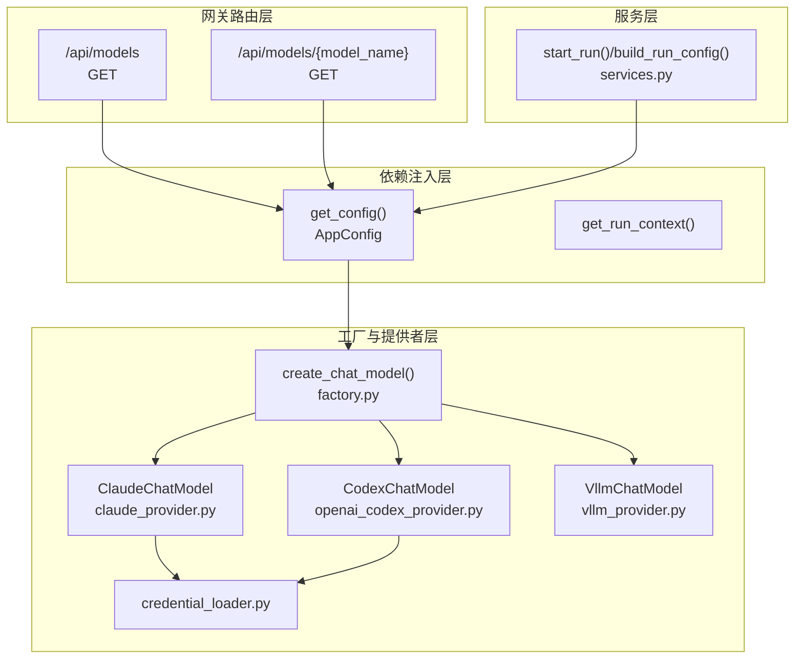
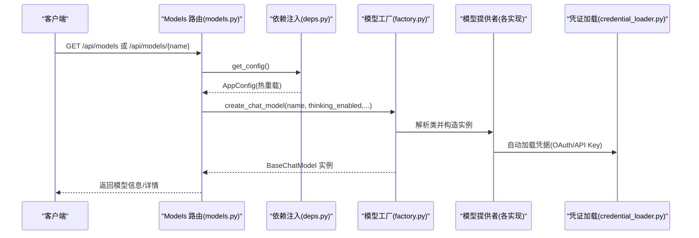
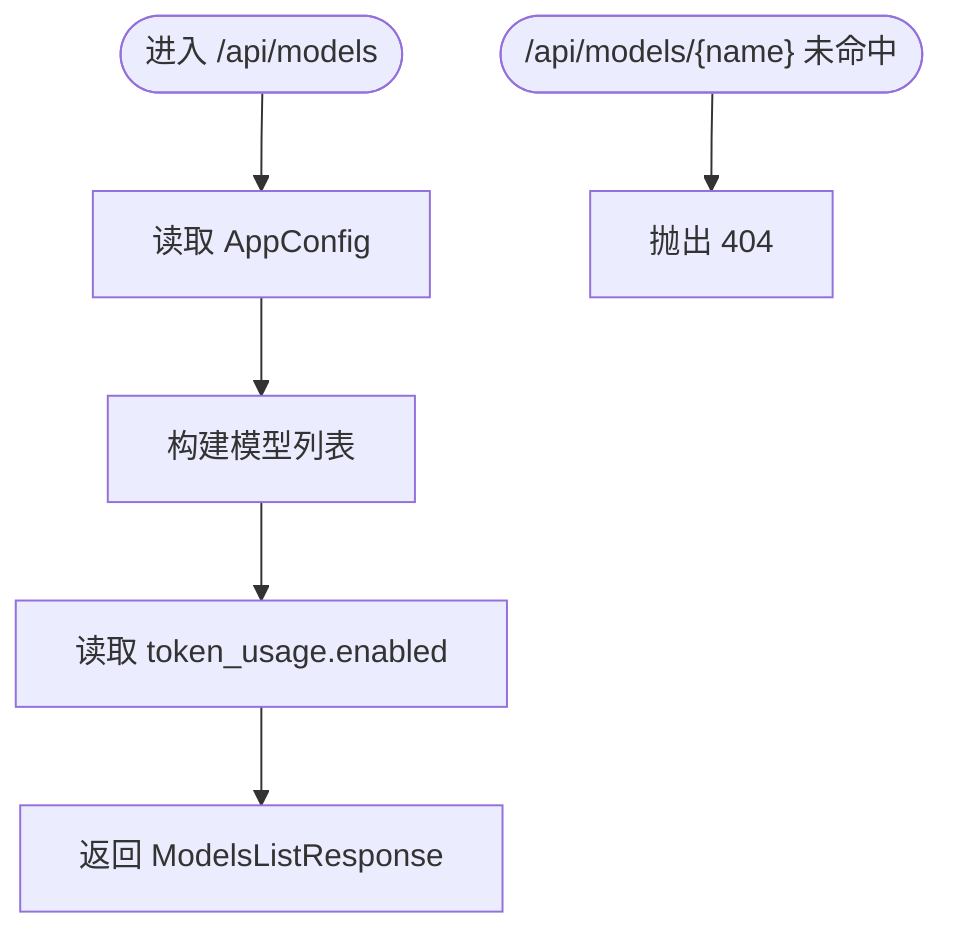
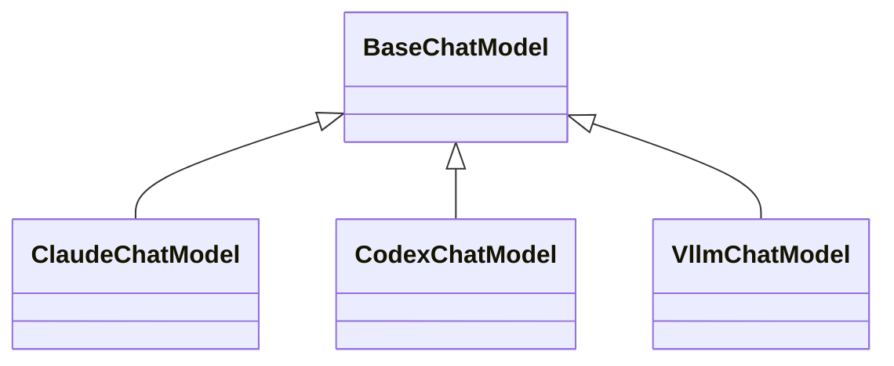
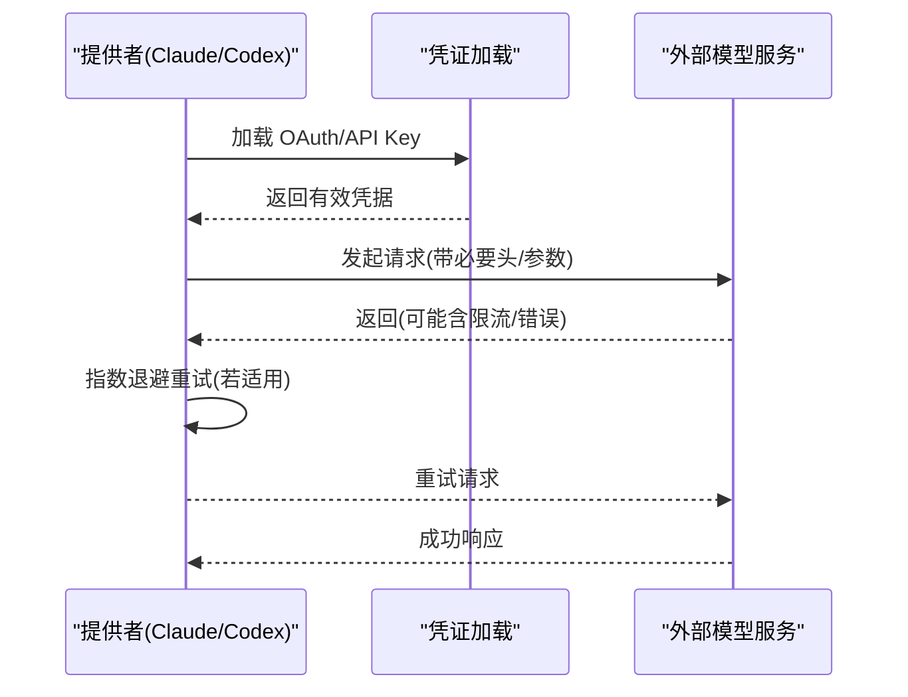
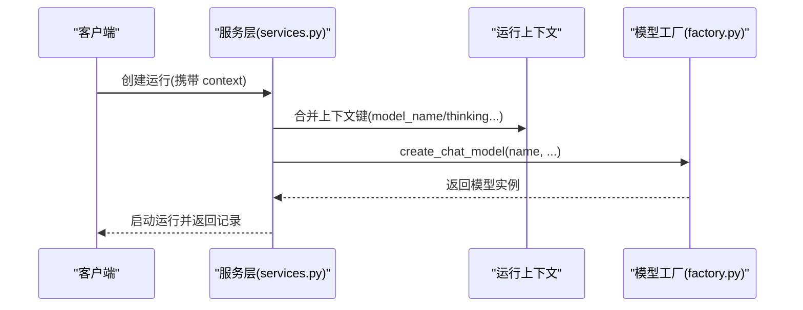
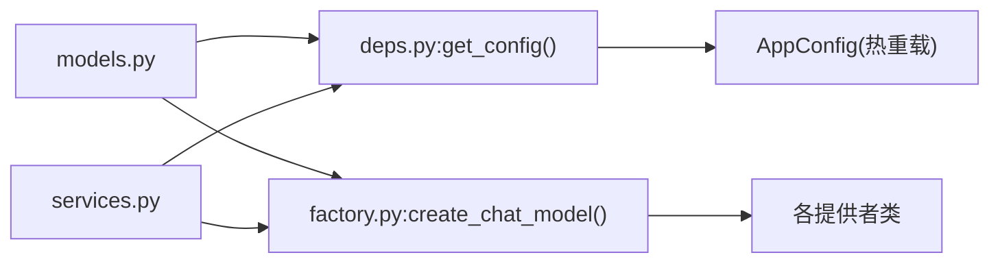

# Models 路由模块

<cite>
**本文引用的文件**
- [models.py](file://backend/app/gateway/routers/models.py)
- [factory.py](file://backend/packages/harness/deerflow/models/factory.py)
- [credential_loader.py](file://backend/packages/harness/deerflow/models/credential_loader.py)
- [claude_provider.py](file://backend/packages/harness/deerflow/models/claude_provider.py)
- [openai_codex_provider.py](file://backend/packages/harness/deerflow/models/openai_codex_provider.py)
- [vllm_provider.py](file://backend/packages/harness/deerflow/models/vllm_provider.py)
- [deps.py](file://backend/app/gateway/deps.py)
- [services.py](file://backend/app/gateway/services.py)
- [test_client_e2e.py](file://backend/tests/test_client_e2e.py)
- [hooks.ts](file://frontend/src/core/models/hooks.ts)
</cite>

## 目录
1. [简介](#简介)
2. [项目结构](#项目结构)
3. [核心组件](#核心组件)
4. [架构总览](#架构总览)
5. [详细组件分析](#详细组件分析)
6. [依赖分析](#依赖分析)
7. [性能考虑](#性能考虑)
8. [故障排查指南](#故障排查指南)
9. [结论](#结论)
10. [附录](#附录)

## 简介
本技术文档聚焦于 Models 路由模块，系统性阐述模型提供者管理的路由设计、模型列表查询、配置管理与费用统计的 API 端点；深入解析模型提供者的抽象层设计、API 密钥管理与调用限额控制；提供模型管理 API 的使用示例（模型发现、健康检查与性能监控思路）；解释模型与智能体的绑定关系、模型切换与回滚机制，并给出模型缓存、负载均衡与故障转移的实现策略建议。

## 项目结构
Models 路由模块位于后端网关层，负责对外暴露模型清单与详情查询接口，并通过工厂与提供者层完成模型实例化与调用。关键文件与职责如下：
- 路由层：提供 /api/models 与 /api/models/{model_name} 查询端点，返回模型元信息与令牌用量显示配置。
- 工厂层：根据配置动态创建模型实例，支持思维模式与推理强度等高级特性。
- 提供者层：封装不同供应商（如 Claude、Codex、vLLM）的认证、提示缓存、重试与流式处理细节。
- 依赖注入层：在请求生命周期内注入最新配置与运行时上下文。
- 服务层：运行生命周期与上下文合并逻辑，确保模型选择与运行参数一致。

图表来源
- [models.py:34-133](file://backend/app/gateway/routers/models.py#L34-L133)
- [deps.py:70-94](file://backend/app/gateway/deps.py#L70-L94)
- [factory.py:50-172](file://backend/packages/harness/deerflow/models/factory.py#L50-L172)
- [claude_provider.py:44-364](file://backend/packages/harness/deerflow/models/claude_provider.py#L44-L364)
- [openai_codex_provider.py:61-461](file://backend/packages/harness/deerflow/models/openai_codex_provider.py#L61-L461)
- [vllm_provider.py:159-259](file://backend/packages/harness/deerflow/models/vllm_provider.py#L159-L259)
- [services.py:288-370](file://backend/app/gateway/services.py#L288-L370)

章节来源
- [models.py:1-133](file://backend/app/gateway/routers/models.py#L1-L133)
- [deps.py:1-339](file://backend/app/gateway/deps.py#L1-L339)

## 核心组件
- 模型路由端点
  - 列出所有模型：返回模型清单与令牌用量显示开关。
  - 获取指定模型：按名称返回模型元信息。
- 模型工厂
  - 动态创建模型实例，支持思维模式与推理强度配置，自动注入追踪回调。
- 提供者实现
  - Claude：OAuth Bearer 认证、提示缓存、智能思维预算与指数退避重试。
  - Codex：ChatGPT Codex Responses API，工具调用、流式处理与使用量映射。
  - vLLM：保持推理字段跨轮次传递，修复 LangChain OpenAI 适配器对非标准字段的丢失。
- 凭证加载
  - 自动从 Claude Code CLI 与 Codex CLI 加载凭据，支持环境变量与文件描述符。
- 运行上下文
  - 合并运行上下文中的模型名、思维模式、推理强度等关键参数到运行配置。

章节来源
- [models.py:34-133](file://backend/app/gateway/routers/models.py#L34-L133)
- [factory.py:50-172](file://backend/packages/harness/deerflow/models/factory.py#L50-L172)
- [claude_provider.py:44-364](file://backend/packages/harness/deerflow/models/claude_provider.py#L44-L364)
- [openai_codex_provider.py:61-461](file://backend/packages/harness/deerflow/models/openai_codex_provider.py#L61-L461)
- [vllm_provider.py:159-259](file://backend/packages/harness/deerflow/models/vllm_provider.py#L159-L259)
- [credential_loader.py:1-220](file://backend/packages/harness/deerflow/models/credential_loader.py#L1-L220)
- [services.py:188-257](file://backend/app/gateway/services.py#L188-L257)

## 架构总览
下图展示从路由到模型实例化的完整链路，以及与运行时上下文的集成方式。

图表来源
- [models.py:40-133](file://backend/app/gateway/routers/models.py#L40-L133)
- [deps.py:70-94](file://backend/app/gateway/deps.py#L70-L94)
- [factory.py:50-172](file://backend/packages/harness/deerflow/models/factory.py#L50-L172)
- [credential_loader.py:149-220](file://backend/packages/harness/deerflow/models/credential_loader.py#L149-L220)

## 详细组件分析

### 路由与响应模型
- 模型列表端点
  - 路径：/api/models
  - 方法：GET
  - 响应：包含 models 数组与 token_usage 开关
  - 关键行为：从 AppConfig 中读取模型配置，过滤敏感字段，仅返回前端可见元信息
- 单模型详情端点
  - 路径：/api/models/{model_name}
  - 方法：GET
  - 响应：单个模型的元信息
  - 错误：未找到返回 404

图表来源
- [models.py:34-133](file://backend/app/gateway/routers/models.py#L34-L133)

章节来源
- [models.py:34-133](file://backend/app/gateway/routers/models.py#L34-L133)

### 模型工厂与抽象层设计
- 工厂函数
  - 输入：模型名、思维模式开关、应用配置、是否附加追踪
  - 行为：解析 use 字段定位具体提供者类，合并配置字典，处理思维模式与推理强度，注入流式用量与默认重试策略
  - 输出：BaseChatModel 实例
- 思维模式与推理强度
  - 支持 when_thinking_enabled/when_thinking_disabled 快捷配置
  - Codex 模型将思维模式映射为 reasoning_effort
  - vLLM 通过 chat_template_kwargs 兼容 enable_thinking
- 追踪回调
  - 可选附加 tracing 回调，避免重复根节点

图表来源
- [factory.py:50-172](file://backend/packages/harness/deerflow/models/factory.py#L50-L172)
- [claude_provider.py:44-364](file://backend/packages/harness/deerflow/models/claude_provider.py#L44-L364)
- [openai_codex_provider.py:61-461](file://backend/packages/harness/deerflow/models/openai_codex_provider.py#L61-L461)
- [vllm_provider.py:159-259](file://backend/packages/harness/deerflow/models/vllm_provider.py#L159-L259)

章节来源
- [factory.py:50-172](file://backend/packages/harness/deerflow/models/factory.py#L50-L172)

### API 密钥管理与调用限额控制
- 凭证加载
  - Claude Code OAuth：支持环境变量、文件描述符与导出文件路径，自动检测过期并拒绝过期令牌
  - Codex CLI：从 ~/.codex/auth.json 读取 access_token 与 account_id
- 调用限额与重试
  - Claude：指数退避重试，RateLimit 与 InternalServerError 自动重试
  - Codex：Responses API 流式 SSE，429/500/529 场景指数退避
  - vLLM：保持推理字段一致性，避免因适配器丢失导致的跨轮次问题

图表来源
- [credential_loader.py:149-220](file://backend/packages/harness/deerflow/models/credential_loader.py#L149-L220)
- [claude_provider.py:296-364](file://backend/packages/harness/deerflow/models/claude_provider.py#L296-L364)
- [openai_codex_provider.py:205-246](file://backend/packages/harness/deerflow/models/openai_codex_provider.py#L205-L246)

章节来源
- [credential_loader.py:1-220](file://backend/packages/harness/deerflow/models/credential_loader.py#L1-L220)
- [claude_provider.py:44-364](file://backend/packages/harness/deerflow/models/claude_provider.py#L44-L364)
- [openai_codex_provider.py:61-461](file://backend/packages/harness/deerflow/models/openai_codex_provider.py#L61-L461)

### 模型与智能体的绑定关系、切换与回滚
- 绑定关系
  - 运行配置中可携带 model_name、thinking_enabled、reasoning_effort 等上下文键
  - 工厂与运行服务会将这些键合并到 configurable/context，确保执行时使用正确模型
- 切换与回滚
  - 切换：通过 context/model_name 在请求中即时覆盖允许的模型白名单
  - 回滚：运行记录与检查点持久化，结合回放工具可在异常后恢复至稳定状态

图表来源
- [services.py:188-257](file://backend/app/gateway/services.py#L188-L257)
- [factory.py:50-172](file://backend/packages/harness/deerflow/models/factory.py#L50-L172)

章节来源
- [services.py:188-257](file://backend/app/gateway/services.py#L188-L257)
- [factory.py:50-172](file://backend/packages/harness/deerflow/models/factory.py#L50-L172)

### 模型缓存、负载均衡与故障转移策略
- 缓存
  - Claude 提示缓存：在系统提示、最近消息与工具定义上放置缓存标记，受 API 限制约束
  - OAuth 场景移除缓存标记以满足服务端要求
- 负载均衡与故障转移
  - 多提供者并存：通过配置 use 字段指向不同提供者类，实现按需路由
  - 重试与退避：提供者内置指数退避，提升可用性
  - 建议：在网关层引入多后端权重与健康检查，失败时自动切换备用提供者

章节来源
- [claude_provider.py:192-294](file://backend/packages/harness/deerflow/models/claude_provider.py#L192-L294)
- [openai_codex_provider.py:205-246](file://backend/packages/harness/deerflow/models/openai_codex_provider.py#L205-L246)
- [vllm_provider.py:159-259](file://backend/packages/harness/deerflow/models/vllm_provider.py#L159-L259)

## 依赖分析
- 路由依赖配置注入
  - 路由层通过 get_config() 获取最新 AppConfig，支持配置热重载
- 工厂依赖提供者类解析
  - 通过配置 use 字段解析具体提供者类，统一构造 BaseChatModel
- 运行时上下文依赖
  - 服务层将上下文键合并到 configurable/context，确保模型选择与运行参数一致

图表来源
- [models.py:40-133](file://backend/app/gateway/routers/models.py#L40-L133)
- [deps.py:70-94](file://backend/app/gateway/deps.py#L70-L94)
- [factory.py:50-172](file://backend/packages/harness/deerflow/models/factory.py#L50-L172)
- [services.py:188-257](file://backend/app/gateway/services.py#L188-L257)

章节来源
- [models.py:1-133](file://backend/app/gateway/routers/models.py#L1-L133)
- [deps.py:1-339](file://backend/app/gateway/deps.py#L1-L339)
- [factory.py:1-172](file://backend/packages/harness/deerflow/models/factory.py#L1-L172)
- [services.py:1-453](file://backend/app/gateway/services.py#L1-L453)

## 性能考虑
- 流式用量与令牌统计
  - 默认启用 stream_usage，确保流式响应中可收集 token 使用元数据
  - Codex 将 Responses API 使用量映射为 LangChain usage_metadata
- 思维模式与推理强度
  - Claude 自动分配思维预算，避免超限
  - vLLM 保留推理字段，减少跨轮次重复计算
- 重试与退避
  - 指数退避降低峰值压力，提升整体吞吐稳定性

章节来源
- [factory.py:34-48](file://backend/packages/harness/deerflow/models/factory.py#L34-L48)
- [openai_codex_provider.py:32-56](file://backend/packages/harness/deerflow/models/openai_codex_provider.py#L32-L56)
- [claude_provider.py:250-262](file://backend/packages/harness/deerflow/models/claude_provider.py#L250-L262)
- [vllm_provider.py:193-259](file://backend/packages/harness/deerflow/models/vllm_provider.py#L193-L259)

## 故障排查指南
- 404 未找到模型
  - 检查模型名是否在 AppConfig 中配置，或是否拼写错误
- 400 模型不在允许列表
  - 运行时 context.model_name 必须在配置的模型白名单中
- 凭证问题
  - Claude Code OAuth：确认导出文件存在且未过期，检查必需头与账户 ID
  - Codex CLI：确认 ~/.codex/auth.json 存在且包含 access_token
- 限流与错误
  - 查看指数退避日志，确认网络连通性与服务端状态码
- 前端模型列表不更新
  - 确认前端 hooks.ts 正在拉取 /api/models 并启用 refetchOnWindowFocus

章节来源
- [models.py:121-124](file://backend/app/gateway/routers/models.py#L121-L124)
- [services.py:295-303](file://backend/app/gateway/services.py#L295-L303)
- [credential_loader.py:149-220](file://backend/packages/harness/deerflow/models/credential_loader.py#L149-L220)
- [hooks.ts:5-18](file://frontend/src/core/models/hooks.ts#L5-L18)

## 结论
Models 路由模块通过清晰的路由层、灵活的工厂层与多样的提供者实现，实现了模型清单查询、模型实例化与调用的统一入口。配合运行时上下文合并与热重载配置，系统具备良好的可扩展性与可观测性。建议在生产环境中结合多提供者负载均衡与健康检查，进一步增强可用性与弹性。

## 附录

### API 端点一览
- GET /api/models
  - 描述：列出所有已配置模型与令牌用量显示开关
  - 响应：ModelsListResponse
- GET /api/models/{model_name}
  - 描述：获取指定模型的详细信息
  - 响应：ModelResponse
  - 错误：404 未找到

章节来源
- [models.py:34-133](file://backend/app/gateway/routers/models.py#L34-L133)

### 模型管理 API 示例（概念）
- 模型发现
  - 通过 /api/models 获取可用模型清单，前端据此渲染模型选择器
- 健康检查
  - 对每个模型配置发起轻量调用（如最小输入），验证凭据与连通性
- 性能监控
  - 结合流式用量与日志，统计平均响应时间、错误率与令牌消耗趋势

章节来源
- [models.py:34-133](file://backend/app/gateway/routers/models.py#L34-L133)
- [factory.py:50-172](file://backend/packages/harness/deerflow/models/factory.py#L50-L172)