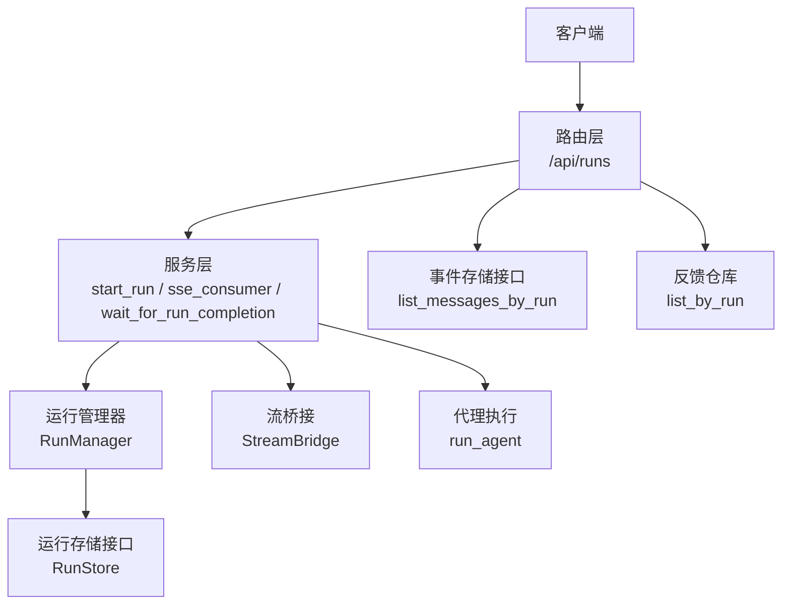
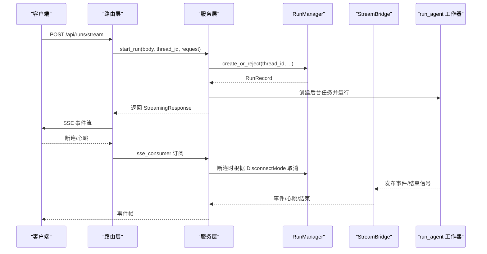
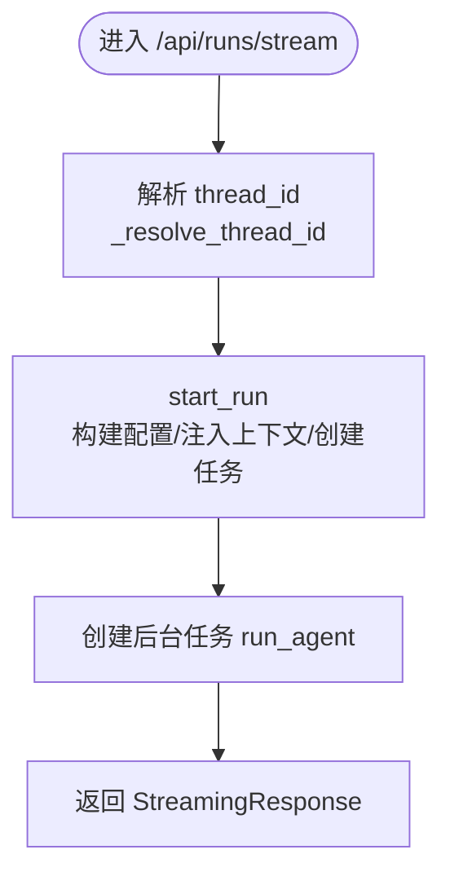
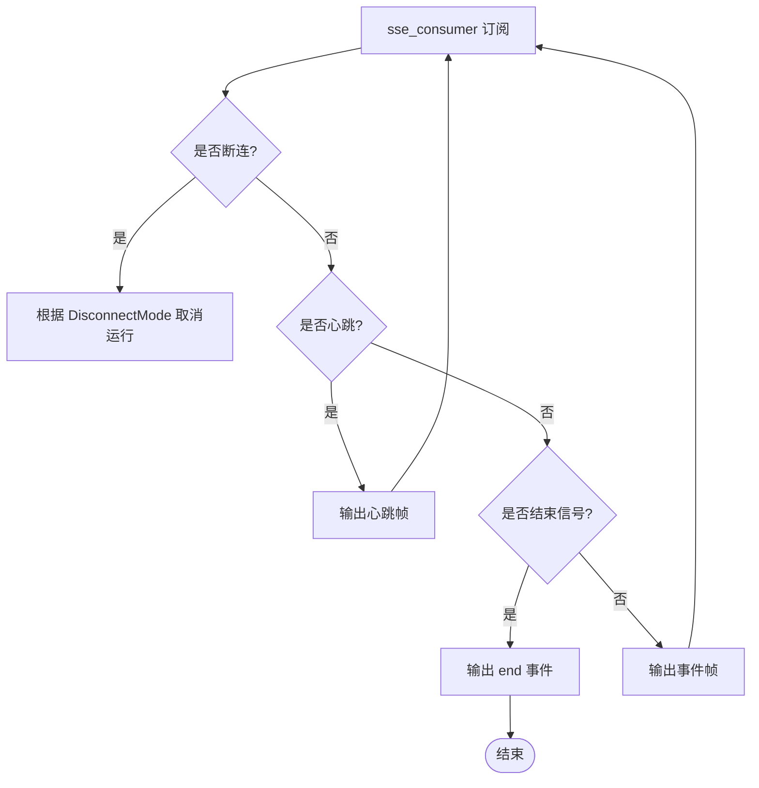
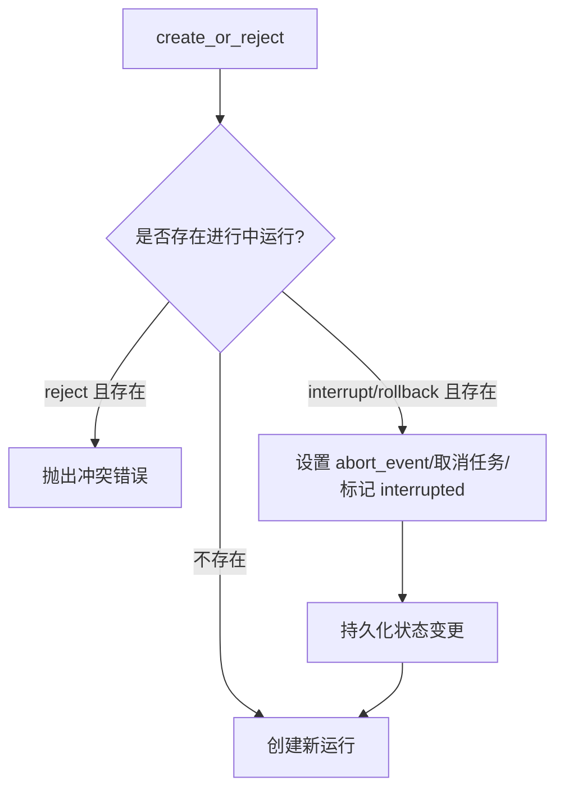
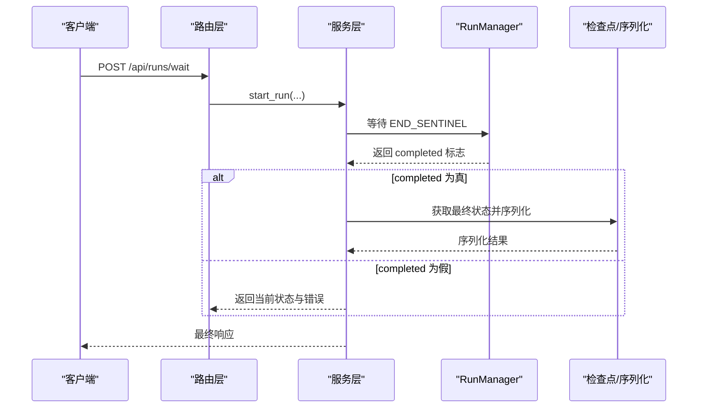
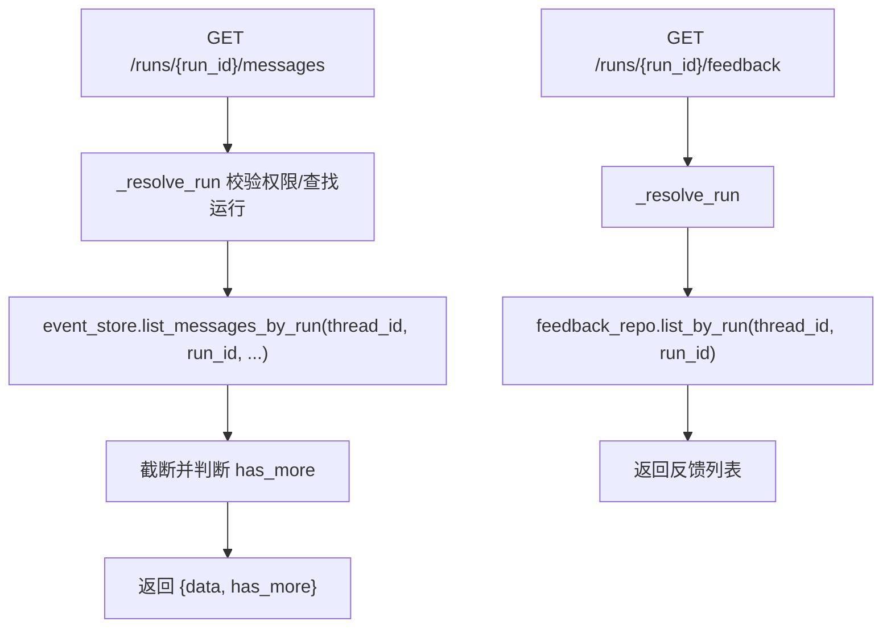
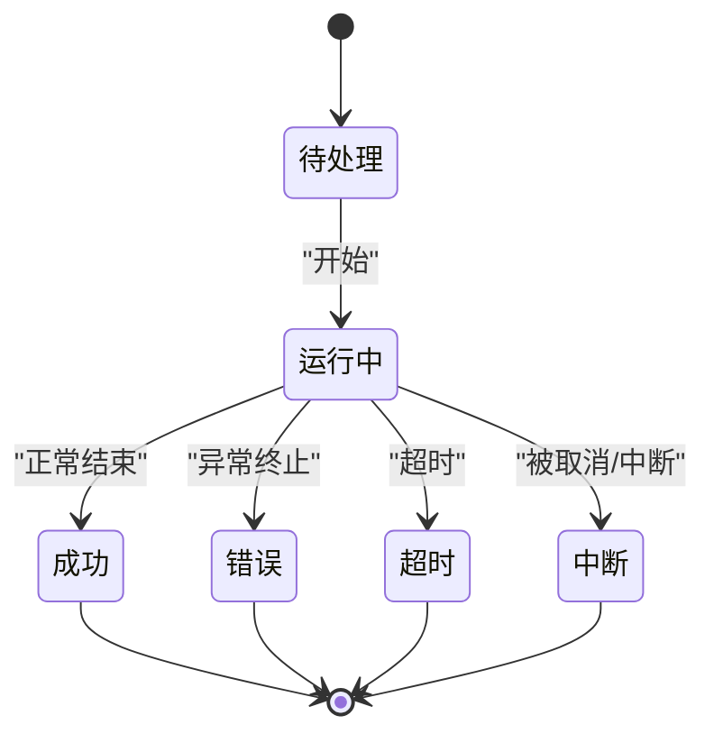
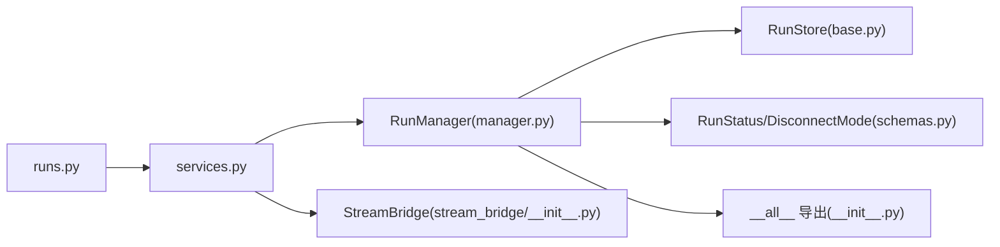

# Runs 路由模块

<cite>
**本文档引用的文件**
- [runs.py](file://backend/app/gateway/routers/runs.py)
- [services.py](file://backend/app/gateway/services.py)
- [manager.py](file://backend/packages/harness/deerflow/runtime/runs/manager.py)
- [schemas.py](file://backend/packages/harness/deerflow/runtime/runs/schemas.py)
- [base.py](file://backend/packages/harness/deerflow/runtime/runs/store/base.py)
- [__init__.py](file://backend/packages/harness/deerflow/runtime/runs/__init__.py)
- [__init__.py](file://backend/packages/harness/deerflow/runtime/stream_bridge/__init__.py)
</cite>

## 目录
1. [简介](#简介)
2. [项目结构](#项目结构)
3. [核心组件](#核心组件)
4. [架构总览](#架构总览)
5. [详细组件分析](#详细组件分析)
6. [依赖关系分析](#依赖关系分析)
7. [性能考虑](#性能考虑)
8. [故障排查指南](#故障排查指南)
9. [结论](#结论)

## 简介
本文件为 Runs 路由模块的技术文档，聚焦于“无状态运行（stateless runs）”的路由设计与实现，覆盖以下关键能力：
- 任务创建：支持自动创建临时线程或复用已有线程进行对话历史保留
- 状态跟踪：通过 SSE 流式事件实时上报运行状态与中间结果
- 取消与中断：基于 DisconnectMode 的断连策略与运行中断机制
- 结果获取：阻塞等待完成后的最终状态序列化返回
- 生命周期管理：运行状态机、并发控制与多任务策略
- 运行事件存储与查询：消息分页与反馈查询
- 超时与资源清理：心跳保活、断连取消、持久化重试与孤儿运行回收

## 项目结构
Runs 路由位于后端网关层，采用“路由器薄 HTTP 处理 + 服务层业务逻辑 + 运行时内核”的分层设计：
- 路由器层：定义 /api/runs 下的无状态运行接口（流式与等待）
- 服务层：封装输入归一化、配置构建、运行启动、SSE 格式化与消费者
- 运行时内核：RunManager 维护运行记录、状态转换、并发与持久化；StreamBridge 解耦生产者与消费者

图表来源
- [runs.py:1-144](file://backend/app/gateway/routers/runs.py#L1-L144)
- [services.py:1-453](file://backend/app/gateway/services.py#L1-L453)
- [manager.py:1-655](file://backend/packages/harness/deerflow/runtime/runs/manager.py#L1-L655)
- [__init__.py:1-22](file://backend/packages/harness/deerflow/runtime/stream_bridge/__init__.py#L1-L22)

章节来源
- [runs.py:1-144](file://backend/app/gateway/routers/runs.py#L1-L144)
- [services.py:1-453](file://backend/app/gateway/services.py#L1-L453)

## 核心组件
- 路由器（runs.py）
  - /api/runs/stream：创建运行并以 SSE 流式返回事件
  - /api/runs/wait：创建运行并阻塞等待完成，返回最终状态
  - /api/runs/{run_id}/messages：按游标分页查询运行消息
  - /api/runs/{run_id}/feedback：查询运行的全部反馈
- 服务层（services.py）
  - 输入归一化与配置构建：normalize_input、merge_run_context_overrides、inject_authenticated_user_context、build_run_config
  - 运行启动：start_run（创建 RunRecord、调度后台任务、更新线程元数据）
  - SSE 消费者：sse_consumer（订阅桥接事件、心跳保活、断连处理）
  - 完成等待：wait_for_run_completion（共享断连语义与心跳唤醒）
- 运行管理器（manager.py）
  - RunRecord：运行记录与统计字段
  - RunManager：并发安全的状态机、持久化重试、取消与多任务策略、孤儿运行回收
  - RunStatus/DisconnectMode：状态枚举与断连行为
- 存储接口（base.py）
  - RunStore 抽象：put/get/list_by_thread/update_status/delete/update_model_name/update_run_completion/list_pending/list_inflight/aggregate_tokens_by_thread
- 流桥接（stream_bridge/__init__.py）
  - StreamBridge 协议与内存实现，提供 subscribe 订阅与 END/HEARTBEAT 信号

章节来源
- [runs.py:34-144](file://backend/app/gateway/routers/runs.py#L34-L144)
- [services.py:265-453](file://backend/app/gateway/services.py#L265-L453)
- [manager.py:74-655](file://backend/packages/harness/deerflow/runtime/runs/manager.py#L74-L655)
- [schemas.py:6-22](file://backend/packages/harness/deerflow/runtime/runs/schemas.py#L6-L22)
- [base.py:17-143](file://backend/packages/harness/deerflow/runtime/runs/store/base.py#L17-L143)
- [__init__.py:1-22](file://backend/packages/harness/deerflow/runtime/stream_bridge/__init__.py#L1-L22)

## 架构总览
Runs 路由通过“无状态”设计在请求体内未提供 thread_id 时自动创建临时线程，已提供则复用既有线程以保留历史。运行生命周期由 RunManager 统一管理，事件通过 StreamBridge 推送至 SSE 消费者。

图表来源
- [runs.py:34-56](file://backend/app/gateway/routers/runs.py#L34-L56)
- [services.py:265-405](file://backend/app/gateway/services.py#L265-L405)
- [manager.py:466-495](file://backend/packages/harness/deerflow/runtime/runs/manager.py#L466-L495)

## 详细组件分析

### 1) 任务创建与线程解析
- 线程 ID 解析：优先使用请求体中的 configurable.thread_id，否则生成新的 UUID 作为临时线程
- 启动流程：调用 start_run 构建配置、注入用户上下文、合并运行上下文、创建后台任务并注册到 RunManager

图表来源
- [runs.py:26-56](file://backend/app/gateway/routers/runs.py#L26-L56)
- [services.py:265-371](file://backend/app/gateway/services.py#L265-L371)

章节来源
- [runs.py:26-56](file://backend/app/gateway/routers/runs.py#L26-L56)
- [services.py:265-371](file://backend/app/gateway/services.py#L265-L371)

### 2) 状态跟踪与流式响应
- SSE 格式：统一的 format_sse 将事件名与数据编码为标准 SSE 帧
- 心跳保活：当收到 HEARTBEAT_SENTINEL 时发送空闲心跳，避免代理超时
- 断连处理：sse_consumer 在 finally 中根据 DisconnectMode 决定取消或继续

图表来源
- [services.py:373-405](file://backend/app/gateway/services.py#L373-L405)

章节来源
- [services.py:46-59](file://backend/app/gateway/services.py#L46-L59)
- [services.py:373-405](file://backend/app/gateway/services.py#L373-L405)

### 3) 取消与中断机制
- 多任务策略：
  - reject：若线程存在进行中运行则冲突
  - interrupt：中断现有运行后再创建新运行
  - rollback：回滚现有运行后再创建新运行
- 取消流程：RunManager.cancel 设置 abort_event、取消 asyncio 任务并将状态置为 interrupted，持久化状态变更

图表来源
- [manager.py:497-579](file://backend/packages/harness/deerflow/runtime/runs/manager.py#L497-L579)

章节来源
- [manager.py:427-495](file://backend/packages/harness/deerflow/runtime/runs/manager.py#L427-L495)
- [manager.py:497-579](file://backend/packages/harness/deerflow/runtime/runs/manager.py#L497-L579)

### 4) 结果获取与最终状态序列化
- /api/runs/wait：创建运行后阻塞等待，使用 wait_for_run_completion 共享断连语义与心跳唤醒
- 成功完成：尝试从检查点加载 channel_values 并序列化返回
- 失败或断连：返回当前状态与错误信息

图表来源
- [runs.py:59-88](file://backend/app/gateway/routers/runs.py#L59-L88)
- [services.py:407-453](file://backend/app/gateway/services.py#L407-L453)

章节来源
- [runs.py:59-88](file://backend/app/gateway/routers/runs.py#L59-L88)
- [services.py:407-453](file://backend/app/gateway/services.py#L407-L453)

### 5) 运行事件存储与查询
- 消息分页：/api/runs/{run_id}/messages 支持 after_seq/ before_seq 游标分页，返回 { data, has_more }
- 反馈查询：/api/runs/{run_id}/feedback 返回该运行的所有反馈

图表来源
- [runs.py:105-144](file://backend/app/gateway/routers/runs.py#L105-L144)

章节来源
- [runs.py:105-144](file://backend/app/gateway/routers/runs.py#L105-L144)

### 6) 运行生命周期与状态转换
- 状态机：pending → running → success/error/timeout/interrupted
- 断连模式：cancel（断连即取消）、continue（断连继续运行）
- 并发与隔离：RunManager 使用 asyncio.Lock 保护内部状态；持久化采用带退避的重试策略

图表来源
- [schemas.py:6-15](file://backend/packages/harness/deerflow/runtime/runs/schemas.py#L6-L15)
- [manager.py:427-495](file://backend/packages/harness/deerflow/runtime/runs/manager.py#L427-L495)

章节来源
- [schemas.py:6-22](file://backend/packages/harness/deerflow/runtime/runs/schemas.py#L6-L22)
- [manager.py:427-495](file://backend/packages/harness/deerflow/runtime/runs/manager.py#L427-L495)

### 7) 运行与线程的关联关系
- 线程元数据维护：首次使用某 thread_id 时自动 upsert 线程元数据，保证线程可见性
- 线程级并发控制：多任务策略在同一线程上限制或中断进行中的运行

章节来源
- [services.py:320-335](file://backend/app/gateway/services.py#L320-L335)
- [manager.py:527-530](file://backend/packages/harness/deerflow/runtime/runs/manager.py#L527-L530)

### 8) 运行事件的存储与查询机制
- 事件存储接口：list_messages_by_run 支持基于序列号的游标分页
- 反馈存储接口：list_by_run 提供运行级反馈检索

章节来源
- [runs.py:124-143](file://backend/app/gateway/routers/runs.py#L124-L143)
- [base.py:46-53](file://backend/packages/harness/deerflow/runtime/runs/store/base.py#L46-L53)

### 9) 超时处理、资源清理与性能监控
- 心跳保活：HEARTBEAT_SENTINEL 确保长时间无事件时仍能唤醒等待
- 断连取消：断连时依据 DisconnectMode 执行取消，避免僵尸任务
- 持久化重试：对 SQLite 写入采用指数退避重试，提升高并发下的稳定性
- 孤儿运行回收：进程重启后扫描持久化表，将无本地任务拥有的进行中运行标记为 error

章节来源
- [services.py:391-397](file://backend/app/gateway/services.py#L391-L397)
- [services.py:445-452](file://backend/app/gateway/services.py#L445-L452)
- [manager.py:139-167](file://backend/packages/harness/deerflow/runtime/runs/manager.py#L139-L167)
- [manager.py:581-633](file://backend/packages/harness/deerflow/runtime/runs/manager.py#L581-L633)

## 依赖关系分析
- 路由器依赖服务层：/api/runs/stream 与 /api/runs/wait 调用 start_run 与 sse_consumer/wait_for_run_completion
- 服务层依赖运行管理器与流桥接：RunManager 提供状态机与持久化，StreamBridge 提供事件订阅
- 运行管理器依赖存储接口：RunStore 抽象定义了运行元数据的持久化契约
- 运行内核导出：__init__.py 暴露 RunManager、RunRecord、RunStatus、DisconnectMode、run_agent 等核心类型

图表来源
- [runs.py:1-144](file://backend/app/gateway/routers/runs.py#L1-L144)
- [services.py:1-453](file://backend/app/gateway/services.py#L1-L453)
- [manager.py:1-655](file://backend/packages/harness/deerflow/runtime/runs/manager.py#L1-L655)
- [schemas.py:1-22](file://backend/packages/harness/deerflow/runtime/runs/schemas.py#L1-L22)
- [base.py:1-143](file://backend/packages/harness/deerflow/runtime/runs/store/base.py#L1-L143)
- [__init__.py:1-17](file://backend/packages/harness/deerflow/runtime/runs/__init__.py#L1-L17)
- [__init__.py:1-22](file://backend/packages/harness/deerflow/runtime/stream_bridge/__init__.py#L1-L22)

章节来源
- [runs.py:1-144](file://backend/app/gateway/routers/runs.py#L1-L144)
- [services.py:1-453](file://backend/app/gateway/services.py#L1-L453)
- [manager.py:1-655](file://backend/packages/harness/deerflow/runtime/runs/manager.py#L1-L655)
- [schemas.py:1-22](file://backend/packages/harness/deerflow/runtime/runs/schemas.py#L1-L22)
- [base.py:1-143](file://backend/packages/harness/deerflow/runtime/runs/store/base.py#L1-L143)
- [__init__.py:1-17](file://backend/packages/harness/deerflow/runtime/runs/__init__.py#L1-L17)
- [__init__.py:1-22](file://backend/packages/harness/deerflow/runtime/stream_bridge/__init__.py#L1-L22)

## 性能考虑
- 流式事件：SSE 逐帧推送，避免一次性大响应导致内存峰值
- 心跳保活：定期心跳减少代理超时风险，降低长工具调用场景下的误判
- 持久化重试：对 SQLite 写入采用退避重试，缓解锁竞争带来的抖动
- 并发控制：RunManager 锁保护与多任务策略，避免同一线程下竞态
- 资源清理：断连取消与孤儿运行回收，防止资源泄漏

## 故障排查指南
- 断连即取消无效
  - 检查请求头 Last-Event-ID 是否正确传递
  - 确认 DisconnectMode 配置为 cancel
  - 观察日志中是否触发 run_mgr.cancel
- 长时间无事件超时
  - 确认客户端侧心跳处理逻辑
  - 检查服务端是否持续发送 HEARTBEAT_SENTINEL
- 运行状态不一致
  - 查看持久化重试日志，确认写入是否成功
  - 检查孤儿运行回收是否生效
- 多任务冲突
  - 若策略为 reject，线程存在进行中运行会返回 409
  - 若策略为 interrupt/rollback，需确认旧运行是否被正确中断

章节来源
- [services.py:385-405](file://backend/app/gateway/services.py#L385-L405)
- [services.py:445-452](file://backend/app/gateway/services.py#L445-L452)
- [manager.py:139-167](file://backend/packages/harness/deerflow/runtime/runs/manager.py#L139-L167)
- [manager.py:581-633](file://backend/packages/harness/deerflow/runtime/runs/manager.py#L581-L633)

## 结论
Runs 路由模块通过清晰的分层设计与完善的运行生命周期管理，实现了无状态运行的高效创建、稳定流式传输与可靠结果获取。结合断连取消、心跳保活、持久化重试与孤儿运行回收等机制，系统在高并发与复杂工具调用场景下具备良好的鲁棒性与可观测性。建议在生产环境中配合合适的断连策略与监控告警，确保用户体验与系统稳定性。