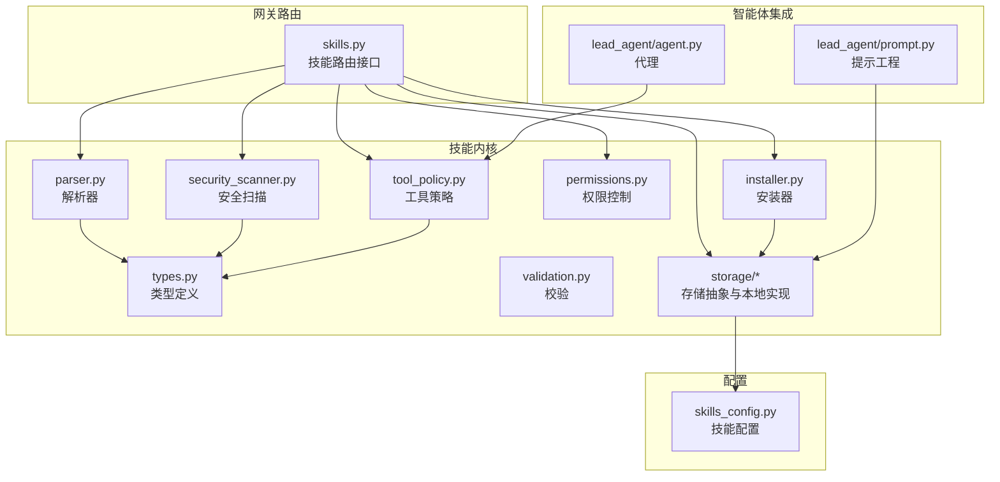
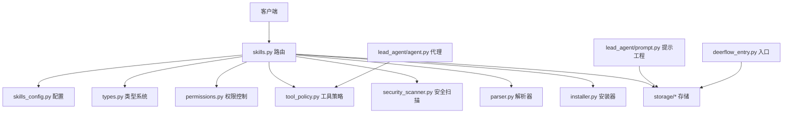
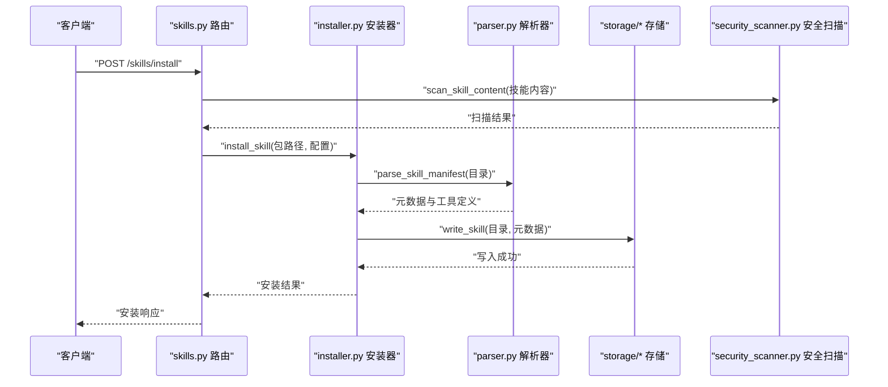
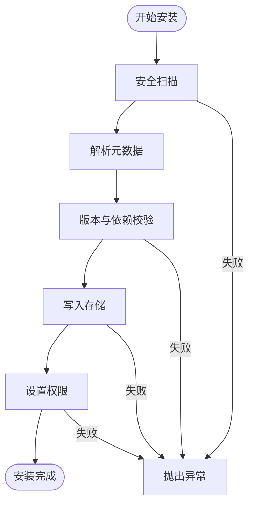
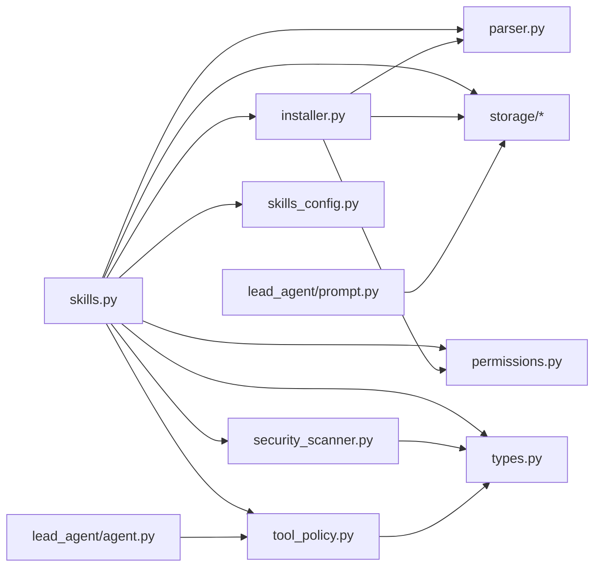

# Skills 路由模块

<cite>
**本文档引用的文件**
- [backend/app/gateway/routers/skills.py](file://backend/app/gateway/routers/skills.py)
- [backend/packages/harness/deerflow/skills/__init__.py](file://backend/packages/harness/deerflow/skills/__init__.py)
- [backend/packages/harness/deerflow/skills/installer.py](file://backend/packages/harness/deerflow/skills/installer.py)
- [backend/packages/harness/deerflow/skills/parser.py](file://backend/packages/harness/deerflow/skills/parser.py)
- [backend/packages/harness/deerflow/skills/permissions.py](file://backend/packages/harness/deerflow/skills/permissions.py)
- [backend/packages/harness/deerflow/skills/security_scanner.py](file://backend/packages/harness/deerflow/skills/security_scanner.py)
- [backend/packages/harness/deerflow/skills/tool_policy.py](file://backend/packages/harness/deerflow/skills/tool_policy.py)
- [backend/packages/harness/deerflow/skills/types.py](file://backend/packages/harness/deerflow/skills/types.py)
- [backend/packages/harness/deerflow/skills/validation.py](file://backend/packages/harness/deerflow/skills/validation.py)
- [backend/packages/harness/deerflow/skills/storage/__init__.py](file://backend/packages/harness/deerflow/skills/storage/__init__.py)
- [backend/packages/harness/deerflow/skills/storage/local_skill_storage.py](file://backend/packages/harness/deerflow/skills/storage/local_skill_storage.py)
- [backend/packages/harness/deerflow/skills/storage/skill_storage.py](file://backend/packages/harness/deerflow/skills/storage/skill_storage.py)
- [backend/packages/harness/deerflow/config/skills_config.py](file://backend/packages/harness/deerflow/config/skills_config.py)
- [backend/packages/harness/deerflow/agents/lead_agent/agent.py](file://backend/packages/harness/deerflow/agents/lead_agent/agent.py)
- [backend/packages/harness/deerflow/agents/lead_agent/prompt.py](file://backend/packages/harness/deerflow/agents/lead_agent/prompt.py)
- [backend/app/gateway/routers/agents.py](file://backend/app/gateway/routers/agents.py)
- [backend/deerflow_entry.py](file://backend/deerflow_entry.py)
- [backend/tests/test_skills_installer.py](file://backend/tests/test_skills_installer.py)
- [backend/tests/test_skills_parser.py](file://backend/tests/test_skills_parser.py)
- [backend/tests/test_skills_validation.py](file://backend/tests/test_skills_validation.py)
- [backend/tests/test_skills_custom_router.py](file://backend/tests/test_skills_custom_router.py)
- [backend/tests/test_skills_archive_root.py](file://backend/tests/test_skills_archive_root.py)
- [backend/tests/test_skills_bundled.py](file://backend/tests/test_skills_bundled.py)
- [backend/tests/test_subagent_skills_config.py](file://backend/tests/test_subagent_skills_config.py)
</cite>

## 目录
1. [简介](#简介)
2. [项目结构](#项目结构)
3. [核心组件](#核心组件)
4. [架构总览](#架构总览)
5. [详细组件分析](#详细组件分析)
6. [依赖关系分析](#依赖关系分析)
7. [性能考虑](#性能考虑)
8. [故障排除指南](#故障排除指南)
9. [结论](#结论)

## 简介
本文件为 Skills 路由模块的深入技术文档，聚焦于技能管理的路由设计与实现细节。内容涵盖技能安装、卸载、查询与配置的 API 端点，技能元数据管理、权限控制与版本兼容性机制，以及技能与智能体的绑定关系与安全沙箱集成策略。同时提供技能操作 API 的示例流程（上传、验证、激活、停用），并讨论技能市场、批量操作与依赖管理的实现思路。

## 项目结构
Skills 路由模块位于后端网关层，核心代码组织如下：
- 路由层：`backend/app/gateway/routers/skills.py` 提供技能相关的 HTTP 接口
- 技能内核：`backend/packages/harness/deerflow/skills/` 下包含安装器、解析器、权限、安全扫描、工具策略、类型定义与存储等子模块
- 配置：`backend/packages/harness/deerflow/config/skills_config.py` 定义技能相关配置项
- 智能体集成：`backend/packages/harness/deerflow/agents/lead_agent/` 中的代理与提示工程模块与技能系统紧密耦合
- 入口与服务：`backend/deerflow_entry.py` 初始化技能存储等运行时组件

图表来源
- [backend/app/gateway/routers/skills.py:1-200](file://backend/app/gateway/routers/skills.py#L1-L200)
- [backend/packages/harness/deerflow/skills/installer.py:1-200](file://backend/packages/harness/deerflow/skills/installer.py#L1-L200)
- [backend/packages/harness/deerflow/skills/parser.py:1-200](file://backend/packages/harness/deerflow/skills/parser.py#L1-L200)
- [backend/packages/harness/deerflow/skills/security_scanner.py:1-200](file://backend/packages/harness/deerflow/skills/security_scanner.py#L1-L200)
- [backend/packages/harness/deerflow/skills/permissions.py:1-200](file://backend/packages/harness/deerflow/skills/permissions.py#L1-L200)
- [backend/packages/harness/deerflow/skills/tool_policy.py:1-200](file://backend/packages/harness/deerflow/skills/tool_policy.py#L1-L200)
- [backend/packages/harness/deerflow/skills/types.py:1-200](file://backend/packages/harness/deerflow/skills/types.py#L1-L200)
- [backend/packages/harness/deerflow/skills/storage/__init__.py:1-200](file://backend/packages/harness/deerflow/skills/storage/__init__.py#L1-L200)
- [backend/packages/harness/deerflow/config/skills_config.py:1-200](file://backend/packages/harness/deerflow/config/skills_config.py#L1-L200)
- [backend/packages/harness/deerflow/agents/lead_agent/agent.py:1-200](file://backend/packages/harness/deerflow/agents/lead_agent/agent.py#L1-L200)
- [backend/packages/harness/deerflow/agents/lead_agent/prompt.py:1-200](file://backend/packages/harness/deerflow/agents/lead_agent/prompt.py#L1-L200)

章节来源
- [backend/app/gateway/routers/skills.py:1-200](file://backend/app/gateway/routers/skills.py#L1-L200)
- [backend/packages/harness/deerflow/skills/__init__.py:1-200](file://backend/packages/harness/deerflow/skills/__init__.py#L1-L200)

## 核心组件
- 路由接口：提供技能 CRUD、启用/禁用、批量操作、查询与配置等端点
- 安装器：负责技能包的解压、校验、写入存储、权限设置与版本冲突处理
- 解析器：从技能目录解析元数据（如 SKILL.md）与工具定义
- 权限控制：基于沙箱可读性与工具白名单的访问控制
- 安全扫描：对技能内容进行静态扫描，识别潜在风险
- 工具策略：根据技能允许的工具集合过滤可用工具
- 存储层：抽象存储接口与本地实现，支持技能归档根目录与自定义存储
- 类型系统：统一技能元数据、分类、状态等类型定义
- 配置系统：集中管理技能相关配置项（如归档根目录、默认策略等）

章节来源
- [backend/packages/harness/deerflow/skills/installer.py:1-200](file://backend/packages/harness/deerflow/skills/installer.py#L1-L200)
- [backend/packages/harness/deerflow/skills/parser.py:1-200](file://backend/packages/harness/deerflow/skills/parser.py#L1-L200)
- [backend/packages/harness/deerflow/skills/permissions.py:1-200](file://backend/packages/harness/deerflow/skills/permissions.py#L1-L200)
- [backend/packages/harness/deerflow/skills/security_scanner.py:1-200](file://backend/packages/harness/deerflow/skills/security_scanner.py#L1-L200)
- [backend/packages/harness/deerflow/skills/tool_policy.py:1-200](file://backend/packages/harness/deerflow/skills/tool_policy.py#L1-L200)
- [backend/packages/harness/deerflow/skills/types.py:1-200](file://backend/packages/harness/deerflow/skills/types.py#L1-L200)
- [backend/packages/harness/deerflow/skills/storage/__init__.py:1-200](file://backend/packages/harness/deerflow/skills/storage/__init__.py#L1-L200)
- [backend/packages/harness/deerflow/config/skills_config.py:1-200](file://backend/packages/harness/deerflow/config/skills_config.py#L1-L200)

## 架构总览
Skills 路由模块采用分层架构：路由层接收请求并编排业务流程；技能内核完成安装、解析、校验与策略应用；存储层负责持久化；配置层提供运行参数；智能体层通过工具策略与提示工程与技能系统交互。

图表来源
- [backend/app/gateway/routers/skills.py:1-200](file://backend/app/gateway/routers/skills.py#L1-L200)
- [backend/packages/harness/deerflow/skills/installer.py:1-200](file://backend/packages/harness/deerflow/skills/installer.py#L1-L200)
- [backend/packages/harness/deerflow/skills/parser.py:1-200](file://backend/packages/harness/deerflow/skills/parser.py#L1-L200)
- [backend/packages/harness/deerflow/skills/security_scanner.py:1-200](file://backend/packages/harness/deerflow/skills/security_scanner.py#L1-L200)
- [backend/packages/harness/deerflow/skills/storage/__init__.py:1-200](file://backend/packages/harness/deerflow/skills/storage/__init__.py#L1-L200)
- [backend/packages/harness/deerflow/skills/tool_policy.py:1-200](file://backend/packages/harness/deerflow/skills/tool_policy.py#L1-L200)
- [backend/packages/harness/deerflow/skills/types.py:1-200](file://backend/packages/harness/deerflow/skills/types.py#L1-L200)
- [backend/packages/harness/deerflow/config/skills_config.py:1-200](file://backend/packages/harness/deerflow/config/skills_config.py#L1-L200)
- [backend/packages/harness/deerflow/agents/lead_agent/agent.py:1-200](file://backend/packages/harness/deerflow/agents/lead_agent/agent.py#L1-L200)
- [backend/packages/harness/deerflow/agents/lead_agent/prompt.py:1-200](file://backend/packages/harness/deerflow/agents/lead_agent/prompt.py#L1-L200)
- [backend/deerflow_entry.py:100-120](file://backend/deerflow_entry.py#L100-L120)

## 详细组件分析

### 路由层：skills.py
- 职责：定义技能管理的 HTTP 接口，包括安装、卸载、查询、启用/禁用、批量操作、配置获取与更新等
- 关键流程：
  - 技能上传与安装：接收压缩包或目录，调用安装器完成解压、校验、写入存储与权限设置
  - 元数据查询：解析 SKILL.md 与工具定义，返回技能信息
  - 启用/禁用：更新技能状态并刷新智能体提示缓存
  - 批量操作：支持批量启用/禁用与批量删除
  - 配置管理：读取与更新技能配置（如归档根目录、默认策略）
- 错误处理：捕获安装器异常、解析异常、权限不足与资源冲突等错误并返回标准响应

图表来源
- [backend/app/gateway/routers/skills.py:1-200](file://backend/app/gateway/routers/skills.py#L1-L200)
- [backend/packages/harness/deerflow/skills/installer.py:1-200](file://backend/packages/harness/deerflow/skills/installer.py#L1-L200)
- [backend/packages/harness/deerflow/skills/parser.py:1-200](file://backend/packages/harness/deerflow/skills/parser.py#L1-L200)
- [backend/packages/harness/deerflow/skills/security_scanner.py:1-200](file://backend/packages/harness/deerflow/skills/security_scanner.py#L1-L200)
- [backend/packages/harness/deerflow/skills/storage/__init__.py:1-200](file://backend/packages/harness/deerflow/skills/storage/__init__.py#L1-L200)

章节来源
- [backend/app/gateway/routers/skills.py:1-200](file://backend/app/gateway/routers/skills.py#L1-L200)

### 安装器：installer.py
- 职责：实现技能包的安装流程，包括解压、校验、写入存储、权限设置与版本冲突处理
- 关键点：
  - 版本兼容性：检查已存在版本，避免覆盖不兼容版本
  - 权限设置：确保技能目录在沙箱中可读
  - 异常处理：捕获文件系统错误、权限错误与重复安装错误
- 输出：返回安装结果与错误信息

图表来源
- [backend/packages/harness/deerflow/skills/installer.py:1-200](file://backend/packages/harness/deerflow/skills/installer.py#L1-L200)
- [backend/packages/harness/deerflow/skills/security_scanner.py:1-200](file://backend/packages/harness/deerflow/skills/security_scanner.py#L1-L200)
- [backend/packages/harness/deerflow/skills/parser.py:1-200](file://backend/packages/harness/deerflow/skills/parser.py#L1-L200)
- [backend/packages/harness/deerflow/skills/storage/__init__.py:1-200](file://backend/packages/harness/deerflow/skills/storage/__init__.py#L1-L200)
- [backend/packages/harness/deerflow/skills/permissions.py:1-200](file://backend/packages/harness/deerflow/skills/permissions.py#L1-L200)

章节来源
- [backend/packages/harness/deerflow/skills/installer.py:1-200](file://backend/packages/harness/deerflow/skills/installer.py#L1-L200)

### 解析器：parser.py
- 职责：从技能目录解析元数据（SKILL.md）、工具定义与依赖声明
- 关键点：
  - 元数据标准化：提取技能名称、描述、分类、版本、作者等字段
  - 工具定义解析：生成工具注册所需的参数与约束
  - 依赖声明：记录技能间依赖关系，用于安装顺序与完整性校验

章节来源
- [backend/packages/harness/deerflow/skills/parser.py:1-200](file://backend/packages/harness/deerflow/skills/parser.py#L1-L200)
- [backend/packages/harness/deerflow/skills/types.py:1-200](file://backend/packages/harness/deerflow/skills/types.py#L1-L200)

### 权限控制：permissions.py
- 职责：确保技能在沙箱环境中以最小权限运行，仅授予必要的文件系统访问能力
- 关键点：
  - 沙箱可读性：为技能树设置只读权限，防止意外修改
  - 访问范围限制：结合工具策略，限制工具对文件系统的操作范围

章节来源
- [backend/packages/harness/deerflow/skills/permissions.py:1-200](file://backend/packages/harness/deerflow/skills/permissions.py#L1-L200)

### 安全扫描：security_scanner.py
- 职责：对技能内容进行静态扫描，识别潜在风险（如危险文件、可疑脚本等）
- 关键点：
  - 内容扫描：基于规则集与启发式算法检测风险
  - 结果反馈：返回扫描报告，供安装器决定是否继续安装

章节来源
- [backend/packages/harness/deerflow/skills/security_scanner.py:1-200](file://backend/packages/harness/deerflow/skills/security_scanner.py#L1-L200)

### 工具策略：tool_policy.py
- 职责：根据技能允许的工具集合过滤可用工具，确保工具调用符合技能授权
- 关键点：
  - 工具白名单：仅允许技能声明的工具参与执行
  - 与智能体集成：代理在选择工具时遵循该策略

章节来源
- [backend/packages/harness/deerflow/skills/tool_policy.py:1-200](file://backend/packages/harness/deerflow/skills/tool_policy.py#L1-L200)
- [backend/packages/harness/deerflow/agents/lead_agent/agent.py:1-200](file://backend/packages/harness/deerflow/agents/lead_agent/agent.py#L1-L200)

### 存储层：storage/*
- 职责：抽象技能存储接口，并提供本地实现
- 关键点：
  - 抽象接口：定义通用的读写、枚举、删除等操作
  - 本地实现：基于文件系统实现具体存储逻辑
  - 归档根目录：支持自定义技能归档根目录，便于批量管理

章节来源
- [backend/packages/harness/deerflow/skills/storage/__init__.py:1-200](file://backend/packages/harness/deerflow/skills/storage/__init__.py#L1-L200)
- [backend/packages/harness/deerflow/skills/storage/skill_storage.py:1-200](file://backend/packages/harness/deerflow/skills/storage/skill_storage.py#L1-L200)
- [backend/packages/harness/deerflow/skills/storage/local_skill_storage.py:1-200](file://backend/packages/harness/deerflow/skills/storage/local_skill_storage.py#L1-L200)

### 类型系统：types.py
- 职责：统一技能元数据、分类、状态等类型定义，保证跨模块一致性
- 关键点：
  - 元数据结构：标准化技能信息字段
  - 分类与状态：定义技能分类与启用/禁用状态

章节来源
- [backend/packages/harness/deerflow/skills/types.py:1-200](file://backend/packages/harness/deerflow/skills/types.py#L1-L200)

### 配置系统：skills_config.py
- 职责：集中管理技能相关配置项（如归档根目录、默认策略、扫描规则等）
- 关键点：
  - 可配置性：支持通过配置文件或环境变量调整行为
  - 默认值：提供合理的默认配置，降低部署复杂度

章节来源
- [backend/packages/harness/deerflow/config/skills_config.py:1-200](file://backend/packages/harness/deerflow/config/skills_config.py#L1-L200)

### 智能体集成：lead_agent
- 代理（agent.py）：在选择工具时应用工具策略，确保工具调用符合技能授权
- 提示工程（prompt.py）：根据启用的技能动态生成系统提示，提升上下文相关性

章节来源
- [backend/packages/harness/deerflow/agents/lead_agent/agent.py:1-200](file://backend/packages/harness/deerflow/agents/lead_agent/agent.py#L1-L200)
- [backend/packages/harness/deerflow/agents/lead_agent/prompt.py:1-200](file://backend/packages/harness/deerflow/agents/lead_agent/prompt.py#L1-L200)

## 依赖关系分析
Skills 路由模块内部依赖关系清晰，模块间职责明确，耦合度适中。路由层依赖安装器、解析器、安全扫描、存储与权限控制；安装器依赖解析器与存储；权限控制与安全扫描服务于安装流程；工具策略与类型系统贯穿安装与运行阶段；配置系统为各模块提供参数；智能体层通过工具策略与提示工程与技能系统交互。

图表来源
- [backend/app/gateway/routers/skills.py:1-200](file://backend/app/gateway/routers/skills.py#L1-L200)
- [backend/packages/harness/deerflow/skills/installer.py:1-200](file://backend/packages/harness/deerflow/skills/installer.py#L1-L200)
- [backend/packages/harness/deerflow/skills/parser.py:1-200](file://backend/packages/harness/deerflow/skills/parser.py#L1-L200)
- [backend/packages/harness/deerflow/skills/security_scanner.py:1-200](file://backend/packages/harness/deerflow/skills/security_scanner.py#L1-L200)
- [backend/packages/harness/deerflow/skills/storage/__init__.py:1-200](file://backend/packages/harness/deerflow/skills/storage/__init__.py#L1-L200)
- [backend/packages/harness/deerflow/skills/permissions.py:1-200](file://backend/packages/harness/deerflow/skills/permissions.py#L1-L200)
- [backend/packages/harness/deerflow/skills/tool_policy.py:1-200](file://backend/packages/harness/deerflow/skills/tool_policy.py#L1-L200)
- [backend/packages/harness/deerflow/skills/types.py:1-200](file://backend/packages/harness/deerflow/skills/types.py#L1-L200)
- [backend/packages/harness/deerflow/config/skills_config.py:1-200](file://backend/packages/harness/deerflow/config/skills_config.py#L1-L200)
- [backend/packages/harness/deerflow/agents/lead_agent/agent.py:1-200](file://backend/packages/harness/deerflow/agents/lead_agent/agent.py#L1-L200)
- [backend/packages/harness/deerflow/agents/lead_agent/prompt.py:1-200](file://backend/packages/harness/deerflow/agents/lead_agent/prompt.py#L1-L200)

章节来源
- [backend/app/gateway/routers/skills.py:1-200](file://backend/app/gateway/routers/skills.py#L1-L200)
- [backend/packages/harness/deerflow/skills/installer.py:1-200](file://backend/packages/harness/deerflow/skills/installer.py#L1-L200)
- [backend/packages/harness/deerflow/skills/parser.py:1-200](file://backend/packages/harness/deerflow/skills/parser.py#L1-L200)
- [backend/packages/harness/deerflow/skills/security_scanner.py:1-200](file://backend/packages/harness/deerflow/skills/security_scanner.py#L1-L200)
- [backend/packages/harness/deerflow/skills/storage/__init__.py:1-200](file://backend/packages/harness/deerflow/skills/storage/__init__.py#L1-L200)
- [backend/packages/harness/deerflow/skills/permissions.py:1-200](file://backend/packages/harness/deerflow/skills/permissions.py#L1-L200)
- [backend/packages/harness/deerflow/skills/tool_policy.py:1-200](file://backend/packages/harness/deerflow/skills/tool_policy.py#L1-L200)
- [backend/packages/harness/deerflow/skills/types.py:1-200](file://backend/packages/harness/deerflow/skills/types.py#L1-L200)
- [backend/packages/harness/deerflow/config/skills_config.py:1-200](file://backend/packages/harness/deerflow/config/skills_config.py#L1-L200)
- [backend/packages/harness/deerflow/agents/lead_agent/agent.py:1-200](file://backend/packages/harness/deerflow/agents/lead_agent/agent.py#L1-L200)
- [backend/packages/harness/deerflow/agents/lead_agent/prompt.py:1-200](file://backend/packages/harness/deerflow/agents/lead_agent/prompt.py#L1-L200)

## 性能考虑
- 存储优化：使用本地存储时，建议合理设置归档根目录，避免单目录下文件过多导致 IO 压力
- 并发安装：安装器应避免并发写入同一技能目录，可通过锁机制或队列串行化
- 缓存策略：启用/禁用状态变更后，及时刷新智能体提示缓存，减少无效计算
- 扫描效率：安全扫描规则应保持精简且高效，避免对大体积技能包造成显著延迟

## 故障排除指南
- 安装失败：检查安装器异常与解析器输出，确认版本冲突、权限不足或存储空间问题
- 安全扫描阻断：查看安全扫描报告，修正风险内容后再尝试安装
- 工具不可用：确认工具策略是否正确应用，检查技能允许的工具集合
- 配置错误：核对技能配置项，确保归档根目录与默认策略设置正确

章节来源
- [backend/tests/test_skills_installer.py:1-200](file://backend/tests/test_skills_installer.py#L1-L200)
- [backend/tests/test_skills_parser.py:1-200](file://backend/tests/test_skills_parser.py#L1-L200)
- [backend/tests/test_skills_validation.py:1-200](file://backend/tests/test_skills_validation.py#L1-L200)
- [backend/tests/test_skills_custom_router.py:1-200](file://backend/tests/test_skills_custom_router.py#L1-L200)
- [backend/tests/test_skills_archive_root.py:1-200](file://backend/tests/test_skills_archive_root.py#L1-L200)
- [backend/tests/test_skills_bundled.py:1-200](file://backend/tests/test_skills_bundled.py#L1-L200)
- [backend/tests/test_subagent_skills_config.py:1-200](file://backend/tests/test_subagent_skills_config.py#L1-L200)

## 结论
Skills 路由模块通过清晰的分层设计与完善的内核组件，实现了从技能上传、安装、解析、校验到启用/禁用与批量管理的完整生命周期。配合权限控制、安全扫描与工具策略，确保了技能执行的安全性与可控性。与智能体系统的深度集成使得技能能够按需动态生效，提升了整体系统的灵活性与可扩展性。