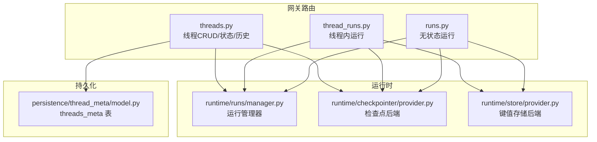
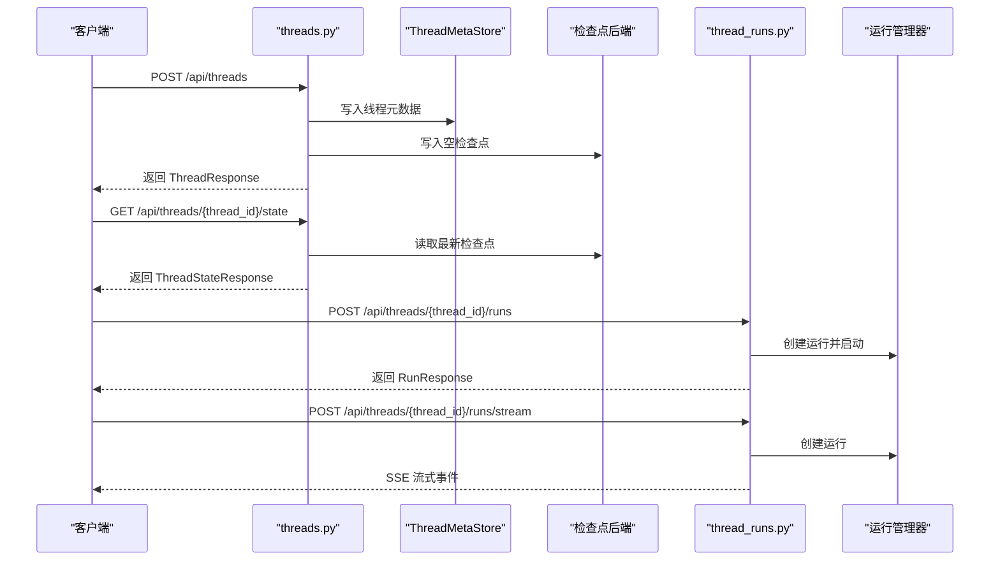
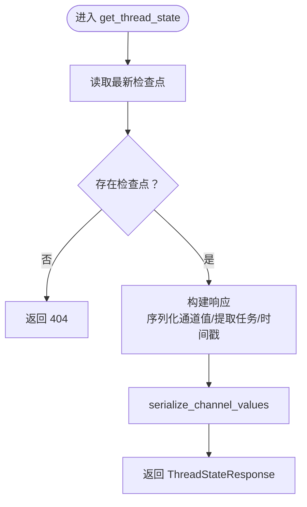
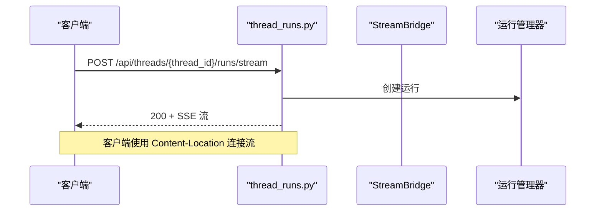
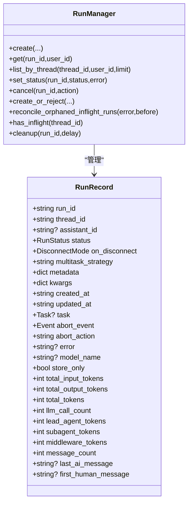
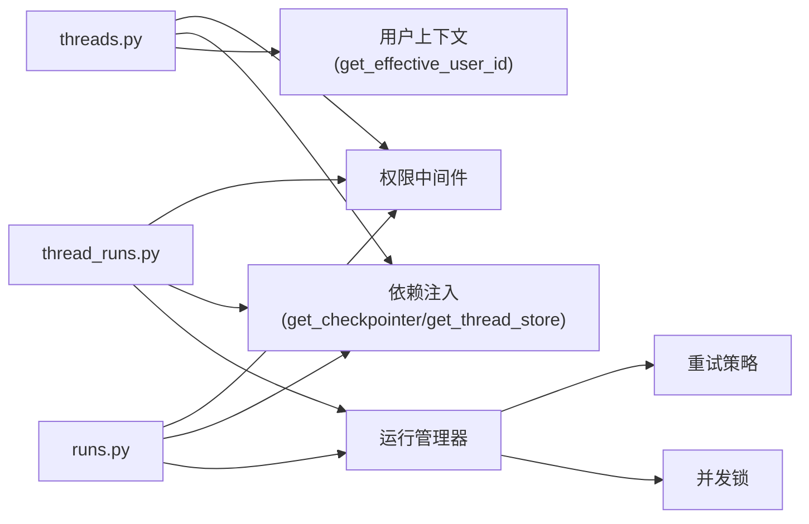

# Threads 路由模块

<cite>
**本文引用的文件**
- [threads.py](file://backend/app/gateway/routers/threads.py)
- [thread_runs.py](file://backend/app/gateway/routers/thread_runs.py)
- [runs.py](file://backend/app/gateway/routers/runs.py)
- [manager.py](file://backend/packages/harness/deerflow/runtime/runs/manager.py)
- [provider.py](file://backend/packages/harness/deerflow/runtime/checkpointer/provider.py)
- [provider.py](file://backend/packages/harness/deerflow/runtime/store/provider.py)
- [model.py](file://backend/packages/harness/deerflow/persistence/thread_meta/model.py)
</cite>

## 目录
1. [简介](#简介)
2. [项目结构](#项目结构)
3. [核心组件](#核心组件)
4. [架构总览](#架构总览)
5. [详细组件分析](#详细组件分析)
6. [依赖分析](#依赖分析)
7. [性能考虑](#性能考虑)
8. [故障排查指南](#故障排查指南)
9. [结论](#结论)
10. [附录](#附录)

## 简介
本技术文档聚焦于 Threads 路由模块，系统性阐述对话线程管理的路由设计与实现，覆盖线程的创建、查询、更新与删除；线程状态推导与序列化；消息历史与上下文持久化；线程与运行（runs）的关系及运行历史管理策略；以及线程隔离、权限控制与并发处理的最佳实践。文档同时提供 RESTful API 的端点规范、请求参数、响应格式与错误码定义，并通过图示展示关键流程。

## 项目结构
Threads 路由模块位于后端网关层，围绕 FastAPI 路由组织，结合运行管理器、检查点存储与元数据存储，形成完整的线程生命周期管理能力。核心文件与职责如下：
- 后端路由
  - threads.py：线程 CRUD、状态查询、历史查询与清理
  - thread_runs.py：线程内运行的创建、流式输出、等待完成、取消、消息与事件查询
  - runs.py：无状态运行（不绑定现有线程）的流式与等待接口
- 运行时与持久化
  - runtime/runs/manager.py：运行注册表与持久化策略、并发控制、取消与恢复
  - runtime/checkpointer/provider.py：检查点后端工厂（内存/SQLite/PostgreSQL）
  - runtime/store/provider.py：键值存储后端工厂（与检查点后端一致）
  - persistence/thread_meta/model.py：线程元数据 ORM 模型（threads_meta 表）

图表来源
- [threads.py:1-649](file://backend/app/gateway/routers/threads.py#L1-L649)
- [thread_runs.py:1-439](file://backend/app/gateway/routers/thread_runs.py#L1-L439)
- [runs.py:1-144](file://backend/app/gateway/routers/runs.py#L1-L144)
- [manager.py:1-655](file://backend/packages/harness/deerflow/runtime/runs/manager.py#L1-L655)
- [provider.py:1-195](file://backend/packages/harness/deerflow/runtime/checkpointer/provider.py#L1-L195)
- [provider.py:1-191](file://backend/packages/harness/deerflow/runtime/store/provider.py#L1-L191)
- [model.py:1-24](file://backend/packages/harness/deerflow/persistence/thread_meta/model.py#L1-L24)

章节来源
- [threads.py:1-649](file://backend/app/gateway/routers/threads.py#L1-L649)
- [thread_runs.py:1-439](file://backend/app/gateway/routers/thread_runs.py#L1-L439)
- [runs.py:1-144](file://backend/app/gateway/routers/runs.py#L1-L144)
- [manager.py:1-655](file://backend/packages/harness/deerflow/runtime/runs/manager.py#L1-L655)
- [provider.py:1-195](file://backend/packages/harness/deerflow/runtime/checkpointer/provider.py#L1-L195)
- [provider.py:1-191](file://backend/packages/harness/deerflow/runtime/store/provider.py#L1-L191)
- [model.py:1-24](file://backend/packages/harness/deerflow/persistence/thread_meta/model.py#L1-L24)

## 核心组件
- 线程路由（threads.py）
  - 端点：创建、查询、分页检索、PATCH 更新元数据、删除本地数据、获取状态快照、更新状态、获取历史
  - 关键特性：保留服务器受控元数据键、从检查点派生线程状态、序列化通道值以适配前端
- 线程内运行路由（thread_runs.py）
  - 端点：创建运行、流式输出、等待完成、列出运行、获取运行详情、取消运行、加入现有运行、消息与事件查询、令牌用量聚合
  - 关键特性：支持中断前/后断点、SSE 流、断开行为、并发策略
- 无状态运行路由（runs.py）
  - 端点：流式与等待，自动复用或新建临时线程
- 运行管理器（runtime/runs/manager.py）
  - 并发安全：全局锁保护运行记录变更
  - 持久化：可选持久化存储，带重试策略与孤儿运行恢复
  - 取消：支持中断与回滚两种动作
- 检查点与存储工厂（runtime/checkpointer/provider.py、runtime/store/provider.py）
  - 支持后端：内存、SQLite、PostgreSQL
  - 一致性：键值存储与检查点后端保持一致配置

章节来源
- [threads.py:212-649](file://backend/app/gateway/routers/threads.py#L212-L649)
- [thread_runs.py:138-439](file://backend/app/gateway/routers/thread_runs.py#L138-L439)
- [runs.py:26-144](file://backend/app/gateway/routers/runs.py#L26-L144)
- [manager.py:106-655](file://backend/packages/harness/deerflow/runtime/runs/manager.py#L106-L655)
- [provider.py:49-195](file://backend/packages/harness/deerflow/runtime/checkpointer/provider.py#L49-L195)
- [provider.py:49-191](file://backend/packages/harness/deerflow/runtime/store/provider.py#L49-L191)

## 架构总览
Threads 路由模块通过“路由层 → 运行管理器 → 检查点/存储后端”的分层设计，实现线程与运行的统一管理。线程状态来源于检查点，线程元数据写入 threads_meta 表；运行在内存中登记并可持久化，通过 SSE 将事件流式返回客户端。

图表来源
- [threads.py:246-484](file://backend/app/gateway/routers/threads.py#L246-L484)
- [thread_runs.py:138-171](file://backend/app/gateway/routers/thread_runs.py#L138-L171)
- [manager.py:314-353](file://backend/packages/harness/deerflow/runtime/runs/manager.py#L314-L353)

## 详细组件分析

### 线程路由（CRUD、状态、历史）
- 端点与行为
  - 创建线程：写入线程元数据与空检查点，幂等返回已存在记录
  - 查询线程：合并 ThreadMetaStore 与检查点信息，派生准确状态
  - 分页检索：基于元数据过滤、状态过滤、分页游标
  - PATCH 元数据：合并更新，保留用户可控字段
  - 删除本地数据：清理本地目录、尝试删除检查点与元数据行
  - 获取状态：序列化通道值，返回当前检查点元信息与任务
  - 更新状态：合并通道值，生成新检查点，同步标题到元数据
  - 历史查询：按检查点列表返回历史条目，仅最新检查点携带消息
- 关键实现要点
  - 安全性：移除服务器受控元数据键，防御注入
  - 状态推导：根据检查点中的 pending_writes 与 tasks 推导状态
  - 序列化：通道值统一序列化为 JSON 安全字典
  - 兼容性：对早期无元数据记录的检查点进行合成

图表来源
- [threads.py:434-484](file://backend/app/gateway/routers/threads.py#L434-L484)

章节来源
- [threads.py:212-649](file://backend/app/gateway/routers/threads.py#L212-L649)

### 线程内运行路由（runs）
- 端点与行为
  - 创建运行：立即返回运行信息，后台执行
  - 流式运行：SSE 输出事件，包含 Content-Location 头
  - 等待完成：阻塞直到完成，返回最终状态
  - 列出运行：按线程与用户维度查询
  - 获取运行：校验线程归属
  - 取消运行：支持中断与回滚，可选择等待终止
  - 加入运行：连接已有运行的 SSE 流
  - 消息与事件：跨运行的消息列表、按运行的消息分页、事件审计
  - 令牌用量：按线程聚合统计
- 关键实现要点
  - 权限：每个端点均进行权限校验与所有者检查
  - 断开策略：支持断开后取消或继续
  - 并发策略：reject/interrupt/rollback/enqueue
  - SSE 协议：与 LangGraph 平台对齐，便于前端 useStream 使用

图表来源
- [thread_runs.py:146-171](file://backend/app/gateway/routers/thread_runs.py#L146-L171)

章节来源
- [thread_runs.py:138-439](file://backend/app/gateway/routers/thread_runs.py#L138-L439)

### 无状态运行路由（runs）
- 端点与行为
  - 流式运行：若请求体包含线程 ID，则复用该线程；否则创建临时线程
  - 等待完成：阻塞直到完成，返回最终状态
  - 运行级消息与反馈：按运行查询消息与反馈
- 关键实现要点
  - 自动线程解析：从请求配置中提取线程 ID 或生成新 ID
  - 统一 SSE：与线程内运行一致的流式协议

章节来源
- [runs.py:26-144](file://backend/app/gateway/routers/runs.py#L26-L144)

### 运行管理器（并发与持久化）
- 并发控制：全局锁保护运行记录的创建、更新与取消
- 持久化：可选持久化存储，带指数退避重试策略
- 取消语义：中断（保留检查点）与回滚（恢复到预运行状态）
- 孤儿运行恢复：进程重启后，对无本地任务的持久化运行标记为失败
- 并发策略：reject/interrupt/rollback/enqueue

图表来源
- [manager.py:74-104](file://backend/packages/harness/deerflow/runtime/runs/manager.py#L74-L104)
- [manager.py:106-655](file://backend/packages/harness/deerflow/runtime/runs/manager.py#L106-L655)

章节来源
- [manager.py:106-655](file://backend/packages/harness/deerflow/runtime/runs/manager.py#L106-L655)

### 检查点与存储后端
- 检查点后端：内存、SQLite、PostgreSQL；未配置时默认内存后端
- 键值存储后端：与检查点后端一致，确保一致性
- 异常处理：缺失依赖时抛出明确异常提示

章节来源
- [provider.py:49-195](file://backend/packages/harness/deerflow/runtime/checkpointer/provider.py#L49-L195)
- [provider.py:49-191](file://backend/packages/harness/deerflow/runtime/store/provider.py#L49-L191)

### 线程元数据模型
- 表结构：threads_meta，包含线程 ID、助手 ID、用户 ID、显示名、状态、元数据 JSON、创建/更新时间
- 索引：assistant_id 与 user_id 建有索引，提升查询性能

章节来源
- [model.py:13-24](file://backend/packages/harness/deerflow/persistence/thread_meta/model.py#L13-L24)

## 依赖分析
- 路由层依赖
  - 权限中间件：require_permission 对每个端点进行权限校验
  - 依赖注入：get_checkpointer、get_thread_store、get_run_manager 等
  - 用户上下文：get_effective_user_id 用于隔离与权限
- 运行管理器依赖
  - asyncio 事件循环与锁，保证并发安全
  - 可选持久化存储，提供重试与恢复能力
- 检查点与存储
  - 与应用配置联动，动态选择后端类型与连接字符串

图表来源
- [threads.py:212-243](file://backend/app/gateway/routers/threads.py#L212-L243)
- [thread_runs.py:138-143](file://backend/app/gateway/routers/thread_runs.py#L138-L143)
- [runs.py:34-56](file://backend/app/gateway/routers/runs.py#L34-L56)
- [manager.py:139-167](file://backend/packages/harness/deerflow/runtime/runs/manager.py#L139-L167)

章节来源
- [threads.py:212-243](file://backend/app/gateway/routers/threads.py#L212-L243)
- [thread_runs.py:138-143](file://backend/app/gateway/routers/thread_runs.py#L138-L143)
- [runs.py:34-56](file://backend/app/gateway/routers/runs.py#L34-L56)
- [manager.py:139-167](file://backend/packages/harness/deerflow/runtime/runs/manager.py#L139-L167)

## 性能考虑
- 检查点访问
  - 读取最新检查点为 O(1)，历史遍历为 O(N)；建议限制 limit 并使用 before 游标
- 线程检索
  - 元数据过滤与状态过滤在后端执行；合理设置 limit 与 offset
- 运行并发
  - 并发策略 reject/interrupt/rollback/enqueue 影响吞吐；根据业务需求选择
- 持久化压力
  - SQLite 锁竞争通过重试策略缓解；高并发场景建议使用 PostgreSQL
- 序列化成本
  - 通道值序列化为 JSON 安全字典，避免大对象频繁转换

## 故障排查指南
- 常见错误码
  - 400：无效的元数据过滤键/值
  - 401/403：权限不足或未认证
  - 404：线程或运行不存在
  - 409：运行不可取消（非活动状态或不在当前工作节点）
  - 422：删除线程本地数据时参数不合法
  - 500：内部服务错误（检查点读写、序列化、持久化失败）
- 定位步骤
  - 查看线程状态：GET /api/threads/{thread_id}/state
  - 查看运行详情：GET /api/threads/{thread_id}/runs/{run_id}
  - 检查运行历史：GET /api/threads/{thread_id}/history
  - 校验权限与所有者：确认调用方具备相应权限且线程属于当前用户
  - 检查后端配置：确认检查点与存储后端类型与连接字符串正确

章节来源
- [threads.py:311-345](file://backend/app/gateway/routers/threads.py#L311-L345)
- [thread_runs.py:223-255](file://backend/app/gateway/routers/thread_runs.py#L223-L255)
- [runs.py:96-102](file://backend/app/gateway/routers/runs.py#L96-L102)

## 结论
Threads 路由模块通过清晰的分层设计与严格的权限控制，提供了完整的线程生命周期管理能力。结合运行管理器的并发与持久化策略，以及检查点与存储后端的一致性保障，能够满足多用户、多运行场景下的线程隔离与历史管理需求。建议在生产环境采用 PostgreSQL 后端，并根据业务选择合适的并发策略与断开行为。

## 附录

### RESTful API 规范

- 线程管理
  - 创建线程
    - 方法：POST /api/threads
    - 请求体：ThreadCreateRequest
      - 字段：thread_id（可选）、assistant_id（可选）、metadata（可选）
    - 响应：ThreadResponse
  - 查询线程
    - 方法：GET /api/threads/{thread_id}
    - 响应：ThreadResponse
  - 分页检索
    - 方法：POST /api/threads/search
    - 请求体：ThreadSearchRequest
      - 字段：metadata（可选，精确匹配）、limit（1..1000，默认100）、offset（>=0，默认0）、status（可选）
    - 响应：ThreadResponse 数组
  - PATCH 元数据
    - 方法：PATCH /api/threads/{thread_id}
    - 请求体：ThreadPatchRequest
      - 字段：metadata（可选，合并）
    - 响应：ThreadResponse
  - 删除本地数据
    - 方法：DELETE /api/threads/{thread_id}
    - 响应：ThreadDeleteResponse
      - 字段：success、message
  - 获取状态
    - 方法：GET /api/threads/{thread_id}/state
    - 响应：ThreadStateResponse
      - 字段：values、next、metadata、checkpoint、checkpoint_id、parent_checkpoint_id、created_at、tasks
  - 更新状态
    - 方法：POST /api/threads/{thread_id}/state
    - 请求体：ThreadStateUpdateRequest
      - 字段：values（可选，合并）、checkpoint_id（可选）、checkpoint（可选）、as_node（可选）
    - 响应：ThreadStateResponse
  - 获取历史
    - 方法：POST /api/threads/{thread_id}/history
    - 请求体：ThreadHistoryRequest
      - 字段：limit（1..100，默认10）、before（可选，游标）
    - 响应：HistoryEntry 数组

- 线程内运行
  - 创建运行
    - 方法：POST /api/threads/{thread_id}/runs
    - 请求体：RunCreateRequest
      - 字段：assistant_id、input、command、metadata、config、context、webhook、checkpoint_id、checkpoint、interrupt_before、interrupt_after、stream_mode、stream_subgraphs、stream_resumable、on_disconnect、on_completion、multitask_strategy、after_seconds、if_not_exists、feedback_keys
    - 响应：RunResponse
  - 流式运行
    - 方法：POST /api/threads/{thread_id}/runs/stream
    - 响应：SSE 流（text/event-stream），包含 Content-Location
  - 等待完成
    - 方法：POST /api/threads/{thread_id}/runs/wait
    - 响应：最终状态或错误
  - 列出运行
    - 方法：GET /api/threads/{thread_id}/runs
    - 响应：RunResponse 数组
  - 获取运行
    - 方法：GET /api/threads/{thread_id}/runs/{run_id}
    - 响应：RunResponse
  - 取消运行
    - 方法：POST /api/threads/{thread_id}/runs/{run_id}/cancel
    - 查询参数：wait（是否等待结束）、action（interrupt/rollback）
    - 响应：202/204 或 409
  - 加入运行
    - 方法：GET /api/threads/{thread_id}/runs/{run_id}/join
    - 响应：SSE 流
  - 消息列表（跨运行）
    - 方法：GET /api/threads/{thread_id}/messages
    - 查询参数：limit（<=200，默认50）、before_seq、after_seq
    - 响应：消息数组（附加 feedback）
  - 消息列表（单运行）
    - 方法：GET /api/threads/{thread_id}/runs/{run_id}/messages
    - 查询参数：limit（1..200，默认50）、before_seq、after_seq
    - 响应：{ data, has_more }
  - 事件列表
    - 方法：GET /api/threads/{thread_id}/runs/{run_id}/events
    - 查询参数：event_types（逗号分隔）、limit（<=2000，默认500）
    - 响应：事件数组
  - 令牌用量
    - 方法：GET /api/threads/{thread_id}/token-usage
    - 查询参数：include_active（是否包含活跃运行）
    - 响应：ThreadTokenUsageResponse

- 无状态运行
  - 流式运行
    - 方法：POST /api/runs/stream
    - 请求体：RunCreateRequest
    - 响应：SSE 流
  - 等待完成
    - 方法：POST /api/runs/wait
    - 请求体：RunCreateRequest
    - 响应：最终状态或错误
  - 运行级消息
    - 方法：GET /api/{run_id}/messages
    - 查询参数：limit（1..200，默认50）、before_seq、after_seq
    - 响应：{ data, has_more }
  - 运行级反馈
    - 方法：GET /api/{run_id}/feedback
    - 响应：反馈数组

章节来源
- [threads.py:246-649](file://backend/app/gateway/routers/threads.py#L246-L649)
- [thread_runs.py:138-439](file://backend/app/gateway/routers/thread_runs.py#L138-L439)
- [runs.py:34-144](file://backend/app/gateway/routers/runs.py#L34-L144)