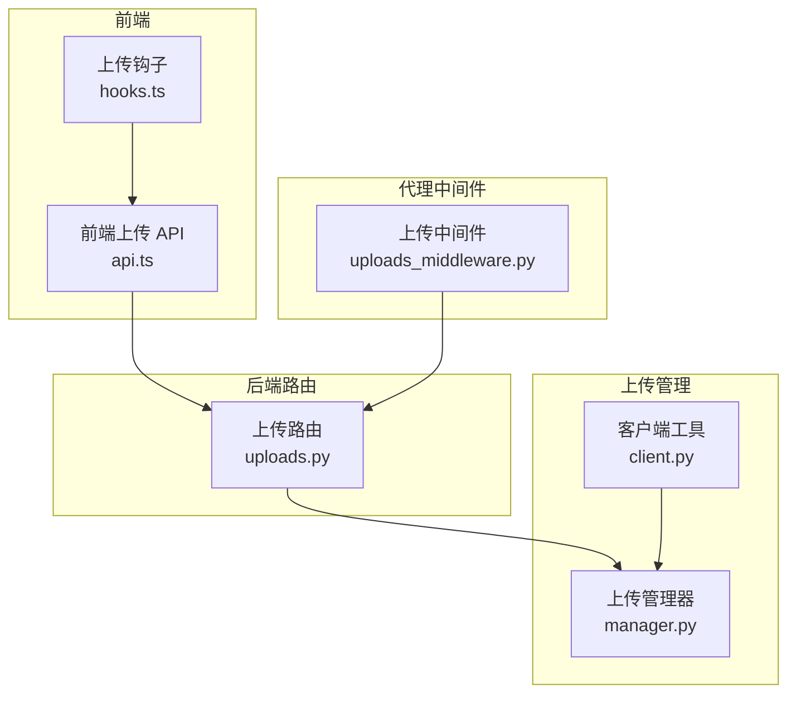
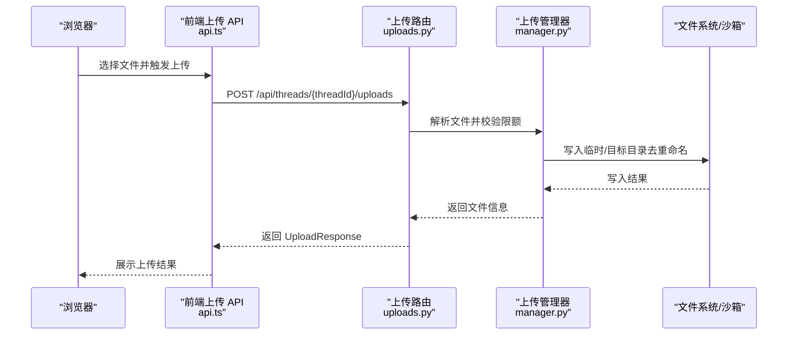
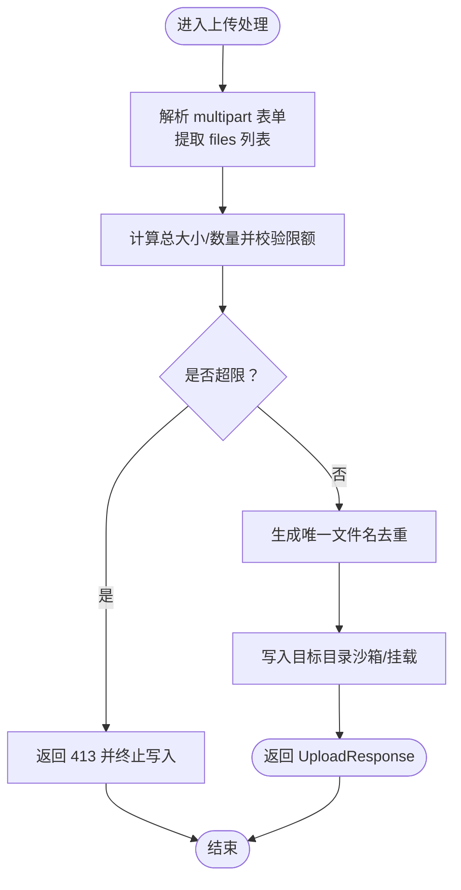
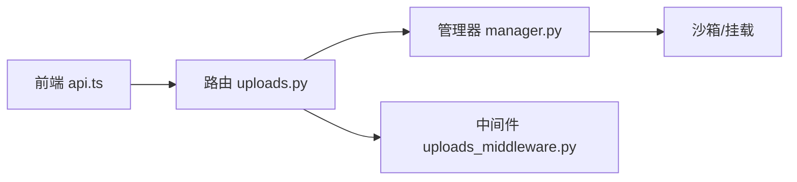

# Uploads 路由模块

<cite>
**本文引用的文件**
- [uploads.py](file://backend/app/gateway/routers/uploads.py)
- [manager.py](file://backend/packages/harness/deerflow/uploads/manager.py)
- [uploads_middleware.py](file://backend/packages/harness/deerflow/agents/middlewares/uploads_middleware.py)
- [client.py](file://backend/packages/harness/deerflow/client.py)
- [api.ts](file://frontend/src/core/uploads/api.ts)
- [hooks.ts](file://frontend/src/core/uploads/hooks.ts)
- [FILE_UPLOAD.md](file://backend/docs/FILE_UPLOAD.md)
- [test_uploads_router.py](file://backend/tests/test_uploads_router.py)
</cite>

## 目录
1. [简介](#简介)
2. [项目结构](#项目结构)
3. [核心组件](#核心组件)
4. [架构总览](#架构总览)
5. [详细组件分析](#详细组件分析)
6. [依赖分析](#依赖分析)
7. [性能考虑](#性能考虑)
8. [故障排查指南](#故障排查指南)
9. [结论](#结论)
10. [附录](#附录)

## 简介
本技术文档聚焦于 Uploads 路由模块，系统性阐述后端文件上传管理的设计与实现，覆盖以下关键主题：
- 路由与端点：临时文件上传、文件列表与删除等接口
- 上传流程控制：单文件、批量上传与断点续传（分片）能力
- 文件校验：类型与大小限制、并发写入保护、限额检查
- 线程与消息关联：上传文件如何与线程生命周期绑定
- 安全扫描与存储优化：内容安全策略与文件转换
- 进度跟踪与权限控制：当前实现状态与可扩展方向

该模块通过后端路由层接收前端请求，结合上传管理器完成文件落盘与命名冲突处理，并与沙箱/挂载机制协作，确保上传文件仅在受控路径内可见与使用。

## 项目结构
Uploads 模块横跨后端路由、上传管理器、代理中间件、前端 API 与测试用例，形成“前端 → 路由 → 管理器 → 存储”的完整链路。

图表来源
- [uploads.py](file://backend/app/gateway/routers/uploads.py)
- [manager.py](file://backend/packages/harness/deerflow/uploads/manager.py)
- [uploads_middleware.py](file://backend/packages/harness/deerflow/agents/middlewares/uploads_middleware.py)
- [client.py](file://backend/packages/harness/deerflow/client.py)
- [api.ts](file://frontend/src/core/uploads/api.ts)
- [hooks.ts](file://frontend/src/core/uploads/hooks.ts)

章节来源
- [uploads.py](file://backend/app/gateway/routers/uploads.py)
- [manager.py](file://backend/packages/harness/deerflow/uploads/manager.py)
- [uploads_middleware.py](file://backend/packages/harness/deerflow/agents/middlewares/uploads_middleware.py)
- [client.py](file://backend/packages/harness/deerflow/client.py)
- [api.ts](file://frontend/src/core/uploads/api.ts)
- [hooks.ts](file://frontend/src/core/uploads/hooks.ts)

## 核心组件
- 后端路由层：定义上传、列出与删除接口；负责参数解析、鉴权与错误响应
- 上传管理器：执行文件落盘、重命名去重、限额校验、沙箱/挂载适配
- 代理中间件：在代理运行时对上传行为进行状态管理与约束
- 前端 API：封装上传、列举与删除的调用，提供统一响应结构
- 测试用例：覆盖多文件、超限、部分写入清理等边界场景

章节来源
- [uploads.py](file://backend/app/gateway/routers/uploads.py)
- [manager.py](file://backend/packages/harness/deerflow/uploads/manager.py)
- [uploads_middleware.py](file://backend/packages/harness/deerflow/agents/middlewares/uploads_middleware.py)
- [api.ts](file://frontend/src/core/uploads/api.ts)
- [test_uploads_router.py](file://backend/tests/test_uploads_router.py)

## 架构总览
下图展示从浏览器到后端路由、再到上传管理器与存储的端到端流程。

图表来源
- [api.ts](file://frontend/src/core/uploads/api.ts)
- [uploads.py](file://backend/app/gateway/routers/uploads.py)
- [manager.py](file://backend/packages/harness/deerflow/uploads/manager.py)

## 详细组件分析

### 路由与端点设计
- 单文件/批量上传
  - 方法与路径：POST /api/threads/{threadId}/uploads
  - 请求体：multipart/form-data，字段名为 files（可多值）
  - 响应：UploadResponse，包含 success、files（每项含 filename、size、virtual_path 等）、message
- 文件列表
  - 方法与路径：GET /api/threads/{threadId}/uploads/list
  - 响应：ListFilesResponse，包含 files 数组与 count
- 删除文件
  - 方法与路径：DELETE /api/threads/{threadId}/uploads/{filename}
  - 响应：通用成功/失败对象

章节来源
- [uploads.py](file://backend/app/gateway/routers/uploads.py)
- [api.ts](file://frontend/src/core/uploads/api.ts)
- [FILE_UPLOAD.md](file://backend/docs/FILE_UPLOAD.md)

### 上传流程控制与分片上传
- 单文件与批量上传
  - 路由层接收多个 files 字段值，交由上传管理器逐个处理
  - 管理器执行限额检查（最大文件数、单文件大小、总大小），并在写入前拒绝超限请求
  - 对于同名文件，采用追加后缀的方式避免覆盖
- 分片/断点续传
  - 当前路由未暴露显式的分片上传端点；但测试用例表明管理器内部支持“分片上传对象”作为输入，用于限额与写入流程的统一处理
  - 若需实现标准断点续传，可在现有管理器基础上新增“分片接收+合并”逻辑，并补充路由端点与状态追踪

图表来源
- [uploads.py](file://backend/app/gateway/routers/uploads.py)
- [manager.py](file://backend/packages/harness/deerflow/uploads/manager.py)
- [test_uploads_router.py](file://backend/tests/test_uploads_router.py)

章节来源
- [uploads.py](file://backend/app/gateway/routers/uploads.py)
- [manager.py](file://backend/packages/harness/deerflow/uploads/manager.py)
- [test_uploads_router.py](file://backend/tests/test_uploads_router.py)

### 文件类型验证与大小限制
- 类型过滤
  - 前端在选择文件阶段可根据 accept 属性与最大尺寸进行本地过滤，减少无效请求
  - 后端路由层不直接做 MIME 类型强校验，主要依赖管理器的限额与命名策略
- 大小限制
  - 单文件大小上限、文件总数上限、总字节上限三者共同决定是否允许写入
  - 超限时立即抛出异常并返回 413，同时清理已读取的分片数据（如适用）

章节来源
- [api.ts](file://frontend/src/core/uploads/api.ts)
- [uploads.py](file://backend/app/gateway/routers/uploads.py)
- [test_uploads_router.py](file://backend/tests/test_uploads_router.py)

### 上传文件与线程、消息的关联关系
- 线程绑定
  - 上传接口以 threadId 作为路径参数，所有上传文件默认归属该线程的上传目录
  - 当沙箱启用“线程数据挂载”时，上传目录位于挂载路径内，确保隔离与持久化
- 消息关联
  - 上传中间件在代理运行时维护上传状态，便于在后续消息处理中引用上传文件（例如将文件路径注入消息内容或工具调用参数）

章节来源
- [uploads.py](file://backend/app/gateway/routers/uploads.py)
- [uploads_middleware.py](file://backend/packages/harness/deerflow/agents/middlewares/uploads_middleware.py)

### 权限控制与安全扫描
- 访问权限
  - 上传目录与线程绑定，遵循沙箱/挂载策略；非挂载场景下通过 acquire 获取会话句柄，确保写入范围受限
- 安全扫描
  - 上传流程本身不包含内容安全扫描；相关内容可参考技能安装的安全扫描模块（用于脚本与文本文件的合规性判断）
  - 若需要对上传文件进行病毒/敏感内容扫描，可在管理器写入后增加异步扫描任务与阻断策略

章节来源
- [uploads.py](file://backend/app/gateway/routers/uploads.py)
- [manager.py](file://backend/packages/harness/deerflow/uploads/manager.py)
- [client.py](file://backend/packages/harness/deerflow/client.py)

### 存储优化与文件转换
- 去重与命名
  - 同名文件自动追加序号后缀，避免覆盖并保持历史可追溯
- 转换与预览
  - 客户端工具在上传后可对可转换格式进行 Markdown 转换，便于后续阅读与检索
- 存储位置
  - 在挂载模式下，文件写入线程专属目录；在非挂载模式下，通过沙箱 acquire/释放机制限定写入范围

章节来源
- [uploads.py](file://backend/app/gateway/routers/uploads.py)
- [manager.py](file://backend/packages/harness/deerflow/uploads/manager.py)
- [client.py](file://backend/packages/harness/deerflow/client.py)

### 前端集成与示例
- 单文件上传
  - 使用 FormData 的 files 字段附加多个 File 对象，调用 POST /api/threads/{threadId}/uploads
- 批量上传
  - 与单文件相同，只需在表单中附加多个文件
- 断点续传（概念性）
  - 可基于现有分片输入对象扩展：先上传分片，再在服务端合并；或在客户端实现分片并发与断点记录

章节来源
- [api.ts](file://frontend/src/core/uploads/api.ts)
- [FILE_UPLOAD.md](file://backend/docs/FILE_UPLOAD.md)

## 依赖分析
- 组件耦合
  - 路由层依赖上传管理器完成实际写入与校验
  - 上传管理器依赖沙箱/挂载提供稳定的存储上下文
  - 代理中间件依赖路由层提供的线程上下文，保障上传状态一致性
- 外部依赖
  - 前端 fetch 库用于网络请求
  - 测试用例使用模拟对象与断言覆盖各种边界条件

图表来源
- [uploads.py](file://backend/app/gateway/routers/uploads.py)
- [manager.py](file://backend/packages/harness/deerflow/uploads/manager.py)
- [uploads_middleware.py](file://backend/packages/harness/deerflow/agents/middlewares/uploads_middleware.py)
- [api.ts](file://frontend/src/core/uploads/api.ts)

章节来源
- [uploads.py](file://backend/app/gateway/routers/uploads.py)
- [manager.py](file://backend/packages/harness/deerflow/uploads/manager.py)
- [uploads_middleware.py](file://backend/packages/harness/deerflow/agents/middlewares/uploads_middleware.py)
- [api.ts](file://frontend/src/core/uploads/api.ts)

## 性能考虑
- I/O 优化
  - 将大文件写入临时目录后再原子移动至目标目录，降低锁竞争与中断风险
- 并发控制
  - 在高并发场景下，建议引入队列与令牌桶限流，避免磁盘与带宽成为瓶颈
- 压缩与去重
  - 对重复内容可采用哈希去重策略，减少存储占用

## 故障排查指南
- 常见错误与定位
  - 413 超限：检查单文件大小、总文件数与总字节上限配置
  - 沙箱不可用：确认沙箱提供者可用且线程数据挂载状态正确
  - 部分写入清理：当任一文件超限时，已读取的分片数据会被清理，需重新发起请求
- 排查步骤
  - 查看路由层日志与异常堆栈
  - 核对管理器的限额配置与实际写入路径
  - 使用测试用例中的断言与模拟对象复现问题

章节来源
- [test_uploads_router.py](file://backend/tests/test_uploads_router.py)
- [uploads.py](file://backend/app/gateway/routers/uploads.py)

## 结论
Uploads 路由模块以简洁的端点设计实现了线程级文件上传、批量处理与严格的限额控制。通过与沙箱/挂载机制的结合，确保了上传文件的隔离与持久化。当前未内置内容安全扫描与断点续传端点，但具备良好的扩展空间：可在管理器层接入安全扫描与分片合并逻辑，并在路由层补充相应端点与状态追踪。

## 附录
- 前端上传 API 使用示例（参考）
  - 单文件/批量上传：POST /api/threads/{threadId}/uploads
  - 列出文件：GET /api/threads/{threadId}/uploads/list
  - 删除文件：DELETE /api/threads/{threadId}/uploads/{filename}

章节来源
- [FILE_UPLOAD.md](file://backend/docs/FILE_UPLOAD.md)
- [api.ts](file://frontend/src/core/uploads/api.ts)