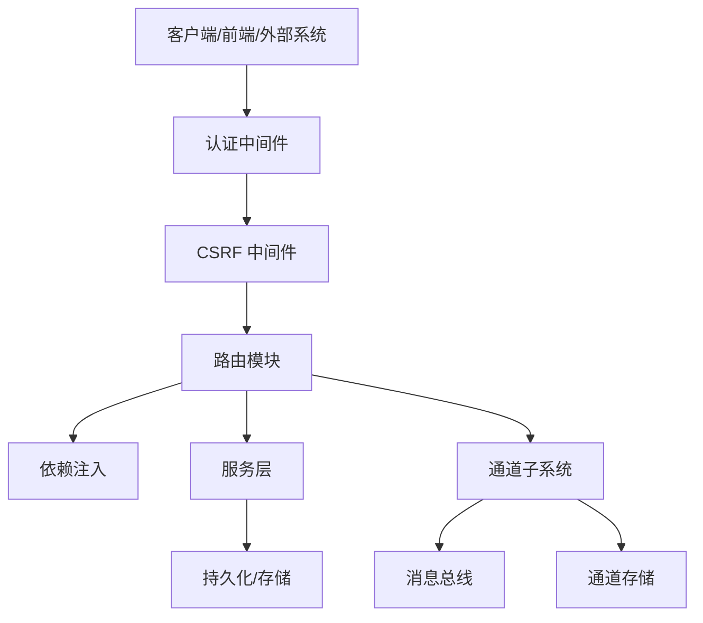
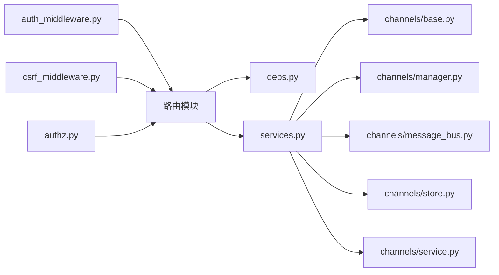

# 路由系统

<cite>
**本文引用的文件**
- [backend/app/gateway/routers/threads.py](file://backend/app/gateway/routers/threads.py)
- [backend/app/gateway/routers/runs.py](file://backend/app/gateway/routers/runs.py)
- [backend/app/gateway/routers/skills.py](file://backend/app/gateway/routers/skills.py)
- [backend/app/gateway/routers/agents.py](file://backend/app/gateway/routers/agents.py)
- [backend/app/gateway/routers/memory.py](file://backend/app/gateway/routers/memory.py)
- [backend/app/gateway/routers/channels.py](file://backend/app/gateway/routers/channels.py)
- [backend/app/gateway/routers/artifacts.py](file://backend/app/gateway/routers/artifacts.py)
- [backend/app/gateway/routers/uploads.py](file://backend/app/gateway/routers/uploads.py)
- [backend/app/gateway/routers/thread_runs.py](file://backend/app/gateway/routers/thread_runs.py)
- [backend/app/gateway/routers/models.py](file://backend/app/gateway/routers/models.py)
- [backend/app/gateway/routers/mcp.py](file://backend/app/gateway/routers/mcp.py)
- [backend/app/gateway/routers/suggestions.py](file://backend/app/gateway/routers/suggestions.py)
- [backend/app/gateway/routers/feedback.py](file://backend/app/gateway/routers/feedback.py)
- [backend/app/gateway/routers/assists_compat.py](file://backend/app/gateway/routers/assistants_compat.py)
- [backend/app/gateway/app.py](file://backend/app/gateway/app.py)
- [backend/app/gateway/deps.py](file://backend/app/gateway/deps.py)
- [backend/app/gateway/auth_middleware.py](file://backend/app/gateway/auth_middleware.py)
- [backend/app/gateway/csrf_middleware.py](file://backend/app/gateway/csrf_middleware.py)
- [backend/app/gateway/authz.py](file://backend/app/gateway/authz.py)
- [backend/app/gateway/services.py](file://backend/app/gateway/services.py)
- [backend/app/gateway/utils.py](file://backend/app/gateway/utils.py)
- [backend/app/gateway/path_utils.py](file://backend/app/gateway/path_utils.py)
- [backend/app/channels/base.py](file://backend/app/channels/base.py)
- [backend/app/channels/manager.py](file://backend/app/channels/manager.py)
- [backend/app/channels/message_bus.py](file://backend/app/channels/message_bus.py)
- [backend/app/channels/store.py](file://backend/app/channels/store.py)
- [backend/app/channels/service.py](file://backend/app/channels/service.py)
- [backend/docs/API.md](file://backend/docs/API.md)
</cite>

## 目录
1. [简介](#简介)
2. [项目结构](#项目结构)
3. [核心组件](#核心组件)
4. [架构总览](#架构总览)
5. [详细组件分析](#详细组件分析)
6. [依赖关系分析](#依赖关系分析)
7. [性能考虑](#性能考虑)
8. [故障排查指南](#故障排查指南)
9. [结论](#结论)
10. [附录](#附录)

## 简介
本文件系统性梳理 DeerFlow 的路由系统，围绕模块化路由设计、RESTful API 端点组织与路由分发机制展开，重点覆盖 threads、runs、skills、agents、memory、channels 等核心路由模块。文档同时提供端点组织方式、请求响应规范、错误处理策略、参数验证机制与版本管理建议，并给出扩展方法与最佳实践。

## 项目结构
后端采用基于模块化的 FastAPI 应用，路由按功能域划分在 gateway/routers 下，通过应用入口统一挂载。各路由模块负责特定资源的 CRUD 与业务流程编排；通道模块独立于路由层，提供消息通道抽象与事件总线能力。

```mermaid
graph TB
subgraph "应用入口"
APP["gateway/app.py"]
end
subgraph "路由模块"
TH["routers/threads.py"]
RU["routers/runs.py"]
SK["routers/skills.py"]
AG["routers/agents.py"]
ME["routers/memory.py"]
CH["routers/channels.py"]
AR["routers/artifacts.py"]
UP["routers/uploads.py"]
TR["routers/thread_runs.py"]
MD["routers/models.py"]
MC["routers/mcp.py"]
SG["routers/suggestions.py"]
FD["routers/feedback.py"]
AC["routers/assistants_compat.py"]
end
subgraph "通用支撑"
DEPS["deps.py"]
AUTHMW["auth_middleware.py"]
CSRF["csrf_middleware.py"]
AUTHZ["authz.py"]
SRV["services.py"]
UTIL["utils.py"]
PATH["path_utils.py"]
end
subgraph "通道子系统"
BASE["channels/base.py"]
MGR["channels/manager.py"]
BUS["channels/message_bus.py"]
STORE["channels/store.py"]
SVC["channels/service.py"]
end
APP --> TH
APP --> RU
APP --> SK
APP --> AG
APP --> ME
APP --> CH
APP --> AR
APP --> UP
APP --> TR
APP --> MD
APP --> MC
APP --> SG
APP --> FD
APP --> AC
TH --> DEPS
RU --> DEPS
SK --> DEPS
AG --> DEPS
ME --> DEPS
CH --> DEPS
AR --> DEPS
UP --> DEPS
TR --> DEPS
MD --> DEPS
MC --> DEPS
SG --> DEPS
FD --> DEPS
AC --> DEPS
TH --> SRV
RU --> SRV
SK --> SRV
AG --> SRV
ME --> SRV
CH --> SRV
AR --> SRV
UP --> SRV
TR --> SRV
MD --> SRV
MC --> SRV
SG --> SRV
FD --> SRV
AC --> SRV
CH --> BASE
CH --> MGR
CH --> BUS
CH --> STORE
CH --> SVC
```

图示来源
- [backend/app/gateway/app.py](file://backend/app/gateway/app.py)
- [backend/app/gateway/routers/threads.py](file://backend/app/gateway/routers/threads.py)
- [backend/app/gateway/routers/runs.py](file://backend/app/gateway/routers/runs.py)
- [backend/app/gateway/routers/skills.py](file://backend/app/gateway/routers/skills.py)
- [backend/app/gateway/routers/agents.py](file://backend/app/gateway/routers/agents.py)
- [backend/app/gateway/routers/memory.py](file://backend/app/gateway/routers/memory.py)
- [backend/app/gateway/routers/channels.py](file://backend/app/gateway/routers/channels.py)
- [backend/app/gateway/routers/artifacts.py](file://backend/app/gateway/routers/artifacts.py)
- [backend/app/gateway/routers/uploads.py](file://backend/app/gateway/routers/uploads.py)
- [backend/app/gateway/routers/thread_runs.py](file://backend/app/gateway/routers/thread_runs.py)
- [backend/app/gateway/routers/models.py](file://backend/app/gateway/routers/models.py)
- [backend/app/gateway/routers/mcp.py](file://backend/app/gateway/routers/mcp.py)
- [backend/app/gateway/routers/suggestions.py](file://backend/app/gateway/routers/suggestions.py)
- [backend/app/gateway/routers/feedback.py](file://backend/app/gateway/routers/feedback.py)
- [backend/app/gateway/routers/assistants_compat.py](file://backend/app/gateway/routers/assistants_compat.py)
- [backend/app/gateway/deps.py](file://backend/app/gateway/deps.py)
- [backend/app/gateway/services.py](file://backend/app/gateway/services.py)
- [backend/app/channels/base.py](file://backend/app/channels/base.py)
- [backend/app/channels/manager.py](file://backend/app/channels/manager.py)
- [backend/app/channels/message_bus.py](file://backend/app/channels/message_bus.py)
- [backend/app/channels/store.py](file://backend/app/channels/store.py)
- [backend/app/channels/service.py](file://backend/app/channels/service.py)

章节来源
- [backend/app/gateway/app.py](file://backend/app/gateway/app.py)
- [backend/app/gateway/routers/threads.py](file://backend/app/gateway/routers/threads.py)
- [backend/app/gateway/routers/runs.py](file://backend/app/gateway/routers/runs.py)
- [backend/app/gateway/routers/skills.py](file://backend/app/gateway/routers/skills.py)
- [backend/app/gateway/routers/agents.py](file://backend/app/gateway/routers/agents.py)
- [backend/app/gateway/routers/memory.py](file://backend/app/gateway/routers/memory.py)
- [backend/app/gateway/routers/channels.py](file://backend/app/gateway/routers/channels.py)
- [backend/app/gateway/routers/artifacts.py](file://backend/app/gateway/routers/artifacts.py)
- [backend/app/gateway/routers/uploads.py](file://backend/app/gateway/routers/uploads.py)
- [backend/app/gateway/routers/thread_runs.py](file://backend/app/gateway/routers/thread_runs.py)
- [backend/app/gateway/routers/models.py](file://backend/app/gateway/routers/models.py)
- [backend/app/gateway/routers/mcp.py](file://backend/app/gateway/routers/mcp.py)
- [backend/app/gateway/routers/suggestions.py](file://backend/app/gateway/routers/suggestions.py)
- [backend/app/gateway/routers/feedback.py](file://backend/app/gateway/routers/feedback.py)
- [backend/app/gateway/routers/assistants_compat.py](file://backend/app/gateway/routers/assistants_compat.py)

## 核心组件
- 应用入口与中间件：应用入口负责注册路由、中间件与异常处理器；认证中间件与 CSRF 中间件贯穿所有路由；授权策略在 authz 模块集中定义。
- 依赖注入：deps 提供跨路由共享的依赖（如数据库会话、配置、服务工厂等），确保路由层轻量化。
- 服务层：services 聚合业务逻辑，路由仅做参数校验与调用转发。
- 通道子系统：channels 提供多渠道抽象（钉钉、飞书、Slack、Discord、Telegram、微信企业微信等）的消息收发与事件总线，支持存储与消息分发。

章节来源
- [backend/app/gateway/app.py](file://backend/app/gateway/app.py)
- [backend/app/gateway/auth_middleware.py](file://backend/app/gateway/auth_middleware.py)
- [backend/app/gateway/csrf_middleware.py](file://backend/app/gateway/csrf_middleware.py)
- [backend/app/gateway/authz.py](file://backend/app/gateway/authz.py)
- [backend/app/gateway/deps.py](file://backend/app/gateway/deps.py)
- [backend/app/gateway/services.py](file://backend/app/gateway/services.py)
- [backend/app/channels/base.py](file://backend/app/channels/base.py)
- [backend/app/channels/manager.py](file://backend/app/channels/manager.py)
- [backend/app/channels/message_bus.py](file://backend/app/channels/message_bus.py)
- [backend/app/channels/store.py](file://backend/app/channels/store.py)
- [backend/app/channels/service.py](file://backend/app/channels/service.py)

## 架构总览
路由系统遵循“路由薄层 + 服务聚合 + 通道解耦”的设计原则。每个路由模块聚焦单一资源域，通过依赖注入获取服务实例，执行参数校验与权限检查后调用服务层完成业务操作。通道模块作为独立子系统，通过消息总线与存储组件与路由层松耦合交互。

图示来源
- [backend/app/gateway/app.py](file://backend/app/gateway/app.py)
- [backend/app/gateway/auth_middleware.py](file://backend/app/gateway/auth_middleware.py)
- [backend/app/gateway/csrf_middleware.py](file://backend/app/gateway/csrf_middleware.py)
- [backend/app/gateway/deps.py](file://backend/app/gateway/deps.py)
- [backend/app/gateway/services.py](file://backend/app/gateway/services.py)
- [backend/app/channels/message_bus.py](file://backend/app/channels/message_bus.py)
- [backend/app/channels/store.py](file://backend/app/channels/store.py)

## 详细组件分析

### threads 路由模块
- 设计理念：以线程（Thread）为中心的对话上下文容器，支持消息列表查询、线程元信息维护与关联运行（Run）的生命周期管理。
- 关键端点
  - 列出线程：GET /threads
  - 创建线程：POST /threads
  - 获取线程详情：GET /threads/{thread_id}
  - 更新线程：PATCH /threads/{thread_id}
  - 删除线程：DELETE /threads/{thread_id}
  - 查询线程消息：GET /threads/{thread_id}/messages
  - 创建消息：POST /threads/{thread_id}/messages
- 参数验证：使用路径参数 thread_id 的 UUID 校验与查询参数分页限制；消息内容字段必填性与长度约束。
- 错误处理：未找到线程返回 404；权限不足返回 403；参数非法返回 422；内部错误返回 500。
- 版本管理：通过路径前缀区分版本（如 /v1/threads），或通过 Accept/Content-Type 的媒体类型版本号控制。
- 扩展方法：新增线程标签、归档状态、自动清理策略等元数据字段时，保持向后兼容并在服务层进行默认值填充。

章节来源
- [backend/app/gateway/routers/threads.py](file://backend/app/gateway/routers/threads.py)

### runs 路由模块
- 设计理念：Run 是在 Thread 上执行的具体任务实例，支持启动、取消、轮询状态、流式输出与事件订阅。
- 关键端点
  - 在线程上创建 Run：POST /threads/{thread_id}/runs
  - 获取 Run 详情：GET /threads/{thread_id}/runs/{run_id}
  - 取消 Run：POST /threads/{thread_id}/runs/{run_id}/cancel
  - 流式获取 Run 输出：GET /threads/{thread_id}/runs/{run_id}/stream
  - 获取 Run 事件历史：GET /threads/{thread_id}/runs/{run_id}/events
- 参数验证：thread_id 与 run_id 的 UUID 校验；触发器（model、tools、instructions）参数必填性与格式校验；流式接口的 SSE 兼容头设置。
- 错误处理：Run 不存在、状态不合法、并发冲突、上游模型错误分别映射到 404/409/409/502。
- 版本管理：Run 接口可采用语义化版本，新增字段以可选形式加入，避免破坏性变更。
- 扩展方法：支持 Run 标签、优先级队列、超时策略与重试策略配置。

章节来源
- [backend/app/gateway/routers/runs.py](file://backend/app/gateway/routers/runs.py)

### skills 路由模块
- 设计理念：技能（Skill）是可复用的工具集合，支持安装、卸载、启用/禁用、权限控制与版本管理。
- 关键端点
  - 列出技能：GET /skills
  - 安装技能：POST /skills/install
  - 卸载技能：POST /skills/uninstall
  - 启用/禁用技能：PATCH /skills/{skill_id}
  - 技能详情：GET /skills/{skill_id}
  - 技能权限策略：PUT /skills/{skill_id}/permissions
- 参数验证：技能 ID 的合法性、安装包完整性校验、权限策略 JSON 结构校验。
- 错误处理：技能不存在、安装失败、权限策略冲突、磁盘空间不足等返回相应错误码。
- 版本管理：技能版本号与仓库分支/标签绑定，支持回滚与灰度发布。
- 扩展方法：引入技能依赖声明、安全扫描结果与合规标记。

章节来源
- [backend/app/gateway/routers/skills.py](file://backend/app/gateway/routers/skills.py)

### agents 路由模块
- 设计理念：代理（Agent）是具备记忆、计划与工具调用能力的智能体，支持创建、更新、克隆与批量管理。
- 关键端点
  - 创建代理：POST /agents
  - 获取代理：GET /agents/{agent_id}
  - 更新代理：PATCH /agents/{agent_id}
  - 删除代理：DELETE /agents/{agent_id}
  - 克隆代理：POST /agents/{agent_id}/clone
  - 代理运行：POST /agents/{agent_id}/runs
- 参数验证：代理模板字段完整性、工具选择合法性、模型参数有效性。
- 错误处理：代理模板缺失、工具不可用、模型配额不足等。
- 版本管理：代理配置版本化，支持快照与差异比较。
- 扩展方法：代理组与继承链、运行时插件注入。

章节来源
- [backend/app/gateway/routers/agents.py](file://backend/app/gateway/routers/agents.py)

### memory 路由模块
- 设计理念：记忆（Memory）模块提供用户/线程/会话级别的上下文存储与检索，支持增删改查与检索增强。
- 关键端点
  - 写入记忆：POST /memory
  - 查询记忆：GET /memory
  - 清理过期记忆：DELETE /memory/cleanup
  - 记忆统计：GET /memory/stats
- 参数验证：过滤条件（时间范围、用户标识、线程标识）、分页参数、排序字段白名单。
- 错误处理：存储后端不可用、索引损坏、权限越权。
- 版本管理：记忆 Schema 进化采用迁移脚本与兼容读写。
- 扩展方法：向量检索、关键词检索与混合检索策略。

章节来源
- [backend/app/gateway/routers/memory.py](file://backend/app/gateway/routers/memory.py)

### channels 路由模块
- 设计理念：通道路由负责对外暴露各消息通道的接入端点，统一鉴权与参数校验，内部通过通道服务与消息总线完成事件分发。
- 关键端点
  - 通道回调入口：POST /channels/{channel_type}/callback
  - 通道配置：PUT /channels/{channel_type}/config
  - 发送消息：POST /channels/{channel_type}/send
  - 通道事件订阅：GET /channels/{channel_type}/events
- 参数验证：通道类型白名单、回调签名验证、消息内容结构校验。
- 错误处理：通道未配置、签名失败、消息发送失败、限流与风控拦截。
- 版本管理：通道协议版本与回调签名算法版本分离管理。
- 扩展方法：自定义通道适配器、异步回调与幂等重放。

章节来源
- [backend/app/gateway/routers/channels.py](file://backend/app/gateway/routers/channels.py)

### artifacts 上传与附件路由
- 设计理念：artifacts 与 uploads 路由共同构成文件与产物的上传、存储与分发能力，支持临时令牌、直传与后续关联。
- 关键端点
  - 生成上传令牌：POST /uploads/token
  - 上传文件：POST /uploads
  - 获取文件信息：GET /uploads/{upload_id}
  - 关联到线程/Run：POST /threads/{thread_id}/artifacts
- 参数验证：文件大小限制、MIME 类型白名单、上传有效期与签名。
- 错误处理：文件过大、类型不支持、签名过期、存储失败。
- 版本管理：上传协议版本与签名算法版本分离。
- 扩展方法：断点续传、多段上传与预签名直传。

章节来源
- [backend/app/gateway/routers/artifacts.py](file://backend/app/gateway/routers/artifacts.py)
- [backend/app/gateway/routers/uploads.py](file://backend/app/gateway/routers/uploads.py)

### thread_runs 组合路由
- 设计理念：thread_runs 将线程与运行组合视图暴露，便于前端一次性获取线程与其运行列表，减少往返。
- 关键端点
  - 获取线程及其运行：GET /threads/{thread_id}/runs
  - 导出线程运行报告：GET /threads/{thread_id}/runs/export
- 参数验证：线程存在性校验、运行状态过滤、导出格式与时间范围。
- 错误处理：线程不存在、导出失败、格式不支持。
- 版本管理：组合视图采用独立版本号，避免与单资源版本耦合。

章节来源
- [backend/app/gateway/routers/thread_runs.py](file://backend/app/gateway/routers/thread_runs.py)

### models 与 MCP 路由
- models：模型注册与发现，支持模型别名、可用性切换与健康检查。
- mcp：MCP（Model Context Protocol）集成端点，用于外部工具与模型的桥接。
- 参数与错误处理：遵循各自协议规范，统一返回标准错误码与日志追踪 ID。

章节来源
- [backend/app/gateway/routers/models.py](file://backend/app/gateway/routers/models.py)
- [backend/app/gateway/routers/mcp.py](file://backend/app/gateway/routers/mcp.py)

### suggestions 与 feedback 路由
- suggestions：输入建议与补全，支持基于上下文的动态建议。
- feedback：用户反馈收集与分类，支持匿名与实名两种模式。
- 参数与错误处理：建议内容长度与敏感词过滤，反馈类型枚举与必填字段校验。

章节来源
- [backend/app/gateway/routers/suggestions.py](file://backend/app/gateway/routers/suggestions.py)
- [backend/app/gateway/routers/feedback.py](file://backend/app/gateway/routers/feedback.py)

### assistants 兼容路由
- 作用：为 OpenAI Assistants 生态提供兼容端点，便于迁移与互通。
- 参数与错误处理：严格遵循 Assistants API 规范，错误映射到标准响应格式。

章节来源
- [backend/app/gateway/routers/assistants_compat.py](file://backend/app/gateway/routers/assistants_compat.py)

## 依赖关系分析
- 路由到依赖：各路由模块通过 deps 注入数据库会话、配置对象、服务工厂与工具集。
- 路由到服务：路由仅做参数与权限校验，具体业务逻辑委托给 services。
- 服务到通道：通道相关业务通过 channels 子系统完成消息收发与事件总线派发。
- 中间件：认证与 CSRF 中间件在路由前执行，授权策略在 authz 中集中定义。

图示来源
- [backend/app/gateway/routers/threads.py](file://backend/app/gateway/routers/threads.py)
- [backend/app/gateway/routers/runs.py](file://backend/app/gateway/routers/runs.py)
- [backend/app/gateway/routers/skills.py](file://backend/app/gateway/routers/skills.py)
- [backend/app/gateway/routers/agents.py](file://backend/app/gateway/routers/agents.py)
- [backend/app/gateway/routers/memory.py](file://backend/app/gateway/routers/memory.py)
- [backend/app/gateway/routers/channels.py](file://backend/app/gateway/routers/channels.py)
- [backend/app/gateway/deps.py](file://backend/app/gateway/deps.py)
- [backend/app/gateway/services.py](file://backend/app/gateway/services.py)
- [backend/app/gateway/auth_middleware.py](file://backend/app/gateway/auth_middleware.py)
- [backend/app/gateway/csrf_middleware.py](file://backend/app/gateway/csrf_middleware.py)
- [backend/app/gateway/authz.py](file://backend/app/gateway/authz.py)
- [backend/app/channels/base.py](file://backend/app/channels/base.py)
- [backend/app/channels/manager.py](file://backend/app/channels/manager.py)
- [backend/app/channels/message_bus.py](file://backend/app/channels/message_bus.py)
- [backend/app/channels/store.py](file://backend/app/channels/store.py)
- [backend/app/channels/service.py](file://backend/app/channels/service.py)

## 性能考虑
- 路由薄层：避免在路由中执行复杂计算，将 CPU 密集型任务下沉至服务层或后台作业。
- 缓存策略：对只读查询（如技能列表、模型清单）启用短期缓存，结合 ETag/Last-Modified 实现条件请求。
- 分页与投影：默认分页大小限制与字段投影，降低网络与序列化开销。
- 并发与限流：在中间件层实施基于 IP/用户/密钥的速率限制，防止滥用。
- 异步与流式：对长耗时任务采用异步执行与 SSE 流式推送，提升用户体验。
- 存储优化：对高频访问的记忆与消息建立索引，定期清理过期数据。

## 故障排查指南
- 常见错误码
  - 400：请求参数无效（字段缺失、类型错误、超出长度）
  - 401：未认证或 Token 失效
  - 403：权限不足或被风控拦截
  - 404：资源不存在（线程、Run、技能、代理等）
  - 409：状态冲突（Run 正在运行时取消）
  - 422：语义校验失败（JSON 结构不合法）
  - 429：请求过于频繁（触发限流）
  - 500：服务器内部错误
  - 502：上游服务不可用
- 排查步骤
  - 检查中间件链路（认证、CSRF、授权）是否正确传递
  - 查看服务层日志与追踪 ID，定位具体失败环节
  - 对通道类问题，检查消息总线与存储连接状态
  - 对上传类问题，核对签名、MIME 类型与存储配额
- 诊断工具
  - 使用 API 文档与 OpenAPI 校验请求格式
  - 启用调试模式输出中间件执行时间与 SQL 日志

章节来源
- [backend/app/gateway/auth_middleware.py](file://backend/app/gateway/auth_middleware.py)
- [backend/app/gateway/csrf_middleware.py](file://backend/app/gateway/csrf_middleware.py)
- [backend/app/gateway/authz.py](file://backend/app/gateway/authz.py)
- [backend/docs/API.md](file://backend/docs/API.md)

## 结论
DeerFlow 路由系统通过模块化设计实现了清晰的职责边界与良好的扩展性。核心路由模块围绕线程、运行、技能、代理、记忆与通道构建了完整的对话与智能体工作流；配合依赖注入、中间件与服务层，形成高内聚低耦合的架构。未来可在版本化管理、参数校验与通道协议标准化方面持续演进，进一步提升系统的稳定性与可维护性。

## 附录
- API 端点组织建议
  - 按资源域分组：threads、runs、skills、agents、memory、channels、artifacts、uploads
  - 版本前缀：/v1、/v2 或媒体类型版本
  - 兼容路由：保留旧版端点并标注废弃时间
- 参数验证机制
  - 使用 Pydantic 模型进行请求体与查询参数校验
  - 对路径参数进行 UUID 与存在性校验
  - 对敏感字段进行长度、字符集与黑名单过滤
- 版本管理策略
  - 语义化版本：主版本用于破坏性变更，次版本用于新增功能，修订版本用于修复
  - 向后兼容：新增字段默认可选，旧字段保留读写
  - 迁移脚本：对存储 Schema 变更提供自动化迁移
- 扩展方法
  - 新增路由模块：遵循现有命名与目录约定，复用 deps 与 services
  - 自定义通道：实现通道适配器接口，注册到通道管理器
  - 插件化技能：通过解析器与权限策略实现可插拔工具集